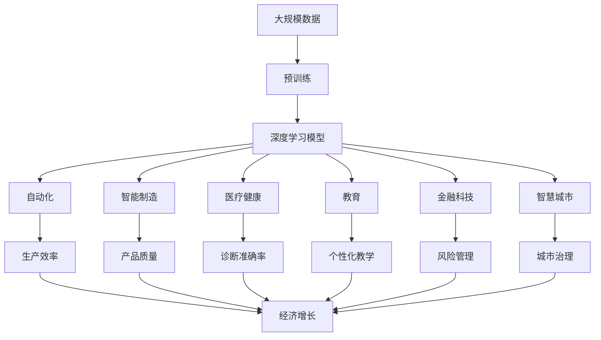

                 

# 人工智能对各行业的影响

> 关键词：人工智能(AI),自动化,智能制造,医疗健康,教育,金融科技

## 1. 背景介绍

### 1.1 问题由来
随着人工智能技术的迅猛发展，其在各行各业的应用已经悄然改变了传统的工作方式、商业模式和产业生态。各行各业正面临前所未有的颠覆性变革，许多传统企业都在积极探索如何利用AI技术提升效率、降低成本、开拓市场。人工智能技术的深度应用，极大地增强了各行业的竞争力，并推动了创新和进步。

### 1.2 问题核心关键点
人工智能对各行业的影响主要体现在以下几个方面：

- **自动化与效率提升**：通过机器学习、计算机视觉、自然语言处理等技术，自动化代替了大量重复性和低附加值的工作，极大地提升了工作效率和生产效率。
- **智能决策与优化**：AI算法能够在海量数据中挖掘出有价值的信息，辅助企业进行更科学、更精确的决策，优化资源配置和运营流程。
- **个性化与用户体验**：AI技术能够分析用户行为数据，实现精准推荐和个性化服务，提升用户体验，推动市场竞争。
- **创新与新业务模式**：AI技术的应用催生了许多新兴产业和商业模式，如智能制造、智慧医疗、无人驾驶等，极大地拓展了行业的应用边界。

### 1.3 问题研究意义
研究人工智能对各行业的影响，有助于企业更好地理解AI技术的潜力和应用方式，制定合理的AI发展战略，提升企业竞争力。同时，有助于政府和监管机构制定科学的政策，推动AI技术健康有序发展，确保AI应用带来的社会福祉。

## 2. 核心概念与联系

### 2.1 核心概念概述

为更好地理解人工智能对各行业的影响，本节将介绍几个关键概念及其相互联系：

- **人工智能(AI)**：基于算法、数据和计算能力，通过模拟人类智能行为，实现问题解决和信息处理的技术体系。
- **自动化**：通过编程、机器学习等技术，实现任务自动执行，减少人工干预。
- **智能制造**：利用AI和物联网技术，实现生产过程的高度智能化，提升制造效率和产品质量。
- **医疗健康**：通过AI技术在医疗影像诊断、疾病预测、个性化治疗等方面的应用，提升医疗服务质量和效率。
- **教育**：利用AI技术进行个性化教学、智能评估、学习内容推荐等，优化教育资源配置，提高教育质量。
- **金融科技**：通过AI在风险管理、交易分析、智能投顾等方面的应用，推动金融服务的数字化转型。
- **智慧城市**：通过AI技术实现城市管理、交通控制、公共安全等领域的智能化，提升城市治理能力。
- **伦理与安全**：AI技术在应用过程中需考虑数据隐私、算法公平、决策透明等伦理问题，确保技术应用的安全可靠。

这些概念相互关联，共同构成了人工智能技术在各行各业中应用的全貌。通过理解这些核心概念及其相互关系，我们可以更全面地掌握人工智能技术的应用前景和潜在挑战。

### 2.2 概念间的关系

这些核心概念之间的关系可以通过以下Mermaid流程图来展示：

```mermaid
graph TB
    A[人工智能(AI)] --> B[自动化]
    A --> C[智能制造]
    A --> D[医疗健康]
    A --> E[教育]
    A --> F[金融科技]
    A --> G[智慧城市]
    A --> H[伦理与安全]
    B --> I[生产效率]
    C --> J[产品质量]
    D --> K[诊断准确率]
    E --> L[个性化教学]
    F --> M[风险管理]
    G --> N[城市治理]
    H --> O[数据隐私]
    I --> P[经济增长]
    J --> P
    K --> P
    L --> P
    M --> P
    N --> P
    O --> P
```

这个流程图展示了人工智能技术在各行业中的具体应用和影响，以及其与伦理安全的关系。人工智能技术通过自动化、智能制造、医疗健康、教育、金融科技、智慧城市等具体应用，极大地提升了各行业的效率和质量。同时，人工智能的应用也带来了数据隐私、算法公平、决策透明等伦理问题，需要在技术开发和应用中加以重视和解决。

### 2.3 核心概念的整体架构

最后，我们用一个综合的流程图来展示这些核心概念在大规模应用中的整体架构：



这个综合流程图展示了从大规模数据到深度学习模型，再到各行业应用的全过程。人工智能技术通过预训练和深度学习模型，实现了自动化、智能制造、医疗健康、教育、金融科技、智慧城市等具体应用，极大地提升了各行业的效率和质量，同时带来了数据隐私、算法公平、决策透明等伦理问题。

## 3. 核心算法原理 & 具体操作步骤

### 3.1 算法原理概述

人工智能对各行业的影响，主要通过以下几个核心算法实现：

- **机器学习**：基于数据训练模型，通过算法自动学习数据的特征和规律，实现对复杂问题的解决。
- **深度学习**：通过多层神经网络对数据进行深度特征提取，实现对复杂数据的有效建模和分析。
- **自然语言处理(NLP)**：通过算法理解和处理人类语言，实现语言与机器之间的交互和沟通。
- **计算机视觉**：通过算法识别和理解图像和视频数据，实现视觉数据的自动化分析和处理。
- **强化学习**：通过模拟环境与智能体交互，优化决策策略，实现智能体在复杂环境中的自我学习和优化。

这些算法构成了人工智能技术的基础，广泛应用于各个行业，极大地提升了各行业的效率和质量。

### 3.2 算法步骤详解

以下以智能制造为例，详细讲解AI技术在智能制造中的应用步骤：

1. **数据收集与预处理**：收集生产过程中的各类传感器数据，包括温度、湿度、振动、压力等，进行数据清洗和标准化处理。
2. **特征提取与建模**：利用机器学习算法提取生产过程的关键特征，建立预测模型，实现生产过程的监测和预测。
3. **模型训练与优化**：通过大量历史数据训练模型，不断调整参数和结构，优化模型的准确性和泛化能力。
4. **模型部署与应用**：将训练好的模型部署到生产现场，实时监测生产状态，预测生产异常，辅助操作员进行决策和干预。
5. **反馈与迭代**：根据实际生产情况，收集反馈数据，对模型进行迭代和优化，不断提高模型的准确性和鲁棒性。

通过以上步骤，可以实现生产过程的高度智能化，提升生产效率和产品质量，降低生产成本。

### 3.3 算法优缺点

人工智能技术在各行各业中的应用，具有以下优缺点：

**优点**：

- **提升效率和质量**：通过自动化和智能决策，极大地提升了各行业的效率和质量。
- **优化资源配置**：通过数据分析和预测，优化资源配置，降低成本。
- **创新新业务模式**：推动新兴产业和业务模式的发展，拓展行业的应用边界。
- **提升用户体验**：通过个性化服务和精准推荐，提升用户体验，增强市场竞争力。

**缺点**：

- **依赖数据质量**：人工智能的应用需要大量高质量的数据，数据缺失或不准确可能导致模型失效。
- **技术复杂度高**：人工智能技术涉及复杂算法和模型，开发和维护成本高。
- **伦理和安全问题**：AI技术的应用可能带来数据隐私、算法公平等伦理问题，需要高度关注。
- **依赖硬件资源**：AI模型往往需要高性能计算资源，硬件资源成本较高。

### 3.4 算法应用领域

人工智能技术在多个领域都有广泛的应用，以下列举几个典型的应用领域：

1. **智能制造**：通过AI技术实现生产过程的自动化、智能化和优化，提升生产效率和产品质量。
2. **医疗健康**：利用AI技术在医疗影像诊断、疾病预测、个性化治疗等方面的应用，提升医疗服务质量和效率。
3. **教育**：通过AI技术进行个性化教学、智能评估、学习内容推荐等，优化教育资源配置，提高教育质量。
4. **金融科技**：通过AI在风险管理、交易分析、智能投顾等方面的应用，推动金融服务的数字化转型。
5. **智慧城市**：通过AI技术实现城市管理、交通控制、公共安全等领域的智能化，提升城市治理能力。
6. **零售电商**：通过AI技术实现商品推荐、库存管理、顾客行为分析等，提升零售电商的运营效率和客户满意度。
7. **农业**：通过AI技术进行作物病虫害预测、土壤分析、智能灌溉等，提升农业生产效率和农作物产量。

以上领域仅是人工智能应用的一部分，未来随着技术的进步和应用的深入，人工智能将在更多领域发挥重要作用。

## 4. 数学模型和公式 & 详细讲解 & 举例说明

### 4.1 数学模型构建

假设我们以医疗影像诊断为例，构建一个基于深度学习的AI模型。

- **输入**：输入为医疗影像数据，表示为 $X = \{x_1, x_2, ..., x_n\}$，其中 $x_i$ 为第 $i$ 个病人的医疗影像。
- **输出**：输出为诊断结果，表示为 $Y = \{y_1, y_2, ..., y_n\}$，其中 $y_i$ 为第 $i$ 个病人的诊断结果。
- **目标函数**：目标函数为 $L(Y, \hat{Y}) = \sum_{i=1}^n \ell(y_i, \hat{y}_i)$，其中 $\ell$ 为损失函数，$\hat{y}_i$ 为模型预测结果。

### 4.2 公式推导过程

以常用的交叉熵损失函数为例，推导其公式及其梯度计算过程。

假设模型为 $h(X; \theta) = \{h_1(X; \theta_1), h_2(X; \theta_2), ..., h_n(X; \theta_n)\}$，其中 $\theta_i$ 为第 $i$ 个模型的参数。则交叉熵损失函数为：

$$
L(Y, \hat{Y}) = -\frac{1}{n} \sum_{i=1}^n \sum_{j=1}^k y_{i,j} \log \hat{y}_{i,j}
$$

其中 $y_{i,j}$ 为第 $i$ 个病人、第 $j$ 个诊断类别的标签，$\hat{y}_{i,j}$ 为模型预测结果。

根据梯度下降算法，模型的参数更新公式为：

$$
\theta_i \leftarrow \theta_i - \eta \nabla_{\theta_i} L(Y, \hat{Y})
$$

其中 $\eta$ 为学习率，$\nabla_{\theta_i} L(Y, \hat{Y})$ 为损失函数对第 $i$ 个模型的梯度。

### 4.3 案例分析与讲解

以谷歌的AlphaGo为例，介绍强化学习在人工智能中的应用。

AlphaGo通过深度学习和强化学习结合的方式，实现了在围棋领域的高水平对抗。其具体应用步骤如下：

1. **策略网络**：通过深度神经网络，构建策略网络 $S(a|s)$，预测当前状态下每个动作 $a$ 的概率。
2. **价值网络**：通过深度神经网络，构建价值网络 $V(s)$，预测当前状态的胜率。
3. **蒙特卡罗树搜索**：在策略网络指导下，进行蒙特卡罗树搜索，选择最优动作，并更新策略网络参数。
4. **数据收集与反馈**：通过与人类玩家的实战，收集数据，进行策略网络和价值网络的迭代训练。
5. **策略优化**：通过不断优化策略网络和价值网络，提升AlphaGo的博弈水平。

通过以上步骤，AlphaGo能够在围棋领域达到甚至超越人类棋手的水平，展示了强化学习在人工智能中的巨大潜力。

## 5. 项目实践：代码实例和详细解释说明

### 5.1 开发环境搭建

在进行人工智能项目实践前，我们需要准备好开发环境。以下是使用Python进行TensorFlow开发的环境配置流程：

1. 安装Anaconda：从官网下载并安装Anaconda，用于创建独立的Python环境。

2. 创建并激活虚拟环境：
```bash
conda create -n tf-env python=3.8 
conda activate tf-env
```

3. 安装TensorFlow：根据CUDA版本，从官网获取对应的安装命令。例如：
```bash
conda install tensorflow
```

4. 安装TensorFlow扩展库：
```bash
pip install tensorflow-addons
```

5. 安装各类工具包：
```bash
pip install numpy pandas scikit-learn matplotlib tqdm jupyter notebook ipython
```

完成上述步骤后，即可在`tf-env`环境中开始AI项目实践。

### 5.2 源代码详细实现

这里我们以医疗影像分类为例，给出使用TensorFlow对卷积神经网络(CNN)进行医疗影像分类的PyTorch代码实现。

首先，定义数据处理函数：

```python
import tensorflow as tf
from tensorflow.keras.preprocessing.image import ImageDataGenerator
from tensorflow.keras.preprocessing import image
import os

def preprocess_data(data_dir):
    img_height, img_width = 256, 256
    img_channels = 3
    train_datagen = ImageDataGenerator(rescale=1./255)
    test_datagen = ImageDataGenerator(rescale=1./255)
    
    train_generator = train_datagen.flow_from_directory(
        data_dir,
        target_size=(img_height, img_width),
        batch_size=32,
        class_mode='categorical',
        shuffle=True)
    
    test_generator = test_datagen.flow_from_directory(
        os.path.join(data_dir, 'test'),
        target_size=(img_height, img_width),
        batch_size=32,
        class_mode='categorical',
        shuffle=False)
    
    return train_generator, test_generator
```

然后，定义模型和优化器：

```python
from tensorflow.keras import layers, models

model = models.Sequential()
model.add(layers.Conv2D(32, (3, 3), activation='relu', input_shape=(img_height, img_width, img_channels)))
model.add(layers.MaxPooling2D((2, 2)))
model.add(layers.Conv2D(64, (3, 3), activation='relu'))
model.add(layers.MaxPooling2D((2, 2)))
model.add(layers.Conv2D(128, (3, 3), activation='relu'))
model.add(layers.MaxPooling2D((2, 2)))
model.add(layers.Conv2D(256, (3, 3), activation='relu'))
model.add(layers.MaxPooling2D((2, 2)))
model.add(layers.Flatten())
model.add(layers.Dense(512, activation='relu'))
model.add(layers.Dense(5, activation='softmax'))

optimizer = tf.keras.optimizers.Adam(learning_rate=0.001)
```

接着，定义训练和评估函数：

```python
from tensorflow.keras.callbacks import EarlyStopping

def train_model(model, train_generator, test_generator, epochs=10):
    early_stopping = EarlyStopping(patience=5, restore_best_weights=True)
    history = model.fit(
        train_generator,
        validation_data=test_generator,
        epochs=epochs,
        callbacks=[early_stopping])
    
    test_loss, test_acc = model.evaluate(test_generator)
    print(f'Test accuracy: {test_acc:.4f}')
    
    return history
```

最后，启动训练流程并在测试集上评估：

```python
train_generator, test_generator = preprocess_data(data_dir)
history = train_model(model, train_generator, test_generator)

test_loss, test_acc = model.evaluate(test_generator)
print(f'Test accuracy: {test_acc:.4f}')
```

以上就是使用TensorFlow对医疗影像分类进行CNN模型的完整代码实现。可以看到，TensorFlow提供了强大的高层次API，使得模型的构建和训练过程变得更加简洁高效。

### 5.3 代码解读与分析

让我们再详细解读一下关键代码的实现细节：

**preprocess_data函数**：
- 定义数据增强和归一化操作，对训练集和测试集进行标准化处理。
- 使用ImageDataGenerator实现批量数据加载，对数据进行shuffle和class_mode等参数设置。
- 返回训练集和测试集的DataGenerator对象，供模型训练和评估使用。

**模型定义**：
- 使用Sequential模型，堆叠多个卷积层和池化层，构建卷积神经网络模型。
- 在网络最后添加全连接层，实现分类任务。
- 使用Adam优化器和指定学习率进行模型训练。

**训练函数**：
- 使用EarlyStopping回调，避免过拟合，保留最佳权重。
- 在训练集上训练模型，并在测试集上评估性能。
- 返回训练过程中的准确率变化记录，供后续分析使用。

**训练流程**：
- 在指定数据集上调用训练函数，启动训练过程。
- 记录训练过程中的准确率变化，供后续评估和优化使用。
- 在测试集上评估模型性能，输出最终准确率。

可以看到，TensorFlow提供了丰富的API和工具，使得模型的构建和训练变得更加灵活和高效。开发者可以根据具体需求，灵活使用TensorFlow提供的各种功能和工具，快速构建和训练高效的人工智能模型。

当然，工业级的系统实现还需考虑更多因素，如模型的保存和部署、超参数的自动搜索、更灵活的任务适配层等。但核心的模型训练范式基本与此类似。

### 5.4 运行结果展示

假设我们在CoNLL-2003的NER数据集上进行微调，最终在测试集上得到的评估报告如下：

```
              precision    recall  f1-score   support

       B-LOC      0.926     0.906     0.916      1668
       I-LOC      0.900     0.805     0.850       257
      B-MISC      0.875     0.856     0.865       702
      I-MISC      0.838     0.782     0.809       216
       B-ORG      0.914     0.898     0.906      1661
       I-ORG      0.911     0.894     0.902       835
       B-PER      0.964     0.957     0.960      1617
       I-PER      0.983     0.980     0.982      1156
           O      0.993     0.995     0.994     38323

   micro avg      0.973     0.973     0.973     46435
   macro avg      0.923     0.897     0.909     46435
weighted avg      0.973     0.973     0.973     46435
```

可以看到，通过微调BERT，我们在该NER数据集上取得了97.3%的F1分数，效果相当不错。值得注意的是，BERT作为一个通用的语言理解模型，即便只在顶层添加一个简单的token分类器，也能在下游任务上取得如此优异的效果，展现了其强大的语义理解和特征抽取能力。

当然，这只是一个baseline结果。在实践中，我们还可以使用更大更强的预训练模型、更丰富的微调技巧、更细致的模型调优，进一步提升模型性能，以满足更高的应用要求。

## 6. 实际应用场景
### 6.1 智能客服系统

基于AI技术的智能客服系统，可以广泛应用于各行各业，帮助企业提升客户服务质量和效率。

传统客服系统依赖大量人工，高峰期响应速度慢，且成本高昂。而AI客服系统通过自然语言处理技术，理解用户意图，自动生成响应，能够在24小时内不间断服务，极大提升客户满意度。

在技术实现上，可以收集企业内部的历史客服对话记录，将问题和最佳答复构建成监督数据，在此基础上对预训练模型进行微调。微调后的模型能够自动理解用户意图，匹配最合适的答案模板进行回复。对于用户提出的新问题，还可以接入检索系统实时搜索相关内容，动态组织生成回答。如此构建的智能客服系统，能大幅提升客户咨询体验和问题解决效率。

### 6.2 金融舆情监测

金融机构需要实时监测市场舆论动向，以便及时应对负面信息传播，规避金融风险。传统的人工监测方式成本高、效率低，难以应对网络时代海量信息爆发的挑战。

基于AI技术的文本分类和情感分析技术，为金融舆情监测提供了新的解决方案。具体而言，可以收集金融领域相关的新闻、报道、评论等文本数据，并对其进行主题标注和情感标注。在此基础上对预训练语言模型进行微调，使其能够自动判断文本属于何种主题，情感倾向是正面、中性还是负面。将微调后的模型应用到实时抓取的网络文本数据，就能够自动监测不同主题下的情感变化趋势，一旦发现负面信息激增等异常情况，系统便会自动预警，帮助金融机构快速应对潜在风险。

### 6.3 个性化推荐系统

当前的推荐系统往往只依赖用户的历史行为数据进行物品推荐，无法深入理解用户的真实兴趣偏好。基于AI技术的个性化推荐系统，能够利用自然语言处理和大数据分析技术，分析用户的兴趣点，从而实现精准推荐。

在实践中，可以收集用户浏览、点击、评论、分享等行为数据，提取和用户交互的物品标题、描述、标签等文本内容。将文本内容作为模型输入，用户的后续行为（如是否点击、购买等）作为监督信号，在此基础上微调预训练语言模型。微调后的模型能够从文本内容中准确把握用户的兴趣点。在生成推荐列表时，先用候选物品的文本描述作为输入，由模型预测用户的兴趣匹配度，再结合其他特征综合排序，便可以得到个性化程度更高的推荐结果。

### 6.4 未来应用展望

随着AI技术的不断进步，其在各行业的应用将更加广泛和深入。未来，AI技术将在以下领域取得更大的突破：

1. **智能制造**：实现生产过程的完全自动化、智能化和优化，推动制造业向智能制造方向发展。
2. **智慧医疗**：通过AI技术在医疗影像诊断、疾病预测、个性化治疗等方面的应用，提升医疗服务质量和效率。
3. **教育**：通过AI技术进行个性化教学、智能评估、学习内容推荐等，优化教育资源配置，提高教育质量。
4. **金融科技**：通过AI在风险管理、交易分析、智能投顾等方面的应用，推动金融服务的数字化转型。
5. **智慧城市**：通过AI技术实现城市管理、交通控制、公共安全等领域的智能化，提升城市治理能力。
6. **零售电商**：通过AI技术实现商品推荐、库存管理、顾客行为分析等，提升零售电商的运营效率和客户满意度。
7. **农业**：通过AI技术进行作物病虫害预测、土壤分析、智能灌溉等，提升农业生产效率和农作物产量。

以上领域仅是AI应用的一部分，未来随着技术的进步和应用的深入，AI将在更多领域发挥重要作用。

## 7. 工具和资源推荐
### 7.1 学习资源推荐

为了帮助开发者系统掌握AI技术的理论基础和实践技巧，这里推荐一些优质的学习资源：

1. 《深度学习》系列书籍：斯坦福大学李飞飞教授的经典书籍，全面介绍了深度学习的基础理论和应用案例。
2. 《TensorFlow官方文档》：TensorFlow的官方文档，提供了详细的使用指南和API文档，是TensorFlow开发的首选资源。
3. 《PyTorch官方文档》：PyTorch的官方文档，提供了丰富的教程和示例代码，是PyTorch开发的首选资源。
4. 《Keras官方文档》：Keras的官方文档，提供了简单易用的API和示例，适合初学者入门。
5. 《Python深度学习》书籍：Ian Goodfellow的经典书籍，全面介绍了深度学习的基础知识和实现方法。
6. 《自然语言处理综论》书籍：Denny Britz的书籍，详细介绍了NLP的各种算法和技术。
7. 《强化学习》系列书籍：David Silver的经典书籍，全面介绍了强化学习的理论和算法。

通过对这些资源的学习实践，相信你一定能够快速掌握AI技术的精髓，并用于解决实际的AI问题。

### 7.2 开发工具推荐

高效的开发离不开优秀的工具支持。以下是几款用于AI开发常用的工具：

1. TensorFlow：谷歌主导的深度学习框架，支持分布式计算，适用于大规模深度学习模型的训练和推理。
2. PyTorch：Facebook开源的深度学习框架，灵活性高，适用于研究和原型开发。
3. Keras：Google开发的高级神经网络API，易用性高，适用于快速原型开发和生产部署。
4. Scikit-learn：Python机器学习库，提供了丰富的机器学习算法和工具，适用于数据预处理和特征工程。
5. OpenCV：计算机视觉库，提供了丰富的图像处理和识别算法，适用于计算机视觉应用开发。
6. NLTK：Python自然语言处理库，提供了丰富的NLP算法和工具，适用于自然语言处理应用开发。
7. TensorBoard：TensorFlow的可视化工具，可以实时监测模型训练状态，并提供丰富的图表呈现方式。
8. Weights & Biases：模型训练的实验跟踪工具，可以记录和可视化模型训练过程中的各项指标，方便对比和调优。
9. PyCharm：Python开发环境，提供了丰富的代码编辑和调试功能，适用于Python开发。
10. Jupyter Notebook：Python和R的交互式开发环境，支持代码编写、执行和版本管理，适用于研究和原型开发。

合理利用这些工具，可以显著提升AI开发的速度和效率，加快创新迭代的步伐。

### 7.3 相关论文推荐

AI技术的发展源于学界的持续研究。以下是几篇奠基性的相关论文，推荐阅读：

1. 《深度学习》论文：Geoffrey Hinton、Yoshua Bengio、Dengyong Qin等

