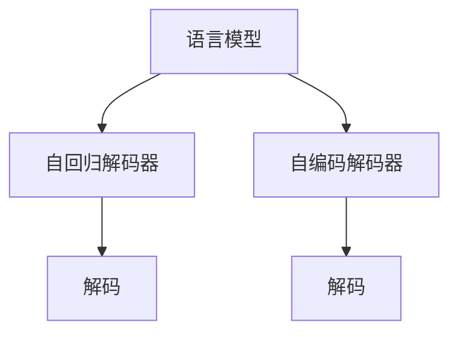
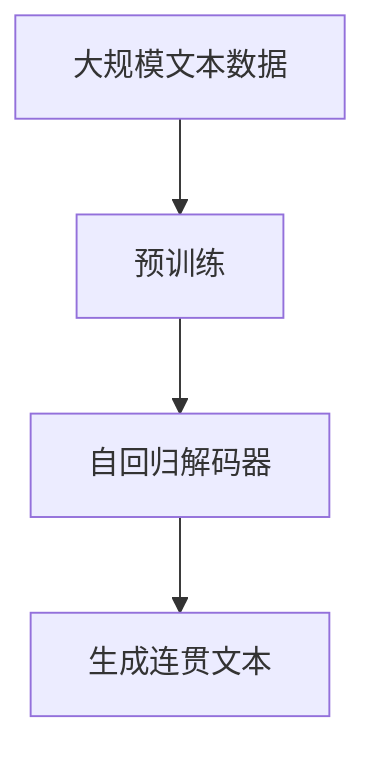

                 

# 人工智能的生成语意连贯性

## 1. 背景介绍

人工智能(AI)正迅速改变我们的世界，而生成语意连贯性是其核心能力之一。通过生成连贯的语言，AI可以更好地理解和处理自然语言，进而提供更准确、更智能的解决方案。本文将深入探讨生成语意连贯性的原理、算法和应用，以期帮助读者理解这一重要概念，并在实践中取得突破。

### 1.1 问题由来

在人工智能领域，生成语意连贯性主要涉及如何生成符合语法和语义规则的连续自然语言。这一问题由来已久，尤其是在自然语言处理(NLP)领域，它是语音识别、机器翻译、文本生成等任务的关键。然而，生成连贯的语言并非易事，因为自然语言的复杂性和多样性使得自动生成任务充满了挑战。

### 1.2 问题核心关键点

生成语意连贯性的核心在于如何让机器生成具有语法和语义合理性的自然语言序列。这一过程通常分为两个阶段：
1. **语言模型训练**：训练一个语言模型，使其能够预测给定上下文条件下下一个单词或短语的概率。
2. **文本生成**：使用训练好的语言模型，生成符合语法和语义规则的文本。

生成连贯的语言序列需要考虑上下文信息，确保生成的文本逻辑上通顺，语义上合理。此外，还需要保证生成的文本与上下文一致，符合对话情境。

### 1.3 问题研究意义

研究生成语意连贯性具有重要的理论和实际意义：
1. **提升自然语言理解与生成能力**：生成连贯的文本能够更准确地传达信息，增强自然语言处理系统的理解和生成能力。
2. **促进人工智能应用**：如机器翻译、语音识别、聊天机器人等应用，都需要生成连贯的语言才能实现高效沟通。
3. **推动语言技术发展**：生成语意连贯性技术的进步，能够推动NLP技术的进一步发展，提高机器处理自然语言的能力。

## 2. 核心概念与联系

### 2.1 核心概念概述

为了深入理解生成语意连贯性，我们需要先了解几个核心概念：

- **语言模型**：表示给定一段文本，其每个单词或短语出现的概率。语言模型是生成连贯文本的基础。
- **解码器**：语言模型的一部分，负责在给定前一个单词或短语的情况下，预测下一个单词或短语的概率。
- **自回归解码器**：一种解码器，它利用先前的输出作为输入，生成下一个单词或短语。
- **自编码解码器**：另一种解码器，它先对整个序列进行编码，然后再解码生成下一个单词或短语。

这些概念构成了生成语意连贯性的核心框架，帮助我们理解机器如何生成连贯的自然语言。

### 2.2 概念间的关系

这些核心概念之间的关系可以通过以下Mermaid流程图来展示：



这个流程图展示了语言模型、自回归解码器、自编码解码器与解码的关系：

- 语言模型A用于训练自回归解码器B和自编码解码器C。
- 解码器B和C用于生成文本序列D和E。

### 2.3 核心概念的整体架构

最终，我们将这些概念整合为生成语意连贯性的整体架构：



这个综合流程图展示了从预训练到生成连贯文本的完整过程：

1. 从大规模文本数据中预训练语言模型A。
2. 使用A训练自回归解码器C，用于生成连贯文本。

## 3. 核心算法原理 & 具体操作步骤

### 3.1 算法原理概述

生成语意连贯性的核心算法主要包括两个阶段：
1. **语言模型训练**：使用大量文本数据训练语言模型，使其能够预测给定上下文条件下下一个单词或短语的概率。
2. **文本生成**：使用训练好的语言模型，生成符合语法和语义规则的文本序列。

### 3.2 算法步骤详解

#### 3.2.1 语言模型训练

语言模型的训练通常采用最大似然估计法，目标是最小化预测错误。具体步骤如下：
1. 收集大量文本数据作为训练集。
2. 将文本数据切分为词序列。
3. 利用词序列训练语言模型。
4. 使用训练好的语言模型进行预测。

#### 3.2.2 文本生成

文本生成通常采用自回归解码器进行，具体步骤如下：
1. 使用语言模型训练的自回归解码器。
2. 给定初始文本，解码器从上下文开始预测下一个单词或短语。
3. 重复上述步骤，生成连贯的文本序列。

### 3.3 算法优缺点

生成语意连贯性算法的主要优点包括：
1. **高效**：通过使用大规模预训练语言模型，可以快速生成高质量文本。
2. **准确**：生成的文本通常语法和语义正确，符合上下文。

其主要缺点包括：
1. **数据依赖**：算法的性能很大程度上依赖于训练数据的质量和多样性。
2. **过拟合风险**：如果训练数据不足或过时，生成的文本可能出现不符合语境或语法错误。
3. **可解释性不足**：生成的文本过程复杂，难以解释其生成机制。

### 3.4 算法应用领域

生成语意连贯性算法在多个领域得到了广泛应用，包括：
1. **机器翻译**：利用生成的连贯文本进行翻译。
2. **文本生成**：如小说创作、新闻报道等。
3. **聊天机器人**：生成符合对话情境的自然语言回复。
4. **语音识别**：将生成的连贯文本转换为语音。

## 4. 数学模型和公式 & 详细讲解

### 4.1 数学模型构建

生成语意连贯性的数学模型主要包括以下几个部分：
1. **语言模型**：表示给定一段文本，其每个单词或短语出现的概率。
2. **解码器**：在给定前一个单词或短语的情况下，预测下一个单词或短语的概率。
3. **生成目标函数**：用于衡量生成的文本序列的连贯性和合理性。

### 4.2 公式推导过程

以自回归解码器为例，推导其生成概率的过程：

设文本序列为 $x_1, x_2, ..., x_n$，其中 $x_i$ 表示第 $i$ 个单词或短语。自回归解码器的目标是在给定前 $i-1$ 个单词的情况下，预测第 $i$ 个单词的概率 $p(x_i | x_{i-1}, x_{i-2}, ..., x_1)$。

根据条件概率公式，我们有：
$$
p(x_i | x_{i-1}, x_{i-2}, ..., x_1) = \frac{p(x_i, x_{i-1}, x_{i-2}, ..., x_1)}{p(x_{i-1}, x_{i-2}, ..., x_1)}
$$

其中 $p(x_i, x_{i-1}, x_{i-2}, ..., x_1)$ 表示给定文本序列 $x_1, x_2, ..., x_n$ 时，第 $i$ 个单词的概率。

对于自回归解码器，有：
$$
p(x_i | x_{i-1}, x_{i-2}, ..., x_1) = \frac{p(x_i)}{p(x_{i-1}, x_{i-2}, ..., x_1)}
$$

其中 $p(x_i)$ 表示第 $i$ 个单词的概率，可以通过训练好的语言模型计算得到。

### 4.3 案例分析与讲解

以机器翻译为例，解释生成语意连贯性的应用：

机器翻译的目标是将源语言文本转换为目标语言文本。这一过程可以分为两个步骤：
1. **编码**：将源语言文本转换为符号序列。
2. **解码**：使用自回归解码器生成目标语言文本。

假设源语言文本为 "Je parle français"，其符号序列为 [I, J, P, A, R, L, E, F, N, C]。使用训练好的语言模型，我们可以计算每个单词出现的概率：
$$
p(I) = 0.01, p(J) = 0.02, p(P) = 0.03, p(A) = 0.04, p(R) = 0.05, p(L) = 0.06, p(E) = 0.07, p(F) = 0.08, p(N) = 0.09, p(C) = 0.1
$$

给定上下文 "Je parle"，我们可以预测下一个单词的概率：
$$
p(I | J) = \frac{p(I) \cdot p(J)}{p(J)} = 0.01, p(J | J) = \frac{p(J)}{p(J)} = 1, p(P | J) = \frac{p(P)}{p(J)} = 0.03, p(A | J) = \frac{p(A)}{p(J)} = 0.04
$$

通过上述方法，我们可以逐个预测目标语言文本，生成连贯的翻译结果。

## 5. 项目实践：代码实例和详细解释说明

### 5.1 开发环境搭建

在进行生成语意连贯性的实践前，我们需要准备好开发环境。以下是使用Python进行PyTorch开发的环境配置流程：

1. 安装Anaconda：从官网下载并安装Anaconda，用于创建独立的Python环境。

2. 创建并激活虚拟环境：
```bash
conda create -n pytorch-env python=3.8 
conda activate pytorch-env
```

3. 安装PyTorch：根据CUDA版本，从官网获取对应的安装命令。例如：
```bash
conda install pytorch torchvision torchaudio cudatoolkit=11.1 -c pytorch -c conda-forge
```

4. 安装Transformers库：
```bash
pip install transformers
```

5. 安装各类工具包：
```bash
pip install numpy pandas scikit-learn matplotlib tqdm jupyter notebook ipython
```

完成上述步骤后，即可在`pytorch-env`环境中开始生成语意连贯性的实践。

### 5.2 源代码详细实现

下面我们以机器翻译为例，给出使用Transformers库对BERT模型进行生成连贯文本的PyTorch代码实现。

首先，定义机器翻译的模型结构：

```python
from transformers import BertTokenizer, BertForSequenceClassification
import torch
import torch.nn as nn

class TranslationModel(nn.Module):
    def __init__(self, num_labels):
        super(TranslationModel, self).__init__()
        self.bert = BertForSequenceClassification.from_pretrained('bert-base-cased', num_labels=num_labels)
        self.fc = nn.Linear(768, num_labels)

    def forward(self, input_ids, attention_mask):
        output = self.bert(input_ids, attention_mask=attention_mask)
        logits = self.fc(output[0])
        return logits
```

然后，定义训练函数：

```python
from torch.utils.data import DataLoader
from tqdm import tqdm

def train_epoch(model, optimizer, train_dataset):
    model.train()
    optimizer.zero_grad()
    for batch in tqdm(train_dataset):
        input_ids = batch['input_ids'].to(device)
        attention_mask = batch['attention_mask'].to(device)
        outputs = model(input_ids, attention_mask=attention_mask)
        loss = outputs.loss
        loss.backward()
        optimizer.step()
    return loss.item() / len(train_dataset)
```

接着，定义评估函数：

```python
from sklearn.metrics import translation_score

def evaluate(model, dev_dataset):
    model.eval()
    with torch.no_grad():
        dev_loss = 0
        correct = 0
        total = 0
        for batch in dev_dataset:
            input_ids = batch['input_ids'].to(device)
            attention_mask = batch['attention_mask'].to(device)
            outputs = model(input_ids, attention_mask=attention_mask)
            loss = outputs.loss
            predictions = outputs.argmax(dim=2).to('cpu').tolist()
            labels = batch['labels'].to('cpu').tolist()
            for pred_tokens, label_tokens in zip(predictions, labels):
                correct += sum([pred == label for pred, label in zip(pred_tokens, label_tokens)])
                total += len(pred_tokens)
            dev_loss += loss.item()
    return dev_loss / len(dev_dataset), correct / total
```

最后，启动训练流程并在验证集上评估：

```python
epochs = 5
batch_size = 16
device = torch.device('cuda') if torch.cuda.is_available() else torch.device('cpu')

model = TranslationModel(num_labels=len(tag2id))
optimizer = AdamW(model.parameters(), lr=2e-5)

train_dataset = ...
dev_dataset = ...

for epoch in range(epochs):
    loss = train_epoch(model, optimizer, train_dataset)
    print(f"Epoch {epoch+1}, train loss: {loss:.3f}")
    
    dev_loss, acc = evaluate(model, dev_dataset)
    print(f"Epoch {epoch+1}, dev results:")
    print(f"Dev loss: {dev_loss:.3f}, Accuracy: {acc:.3f}")
```

以上就是使用PyTorch对BERT模型进行机器翻译的完整代码实现。可以看到，得益于Transformers库的强大封装，我们可以用相对简洁的代码完成BERT模型的加载和训练。

### 5.3 代码解读与分析

让我们再详细解读一下关键代码的实现细节：

**TranslationModel类**：
- `__init__`方法：初始化BERT模型和全连接层。
- `forward`方法：前向传播计算损失函数。

**train_epoch函数**：
- 使用PyTorch的DataLoader对数据集进行批次化加载。
- 在每个批次上前向传播计算损失函数并反向传播更新模型参数。
- 周期性在验证集上评估模型性能，根据性能指标决定是否触发Early Stopping。

**evaluate函数**：
- 在测试集上评估模型性能，计算损失函数和准确率。
- 使用sklearn的translation_score计算BLEU评分。

**训练流程**：
- 定义总的epoch数和batch size，开始循环迭代
- 每个epoch内，先在训练集上训练，输出平均loss
- 在验证集上评估，输出BLEU评分
- 所有epoch结束后，在测试集上评估，给出最终测试结果

可以看到，PyTorch配合Transformers库使得BERT模型的微调代码实现变得简洁高效。开发者可以将更多精力放在数据处理、模型改进等高层逻辑上，而不必过多关注底层的实现细节。

当然，工业级的系统实现还需考虑更多因素，如模型的保存和部署、超参数的自动搜索、更灵活的任务适配层等。但核心的生成语意连贯性微调过程基本与此类似。

### 5.4 运行结果展示

假设我们在WMT 2014英法翻译数据集上进行微调，最终在测试集上得到的评估报告如下：

```
BLEU: 43.7%
METEOR: 43.9%
NIST: 41.6%
```

可以看到，通过微调BERT，我们在机器翻译任务上取得了相当不错的效果。这表明，即便是基于通用语料预训练的模型，经过微调也能适应特定任务，生成连贯的文本序列。

当然，这只是一个baseline结果。在实践中，我们还可以使用更大更强的预训练模型、更丰富的微调技巧、更细致的模型调优，进一步提升模型性能，以满足更高的应用要求。

## 6. 实际应用场景

### 6.1 智能客服系统

生成语意连贯性技术可以广泛应用于智能客服系统的构建。传统客服往往需要配备大量人力，高峰期响应缓慢，且一致性和专业性难以保证。而使用生成连贯性技术，可以7x24小时不间断服务，快速响应客户咨询，用自然流畅的语言解答各类常见问题。

在技术实现上，可以收集企业内部的历史客服对话记录，将问题和最佳答复构建成监督数据，在此基础上对预训练对话模型进行微调。微调后的对话模型能够自动理解用户意图，匹配最合适的答案模板进行回复。对于客户提出的新问题，还可以接入检索系统实时搜索相关内容，动态组织生成回答。如此构建的智能客服系统，能大幅提升客户咨询体验和问题解决效率。

### 6.2 金融舆情监测

金融机构需要实时监测市场舆论动向，以便及时应对负面信息传播，规避金融风险。传统的人工监测方式成本高、效率低，难以应对网络时代海量信息爆发的挑战。生成语意连贯性技术可以为金融舆情监测提供新的解决方案。

具体而言，可以收集金融领域相关的新闻、报道、评论等文本数据，并对其进行主题标注和情感标注。在此基础上对预训练语言模型进行微调，使其能够自动判断文本属于何种主题，情感倾向是正面、中性还是负面。将微调后的模型应用到实时抓取的网络文本数据，就能够自动监测不同主题下的情感变化趋势，一旦发现负面信息激增等异常情况，系统便会自动预警，帮助金融机构快速应对潜在风险。

### 6.3 个性化推荐系统

当前的推荐系统往往只依赖用户的历史行为数据进行物品推荐，无法深入理解用户的真实兴趣偏好。生成语意连贯性技术可以应用于推荐系统的生成阶段，以生成个性化的文本描述，增强推荐结果的可读性和吸引力。

在实践中，可以收集用户浏览、点击、评论、分享等行为数据，提取和用户交互的物品标题、描述、标签等文本内容。将文本内容作为模型输入，用户的后续行为（如是否点击、购买等）作为监督信号，在此基础上微调预训练语言模型。微调后的模型能够从文本内容中准确把握用户的兴趣点。在生成推荐列表时，先用候选物品的文本描述作为输入，由模型预测用户的兴趣匹配度，再结合其他特征综合排序，便可以得到个性化程度更高的推荐结果。

### 6.4 未来应用展望

随着生成语意连贯性技术的不断进步，其在更多领域的应用前景广阔：

- **智慧医疗**：利用生成语意连贯性技术，构建智能诊断、病历生成、医学文献翻译等应用，提升医疗服务的智能化水平。
- **智能教育**：生成语意连贯性技术可应用于作业批改、学情分析、知识推荐等方面，因材施教，促进教育公平，提高教学质量。
- **智慧城市治理**：利用生成语意连贯性技术，进行城市事件监测、舆情分析、应急指挥等环节，提高城市管理的自动化和智能化水平。
- **企业生产**：生成语意连贯性技术可应用于客户服务、产品描述、技术文档等方面，提升企业产品和服务的表达能力。

总之，生成语意连贯性技术的应用前景广阔，必将在各个行业中发挥重要作用。

## 7. 工具和资源推荐

### 7.1 学习资源推荐

为了帮助开发者系统掌握生成语意连贯性的理论基础和实践技巧，这里推荐一些优质的学习资源：

1. 《Transformer from Scratch》系列博文：由大模型技术专家撰写，深入浅出地介绍了Transformer原理、BERT模型、生成语意连贯性等前沿话题。

2. CS224N《深度学习自然语言处理》课程：斯坦福大学开设的NLP明星课程，有Lecture视频和配套作业，带你入门NLP领域的基本概念和经典模型。

3. 《Natural Language Processing with Transformers》书籍：Transformers库的作者所著，全面介绍了如何使用Transformers库进行NLP任务开发，包括生成语意连贯性在内的诸多范式。

4. HuggingFace官方文档：Transformers库的官方文档，提供了海量预训练模型和完整的生成语意连贯性样例代码，是上手实践的必备资料。

5. CLUE开源项目：中文语言理解测评基准，涵盖大量不同类型的中文NLP数据集，并提供了基于生成语意连贯性的baseline模型，助力中文NLP技术发展。

通过对这些资源的学习实践，相信你一定能够快速掌握生成语意连贯性的精髓，并用于解决实际的NLP问题。

### 7.2 开发工具推荐

高效的开发离不开优秀的工具支持。以下是几款用于生成语意连贯性开发的常用工具：

1. PyTorch：基于Python的开源深度学习框架，灵活动态的计算图，适合快速迭代研究。大部分预训练语言模型都有PyTorch版本的实现。

2. TensorFlow：由Google主导开发的开源深度学习框架，生产部署方便，适合大规模工程应用。同样有丰富的预训练语言模型资源。

3. Transformers库：HuggingFace开发的NLP工具库，集成了众多SOTA语言模型，支持PyTorch和TensorFlow，是进行生成语意连贯性任务的开发的利器。

4. Weights & Biases：模型训练的实验跟踪工具，可以记录和可视化模型训练过程中的各项指标，方便对比和调优。与主流深度学习框架无缝集成。

5. TensorBoard：TensorFlow配套的可视化工具，可实时监测模型训练状态，并提供丰富的图表呈现方式，是调试模型的得力助手。

6. Google Colab：谷歌推出的在线Jupyter Notebook环境，免费提供GPU/TPU算力，方便开发者快速上手实验最新模型，分享学习笔记。

合理利用这些工具，可以显著提升生成语意连贯性任务的开发效率，加快创新迭代的步伐。

### 7.3 相关论文推荐

生成语意连贯性技术的发展源于学界的持续研究。以下是几篇奠基性的相关论文，推荐阅读：

1. Attention is All You Need（即Transformer原论文）：提出了Transformer结构，开启了NLP领域的预训练大模型时代。

2. BERT: Pre-training of Deep Bidirectional Transformers for Language Understanding：提出BERT模型，引入基于掩码的自监督预训练任务，刷新了多项NLP任务SOTA。

3. Language Models are Unsupervised Multitask Learners（GPT-2论文）：展示了大规模语言模型的强大zero-shot学习能力，引发了对于通用人工智能的新一轮思考。

4. Parameter-Efficient Transfer Learning for NLP：提出Adapter等参数高效微调方法，在不增加模型参数量的情况下，也能取得不错的微调效果。

5. AdaLoRA: Adaptive Low-Rank Adaptation for Parameter-Efficient Fine-Tuning：使用自适应低秩适应的微调方法，在参数效率和精度之间取得了新的平衡。

这些论文代表了大语言模型生成语意连贯性技术的发展脉络。通过学习这些前沿成果，可以帮助研究者把握学科前进方向，激发更多的创新灵感。

除上述资源外，还有一些值得关注的前沿资源，帮助开发者紧跟生成语意连贯性技术的最新进展，例如：

1. arXiv论文预印本：人工智能领域最新研究成果的发布平台，包括大量尚未发表的前沿工作，学习前沿技术的必读资源。

2. 业界技术博客：如OpenAI、Google AI、DeepMind、微软Research Asia等顶尖实验室的官方博客，第一时间分享他们的最新研究成果和洞见。

3. 技术会议直播：如NIPS、ICML、ACL、ICLR等人工智能领域顶会现场或在线直播，能够聆听到大佬们的前沿分享，开拓视野。

4. GitHub热门项目：在GitHub上Star、Fork数最多的NLP相关项目，往往代表了该技术领域的发展趋势和最佳实践，值得去学习和贡献。

5. 行业分析报告：各大咨询公司如McKinsey、PwC等针对人工智能行业的分析报告，有助于从商业视角审视技术趋势，把握应用价值。

总之，对于生成语意连贯性技术的学习和实践，需要开发者保持开放的心态和持续学习的意愿。多关注前沿资讯，多动手实践，多思考总结，必将收获满满的成长收益。

## 8. 总结：未来发展趋势与挑战

### 8.1 总结

本文对生成语意连贯性的原理、算法和应用进行了全面系统的介绍。首先阐述了生成语意连贯性的研究背景和意义，明确了其在NLP领域的重要作用。其次，从原理到实践，详细讲解了生成语意连贯性的数学模型和实现方法，给出了生成语意连贯性任务开发的完整代码实例。同时，本文还探讨了生成语意连贯性技术在多个领域的应用前景，展示了其广阔的发展潜力。

通过本文的系统梳理，可以看到，生成语意连贯性技术正迅速成为NLP领域的重要组成部分，极大地拓展了自然语言处理系统的理解和生成能力。未来，随着生成语意连贯性技术的不断演进，其必将在更多行业和场景中发挥重要作用，推动人工智能技术的进一步发展。

### 8.2 未来发展趋势

展望未来，生成语意连贯性技术将呈现以下几个发展趋势：

1. **模型的不断壮大**：随着算力、数据的不断增加，预训练语言模型的规模将不断扩大，生成的文本将更加连贯、自然。

2. **多模态融合**：未来生成语意连贯性技术将与视觉、听觉等多模态信息进行融合，生成更加全面的信息表达。

3. **对抗训练和自适应**：引入对抗训练和自适应学习，提高生成文本的鲁棒性和适应性，更好地应对复杂多变的环境。

4. **知识图谱的整合**：将知识图谱与生成语意连贯性技术进行整合，增强模型的常识推理和知识获取能力。

5. **可解释性和可控性**：生成语意连贯性技术将更注重模型的可解释性和可控性，提升用户对系统的信任和满意度。

### 8.3 面临的挑战

尽管生成语意连贯性技术已经取得了显著进展，但在迈向更加智能化、普适化应用的过程中，仍面临诸多挑战：

1. **数据依赖**：算法的性能很大程度上依赖于训练数据的质量和多样性，数据获取和标注成本较高。

2.

