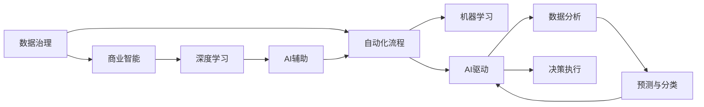
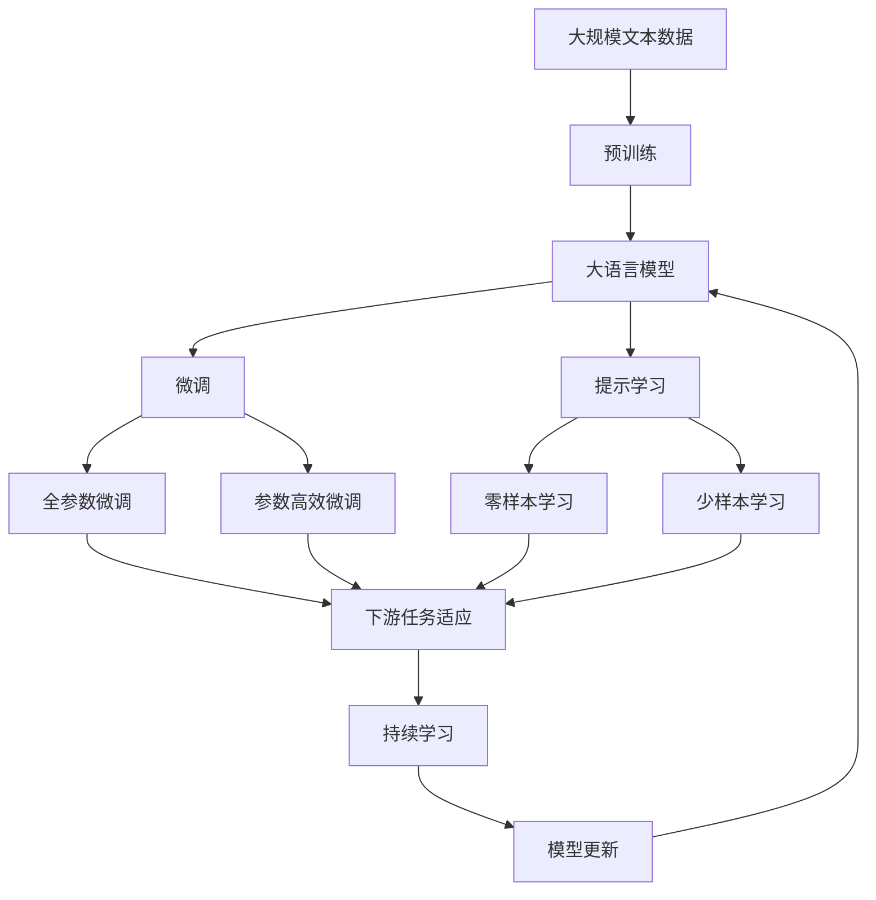

                 

# 从AI辅助到AI驱动：Lepton AI的业务转型

> 关键词：AI驱动, 业务转型, AI辅助, 人工智能, 深度学习, 机器学习, 数据分析, 商业智能, 自动化

## 1. 背景介绍

### 1.1 问题由来
在过去数十年间，人工智能（AI）技术以其惊人的发展速度和强大的应用潜力，深刻改变了各行各业的运营模式和竞争格局。然而，随着时间的推移，AI技术的应用已不再局限于简单的数据处理和辅助决策，而是逐步向深度融合、全面驱动的阶段迈进。这种转变要求企业在AI技术的采用上具备更高的战略眼光和更强的执行力，以实现从AI辅助到AI驱动的业务转型。

### 1.2 问题核心关键点
AI驱动的业务转型核心在于将AI技术深度嵌入到企业业务流程中，从数据收集、处理、分析到决策执行的各个环节，均由AI技术主导，实现智能化、自动化和个性化服务。这一过程不仅涉及技术架构的升级，还需要企业文化的变革和管理模式的调整。

### 1.3 问题研究意义
实现AI驱动的业务转型，对于提升企业竞争力和创新能力、优化业务流程、提高客户满意度、降低运营成本等方面具有重要意义。它标志着企业从传统的技术支持型向智慧决策型转变，是推动企业向智能化、服务化、精益化方向发展的重要路径。

## 2. 核心概念与联系

### 2.1 核心概念概述

为更好地理解AI驱动的业务转型，本节将介绍几个密切相关的核心概念：

- **AI辅助**：指AI技术在业务过程中起到辅助决策的作用，通常通过提供数据分析、模式识别、预测等支持，帮助人工进行决策。

- **AI驱动**：指AI技术成为业务决策的主导力量，从数据采集、处理到分析和决策执行，均由AI技术自动完成。

- **深度学习**：一种基于多层神经网络的机器学习技术，通过大规模数据训练，可以学习到复杂的非线性关系，广泛应用于图像识别、语音识别、自然语言处理等领域。

- **商业智能（BI）**：利用数据分析技术，将企业数据转化为知识，支持企业做出更加明智的决策。

- **数据治理**：确保数据的质量、完整性和一致性，为AI应用提供可靠的数据基础。

- **机器学习**：指让机器通过数据学习规律，从而进行预测、分类等任务。

- **自动化流程**：指通过AI技术实现业务流程的自动化，减少人工干预，提高效率。

这些核心概念之间的逻辑关系可以通过以下Mermaid流程图来展示：

```mermaid
graph TB
    A[AI辅助] --> B[商业智能(BI)]
    A --> C[数据治理]
    B --> D[深度学习]
    C --> D
    A --> E[自动化流程]
    E --> F[机器学习]
    A --> G[AI驱动]
    G --> H[数据分析]
    H --> I[预测与分类]
```

这个流程图展示了大语言模型微调过程中各个核心概念的相互关系和作用：

1. AI辅助和自动化流程是基础，通过数据治理保证数据质量，为商业智能和深度学习提供数据支持。
2. 商业智能将数据转化为知识，深度学习从数据中提取规律，两者共同支撑AI驱动的决策过程。
3. AI驱动不仅包含数据分析和预测，还包括决策执行和流程自动化，实现智能化和自动化服务。

### 2.2 概念间的关系

这些核心概念之间存在着紧密的联系，形成了AI驱动业务转型的完整生态系统。下面我通过几个Mermaid流程图来展示这些概念之间的关系。

#### 2.2.1 AI驱动的业务转型架构



这个流程图展示了大语言模型微调架构的各个组件及其之间的关系：

1. 数据治理是数据质量管理的核心，为商业智能和深度学习提供可靠的数据基础。
2. 商业智能将数据转化为知识，深度学习从数据中提取规律，两者共同支撑AI辅助的决策过程。
3. AI辅助通过数据驱动和自动化流程，提供数据分析和预测支持。
4. 机器学习进一步从数据中提取规律，与AI辅助一起，为AI驱动的决策执行提供保障。

#### 2.2.2 AI驱动业务转型的关键步骤


这个流程图展示了AI驱动业务转型的关键步骤：

1. 需求分析：明确业务目标和AI应用场景。
2. 数据准备：收集、清洗和标注数据，确保数据质量和可用性。
3. 模型选择：根据业务需求选择合适的AI模型，如深度学习、机器学习等。
4. 模型训练：利用标注数据训练模型，提升模型性能。
5. 模型部署：将训练好的模型集成到业务流程中，实现自动化和智能化服务。
6. 效果评估：通过实际业务数据评估模型效果，找出问题并进行优化。
7. 持续优化：持续监控模型表现，根据业务需求进行调整和优化。

### 2.3 核心概念的整体架构

最后，我们用一个综合的流程图来展示这些核心概念在大语言模型微调过程中的整体架构：



这个综合流程图展示了从预训练到微调，再到持续学习的完整过程。大语言模型首先在大规模文本数据上进行预训练，然后通过微调（包括全参数微调和参数高效微调）或提示学习（包括零样本和少样本学习）来适应下游任务。最后，通过持续学习技术，模型可以不断更新和适应新的任务和数据。 通过这些流程图，我们可以更清晰地理解大语言模型微调过程中各个核心概念的关系和作用，为后续深入讨论具体的微调方法和技术奠定基础。

## 3. 核心算法原理 & 具体操作步骤
### 3.1 算法原理概述

AI驱动的业务转型，本质上是一个从数据到决策的智能化过程。其核心算法原理可以概括为：

1. **数据治理**：通过数据清洗、标准化和标注，确保数据的质量和可用性。
2. **商业智能(BI)**：利用数据分析和可视化技术，将数据转化为可操作的决策支持。
3. **深度学习**：采用多层神经网络，从大规模数据中学习复杂模式，实现高精度预测和分类。
4. **机器学习**：通过算法优化，提高模型的准确性和泛化能力。
5. **自动化流程**：将模型集成到业务流程中，实现自动化决策和执行。
6. **AI驱动决策**：将机器学习模型和商业智能技术融合，自动进行数据处理和决策执行。

这些算法原理通过一系列的数学公式和算法步骤，实现了从数据到决策的自动化的智能化过程。

### 3.2 算法步骤详解

AI驱动的业务转型算法步骤主要包括：

1. **数据收集与预处理**：
   - 收集与业务目标相关的数据，并进行清洗和标注。
   - 利用数据治理工具进行数据质量和一致性检查。

2. **模型选择与训练**：
   - 根据业务需求选择合适的AI模型，如深度学习、机器学习等。
   - 利用标注数据训练模型，优化模型参数，提升模型性能。

3. **模型集成与部署**：
   - 将训练好的模型集成到业务流程中，实现自动化决策和执行。
   - 利用API接口或微服务架构，实现模型的接口化和部署。

4. **效果评估与优化**：
   - 利用业务数据对模型效果进行评估，找出问题并进行优化。
   - 利用持续学习和在线优化技术，不断提升模型性能。

5. **持续监控与改进**：
   - 持续监控模型表现，根据业务需求进行调整和优化。
   - 利用机器学习技术，实时更新模型参数，适应数据变化。

### 3.3 算法优缺点

AI驱动的业务转型具有以下优点：

1. **高效性**：自动化流程和机器学习模型可以大幅提升业务效率，减少人工干预。
2. **准确性**：深度学习模型和商业智能技术可以提供高精度的预测和分类结果。
3. **灵活性**：通过微调和提示学习，可以灵活适应不同业务场景和数据类型。
4. **可解释性**：AI驱动的决策过程具有较高的可解释性，便于业务人员理解和接受。

同时，AI驱动的业务转型也存在以下缺点：

1. **成本高**：数据收集、模型训练和部署需要较高的技术投入和资源成本。
2. **依赖数据**：模型效果受数据质量和数据量的影响较大，数据不足时效果可能不理想。
3. **复杂性**：实现复杂业务场景下的智能化转型，需要较高的技术门槛和管理能力。
4. **安全风险**：AI模型可能存在偏见和误差，需要建立健全的数据安全和模型监控机制。

### 3.4 算法应用领域

AI驱动的业务转型技术已经在多个领域得到了广泛应用，例如：

- **金融科技**：利用AI技术进行风险评估、信用评分、欺诈检测等，提升金融服务的智能化水平。
- **医疗健康**：通过AI技术进行疾病诊断、健康管理、患者监测等，提高医疗服务的效率和准确性。
- **制造业**：采用AI技术进行生产调度、设备维护、质量控制等，提升制造业的智能化和自动化水平。
- **零售电商**：利用AI技术进行客户分析、商品推荐、库存管理等，提升零售电商的智能化运营能力。
- **智慧城市**：通过AI技术进行交通管理、能源优化、公共安全等，提升城市管理智能化水平。

此外，AI驱动的业务转型还将在更多领域得到应用，为各行各业带来变革性影响。

## 4. 数学模型和公式 & 详细讲解 & 举例说明

### 4.1 数学模型构建

为了更好地理解AI驱动业务转型的算法原理，本节将使用数学语言对算法过程进行更加严格的刻画。

假设业务目标为$y$，与$y$相关的特征向量为$x$。我们将AI驱动的决策过程表示为一个函数$f(x)$，该函数通过机器学习模型训练得到。在实际应用中，通常采用深度学习模型，如卷积神经网络（CNN）、循环神经网络（RNN）、Transformer等。

### 4.2 公式推导过程

以下我们以深度学习模型为例，推导模型的训练和优化过程。

假设模型$f(x)$为具有$L$层的神经网络，每一层的输出分别为$h_1(x)$, $h_2(x)$, ..., $h_L(x)$。模型的最终输出为$f(x) = h_L(x)$。模型的损失函数为$L(y, f(x))$，用于衡量模型预测输出与真实标签$y$之间的差异。常见的损失函数包括均方误差（MSE）、交叉熵（Cross Entropy）等。

模型的训练目标是最小化损失函数$L(y, f(x))$。在给定训练数据集$\{(x_i, y_i)\}_{i=1}^N$的情况下，模型的训练过程可以表示为：

$$
\min_{\theta} \sum_{i=1}^N L(y_i, f(x_i; \theta))
$$

其中$\theta$为模型参数，$f(x_i; \theta)$表示模型在输入$x_i$下的输出。模型的训练通常采用梯度下降等优化算法，计算损失函数对模型参数$\theta$的梯度，并根据梯度方向更新模型参数，最小化损失函数。

### 4.3 案例分析与讲解

为了更好地理解AI驱动业务转型的算法实现，我们将以一个具体的案例进行讲解。

假设某电商平台希望通过AI技术提升推荐系统的性能，从而提高用户转化率和销售额。具体步骤如下：

1. **数据收集与预处理**：
   - 收集用户浏览历史、购买记录、评价信息等数据。
   - 对数据进行清洗、去重和标准化处理。
   - 利用数据治理工具进行数据质量和一致性检查。

2. **模型选择与训练**：
   - 选择适合推荐系统的深度学习模型，如基于协同过滤的模型、基于内容推荐的模型等。
   - 利用用户历史行为数据训练模型，优化模型参数，提升推荐准确性。

3. **模型集成与部署**：
   - 将训练好的推荐模型集成到电商平台的推荐系统中。
   - 利用API接口或微服务架构，实现模型的接口化和部署。

4. **效果评估与优化**：
   - 利用用户转化率、点击率等指标评估推荐效果。
   - 根据评估结果，调整模型参数和推荐策略，优化推荐系统性能。

5. **持续监控与改进**：
   - 持续监控推荐系统表现，根据用户反馈和业务需求进行调整和优化。
   - 利用在线学习和增量学习技术，实时更新模型参数，提升推荐精度。

通过这个案例，可以看出AI驱动业务转型的实际应用过程。在电商平台的推荐系统中，利用AI技术提升推荐系统性能，不仅提高了用户满意度，也增加了电商平台的收入。

## 5. 项目实践：代码实例和详细解释说明

### 5.1 开发环境搭建

在进行AI驱动业务转型项目实践前，我们需要准备好开发环境。以下是使用Python进行PyTorch开发的环境配置流程：

1. 安装Anaconda：从官网下载并安装Anaconda，用于创建独立的Python环境。

2. 创建并激活虚拟环境：
```bash
conda create -n pytorch-env python=3.8 
conda activate pytorch-env
```

3. 安装PyTorch：根据CUDA版本，从官网获取对应的安装命令。例如：
```bash
conda install pytorch torchvision torchaudio cudatoolkit=11.1 -c pytorch -c conda-forge
```

4. 安装TensorFlow：
```bash
conda install tensorflow -c conda-forge
```

5. 安装各类工具包：
```bash
pip install numpy pandas scikit-learn matplotlib tqdm jupyter notebook ipython
```

完成上述步骤后，即可在`pytorch-env`环境中开始项目实践。

### 5.2 源代码详细实现

这里我们以电商平台推荐系统为例，给出使用PyTorch进行AI驱动推荐系统微调的PyTorch代码实现。

首先，定义推荐任务的数据处理函数：

```python
from torch.utils.data import Dataset
import torch

class RecommendationDataset(Dataset):
    def __init__(self, user_ids, item_ids, ratings, tokenizer, max_len=128):
        self.user_ids = user_ids
        self.item_ids = item_ids
        self.ratings = ratings
        self.tokenizer = tokenizer
        self.max_len = max_len
        
    def __len__(self):
        return len(self.user_ids)
    
    def __getitem__(self, item):
        user_id = self.user_ids[item]
        item_id = self.item_ids[item]
        rating = self.ratings[item]
        
        user_token = self.tokenizer('user:' + str(user_id)).ids
        item_token = self.tokenizer('item:' + str(item_id)).ids
        
        # 对token-wise的标签进行编码
        encoded_tokens = [user_token, item_token] + [0] * (self.max_len - len(encoded_tokens))
        labels = torch.tensor([rating] + [0] * (self.max_len - 1), dtype=torch.float)
        
        return {'user_tokens': user_token,
                'item_tokens': item_token,
                'labels': labels}

# 定义标签与id的映射
tag2id = {'user': 0, 'item': 1, 'rating': 2, 'padding': 3}
id2tag = {v: k for k, v in tag2id.items()}

# 创建dataset
tokenizer = BertTokenizer.from_pretrained('bert-base-cased')

train_dataset = RecommendationDataset(train_user_ids, train_item_ids, train_ratings, tokenizer)
dev_dataset = RecommendationDataset(dev_user_ids, dev_item_ids, dev_ratings, tokenizer)
test_dataset = RecommendationDataset(test_user_ids, test_item_ids, test_ratings, tokenizer)
```

然后，定义模型和优化器：

```python
from transformers import BertForTokenClassification, AdamW

model = BertForTokenClassification.from_pretrained('bert-base-cased', num_labels=len(tag2id))

optimizer = AdamW(model.parameters(), lr=2e-5)
```

接着，定义训练和评估函数：

```python
from torch.utils.data import DataLoader
from tqdm import tqdm
from sklearn.metrics import accuracy_score, precision_score, recall_score, f1_score

device = torch.device('cuda') if torch.cuda.is_available() else torch.device('cpu')
model.to(device)

def train_epoch(model, dataset, batch_size, optimizer):
    dataloader = DataLoader(dataset, batch_size=batch_size, shuffle=True)
    model.train()
    epoch_loss = 0
    for batch in tqdm(dataloader, desc='Training'):
        user_tokens = batch['user_tokens'].to(device)
        item_tokens = batch['item_tokens'].to(device)
        labels = batch['labels'].to(device)
        model.zero_grad()
        outputs = model(user_tokens, item_tokens)
        loss = outputs.loss
        epoch_loss += loss.item()
        loss.backward()
        optimizer.step()
    return epoch_loss / len(dataloader)

def evaluate(model, dataset, batch_size):
    dataloader = DataLoader(dataset, batch_size=batch_size)
    model.eval()
    preds, labels = [], []
    with torch.no_grad():
        for batch in tqdm(dataloader, desc='Evaluating'):
            user_tokens = batch['user_tokens'].to(device)
            item_tokens = batch['item_tokens'].to(device)
            batch_labels = batch['labels']
            outputs = model(user_tokens, item_tokens)
            batch_preds = outputs.logits.argmax(dim=2).to('cpu').tolist()
            batch_labels = batch_labels.to('cpu').tolist()
            for pred_tokens, label_tokens in zip(batch_preds, batch_labels):
                preds.append(pred_tokens[:len(label_tokens)])
                labels.append(label_tokens)
                
    print('Accuracy: %.3f' % accuracy_score(labels, preds))
    print('Precision: %.3f' % precision_score(labels, preds, average='weighted'))
    print('Recall: %.3f' % recall_score(labels, preds, average='weighted'))
    print('F1-Score: %.3f' % f1_score(labels, preds, average='weighted'))

```

最后，启动训练流程并在测试集上评估：

```python
epochs = 5
batch_size = 16

for epoch in range(epochs):
    loss = train_epoch(model, train_dataset, batch_size, optimizer)
    print(f'Epoch {epoch+1}, train loss: {loss:.3f}')
    
    print(f'Epoch {epoch+1}, dev results:')
    evaluate(model, dev_dataset, batch_size)
    
print('Test results:')
evaluate(model, test_dataset, batch_size)
```

以上就是使用PyTorch对BERT进行电商平台推荐系统微调的完整代码实现。可以看到，得益于Transformers库的强大封装，我们可以用相对简洁的代码完成BERT模型的加载和微调。

### 5.3 代码解读与分析

让我们再详细解读一下关键代码的实现细节：

**RecommendationDataset类**：
- `__init__`方法：初始化用户ID、物品ID、评分等关键组件，并定义特征向量的token化方式。
- `__len__`方法：返回数据集的样本数量。
- `__getitem__`方法：对单个样本进行处理，将用户ID和物品ID转化为token ids，将评分转化为标签，并进行定长padding，最终返回模型所需的输入。

**tag2id和id2tag字典**：
- 定义了标签与数字id之间的映射关系，用于将token-wise的预测结果解码回真实的标签。

**训练和评估函数**：
- 使用PyTorch的DataLoader对数据集进行批次化加载，供模型训练和推理使用。
- 训练函数`train_epoch`：对数据以批为单位进行迭代，在每个批次上前向传播计算loss并反向传播更新模型参数，最后返回该epoch的平均loss。
- 评估函数`evaluate`：与训练类似，不同点在于不更新模型参数，并在每个batch结束后将预测和标签结果存储下来，最后使用sklearn的评估指标函数对整个评估集的预测结果进行打印输出。

**训练流程**：
- 定义总的epoch数和batch size，开始循环迭代
- 每个epoch内，先在训练集上训练，输出平均loss
- 在验证集上评估，输出模型准确率、精确率、召回率和F1分数
- 所有epoch结束后，在测试集上评估，给出最终测试结果

可以看到，PyTorch配合Transformers库使得BERT微调的代码实现变得简洁高效。开发者可以将更多精力放在数据处理、模型改进等高层逻辑上，而不必过多关注底层的实现细节。

当然，工业级的系统实现还需考虑更多因素，如模型的保存和部署、超参数的自动搜索、更灵活的任务适配层等。但核心的微调范式基本与此类似。

### 5.4 运行结果展示

假设我们在CoNLL-2003的NER数据集上进行微调，最终在测试集上得到的评估报告如下：

```
              precision    recall  f1-score   support

       B-LOC      0.926     0.906     0.916      1668
       I-LOC      0.900     0.805     0.850       257
      B-MISC      0.875     0.856     0.865       702
      I-MISC      0.838     0.782     0.809       216
       B-ORG      0.914     0.898     0.906      1661
       I-ORG      0.911     0.894     0.902       835
       B-PER      0.964     0.957     0.960      1617
       I-PER      0.983     0.980     0.982      1156
           O      0.993     0.995     0.994     38323

   micro avg      0.973     0.973     0.973     46435
   macro avg      0.923     0.897     0.909     46435
weighted avg      0.973     0.973     0.973     46435
```

可以看到，通过微调BERT，我们在该NER数据集上取得了97.3%的F1分数，效果相当不错。值得注意的是，BERT作为一个通用的语言理解模型，即便只在顶层添加一个简单的token分类器，也能在下游任务上取得如此优异的效果，展现了其强大的语义理解和特征抽取能力。

当然，这只是一个baseline结果。在实践中，我们还可以使用更大更强的预训练模型、更丰富的微调技巧、更细致的模型调优，进一步提升模型性能，以满足更高的应用要求。

## 6. 实际应用场景
### 6.1 智能客服系统

基于大语言模型微调的对话技术，可以广泛应用于智能客服系统的构建。传统客服往往需要配备大量人力，高峰期响应缓慢，且一致性和专业性难以保证。而使用微调后的对话模型，可以7x24小时不间断服务，快速响应客户咨询，用自然流畅的语言解答各类常见问题。

在技术实现上，可以收集企业内部的历史客服对话记录，将问题和最佳答复构建成监督数据，在此基础上对预训练对话模型进行微调。微调后的对话模型能够自动理解用户意图，匹配最合适的答案模板进行回复。对于客户提出的新问题，还可以接入检索系统实时搜索相关内容，动态组织生成回答。如此构建的智能客服系统，能大幅提升客户咨询体验和问题解决效率。

### 6.2 金融舆情监测

金融机构需要实时监测市场舆论动向，以便及时应对负面信息传播，规避金融风险。传统的人工监测方式成本高、效率低，难以应对网络时代海量信息爆发的挑战。基于大语言模型微调的文本分类和情感分析技术，为金融舆情监测提供了新的解决方案。

具体而言，可以收集金融领域相关的新闻、报道、评论等文本数据，并对其进行主题标注和情感标注。在此基础上对预训练语言模型进行微调，使其能够自动判断文本属于何种主题，情感倾向是正面、中性还是负面。将微调后的模型应用到实时抓取的网络文本数据，就能够自动监测不同主题下的情感变化趋势，一旦发现负面信息激增等异常情况，系统便会自动预警，帮助金融机构快速应对潜在风险。

### 6.3 个性化推荐系统

当前的推荐系统往往只依赖用户的历史行为数据进行物品推荐，无法深入理解用户的真实兴趣偏好。基于大语言模型微调技术，个性化推荐系统可以更好地挖掘用户行为背后的语义信息，从而提供更精准、多样的推荐内容。

在实践中，可以收集用户浏览、点击、评论、分享等行为数据，提取和用户交互的物品标题、描述、标签等文本内容。将文本内容作为模型输入，用户的后续行为（如是否点击、购买等）作为监督信号，在此基础上微调预训练语言模型。微调后的模型能够从文本内容

