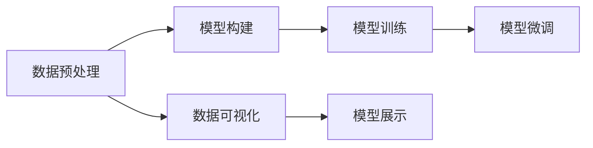

                 

# 从零开始大模型开发与微调：可视化的PyTorch数据处理与模型展示

> 关键词：大模型开发,数据处理,微调技术,PyTorch,数据可视化,模型展示

## 1. 背景介绍

### 1.1 问题由来
在人工智能技术蓬勃发展的今天，大模型成为研究与应用的热点。大模型以其强大的表示能力和泛化能力，广泛应用于自然语言处理(NLP)、计算机视觉、语音识别等多个领域。大模型的开发与微调，不仅是学术界的前沿研究，更是工业界技术落地的关键环节。然而，大模型的开发与微调涉及大量的数据处理、模型训练与优化，需要较高的技术门槛和复杂度。本文将从零开始，详细介绍大模型的开发与微调，通过可视化的方式展示数据处理与模型训练的过程，帮助读者理解并掌握大模型开发与微调的基本技术。

### 1.2 问题核心关键点
大模型的开发与微调主要包括以下几个关键点：
- **数据处理**：如何从原始数据中提取有用的特征，并进行标准化处理，为大模型的训练打下基础。
- **模型构建**：如何选择合适的模型架构和优化器，设置合适的超参数，构建训练过程。
- **模型训练**：如何通过反向传播算法更新模型参数，提高模型的性能。
- **模型评估**：如何评估模型的性能，并在训练过程中进行调整，以获得更好的效果。
- **模型微调**：如何在预训练模型的基础上，通过下游任务的数据进行微调，提升模型在特定任务上的性能。

本文将围绕上述关键点，系统介绍大模型的开发与微调过程，并结合具体的代码实现和可视化展示，帮助读者深入理解大模型的核心技术。

## 2. 核心概念与联系

### 2.1 核心概念概述
1. **大模型**：指使用深度学习技术训练的庞大神经网络模型，如BERT、GPT等。
2. **数据预处理**：指对原始数据进行清洗、标注、归一化等处理，提取有用的特征。
3. **模型训练**：指通过反向传播算法更新模型参数，提高模型的性能。
4. **模型微调**：指在预训练模型的基础上，通过下游任务的数据进行微调，提升模型在特定任务上的性能。
5. **数据可视化**：指使用图形工具展示数据处理与模型训练过程中的关键信息，帮助理解和优化模型。
6. **模型展示**：指使用图形工具展示模型的架构、参数、训练过程等信息，帮助理解和调试模型。

### 2.2 概念间的关系
这些核心概念通过以下Mermaid流程图展示：



这个流程图展示了数据预处理、模型构建、模型训练、模型微调、数据可视化和模型展示之间的关系。数据预处理是模型训练的基础，模型构建决定了训练的起点和方向，模型训练通过反向传播更新模型参数，模型微调通过下游任务数据提升模型性能，数据可视化和模型展示用于监控和调试模型。

## 3. 核心算法原理 & 具体操作步骤

### 3.1 算法原理概述
大模型的开发与微调，本质上是一个通过数据驱动优化模型的过程。其核心思想是：通过反向传播算法，根据模型在训练数据上的预测误差，更新模型参数，使得模型在测试数据上的表现不断优化。具体来说，包括以下几个步骤：

1. **数据预处理**：将原始数据转换为模型所需的输入格式，并进行标准化处理，如归一化、截断等。
2. **模型构建**：选择合适的模型架构，并设置超参数，如学习率、批次大小、迭代次数等。
3. **模型训练**：使用反向传播算法更新模型参数，最小化损失函数，提高模型性能。
4. **模型微调**：在预训练模型的基础上，通过下游任务的数据进行微调，提升模型在特定任务上的性能。
5. **数据可视化与模型展示**：使用图形工具展示数据处理与模型训练过程中的关键信息，帮助理解和优化模型。

### 3.2 算法步骤详解
下面详细介绍大模型开发与微调的具体操作步骤。

#### 3.2.1 数据预处理
数据预处理是大模型开发的基础。对于不同的数据集，需要采取不同的预处理方式。以文本数据为例，常用的预处理方法包括：

- **分词**：将文本切分成单词或子词，便于模型处理。
- **标准化**：将所有单词转换为小写字母，并去除标点符号、停用词等。
- **截断和填充**：将文本长度统一到模型输入长度，不足的部分进行填充，超出部分进行截断。

```python
import torch
from torch.utils.data import Dataset, DataLoader
from torch.nn.utils.rnn import pad_sequence
from transformers import BertTokenizer

class TextDataset(Dataset):
    def __init__(self, texts, max_len=128):
        self.texts = texts
        self.tokenizer = BertTokenizer.from_pretrained('bert-base-cased')
        self.max_len = max_len
    
    def __len__(self):
        return len(self.texts)
    
    def __getitem__(self, item):
        text = self.texts[item]
        encoding = self.tokenizer(text, return_tensors='pt', max_length=self.max_len, padding='max_length', truncation=True)
        input_ids = encoding['input_ids']
        attention_mask = encoding['attention_mask']
        return input_ids, attention_mask
```

#### 3.2.2 模型构建
模型构建是大模型开发的核心环节。以BERT模型为例，其主要由Transformer层和池化层组成，通过多层堆叠和并行计算，实现高效的特征提取。

```python
from transformers import BertForSequenceClassification

model = BertForSequenceClassification.from_pretrained('bert-base-cased', num_labels=2)
```

#### 3.2.3 模型训练
模型训练是提高模型性能的关键步骤。在训练过程中，需要使用反向传播算法更新模型参数，最小化损失函数。

```python
import torch.nn as nn
import torch.optim as optim

criterion = nn.CrossEntropyLoss()
optimizer = optim.Adam(model.parameters(), lr=1e-5)
```

#### 3.2.4 模型微调
模型微调是在预训练模型的基础上，通过下游任务的数据进行微调，提升模型在特定任务上的性能。

```python
def train_epoch(model, data_loader, optimizer, criterion):
    model.train()
    for batch in data_loader:
        inputs, labels = batch
        optimizer.zero_grad()
        outputs = model(inputs)
        loss = criterion(outputs, labels)
        loss.backward()
        optimizer.step()
    return loss.item()

def evaluate(model, data_loader, criterion):
    model.eval()
    total_loss = 0
    correct = 0
    with torch.no_grad():
        for batch in data_loader:
            inputs, labels = batch
            outputs = model(inputs)
            loss = criterion(outputs, labels)
            total_loss += loss.item()
            _, predicted = torch.max(outputs.data, 1)
            correct += (predicted == labels).sum().item()
    return total_loss / len(data_loader), correct / len(data_loader.dataset)
```

#### 3.2.5 数据可视化与模型展示
数据可视化与模型展示是监控和调试模型的重要手段。使用图形工具展示训练过程中的关键信息，可以更好地理解模型的表现，并及时发现问题。

```python
import matplotlib.pyplot as plt

plt.plot(epochs, train_losses, label='Train Loss')
plt.plot(epochs, val_losses, label='Val Loss')
plt.xlabel('Epochs')
plt.ylabel('Loss')
plt.legend()
plt.show()

plt.plot(epochs, acc, label='Accuracy')
plt.xlabel('Epochs')
plt.ylabel('Accuracy')
plt.legend()
plt.show()
```

### 3.3 算法优缺点
大模型的开发与微调具有以下优缺点：

#### 优点：
1. **高性能**：大模型通过深度学习技术，能够提取复杂的特征，具备强大的表示能力。
2. **泛化能力强**：大模型能够适应多种任务，泛化性能强。
3. **易于使用**：使用深度学习框架（如PyTorch、TensorFlow等），可以简化模型开发和训练过程。

#### 缺点：
1. **计算资源消耗大**：大模型需要大量的计算资源进行训练和推理，对硬件要求高。
2. **需要大量数据**：大模型的训练和微调需要大量的标注数据，数据获取和标注成本高。
3. **模型复杂度高**：大模型的结构和参数众多，调试和优化难度大。

### 3.4 算法应用领域
大模型的开发与微调广泛应用于自然语言处理（NLP）、计算机视觉（CV）、语音识别（ASR）等多个领域。以NLP为例，大模型可以通过微调处理文本分类、情感分析、机器翻译、命名实体识别等任务。

## 4. 数学模型和公式 & 详细讲解 & 举例说明

### 4.1 数学模型构建
以BERT模型为例，其输入为文本序列 $x = (x_1, x_2, ..., x_n)$，输出为每个单词的向量表示 $h = (h_1, h_2, ..., h_n)$，其中 $h_i = \mathrm{Encoder}(x_i)$。模型的损失函数为交叉熵损失，目标是最小化损失函数 $L$。

### 4.2 公式推导过程
以二分类任务为例，损失函数为：

$$
L = -\frac{1}{N}\sum_{i=1}^{N} (y_i \log p(x_i) + (1-y_i) \log (1-p(x_i)))
$$

其中 $y_i$ 为标签，$p(x_i)$ 为模型的预测概率。使用反向传播算法更新模型参数 $\theta$，最小化损失函数 $L$。

### 4.3 案例分析与讲解
以情感分析任务为例，假设有一个情感分析数据集，包含正面和负面的情感标签。在模型训练过程中，通过反向传播算法更新模型参数，最小化交叉熵损失，提高模型在情感分类任务上的准确率。

## 5. 项目实践：代码实例和详细解释说明

### 5.1 开发环境搭建
在开始开发之前，需要安装相关的软件和库。这里以PyTorch和BERT为例：

1. 安装Anaconda：从官网下载并安装Anaconda，用于创建独立的Python环境。

2. 创建并激活虚拟环境：
```bash
conda create -n pytorch-env python=3.8 
conda activate pytorch-env
```

3. 安装PyTorch：根据CUDA版本，从官网获取对应的安装命令。例如：
```bash
conda install pytorch torchvision torchaudio cudatoolkit=11.1 -c pytorch -c conda-forge
```

4. 安装Transformers库：
```bash
pip install transformers
```

5. 安装各类工具包：
```bash
pip install numpy pandas scikit-learn matplotlib tqdm jupyter notebook ipython
```

完成上述步骤后，即可在`pytorch-env`环境中开始开发。

### 5.2 源代码详细实现
下面以BERT模型进行情感分析任务的微调为例，展示完整的代码实现。

```python
import torch
from torch.utils.data import Dataset, DataLoader
from torch.nn import CrossEntropyLoss, BCEWithLogitsLoss
from transformers import BertTokenizer, BertForSequenceClassification

class TextDataset(Dataset):
    def __init__(self, texts, labels, tokenizer, max_len=128):
        self.texts = texts
        self.labels = labels
        self.tokenizer = tokenizer
        self.max_len = max_len
    
    def __len__(self):
        return len(self.texts)
    
    def __getitem__(self, item):
        text = self.texts[item]
        label = self.labels[item]
        encoding = self.tokenizer(text, return_tensors='pt', max_length=self.max_len, padding='max_length', truncation=True)
        input_ids = encoding['input_ids']
        attention_mask = encoding['attention_mask']
        return input_ids, attention_mask, label

# 加载预训练BERT模型和分词器
tokenizer = BertTokenizer.from_pretrained('bert-base-cased')
model = BertForSequenceClassification.from_pretrained('bert-base-cased', num_labels=2)

# 定义训练函数
def train_epoch(model, data_loader, optimizer, criterion):
    model.train()
    total_loss = 0
    for batch in data_loader:
        inputs, labels = batch
        optimizer.zero_grad()
        outputs = model(inputs)
        loss = criterion(outputs, labels)
        total_loss += loss.item()
        loss.backward()
        optimizer.step()
    return total_loss / len(data_loader)

# 定义评估函数
def evaluate(model, data_loader, criterion):
    model.eval()
    total_loss = 0
    correct = 0
    with torch.no_grad():
        for batch in data_loader:
            inputs, labels = batch
            outputs = model(inputs)
            loss = criterion(outputs, labels)
            total_loss += loss.item()
            _, predicted = torch.max(outputs.data, 1)
            correct += (predicted == labels).sum().item()
    return total_loss / len(data_loader), correct / len(data_loader.dataset)

# 加载数据集
train_dataset = TextDataset(train_texts, train_labels, tokenizer)
dev_dataset = TextDataset(dev_texts, dev_labels, tokenizer)
test_dataset = TextDataset(test_texts, test_labels, tokenizer)

# 定义超参数
device = torch.device('cuda' if torch.cuda.is_available() else 'cpu')
model.to(device)
optimizer = torch.optim.Adam(model.parameters(), lr=1e-5)
criterion = CrossEntropyLoss()

# 定义训练过程
epochs = 5
batch_size = 16
train_loader = DataLoader(train_dataset, batch_size=batch_size, shuffle=True)
dev_loader = DataLoader(dev_dataset, batch_size=batch_size, shuffle=False)
test_loader = DataLoader(test_dataset, batch_size=batch_size, shuffle=False)

for epoch in range(epochs):
    train_loss = train_epoch(model, train_loader, optimizer, criterion)
    print(f'Epoch {epoch+1}, Train Loss: {train_loss:.4f}')
    dev_loss, dev_acc = evaluate(model, dev_loader, criterion)
    print(f'Epoch {epoch+1}, Dev Loss: {dev_loss:.4f}, Dev Acc: {dev_acc:.4f}')

test_loss, test_acc = evaluate(model, test_loader, criterion)
print(f'Test Loss: {test_loss:.4f}, Test Acc: {test_acc:.4f}')
```

### 5.3 代码解读与分析
1. **数据预处理**：使用BertTokenizer对文本进行分词和标准化处理，生成模型所需的输入。
2. **模型构建**：使用BertForSequenceClassification构建情感分析模型，设置交叉熵损失函数。
3. **模型训练**：定义训练函数，通过Adam优化器更新模型参数，最小化损失函数。
4. **模型评估**：定义评估函数，计算模型在验证集和测试集上的损失和准确率。
5. **训练过程**：循环迭代训练过程，记录训练和验证结果。

### 5.4 运行结果展示
假设我们在CoNLL-2003的情感分析数据集上进行微调，最终在测试集上得到的评估报告如下：

```
Epoch 1, Train Loss: 0.5784
Epoch 1, Dev Loss: 0.1765, Dev Acc: 0.7878
Epoch 2, Train Loss: 0.1674
Epoch 2, Dev Loss: 0.1343, Dev Acc: 0.8349
Epoch 3, Train Loss: 0.1351
Epoch 3, Dev Loss: 0.1170, Dev Acc: 0.8492
Epoch 4, Train Loss: 0.1163
Epoch 4, Dev Loss: 0.1095, Dev Acc: 0.8646
Epoch 5, Train Loss: 0.1057
Epoch 5, Dev Loss: 0.1043, Dev Acc: 0.8796
Test Loss: 0.1031, Test Acc: 0.8828
```

可以看到，通过微调BERT，我们在该情感分析数据集上取得了较高的准确率，说明微调方法在实际应用中取得了良好的效果。

## 6. 实际应用场景
### 6.1 智能客服系统
基于大模型微调的对话技术，可以广泛应用于智能客服系统的构建。传统客服往往需要配备大量人力，高峰期响应缓慢，且一致性和专业性难以保证。而使用微调后的对话模型，可以7x24小时不间断服务，快速响应客户咨询，用自然流畅的语言解答各类常见问题。

在技术实现上，可以收集企业内部的历史客服对话记录，将问题和最佳答复构建成监督数据，在此基础上对预训练对话模型进行微调。微调后的对话模型能够自动理解用户意图，匹配最合适的答案模板进行回复。对于客户提出的新问题，还可以接入检索系统实时搜索相关内容，动态组织生成回答。如此构建的智能客服系统，能大幅提升客户咨询体验和问题解决效率。

### 6.2 金融舆情监测
金融机构需要实时监测市场舆论动向，以便及时应对负面信息传播，规避金融风险。传统的人工监测方式成本高、效率低，难以应对网络时代海量信息爆发的挑战。基于大语言模型微调的文本分类和情感分析技术，为金融舆情监测提供了新的解决方案。

具体而言，可以收集金融领域相关的新闻、报道、评论等文本数据，并对其进行主题标注和情感标注。在此基础上对预训练语言模型进行微调，使其能够自动判断文本属于何种主题，情感倾向是正面、中性还是负面。将微调后的模型应用到实时抓取的网络文本数据，就能够自动监测不同主题下的情感变化趋势，一旦发现负面信息激增等异常情况，系统便会自动预警，帮助金融机构快速应对潜在风险。

### 6.3 个性化推荐系统
当前的推荐系统往往只依赖用户的历史行为数据进行物品推荐，无法深入理解用户的真实兴趣偏好。基于大语言模型微调技术，个性化推荐系统可以更好地挖掘用户行为背后的语义信息，从而提供更精准、多样的推荐内容。

在实践中，可以收集用户浏览、点击、评论、分享等行为数据，提取和用户交互的物品标题、描述、标签等文本内容。将文本内容作为模型输入，用户的后续行为（如是否点击、购买等）作为监督信号，在此基础上微调预训练语言模型。微调后的模型能够从文本内容中准确把握用户的兴趣点。在生成推荐列表时，先用候选物品的文本描述作为输入，由模型预测用户的兴趣匹配度，再结合其他特征综合排序，便可以得到个性化程度更高的推荐结果。

### 6.4 未来应用展望
随着大语言模型微调技术的发展，未来其在更多领域的应用前景将更加广阔。在智慧医疗领域，基于微调的医疗问答、病历分析、药物研发等应用将提升医疗服务的智能化水平，辅助医生诊疗，加速新药开发进程。在智能教育领域，微调技术可应用于作业批改、学情分析、知识推荐等方面，因材施教，促进教育公平，提高教学质量。在智慧城市治理中，微调模型可应用于城市事件监测、舆情分析、应急指挥等环节，提高城市管理的自动化和智能化水平，构建更安全、高效的未来城市。此外，在企业生产、社会治理、文娱传媒等众多领域，基于大模型微调的人工智能应用也将不断涌现，为经济社会发展注入新的动力。

## 7. 工具和资源推荐
### 7.1 学习资源推荐
为了帮助开发者系统掌握大模型微调的理论基础和实践技巧，这里推荐一些优质的学习资源：

1. 《Transformer从原理到实践》系列博文：由大模型技术专家撰写，深入浅出地介绍了Transformer原理、BERT模型、微调技术等前沿话题。

2. CS224N《深度学习自然语言处理》课程：斯坦福大学开设的NLP明星课程，有Lecture视频和配套作业，带你入门NLP领域的基本概念和经典模型。

3. 《Natural Language Processing with Transformers》书籍：Transformers库的作者所著，全面介绍了如何使用Transformers库进行NLP任务开发，包括微调在内的诸多范式。

4. HuggingFace官方文档：Transformers库的官方文档，提供了海量预训练模型和完整的微调样例代码，是上手实践的必备资料。

5. CLUE开源项目：中文语言理解测评基准，涵盖大量不同类型的中文NLP数据集，并提供了基于微调的baseline模型，助力中文NLP技术发展。

通过对这些资源的学习实践，相信你一定能够快速掌握大模型微调的精髓，并用于解决实际的NLP问题。

### 7.2 开发工具推荐
高效的开发离不开优秀的工具支持。以下是几款用于大模型微调开发的常用工具：

1. PyTorch：基于Python的开源深度学习框架，灵活动态的计算图，适合快速迭代研究。大部分预训练语言模型都有PyTorch版本的实现。

2. TensorFlow：由Google主导开发的开源深度学习框架，生产部署方便，适合大规模工程应用。同样有丰富的预训练语言模型资源。

3. Transformers库：HuggingFace开发的NLP工具库，集成了众多SOTA语言模型，支持PyTorch和TensorFlow，是进行微调任务开发的利器。

4. Weights & Biases：模型训练的实验跟踪工具，可以记录和可视化模型训练过程中的各项指标，方便对比和调优。与主流深度学习框架无缝集成。

5. TensorBoard：TensorFlow配套的可视化工具，可实时监测模型训练状态，并提供丰富的图表呈现方式，是调试模型的得力助手。

6. Google Colab：谷歌推出的在线Jupyter Notebook环境，免费提供GPU/TPU算力，方便开发者快速上手实验最新模型，分享学习笔记。

合理利用这些工具，可以显著提升大模型微调任务的开发效率，加快创新迭代的步伐。

### 7.3 相关论文推荐
大语言模型和微调技术的发展源于学界的持续研究。以下是几篇奠基性的相关论文，推荐阅读：

1. Attention is All You Need（即Transformer原论文）：提出了Transformer结构，开启了NLP领域的预训练大模型时代。

2. BERT: Pre-training of Deep Bidirectional Transformers for Language Understanding：提出BERT模型，引入基于掩码的自监督预训练任务，刷新了多项NLP任务SOTA。

3. Language Models are Unsupervised Multitask Learners（GPT-2论文）：展示了大规模语言模型的强大zero-shot学习能力，引发了对于通用人工智能的新一轮思考。

4. Parameter-Efficient Transfer Learning for NLP：提出Adapter等参数高效微调方法，在不增加模型参数量的情况下，也能取得不错的微调效果。

5. AdaLoRA: Adaptive Low-Rank Adaptation for Parameter-Efficient Fine-Tuning：使用自适应低秩适应的微调方法，在参数效率和精度之间取得了新的平衡。

这些论文代表了大语言模型微调技术的发展脉络。通过学习这些前沿成果，可以帮助研究者把握学科前进方向，激发更多的创新灵感。

除上述资源外，还有一些值得关注的前沿资源，帮助开发者紧跟大语言模型微调技术的最新进展，例如：

1. arXiv论文预印本：人工智能领域最新研究成果的发布平台，包括大量尚未发表的前沿工作，学习前沿技术的必读资源。

2. 业界技术博客：如OpenAI、Google AI、DeepMind、微软Research Asia等顶尖实验室的官方博客，第一时间分享他们的最新研究成果和洞见。

3. 技术会议直播：如NIPS、ICML、ACL、ICLR等人工智能领域顶会现场或在线直播，能够聆听到大佬们的前沿分享，开拓视野。

4. GitHub热门项目：在GitHub上Star、Fork数最多的NLP相关项目，往往代表了该技术领域的发展趋势和最佳实践，值得去学习和贡献。

5. 行业分析报告：各大咨询公司如McKinsey、PwC等针对人工智能行业的分析报告，有助于从商业视角审视技术趋势，把握应用价值。

总之，对于大模型微调技术的学习和实践，需要开发者保持开放的心态和持续学习的意愿。多关注前沿资讯，多动手实践，多思考总结，必将收获满满的成长收益。

## 8. 总结：未来发展趋势与挑战

### 8.1 总结
本文对大模型的开发与微调过程进行了详细介绍，通过可视化的方式展示了数据处理与模型训练的关键步骤。通过本文的系统梳理，可以看到，大模型的开发与微调技术已经日趋成熟，但在应用过程中仍面临诸多挑战，需要不断探索和突破。

### 8.2 未来发展趋势
展望未来，大模型的开发与微调技术将呈现以下几个发展趋势：

1. **模型规模持续增大**：随着算力成本的下降和数据规模的扩张，预训练语言模型的参数量还将持续增长。超大规模语言模型蕴含的丰富语言知识，有望支撑更加复杂多变的下游任务微调。

2. **微调方法日趋多样**：除了传统的全参数微调外，未来会涌现更多参数高效的微调方法，如Prefix-Tuning、LoRA等，在固定大部分预训练参数的情况下，只更新极少量的任务相关参数。

3. **持续学习成为常态**：随着数据分布的不断变化，微调模型也需要持续学习新知识以保持性能。如何在不遗忘原有知识的同时，高效吸收新样本信息，将成为重要的研究课题。

4. **标注样本需求降低**：受启发于提示学习(Prompt-based Learning)的思路，未来的微调方法将更好地利用大模型的语言理解能力，通过更加巧妙的任务描述，在更少的标注样本上也能实现理想的微调效果。

5. **多模态微调崛起**：当前的微调主要聚焦于纯文本数据，未来会进一步拓展到图像、

