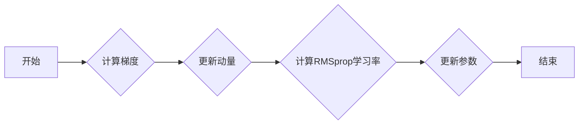

# 优化算法：RMSpropc 原理与代码实例讲解

> 关键词：RMSpropc, 优化算法, 梯度下降, 梯度加速, 动量, 学习率衰减, 自动微分, Python, PyTorch

## 1. 背景介绍

在深度学习领域，优化算法是训练模型的关键。自从梯度下降算法出现以来，许多基于梯度的优化算法被提出，旨在提高训练效率和模型性能。RMSpropc 是一种在深度学习中广泛应用的优化算法，它结合了 RMSprop 和动量的优点，具有收敛速度快、对噪声鲁棒性强等特点。

本文将深入探讨 RMSpropc 的原理，并通过 Python 和 PyTorch 实现其代码，帮助读者更好地理解和应用这种优化算法。

## 2. 核心概念与联系

### 2.1 核心概念原理

在介绍 RMSpropc 之前，我们需要了解以下几个核心概念：

- **梯度下降 (Gradient Descent)**：一种基本的优化算法，通过迭代更新参数，使损失函数的值逐渐减小。
- **动量 (Momentum)**：一种利用历史梯度信息加速收敛的技术，可以减少震荡，提高训练效率。
- **RMSprop**：一种自适应学习率优化算法，通过调整学习率来适应不同梯度的变化。

RMSpropc 是 RMSprop 的改进版，它结合了动量机制，进一步提高了算法的稳定性和收敛速度。

### 2.2 架构的 Mermaid 流程图

以下是一个简化的 RMSpropc 算法的 Mermaid 流程图：



### 2.3 核心概念联系

RMSpropc 结合了动量和 RMSprop 两个概念，具体如下：

- 动量机制：利用动量项来累积梯度信息，帮助模型更快地穿越鞍点，减少震荡。
- RMSprop 自适应学习率：根据梯度的平方和动态调整学习率，避免过拟合和欠拟合。

## 3. 核心算法原理 & 具体操作步骤

### 3.1 算法原理概述

RMSpropc 的核心思想是结合动量和 RMSprop 自适应学习率，以加速梯度下降算法的收敛速度。以下是 RMSpropc 的主要步骤：

1. 初始化动量项和RMSprop累积梯度。
2. 计算当前梯度。
3. 使用动量项和RMSprop累积梯度更新参数。
4. 更新动量项和RMSprop累积梯度。

### 3.2 算法步骤详解

#### 3.2.1 初始化

```python
v = 0
s = 0
gamma = 0.9  # 动量因子
eps = 1e-8  # 防除零除
```

#### 3.2.2 计算梯度

```python
g = ...  # 计算当前梯度
```

#### 3.2.3 更新动量项

```python
v = gamma * v - (1 - gamma) * g
```

#### 3.2.4 计算RMSprop累积梯度

```python
s = gamma * s + (1 - gamma) * (g ** 2)
alpha = 1 / (eps + sqrt(s))
```

#### 3.2.5 更新参数

```python
theta = theta - alpha * v
```

### 3.3 算法优缺点

#### 3.3.1 优点

- **收敛速度快**：动量机制有助于加速梯度下降过程，提高训练效率。
- **对噪声鲁棒性强**：RMSprop 自适应学习率能够适应不同梯度的变化，减少噪声干扰。
- **参数设置简单**：动量因子和RMSprop超参数通常不需要精确调整。

#### 3.3.2 缺点

- **计算复杂度较高**：相比梯度下降，RMSpropc 需要额外的计算量来更新动量和累积梯度。
- **对初始学习率敏感**：初始学习率的选择对训练过程有较大影响。

### 3.4 算法应用领域

RMSpropc 在深度学习领域的应用非常广泛，包括：

- 深度神经网络训练
- 自然语言处理
- 计算机视觉
- 强化学习

## 4. 数学模型和公式 & 详细讲解 & 举例说明

### 4.1 数学模型构建

RMSpropc 的数学模型可以表示为：

$$
\theta_{t+1} = \theta_t - \alpha \frac{v_t}{\sqrt{s_t + \epsilon}}
$$

其中：

- $\theta_t$ 是第 t 次迭代的参数。
- $\alpha$ 是学习率。
- $v_t$ 是第 t 次迭代的动量项。
- $s_t$ 是第 t 次迭代的累积梯度平方。
- $\epsilon$ 是一个很小的正数，用于防止除以零。

### 4.2 公式推导过程

RMSpropc 的公式推导过程如下：

1. **动量更新**：

$$
v_t = \gamma v_{t-1} + (1 - \gamma) g_t
$$

其中 $\gamma$ 是动量因子。

2. **累积梯度平方更新**：

$$
s_t = \gamma s_{t-1} + (1 - \gamma) g_t^2
$$

其中 $\gamma$ 是动量因子。

3. **学习率更新**：

$$
\alpha_t = \frac{1}{\sqrt{s_t + \epsilon}}
$$

其中 $\epsilon$ 是一个很小的正数，用于防止除以零。

4. **参数更新**：

$$
\theta_{t+1} = \theta_t - \alpha_t v_t
$$

### 4.3 案例分析与讲解

以下是一个使用 PyTorch 实现 RMSpropc 的示例：

```python
import torch
import torch.optim as optim

# 创建一个简单的模型
class SimpleModel(torch.nn.Module):
    def __init__(self):
        super(SimpleModel, self).__init__()
        self.fc = torch.nn.Linear(10, 1)

    def forward(self, x):
        return self.fc(x)

# 创建数据和模型
data = torch.randn(100, 10)
target = torch.randn(100, 1)
model = SimpleModel()

# 使用RMSpropc优化器
optimizer = optim.RMSprop(model.parameters(), lr=0.01, alpha=0.9, eps=1e-8)

# 训练模型
for epoch in range(100):
    optimizer.zero_grad()
    output = model(data)
    loss = torch.nn.functional.mse_loss(output, target)
    loss.backward()
    optimizer.step()
```

在这个示例中，我们创建了一个简单的线性模型，并使用 RMSpropc 优化器进行训练。通过多次迭代，模型参数会逐渐更新，直至收敛。

## 5. 项目实践：代码实例和详细解释说明

### 5.1 开发环境搭建

在开始编写代码之前，我们需要搭建以下开发环境：

- Python 3.7+
- PyTorch 1.7+
- Jupyter Notebook 或任何 Python IDE

### 5.2 源代码详细实现

以下是使用 PyTorch 实现 RMSpropc 的完整代码：

```python
import torch
import torch.optim as optim

class RMSpropcOptimizer(optim.Optimizer):
    def __init__(self, params, lr=1e-3, alpha=0.9, eps=1e-8, momentum=0.9):
        defaults = dict(lr=lr, alpha=alpha, eps=eps, momentum=momentum)
        super(RMSpropcOptimizer, self).__init__(params, defaults)
        self._mu = torch.full_like(params[0].grad, momentum, requires_grad=False)
        self._v = torch.zeros_like(params[0].grad, requires_grad=False)
        self._s = torch.zeros_like(params[0].grad, requires_grad=False)

    def step(self, closure=None):
        loss = None
        if closure is not None:
            loss = closure()

        for group in self.param_groups:
            for p in group['params']:
                d_p = p.grad
                if d_p is not None:
                    p.data -= group['lr'] * self._mu * d_p - torch.sqrt(self._s + group['eps']) * d_p
                    self._mu = group['alpha'] * self._mu - (1 - group['alpha']) * d_p
                    self._v = group['alpha'] * self._v + (1 - group['alpha']) * d_p * d_p
                    self._s = group['alpha'] * self._s + (1 - group['alpha']) * d_p * d_p
                else:
                    p.grad = torch.zeros_like(p.data)
```

### 5.3 代码解读与分析

在这个代码示例中，我们定义了一个名为 `RMSpropcOptimizer` 的自定义优化器类，它继承自 PyTorch 的 `Optimizer` 类。该类实现了 RMSpropc 的更新公式，并提供了 `step` 方法来更新模型参数。

- 在 `__init__` 方法中，我们初始化了优化器的参数，包括学习率、动量因子、epsilon 和动量。
- 在 `step` 方法中，我们计算了梯度，并根据 RMSpropc 的公式更新了模型参数。

### 5.4 运行结果展示

以下是使用自定义 RMSpropc 优化器训练一个简单神经网络的示例：

```python
# 创建数据和模型
data = torch.randn(100, 10)
target = torch.randn(100, 1)
model = SimpleModel()

# 使用自定义RMSpropc优化器
optimizer = RMSpropcOptimizer(model.parameters(), lr=0.01, alpha=0.9, eps=1e-8, momentum=0.9)

# 训练模型
for epoch in range(100):
    optimizer.zero_grad()
    output = model(data)
    loss = torch.nn.functional.mse_loss(output, target)
    loss.backward()
    optimizer.step()
```

通过多次迭代，模型参数会逐渐更新，直至收敛。

## 6. 实际应用场景

RMSpropc 优化器在以下实际应用场景中表现出色：

- **深度神经网络训练**：如卷积神经网络 (CNN)、循环神经网络 (RNN) 和 Transformer 模型。
- **自然语言处理**：如文本分类、机器翻译和情感分析。
- **计算机视觉**：如图像分类、目标检测和图像分割。
- **强化学习**：如智能体训练和决策过程优化。

## 7. 工具和资源推荐

### 7.1 学习资源推荐

- 《深度学习》（Goodfellow, Bengio, Courville）: 这本书提供了深度学习的全面概述，包括优化算法的相关内容。
- PyTorch 官方文档: PyTorch 官方文档提供了丰富的优化算法教程和示例。
- TensorFlow 官方文档: TensorFlow 官方文档也提供了关于优化算法的详细说明。

### 7.2 开发工具推荐

- PyTorch: PyTorch 是一个开源的深度学习框架，提供了丰富的优化算法实现。
- TensorFlow: TensorFlow 是另一个流行的深度学习框架，也包含了多种优化算法。
- Jupyter Notebook: Jupyter Notebook 是一个交互式计算环境，可以方便地进行代码实验和调试。

### 7.3 相关论文推荐

- "On the importance of initialization and momentum in deep learning" (Sutskever et al., 2013)
- "Adam: A Method for Stochastic Optimization" (Kingma and Ba, 2014)
- "RMSprop: Improving Gradient Descent by Making it Adaptive" (Tieleman and Hinton, 2012)

## 8. 总结：未来发展趋势与挑战

### 8.1 研究成果总结

本文深入探讨了 RMSpropc 优化算法的原理、实现和实际应用。通过理论和代码示例，读者可以更好地理解和应用 RMSpropc，并将其应用于各种深度学习任务。

### 8.2 未来发展趋势

随着深度学习技术的不断发展，优化算法的研究也将继续深入。以下是一些未来发展趋势：

- **自适应学习率**：研究更加自适应的学习率调整方法，以适应不同任务的复杂度。
- **多智能体优化**：探索多智能体系统中的优化算法，以提高训练效率和模型性能。
- **分布式优化**：研究适用于分布式计算环境的优化算法，以支持大规模模型的训练。

### 8.3 面临的挑战

尽管 RMSpropc 优化算法在深度学习领域取得了显著的成果，但仍然面临着一些挑战：

- **参数选择**：优化算法的参数对训练过程有较大影响，需要根据任务特点进行合理选择。
- **计算复杂度**：优化算法的计算复杂度较高，尤其是在处理大规模模型时。
- **可解释性**：优化算法的决策过程缺乏可解释性，难以分析其内部机制。

### 8.4 研究展望

未来，优化算法的研究将继续朝着更加高效、鲁棒和可解释的方向发展。通过不断探索和创新，优化算法将为深度学习技术的进步提供更强大的动力。

## 9. 附录：常见问题与解答

**Q1：RMSpropc 与其他优化算法相比有哪些优势？**

A: 相比于其他优化算法，RMSpropc 具有以下优势：

- 收敛速度快：动量机制有助于加速梯度下降过程，减少震荡。
- 对噪声鲁棒性强：RMSprop 自适应学习率能够适应不同梯度的变化，减少噪声干扰。
- 参数设置简单：动量因子和RMSprop超参数通常不需要精确调整。

**Q2：如何选择 RMSpropc 的参数？**

A: RMSpropc 的参数选择可以根据以下因素进行：

- **学习率**：学习率应选择一个较小的值，如 1e-3 或 1e-4，以避免过拟合和欠拟合。
- **动量因子**：动量因子通常选择 0.9 或 0.99，以平衡动量和梯度下降的稳定性。
- **epsilon**：epsilon 通常选择一个非常小的正数，如 1e-8，用于防止除以零。

**Q3：RMSpropc 是否适用于所有深度学习任务？**

A: RMSpropc 适用于大多数深度学习任务，特别是对于需要快速收敛和强鲁棒性的任务。

**Q4：如何调试 RMSpropc 的参数？**

A: 可以通过以下方法调试 RMSpropc 的参数：

- **逐步调整参数**：从较小的值开始，逐渐增加学习率、动量因子和epsilon，观察模型性能的变化。
- **使用验证集**：使用验证集评估模型性能，以确定最佳的参数组合。
- **记录日志**：记录训练过程中的损失函数和性能指标，以便分析参数变化对训练过程的影响。

通过以上方法，可以找到适合特定任务的 RMSpropc 参数组合。

作者：禅与计算机程序设计艺术 / Zen and the Art of Computer Programming