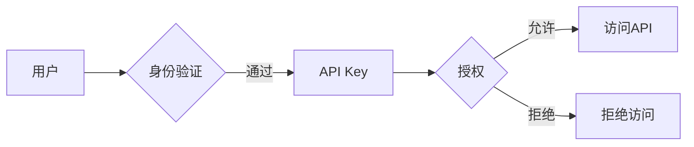

> 关键词：API Key, 访问控制，细粒度权限，分级权限，身份验证，安全策略，授权机制，身份和访问管理，API安全性

# 使用分级 API Key 进行细粒度访问控制

在当今的数字化时代，API（应用程序编程接口）已成为企业服务化、平台化、生态构建的核心。随着API服务的广泛应用，如何确保API的安全性和可控性成为一个至关重要的议题。分级API Key作为一种细粒度的访问控制方法，能够在保护API安全的同时，为用户提供灵活、高效的访问权限管理。本文将深入探讨分级API Key的原理、实现方法、应用场景及未来发展趋势。

## 1. 背景介绍

### 1.1 API服务的兴起

随着云计算、微服务架构的普及，企业内部的IT系统逐渐向API化转变。API服务允许第三方开发者通过标准的接口访问企业资源，构建创新的应用和服务。然而，这也带来了新的安全挑战，如API滥用、数据泄露等。

### 1.2 访问控制的重要性

为了保护API资源的安全，访问控制机制应运而生。访问控制确保只有授权用户才能访问特定的API资源。传统的访问控制方法，如基于用户名和密码的认证，难以满足日益复杂的应用场景。

### 1.3 细粒度权限的需求

随着API服务的多样化，简单的访问控制已无法满足需求。细粒度权限允许更精细地控制用户对资源的访问，提高安全性。

## 2. 核心概念与联系

### 2.1 核心概念

- **API Key**：一个密钥，用于身份验证和授权用户访问API服务。
- **身份验证**：确认用户的身份，通常通过用户名和密码、令牌等方式实现。
- **授权**：确定用户对特定资源的访问权限。
- **细粒度权限**：对用户权限进行细致划分，确保用户只能访问其被授权的部分。
- **分级权限**：根据用户角色或组织结构，将权限划分为不同级别。

### 2.2 架构流程图



在上述流程中，用户通过身份验证获得API Key，然后使用API Key进行授权，最终决定是否允许访问API。

## 3. 核心算法原理 & 具体操作步骤

### 3.1 算法原理概述

分级API Key的原理是基于角色的访问控制（RBAC）和属性基访问控制（ABAC）的融合。通过定义不同的角色和属性，为用户分配相应的权限，实现细粒度访问控制。

### 3.2 算法步骤详解

1. **角色定义**：定义不同的角色，如管理员、普通用户、合作伙伴等。
2. **权限分配**：为每个角色分配相应的权限，如读取、写入、删除等。
3. **用户角色绑定**：将用户与角色进行绑定，确定用户所属的角色。
4. **API Key生成**：为每个用户生成唯一的API Key。
5. **访问控制**：使用API Key进行身份验证，根据用户角色和属性进行授权。

### 3.3 算法优缺点

**优点**：

- **细粒度控制**：能够精确控制用户对API资源的访问。
- **灵活性强**：可以根据实际需求调整角色和权限。
- **安全性高**：可以有效防止未授权访问。

**缺点**：

- **管理复杂**：需要维护角色、权限和用户角色绑定关系。
- **性能开销**：身份验证和授权过程可能增加性能开销。

### 3.4 算法应用领域

分级API Key适用于以下场景：

- **企业内部API服务**：用于保护企业内部API资源的安全。
- **第三方服务集成**：用于控制第三方服务对API资源的访问。
- **移动应用开发**：用于移动应用访问API服务时的身份验证和授权。

## 4. 数学模型和公式 & 详细讲解 & 举例说明

### 4.1 数学模型构建

为了描述分级API Key的访问控制模型，我们可以使用以下数学公式：

$$
Access_{grant} = P_{role} \cap P_{attribute}
$$

其中，$Access_{grant}$ 表示用户访问API资源的权限，$P_{role}$ 表示用户的角色权限集，$P_{attribute}$ 表示用户的属性权限集。

### 4.2 公式推导过程

假设用户A属于角色R，角色R拥有权限P1和P2，用户A具有属性A1和A2，属性A1和A2分别对应权限P3和P4。则用户A的访问权限为：

$$
Access_{grant} = P_{R} \cap (P_{A1} \cup P_{A2}) = (P_{P1} \cup P_{P2}) \cap (P_{P3} \cup P_{P4}) = P_{P1} \cup P_{P2} \cup P_{P3} \cup P_{P4}
$$

### 4.3 案例分析与讲解

假设有一个电商平台的API服务，角色包括管理员、普通用户和合作伙伴。管理员可以访问所有API资源，普通用户可以访问部分API资源，合作伙伴只能访问特定API资源。根据上述数学模型，我们可以定义以下权限集：

- $P_{admin}$：管理员权限集，包含所有API资源权限。
- $P_{user}$：普通用户权限集，包含部分API资源权限。
- $P_{partner}$：合作伙伴权限集，包含特定API资源权限。

用户B是普通用户，属于角色$R_{user}$，则其访问权限为：

$$
Access_{grant} = P_{R_{user}} \cap P_{user} = P_{user}
$$

用户C是合作伙伴，属于角色$R_{partner}$，则其访问权限为：

$$
Access_{grant} = P_{R_{partner}} \cap P_{partner} = P_{partner}
$$

## 5. 项目实践：代码实例和详细解释说明

### 5.1 开发环境搭建

以下是使用Python和Flask框架实现分级API Key的示例代码：

```python
from flask import Flask, request, jsonify
from werkzeug.security import generate_password_hash, check_password_hash

app = Flask(__name__)

# 用户角色和权限数据
roles_permissions = {
    'admin': {'all'},
    'user': {'read', 'write'},
    'partner': {'read'}
}

# 用户数据
users = {
    'admin': {
        'password': generate_password_hash('admin123'),
        'role': 'admin'
    },
    'user': {
        'password': generate_password_hash('user123'),
        'role': 'user'
    },
    'partner': {
        'password': generate_password_hash('partner123'),
        'role': 'partner'
    }
}

@app.route('/login', methods=['POST'])
def login():
    username = request.json.get('username')
    password = request.json.get('password')
    user = users.get(username)
    if user and check_password_hash(user['password'], password):
        return jsonify({'message': '登录成功', 'role': user['role']})
    return jsonify({'message': '用户名或密码错误'}), 401

@app.route('/api/resource', methods=['GET'])
def get_resource():
    role = request.headers.get('Authorization')
    if role not in roles_permissions:
        return jsonify({'message': '无权访问'}), 403
    permissions = roles_permissions[role]
    if 'read' in permissions:
        return jsonify({'message': '资源内容'})
    return jsonify({'message': '无权访问'}), 403

if __name__ == '__main__':
    app.run(debug=True)
```

### 5.2 源代码详细实现

- 定义了用户角色和权限数据`roles_permissions`和用户数据`users`。
- `/login`路由用于用户登录，验证用户名和密码，并返回用户角色。
- `/api/resource`路由用于访问API资源，验证用户角色和权限，并返回资源内容。

### 5.3 代码解读与分析

- 使用Flask框架搭建基本的Web应用。
- 使用Werkzeug库对密码进行加密和验证。
- 根据用户角色和权限进行访问控制。

### 5.4 运行结果展示

用户通过`/login`接口登录后，可以在后续的请求中设置`Authorization`头部，包含其角色信息。例如：

```
GET /api/resource HTTP/1.1
Host: example.com
Authorization: user
```

如果用户具有访问权限，则返回资源内容；否则返回无权访问的提示。

## 6. 实际应用场景

### 6.1 内部API服务

企业内部API服务可以使用分级API Key控制不同用户组的访问权限，例如：

- 管理员可以访问所有API资源，进行系统管理和维护。
- 开发者可以访问开发相关的API资源，进行应用开发和测试。
- 运维人员可以访问监控和管理API资源，进行系统监控和维护。

### 6.2 第三方服务集成

第三方服务集成可以使用分级API Key控制对API资源的访问，例如：

- 合作伙伴可以访问特定的API资源，获取数据或提供服务。
- 第三方开发者可以访问API资源，开发第三方应用。

### 6.3 移动应用开发

移动应用开发可以使用分级API Key控制对API资源的访问，例如：

- 用户可以访问自己的个人信息。
- 应用开发者可以访问应用相关数据。

## 7. 工具和资源推荐

### 7.1 学习资源推荐

- 《API设计指南》：了解API设计原则和最佳实践。
- 《RESTful API设计最佳实践》：学习RESTful API设计方法。
- 《OAuth 2.0认证与授权》：了解OAuth 2.0认证机制。

### 7.2 开发工具推荐

- Flask：轻量级的Python Web框架。
- Django：Python Web框架，提供强大的ORM和认证系统。
- Spring Boot：Java Web框架，提供简洁的开发方式。

### 7.3 相关论文推荐

- 《OAuth 2.0 Authorization Framework》：OAuth 2.0认证框架的官方文档。
- 《The Design of the OpenID Connect Protocol》：OpenID Connect协议的设计文档。

## 8. 总结：未来发展趋势与挑战

### 8.1 研究成果总结

分级API Key作为一种细粒度的访问控制方法，能够在保护API安全的同时，为用户提供灵活、高效的访问权限管理。本文介绍了分级API Key的原理、实现方法、应用场景及未来发展趋势。

### 8.2 未来发展趋势

- **自动化权限管理**：利用机器学习等技术实现自动化的权限管理，降低管理成本。
- **动态权限调整**：根据用户行为和系统状态动态调整权限，提高安全性。
- **跨域访问控制**：支持跨域访问控制，实现不同系统间的资源共享。

### 8.3 面临的挑战

- **权限管理复杂性**：随着用户和角色的增多，权限管理变得更加复杂。
- **安全性挑战**：API Key泄露、角色权限滥用等问题需要持续关注。
- **跨平台兼容性**：实现跨平台的分级API Key访问控制需要考虑兼容性问题。

### 8.4 研究展望

分级API Key将继续发展，并结合人工智能、云计算等技术，为API安全提供更加智能、高效、安全的解决方案。

## 9. 附录：常见问题与解答

**Q1：分级API Key如何提高安全性？**

A：分级API Key通过细粒度的权限控制，确保用户只能访问其被授权的部分，从而提高安全性。

**Q2：分级API Key适用于哪些场景？**

A：分级API Key适用于企业内部API服务、第三方服务集成、移动应用开发等场景。

**Q3：如何实现分级API Key的权限管理？**

A：可以通过定义角色、分配权限、用户角色绑定等方式实现分级API Key的权限管理。

**Q4：如何防止API Key泄露？**

A：可以通过以下方式防止API Key泄露：
- 对API Key进行加密存储。
- 使用HTTPS等安全协议传输API Key。
- 设置API Key的有效期和访问次数限制。

**Q5：如何评估分级API Key的效果？**

A：可以通过以下方式评估分级API Key的效果：
- 监控API访问日志，分析访问行为。
- 定期进行安全审计，确保API资源的安全。

作者：禅与计算机程序设计艺术 / Zen and the Art of Computer Programming