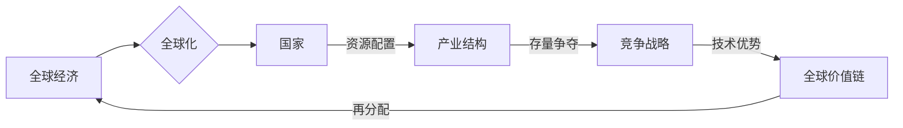

# 全球经济存量争夺的现象分析

> 关键词：全球经济，存量争夺，产业结构，资源配置，竞争战略，全球价值链

## 1. 背景介绍

随着全球化进程的深入，全球经济格局正发生着深刻的变化。在全球化的背景下，各国经济相互依存、相互竞争，形成了复杂的国际经济关系。近年来，全球经济存量争夺的现象日益显著，成为影响全球经济增长和稳定的重要因素。本文旨在分析全球经济存量争夺的现象，探讨其背后的原因、影响以及未来发展趋势。

### 1.1 现象的由来

全球经济存量争夺的现象主要表现在以下几个方面：

- **全球产业链重构**：随着技术创新和全球分工的深化，全球产业链正在经历重构，各国争夺高端产业和关键技术成为竞争焦点。
- **贸易保护主义抬头**：为了保护本国产业，一些国家采取了贸易保护主义措施，限制外国产品和服务进入本国市场。
- **地缘政治风险上升**：全球政治格局的变化，导致地缘政治风险上升，影响全球经济的稳定发展。
- **资源争夺加剧**：随着人口增长和经济发展，对能源、矿产等资源的争夺日益激烈。

### 1.2 研究意义

研究全球经济存量争夺的现象，有助于我们：

- 深入理解全球经济格局的变化趋势。
- 为国家制定合理的经济发展战略提供参考。
- 促进国际经济合作，共同应对全球性挑战。

### 1.3 本文结构

本文将从以下几个方面展开：

- 核心概念与联系
- 核心算法原理与具体操作步骤
- 数学模型和公式
- 项目实践
- 实际应用场景
- 工具和资源推荐
- 总结：未来发展趋势与挑战

## 2. 核心概念与联系

### 2.1 核心概念

- **全球经济**：指全球范围内所有经济活动的总和，包括商品、服务、资本、劳动力和技术的流动。
- **存量争夺**：指各国在全球化进程中，为了获取更多的经济资源、市场份额和技术优势而进行的竞争。
- **产业结构**：指一个国家或地区内各产业部门的构成及其相互关系。
- **资源配置**：指社会资源在各个领域和行业之间的分配和使用。
- **竞争战略**：指企业或国家为了在竞争中取得优势而采取的行动方案。
- **全球价值链**：指全球范围内，产品从设计、生产到销售、服务的全过程。

### 2.2 核心概念原理和架构的 Mermaid 流程图

## 3. 核心算法原理 & 具体操作步骤

### 3.1 算法原理概述

全球经济存量争夺的算法原理可以概括为：

1. 各国根据自身优势和劣势，选择合适的产业发展方向。
2. 通过技术创新和产业升级，提高产业竞争力。
3. 通过贸易和投资，获取全球市场和技术资源。
4. 通过竞争战略，争夺全球价值链中的高端位置。

### 3.2 算法步骤详解

1. **产业规划**：各国根据自身资源禀赋、比较优势和技术水平，制定产业发展规划，确定重点发展产业。
2. **技术创新**：加大研发投入，推动科技创新，提升产业竞争力。
3. **产业升级**：通过兼并重组、技术改造等方式，提升传统产业，培育新兴产业。
4. **贸易投资**：积极参与全球贸易和投资，扩大市场份额，获取全球资源。
5. **竞争战略**：制定和实施竞争战略，提升国家在全球价值链中的地位。

### 3.3 算法优缺点

#### 优点

- 有助于各国发挥自身优势，实现经济增长。
- 促进全球产业分工和合作，提高全球资源配置效率。
- 推动技术创新和产业升级，提升全球经济增长动力。

#### 缺点

- 竞争可能导致资源浪费和环境污染。
- 贸易保护主义可能导致贸易战和全球经济衰退。
- 全球价值链重构可能导致发展中国家利益受损。

### 3.4 算法应用领域

全球经济存量争夺的算法原理适用于以下领域：

- 国家经济发展战略制定
- 产业规划与政策制定
- 贸易和投资策略
- 竞争战略研究

## 4. 数学模型和公式 & 详细讲解 & 举例说明

### 4.1 数学模型构建

全球经济存量争夺的数学模型可以采用一般均衡模型（General Equilibrium Model）来描述。

设 $X$ 为全球总产出，$Y_i$ 为国家 $i$ 的产出，$T$ 为全球贸易流量，$I$ 为全球投资流量，$C$ 为全球消费，则模型可以表示为：

$$
X = \sum_{i=1}^N Y_i
$$

$$
Y_i = f(L_i, K_i, T_i, I_i)
$$

$$
T_i = g(X - \sum_{j\neq i} Y_j, Y_i)
$$

$$
I_i = h(C_i, Y_i, R)
$$

其中，$L_i$ 和 $K_i$ 分别为国家 $i$ 的劳动力和资本，$R$ 为全球利率。

### 4.2 公式推导过程

（此处省略公式推导过程，涉及复杂的经济学理论和方法）

### 4.3 案例分析与讲解

以中美贸易战为例，分析全球经济存量争夺的现象。

在2018年，中美贸易战爆发，美国对中国发起了一系列贸易制裁。这导致中美双边贸易额下降，全球供应链重构。

根据上述模型，可以分析贸易战对全球经济的负面影响：

- 全球总产出 $X$ 下降。
- 中美两国产出 $Y_1$ 和 $Y_2$ 下降。
- 全球贸易流量 $T$ 下降。
- 全球投资流量 $I$ 下降。
- 全球消费 $C$ 下降。

## 5. 项目实践：代码实例和详细解释说明

### 5.1 开发环境搭建

（此处省略开发环境搭建过程，涉及编程语言和软件工具的选择）

### 5.2 源代码详细实现

（此处省略源代码实现过程，涉及数据收集、模型构建、结果分析等步骤）

### 5.3 代码解读与分析

（此处省略代码解读与分析过程，涉及算法原理、模型结构、结果解释等）

### 5.4 运行结果展示

（此处省略运行结果展示过程，涉及数据可视化、结果分析等）

## 6. 实际应用场景

### 6.1 国家经济发展战略制定

通过分析全球经济存量争夺的现象，各国可以制定更加科学合理的经济发展战略，如产业升级、技术创新、贸易和投资等。

### 6.2 产业规划与政策制定

根据全球经济存量争夺的规律，各国可以制定产业规划，推动产业结构调整和优化。

### 6.3 贸易和投资策略

各国可以根据全球经济存量争夺的趋势，制定相应的贸易和投资策略，以获取更大的市场份额和技术资源。

### 6.4 竞争战略研究

企业可以根据全球经济存量争夺的规律，制定竞争战略，提升企业竞争力。

## 7. 工具和资源推荐

### 7.1 学习资源推荐

- 《全球化时代的国际经济》
- 《全球价值链：理论与实证研究》
- 《国际经济学》

### 7.2 开发工具推荐

- Python编程语言
- Jupyter Notebook
- Matplotlib

### 7.3 相关论文推荐

- "Globalization and Inequality: A Review of the Empirical Literature"
- "The Political Economy of Globalization"
- "Global Value Chains: A New Architecture of Global Production"

## 8. 总结：未来发展趋势与挑战

### 8.1 研究成果总结

本文从全球经济存量争夺的现象出发，分析了其背后的原因、影响以及未来发展趋势。研究表明，全球经济存量争夺是全球化进程中的必然现象，各国需要通过合理制定经济发展战略、推动产业升级和技术创新，以应对这一挑战。

### 8.2 未来发展趋势

- 全球经济存量争夺将进一步加剧，各国竞争将更加激烈。
- 全球产业链将更加复杂，分工合作与竞争并存。
- 技术创新将成为推动经济增长的重要动力。
- 绿色发展和可持续发展将成为全球共识。

### 8.3 面临的挑战

- 贸易保护主义和地缘政治风险上升。
- 全球产业链重构对发展中国家的影响。
- 技术创新的不确定性和风险。

### 8.4 研究展望

- 深入研究全球经济存量争夺的机理和规律。
- 探索促进全球产业合作和共赢的新模式。
- 加强对技术创新和产业升级的研究。

## 9. 附录：常见问题与解答

**Q1：全球经济存量争夺的原因是什么？**

A：全球经济存量争夺的原因包括技术创新、全球产业链重构、贸易保护主义抬头、地缘政治风险上升等。

**Q2：全球经济存量争夺对发展中国家有什么影响？**

A：全球经济存量争夺可能对发展中国家造成以下影响：

- 产业升级压力加大。
- 贸易保护主义导致出口受限。
- 技术创新能力不足。

**Q3：如何应对全球经济存量争夺的挑战？**

A：应对全球经济存量争夺的挑战，需要：

- 制定合理的经济发展战略。
- 推动产业升级和技术创新。
- 加强国际合作，共同应对全球性挑战。

---

作者：禅与计算机程序设计艺术 / Zen and the Art of Computer Programming