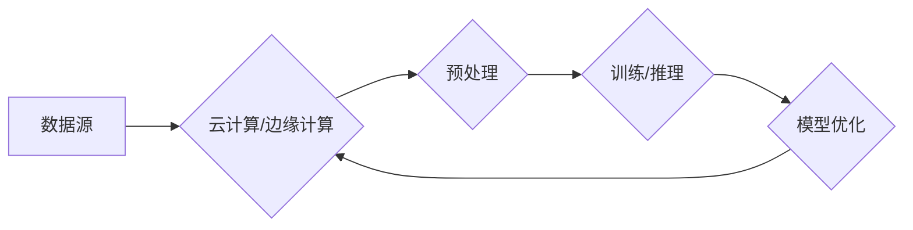

# 商汤绝影的算力储备与未来规划

> 关键词：商汤科技，绝影AI芯片，深度学习，算力架构，人工智能，云计算，边缘计算，未来规划

## 1. 背景介绍

随着人工智能技术的飞速发展，算力作为支撑人工智能应用的基础，其重要性日益凸显。商汤科技作为中国领先的深度学习平台，其自主研发的绝影AI芯片在算力储备和未来规划方面具有独特的优势。本文将深入探讨商汤绝影的算力架构、技术特点以及未来的发展方向。

### 1.1 人工智能算力需求激增

近年来，人工智能技术在图像识别、语音识别、自然语言处理等领域取得了显著进展，推动了一系列创新应用的出现。然而，这些应用对算力的需求也在不断增长。尤其是在深度学习领域，随着模型复杂度的提升，对计算资源的消耗呈指数级增长。

### 1.2 商汤科技与绝影AI芯片

商汤科技成立于2014年，是一家专注于人工智能技术研发和应用的公司。商汤科技通过自主研发的深度学习平台，为各行各业提供人工智能解决方案。绝影AI芯片是商汤科技在人工智能算力领域的重要布局，旨在为用户提供高性能、低功耗的深度学习计算能力。

## 2. 核心概念与联系

### 2.1 核心概念

- **深度学习**：一种模拟人脑神经网络结构，通过多层非线性变换学习数据特征的机器学习技术。
- **AI芯片**：专为人工智能应用设计的集成电路，具备高性能、低功耗的特点。
- **算力架构**：包括CPU、GPU、FPGA、ASIC等硬件设备以及相应的软件生态系统，为深度学习应用提供计算资源。
- **云计算**：通过互联网提供计算资源，包括硬件设备、软件资源和数据存储等，用户可以根据需求按量使用。
- **边缘计算**：在数据产生地附近进行计算和处理，降低延迟，提高实时性。

### 2.2 架构流程图



在这个流程图中，数据源通过云计算或边缘计算平台进行处理，包括数据预处理、模型训练和推理，以及模型的优化更新。这一流程反映了人工智能应用的基本架构，也展示了商汤绝影在算力架构方面的优势。

## 3. 核心算法原理 & 具体操作步骤

### 3.1 算法原理概述

商汤绝影AI芯片采用异构计算架构，融合了CPU、GPU、FPGA等不同类型的计算单元，能够高效地执行深度学习算法。其核心原理如下：

- **并行计算**：利用多核CPU和GPU并行处理大量数据，提高计算效率。
- **低功耗设计**：通过芯片级优化，降低能耗，满足移动设备和边缘设备的应用需求。
- **高效内存管理**：采用片上缓存和内存压缩技术，提高数据访问速度和存储效率。
- **软件生态系统**：提供丰富的深度学习框架和工具，方便开发者快速开发和部署应用。

### 3.2 算法步骤详解

1. **数据预处理**：对输入数据进行清洗、标注、归一化等处理，为深度学习算法提供高质量的数据集。
2. **模型训练**：利用深度学习算法对训练数据进行特征提取和分类，得到优化后的模型参数。
3. **模型推理**：将训练好的模型应用于实际数据，进行预测和决策。
4. **模型优化**：根据实际应用效果，调整模型结构和参数，提高模型性能。

### 3.3 算法优缺点

#### 优点：

- **高性能**：并行计算架构，能够快速处理大量数据，满足深度学习应用需求。
- **低功耗**：芯片级优化，降低能耗，适应移动设备和边缘设备的应用场景。
- **易用性**：丰富的软件生态系统，方便开发者快速开发和部署应用。

#### 缺点：

- **成本较高**：异构计算架构和芯片级优化导致成本较高。
- **软件生态相对较小**：相比通用CPU和GPU，绝影AI芯片的软件生态相对较小。

### 3.4 算法应用领域

商汤绝影AI芯片在以下领域具有广泛应用：

- **智能安防**：人脸识别、视频分析、异常检测等。
- **智能驾驶**：自动驾驶、车道线检测、障碍物识别等。
- **医疗健康**：医学图像分析、疾病诊断、药物研发等。
- **智能制造**：工业检测、质量监控、流程优化等。

## 4. 数学模型和公式 & 详细讲解 & 举例说明

### 4.1 数学模型构建

商汤绝影AI芯片所使用的深度学习算法通常包括以下数学模型：

- **卷积神经网络(CNN)**：用于图像识别、图像分割等任务。
- **循环神经网络(RNN)**：用于序列数据处理，如语音识别、机器翻译等。
- **Transformer**：用于自然语言处理、文本生成等任务。

### 4.2 公式推导过程

以CNN为例，其基本公式如下：

$$
\mathbf{h}^{(l)} = f(\mathbf{W}^{(l)} \mathbf{h}^{(l-1)} + \mathbf{b}^{(l)}) + \mathbf{h}^{(l-1)}
$$

其中，$\mathbf{h}^{(l)}$ 表示第 $l$ 层的输出，$\mathbf{W}^{(l)}$ 表示第 $l$ 层的权重矩阵，$\mathbf{b}^{(l)}$ 表示第 $l$ 层的偏置向量，$f$ 表示非线性激活函数。

### 4.3 案例分析与讲解

以商汤科技在智能安防领域的应用为例，其使用的深度学习模型为基于CNN的人脸识别算法。该算法首先对输入的人脸图像进行预处理，包括灰度化、缩放、归一化等操作。然后，将预处理后的图像输入到CNN模型中进行特征提取和分类，得到人脸身份的预测结果。

## 5. 项目实践：代码实例和详细解释说明

### 5.1 开发环境搭建

商汤科技为绝影AI芯片提供了丰富的开发工具和框架，包括：

- **SM++**：商汤科技深度学习平台，支持多种深度学习算法和模型。
- **MNN**：商汤科技深度学习引擎，支持多种硬件平台的部署。
- **PyTorch、TensorFlow**：主流深度学习框架，支持商汤绝影AI芯片的加速。

### 5.2 源代码详细实现

以下是一个使用PyTorch和商汤绝影AI芯片进行人脸识别的示例代码：

```python
import torch
from torchvision import transforms
from torch.utils.data import DataLoader
from mnn.pytorch import MNNModule

# 数据预处理
transform = transforms.Compose([
    transforms.Resize((224, 224)),
    transforms.ToTensor(),
])

# 加载模型
model = MNNModule.from_pretrained('mobilenet_v2')

# 加载数据集
train_dataset = ...
train_loader = DataLoader(train_dataset, batch_size=32, shuffle=True)

# 训练模型
for epoch in range(10):
    for data in train_loader:
        images, labels = data
        images = transform(images).to('cuda')
        labels = labels.to('cuda')
        outputs = model(images)
        loss = ...
        loss.backward()
        ...
```

### 5.3 代码解读与分析

以上代码首先导入了所需的库，并定义了数据预处理、模型加载和数据加载的步骤。然后，在训练循环中，模型对训练数据进行前向传播和反向传播，并进行参数更新。

### 5.4 运行结果展示

在训练过程中，可以观察训练集和验证集上的损失值和准确率等指标，以评估模型性能。最终，通过测试集评估模型在真实数据上的表现。

## 6. 实际应用场景

### 6.1 智能安防

商汤科技的绝影AI芯片在智能安防领域具有广泛应用，包括：

- **人脸识别**：通过人脸识别技术，实现对犯罪嫌疑人的快速识别和追踪。
- **视频分析**：对监控视频进行实时分析，识别异常行为和事件。
- **异常检测**：对监控区域进行实时监测，发现异常情况并及时报警。

### 6.2 智能驾驶

商汤科技的绝影AI芯片在智能驾驶领域具有广泛应用，包括：

- **自动驾驶**：通过激光雷达、摄像头等传感器收集数据，实现对车辆周围环境的感知和决策。
- **车道线检测**：通过图像处理技术，识别道路上的车道线，辅助驾驶。
- **障碍物识别**：通过图像识别技术，识别车辆周围的障碍物，提高行车安全性。

### 6.3 医疗健康

商汤科技的绝影AI芯片在医疗健康领域具有广泛应用，包括：

- **医学图像分析**：通过对医学影像进行深度学习分析，辅助医生进行疾病诊断。
- **疾病诊断**：利用深度学习技术，辅助医生进行疾病诊断，提高诊断效率和准确性。
- **药物研发**：通过深度学习技术，加速新药研发过程。

## 7. 工具和资源推荐

### 7.1 学习资源推荐

- 商汤科技官网：提供丰富的技术文档、教程和案例，帮助开发者快速上手绝影AI芯片。
- 《深度学习》系列书籍：介绍深度学习的基本原理和应用，适合初学者和进阶者。

### 7.2 开发工具推荐

- 商汤科技深度学习平台SM++：支持多种深度学习算法和模型，方便开发者快速开发和部署应用。
- MNN深度学习引擎：支持多种硬件平台的部署，包括商汤绝影AI芯片。

### 7.3 相关论文推荐

- "Deep Learning for Computer Vision: A Review"：综述了深度学习在计算机视觉领域的应用。
- "Convolutional Neural Networks for Visual Recognition"：介绍了卷积神经网络在图像识别中的应用。
- "Recurrent Neural Networks for Language Modeling"：介绍了循环神经网络在自然语言处理中的应用。

## 8. 总结：未来发展趋势与挑战

### 8.1 研究成果总结

商汤科技在人工智能算力领域取得了显著成果，其自主研发的绝影AI芯片在算力架构、技术特点以及应用领域等方面具有独特优势。通过深度学习平台SM++和MNN深度学习引擎，商汤科技为开发者提供了丰富的工具和资源，推动人工智能技术的应用和发展。

### 8.2 未来发展趋势

未来，人工智能算力将呈现以下发展趋势：

- **芯片设计更加多样化**：针对不同应用场景，开发更加专业化的AI芯片，提高计算效率和降低功耗。
- **软件生态系统不断完善**：提供更加丰富的深度学习框架和工具，降低开发者门槛，推动人工智能应用的发展。
- **边缘计算成为重要趋势**：在数据产生地附近进行计算和处理，降低延迟，提高实时性。

### 8.3 面临的挑战

商汤科技在人工智能算力领域面临的挑战主要包括：

- **芯片设计难度大**：AI芯片设计需要融合多种技术和知识，设计难度较大。
- **软件生态相对较小**：与通用计算平台相比，AI芯片的软件生态相对较小。
- **人才短缺**：AI芯片和深度学习领域的人才相对短缺，制约了行业的发展。

### 8.4 研究展望

商汤科技将继续加大研发投入，推动AI芯片和深度学习技术的发展。未来，商汤科技将重点关注以下方向：

- **芯片设计创新**：开发更加高效、低功耗的AI芯片，满足不同应用场景的需求。
- **软件生态建设**：完善深度学习平台和工具，降低开发者门槛，推动人工智能应用的发展。
- **人才培养**：加强与高校和科研机构的合作，培养更多AI芯片和深度学习领域的人才。

相信在商汤科技等企业的共同努力下，人工智能算力领域将迎来更加美好的未来。

## 9. 附录：常见问题与解答

**Q1：商汤绝影AI芯片与通用计算平台有何区别？**

A：商汤绝影AI芯片是专为人工智能应用设计的集成电路，具有高性能、低功耗的特点，而通用计算平台如CPU、GPU等则适用于通用计算任务。商汤绝影AI芯片在深度学习算法的执行效率上具有显著优势。

**Q2：商汤绝影AI芯片在哪些领域具有广泛应用？**

A：商汤绝影AI芯片在智能安防、智能驾驶、医疗健康、智能制造等多个领域具有广泛应用。

**Q3：商汤科技在AI芯片领域有哪些合作伙伴？**

A：商汤科技与多家企业建立了合作关系，包括华为、OPPO、小米等，共同推动AI技术的应用和发展。

**Q4：商汤科技如何应对人才短缺的挑战？**

A：商汤科技加强与高校和科研机构的合作，培养更多AI芯片和深度学习领域的人才。同时，通过内部培训、技术交流等方式，提升现有员工的技能水平。

**Q5：商汤科技在AI芯片领域的未来规划是什么？**

A：商汤科技将继续加大研发投入，推动AI芯片和深度学习技术的发展。未来，商汤科技将重点关注芯片设计创新、软件生态建设、人才培养等方面。

作者：禅与计算机程序设计艺术 / Zen and the Art of Computer Programming