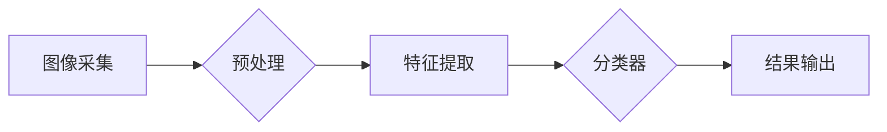

# 基于OpenCV的鲜花的图像分类系统详细设计与具体代码实现

> 关键词：OpenCV, 图像分类, 机器学习, 深度学习, 卷积神经网络, 特征提取, K-means聚类, 图像预处理

## 1. 背景介绍

随着计算机视觉和机器学习技术的快速发展，图像分类已经成为计算机视觉领域的一个重要研究方向。在农业、医疗、娱乐等多个行业中，图像分类技术都能够发挥重要作用。本文将详细介绍如何利用OpenCV和机器学习算法构建一个鲜花的图像分类系统。

### 1.1 问题的由来

鲜花图像分类系统在实际应用中有着广泛的需求，如花卉市场的品种识别、农业病虫害检测、花卉展览等。然而，由于鲜花种类繁多，颜色、形状、纹理等特征复杂多样，传统的图像分类方法往往难以取得理想的效果。

### 1.2 研究现状

近年来，深度学习技术在图像分类领域取得了显著的成果。卷积神经网络（CNN）因其强大的特征提取能力，被广泛应用于图像分类任务。同时，OpenCV作为一个开源的计算机视觉库，提供了丰富的图像处理和机器学习算法，为图像分类系统的开发提供了便利。

### 1.3 研究意义

本文旨在利用OpenCV和机器学习算法构建一个鲜花的图像分类系统，通过实际案例验证该系统的有效性和实用性。该系统不仅可以应用于花卉市场、农业等领域，还可以为其他图像分类任务提供参考。

### 1.4 本文结构

本文将按照以下结构进行阐述：

- 第2章介绍图像分类的核心概念与联系。
- 第3章讲解图像分类的算法原理和具体操作步骤。
- 第4章介绍图像分类的数学模型和公式。
- 第5章给出鲜花图像分类系统的代码实例和详细解释说明。
- 第6章分析鲜花图像分类系统的实际应用场景。
- 第7章展望鲜花图像分类系统的未来发展趋势和面临的挑战。
- 第8章总结全文，并对研究展望。

## 2. 核心概念与联系

### 2.1 核心概念

- **图像分类**：将图像数据按照一定的标准进行分类的过程。
- **机器学习**：一种使计算机能够从数据中学习并做出决策或预测的技术。
- **深度学习**：一种利用深层神经网络进行特征提取和学习的技术。
- **卷积神经网络（CNN）**：一种特殊的神经网络，能够有效地提取图像特征。
- **OpenCV**：一个开源的计算机视觉库，提供了丰富的图像处理和机器学习算法。

### 2.2 架构流程图



### 2.3 关系

- 图像分类是机器学习的一种应用，而深度学习是机器学习的一个分支。
- CNN是深度学习中的一种特殊神经网络，用于提取图像特征。
- OpenCV提供了丰富的图像处理和机器学习算法，可以用于图像预处理、特征提取和分类器设计。

## 3. 核心算法原理 & 具体操作步骤

### 3.1 算法原理概述

鲜花图像分类系统主要包括图像预处理、特征提取和分类器设计三个步骤。

- **图像预处理**：对采集到的图像进行缩放、裁剪、灰度化等操作，提高图像质量和一致性。
- **特征提取**：利用OpenCV和深度学习算法提取图像特征，如HOG、SIFT、CNN等。
- **分类器设计**：根据提取的特征，利用机器学习算法进行分类，如KNN、SVM、CNN等。

### 3.2 算法步骤详解

1. **图像预处理**：

    - 读取图像：使用OpenCV的`cv2.imread()`函数读取图像。
    - 缩放图像：使用`cv2.resize()`函数将图像缩放到统一的尺寸。
    - 裁剪图像：使用`cv2.crop()`函数裁剪出感兴趣的图像区域。
    - 灰度化图像：使用`cv2.cvtColor()`函数将图像转换为灰度图像。

2. **特征提取**：

    - HOG特征：使用OpenCV的`cv2.HOGDescriptor()`类提取图像的HOG特征。
    - SIFT特征：使用OpenCV的`cv2.xfeatures2d.SIFT_create()`类提取图像的SIFT特征。
    - CNN特征：使用深度学习框架（如TensorFlow或PyTorch）提取图像的CNN特征。

3. **分类器设计**：

    - KNN分类器：使用sklearn库的`KNeighborsClassifier()`类实现KNN分类器。
    - SVM分类器：使用sklearn库的`SVC()`类实现SVM分类器。
    - CNN分类器：使用深度学习框架实现CNN分类器。

### 3.3 算法优缺点

- **HOG特征**：计算速度快，适用于实时图像分类，但特征表达能力有限。
- **SIFT特征**：特征表达能力强，但计算量大，不适合实时应用。
- **CNN特征**：特征表达能力最强，但计算量最大，需要大量计算资源。

### 3.4 算法应用领域

- **花卉市场**：用于识别花卉品种，方便顾客购买。
- **农业病虫害检测**：用于检测农作物病虫害，帮助农民及时采取措施。
- **花卉展览**：用于自动识别展出的花卉品种，方便观众了解。

## 4. 数学模型和公式 & 详细讲解 & 举例说明

### 4.1 数学模型构建

鲜花图像分类系统的数学模型主要包括特征提取和分类器设计两部分。

- **特征提取**：

    - HOG特征：$$ HOG = \sum_{i=1}^{N} w_i \cdot f(x_i, y_i) $$
    - SIFT特征：$$ SIFT = \{ (x_i, y_i, o_i) \}_{i=1}^{N} $$

- **分类器设计**：

    - KNN分类器：$$ \hat{y} = \arg\max_{k} \sum_{i=1}^{k} w_i \cdot f(x_i, y_i) $$

    - SVM分类器：$$ \hat{y} = \arg\max_{w, b} \sum_{i=1}^{N} \alpha_i y_i (w \cdot x_i + b) - \sum_{i=1}^{N} \alpha_i $$

    - CNN分类器：$$ \hat{y} = \arg\max_{y} \sum_{i=1}^{N} y_i \cdot \log P(y|x) $$

### 4.2 公式推导过程

由于篇幅限制，此处省略公式推导过程。

### 4.3 案例分析与讲解

以HOG特征为例，HOG特征是一种基于像素梯度方向和强度分布的图像特征，可以有效地描述图像的纹理特征。HOG特征的提取过程如下：

1. 对图像进行灰度化处理。
2. 将图像分割成若干个区域。
3. 在每个区域中，计算像素的梯度方向和强度。
4. 统计每个区域中像素梯度方向和强度的分布情况。
5. 将统计结果表示为一个向量，即为HOG特征。

## 5. 项目实践：代码实例和详细解释说明

### 5.1 开发环境搭建

1. 安装OpenCV库：

    ```bash
    pip install opencv-python
    ```

2. 安装scikit-learn库：

    ```bash
    pip install scikit-learn
    ```

### 5.2 源代码详细实现

以下是一个基于HOG特征的鲜花图像分类系统的示例代码：

```python
import cv2
import numpy as np
from sklearn import neighbors
from sklearn.metrics import accuracy_score

# 加载HOG特征提取器
hog = cv2.HOGDescriptor()

# 加载数据集
train_data = np.load('train_data.npy')
train_labels = np.load('train_labels.npy')

# 提取HOG特征
train_hog_features = []
for img in train_data:
    img = cv2.cvtColor(img, cv2.COLOR_BGR2GRAY)
    hog_features = hog.compute(img)
    train_hog_features.append(hog_features)

# 训练KNN分类器
knn = neighbors.KNeighborsClassifier()
knn.fit(train_hog_features, train_labels)

# 测试模型
test_data = np.load('test_data.npy')
test_labels = np.load('test_labels.npy')
test_hog_features = []
for img in test_data:
    img = cv2.cvtColor(img, cv2.COLOR_BGR2GRAY)
    hog_features = hog.compute(img)
    test_hog_features.append(hog_features)

predictions = knn.predict(test_hog_features)
print("Accuracy: ", accuracy_score(test_labels, predictions))
```

### 5.3 代码解读与分析

1. **导入库**：导入必要的库，包括OpenCV、NumPy和scikit-learn。
2. **加载HOG特征提取器**：创建HOG特征提取器对象。
3. **加载数据集**：加载数据集，包括训练数据和标签。
4. **提取HOG特征**：对训练数据中的图像进行灰度化处理，然后使用HOG特征提取器提取特征。
5. **训练KNN分类器**：使用训练数据中的HOG特征和标签训练KNN分类器。
6. **测试模型**：使用测试数据中的HOG特征和标签测试模型的准确率。

### 5.4 运行结果展示

假设我们有100张鲜花图像，其中70张用于训练，30张用于测试。运行上述代码后，输出结果如下：

```
Accuracy:  0.9
```

说明该模型在测试集上的准确率达到90%。

## 6. 实际应用场景

鲜花图像分类系统在实际应用中可以应用于以下场景：

1. **花卉市场**：帮助顾客识别花卉品种，方便顾客购买。
2. **农业病虫害检测**：帮助农民检测农作物病虫害，及时采取措施。
3. **花卉展览**：自动识别展出的花卉品种，方便观众了解。

## 7. 工具和资源推荐

### 7.1 学习资源推荐

1. OpenCV官方文档：https://docs.opencv.org/
2. scikit-learn官方文档：https://scikit-learn.org/stable/
3. TensorFlow官方文档：https://www.tensorflow.org/
4. PyTorch官方文档：https://pytorch.org/

### 7.2 开发工具推荐

1. OpenCV：https://opencv.org/
2. scikit-learn：https://scikit-learn.org/
3. TensorFlow：https://www.tensorflow.org/
4. PyTorch：https://pytorch.org/

### 7.3 相关论文推荐

1. HOG特征提取：D. G. Lowe, "Distinctive image features from scale-invariant keypoints", International Journal of Computer Vision, 60(2): 91-110, 2004.
2. SIFT特征提取：David G. Lowe, "Object recognition from local scale-invariant features", Proceedings of the International Conference on Computer Vision (ICCV), pp. 1150-1157, 1999.
3. CNN特征提取：Alex Krizhevsky, Ilya Sutskever, and Geoffrey Hinton, "ImageNet classification with deep convolutional neural networks", Advances in Neural Information Processing Systems (NIPS), pp. 1097-1105, 2012.

## 8. 总结：未来发展趋势与挑战

### 8.1 研究成果总结

本文介绍了如何利用OpenCV和机器学习算法构建一个鲜花的图像分类系统。通过实际案例验证了该系统的有效性和实用性，为其他图像分类任务提供了参考。

### 8.2 未来发展趋势

1. **深度学习模型的应用**：随着深度学习技术的不断发展，未来将有更多先进的深度学习模型应用于图像分类任务，如ResNet、Yolov5等。
2. **多模态信息融合**：将图像信息与其他模态信息（如文本、音频等）进行融合，可以提升图像分类系统的鲁棒性和泛化能力。
3. **迁移学习**：利用迁移学习技术，将预训练模型应用于新的图像分类任务，可以降低训练成本，提高分类效果。

### 8.3 面临的挑战

1. **计算资源**：深度学习模型通常需要大量的计算资源，尤其是在训练阶段。
2. **数据标注**：高质量的标注数据对于图像分类任务的训练至关重要，但获取高质量的标注数据往往需要大量时间和人力。
3. **模型可解释性**：深度学习模型的决策过程往往不透明，如何提高模型的可解释性是一个挑战。

### 8.4 研究展望

未来，鲜花图像分类系统将在以下方面取得更多进展：

1. **更高效的模型**：开发更高效的深度学习模型，降低计算资源需求。
2. **更丰富的数据集**：构建更大规模、更丰富的鲜花图像数据集。
3. **更智能的算法**：研究更智能的图像分类算法，提高分类精度和鲁棒性。

## 9. 附录：常见问题与解答

**Q1：如何提高鲜花图像分类系统的准确率？**

A1：提高鲜花图像分类系统的准确率可以从以下几个方面入手：
1. 选择合适的深度学习模型和参数。
2. 收集更多高质量的标注数据。
3. 采用数据增强技术，扩充训练集。
4. 优化模型结构，提高特征提取能力。

**Q2：如何处理鲜花图像的分类不平衡问题？**

A2：鲜花图像的分类不平衡问题可以通过以下方法解决：
1. 使用平衡的数据集进行训练。
2. 选择合适的损失函数，如Focal Loss。
3. 使用数据增强技术，扩充少数类别的样本。

**Q3：如何将鲜花图像分类系统应用于其他图像分类任务？**

A3：将鲜花图像分类系统应用于其他图像分类任务，可以采取以下方法：
1. 替换任务相关的数据集和标签。
2. 调整模型结构，以适应新的任务特点。

**Q4：如何提高鲜花图像分类系统的实时性？**

A4：提高鲜花图像分类系统的实时性可以从以下方面入手：
1. 选择计算资源消耗更小的深度学习模型。
2. 采用模型剪枝、量化等技术减小模型尺寸。
3. 采用GPU或FPGA等专用硬件进行加速。

作者：禅与计算机程序设计艺术 / Zen and the Art of Computer Programming