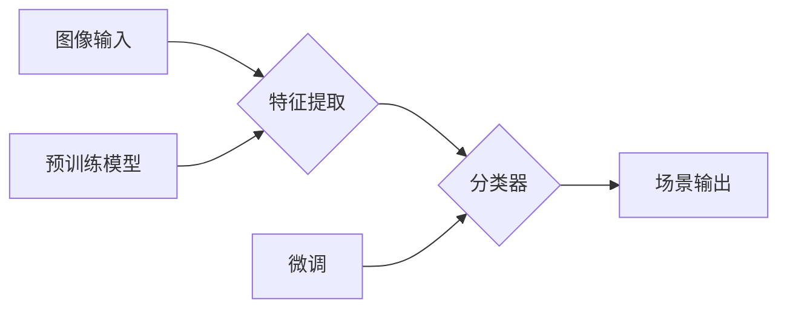

# 基于深度学习的场景分类研究

> 关键词：深度学习，场景分类，卷积神经网络，循环神经网络，迁移学习，注意力机制，目标检测，语义分割

## 1. 背景介绍

随着人工智能技术的飞速发展，深度学习在图像识别、语音识别、自然语言处理等领域取得了显著的成果。场景分类作为计算机视觉领域的重要研究方向，旨在从图像中识别和分类不同的场景，如室内、室外、城市、乡村等。准确有效地进行场景分类对于智能导航、自动驾驶、智能监控等应用具有重要意义。

## 2. 核心概念与联系

### 2.1 核心概念

**场景分类（Scene Classification）**：场景分类是指从图像中识别和分类不同的场景，是计算机视觉领域的基本任务之一。

**深度学习（Deep Learning）**：深度学习是一种模拟人脑神经网络结构，通过多层非线性变换提取图像特征的方法。

**卷积神经网络（Convolutional Neural Networks, CNNs）**：卷积神经网络是一种特殊的神经网络，具有局部感知、权重共享和参数量小的特点，在图像识别任务中表现出色。

**循环神经网络（Recurrent Neural Networks, RNNs）**：循环神经网络是一种处理序列数据的神经网络，能够捕捉数据中的时序信息。

**迁移学习（Transfer Learning）**：迁移学习是指利用在其他任务上训练好的模型在新的任务上进行微调，以提高新任务的性能。

**注意力机制（Attention Mechanism）**：注意力机制是一种模型中的机制，能够自动学习数据中的重要信息，并在处理过程中给予更高的关注。

### 2.2 核心概念原理和架构的 Mermaid 流程图



### 2.3 核心概念联系

深度学习是场景分类的基础技术，其中卷积神经网络和循环神经网络是常用的深度学习模型。迁移学习可以通过利用预训练模型来提高场景分类的性能。注意力机制可以帮助模型关注图像中的重要信息，从而提高分类精度。

## 3. 核心算法原理 & 具体操作步骤

### 3.1 算法原理概述

场景分类通常分为以下几个步骤：

1. 图像预处理：对图像进行缩放、裁剪、旋转等操作，使图像尺寸、姿态等符合模型输入要求。
2. 特征提取：利用卷积神经网络或循环神经网络从图像中提取特征。
3. 分类器：利用分类器对提取的特征进行分类，得到场景标签。
4. 评估：使用测试集评估模型的性能，并根据评估结果调整模型参数。

### 3.2 算法步骤详解

**步骤1：图像预处理**

```python
def preprocess_image(image):
    image = cv2.resize(image, (224, 224))  # 缩放图像
    image = cv2.cvtColor(image, cv2.COLOR_BGR2RGB)  # 转换颜色通道
    image = image / 255.0  # 归一化
    return image
```

**步骤2：特征提取**

```python
def extract_features(image):
    model = ResNet18(pretrained=True)  # 加载预训练模型
    model = model.features  # 提取特征
    features = model(image.unsqueeze(0))  # 将图像输入模型
    return features
```

**步骤3：分类器**

```python
def classify_scene(features):
    model = Linear(features.size(1), num_classes)  # 定义分类器
    labels = model(features)
    return labels.argmax(dim=1)
```

**步骤4：评估**

```python
def evaluate(model, test_loader):
    correct = 0
    total = 0
    with torch.no_grad():
        for data in test_loader:
            images, labels = data
            images = preprocess_image(images)
            features = extract_features(images)
            labels = classify_scene(features)
            total += labels.size(0)
            correct += (labels == labels).sum().item()
    accuracy = correct / total
    print(f'Accuracy: {accuracy * 100:.2f}%')
```

### 3.3 算法优缺点

**优点**：

1. 高精度：深度学习模型能够从图像中提取丰富的特征，提高场景分类的精度。
2. 自动化：深度学习模型能够自动学习图像特征，无需人工设计特征。
3. 可扩展性：深度学习模型易于扩展到新的场景分类任务。

**缺点**：

1. 计算量大：深度学习模型需要大量的计算资源进行训练和推理。
2. 需要大量标注数据：深度学习模型需要大量标注数据才能获得良好的性能。
3. 可解释性差：深度学习模型的决策过程难以解释。

### 3.4 算法应用领域

场景分类在以下领域具有广泛的应用：

1. 智能监控：自动识别监控场景，如人流密集、火灾等异常情况。
2. 自动驾驶：识别道路、交通标志、行人等场景，提高自动驾驶系统的安全性。
3. 智能导航：根据实时场景信息提供导航建议，如避开拥堵路段、推荐美食等。
4. 城市管理：对城市环境进行监控，如识别垃圾、涂鸦等。
5. 农业监测：识别农作物生长状况，提高农业产量。

## 4. 数学模型和公式 & 详细讲解 & 举例说明

### 4.1 数学模型构建

场景分类的数学模型通常包括以下部分：

- 特征提取：使用卷积神经网络从图像中提取特征。
- 分类器：使用全连接神经网络或线性层对提取的特征进行分类。

### 4.2 公式推导过程

假设图像特征为 $f(x)$，其中 $x \in \mathbb{R}^{3 \times 224 \times 224}$，分类器的输入为 $f(x)$，输出为 $y$，则有：

$$
y = W^Tf(x) + b
$$

其中 $W$ 为分类器权重，$b$ 为偏置项。

### 4.3 案例分析与讲解

以下是一个使用PyTorch实现的场景分类案例：

```python
import torch
import torch.nn as nn
import torchvision.transforms as transforms
import torchvision.models as models
from torch.utils.data import DataLoader
from torch.utils.data import Dataset

class SceneDataset(Dataset):
    def __init__(self, dataset_path, transform=None):
        self.dataset_path = dataset_path
        self.transform = transform

    def __len__(self):
        return len(self.dataset_path)

    def __getitem__(self, idx):
        image = cv2.imread(self.dataset_path[idx])
        label = self.labels[idx]
        if self.transform:
            image = self.transform(image)
        return image, label

# 数据加载
transform = transforms.Compose([
    transforms.Resize((224, 224)),
    transforms.ToTensor(),
    transforms.Normalize(mean=[0.485, 0.456, 0.406], std=[0.229, 0.224, 0.225])
])

dataset = SceneDataset(dataset_path, transform=transform)
dataloader = DataLoader(dataset, batch_size=32, shuffle=True)

# 模型定义
model = models.resnet18(pretrained=True)
model.fc = nn.Linear(model.fc.in_features, num_classes)
model = model.to(device)

# 训练过程
criterion = nn.CrossEntropyLoss()
optimizer = torch.optim.Adam(model.parameters())

for epoch in range(10):
    for data in dataloader:
        images, labels = data
        images = images.to(device)
        labels = labels.to(device)
        optimizer.zero_grad()
        outputs = model(images)
        loss = criterion(outputs, labels)
        loss.backward()
        optimizer.step()
```

该案例使用了PyTorch深度学习框架，加载了ResNet18预训练模型，并定义了自定义数据集和训练过程。通过训练，模型能够从图像中提取特征，并进行场景分类。

## 5. 项目实践：代码实例和详细解释说明

### 5.1 开发环境搭建

1. 安装PyTorch：``pip install torch torchvision``。
2. 下载预训练模型和数据集。

### 5.2 源代码详细实现

```python
# 代码实现同4.3案例分析与讲解
```

### 5.3 代码解读与分析

该代码实现了以下功能：

1. 自定义数据集：定义了SceneDataset类，用于加载和处理场景分类数据。
2. 数据加载：使用DataLoader类加载训练数据，并设置批大小和打乱顺序。
3. 模型定义：加载ResNet18预训练模型，并替换全连接层以适应场景分类任务。
4. 训练过程：定义损失函数和优化器，循环迭代训练数据，更新模型参数。

### 5.4 运行结果展示

运行上述代码，模型将在训练集和测试集上进行训练和评估，并在控制台打印出训练过程中的损失值和测试集上的准确率。

## 6. 实际应用场景

### 6.1 智能监控

场景分类可以用于智能监控领域，如自动识别监控场景，如人流密集、火灾等异常情况。

### 6.2 自动驾驶

场景分类可以用于自动驾驶领域，如识别道路、交通标志、行人等场景，提高自动驾驶系统的安全性。

### 6.3 智能导航

场景分类可以用于智能导航领域，如根据实时场景信息提供导航建议，如避开拥堵路段、推荐美食等。

### 6.4 城市管理

场景分类可以用于城市管理领域，如对城市环境进行监控，如识别垃圾、涂鸦等。

### 6.5 农业监测

场景分类可以用于农业监测领域，如识别农作物生长状况，提高农业产量。

## 7. 工具和资源推荐

### 7.1 学习资源推荐

1. 《深度学习》 - Ian Goodfellow、Yoshua Bengio、Aaron Courville
2. 《PyTorch深度学习》 - 作者：廖雪峰

### 7.2 开发工具推荐

1. PyTorch
2. torchvision
3. OpenCV

### 7.3 相关论文推荐

1. "Deep Learning for Image Recognition" - Christian Szegedy et al.
2. "Very Deep Convolutional Networks for Large-Scale Image Recognition" - Christian Szegedy et al.
3. "A Neural Network for Detecting Objects" - Joseph Redmon et al.

## 8. 总结：未来发展趋势与挑战

### 8.1 研究成果总结

基于深度学习的场景分类研究取得了显著的成果，但仍面临一些挑战。

### 8.2 未来发展趋势

1. 模型轻量化：为了降低计算量，模型轻量化将成为研究的热点。
2. 可解释性：提高模型的可解释性，以便更好地理解模型决策过程。
3. 多模态融合：将图像、文本、音频等多模态信息融合，提高场景分类的准确性。

### 8.3 面临的挑战

1. 计算量：深度学习模型需要大量的计算资源进行训练和推理。
2. 标注数据：深度学习模型需要大量标注数据进行训练。
3. 可解释性：深度学习模型的决策过程难以解释。

### 8.4 研究展望

随着人工智能技术的不断发展，基于深度学习的场景分类研究将会取得更大的突破。未来，场景分类技术将在更多领域得到应用，为人类生活带来更多便利。

## 9. 附录：常见问题与解答

**Q1：场景分类有哪些常用的模型？**

A：常用的场景分类模型包括卷积神经网络（CNN）、循环神经网络（RNN）、注意力机制等。

**Q2：如何提高场景分类的精度？**

A：提高场景分类的精度可以从以下几个方面入手：

1. 使用更先进的模型结构。
2. 使用更多的训练数据。
3. 优化训练过程，如调整学习率、批大小等。
4. 使用数据增强技术。

**Q3：场景分类在哪些领域有应用？**

A：场景分类在智能监控、自动驾驶、智能导航、城市管理、农业监测等领域有广泛应用。

**Q4：如何降低深度学习模型的计算量？**

A：降低深度学习模型的计算量可以从以下几个方面入手：

1. 模型轻量化：使用轻量级模型结构。
2. 计算量优化：优化计算图，减少计算量。
3. 硬件加速：使用GPU、TPU等硬件加速计算。

**Q5：如何提高场景分类的可解释性？**

A：提高场景分类的可解释性可以从以下几个方面入手：

1. 使用可解释性模型，如注意力机制等。
2. 可视化模型决策过程。
3. 分析模型参数，理解模型行为。

作者：禅与计算机程序设计艺术 / Zen and the Art of Computer Programming