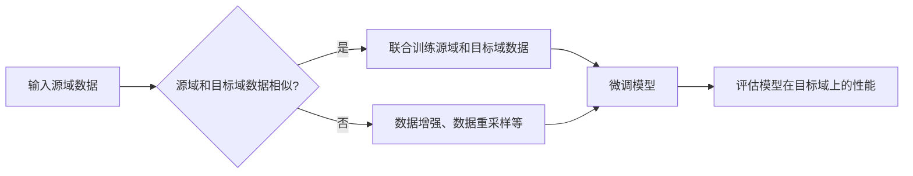

# 基础模型的潜在下游应用

> 关键词：基础模型，下游应用，迁移学习，泛化能力，领域适应，少样本学习，个性化推荐，图像识别，自然语言处理

## 1. 背景介绍

随着深度学习技术的迅猛发展，基础模型（如Transformer、CNN、RNN等）在多个领域展现出了强大的学习能力和泛化能力。这些基础模型通过在大量数据上进行预训练，学习到了丰富的特征和模式，为后续的下游任务提供了强大的支撑。然而，如何有效地利用这些基础模型进行下游任务的应用，仍然是当前人工智能领域的一个重要研究方向。

本文将探讨基础模型的潜在下游应用，分析其原理、操作步骤、优缺点以及在实际应用场景中的表现，并展望其未来发展趋势与挑战。

## 2. 核心概念与联系

### 2.1 基础模型

基础模型是指在大量数据上预训练的深度学习模型，能够学习到丰富的特征和模式，为后续的下游任务提供强大的支撑。常见的基础模型包括：

- **Transformer**：基于自注意力机制的序列模型，在自然语言处理领域取得了显著成果。
- **CNN**：卷积神经网络，擅长处理图像和视频等结构化数据。
- **RNN**：循环神经网络，适用于处理序列数据，如时间序列、文本等。

### 2.2 迁移学习

迁移学习（Transfer Learning）是一种利用已经学习到的知识来解决新任务的学习方法。在迁移学习中，基础模型通过在新的数据集上进行微调（Fine-tuning），将预训练得到的特征和模式迁移到新的任务上。

### 2.3 泛化能力

泛化能力是指模型在未见过的数据上的表现。基础模型通过在大量数据上预训练，具有较好的泛化能力，能够在新的数据集上取得较好的表现。

### 2.4 领域适应

领域适应（Domain Adaptation）是指当源域和目标域存在差异时，如何使模型在目标域上取得良好的性能。基础模型通过在源域和目标域上的联合训练，可以提高模型在目标域上的表现。

### 2.5 少样本学习

少样本学习（Few-Shot Learning）是指当训练数据量非常有限时，如何使模型在新的数据上取得良好的表现。基础模型通过在少量数据上进行微调，可以实现少样本学习。

### 2.6 Mermaid 流程图

以下是基于迁移学习的领域适应的Mermaid流程图：



## 3. 核心算法原理 & 具体操作步骤

### 3.1 算法原理概述

基础模型的下游应用主要基于迁移学习技术，具体操作步骤如下：

1. 预训练：在大量数据上预训练基础模型，学习到通用的特征和模式。
2. 微调：在新的数据集上对预训练模型进行微调，调整模型参数，使其适应新的任务。
3. 评估：在测试集上评估微调后的模型性能。

### 3.2 算法步骤详解

1. **数据准备**：准备用于预训练和微调的数据集，包括源域数据集和目标域数据集。
2. **预训练**：在源域数据集上预训练基础模型，学习通用的特征和模式。
3. **微调**：在目标域数据集上对预训练模型进行微调，调整模型参数，使其适应新的任务。
4. **评估**：在测试集上评估微调后的模型性能，包括准确率、召回率、F1值等指标。

### 3.3 算法优缺点

**优点**：

- **提高效率**：利用预训练模型可以显著提高下游任务的训练速度。
- **提高性能**：预训练模型具有较好的泛化能力，能够在新的任务上取得较好的性能。
- **减少数据需求**：迁移学习可以降低下游任务对标注数据的需求。

**缺点**：

- **模型偏差**：预训练模型可能在源域上存在偏差，导致在目标域上表现不佳。
- **对源域和目标域的依赖**：迁移学习的效果依赖于源域和目标域之间的相似度。
- **超参数调优**：微调过程中需要调整大量的超参数，对调参技巧要求较高。

### 3.4 算法应用领域

基础模型下游应用广泛，涵盖以下领域：

- **自然语言处理**：文本分类、情感分析、机器翻译、问答系统等。
- **计算机视觉**：图像识别、目标检测、人脸识别、视频分析等。
- **语音识别**：语音识别、语音合成、说话人识别等。
- **推荐系统**：个性化推荐、物品推荐、场景推荐等。

## 4. 数学模型和公式 & 详细讲解 & 举例说明

### 4.1 数学模型构建

以下是一个简单的迁移学习模型数学模型：

$$
\mathcal{L}(\theta) = \frac{1}{N}\sum_{i=1}^N \ell(\theta, y_i)
$$

其中，$\theta$ 为模型参数，$y_i$ 为真实标签，$\ell(\theta, y_i)$ 为损失函数。

### 4.2 公式推导过程

以图像分类任务为例，损失函数可以采用交叉熵损失：

$$
\ell(\theta, y_i) = -\log \frac{\exp(\theta^T x_i)}{\sum_{j=1}^K \exp(\theta^T x_i)}
$$

其中，$x_i$ 为输入图像，$\theta$ 为模型参数，$K$ 为类别数。

### 4.3 案例分析与讲解

以下是一个基于BERT的文本分类任务的案例：

1. **数据准备**：收集包含文本和标签的文本分类数据集。
2. **预训练**：在大量文本数据上预训练BERT模型。
3. **微调**：在文本分类数据集上对预训练的BERT模型进行微调，调整模型参数。
4. **评估**：在测试集上评估微调后的BERT模型性能。

## 5. 项目实践：代码实例和详细解释说明

### 5.1 开发环境搭建

以下是在Python环境中搭建基于迁移学习的文本分类项目所需的基础环境：

```bash
pip install torch transformers
```

### 5.2 源代码详细实现

以下是一个基于BERT的文本分类任务的代码实例：

```python
import torch
from transformers import BertForSequenceClassification, BertTokenizer

# 加载预训练模型和分词器
model = BertForSequenceClassification.from_pretrained('bert-base-uncased')
tokenizer = BertTokenizer.from_pretrained('bert-base-uncased')

# 加载数据集
train_texts, train_labels, dev_texts, dev_labels, test_texts, test_labels = load_data()

# 编码数据
train_encodings = tokenizer(train_texts, truncation=True, padding=True, return_tensors="pt")
dev_encodings = tokenizer(dev_texts, truncation=True, padding=True, return_tensors="pt")
test_encodings = tokenizer(test_texts, truncation=True, padding=True, return_tensors="pt")

# 定义损失函数和优化器
optimizer = torch.optim.AdamW(model.parameters(), lr=2e-5)
criterion = torch.nn.CrossEntropyLoss()

# 训练模型
for epoch in range(3):
    model.train()
    for batch in range(len(train_encodings) // 16):
        optimizer.zero_grad()
        inputs = {k: v[batch] for k, v in train_encodings.items()}
        labels = train_labels[batch]
        outputs = model(**inputs, labels=labels)
        loss = outputs.loss
        loss.backward()
        optimizer.step()

# 评估模型
model.eval()
with torch.no_grad():
    for batch in range(len(dev_encodings) // 16):
        inputs = {k: v[batch] for k, v in dev_encodings.items()}
        labels = dev_labels[batch]
        outputs = model(**inputs, labels=labels)
        loss = outputs.loss

print(f"Dev loss: {loss.item()}")

# 保存模型
torch.save(model.state_dict(), "bert_text_classification_model.pth")
```

### 5.3 代码解读与分析

以上代码实现了基于BERT的文本分类任务。首先，加载预训练模型和分词器。然后，加载并预处理数据集，包括文本和标签。接着，定义损失函数和优化器，并开始训练模型。最后，在验证集上评估模型性能，并将模型保存到本地。

## 6. 实际应用场景

### 6.1 个性化推荐

基础模型可以用于个性化推荐系统，通过学习用户的兴趣和偏好，为用户推荐个性化的内容。例如，在电商平台上，基础模型可以根据用户的浏览历史、购买记录等信息，为用户推荐相关的商品。

### 6.2 医疗诊断

基础模型可以用于辅助医生进行疾病诊断，通过分析医学影像、病历等数据，帮助医生提高诊断的准确性和效率。

### 6.3 金融风控

基础模型可以用于金融风控领域，通过分析客户的风险特征，识别潜在的欺诈行为，降低金融风险。

### 6.4 语音识别

基础模型可以用于语音识别系统，将语音信号转换为文字，实现语音助手、智能客服等功能。

### 6.4 未来应用展望

未来，基础模型的下游应用将更加广泛，以下是一些潜在的应用方向：

- **多模态学习**：将文本、图像、视频等多模态信息进行整合，实现更全面的信息理解和推理。
- **跨领域应用**：将基础模型应用于不同领域，如化学、生物、地理等，推动跨领域研究发展。
- **少样本学习**：通过迁移学习和少样本学习方法，降低对标注数据的需求，提高模型的实用性。

## 7. 工具和资源推荐

### 7.1 学习资源推荐

- 《深度学习入门》
- 《深度学习》
- 《深度学习与自然语言处理》
- 《计算机视觉基础》
- 《机器学习实战》

### 7.2 开发工具推荐

- TensorFlow
- PyTorch
- Keras
- OpenCV
- NLTK

### 7.3 相关论文推荐

- "BERT: Pre-training of Deep Bidirectional Transformers for Language Understanding"
- "Attention Is All You Need"
- "Generative Adversarial Nets"
- "ImageNet Classification with Deep Convolutional Neural Networks"
- "A Neural Algorithm of Artistic Style"

## 8. 总结：未来发展趋势与挑战

### 8.1 研究成果总结

本文对基础模型的潜在下游应用进行了探讨，分析了其原理、操作步骤、优缺点以及在实际应用场景中的表现。基础模型在多个领域展现出强大的学习能力和泛化能力，为下游任务提供了强大的支撑。

### 8.2 未来发展趋势

未来，基础模型将在以下方面取得进一步发展：

- **模型效率和可解释性**：降低模型复杂度，提高模型效率，同时增强模型的可解释性。
- **多模态学习**：实现文本、图像、语音等多模态信息的整合，推动多模态研究发展。
- **少样本学习**：降低对标注数据的需求，提高模型的实用性。

### 8.3 面临的挑战

基础模型在下游应用中面临的挑战包括：

- **数据偏见**：预训练模型可能存在数据偏见，导致在特定领域或群体上表现不佳。
- **模型可解释性**：基础模型内部结构复杂，难以解释其决策过程。
- **计算资源**：基础模型的训练和推理需要大量的计算资源。

### 8.4 研究展望

未来，基础模型的下游应用研究需要关注以下方面：

- **数据偏见和公平性**：研究如何消除模型中的数据偏见，提高模型的公平性和可靠性。
- **可解释性研究**：探索如何增强模型的可解释性，使模型决策过程更加透明。
- **轻量化模型**：研究如何降低模型复杂度，提高模型效率，使其更适合移动设备和边缘计算场景。

## 9. 附录：常见问题与解答

**Q1：基础模型和微调模型有什么区别？**

A：基础模型是指在大量数据上预训练的深度学习模型，而微调模型是在基础模型的基础上，在新的数据集上进行微调，使其适应新的任务。

**Q2：迁移学习有哪些优势？**

A：迁移学习的优势包括提高效率、提高性能和减少数据需求。

**Q3：如何解决基础模型的可解释性问题？**

A：解决基础模型的可解释性问题需要从多个方面入手，包括改进模型结构、引入可解释性增强技术等。

**Q4：基础模型在哪些领域有应用？**

A：基础模型在自然语言处理、计算机视觉、语音识别、推荐系统等多个领域都有广泛的应用。

**Q5：如何降低基础模型的计算资源消耗？**

A：降低基础模型的计算资源消耗可以通过模型压缩、量化加速、模型并行等技术实现。

作者：禅与计算机程序设计艺术 / Zen and the Art of Computer Programming