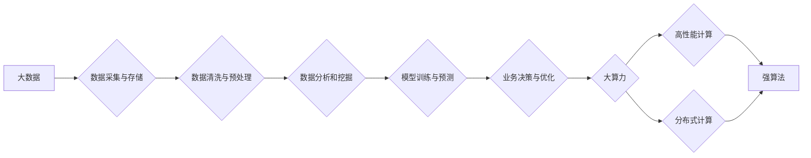

# 大数据+大算力+强算法的方法

> 关键词：大数据，大算力，强算法，人工智能，深度学习，机器学习，数据分析，高性能计算，数据科学

## 1. 背景介绍

随着信息技术的飞速发展，数据已经成为现代社会的重要资源。大数据的涌现为各个行业带来了前所未有的机遇和挑战。大数据技术、大算力基础设施和强算法的协同作用，成为推动数据科学和人工智能发展的三大关键要素。本文将深入探讨大数据、大算力和强算法之间的关系，分析其核心原理和应用实践，并展望未来发展趋势。

### 1.1 大数据的兴起

大数据是指在规模、速度、多样性和复杂性等方面超越了传统数据处理能力的数据集合。随着互联网、物联网、移动设备等技术的普及，全球数据量呈指数级增长。大数据的出现，使得我们能够从海量数据中挖掘出有价值的信息，从而为决策、创新和业务发展提供有力支持。

### 1.2 大算力的需求

大数据的处理和分析需要强大的计算能力。大算力指的是能够处理大规模数据集的超级计算、高性能计算和分布式计算等能力。随着大数据技术的不断发展，对大算力的需求也日益增长。

### 1.3 强算法的挑战

强算法是指能够解决复杂问题的算法，如机器学习、深度学习等。在数据处理和分析过程中，强算法能够从海量数据中提取有效特征，并建立模型进行预测和决策。

## 2. 核心概念与联系

以下是基于 Mermaid 流程图的大数据、大算力和强算法之间的关系：



从流程图中可以看出，大数据从采集、存储、清洗、预处理到分析和挖掘的过程，需要依赖大算力基础设施的支持。而强算法则是整个数据科学流程的核心，它负责从数据中提取特征、建立模型和进行预测。

## 3. 核心算法原理 & 具体操作步骤

### 3.1 算法原理概述

在大数据时代，常用的算法包括：

- **机器学习**：通过学习历史数据，对未知数据做出预测或决策。
- **深度学习**：模拟人脑神经网络，通过多层非线性变换提取特征。
- **数据挖掘**：从海量数据中提取有价值的信息。

### 3.2 算法步骤详解

1. **数据采集与存储**：从各种来源采集数据，并将其存储在分布式数据库或大数据平台中。
2. **数据清洗与预处理**：对采集到的数据进行清洗，去除噪声和缺失值，并进行标准化、归一化等预处理操作。
3. **数据分析和挖掘**：使用机器学习、深度学习等算法对预处理后的数据进行分析和挖掘，提取有价值的信息。
4. **模型训练与预测**：根据分析结果，训练模型，并对未知数据进行预测。
5. **业务决策与优化**：根据预测结果，制定业务决策，并不断优化模型和算法。

### 3.3 算法优缺点

- **机器学习**：优点是算法简单，易于理解和实现；缺点是泛化能力有限，难以处理复杂问题。
- **深度学习**：优点是能够处理复杂问题，泛化能力强；缺点是模型结构复杂，参数量庞大，训练过程计算量巨大。
- **数据挖掘**：优点是能够从海量数据中提取有价值的信息；缺点是算法复杂，需要大量专业知识和经验。

### 3.4 算法应用领域

大数据、大算力和强算法在各个领域都有广泛的应用，如：

- **金融**：风险评估、欺诈检测、信用评分、投资决策等。
- **医疗**：疾病诊断、药物研发、个性化医疗等。
- **零售**：客户细分、推荐系统、库存管理等。
- **交通**：智能交通系统、路径规划、交通流量预测等。

## 4. 数学模型和公式 & 详细讲解 & 举例说明

### 4.1 数学模型构建

以下是一个简单的线性回归模型示例：

$$
y = \beta_0 + \beta_1 x_1 + \beta_2 x_2 + ... + \beta_n x_n + \epsilon
$$

其中，$y$ 是因变量，$x_1, x_2, ..., x_n$ 是自变量，$\beta_0, \beta_1, ..., \beta_n$ 是模型参数，$\epsilon$ 是误差项。

### 4.2 公式推导过程

线性回归模型的推导过程如下：

1. **最小化误差平方和**：选择使得误差平方和最小的参数组合。
2. **求导数**：对误差平方和函数求偏导数，并令其为零。
3. **求解方程**：解得参数的最优值。

### 4.3 案例分析与讲解

以下是一个使用Python实现线性回归模型的示例：

```python
import numpy as np

# 创建线性回归模型
class LinearRegression:
    def __init__(self):
        self.coefficients = None

    def fit(self, X, y):
        X = np.append(X, [[1]], axis=1)  # 添加偏置项
        self.coefficients = np.linalg.inv(X.T @ X) @ X.T @ y

    def predict(self, X):
        X = np.append(X, [[1]], axis=1)
        return X @ self.coefficients

# 创建数据集
X = np.array([[1, 2], [2, 3], [3, 4], [4, 5]])
y = np.array([2, 3, 4, 5])

# 训练模型
model = LinearRegression()
model.fit(X, y)

# 预测
X_new = np.array([[2, 3]])
y_pred = model.predict(X_new)

print("预测结果:", y_pred)
```

## 5. 项目实践：代码实例和详细解释说明

### 5.1 开发环境搭建

在进行大数据、大算力和强算法项目开发时，需要搭建以下开发环境：

- **操作系统**：Linux、macOS或Windows
- **编程语言**：Python、R、Java等
- **大数据平台**：Hadoop、Spark、Flink等
- **机器学习框架**：scikit-learn、TensorFlow、PyTorch等
- **计算平台**：GPU、TPU、FPGA等

### 5.2 源代码详细实现

以下是一个使用PyTorch实现神经网络模型的示例：

```python
import torch
import torch.nn as nn
import torch.optim as optim

# 创建神经网络模型
class NeuralNetwork(nn.Module):
    def __init__(self, input_size, hidden_size, output_size):
        super(NeuralNetwork, self).__init__()
        self.fc1 = nn.Linear(input_size, hidden_size)
        self.relu = nn.ReLU()
        self.fc2 = nn.Linear(hidden_size, output_size)

    def forward(self, x):
        x = self.fc1(x)
        x = self.relu(x)
        x = self.fc2(x)
        return x

# 创建数据集
X = torch.randn(100, 2)
y = torch.randn(100, 1)

# 创建模型
model = NeuralNetwork(2, 10, 1)

# 定义优化器
optimizer = optim.Adam(model.parameters(), lr=0.001)

# 训练模型
for epoch in range(100):
    optimizer.zero_grad()
    output = model(X)
    loss = nn.MSELoss()(output, y)
    loss.backward()
    optimizer.step()
    print(f"Epoch {epoch+1}, Loss: {loss.item()}")

# 预测
X_new = torch.randn(1, 2)
y_pred = model(X_new)
print("预测结果:", y_pred)
```

### 5.3 代码解读与分析

以上代码实现了以下功能：

- 定义了一个简单的神经网络模型，包括两个全连接层。
- 创建了随机生成的训练数据。
- 使用Adam优化器进行模型训练。
- 在训练结束后，使用模型进行预测。

## 6. 实际应用场景

### 6.1 金融风控

在大数据、大算力和强算法的协同作用下，金融风控领域取得了显著成果。例如，通过分析大量交易数据，可以识别出异常交易行为，从而有效预防欺诈。

### 6.2 智能推荐

在电子商务、在线教育、内容平台等领域，基于大数据、大算力和强算法的智能推荐系统能够根据用户的历史行为和兴趣，为用户提供个性化的推荐内容。

### 6.3 医疗诊断

大数据、大算力和强算法在医疗诊断领域也有广泛应用。通过分析患者的病历、基因数据等信息，可以辅助医生进行诊断，提高诊断准确率。

## 7. 工具和资源推荐

### 7.1 学习资源推荐

- 《大数据时代》
- 《深度学习》
- 《机器学习实战》
- 《Hadoop权威指南》
- 《Spark快速大数据处理》

### 7.2 开发工具推荐

- **编程语言**：Python、R、Java等
- **大数据平台**：Hadoop、Spark、Flink等
- **机器学习框架**：scikit-learn、TensorFlow、PyTorch等
- **计算平台**：GPU、TPU、FPGA等

### 7.3 相关论文推荐

- 《Large Scale Online Learning》
- 《Learning Deep Representations by Backpropagation》
- 《Distributed Computing: Principles, Algorithms, and Systems》
- 《Scalable and Efficient Large-Scale Machine Learning》
- 《Deep Learning for Natural Language Processing》

## 8. 总结：未来发展趋势与挑战

### 8.1 研究成果总结

大数据、大算力和强算法的协同作用，推动了数据科学和人工智能的快速发展。在金融、医疗、零售、交通等多个领域，大数据技术、大算力基础设施和强算法的应用，为业务决策和创新发展提供了有力支持。

### 8.2 未来发展趋势

- **数据隐私保护**：随着数据隐私保护意识的提高，如何在保护数据隐私的前提下进行数据分析和挖掘，将成为重要研究方向。
- **模型可解释性**：如何提高机器学习模型的可解释性，使其决策过程更加透明，将成为研究热点。
- **联邦学习**：联邦学习是一种在保护数据隐私的前提下进行机器学习训练的方法，未来有望在多个领域得到广泛应用。
- **多模态学习**：多模态学习能够融合不同类型的数据，提高模型的泛化能力，未来有望在更多领域得到应用。

### 8.3 面临的挑战

- **数据质量**：大数据的质量直接影响到分析和挖掘结果，提高数据质量是当前面临的挑战之一。
- **计算资源**：随着模型复杂度的提高，对计算资源的需求也越来越大，如何高效利用计算资源是另一个挑战。
- **算法复杂度**：算法复杂度是制约机器学习模型应用的重要因素，如何降低算法复杂度，提高模型效率，是未来研究的重要方向。

### 8.4 研究展望

大数据、大算力和强算法的协同作用，将为数据科学和人工智能的发展带来更多可能性。未来，随着技术的不断进步，大数据、大算力和强算法将在更多领域得到应用，为人类社会带来更多福祉。

## 9. 附录：常见问题与解答

**Q1：大数据、大算力和强算法之间有什么关系？**

A：大数据、大算力和强算法是相互依存的。大数据为算法提供数据基础，大算力为算法提供计算支持，强算法为大数据和大算力提供解决方案。三者协同作用，推动数据科学和人工智能的发展。

**Q2：如何提高机器学习模型的性能？**

A：提高机器学习模型性能可以从以下几个方面入手：
- **数据质量**：提高数据质量，包括数据清洗、预处理、数据增强等。
- **算法选择**：选择合适的算法，包括选择合适的模型结构、优化算法等。
- **超参数调优**：优化超参数，包括学习率、批大小、正则化强度等。
- **模型集成**：使用模型集成技术，如Bagging、Boosting等。

**Q3：如何提高模型的可解释性？**

A：提高模型的可解释性可以从以下几个方面入手：
- **特征重要性**：分析特征的重要性，识别对模型预测有重要影响的特征。
- **模型可视化**：使用可视化技术，如决策树、神经网络结构图等，展示模型的决策过程。
- **解释性模型**：使用解释性模型，如LIME、SHAP等，对模型进行解释。

**Q4：如何选择合适的大数据平台？**

A：选择合适的大数据平台需要考虑以下因素：
- **数据规模**：根据数据规模选择合适的大数据平台。
- **计算需求**：根据计算需求选择合适的大数据平台。
- **存储需求**：根据存储需求选择合适的大数据平台。
- **易用性**：根据团队的技术水平和经验选择合适的大数据平台。

作者：禅与计算机程序设计艺术 / Zen and the Art of Computer Programming