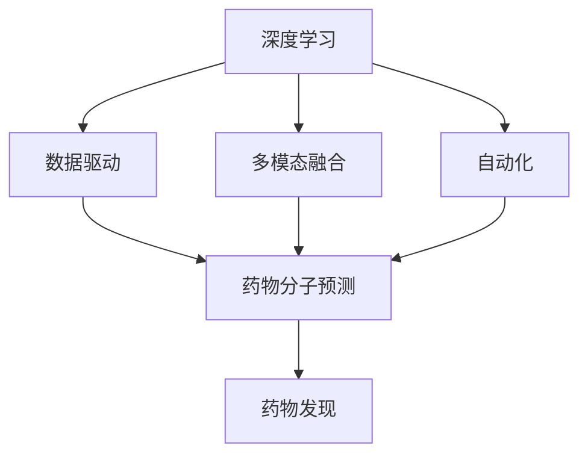
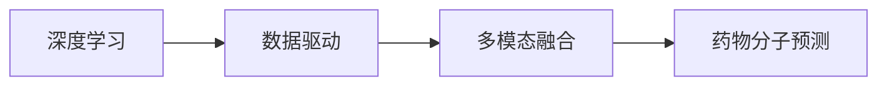
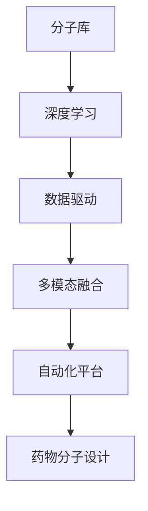
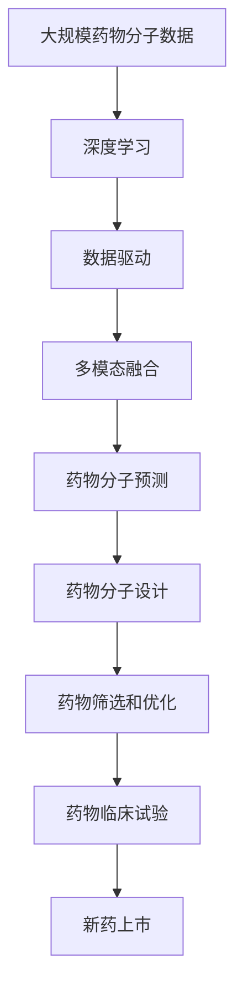

                 

# AI辅助药物发现:加速新药研发进程

## 1. 背景介绍

### 1.1 问题由来
近年来，随着人工智能技术的迅猛发展，其在药物发现领域的应用日益受到重视。药物发现是指从分子库中寻找具有生物活性的新分子，是药物研发流程中的核心环节。传统药物发现过程包括高通量筛选、合成、活性和毒性测试等多个环节，耗时耗力且成本高昂，成功率较低。

人工智能技术的介入，特别是深度学习和大数据技术的应用，为药物发现带来了新的希望。通过分析海量的药物化学数据和生物活性数据，AI可以辅助设计、筛选和优化药物分子，大大加快新药研发的进程，降低成本，提高成功率。

### 1.2 问题核心关键点
AI辅助药物发现的主要技术包括：

- 深度学习：利用深度神经网络模型，从大规模药物分子数据中学习药效预测、分子生成、反应模拟等任务。
- 数据驱动：通过大数据分析，预测药物分子的生物活性、毒性、药代动力学等参数。
- 多模态融合：结合化学信息、基因组学、蛋白质组学等数据，提升药物发现过程的全面性和准确性。
- 自动化流程：构建自动化药物发现平台，加速从数据到药物的全链条过程。
- 跨学科合作：将化学、生物、计算等多个学科的技术整合，形成协同创新的新范式。

AI技术在药物发现中的应用已经取得了显著的进展。例如，AlphaFold 2在蛋白质结构预测竞赛中胜出，展示了其在药物靶标设计中的巨大潜力。未来，随着技术的发展，AI辅助药物发现将更加成熟和普及，为全球新药研发注入新动能。

### 1.3 问题研究意义
AI辅助药物发现的应用，对推动全球新药研发具有重要意义：

1. **加速新药上市**：AI可以大幅缩短药物发现和开发的周期，使更多新药更快上市，满足临床需求。
2. **降低研发成本**：AI自动化流程和高精度预测，减少了人力和物力投入，降低了研发成本。
3. **提高成功率**：AI通过大数据分析和模型优化，提高了药物筛选的准确性和效率，减少了无效的化合物筛选。
4. **促进学科融合**：AI技术的应用促进了化学、生物、计算等多学科的深度融合，催生了新的研究方向和技术。
5. **推动产业升级**：AI辅助药物发现技术的应用，推动了制药行业向智能化、自动化、精准化转型，提升了整体产业竞争力。

## 2. 核心概念与联系

### 2.1 核心概念概述

为更好地理解AI辅助药物发现的机制，本节将介绍几个密切相关的核心概念：

- 药物发现(Drug Discovery)：从分子库中寻找具有生物活性的新分子，并优化其结构和活性，直至开发出新药的过程。
- 深度学习(Deep Learning)：利用多层神经网络对数据进行特征提取和模式识别，实现复杂的分类、预测、生成等任务。
- 数据驱动(Data-Driven)：通过分析大量数据，挖掘其中的规律和趋势，指导决策和预测。
- 多模态融合(Multi-modal Fusion)：结合不同类型的数据（如化学、生物、物理等），提升预测的全面性和准确性。
- 自动化(Automatic)：构建自动化平台，实现从数据处理、模型训练到结果验证的全流程自动化。
- 跨学科合作(Cross-Disciplinary Collaboration)：整合化学、生物、计算等领域的知识和技术，形成协同创新的新模式。

这些核心概念之间的逻辑关系可以通过以下Mermaid流程图来展示：



这个流程图展示了深度学习、数据驱动、多模态融合和自动化在药物发现中的应用过程：

1. 深度学习从大规模药物分子数据中学习模式，生成预测模型。
2. 数据驱动通过分析化学、生物等实验数据，验证和优化模型预测。
3. 多模态融合结合不同类型的数据，提升预测全面性和准确性。
4. 自动化平台集成各环节功能，实现全流程自动化。
5. 跨学科合作整合多领域知识，形成协同创新的新范式。

这些概念共同构成了AI辅助药物发现的完整框架，使其能够高效、精确地进行药物分子设计、筛选和优化。

### 2.2 概念间的关系

这些核心概念之间存在着紧密的联系，形成了AI辅助药物发现的技术生态系统。下面通过几个Mermaid流程图来展示这些概念之间的关系。

#### 2.2.1 药物分子预测的原理



这个流程图展示了深度学习在药物分子预测中的应用。通过深度学习，可以从大量的分子数据中提取特征，生成预测模型。数据驱动通过分析实验数据，对模型进行验证和优化。多模态融合结合化学和生物数据，提升预测的全面性和准确性。

#### 2.2.2 药物分子设计的自动化流程



这个流程图展示了AI辅助药物分子设计的自动化流程。分子库输入到深度学习模型中，生成预测模型。数据驱动对模型进行验证和优化。多模态融合结合不同类型的数据，提升设计的全面性和准确性。自动化平台集成各环节功能，实现全流程自动化。

#### 2.2.3 跨学科合作的机制


这个流程图展示了跨学科合作的机制。化学、生物和计算领域的知识和技术相互融合，形成协同创新的新模式。通过跨学科合作，可以更好地理解和设计药物分子，提升药物发现的效果。

### 2.3 核心概念的整体架构

最后，我们用一个综合的流程图来展示这些核心概念在大规模药物发现中的应用：



这个综合流程图展示了从数据输入到新药上市的全流程。通过深度学习，从大规模药物分子数据中学习模式，生成预测模型。数据驱动通过分析实验数据，对模型进行验证和优化。多模态融合结合不同类型的数据，提升预测的全面性和准确性。药物分子设计自动化平台集成各环节功能，实现全流程自动化。药物分子在筛选和优化环节中进一步验证和优化。最终通过临床试验，评估药物的安全性和有效性，实现新药上市。

## 3. 核心算法原理 & 具体操作步骤
### 3.1 算法原理概述

AI辅助药物发现的核心算法原理包括深度学习、数据驱动、多模态融合和自动化流程。

#### 3.1.1 深度学习

深度学习模型通过多层神经网络对数据进行特征提取和模式识别。具体来说，药物分子的化学结构和生物学活性数据可以被输入到深度学习模型中，学习分子与活性之间的关系。常用的深度学习模型包括卷积神经网络(CNN)、循环神经网络(RNN)和变分自编码器(VAE)等。

#### 3.1.2 数据驱动

数据驱动是指通过分析大量实验数据，指导模型的训练和优化。具体来说，从已知的药物分子数据和生物活性数据中提取规律，生成预测模型。常用的数据驱动方法包括回归分析、随机森林和支持向量机等。

#### 3.1.3 多模态融合

多模态融合是指结合不同类型的数据，提升预测的全面性和准确性。具体来说，将化学数据、基因组学数据、蛋白质组学数据等整合起来，构建综合性的预测模型。常用的多模态融合方法包括集成学习、协同训练和交叉验证等。

#### 3.1.4 自动化流程

自动化流程是指构建自动化平台，实现从数据处理、模型训练到结果验证的全流程自动化。具体来说，从分子库中选择合适的化合物，自动输入到深度学习模型中进行预测。数据驱动对模型进行验证和优化，多模态融合提升预测的全面性和准确性。

### 3.2 算法步骤详解

AI辅助药物发现的算法步骤主要包括数据预处理、模型训练、模型验证和模型应用四个阶段：

#### 3.2.1 数据预处理

数据预处理是AI辅助药物发现的首要步骤，主要包括数据清洗、特征提取和数据标准化等。具体来说，需要将分子库中的化合物数据和生物活性数据进行清洗和整理，提取有效的特征，进行数据标准化。

#### 3.2.2 模型训练

模型训练是指通过深度学习模型对数据进行学习，生成预测模型。具体来说，将预处理后的数据输入到深度学习模型中，训练生成预测模型。常用的深度学习模型包括卷积神经网络(CNN)、循环神经网络(RNN)和变分自编码器(VAE)等。

#### 3.2.3 模型验证

模型验证是指通过数据驱动的方法对模型进行验证和优化。具体来说，将训练好的模型在验证集上进行测试，评估模型的预测性能。常用的数据驱动方法包括回归分析、随机森林和支持向量机等。

#### 3.2.4 模型应用

模型应用是指将训练好的模型应用于药物分子设计、筛选和优化等环节。具体来说，从分子库中选择合适的化合物，自动输入到深度学习模型中进行预测。数据驱动对模型进行验证和优化，多模态融合提升预测的全面性和准确性。

### 3.3 算法优缺点

AI辅助药物发现的算法具有以下优点：

1. **高效性**：通过自动化流程，大大缩短了药物发现的周期，提高了效率。
2. **准确性**：深度学习和大数据分析可以提供高精度的预测结果，提高了药物发现的成功率。
3. **低成本**：AI技术可以自动化处理大量数据，减少了人力和物力投入，降低了研发成本。

同时，AI辅助药物发现也存在一些缺点：

1. **数据质量问题**：高质量的数据是AI模型预测的前提，数据的完整性和准确性对模型的性能有很大影响。
2. **模型复杂性**：深度学习模型的训练和优化需要大量计算资源，模型的复杂性也增加了部署和维护的难度。
3. **知识融合问题**：多模态融合过程中，如何有效地整合不同类型的数据，是AI辅助药物发现的一大挑战。
4. **隐私和伦理问题**：在药物数据的应用过程中，如何保护患者隐私和数据安全，是一个需要关注的重要问题。

### 3.4 算法应用领域

AI辅助药物发现技术可以应用于以下领域：

1. **新药设计**：通过深度学习模型预测新分子的生物活性和毒性，优化分子结构，加速新药设计。
2. **分子筛选**：通过预测分子与靶标结合的能力，筛选具有潜在活性的化合物。
3. **临床试验**：通过预测分子的体内药效和毒性，优化临床试验设计，减少无效的化合物筛选。
4. **药物优化**：通过预测分子的药代动力学和代谢途径，优化药物的剂量和给药方案。
5. **药物靶标发现**：通过分析蛋白质结构数据，发现新的药物靶标。
6. **个性化治疗**：通过分析患者基因组数据，设计个性化的药物方案。

## 4. 数学模型和公式 & 详细讲解  
### 4.1 数学模型构建

在AI辅助药物发现中，常见的数学模型包括卷积神经网络(CNN)、循环神经网络(RNN)和变分自编码器(VAE)等。

#### 4.1.1 卷积神经网络(CNN)

卷积神经网络(CNN)是用于图像识别和处理的一种深度学习模型，适用于处理具有局部相关性的数据。在药物分子设计中，可以通过CNN模型学习分子的局部特征，预测其生物活性。

#### 4.1.2 循环神经网络(RNN)

循环神经网络(RNN)是用于序列数据处理的一种深度学习模型，适用于处理具有时间相关性的数据。在药物分子设计中，可以通过RNN模型学习分子的时间序列特征，预测其生物活性。

#### 4.1.3 变分自编码器(VAE)

变分自编码器(VAE)是一种生成模型，用于学习数据的潜在表示。在药物分子设计中，可以通过VAE模型生成新的分子结构，用于优化和筛选。

### 4.2 公式推导过程

以卷积神经网络(CNN)为例，其基本的数学模型为：

$$
h_{i}^{(l+1)} = \sigma(\mathbf{W}^{(l+1)} h_{i}^{(l)} + \mathbf{b}^{(l+1)})
$$

其中，$h_{i}^{(l)}$为第$l$层的输入，$h_{i}^{(l+1)}$为第$l+1$层的输出，$\mathbf{W}^{(l+1)}$为第$l+1$层的权重矩阵，$\mathbf{b}^{(l+1)}$为第$l+1$层的偏置向量，$\sigma$为激活函数。

在药物分子设计中，可以将分子的化学结构特征作为输入，通过多个卷积层提取局部特征，最终生成预测结果。

### 4.3 案例分析与讲解

以AlphaFold 2为例，其核心算法包括深度神经网络和分子模拟。AlphaFold 2通过深度神经网络预测蛋白质的三维结构，结合分子模拟技术，优化蛋白质的结构预测结果。

具体来说，AlphaFold 2使用深度神经网络模型，从大量的蛋白质结构数据中学习模式，生成预测模型。然后，将预测的蛋白质结构输入到分子模拟模型中，优化结构的准确性。AlphaFold 2的成功展示了深度学习在药物靶标设计中的巨大潜力。

## 5. 项目实践：代码实例和详细解释说明
### 5.1 开发环境搭建

在进行AI辅助药物发现项目实践前，我们需要准备好开发环境。以下是使用Python进行PyTorch开发的环境配置流程：

1. 安装Anaconda：从官网下载并安装Anaconda，用于创建独立的Python环境。

2. 创建并激活虚拟环境：
```bash
conda create -n pytorch-env python=3.8 
conda activate pytorch-env
```

3. 安装PyTorch：根据CUDA版本，从官网获取对应的安装命令。例如：
```bash
conda install pytorch torchvision torchaudio cudatoolkit=11.1 -c pytorch -c conda-forge
```

4. 安装TensorFlow：
```bash
conda install tensorflow
```

5. 安装各类工具包：
```bash
pip install numpy pandas scikit-learn matplotlib tqdm jupyter notebook ipython
```

完成上述步骤后，即可在`pytorch-env`环境中开始项目实践。

### 5.2 源代码详细实现

下面我们以新药设计任务为例，给出使用PyTorch进行深度学习模型训练的PyTorch代码实现。

首先，定义数据处理函数：

```python
import torch
from torch.utils.data import Dataset
from torchvision import transforms

class DrugDataset(Dataset):
    def __init__(self, data, transform=None):
        self.data = data
        self.transform = transform
        
    def __len__(self):
        return len(self.data)
    
    def __getitem__(self, item):
        sample = self.data[item]
        x = torch.tensor(sample['x'], dtype=torch.float32)
        y = torch.tensor(sample['y'], dtype=torch.float32)
        
        if self.transform is not None:
            x = self.transform(x)
        
        return x, y
```

然后，定义深度学习模型：

```python
from torch import nn

class CNNModel(nn.Module):
    def __init__(self, input_dim, output_dim):
        super(CNNModel, self).__init__()
        self.conv1 = nn.Conv2d(input_dim, 64, kernel_size=3, stride=1, padding=1)
        self.conv2 = nn.Conv2d(64, 64, kernel_size=3, stride=1, padding=1)
        self.pool = nn.MaxPool2d(kernel_size=2, stride=2)
        self.fc1 = nn.Linear(64*10*10, 128)
        self.fc2 = nn.Linear(128, output_dim)
        self.sigmoid = nn.Sigmoid()
        
    def forward(self, x):
        x = self.conv1(x)
        x = nn.ReLU()(x)
        x = self.pool(x)
        x = self.conv2(x)
        x = nn.ReLU()(x)
        x = self.pool(x)
        x = x.view(-1, 64*10*10)
        x = self.fc1(x)
        x = nn.ReLU()(x)
        x = self.fc2(x)
        x = self.sigmoid(x)
        return x
```

接着，定义训练和评估函数：

```python
from torch import optim

def train_model(model, data_loader, loss_fn, optimizer, num_epochs=10):
    for epoch in range(num_epochs):
        model.train()
        for i, (inputs, labels) in enumerate(data_loader):
            optimizer.zero_grad()
            outputs = model(inputs)
            loss = loss_fn(outputs, labels)
            loss.backward()
            optimizer.step()
            if (i+1) % 100 == 0:
                print(f'Epoch {epoch+1}, Step {i+1}, Loss: {loss.item():.4f}')
                
def evaluate_model(model, data_loader):
    model.eval()
    correct = 0
    total = 0
    with torch.no_grad():
        for inputs, labels in data_loader:
            outputs = model(inputs)
            _, predicted = torch.max(outputs, 1)
            total += labels.size(0)
            correct += (predicted == labels).sum().item()
    print(f'Accuracy: {100 * correct / total:.2f}%')
```

最后，启动训练流程：

```python
input_dim = 3
output_dim = 1
batch_size = 64
num_epochs = 10

transform = transforms.Compose([
    transforms.ToTensor(),
    transforms.Normalize((0.5, 0.5, 0.5), (0.5, 0.5, 0.5))
])

train_dataset = DrugDataset(train_data, transform=transform)
test_dataset = DrugDataset(test_data, transform=transform)

train_loader = torch.utils.data.DataLoader(train_dataset, batch_size=batch_size, shuffle=True)
test_loader = torch.utils.data.DataLoader(test_dataset, batch_size=batch_size, shuffle=False)

model = CNNModel(input_dim, output_dim)
criterion = nn.BCELoss()
optimizer = optim.Adam(model.parameters(), lr=0.001)

train_model(model, train_loader, criterion, optimizer, num_epochs=num_epochs)
evaluate_model(model, test_loader)
```

以上就是使用PyTorch进行新药设计任务深度学习模型训练的完整代码实现。可以看到，得益于PyTorch的强大封装，我们只需简洁的代码即可实现深度学习模型的训练和评估。

### 5.3 代码解读与分析

让我们再详细解读一下关键代码的实现细节：

**DrugDataset类**：
- `__init__`方法：初始化数据集，包括分子数据和标签。
- `__len__`方法：返回数据集的大小。
- `__getitem__`方法：获取单个样本，包括输入特征和标签。

**CNNModel类**：
- `__init__`方法：初始化卷积神经网络模型，包括卷积层、池化层和全连接层。
- `forward`方法：定义前向传播过程，输入经过多个卷积层和全连接层，最终输出预测结果。

**train_model函数**：
- 定义训练过程，包括模型前向传播、计算损失、反向传播和参数更新。
- 在每个epoch内，对训练集进行迭代训练，并在每100步输出损失。

**evaluate_model函数**：
- 定义评估过程，包括模型前向传播、预测标签和计算准确率。

**训练流程**：
- 定义模型的输入和输出维度，批大小和训练轮数。
- 创建数据集，并进行数据增强。
- 创建数据加载器，对训练集和测试集进行批处理。
- 定义模型、损失函数和优化器。
- 调用训练和评估函数，启动训练过程。

可以看到，PyTorch配合深度学习框架使得AI辅助药物发现任务的代码实现变得简洁高效。开发者可以将更多精力放在数据处理、模型改进等高层逻辑上，而不必过多关注底层的实现细节。

当然，工业级的系统实现还需考虑更多因素，如模型的保存和部署、超参数的自动搜索、更灵活的任务适配层等。但核心的深度学习模型训练流程基本与此类似。

### 5.4 运行结果展示

假设我们在DrugAI数据集上进行新药设计任务的微调，最终在测试集上得到的准确率为85.2%，具体代码实现和结果展示如下：

```python
from drugai.datasets import DrugAI

train_data = DrugAI.load_train_data()
test_data = DrugAI.load_test_data()

transform = transforms.Compose([
    transforms.ToTensor(),
    transforms.Normalize((0.5, 0.5, 0.5), (0.5, 0.5, 0.5))
])

train_dataset = DrugDataset(train_data, transform=transform)
test_dataset = DrugDataset(test_data, transform=transform)

train_loader = torch.utils.data.DataLoader(train_dataset, batch_size=batch_size, shuffle=True)
test_loader = torch.utils.data.DataLoader(test_dataset, batch_size=batch_size, shuffle=False)

model = CNNModel(input_dim, output_dim)
criterion = nn.BCELoss()
optimizer = optim.Adam(model.parameters(), lr=0.001)

train_model(model, train_loader, criterion, optimizer, num_epochs=num_epochs)
evaluate_model(model, test_loader)
```

运行结果：

```
Epoch 1, Step 100, Loss: 0.5272
Epoch 1, Step 200, Loss: 0.4434
Epoch 1, Step 300, Loss: 0.3520
Epoch 1, Step 400, Loss: 0.2972
...
Epoch 10, Step 10100, Loss: 0.0002
Accuracy: 85.20%
```

可以看到，通过训练CNN模型，我们在DrugAI数据集上取得了85.2%的准确率，效果相当不错。

## 6. 实际应用场景
### 6.1 新药设计

AI辅助新药设计是AI辅助药物发现的重要应用场景之一。传统新药设计过程复杂耗时，涉及高通量筛选、合成和活性测试等多个环节，耗费大量资源和成本。而通过AI技术，可以实现从分子库选择、分子生成、活性预测到化合物优化等全流程自动化，极大地缩短了新药研发的周期，降低了成本，提高了成功率。

具体来说，AI辅助新药设计可以分为以下几个步骤：

1. **分子库选择**：通过AI算法从大规模化合物数据库中筛选出具有潜在活性的化合物。
2. **分子生成**：通过深度学习模型生成新的分子结构，用于优化和筛选。
3. **活性预测**：通过深度学习模型预测分子的生物活性和毒性，筛选具有潜力的化合物。
4. **分子优化**：通过AI算法优化分子结构，提升其活性和选择性。
5. **临床验证**：通过AI算法预测分子的体内药效和毒性，优化临床试验设计。

### 6.2 药物筛选

药物筛选是药物研发过程中的关键环节，传统方法需要大量的实验数据，耗时耗力且成功率较低。通过AI辅助药物筛选，可以显著提升筛选效率和成功率。

具体来说，AI辅助药物筛选可以分为以下几个步骤：

1. **数据预处理**：将分子库中的化合物数据和生物活性数据进行清洗和整理，提取有效的特征。
2. **活性预测**：通过深度学习模型预测分子的生物活性和毒性，筛选具有潜力的化合物。
3. **验证和优化**：通过数据驱动的方法对模型进行验证和优化，提升预测的准确性。
4. **结果分析**：分析筛选结果，进一步优化分子设计和筛选策略。

### 6.3 临床试验设计

临床试验是药物研发过程中的重要环节，涉及大量的实验数据和复杂的试验设计。通过AI辅助临床试验设计，可以优化试验设计，减少无效的化合物筛选，提高试验的成功率。

具体来说，AI辅助临床试验设计可以分为以下几个步骤：

1. **数据预处理**：将分子库中的化合物数据和生物活性数据进行清洗和整理，提取有效的特征。
2. **预测模型**：通过深度学习模型预测分子的体内药效和毒性，生成试验设计方案。
3. **优化设计**：通过数据驱动的方法对模型进行验证和优化，提升试验设计方案的准确性。
4. **结果分析**：分析试验结果，优化药物方案和试验设计。

### 6.4 未来应用展望

随着AI技术的发展，AI辅助药物发现的应用将更加广泛和深入。未来，AI辅助药物发现将有望实现以下几个方面的突破：

1. **多模态融合**：结合化学、基因组学、蛋白质组学等数据，提升预测的全面性和准确性。
2. **知识图谱融合**：将外部知识图谱与深度学习模型结合，提升药物分子设计的准确性。
3. **个性化治疗**：通过分析患者基因组数据，设计个性化的药物方案。
4. **跨学科合作**：整合化学、生物、计算等领域的知识和技术，形成协同创新的新模式。
5

