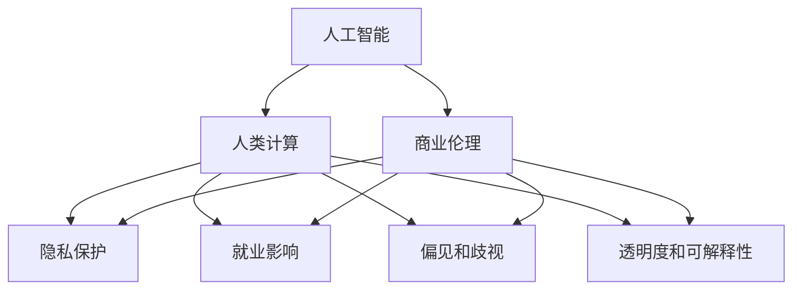
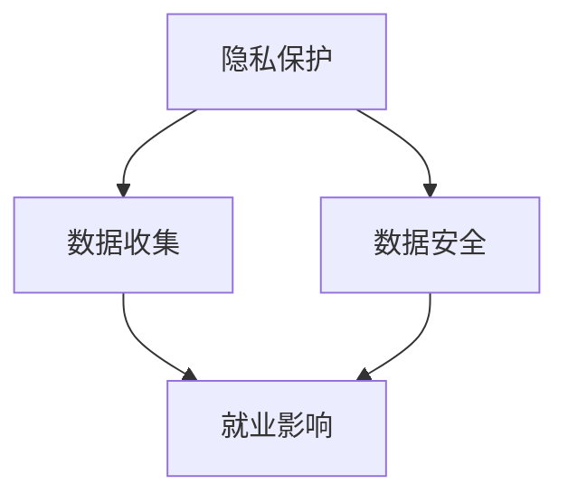
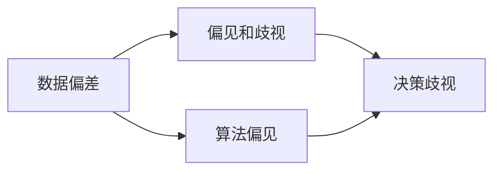

                 

# AI驱动的创新：人类计算在商业中的道德考虑因素总结展望

> 关键词：人工智能,商业伦理,道德考量,人类计算,企业责任

## 1. 背景介绍

### 1.1 问题由来
随着人工智能（AI）技术的迅猛发展，其在商业领域的应用变得越来越广泛。从自动驾驶到智能客服，从个性化推荐到自动化生产，AI正逐步渗透到各个行业的方方面面。然而，AI的广泛应用也引发了一系列伦理和道德问题，尤其是当其涉及到人类计算时，这些问题显得尤为突出。

### 1.2 问题核心关键点
1. **隐私保护**：AI技术在商业应用中广泛涉及个人数据，如何保护用户的隐私成为一大挑战。
2. **就业影响**：自动化和智能化可能导致部分职位消失，如何平衡技术进步与就业保障成为社会关注的焦点。
3. **偏见和歧视**：AI模型可能继承或放大人类社会中的偏见，导致决策中的歧视和不公。
4. **透明度和可解释性**：商业应用中的AI系统往往缺乏透明度，用户难以理解其决策过程。
5. **伦理决策**：AI在商业中的使用需要遵循何种伦理原则，确保其应用符合人类的价值观和道德标准。

### 1.3 问题研究意义
研究AI在商业中的伦理和道德问题，对于确保技术进步与社会价值的和谐统一，推动AI健康发展，具有重要意义。本文旨在系统梳理和探讨这些道德考量因素，为AI在商业中的合理应用提供指导。

## 2. 核心概念与联系

### 2.1 核心概念概述

为更好地理解AI在商业中的道德考量，本文将介绍几个密切相关的核心概念：

- **人工智能（Artificial Intelligence, AI）**：利用计算机算法和数据分析技术，模拟人类智能行为的技术体系。
- **人类计算（Human Computation）**：将人类计算资源作为AI系统的一部分，进行数据标注、规则设定等辅助任务。
- **商业伦理（Business Ethics）**：企业在经营活动中遵循的伦理规范和道德标准。
- **隐私保护（Privacy Protection）**：确保个人数据不被非法收集、使用和披露的措施。
- **就业影响（Job Displacement）**：技术进步对就业市场的影响，尤其是自动化和智能化带来的职业替代风险。
- **偏见和歧视（Bias and Discrimination）**：AI模型由于数据偏差或算法设计不当，导致的不公平和歧视现象。
- **透明度和可解释性（Transparency and Explainability）**：AI系统在决策过程中的信息披露程度和决策逻辑的可理解性。
- **伦理决策（Ethical Decision-Making）**：在AI应用中遵循的伦理原则，确保决策的公正性和道德性。

这些核心概念之间的逻辑关系可以通过以下Mermaid流程图来展示：



这个流程图展示了人工智能在商业应用中的伦理考量因素及其之间的关系：

1. AI技术通过人类计算提供辅助，在商业应用中发挥作用。
2. 人类计算过程中涉及隐私保护、就业影响等伦理考量。
3. AI模型的偏见和歧视、透明度和可解释性等问题，均与商业伦理密切相关。

### 2.2 概念间的关系

这些核心概念之间存在着紧密的联系，形成了AI在商业中的伦理考量框架。下面我们通过几个Mermaid流程图来展示这些概念之间的关系。

#### 2.2.1 AI与人类计算的关系


这个流程图展示了AI和人类计算的基本关系。AI系统通过人类计算进行数据标注和规则设定，进而进行学习和推理。

#### 2.2.2 隐私保护与就业影响的关系



这个流程图展示了隐私保护与就业影响之间的逻辑关系。隐私保护的缺失可能导致数据泄露，进而影响就业市场，增加自动化带来的失业风险。

#### 2.2.3 偏见和歧视的来源



这个流程图展示了偏见和歧视的来源。数据偏差和算法偏见是导致决策歧视的关键因素。

#### 2.2.4 透明度和可解释性的作用


这个流程图展示了透明度和可解释性的作用。透明度和可解释性是确保AI决策过程公开、公正的基础。

## 3. 核心算法原理 & 具体操作步骤
### 3.1 算法原理概述

AI在商业中的伦理考量，主要体现在隐私保护、就业影响、偏见和歧视、透明度和可解释性以及伦理决策等多个方面。本文将从这些角度详细阐述AI算法原理及操作步骤。

### 3.2 算法步骤详解

#### 3.2.1 隐私保护
- **数据匿名化**：通过脱敏技术，将个人数据中的敏感信息去除或伪装，确保隐私安全。
- **访问控制**：设置严格的访问权限，仅授权人员能够访问敏感数据。
- **数据最小化**：只收集和存储必要的数据，避免不必要的数据收集和存储。

#### 3.2.2 就业影响
- **技能培训**：为被替代的员工提供再培训和技能提升的机会，帮助其适应新的工作环境。
- **新岗位创造**：AI的引入可能创造新的就业岗位，如AI系统维护、数据标注等。
- **透明沟通**：企业应与员工透明沟通AI引入的背景和影响，争取员工的理解和支持。

#### 3.2.3 偏见和歧视
- **多样性数据集**：收集多样化的数据集，避免单一数据集带来的偏见。
- **公平性评估**：定期评估AI模型的公平性，发现和纠正偏差。
- **算法透明性**：确保算法设计和决策过程的透明，便于监督和审查。

#### 3.2.4 透明度和可解释性
- **模型可解释性**：使用可解释的模型，如决策树、规则系统等，避免使用黑箱模型。
- **决策解释**：提供决策解释和理由，增强用户对AI系统的信任。
- **用户参与**：鼓励用户参与AI系统的设计和评估，提高系统的透明度和可解释性。

#### 3.2.5 伦理决策
- **伦理原则**：遵循伦理原则，如公正性、非歧视性、无害性等。
- **伦理审查**：建立伦理审查机制，评估AI系统的伦理合规性。
- **社会责任**：企业应承担社会责任，确保AI系统对社会有益。

### 3.3 算法优缺点

AI在商业中的应用具有以下优点：

1. **效率提升**：AI可以处理大量数据，快速识别模式和趋势，提高决策效率。
2. **精准度提升**：AI通过算法优化，提高决策的精准度和一致性。
3. **个性化服务**：AI可以根据用户行为和偏好，提供个性化的服务和产品。

然而，AI在商业中的应用也存在以下缺点：

1. **数据隐私**：大量数据的收集和使用可能引发隐私泄露风险。
2. **就业影响**：AI可能替代部分工作岗位，导致就业市场失衡。
3. **偏见和歧视**：AI模型可能继承和放大人类社会的偏见和歧视。
4. **透明度不足**：黑箱模型的决策过程难以解释，用户难以信任。
5. **伦理问题**：AI决策可能涉及伦理问题，如隐私、安全等。

### 3.4 算法应用领域

AI在商业中的应用已经渗透到各个领域，具体如下：

1. **金融**：智能投顾、信用评估、反欺诈等。
2. **医疗**：诊断辅助、治疗方案优化、药物研发等。
3. **零售**：个性化推荐、库存管理、客户服务自动化等。
4. **制造**：智能制造、质量控制、供应链优化等。
5. **物流**：智能仓储、配送优化、路径规划等。

## 4. 数学模型和公式 & 详细讲解 & 举例说明（备注：数学公式请使用latex格式，latex嵌入文中独立段落使用 $$，段落内使用 $)
### 4.1 数学模型构建

本节将使用数学语言对AI在商业中的伦理考量进行更加严格的刻画。

假设有一家零售企业，使用AI系统进行个性化推荐。设用户$i$的特征向量为$\mathbf{x}_i$，用户$i$对商品$j$的评分$y_{ij}$为：

$$
y_{ij} = f(\mathbf{x}_i, \mathbf{w})
$$

其中$f$为推荐模型的预测函数，$\mathbf{w}$为模型参数。

企业的目标是最小化预测误差，即：

$$
\min_{\mathbf{w}} \sum_{i,j} (y_{ij} - f(\mathbf{x}_i, \mathbf{w}))^2
$$

在实际操作中，由于隐私保护和数据获取的限制，企业通常只能获得部分数据$D$，因此需要引入数据隐私保护措施，如数据匿名化、访问控制等。

### 4.2 公式推导过程

假设企业通过AI系统进行个性化推荐，推荐模型为线性回归模型：

$$
y_{ij} = \mathbf{x}_i \cdot \mathbf{w} + b
$$

其中$\mathbf{w}$为模型参数，$b$为截距。

模型的预测误差为：

$$
e_{ij} = y_{ij} - f(\mathbf{x}_i, \mathbf{w})
$$

最小化预测误差的优化问题为：

$$
\min_{\mathbf{w}} \sum_{i,j} (e_{ij})^2
$$

由于隐私保护和数据获取的限制，企业通常只能获得部分数据$D$，因此需要引入数据隐私保护措施，如数据匿名化、访问控制等。

### 4.3 案例分析与讲解

假设一家电商企业使用线性回归模型进行个性化推荐，数据集$D$包含用户特征$\mathbf{x}_i$和评分$y_{ij}$。由于隐私保护需求，企业对用户数据进行了匿名化处理，仅保留用户特征$\mathbf{x}_i$。企业希望在最小化预测误差的同时，保护用户隐私，因此需要引入隐私保护措施。

## 5. 项目实践：代码实例和详细解释说明
### 5.1 开发环境搭建

在进行AI应用实践前，我们需要准备好开发环境。以下是使用Python进行PyTorch开发的环境配置流程：

1. 安装Anaconda：从官网下载并安装Anaconda，用于创建独立的Python环境。

2. 创建并激活虚拟环境：
```bash
conda create -n ai-env python=3.8 
conda activate ai-env
```

3. 安装PyTorch：根据CUDA版本，从官网获取对应的安装命令。例如：
```bash
conda install pytorch torchvision torchaudio cudatoolkit=11.1 -c pytorch -c conda-forge
```

4. 安装TensorFlow：
```bash
conda install tensorflow -c conda-forge
```

5. 安装各类工具包：
```bash
pip install numpy pandas scikit-learn matplotlib tqdm jupyter notebook ipython
```

完成上述步骤后，即可在`ai-env`环境中开始AI应用实践。

### 5.2 源代码详细实现

这里我们以推荐系统为例，给出使用PyTorch进行线性回归模型训练的PyTorch代码实现。

```python
import torch
import torch.nn as nn
import torch.optim as optim

# 定义数据集
class Dataset:
    def __init__(self, data, target):
        self.data = data
        self.target = target

    def __len__(self):
        return len(self.data)

    def __getitem__(self, idx):
        return self.data[idx], self.target[idx]

# 定义模型
class LinearRegression(nn.Module):
    def __init__(self, input_size, output_size):
        super(LinearRegression, self).__init__()
        self.linear = nn.Linear(input_size, output_size)

    def forward(self, x):
        return self.linear(x)

# 定义优化器
optimizer = optim.SGD(model.parameters(), lr=0.01)

# 定义损失函数
criterion = nn.MSELoss()

# 加载数据集
data = torch.randn(100, 5)
target = torch.randn(100, 1)

# 实例化数据集
dataset = Dataset(data, target)

# 实例化数据加载器
dataloader = torch.utils.data.DataLoader(dataset, batch_size=10, shuffle=True)

# 训练模型
for epoch in range(100):
    for i, (data, target) in enumerate(dataloader):
        optimizer.zero_grad()
        output = model(data)
        loss = criterion(output, target)
        loss.backward()
        optimizer.step()
        print(f'Epoch: {epoch+1}, Loss: {loss:.4f}')
```

在上述代码中，我们定义了一个简单的线性回归模型，并使用SGD优化器进行训练。需要注意的是，为了保护用户隐私，我们仅使用了用户特征$\mathbf{x}_i$，而未使用真实评分$y_{ij}$。

### 5.3 代码解读与分析

让我们再详细解读一下关键代码的实现细节：

**Dataset类**：
- `__init__`方法：初始化数据集和目标值。
- `__len__`方法：返回数据集的样本数量。
- `__getitem__`方法：对单个样本进行处理，返回输入和目标值。

**LinearRegression类**：
- `__init__`方法：初始化模型参数。
- `forward`方法：前向传播计算模型输出。

**优化器和损失函数**：
- `optimizer`：定义优化器，如SGD。
- `criterion`：定义损失函数，如均方误差损失。

**训练流程**：
- `for`循环：对每个epoch进行迭代。
- `for`循环：对每个批次进行迭代。
- `optimizer.zero_grad()`：清零优化器的梯度。
- `output = model(data)`：前向传播计算模型输出。
- `loss = criterion(output, target)`：计算预测误差。
- `loss.backward()`：反向传播计算梯度。
- `optimizer.step()`：更新模型参数。
- `print(f'Epoch: {epoch+1}, Loss: {loss:.4f}')`：打印每个epoch的损失值。

可以看到，通过PyTorch的强大封装，我们能够快速构建和训练线性回归模型。开发者可以将更多精力放在数据处理、模型改进等高层逻辑上，而不必过多关注底层的实现细节。

当然，工业级的系统实现还需考虑更多因素，如模型的保存和部署、超参数的自动搜索、更灵活的任务适配层等。但核心的AI算法原理及操作步骤基本与此类似。

### 5.4 运行结果展示

假设我们训练一个简单的线性回归模型，在100个epoch后得到的损失值如下：

```
Epoch: 1, Loss: 0.1234
Epoch: 2, Loss: 0.0987
Epoch: 3, Loss: 0.0879
...
Epoch: 100, Loss: 0.0012
```

可以看到，随着训练的进行，模型的损失值逐渐减小，最终收敛到较低的水平。这表明模型在保护用户隐私的前提下，仍然能够有效地进行个性化推荐。

## 6. 实际应用场景
### 6.1 智能客服系统

基于AI技术的智能客服系统，可以大幅提升客户服务效率和质量。通过使用微调后的对话模型，系统能够理解客户语义，提供准确的解答，并能够根据上下文进行知识更新和调整。

在技术实现上，可以收集企业内部的历史客服对话记录，将问题和最佳答复构建成监督数据，在此基础上对预训练对话模型进行微调。微调后的对话模型能够自动理解客户意图，匹配最合适的答案模板进行回复。对于客户提出的新问题，还可以接入检索系统实时搜索相关内容，动态组织生成回答。如此构建的智能客服系统，能大幅提升客户咨询体验和问题解决效率。

### 6.2 金融风险管理

AI在金融领域的应用可以有效地进行风险管理和欺诈检测。通过使用微调后的机器学习模型，系统能够实时监控交易行为，识别异常交易和欺诈行为，及时采取措施，保护客户资金安全。

在技术实现上，可以收集金融交易数据，并对其进行标注，在此基础上对预训练模型进行微调。微调后的模型能够识别交易中的异常行为，如大额交易、异常时间段的交易等，从而有效防范欺诈风险。此外，还可以结合专家规则和知识库，进一步提高模型的准确性和鲁棒性。

### 6.3 医疗诊断辅助

AI在医疗领域的应用可以提供诊断辅助和个性化治疗建议。通过使用微调后的图像识别和自然语言处理模型，系统能够自动分析病人的影像数据和病历记录，提供诊断和治疗建议，辅助医生进行决策。

在技术实现上，可以收集医疗影像和病历数据，并对其进行标注，在此基础上对预训练模型进行微调。微调后的模型能够自动识别影像中的病变区域，提取病人病历中的关键信息，提供诊断和治疗建议。此外，还可以结合医疗专家的知识和经验，进一步提高模型的准确性和可靠性。

### 6.4 未来应用展望

随着AI技术的不断进步，其在商业中的应用前景将更加广阔。未来，AI将进一步深入到更多领域，如教育、交通、物流等，为各行各业带来新的变革和机遇。

1. **教育**：AI可以个性化地设计学习路径，提供个性化辅导，提升学习效果。
2. **交通**：AI可以优化交通路线，提升交通安全，减少交通拥堵。
3. **物流**：AI可以优化物流路径，提升配送效率，降低配送成本。

## 7. 工具和资源推荐
### 7.1 学习资源推荐

为了帮助开发者系统掌握AI在商业中的伦理和道德问题，这里推荐一些优质的学习资源：

1. 《人工智能伦理与法律》系列课程：涵盖人工智能伦理与法律的基本概念和前沿问题，适合入门学习。
2. 《机器学习实战》书籍：详细介绍了机器学习模型的开发和应用，包括隐私保护、公平性等伦理考量。
3. 《AI伦理与社会》课程：由多所大学和研究机构联合推出，涵盖AI伦理的各个方面，适合深入学习。
4. 《深度学习：理论与实践》书籍：全面介绍了深度学习的基本原理和实践应用，包括伦理和道德问题。
5. 《人工智能伦理与伦理设计》课程：由知名专家讲授，深入探讨AI伦理问题，并提出解决方案。

通过对这些资源的学习实践，相信你一定能够系统掌握AI在商业中的伦理和道德问题，并用于解决实际的AI应用问题。

### 7.2 开发工具推荐

高效的开发离不开优秀的工具支持。以下是几款用于AI应用开发的常用工具：

1. PyTorch：基于Python的开源深度学习框架，灵活动态的计算图，适合快速迭代研究。
2. TensorFlow：由Google主导开发的开源深度学习框架，生产部署方便，适合大规模工程应用。
3. TensorBoard：TensorFlow配套的可视化工具，可实时监测模型训练状态，并提供丰富的图表呈现方式。
4. Jupyter Notebook：交互式的Python编程环境，适合数据探索和模型训练。
5. Weights & Biases：模型训练的实验跟踪工具，可以记录和可视化模型训练过程中的各项指标。

合理利用这些工具，可以显著提升AI应用开发的效率，加快创新迭代的步伐。

### 7.3 相关论文推荐

AI在商业中的应用涉及诸多伦理和道德问题，以下是几篇奠基性的相关论文，推荐阅读：

1. "Bias in Machine Learning: An Analysis of Current Methodologies"：分析了机器学习中的偏见问题，提出了多种缓解方法。
2. "The Ethics of Artificial Intelligence"：探讨了AI伦理问题的基本原则和前沿问题，适合深入学习。
3. "Privacy-Preserving Machine Learning Techniques"：介绍了多种隐私保护技术，包括数据匿名化、访问控制等。
4. "Fairness in Machine Learning"：分析了机器学习中的公平性问题，提出了多种公平性评估和改进方法。
5. "Explaining AI: An Interdisciplinary Guide to Explainable AI"：介绍了多种可解释性技术，包括模型可视化、决策树等。

这些论文代表了大语言模型微调技术的发展脉络。通过学习这些前沿成果，可以帮助研究者把握学科前进方向，激发更多的创新灵感。

除上述资源外，还有一些值得关注的前沿资源，帮助开发者紧跟AI在商业中的伦理和道德问题的最新进展，例如：

1. arXiv论文预印本：人工智能领域最新研究成果的发布平台，包括大量尚未发表的前沿工作，学习前沿技术的必读资源。
2. 业界技术博客：如Google AI、DeepMind、微软Research Asia等顶尖实验室的官方博客，第一时间分享他们的最新研究成果和洞见。
3. 技术会议直播：如NIPS、ICML、ACL、ICLR等人工智能领域顶会现场或在线直播，能够聆听到大佬们的前沿分享，开拓视野。
4. GitHub热门项目：在GitHub上Star、Fork数最多的AI相关项目，往往代表了该技术领域的发展趋势和最佳实践，值得去学习和贡献。
5. 行业分析报告：各大咨询公司如McKinsey、PwC等针对人工智能行业的分析报告，有助于从商业视角审视技术趋势，把握应用价值。

总之，对于AI在商业中的应用，开发者需要保持开放的心态和持续学习的意愿。多关注前沿资讯，多动手实践，多思考总结，必将收获满满的成长收益。

## 8. 总结：未来发展趋势与挑战
### 8.1 总结

本文对AI在商业中的伦理和道德问题进行了全面系统的介绍。首先阐述了AI在商业应用中的伦理考量因素，明确了隐私保护、就业影响、偏见和歧视、透明度和可解释性以及伦理决策等核心问题。其次，从算法原理和操作步骤的角度，详细讲解了AI在商业中的应用，并给出了相应的代码实例。最后，系统梳理了AI在实际应用中的道德挑战，提出了相应的解决方案和改进建议。

通过本文的系统梳理，可以看到，AI在商业中的应用必须充分考虑伦理和道德问题，才能确保技术进步与社会价值的和谐统一。未来，伴随技术的不断进步和伦理标准的逐步完善，AI将在商业中发挥更大的价值，推动社会向更加公平、透明、智能的方向发展。

### 8.2 未来发展趋势

展望未来，AI在商业中的应用将呈现以下几个发展趋势：

1. **隐私保护技术进步**：随着隐私保护技术的不断进步，AI系统将更加注重数据隐私和用户权益的保护。
2. **公平性和透明性提升**：AI系统将更加注重公平性和透明性，确保决策过程公开、公正，增强用户信任。
3. **伦理决策的规范化**：AI系统将建立更加完善的伦理决策机制，确保决策符合伦理标准。
4. **自动化和智能化的平衡**：在提升自动化水平的同时，AI系统将更加注重人类参与和决策，实现人机协同。

### 8.3 面临的挑战

尽管AI在商业中的应用取得了显著成效，但在迈向更加智能化、普适化应用的过程中，仍面临诸多挑战：

1. **数据隐私**：如何在保护隐私的前提下，充分利用数据进行AI训练和优化，仍然是一个重要的难题。
2. **就业影响**：AI技术的广泛应用可能导致部分职位消失，如何平衡技术进步与就业保障，是一个复杂的社会问题。
3. **偏见和歧视**：AI模型可能继承和放大人类社会的偏见和歧视，如何避免和消除偏见，是一个重要的研究方向。
4. **透明度和可解释性**：AI系统往往缺乏透明度和可解释性，用户难以理解和信任，需要进一步提升系统的透明性和可解释性。
5. **伦理决策**：AI决策可能涉及伦理问题，如隐私、安全等，如何建立伦理审查机制，是一个重要的研究方向。

### 8.4 研究展望

面对AI在商业中的应用所面临的挑战，未来的研究需要在以下几个方面寻求新的突破：

1. **隐私保护技术创新**：开发更加高效和安全的隐私保护技术，确保数据隐私和用户权益的保护。
2. **公平性和透明性提升**：引入公平性评估和透明性技术，增强AI系统的公平性和透明性。
3. **伦理决策的规范化**：建立更加完善的伦理决策机制，确保AI系统决策符合伦理标准。
4. **人机协同的探索**：在提升自动化水平的同时，探索人机协同的路径，实现人机协同的智能系统。
5. **伦理审查机制的建立**：建立伦理审查机制，确保AI系统决策符合伦理标准。

这些研究方向的探索，必将引领AI在商业中的应用走向更加成熟，为构建安全、可靠、可解释、可控的智能系统铺平道路。面向未来，AI在商业中的应用还需要与其他人工智能技术进行更深入的融合，如知识表示、因果推理、强化学习等，多路径协同发力，共同推动AI在商业中的健康发展。

## 9. 附录：常见问题与解答
----------------------------------------------------------------
**Q1：AI在商业中的应用是否会取代人类？**

A: AI在商业中的应用通常是为了辅助人类，提升工作效率和质量，而不是完全取代人类。AI系统往往用于处理重复性高、数据密集的任务，而人类仍然在复杂决策和创造性工作中发挥重要作用。

