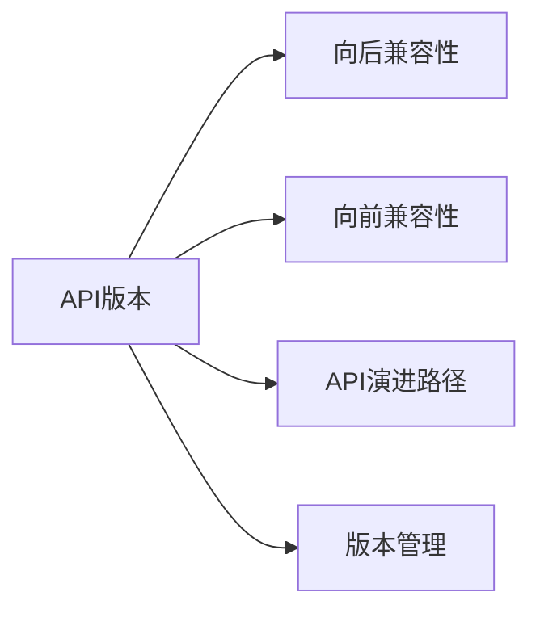
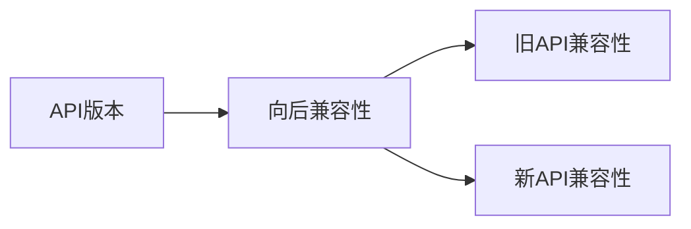
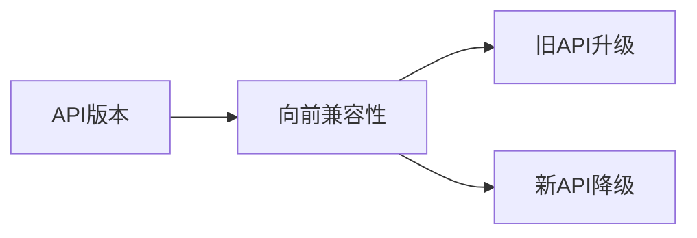
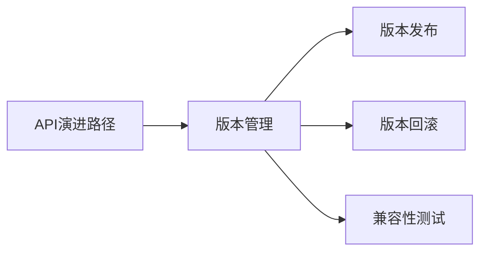

                 

# API 版本控制的基本原则

在软件开发和系统架构设计中，API（应用程序接口）扮演着至关重要的角色，它定义了系统组件之间的交互规则，使不同的服务和组件能够协同工作。然而，随着软件项目的演进，API的需求和设计也会发生变化，这就带来了API版本控制的问题。有效的API版本控制不仅能够保证系统的稳定性和可维护性，还能够提升用户体验和系统的可扩展性。本文将深入探讨API版本控制的基本原则，帮助开发者设计出稳定、可靠、易于管理的API版本。

## 1. 背景介绍

### 1.1 问题由来
API版本控制的必要性源于软件项目的发展变化。随着功能需求的增加、用户群体的扩大以及新技术的应用，API设计可能会频繁调整和更新。例如，新的功能模块可能需要增加新的接口、旧的功能模块可能被废弃，或者是接口的参数、返回值等细节需要进行调整。这些变更如果没有妥善处理，可能会导致依赖API的客户端应用程序出现兼容性问题，影响系统的稳定性和可靠性。

### 1.2 问题核心关键点
API版本控制的核心关键点包括：
- **稳定性**：确保现有API的稳定性，避免对依赖API的客户端产生影响。
- **兼容性**：实现新旧API之间的兼容性，支持旧API向后兼容，新API向前兼容。
- **演进路径**：制定明确的API演进路径，指导未来的API设计和调整。
- **版本管理**：建立有效的API版本管理机制，跟踪API的版本变更历史。

## 2. 核心概念与联系

### 2.1 核心概念概述

为了更好地理解API版本控制的基本原则，本节将介绍几个密切相关的核心概念：

- **API版本**：指API的不同实现版本，通常通过版本号来区分。例如，API v1.0、API v2.0等。
- **向后兼容性**：指新的API版本应该能够与旧版本兼容，即旧版本的客户端仍然能够正常运行。
- **向前兼容性**：指旧版本的API应该能够升级为新版本，即新版本的客户端仍然能够正常运行。
- **API演进路径**：指API从旧版本到新版本的演进过程，包括新增功能、废弃功能、调整接口等。
- **版本管理**：指对API版本进行版本控制和管理的流程，包括版本发布、回滚、兼容性测试等。

这些核心概念之间的逻辑关系可以通过以下Mermaid流程图来展示：



这个流程图展示了API版本控制的核心概念及其之间的关系：

1. API版本控制包括向后兼容性和向前兼容性两个基本原则，确保API演进过程中不破坏客户端的稳定性。
2. API演进路径描述了API从旧版本到新版本的具体变化，指导未来的API设计和调整。
3. 版本管理是实现API版本控制的重要工具，帮助开发者跟踪版本变更，确保API的稳定性。

### 2.2 概念间的关系

这些核心概念之间存在着紧密的联系，形成了API版本控制的完整生态系统。下面我通过几个Mermaid流程图来展示这些概念之间的关系。

#### 2.2.1 API版本与向后兼容性



这个流程图展示了API版本与向后兼容性之间的关系。API版本通过向后兼容性保证旧API的客户端仍然能够正常运行，而新API的兼容性则支持新API的客户端正常运行。

#### 2.2.2 API版本与向前兼容性



这个流程图展示了API版本与向前兼容性之间的关系。旧API通过向前兼容性升级为新API，而新API则可以通过向前兼容性降级为旧API，确保系统的兼容性和稳定性。

#### 2.2.3 API演进路径与版本管理



这个流程图展示了API演进路径与版本管理之间的关系。版本管理通过版本发布、回滚和兼容性测试等手段，确保API的演进路径清晰、可控。

## 3. 核心算法原理 & 具体操作步骤

### 3.1 算法原理概述

API版本控制的原理是通过引入版本概念，将API的演进过程进行分版本管理，确保新旧版本之间具有兼容性和稳定性。API版本控制的核心思想是：在API演进过程中，通过定义明确的版本策略，保证现有API的向后兼容性，同时提供向前兼容性，支持新API的逐步升级，最终实现平滑过渡到新版本。

### 3.2 算法步骤详解

基于上述原理，API版本控制的一般流程包括以下几个关键步骤：

**Step 1: 确定API演进路径**
- 分析现有API的优缺点，确定需要新增、废弃或调整的功能。
- 制定明确的API演进路径，包括新增功能、废弃功能、调整接口等。
- 确保演进路径不会破坏现有API的向后兼容性。

**Step 2: 实现向后兼容性**
- 在旧API中保留所有已有的功能，确保向后兼容。
- 引入新功能时，尽量使用新增接口，而不是修改已有接口。
- 引入新接口时，使用默认参数、默认返回值等策略，避免对现有客户端产生影响。

**Step 3: 实现向前兼容性**
- 在新API中引入旧API的兼容接口，确保旧API的客户端能够向后兼容。
- 在新API中提供新旧API的映射表，帮助客户端进行版本切换。
- 在新API中提供逐步升级的机制，支持客户端逐步迁移到新版本。

**Step 4: 实现版本管理**
- 建立版本控制机制，包括版本发布、回滚、兼容性测试等。
- 在每次版本发布时，记录API变更日志，包括新增、废弃、调整的功能。
- 定期进行兼容性测试，确保新旧API之间的兼容性和稳定性。

**Step 5: 更新文档和测试**
- 更新API文档，包括新增、废弃、调整的功能。
- 更新客户端的测试用例，确保新旧API之间的兼容性。

### 3.3 算法优缺点

API版本控制的优点包括：
- 提高系统的稳定性和可靠性，避免因API变动对现有客户端产生影响。
- 提供明确的API演进路径，指导未来的API设计和调整。
- 确保新旧API之间的兼容性和稳定性，支持平滑过渡到新版本。

API版本控制的缺点包括：
- 设计和实现过程较为复杂，需要耗费大量的时间和资源。
- 版本管理过程需要定期进行兼容性测试，确保API的稳定性。
- 版本控制的实现需要考虑多个因素，如接口的复杂性、客户端的兼容性等。

### 3.4 算法应用领域

API版本控制在软件开发和系统架构设计中具有广泛的应用。以下是几个典型应用场景：

- **微服务架构**：在微服务架构中，每个服务可能需要独立设计和演进，API版本控制帮助不同服务之间保持兼容性。
- **Web API设计**：在Web API设计中，API版本控制帮助不同版本的API之间进行兼容和演进，提升用户体验和系统的可扩展性。
- **移动应用开发**：在移动应用开发中，API版本控制帮助不同版本的移动客户端保持兼容，支持旧版本客户端逐步升级至新版本。
- **企业级系统**：在企业级系统中，API版本控制帮助不同部门和团队之间的系统集成和演进，提升系统的灵活性和稳定性。

## 4. 数学模型和公式 & 详细讲解 & 举例说明

### 4.1 数学模型构建

API版本控制的数学模型可以通过形式化的方式进行描述。假设有两个版本的API：旧API v1和新的API v2，我们需要分析它们之间的兼容性关系。

设旧API v1的接口集合为 $S_1$，新API v2的接口集合为 $S_2$。旧API v1的函数 $f_1: S_1 \rightarrow \text{返回值}$，新API v2的函数 $f_2: S_2 \rightarrow \text{返回值}$。

旧API v1和旧API v2之间的兼容性关系可以表示为：
$$
S_1 \subseteq S_2
$$

新API v2和旧API v1之间的兼容性关系可以表示为：
$$
S_2 \supseteq S_1
$$

### 4.2 公式推导过程

根据上述兼容性关系，我们可以推导出API版本控制的数学模型。具体来说，API版本控制的兼容性模型包括：

- 旧API v1的兼容接口集合 $C_1 \subseteq S_1$
- 新API v2的兼容接口集合 $C_2 \subseteq S_2$
- 新旧API之间的映射关系 $M: C_1 \rightarrow C_2$

其中，$C_1$ 和 $C_2$ 分别是旧API和新API的兼容接口集合，$M$ 是兼容接口的映射关系。

### 4.3 案例分析与讲解

假设我们有一个旧API v1和一个新的API v2，旧API v1提供了一个函数 `get_user_info`，返回用户的基本信息。新API v2希望新增一个功能 `get_user_info_with_details`，返回用户详细信息。

**Step 1: 确定兼容性策略**
- 旧API v1的 `get_user_info` 函数需要保留，因为它已经在使用中。
- 新API v2的新函数 `get_user_info_with_details` 需要兼容旧API v1的 `get_user_info` 函数，以便支持旧API v1的客户端。

**Step 2: 实现兼容性**
- 新API v2的 `get_user_info_with_details` 函数可以通过参数映射兼容旧API v1的 `get_user_info` 函数。
- 例如，新函数可以接受一个 `details` 参数，默认为 `false`，表示只返回基本信息。当 `details` 为 `true` 时，返回详细信息。

**Step 3: 更新文档和测试**
- 更新API文档，说明新函数 `get_user_info_with_details` 的参数映射关系。
- 更新客户端的测试用例，确保新旧API之间的兼容性。

通过这个案例，我们可以看到API版本控制如何通过参数映射和兼容性策略，实现新旧API之间的平滑过渡。

## 5. 项目实践：代码实例和详细解释说明

### 5.1 开发环境搭建

在进行API版本控制的项目实践前，我们需要准备好开发环境。以下是使用Python进行API版本控制的开发环境配置流程：

1. 安装Anaconda：从官网下载并安装Anaconda，用于创建独立的Python环境。

2. 创建并激活虚拟环境：
```bash
conda create -n apiversioning python=3.8 
conda activate apiversioning
```

3. 安装Flask：
```bash
pip install flask
```

4. 安装Flask-RESTful：
```bash
pip install flask-restful
```

5. 安装Flask-Swagger：
```bash
pip install flask-swagger
```

6. 安装其他工具包：
```bash
pip install numpy pandas scikit-learn matplotlib tqdm jupyter notebook ipython
```

完成上述步骤后，即可在`apiversioning-env`环境中开始API版本控制的实践。

### 5.2 源代码详细实现

下面我们以一个简单的API版本控制项目为例，给出使用Flask进行API版本控制的PyTorch代码实现。

```python
from flask import Flask, request, jsonify
from flask_restful import Resource, Api

app = Flask(__name__)
api = Api(app)

class VersionOne(Resource):
    def get(self):
        return jsonify({"message": "This is Version 1 API"})

class VersionTwo(Resource):
    def get(self):
        details = request.args.get("details", "false")
        if details.lower() == "true":
            return jsonify({"message": "This is Version 2 API with details"})
        else:
            return jsonify({"message": "This is Version 2 API without details"})

api.add_resource(VersionOne, "/v1")
api.add_resource(VersionTwo, "/v2")

if __name__ == "__main__":
    app.run(debug=True)
```

在上述代码中，我们定义了两个API版本：版本一和版本二。每个API版本提供了一个简单的GET请求，返回一个JSON格式的响应。

### 5.3 代码解读与分析

让我们再详细解读一下关键代码的实现细节：

**Flask和Flask-RESTful**：
- Flask是一个轻量级的Web框架，适合快速搭建Web应用。
- Flask-RESTful是一个扩展，提供了RESTful风格的API开发工具。

**VersionOne和VersionTwo类**：
- 定义了两个API版本，分别处理不同版本的请求。
- 使用Flask-RESTful的Resource类，定义了GET请求的实现逻辑。

**API路由**：
- 使用Flask-RESTful的api.add_resource方法，将API版本添加到不同的URL路径上。

**运行和调试**：
- 在主函数中启动Flask应用，设置debug为True，方便调试。

### 5.4 运行结果展示

假设我们在运行上述代码后，在浏览器中输入`http://localhost:5000/v1`，会看到如下响应：
```json
{"message": "This is Version 1 API"}
```

而如果输入`http://localhost:5000/v2`，会看到如下响应：
```json
{"message": "This is Version 2 API without details"}
```

通过这个例子，我们可以看到如何使用Flask实现API版本控制，并通过参数映射和兼容性策略，实现新旧API之间的平滑过渡。

## 6. 实际应用场景

### 6.1 智能客服系统

智能客服系统需要与用户进行多轮对话，不同版本的API可能会引入新的功能或调整接口。API版本控制帮助系统在演进过程中保持兼容性和稳定性，避免对用户造成干扰。

在技术实现上，可以收集历史客服对话记录，将对话历史和回复作为API接口的数据输入。当系统进行API演进时，更新API文档，确保新旧API的兼容性。例如，新的API可以接受新的对话历史，并提供更加智能的回复。

### 6.2 金融舆情监测系统

金融舆情监测系统需要实时监测市场舆论动向，不同版本的API可能会新增舆情分析功能或调整接口。API版本控制帮助系统在演进过程中保持兼容性和稳定性，确保新旧API的兼容。

在技术实现上，可以收集金融领域相关的新闻、报道、评论等文本数据，并对其进行情感标注。当系统进行API演进时，更新API文档，确保新旧API的兼容性。例如，新的API可以接受新的新闻数据，并分析其情感倾向，提供更准确的舆情监测。

### 6.3 个性化推荐系统

个性化推荐系统需要根据用户的兴趣和行为数据推荐商品或内容，不同版本的API可能会新增推荐算法或调整接口。API版本控制帮助系统在演进过程中保持兼容性和稳定性，确保新旧API的兼容。

在技术实现上，可以收集用户浏览、点击、评论、分享等行为数据，并提取和用户交互的物品标题、描述、标签等文本内容。当系统进行API演进时，更新API文档，确保新旧API的兼容性。例如，新的API可以接受新的用户行为数据，并使用新的推荐算法生成个性化推荐。

### 6.4 未来应用展望

随着API版本控制的不断发展，其在更多领域的应用前景将更加广阔。未来API版本控制将面临以下几个趋势：

1. **微服务架构**：在微服务架构中，API版本控制将帮助不同服务之间的系统集成和演进，提升系统的灵活性和稳定性。
2. **API市场化**：API版本控制将帮助开发者构建可复用、可扩展的API市场，提升API的可用性和安全性。
3. **跨平台支持**：API版本控制将支持跨平台API的开发和部署，提升API的兼容性和扩展性。
4. **自动化部署**：API版本控制将与自动化部署工具结合，实现API的自动更新和版本管理。

以上趋势凸显了API版本控制的重要性和发展潜力。未来API版本控制将更加智能化、自动化和集成化，为系统的稳定性和可维护性提供更强保障。

## 7. 工具和资源推荐

### 7.1 学习资源推荐

为了帮助开发者系统掌握API版本控制的理论基础和实践技巧，这里推荐一些优质的学习资源：

1. **《API设计之美》**：这本书深入浅出地介绍了API设计的基本原则和最佳实践，是理解API版本控制的必读之作。
2. **《RESTful API设计指南》**：这本书详细介绍了RESTful API设计的规范和实践，帮助开发者构建可靠、可维护的API。
3. **《API设计和开发》**：这本书涵盖了API设计和开发的全面内容，包括版本控制、安全、性能等方面的知识。
4. **《API演进之路》**：这本书介绍了API演进的最佳实践和工具，帮助开发者管理API的版本变更。
5. **《API版本控制》**：这是一篇经典的技术文章，介绍了API版本控制的核心原则和实现方法。

通过对这些资源的学习实践，相信你一定能够快速掌握API版本控制的基本原则，并用于解决实际的API问题。

### 7.2 开发工具推荐

高效的开发离不开优秀的工具支持。以下是几款用于API版本控制的常用工具：

1. **Swagger**：Swagger是一个API文档生成工具，可以帮助开发者构建详细的API文档，支持版本管理。
2. **Postman**：Postman是一个API测试工具，支持API的调用和测试，方便开发者验证API的兼容性。
3. **API版本管理工具**：如Confluent、Nginx等工具，可以帮助开发者进行API的版本管理和部署。
4. **Git版本控制系统**：如Git、GitLab等版本控制系统，可以帮助开发者进行API的版本控制和协作。

合理利用这些工具，可以显著提升API版本控制的开发效率，加快创新迭代的步伐。

### 7.3 相关论文推荐

API版本控制的不断发展得益于学界的持续研究。以下是几篇奠基性的相关论文，推荐阅读：

1. **《API版本控制：一种系统化的方法》**：这篇文章介绍了API版本控制的系统化方法，提出了多种版本控制策略。
2. **《API演进：一种面向API消费者的方法》**：这篇文章探讨了API演进的方法，提出了向后兼容性和向前兼容性两种演进策略。
3. **《API版本管理：一种自动化的方法》**：这篇文章介绍了API版本管理的自动化方法，提出了API版本管理的最佳实践。
4. **《API兼容性：一种形式化的方法》**：这篇文章介绍了API兼容性的形式化方法，提出了API兼容性模型。

这些论文代表了大语言模型微调技术的发展脉络。通过学习这些前沿成果，可以帮助研究者把握学科前进方向，激发更多的创新灵感。

除上述资源外，还有一些值得关注的前沿资源，帮助开发者紧跟API版本控制的最新进展，例如：

1. **arXiv论文预印本**：人工智能领域最新研究成果的发布平台，包括大量尚未发表的前沿工作，学习前沿技术的必读资源。
2. **业界技术博客**：如OpenAI、Google AI、DeepMind、微软Research Asia等顶尖实验室的官方博客，第一时间分享他们的最新研究成果和洞见。
3. **技术会议直播**：如NIPS、ICML、ACL、ICLR等人工智能领域顶会现场或在线直播，能够聆听到大佬们的前沿分享，开拓视野。
4. **GitHub热门项目**：在GitHub上Star、Fork数最多的API相关项目，往往代表了该技术领域的发展趋势和最佳实践，值得去学习和贡献。
5. **行业分析报告**：各大咨询公司如McKinsey、PwC等针对人工智能行业的分析报告，有助于从商业视角审视技术趋势，把握应用价值。

总之，对于API版本控制技术的学习和实践，需要开发者保持开放的心态和持续学习的意愿。多关注前沿资讯，多动手实践，多思考总结，必将收获满满的成长收益。

## 8. 总结：未来发展趋势与挑战

### 8.1 总结

本文对API版本控制的基本原则进行了全面系统的介绍。首先阐述了API版本控制的必要性和核心关键点，明确了API演进过程中的稳定性、兼容性和演进路径等重要原则。其次，从原理到实践，详细讲解了API版本控制的数学模型和操作步骤，给出了API版本控制的完整代码实例。同时，本文还广泛探讨了API版本控制在智能客服、金融舆情监测、个性化推荐等多个领域的应用前景，展示了API版本控制的巨大潜力。此外，本文精选了API版本控制的各类学习资源，力求为读者提供全方位的技术指引。

通过本文的系统梳理，可以看到，API版本控制是一种高效的API演进管理方法，能够保证API的稳定性和兼容性，提升系统的可维护性和扩展性。API版本控制不仅适用于传统的API设计和开发，还适用于现代微服务架构和大数据环境下的API管理。未来，API版本控制将成为API设计和开发的重要工具，为系统的稳定性和可维护性提供强有力保障。

### 8.2 未来发展趋势

展望未来，API版本控制的趋势将呈现以下几个方面：

1. **智能化API设计**：未来的API设计将更加智能化，通过数据分析和用户行为分析，自动生成API版本控制策略。
2. **自动化API管理**：API版本控制的自动化工具将更加普及，帮助开发者进行API的版本管理和部署。
3. **跨平台API设计**：未来的API设计将支持跨平台API的开发和部署，提升API的兼容性和扩展性。
4. **API市场化**：API版本控制将帮助开发者构建可复用、可扩展的API市场，提升API的可用性和安全性。
5. **API安全管理**：API版本控制将与API安全管理结合，确保API的安全性和隐私性。

这些趋势凸显了API版本控制的重要性和发展潜力。API版本控制将不断演进，为API的设计和部署提供更加可靠和高效的解决方案。

### 8.3 面临的挑战

尽管API版本控制已经取得了瞩目成就，但在迈向更加智能化、普适化应用的过程中，它仍面临着诸多挑战：

1. **复杂度增加**：随着API版本的增加，版本控制的复杂度也会随之增加，需要投入大量的时间和资源。
2. **兼容性测试**：确保新旧API之间的兼容性需要定期进行测试，耗费大量时间和资源。
3. **版本管理的自动化**：自动化版本管理工具的开发和维护需要投入大量时间和精力。
4. **API演进路径的制定**：制定明确的API演进路径需要深入分析和理解API的需求和设计。
5. **兼容性管理**：确保API的兼容性和稳定性需要定期进行管理和维护。

这些挑战需要我们从技术和管理两个层面进行深入研究和探索。只有在技术和管理两个层面协同发力，才能真正实现API版本控制的全面优化。

### 8.4 研究展望

面对API版本控制所面临的挑战，未来的研究需要在以下几个方面寻求新的突破：

1. **智能化API版本管理**：通过引入AI和大数据技术，实现API版本的自动化管理和优化。
2. **API演进路径的优化**：利用机器学习和数据分析技术，自动生成API演进路径，指导未来的API设计和调整。
3. **API兼容性的增强**：引入更多先验知识，如知识图谱、逻辑规则等，提升API的兼容性和稳定性。
4. **API版本控制的集成化**：将API版本控制与自动化部署、持续集成等工具结合，实现API的自动化管理和部署。

这些研究方向的探索，必将引领API版本控制技术迈向更高的台阶，为构建稳定、可靠、可维护的API系统提供强有力保障。未来，API版本控制将成为API设计和开发的重要工具，为系统的稳定性和可维护性提供强有力保障。

## 9. 附录：常见问题与解答

**Q1: API版本控制和API兼容性有什么区别？**

A: API版本控制是一种系统化的API管理方法，旨在通过分版本管理API的演进过程，确保新旧API之间的兼容性和稳定性。而API兼容性则是一种API演进策略，指新的API版本应该能够与旧版本兼容，同时旧API也可以逐步升级为新版本。

**Q2: 为什么API版本控制很重要？**

A: API版本控制对于系统的稳定性和可维护性至关重要。它确保了API演进过程中新旧API之间的兼容性，避免了因API变动对现有客户端产生的影响。同时，API版本控制帮助开发者制定明确的API演进路径，指导未来的API设计和调整，提升系统的可扩展性和灵活性。

**Q3: 如何实现API版本控制？**

A: 实现API版本控制需要制定明确的API演进路径，确保新旧API之间的兼容性和稳定性。通过引入参数映射、兼容性策略等手段，实现新旧API之间的平滑过渡。同时，使用版本控制工具进行API的版本管理和发布，确保API的稳定性和可维护性。

**Q4: API版本控制有哪些应用场景？**

A: API版本控制广泛应用于软件开发、系统架构设计、微服务架构、Web API设计等多个领域。在智能客服、金融舆情监测、个性化推荐等场景中，API版本控制能够保证系统的稳定性和可维护性，提升用户体验和系统的可扩展性。

**Q5: 如何设计API的兼容性策略？**

A: 设计API的兼容性策略需要考虑新旧API之间的参数映射、接口映射等方面。引入参数映射策略，确保旧API的客户端能够继续使用新API。引入接口映射策略，确保新API能够兼容旧API的接口和功能。

通过这些常见问题的解答，相信你能够更好地理解和应用API版本控制的基本原则，解决实际项目中的API问题。

---

作者：禅与计算机程序设计艺术 / Zen and the Art of Computer Programming

