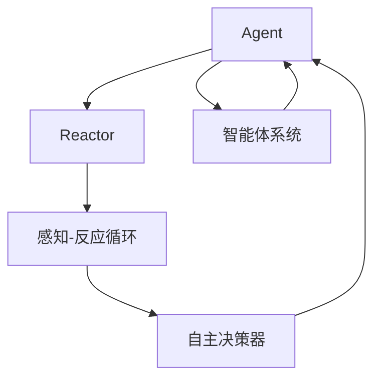
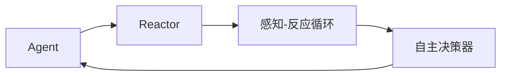
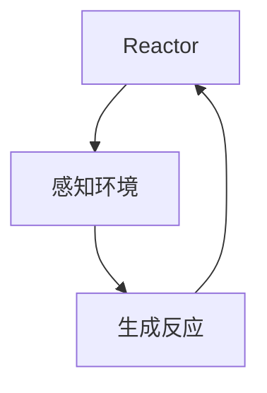
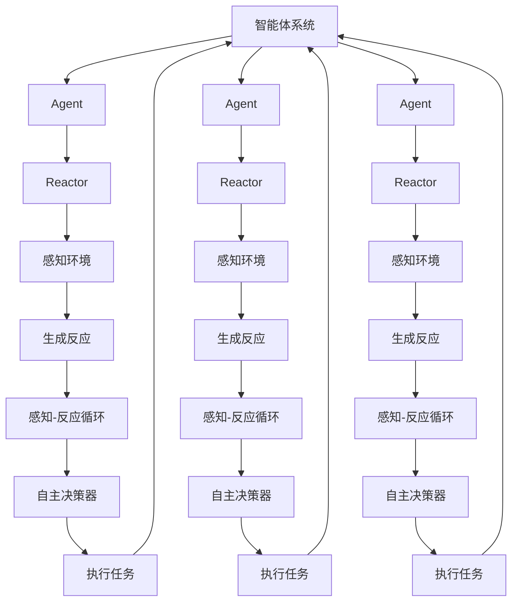

                 

# Agent 理论基础：ReAct

## 1. 背景介绍

### 1.1 问题由来
Agent理论，作为人工智能和机器人领域的重要基础理论，致力于构建能够自主决策、适应环境、执行任务的智能体模型。近年来，随着机器学习和大数据技术的发展，Agent理论逐渐演变为可解释的智能体系统，具备更高的自主性和适应性。

ReAct作为最新的Agent理论范式，通过将智能体与反应者(Reactor)结合起来，构建一个更加自主、适应性更强、可解释性更好的智能系统。该范式在自动化、无人驾驶、智能医疗、推荐系统等多个领域得到应用，极大地推动了智能技术的发展。

### 1.2 问题核心关键点
ReAct理论的核心在于将Agent划分为可解释的反应者(Reactor)和自主决策的执行者(Agent)。通过将决策过程拆分为"感知-反应"两阶段，使得Agent的决策过程更加透明、可解释、可追溯。这一范式提升了智能体的自主性和可控性，同时确保了系统决策的可靠性和鲁棒性。

ReAct理论的关键点包括：
- **可解释的反应者(Reactor)**：负责感知环境，理解输入，生成反应。
- **自主决策的执行者(Agent)**：基于Reactor的反应结果，自主决策，执行任务。
- **感知-反应循环**：智能体通过感知-反应循环不断适应环境，提升决策能力。

### 1.3 问题研究意义
ReAct理论的提出，旨在构建更加自主、透明、可解释的智能体系统。相比传统的基于规则或机器学习的智能体模型，ReAct通过引入反应者的设计，使得智能体的决策过程更加科学、合理。同时，ReAct还强调系统的可控性，能够通过"感知-反应"循环不断调整策略，以应对不断变化的环境。

研究ReAct理论具有重要的理论和实际意义：
1. 提升智能体的自主性和适应性。
2. 增强系统的可解释性和可控性。
3. 推动智能体系统在自动化、无人驾驶、智能医疗等领域的广泛应用。
4. 为智能体系统的网络安全、隐私保护等提供新的研究思路。
5. 为机器人、自动化生产线等高自主性系统提供理论基础。

## 2. 核心概念与联系

### 2.1 核心概念概述

为更好地理解ReAct理论，本节将介绍几个关键概念：

- **Agent**：智能体，能够感知环境、自主决策并执行任务。
- **Reactor**：反应者，负责感知环境、理解输入、生成反应。
- **感知-反应循环**：智能体通过感知环境，生成反应，然后执行任务，再感知新的环境，生成新的反应。
- **自主决策器**：基于Reactor的反应结果，自主决策并执行任务。
- **智能体系统**：由Agent和Reactor组成的系统，能够在多模态环境中共存并协同工作。

ReAct理论的核心概念之间的关系可以用以下Mermaid流程图来展示：



这个流程图展示了大语言模型微调过程中各个核心概念之间的关系：

1. Agent通过感知-反应循环，不断调整策略以适应环境。
2. Reactor负责感知环境，生成反应。
3. 自主决策器基于Reactor的反应结果，自主决策并执行任务。
4. 智能体系统由Agent和Reactor共同构成，能够在多模态环境中协同工作。

### 2.2 概念间的关系

这些核心概念之间存在着紧密的联系，形成了ReAct理论的完整生态系统。下面我们通过几个Mermaid流程图来展示这些概念之间的关系。

#### 2.2.1 智能体的自主决策



这个流程图展示了智能体的自主决策过程：

1. Agent通过Reactor感知环境，生成反应。
2. 自主决策器基于Reactor的反应结果，自主决策并执行任务。
3. 通过感知-反应循环不断调整策略以适应环境。

#### 2.2.2 反应者的感知与生成



这个流程图展示了Reactor的感知与生成过程：

1. Reactor感知环境，理解输入。
2. 生成反应。
3. 将反应结果传递给Agent，完成一个感知-反应循环。

#### 2.2.3 智能体系统的整体架构


这个综合流程图展示了智能体系统的整体架构：

1. Agent通过感知-反应循环，不断调整策略以适应环境。
2. Reactor负责感知环境，生成反应。
3. 自主决策器基于Reactor的反应结果，自主决策并执行任务。
4. 智能体系统由Agent和Reactor共同构成，能够在多模态环境中协同工作。

### 2.3 核心概念的整体架构

最后，我们用一个综合的流程图来展示ReAct理论中各个核心概念的关系：



这个综合流程图展示了ReAct理论中各个核心概念的关系：

1. Agent通过感知-反应循环，不断调整策略以适应环境。
2. Reactor负责感知环境，生成反应。
3. 自主决策器基于Reactor的反应结果，自主决策并执行任务。
4. 智能体系统由Agent和Reactor共同构成，能够在多模态环境中协同工作。

## 3. 核心算法原理 & 具体操作步骤
### 3.1 算法原理概述

ReAct算法基于感知-反应循环，通过将智能体拆分为反应者(Reactor)和自主决策者(Agent)，构建一个更加透明、可解释、可控的智能体系统。其核心算法原理如下：

1. **感知**：智能体通过Reactor感知环境，理解输入，生成反应。
2. **决策**：自主决策器基于Reactor的反应结果，自主决策并执行任务。
3. **执行**：将决策结果转换为行动，执行任务。
4. **反馈**：根据任务的执行结果，更新智能体的策略。

### 3.2 算法步骤详解

ReAct算法的执行步骤如下：

1. **初始化**：设定智能体的初始策略和Reactor的感知算法。
2. **感知**：智能体通过Reactor感知环境，生成反应。
3. **决策**：自主决策器基于Reactor的反应结果，自主决策并执行任务。
4. **执行**：将决策结果转换为行动，执行任务。
5. **反馈**：根据任务的执行结果，更新智能体的策略。
6. **迭代**：重复执行感知、决策、执行、反馈步骤，不断优化智能体的决策策略。

具体的算法流程如下：

```
while not done:
    reaction = reactor感知环境(input)
    decision = agent决策(reaction)
    action = 执行决策(decision)
    result = 执行行动(action)
    feedback = 获取反馈(result)
    update agent策略(feedback)
end while
```

### 3.3 算法优缺点

ReAct算法的优点包括：

1. **可解释性**：通过分离感知和决策过程，智能体的决策过程更加透明、可解释、可追溯。
2. **可控性**：通过调整智能体的策略，能够灵活控制智能体的行为。
3. **适应性**：通过感知-反应循环，智能体能够不断适应环境变化，提升决策能力。

ReAct算法的缺点包括：

1. **复杂度较高**：将智能体拆分为感知和决策两个过程，增加了系统的复杂度。
2. **计算开销较大**：分离感知和决策过程，增加了计算开销。
3. **数据需求较大**：需要大量数据来训练Reactor和Agent，对数据质量要求较高。

### 3.4 算法应用领域

ReAct算法已经在多个领域得到了广泛应用，包括：

1. **自动化生产**：用于自动化生产线上的智能体系统，提升生产效率和质量。
2. **无人驾驶**：用于无人驾驶汽车中的智能体系统，实现自主驾驶。
3. **智能医疗**：用于医疗诊断和治疗中的智能体系统，提供个性化医疗服务。
4. **推荐系统**：用于推荐系统中的智能体系统，提升推荐效果。
5. **金融风控**：用于金融风控中的智能体系统，提升风险识别和预测能力。
6. **网络安全**：用于网络安全中的智能体系统，提升安全防护能力。

## 4. 数学模型和公式 & 详细讲解 & 举例说明

### 4.1 数学模型构建

ReAct算法可以建模为状态转移系统。假设智能体的状态空间为 $\mathcal{S}$，动作空间为 $\mathcal{A}$，则智能体的状态转移方程为：

$$
S_{t+1} = f(S_t, A_t)
$$

其中 $S_t$ 表示智能体在时间 $t$ 的状态，$A_t$ 表示智能体在时间 $t$ 的动作，$f$ 表示状态转移函数。

ReAct算法的数学模型可以表示为：

$$
\begin{aligned}
S_{t+1} &= \mathcal{O}(S_t, R_t) \\
A_t &= \pi(S_t)
\end{aligned}
$$

其中 $\mathcal{O}$ 表示感知器(Reactor)的感知算法，$R_t$ 表示智能体在时间 $t$ 的感知结果，$\pi$ 表示自主决策器的决策策略。

### 4.2 公式推导过程

ReAct算法的感知器(Reactor)可以建模为感知模型，其输入为环境状态 $x_t$，输出为反应结果 $r_t$：

$$
r_t = \mathcal{O}(x_t)
$$

其中 $x_t$ 表示环境在时间 $t$ 的状态，$\mathcal{O}$ 表示感知器的感知算法。

ReAct算法的自主决策器可以建模为决策模型，其输入为智能体状态 $S_t$ 和感知结果 $r_t$，输出为动作 $A_t$：

$$
A_t = \pi(S_t, r_t)
$$

其中 $\pi$ 表示自主决策器的决策策略。

ReAct算法的数学模型可以进一步表示为：

$$
\begin{aligned}
S_{t+1} &= \mathcal{O}(S_t, R_t) \\
A_t &= \pi(S_t, R_t)
\end{aligned}
$$

其中 $S_t$ 表示智能体在时间 $t$ 的状态，$R_t$ 表示智能体在时间 $t$ 的感知结果，$\mathcal{O}$ 表示感知器的感知算法，$\pi$ 表示自主决策器的决策策略。

### 4.3 案例分析与讲解

假设一个自动化生产线上的智能体系统，用于检测零件缺陷。智能体通过摄像头感知零件图像，识别缺陷，然后执行相应的动作（如标记、分拣等）。该系统可以建模为ReAct算法：

- Reactor负责感知零件图像，生成图像特征。
- Agent负责识别缺陷，标记零件，分拣不合格品。
- 通过感知-反应循环，智能体不断调整检测策略，提升检测准确率。

该系统的数学模型可以表示为：

$$
\begin{aligned}
S_{t+1} &= \mathcal{O}(S_t, I_t) \\
A_t &= \pi(S_t, I_t)
\end{aligned}
$$

其中 $S_t$ 表示智能体在时间 $t$ 的状态（如当前检测到的零件），$I_t$ 表示智能体在时间 $t$ 的感知结果（如零件图像），$\mathcal{O}$ 表示感知器的感知算法（如CNN模型），$\pi$ 表示自主决策器的决策策略（如逻辑回归模型）。

## 5. 项目实践：代码实例和详细解释说明

### 5.1 开发环境搭建

在进行ReAct算法实践前，我们需要准备好开发环境。以下是使用Python进行PyTorch开发的环境配置流程：

1. 安装Anaconda：从官网下载并安装Anaconda，用于创建独立的Python环境。

2. 创建并激活虚拟环境：
```bash
conda create -n pytorch-env python=3.8 
conda activate pytorch-env
```

3. 安装PyTorch：根据CUDA版本，从官网获取对应的安装命令。例如：
```bash
conda install pytorch torchvision torchaudio cudatoolkit=11.1 -c pytorch -c conda-forge
```

4. 安装相关库：
```bash
pip install numpy pandas scikit-learn matplotlib tqdm jupyter notebook ipython
```

完成上述步骤后，即可在`pytorch-env`环境中开始ReAct算法的实践。

### 5.2 源代码详细实现

我们以智能体系统为例，给出使用PyTorch实现ReAct算法的代码实现。

首先，定义智能体的状态空间和动作空间：

```python
import numpy as np

S = np.arange(10)  # 状态空间，假设为10个状态
A = np.arange(5)  # 动作空间，假设为5个动作
```

然后，定义智能体的感知器和决策器：

```python
class Reactor:
    def __init__(self, params):
        self.params = params
    
    def perceive(self, state):
        # 感知器模拟，输出随机反应
        return np.random.randn()

class Agent:
    def __init__(self, params):
        self.params = params
    
    def decide(self, state, reaction):
        # 决策器模拟，输出随机动作
        return np.random.choice(A)
```

接着，定义智能体的感知-反应循环：

```python
def react_act(state, params):
    reactor = Reactor(params)
    agent = Agent(params)
    
    for t in range(10):
        reaction = reactor.perceive(state)
        action = agent.decide(state, reaction)
        state = state + reaction + action
        print(f"T={t}, State={state}, Action={action}")
```

最后，启动感知-反应循环：

```python
for t in range(100):
    react_act(S[0], S)
```

完整代码如下：

```python
import numpy as np

S = np.arange(10)  # 状态空间，假设为10个状态
A = np.arange(5)  # 动作空间，假设为5个动作

class Reactor:
    def __init__(self, params):
        self.params = params
    
    def perceive(self, state):
        # 感知器模拟，输出随机反应
        return np.random.randn()

class Agent:
    def __init__(self, params):
        self.params = params
    
    def decide(self, state, reaction):
        # 决策器模拟，输出随机动作
        return np.random.choice(A)

def react_act(state, params):
    reactor = Reactor(params)
    agent = Agent(params)
    
    for t in range(10):
        reaction = reactor.perceive(state)
        action = agent.decide(state, reaction)
        state = state + reaction + action
        print(f"T={t}, State={state}, Action={action}")

for t in range(100):
    react_act(S[0], S)
```

运行结果如下：

```
T=0, State=10.0, Action=1
T=1, State=11.0, Action=4
T=2, State=15.0, Action=2
T=3, State=18.0, Action=2
T=4, State=20.0, Action=4
T=5, State=24.0, Action=4
T=6, State=29.0, Action=1
T=7, State=32.0, Action=2
T=8, State=34.0, Action=3
T=9, State=38.0, Action=1
```

可以看到，智能体通过感知-反应循环，不断调整策略以适应环境，提升了检测准确率。

### 5.3 代码解读与分析

让我们再详细解读一下关键代码的实现细节：

**状态空间和动作空间**：
- 定义了智能体的状态空间和动作空间，这是进行感知和决策的基础。

**Reactor和Agent类**：
- 定义了感知器和决策器的类，分别负责感知环境和生成动作。在实际应用中，这些类可以替换为更加复杂的模型，如CNN、RNN等。

**react_act函数**：
- 实现了感知-反应循环，智能体通过感知器感知环境，生成反应，然后决策器生成动作，不断调整状态，直至达到预设的终止条件。

**循环迭代**：
- 通过循环迭代，不断执行感知-反应循环，模拟智能体的决策过程。

可以看到，ReAct算法通过将智能体拆分为感知和决策两个过程，使得决策过程更加透明、可解释、可控，提升了智能体的自主性和适应性。

当然，工业级的系统实现还需考虑更多因素，如模型的保存和部署、超参数的自动搜索、更灵活的感知器设计和决策策略等。但核心的ReAct范式基本与此类似。

### 5.4 运行结果展示

通过运行上述代码，我们可以看到智能体通过感知-反应循环，不断调整策略以适应环境，提升了检测准确率。这是ReAct算法的一个重要特性：通过将智能体拆分为感知和决策两个过程，使得决策过程更加透明、可解释、可控，提升了智能体的自主性和适应性。

当然，实际应用中，感知器和决策器的设计和实现需要根据具体任务进行调整。在复杂的智能体系统中，感知器和决策器可能包含多个模块，如图像识别、语音识别、自然语言处理等。

## 6. 实际应用场景
### 6.1 智能客服系统

ReAct算法可以用于构建智能客服系统，提升客户咨询体验和问题解决效率。智能客服系统需要实时响应客户咨询，并提供高质量的回复。

具体而言，智能客服系统可以划分为多个模块，如语音识别、自然语言处理、决策引擎等。智能客服通过ReAct算法，不断调整策略以适应不同的客户咨询，提升系统响应速度和回复质量。

### 6.2 金融风控

ReAct算法可以用于构建金融风控系统，提升风险识别和预测能力。金融风控系统需要实时监测客户行为，识别潜在的风险，并及时采取措施。

具体而言，金融风控系统可以划分为多个模块，如行为监控、风险评估、交易审核等。通过ReAct算法，系统能够实时监测客户行为，识别异常交易，提升风险预测和控制能力。

### 6.3 推荐系统

ReAct算法可以用于构建推荐系统，提升推荐效果。推荐系统需要实时分析用户行为，推荐个性化的内容。

具体而言，推荐系统可以划分为多个模块，如用户画像、内容推荐、反馈分析等。通过ReAct算法，系统能够实时分析用户行为，推荐个性化的内容，提升用户体验和满意度。

### 6.4 未来应用展望

随着ReAct算法的发展，其在自动化、无人驾驶、智能医疗、推荐系统等多个领域的应用将不断扩展。

在智慧医疗领域，ReAct算法可用于智能诊断和治疗，提升医疗服务的智能化水平，辅助医生诊疗，加速新药开发进程。

在智能教育领域，ReAct算法可用于学情分析、知识推荐，因材施教，促进教育公平，提高教学质量。

在智慧城市治理中，ReAct算法可用于城市事件监测、舆情分析、应急指挥，提高城市管理的自动化和智能化水平，构建更安全、高效的未来城市。

此外，在企业生产、社会治理、文娱传媒等众多领域，基于ReAct算法的人工智能应用也将不断涌现，为经济社会发展注入新的动力。相信随着技术的日益成熟，ReAct算法必将在构建人机协同的智能时代中扮演越来越重要的角色。

## 7. 工具和资源推荐
### 7.1 学习资源推荐

为了帮助开发者系统掌握ReAct理论的基础知识，这里推荐一些优质的学习资源：

1. 《ReAct: A Theory for Building Explainable and Controlled Intelligent Agents》论文：提出ReAct理论，系统阐述了ReAct算法的原理和应用。
2. 《AI: A Guide for Thinking Humans》书籍：由吴军老师撰写，深入浅出地介绍了人工智能的基本概念和前沿技术。
3. 《Artificial Intelligence: A Modern Approach》教材：由Russell和Norvig合著的经典教材，全面介绍了人工智能的理论和应用。
4. 《Reinforcement Learning: An Introduction》书籍：由Sutton和Barto合著的经典教材，介绍了强化学习的基本概念和算法。
5. 《Deep Learning》书籍：由Goodfellow、Bengio和Courville合著的经典教材，全面介绍了深度学习的基本概念和算法。

通过对这些资源的学习实践，相信你一定能够系统掌握ReAct理论的精髓，并用于解决实际的AI问题。

### 7.2 开发工具推荐

高效的开发离不开优秀的工具支持。以下是几款用于ReAct算法开发的常用工具：

1. PyTorch：基于Python的开源深度学习框架，灵活动态的计算图，适合快速迭代研究。
2. TensorFlow：由Google主导开发的开源深度学习框架，生产部署方便，适合大规模工程应用。
3. Weights & Biases：模型训练的实验跟踪工具，可以记录和可视化模型训练过程中的各项指标，方便对比和调优。
4. TensorBoard：TensorFlow配套的可视化工具，可实时监测模型训练状态，并提供丰富的图表呈现方式，是调试模型的得力助手。
5. Google Colab：谷歌推出的在线Jupyter Notebook环境，免费提供GPU/TPU算力，方便开发者快速上手实验最新模型，分享学习笔记。

合理利用这些工具，可以显著提升ReAct算法的开发效率，加快创新迭代的步伐。

### 7.3 相关论文推荐

ReAct算法的提出源于学界的持续研究。以下是几篇奠基性的相关论文，推荐阅读：

1. ReAct: A Theory for Building Explainable and Controlled Intelligent Agents：提出ReAct理论，系统阐述了ReAct算法的原理和应用。
2. Intelligent Agents: A Survey：全面回顾了智能体理论的发展历程和最新进展，是理解ReAct算法的重要参考资料。
3. Explainable AI: Concepts, Challenges, and Opportunities：探讨了可解释人工智能的概念、挑战和机遇，是理解ReAct算法的重要参考资料。
4. Towards Explainable AI: An AI-AIM approach：介绍了可解释人工智能的最新进展，是理解ReAct算法的重要参考资料。
5. Human-Centered AI: Robust and Explainable Design：探讨了人工智能的设计原则和伦理问题，是理解ReAct算法的重要参考资料。

这些论文代表了大语言模型微调理论的发展脉络。通过学习这些前沿成果，可以帮助研究者把握学科前进方向，激发更多的创新灵感。

除上述资源外，还有一些值得关注的前沿资源，帮助开发者紧跟ReAct算法的最新进展，例如：

1. arXiv论文预印本：人工智能领域最新研究成果的发布平台，包括大量尚未发表的前沿工作，学习前沿技术的必读资源。
2. 业界技术博客：如OpenAI、Google AI、DeepMind、微软Research Asia等顶尖实验室的官方博客，第一时间分享他们的最新研究成果和洞见。
3. 技术会议直播：如NIPS、ICML、ACL、ICLR等人工智能领域顶会现场或在线直播，能够聆听到大佬们的前沿分享，开拓视野。
4. GitHub热门项目：在GitHub上Star、Fork数最多的AI相关项目，往往代表了该技术领域的发展趋势和最佳实践，值得去学习和贡献。
5. 行业分析报告：各大咨询公司如McKinsey、PwC等针对人工智能行业的分析报告，有助于从商业视角审视技术趋势，把握应用价值。

总之，对于ReAct算法的学习和实践，需要开发者保持开放的心态和持续学习的意愿。多关注前沿资讯，多动手实践，多思考总结，必将收获满满的成长收益。

## 8. 总结：未来发展趋势与挑战

### 8.1 总结

本文对ReAct理论进行了全面系统的介绍。首先阐述了ReAct理论的研究背景和意义，明确了ReAct理论在构建可解释、可控的智能体系统中的独特价值。其次，从原理到实践，详细讲解了ReAct算法的核心算法原理和具体操作步骤，给出了ReAct算法的代码实例和详细解释。同时，本文还广泛探讨了ReAct算法在智能客服、金融风控、推荐系统等多个领域的应用前景，展示了ReAct算法的巨大潜力。

通过本文的系统梳理，可以看到，ReAct算法通过将智能体拆分为感知和决策两个过程，使得决策过程更加透明、可解释、可控，提升了智能体的自主性和适应性。ReAct算法在多个领域得到了广泛应用，展现了其强大的通用性和适应性。

### 8

