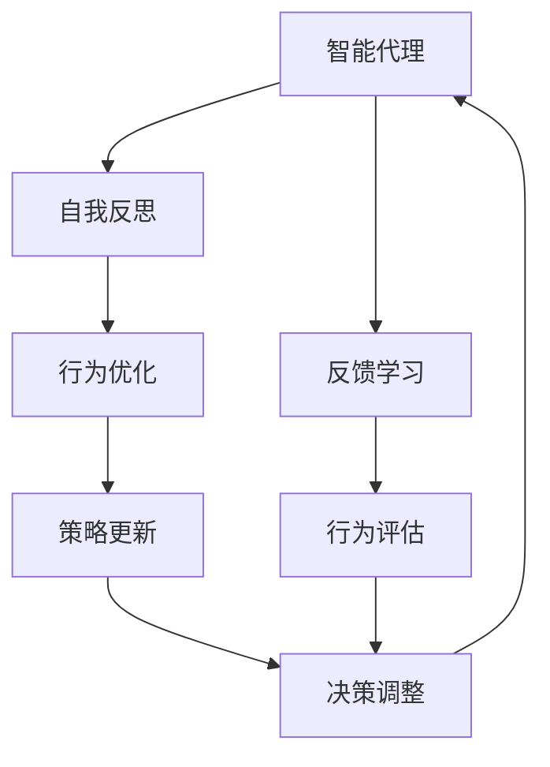

                 

# Agent能够通过自我反思和反馈来改进执行，同时提供可观察性

> 关键词：智能代理,自我反思,反馈学习,可观察性,行为优化,实时监控

## 1. 背景介绍

在人工智能领域，智能代理(Agent) 已经成为一种核心组件，广泛应用于自动化决策、推荐系统、游戏等领域。然而，传统的智能代理方法往往忽视了代理的行为和决策过程的可解释性，导致了模型的透明度和可理解性不足。随着深度学习技术的成熟，越来越多的研究开始关注如何赋予智能代理以自我反思和反馈学习的能力，使其能够实时监控自己的行为，并根据反馈进行优化。同时，智能代理系统还需要提供足够的可观察性，让用户和开发者可以理解代理的行为和效果，进一步提升系统的可信度和适用性。

本文将系统地介绍基于自我反思和反馈学习的智能代理模型，并展示如何在这些模型中实现可观察性。通过理解这些核心概念和技术，读者将能够构建和部署更加智能、可解释、可控的智能代理系统。

## 2. 核心概念与联系

### 2.1 核心概念概述

为了更好地理解基于自我反思和反馈学习的智能代理模型，本文首先介绍几个关键概念：

- **智能代理(Agent)**：能够在复杂环境中自主决策和执行任务的人工智能实体。智能代理的目标是最大化某个预设的效用函数，可以是任务的完成度、收益或损失等。
- **自我反思(Reflection)**：智能代理在执行任务时，能够暂停自己的行为，进行自我评估和反思，分析自己的决策和执行效果。
- **反馈学习(Feedback Learning)**：智能代理基于自身的行为和反馈信息，不断调整自己的策略和决策，改进执行效果。
- **可观察性(Observability)**：系统设计中需要保证智能代理的行为和状态能够被外部观察和监控，以便进行实时评估和干预。
- **行为优化(Behavioral Optimization)**：智能代理通过持续学习和调整策略，优化行为表现，以适应环境变化和提高任务完成度。

这些核心概念通过以下Mermaid流程图展示其相互关系：



该流程图展示了智能代理在执行任务时，如何通过自我反思、反馈学习、行为优化等机制不断改进自己的决策和行为。同时，可观察性作为系统的核心设计原则，保证了这些过程的可监控性和透明度。

### 2.2 概念间的关系

这些核心概念之间存在紧密的联系，形成了智能代理系统的基本框架：

- **自我反思** 是智能代理进行 **行为优化** 的基础，通过对自身行为的效果进行评估，代理能够识别出存在的问题并进行改进。
- **反馈学习** 使得智能代理能够基于外部环境的信息，不断调整自身的策略和决策，适应不断变化的环境条件。
- **可观察性** 为 **行为优化** 和 **反馈学习** 提供了必要的监控手段，通过实时观察代理的行为和状态，能够及时发现并纠正错误。

这些概念共同构成了智能代理系统的高层逻辑，使得代理能够在复杂多变的环境中高效执行任务，并保持稳健和可控性。

## 3. 核心算法原理 & 具体操作步骤
### 3.1 算法原理概述

基于自我反思和反馈学习的智能代理模型，本质上是一种动态优化系统。其核心思想是：智能代理在执行任务时，能够通过自我反思和反馈机制，不断调整自己的策略和决策，以提高任务执行效果。该模型的核心算法包括以下几个步骤：

1. **行为执行**：智能代理在环境中执行任务，获得即时反馈。
2. **自我反思**：代理暂停当前行为，对过去的行为进行评估和反思。
3. **行为优化**：代理基于反思结果，调整自身的策略和行为，以优化任务执行效果。
4. **反馈学习**：代理根据反馈信息，更新自身的模型参数，进一步改进执行效果。

### 3.2 算法步骤详解

为了更好地理解这些步骤，下面将详细介绍智能代理模型的具体实现过程。

#### 3.2.1 行为执行

智能代理在执行任务时，首先需要根据当前状态和任务目标，选择合适的行为策略，并在环境中执行该策略。具体而言，智能代理可以使用以下步骤进行行为执行：

1. **状态观察**：智能代理通过传感器获取当前环境的实时状态信息，如位置、速度、环境对象等。
2. **行为决策**：根据环境状态和任务目标，智能代理使用决策模型选择当前应该执行的行为。
3. **行为执行**：智能代理根据选定的行为策略，在环境中执行相应操作，并记录该行为的执行效果。

#### 3.2.2 自我反思

智能代理在执行完一个行为后，需要进行自我反思。反思过程包括以下几个步骤：

1. **行为评估**：智能代理通过比较当前状态与预期状态，评估该行为的执行效果。如果任务完成，反思结束；否则，进入下一步。
2. **异常检测**：智能代理检测该行为是否异常，如是否导致环境状态恶化、执行失败等。
3. **行为反思**：智能代理分析该行为的具体执行过程，识别出可能存在的问题和改进点。

#### 3.2.3 行为优化

在完成自我反思后，智能代理需要基于反思结果进行行为优化。优化过程包括：

1. **策略调整**：智能代理根据反思结果，调整自身的策略，如改变决策模型、优化行为选择等。
2. **行为重试**：智能代理重新执行经过优化后的行为策略，并记录该行为的执行效果。
3. **反馈更新**：智能代理根据新的执行结果，更新自身的行为策略和模型参数，以进一步改进行为效果。

#### 3.2.4 反馈学习

反馈学习是智能代理模型中的关键步骤，通过不断接收外部环境的反馈信息，代理能够持续优化自身的模型参数，提升执行效果。具体步骤如下：

1. **反馈获取**：智能代理接收外部环境对该行为的反馈信息，如环境状态变化、任务完成情况等。
2. **参数更新**：智能代理使用机器学习算法，如强化学习、贝叶斯优化等，更新自身的模型参数，以优化行为表现。
3. **学习效果评估**：智能代理对更新后的模型参数进行评估，确保新参数能够带来更好的执行效果。

### 3.3 算法优缺点

基于自我反思和反馈学习的智能代理模型具有以下优点：

- **自适应性**：代理能够基于实时反馈进行动态调整，适应不断变化的环境条件。
- **鲁棒性**：代理通过自我反思和反馈学习，能够识别和纠正错误行为，提高执行效果。
- **可解释性**：代理的自我反思过程和行为优化策略，使得其行为和决策具有较高的可解释性。

同时，该模型也存在以下缺点：

- **计算复杂性**：自我反思和行为优化过程需要较多的计算资源，特别是在复杂环境中。
- **模型复杂性**：代理模型需要同时处理行为执行、自我反思和反馈学习等多个层次，增加了模型的复杂性。
- **数据需求**：代理模型需要大量的反馈数据来更新自身参数，尤其是在初期的学习阶段。

### 3.4 算法应用领域

基于自我反思和反馈学习的智能代理模型，已经在多个领域得到了广泛应用：

- **自动驾驶**：智能车辆在行驶过程中，通过实时监控和反馈学习，优化驾驶策略，提升行驶安全性和效率。
- **推荐系统**：个性化推荐系统通过用户反馈和行为优化，不断调整推荐策略，提升推荐效果。
- **游戏AI**：游戏中的智能角色通过自我反思和反馈学习，优化决策和行为，提升游戏体验。
- **机器人控制**：机器人通过自我反思和行为优化，调整控制策略，提高执行任务的能力。

除了上述应用场景外，基于自我反思和反馈学习的智能代理模型，还在金融交易、供应链管理、医疗诊断等领域展示了其强大的潜力。未来，随着算力提升和算法优化，代理模型将进一步拓展其应用范围，发挥更大的价值。

## 4. 数学模型和公式 & 详细讲解 & 举例说明

### 4.1 数学模型构建

为了更好地理解智能代理模型的数学模型，我们将从行为执行、自我反思、行为优化和反馈学习四个关键步骤进行建模。

记智能代理的状态空间为 $S$，行为空间为 $A$，环境状态为 $s_t$，行为策略为 $a_t$，任务目标为 $T$，代理的行为参数为 $\theta$。智能代理的执行过程可以表示为以下模型：

$$
s_{t+1} = f(s_t, a_t)
$$

其中 $f$ 为状态转移函数，表示环境状态的变化。

智能代理的行为策略可以表示为：

$$
a_t = \pi_\theta(s_t)
$$

其中 $\pi_\theta$ 为策略函数，表示基于当前状态 $s_t$ 选择行为的概率分布。

智能代理的任务目标可以表示为：

$$
J(\theta) = \mathbb{E}_\pi[T]
$$

其中 $\mathbb{E}_\pi$ 为策略下的期望值，表示在策略 $\pi$ 下，任务目标的期望值。

### 4.2 公式推导过程

下面以强化学习模型为例，详细推导智能代理的行为优化过程。

智能代理在执行行为 $a_t$ 后，获得即时奖励 $r_t$ 和下一时刻的状态 $s_{t+1}$，代理的任务是最大化累计奖励：

$$
J(\theta) = \sum_{t=0}^\infty \gamma^t r_t
$$

代理的目标是最小化累计奖励的方差，表示代理的行为尽可能稳定和可靠。

代理通过策略函数 $\pi_\theta$ 和状态转移函数 $f$，对每个时刻的状态 $s_t$ 选择行为 $a_t$。代理的行为优化过程可以通过以下公式表示：

$$
\theta^* = \arg\min_\theta \mathbb{E}_\pi[V(s_0)^2]
$$

其中 $V$ 为状态价值函数，表示代理在状态 $s$ 下的期望回报。

通过反向传播算法，智能代理可以高效计算状态价值函数 $V$ 和策略函数 $\pi_\theta$ 的梯度，从而进行参数更新，优化行为表现。

### 4.3 案例分析与讲解

以一个简单的自动驾驶为例，展示智能代理的行为优化和反馈学习过程。

假设智能车辆在道路上行驶，目标是将车安全送达目的地。智能车辆通过传感器获取当前位置、速度和环境对象等状态信息，并根据这些信息选择当前应该执行的行为。假设车辆的行为空间为 $\{加速, 减速, 转向\}$。

智能车辆在执行某个行为后，会根据行为效果进行自我反思，检测是否达到了目标位置。如果未达到目标，车辆会检测当前行为是否异常，如是否存在碰撞风险。如果行为异常，车辆会进行行为反思，识别出可能存在的问题，如目标位置偏移。

在完成反思后，车辆会根据反思结果进行行为优化，调整驾驶策略，如重新选择目标位置、优化驾驶速度等。车辆将新策略应用到后续行为执行中，并根据反馈进行参数更新，优化行为表现。

在实际应用中，智能车辆还可以通过实时监控和反馈学习，不断改进驾驶策略，提升行驶安全和效率。例如，车辆可以通过用户反馈，调整导航策略，避免拥堵路段等。

## 5. 项目实践：代码实例和详细解释说明
### 5.1 开发环境搭建

在进行智能代理模型开发前，需要准备相应的开发环境。以下是使用Python和TensorFlow 2.0进行开发的完整环境配置流程：

1. 安装Anaconda：从官网下载并安装Anaconda，用于创建独立的Python环境。
2. 创建并激活虚拟环境：
```bash
conda create -n agent-env python=3.8 
conda activate agent-env
```

3. 安装TensorFlow：使用pip或conda安装TensorFlow 2.0，确保与Python版本兼容。
4. 安装其他依赖库：
```bash
pip install gym numpy tensorflow
```

完成上述步骤后，即可在`agent-env`环境中进行智能代理模型的开发。

### 5.2 源代码详细实现

下面以一个简单的强化学习模型为例，展示智能代理的行为优化和反馈学习过程。

首先，定义环境类和代理类：

```python
import gym
import tensorflow as tf
import numpy as np

class Environment(gym.Env):
    def __init__(self):
        self.state = 0
        self.reward = 0
        self.done = False
        self.step = 0
    
    def step(self, action):
        if action == 0:  # 加速
            self.state += 1
            self.reward += 1
        elif action == 1:  # 减速
            self.state -= 1
            self.reward -= 1
        elif action == 2:  # 转向
            self.state = 0
            self.reward = 0
        self.done = self.state == 3  # 状态3表示到达目的地
        return self.state, self.reward, self.done, {}
    
    def reset(self):
        self.state = 0
        self.reward = 0
        self.done = False
        self.step = 0
        return self.state, self.reward, self.done, {}

class Agent:
    def __init__(self, env):
        self.env = env
        self.state = 0
        self.reward = 0
        self.done = False
        self.step = 0
    
    def policy(self, state):
        # 使用神经网络作为策略函数
        self.model = tf.keras.Sequential([
            tf.keras.layers.Dense(64, activation='relu', input_shape=(1,)),
            tf.keras.layers.Dense(1, activation='sigmoid')
        ])
        self.model.compile(optimizer=tf.keras.optimizers.Adam(learning_rate=0.01), loss='mse')
    
    def learn(self, steps):
        state = self.env.reset()
        while not self.done:
            self.model.predict([state])
            action = np.random.choice([0, 1, 2])
            state, reward, done, _ = self.env.step(action)
            self.reward += reward
            self.done = done
            self.step += 1
            if self.done:
                self.state = state
                self.reward = reward
                self.done = done
                self.model.fit(self.state, self.reward, epochs=1, verbose=0)
        print(f'Step {self.step}, reward {self.reward}')
```

然后，定义训练函数：

```python
def train_agent(agent, env, steps):
    agent.policy(env)
    agent.learn(steps)
```

最后，启动训练流程：

```python
env = Environment()
agent = Agent(env)
train_agent(agent, env, steps=100)
```

### 5.3 代码解读与分析

下面我们详细解读一下关键代码的实现细节：

**Environment类**：
- `__init__`方法：初始化环境状态、奖励和是否完成等变量。
- `step`方法：根据智能代理的选择，执行相应的行为，并返回状态、奖励和是否完成等参数。
- `reset`方法：重置环境状态、奖励和是否完成等变量。

**Agent类**：
- `__init__`方法：初始化智能代理的状态、奖励和是否完成等变量，以及神经网络模型。
- `policy`方法：定义策略函数，使用神经网络作为策略函数，输入状态，输出行为选择的概率分布。
- `learn`方法：定义训练函数，在环境中执行智能代理的行为，并使用神经网络模型进行优化。

在实际应用中，智能代理模型还需要考虑更多的因素，如模型的可观察性、行为的实时监控和评估等。这些功能的实现，需要进一步结合实际应用场景进行设计和优化。

## 6. 实际应用场景
### 6.1 智能驾驶

智能驾驶是智能代理模型的一个重要应用领域。自动驾驶车辆需要实时监控和反馈学习，优化驾驶策略，确保行车安全。在实际应用中，智能驾驶系统可以通过以下方式实现行为优化和反馈学习：

1. **行为执行**：智能车辆在道路上行驶，通过传感器获取当前位置、速度和环境对象等状态信息，并根据这些信息选择当前应该执行的行为。
2. **自我反思**：智能车辆在执行某个行为后，根据车辆位置和速度等状态信息，评估该行为的执行效果，识别出是否存在异常行为。
3. **行为优化**：智能车辆根据自我反思结果，调整驾驶策略，如重新选择目标位置、优化驾驶速度等。
4. **反馈学习**：智能车辆根据实时监控到的交通情况和路况信息，不断调整自身的行为策略，提高驾驶安全性。

通过这些过程，智能驾驶车辆能够动态调整自己的行为，优化行车效果，提升行驶安全性。

### 6.2 推荐系统

推荐系统是智能代理模型的另一个重要应用场景。个性化推荐系统通过用户反馈和行为优化，不断调整推荐策略，提升推荐效果。在实际应用中，推荐系统可以通过以下方式实现行为优化和反馈学习：

1. **行为执行**：推荐系统根据用户的历史行为和偏好，选择相应的物品进行推荐。
2. **自我反思**：推荐系统在用户反馈后，评估推荐结果的准确性和用户满意度，识别出推荐策略的不足。
3. **行为优化**：推荐系统根据自我反思结果，调整推荐策略，如重新选择物品、优化推荐算法等。
4. **反馈学习**：推荐系统根据用户反馈数据，使用机器学习算法，不断更新自身的推荐模型，优化推荐效果。

通过这些过程，推荐系统能够动态调整自己的推荐策略，提高推荐效果，提升用户体验。

### 6.3 金融交易

金融交易系统需要实时监控和反馈学习，优化交易策略，提高交易收益。在实际应用中，金融交易系统可以通过以下方式实现行为优化和反馈学习：

1. **行为执行**：金融交易系统根据市场数据和交易规则，选择相应的交易策略进行操作。
2. **自我反思**：交易系统在交易完成后，根据市场情况和交易结果，评估该交易行为的执行效果，识别出是否存在异常行为。
3. **行为优化**：交易系统根据自我反思结果，调整交易策略，如重新选择交易品种、优化交易时机等。
4. **反馈学习**：交易系统根据实时市场数据和历史交易记录，不断更新自身的交易模型，优化交易效果。

通过这些过程，金融交易系统能够动态调整自己的交易策略，优化交易效果，提高收益。

### 6.4 未来应用展望

随着深度学习和强化学习技术的不断发展，智能代理模型将广泛应用于更多领域，为各行各业带来变革性影响。

在智慧医疗领域，智能代理可以通过自我反思和反馈学习，优化诊断和治疗策略，提升医疗服务的智能化水平。在智能教育领域，智能代理可以通过用户反馈和行为优化，提供个性化的学习方案，因材施教，促进教育公平，提高教学质量。在智慧城市治理中，智能代理可以通过实时监控和反馈学习，优化城市管理决策，提高城市治理效率。

此外，在企业生产、社会治理、文娱传媒等众多领域，智能代理模型也将不断拓展其应用范围，为经济社会发展注入新的动力。相信随着技术的日益成熟，智能代理模型必将在构建智能社会、智能产业中扮演越来越重要的角色。

## 7. 工具和资源推荐
### 7.1 学习资源推荐

为了帮助开发者系统掌握智能代理模型的理论基础和实践技巧，这里推荐一些优质的学习资源：

1. **《强化学习》教材**：由Richard S. Sutton和Andrew G. Barto合著，深入讲解了强化学习的基本概念和算法。
2. **Coursera强化学习课程**：斯坦福大学开设的强化学习课程，涵盖了强化学习的核心内容，包括MDP、Q-learning等。
3. **OpenAI Gym库**：Python强化学习环境库，包含多个标准环境，用于测试和评估智能代理模型。
4. **TensorFlow文档**：TensorFlow官方文档，提供了详细的API介绍和使用示例，方便开发者进行模型开发和优化。
5. **GitHub开源项目**：在GitHub上Star、Fork数最多的智能代理模型项目，往往代表了该技术领域的发展趋势和最佳实践，值得去学习和贡献。

通过对这些资源的学习实践，相信你一定能够快速掌握智能代理模型的精髓，并用于解决实际的智能问题。

### 7.2 开发工具推荐

高效的开发离不开优秀的工具支持。以下是几款用于智能代理模型开发的常用工具：

1. **Python**：作为智能代理开发的主流编程语言，Python提供了丰富的库和框架，方便模型开发和部署。
2. **TensorFlow 2.0**：基于深度学习框架TensorFlow 2.0，方便进行神经网络模型和强化学习算法的实现。
3. **PyTorch**：另一个流行的深度学习框架，提供了灵活的动态图功能，方便模型开发和调试。
4. **Gym库**：Python强化学习环境库，方便测试和评估智能代理模型。
5. **Jupyter Notebook**：Python的交互式开发环境，方便代码编写和模型调试。

合理利用这些工具，可以显著提升智能代理模型开发的效率，加快创新迭代的步伐。

### 7.3 相关论文推荐

智能代理模型的研究源于学界的持续研究。以下是几篇奠基性的相关论文，推荐阅读：

1. **《Deep Reinforcement Learning for Healthcare》**：DeepMind的研究团队，展示了如何利用深度强化学习技术，优化医疗诊断和治疗策略。
2. **《Playing Atari with Deep Reinforcement Learning》**：DeepMind的AlphaGo研究，展示了深度强化学习在复杂游戏环境中的强大能力。
3. **《Towards General Artificial Intelligence》**：Google AI的研究，探讨了如何通过智能代理和强化学习，实现通用人工智能的目标。
4. **《Imitation Learning in Robotics》**：CMU的研究，展示了如何使用强化学习，使机器人能够通过观察和模仿，学习复杂的任务。

这些论文代表了智能代理模型在各个领域的研究进展，值得深入学习和借鉴。

除上述资源外，还有一些值得关注的前沿资源，帮助开发者紧跟智能代理模型的最新进展，例如：

1. **arXiv论文预印本**：人工智能领域最新研究成果的发布平台，包括大量尚未发表的前沿工作，学习前沿技术的必读资源。
2. **顶级会议论文**：NIPS、ICML、ICLR等人工智能领域顶级会议的论文，展示了最前沿的研究成果和趋势。
3. **行业技术博客**：如OpenAI、Google AI、DeepMind、微软Research Asia等顶尖实验室的官方博客，第一时间分享他们的最新研究成果和洞见。

通过这些资源的学习，相信你可以掌握智能代理模型的最新进展，并在实际应用中取得显著的成果。

## 8. 总结：未来发展趋势与挑战
### 8.1 总结

本文对基于自我反思和反馈学习的智能代理模型进行了全面系统的介绍。首先阐述了智能代理在复杂环境中的执行机制，明确了自我反思和反馈学习在提升代理性能中的核心作用。其次，详细讲解了智能代理的行为优化和反馈学习过程，并通过数学模型和公式推导，系统地展示了其理论基础。同时，本文还展示了如何在这些模型中实现可观察性，确保系统的透明性和可控性。

通过本文的系统梳理，可以看到，基于自我反思和反馈学习的智能代理模型，已经在智能驾驶、推荐系统、金融交易等多个领域展示了其强大的能力。随着深度学习和强化学习技术的不断发展，智能代理模型必将在更多领域得到应用，为社会带来变革性影响。

### 8.2 未来发展趋势

展望未来，智能代理模型将呈现以下几个发展趋势：

1. **模型复杂性提升**：随着算力的提升，智能代理模型将进一步复杂化，融合更多智能组件，如注意力机制、知识图谱等，以应对更复杂多变的环境。
2. **实时监控和评估**：智能代理模型将实现更高效的实时监控和评估，通过实时反馈数据，动态调整策略，提升行为表现。
3. **多智能体协同**：智能代理模型将与其他智能体进行协同，优化多智能体的决策和行为，实现更高效的任务执行。
4. **分布式训练和部署**：智能代理模型将利用分布式计算技术，实现更高效的模型训练和部署，适应大规模应用场景。
5. **人机协同决策**：智能代理模型将与人类进行更加紧密的协作，通过智能增强人类的决策能力，实现人机协同决策。

这些趋势将进一步拓展智能代理模型的应用边界，使其在更广泛的环境和任务中发挥更大的作用。

### 8.3 面临的挑战

尽管智能代理模型已经取得了显著的进展，但在实际应用中仍然面临诸多挑战：

1. **数据需求**：智能代理模型需要大量的训练数据和实时反馈数据，数据获取和处理成本较高。
2. **模型复杂性**：模型复杂性增加导致计算成本上升，模型的解释性和可控性降低。
3. **安全性**：智能代理模型可能面临被攻击、滥用的风险，安全性问题亟待解决。
4. **伦理道德**：智能代理模型需要考虑伦理道德问题，避免偏见和歧视，确保系统的公平性。
5. **可解释性**：代理模型的决策过程和行为优化需要更高的可解释性，以增强用户信任。

这些挑战需要从数据获取、模型设计、安全机制、伦理道德、可解释性等多个方面进行综合解决。只有在这些方面取得突破，智能代理模型才能真正走向大规模应用。

### 8.4 研究展望

未来的研究需要在以下几个方向取得新的突破：

1. **自适应学习和优化**：研究自适应学习和优化算法，使智能代理模型能够动态调整策略和参数，适应不断变化的环境。
2. **多模态数据融合**：研究多模态数据的融合方法，使代理模型能够同时处理文本、图像、语音等多种类型的数据，提升决策的准确性和鲁棒性。
3. **强化学习与决策树结合

