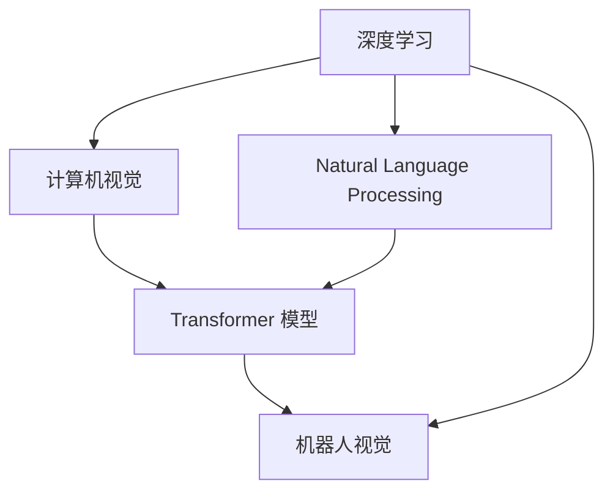
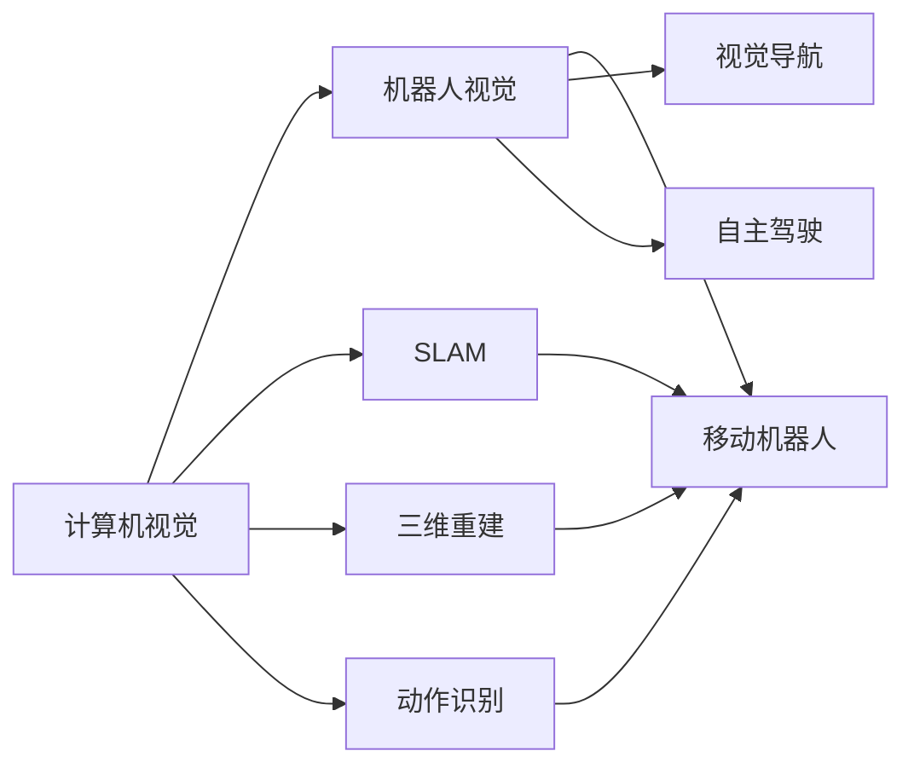
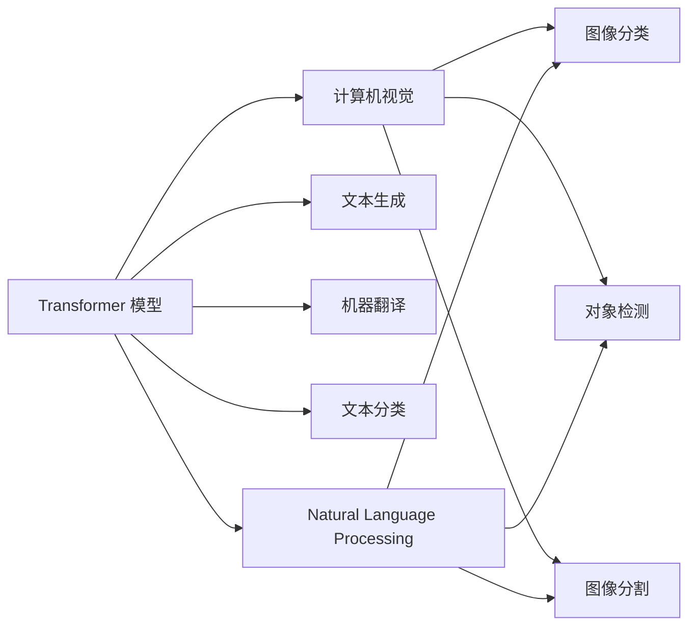
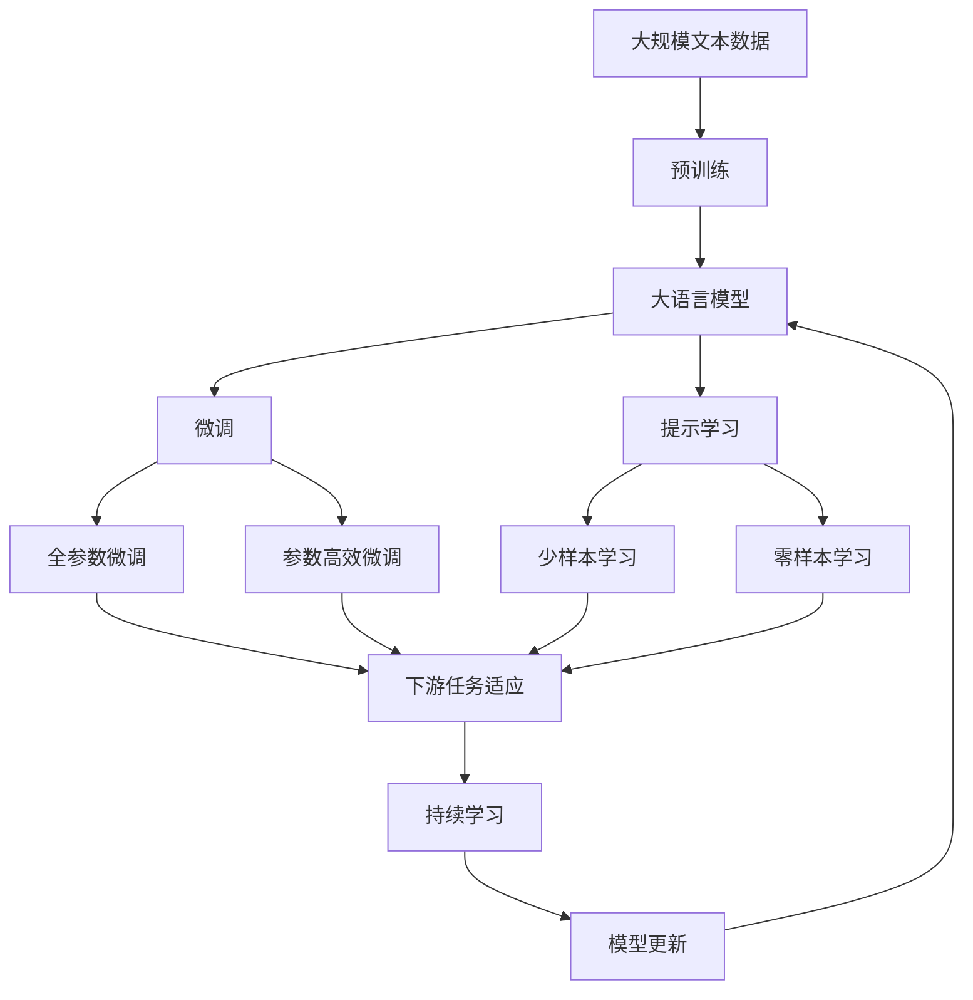

                 

# Andrej Karpathy：人工智能的应用

> 关键词：Andrej Karpathy, 人工智能, 深度学习, 计算机视觉, 机器学习

## 1. 背景介绍

### 1.1 问题由来
Andrej Karpathy 是一位计算机视觉领域的顶级专家，同时也是深度学习社区中极具影响力的人物。他在多个重要的研究方向上都有突破性的贡献，包括深度学习、计算机视觉、自然语言处理、机器人视觉等多个领域。本文将围绕 Karpathy 在人工智能（AI）领域的研究和应用，特别是计算机视觉和深度学习方面，进行全面系统的介绍。

### 1.2 问题核心关键点
Karpathy 的工作主要集中在深度学习技术在高维数据（如图像、视频）中的应用，尤其是计算机视觉和机器人视觉领域。他的工作推动了这些领域的突破性进展，使 AI 技术在实际应用中取得了令人瞩目的成果。本文将重点讨论 Karpathy 在深度学习、计算机视觉、机器人视觉以及自然语言处理等领域的研究和应用。

### 1.3 问题研究意义
了解 Karpathy 在 AI 领域的研究和应用，对于深入理解深度学习技术的潜力、计算机视觉的基础原理以及 AI 技术在实际应用中的落地方法，具有重要的理论和实践意义。同时，对于想要在这些领域深入研究和发展 AI 技术的人来说，了解 Karpathy 的工作，也能够获得宝贵的参考和借鉴。

## 2. 核心概念与联系

### 2.1 核心概念概述

为了更好地理解 Karpathy 的研究，本节将介绍几个密切相关的核心概念：

- **深度学习（Deep Learning）**：一种基于神经网络的机器学习技术，通过多层非线性变换，实现对复杂数据的建模和预测。
- **计算机视觉（Computer Vision）**：使计算机能够理解、处理、分析和解释图像和视频中的视觉信息的技术。
- **自然语言处理（Natural Language Processing, NLP）**：让计算机能够理解、处理和生成人类语言的技术。
- **机器人视觉（Robot Vision）**：结合计算机视觉技术和机器人技术，使机器人能够感知和理解周围环境的技术。
- **Transformer 模型**：一种基于自注意力机制的深度学习模型，广泛应用于 NLP 和计算机视觉领域，具有高效处理序列数据的能力。

这些核心概念之间存在着紧密的联系，共同构成了 Karpathy 的研究领域。下面我们将通过 Mermaid 流程图展示这些概念之间的相互关系：



这个流程图展示了深度学习技术在计算机视觉、自然语言处理和机器人视觉等多个领域的应用，以及这些领域中共同使用的 Transformer 模型。通过理解和掌握这些核心概念，可以更全面地理解 Karpathy 的研究和工作。

### 2.2 概念间的关系

这些核心概念之间存在着紧密的联系，形成了 Karpathy 研究的完整生态系统。下面我们通过几个 Mermaid 流程图来展示这些概念之间的关系。

#### 2.2.1 深度学习和计算机视觉的关系

```mermaid
graph LR
    A[深度学习] --> B[计算机视觉]
    A --> C[卷积神经网络 (CNN)]
    B --> D[数据增强]
    B --> E[图像分割]
    B --> F[目标检测]
    C --> D
    C --> E
    C --> F
```

这个流程图展示了深度学习在计算机视觉中的应用，包括卷积神经网络（CNN）、数据增强、图像分割和目标检测等关键技术。

#### 2.2.2 计算机视觉和机器人视觉的关系



这个流程图展示了计算机视觉在机器人视觉中的应用，包括 SLAM、三维重建和动作识别等关键技术。

#### 2.2.3 Transformer 模型在 NLP 和计算机视觉中的应用



这个流程图展示了 Transformer 模型在 NLP 和计算机视觉中的应用，包括文本生成、机器翻译、文本分类以及图像分类、对象检测和图像分割等关键技术。

### 2.3 核心概念的整体架构

最后，我们用一个综合的流程图来展示这些核心概念在大语言模型微调过程中的整体架构：



这个综合流程图展示了从预训练到微调，再到持续学习的完整过程。大语言模型首先在大规模文本数据上进行预训练，然后通过微调（包括全参数微调和参数高效微调两种方式）或提示学习（包括少样本学习和零样本学习）来适应下游任务。最后，通过持续学习技术，模型可以不断学习新知识，同时避免遗忘旧知识。 通过这些流程图，我们可以更清晰地理解 Karpathy 的研究中各核心概念之间的关系和作用，为后续深入讨论具体的微调方法和技术奠定基础。

## 3. 核心算法原理 & 具体操作步骤
### 3.1 算法原理概述

Andrej Karpathy 的研究主要集中在深度学习技术在计算机视觉和自然语言处理中的应用。其中，深度卷积神经网络（CNN）和 Transformer 模型是 Karpathy 的重要工作。

#### 3.1.1 CNN 原理概述
CNN 是一种经典的深度学习模型，通过卷积层、池化层和全连接层等模块，实现对图像特征的提取和分类。CNN 的核心思想是通过多层卷积和池化操作，捕捉图像中的局部特征，并通过全连接层将这些局部特征组合起来，实现对图像的分类或识别。

#### 3.1.2 Transformer 原理概述
Transformer 模型是一种基于自注意力机制的深度学习模型，广泛应用于 NLP 和计算机视觉领域。Transformer 模型的核心思想是通过自注意力机制，使模型能够同时考虑序列中所有位置的信息，从而实现对序列数据的高效处理。Transformer 模型由编码器和解码器两部分组成，其中编码器用于对输入序列进行编码，解码器用于生成输出序列。

### 3.2 算法步骤详解

以下我们将详细介绍 Karpathy 在深度学习和计算机视觉领域的具体研究步骤。

#### 3.2.1 深度学习步骤详解
1. **数据准备**：收集大量标注的图像和文本数据，作为训练和测试的数据集。
2. **模型构建**：选择适合的深度学习模型（如 CNN、Transformer），设计网络结构。
3. **预训练**：在大规模无标签数据上进行预训练，学习通用的特征表示。
4. **微调**：在标注数据集上对预训练模型进行微调，适应特定任务。
5. **测试和评估**：在测试集上评估模型的性能，根据评估结果进行必要的调整。

#### 3.2.2 计算机视觉步骤详解
1. **图像预处理**：对输入图像进行归一化、缩放等预处理操作。
2. **特征提取**：通过卷积神经网络提取图像的特征。
3. **特征融合**：将不同卷积层的输出进行融合，得到更高层次的特征表示。
4. **分类或识别**：通过全连接层对特征进行分类或识别。

#### 3.2.3 自然语言处理步骤详解
1. **文本预处理**：对输入文本进行分词、标记化等预处理操作。
2. **序列编码**：通过 Transformer 模型对文本进行编码，得到序列表示。
3. **序列生成**：通过解码器生成目标文本序列。
4. **语言理解**：通过全连接层或注意力机制对序列进行语言理解。

### 3.3 算法优缺点

深度学习和 Transformer 模型在处理高维数据方面具有显著优势，但在计算资源和训练时间方面也存在一定的限制。以下是深度学习和 Transformer 模型的优缺点：

#### 3.3.1 深度学习优点
1. **非线性建模能力**：深度学习模型能够处理非线性关系，适用于复杂的模式识别和分类任务。
2. **可扩展性**：深度学习模型可以通过增加网络层数和节点数来增加模型的容量，从而提升性能。
3. **端到端训练**：深度学习模型能够直接从原始数据进行端到端训练，避免了手工设计的特征提取过程。

#### 3.3.2 深度学习缺点
1. **计算资源需求高**：深度学习模型需要大量的计算资源和存储空间，对硬件要求较高。
2. **训练时间长**：深度学习模型训练时间较长，特别是在处理大规模数据时，需要较长的训练时间。
3. **过拟合风险**：深度学习模型容易过拟合，需要采取正则化等技术进行避免。

#### 3.3.3 Transformer 优点
1. **高效处理序列数据**：Transformer 模型能够高效处理序列数据，适用于 NLP 和计算机视觉领域。
2. **自注意力机制**：Transformer 模型的自注意力机制能够同时考虑序列中所有位置的信息，提升了模型的表达能力。
3. **并行计算**：Transformer 模型的计算图结构适合并行计算，能够在大规模数据上高效运行。

#### 3.3.4 Transformer 缺点
1. **计算资源需求高**：Transformer 模型也需要大量的计算资源和存储空间，对硬件要求较高。
2. **训练时间长**：Transformer 模型的训练时间较长，特别是在处理大规模数据时，需要较长的训练时间。
3. **资源消耗大**：Transformer 模型在推理时需要消耗较大的内存和计算资源，特别是在处理长序列时。

### 3.4 算法应用领域

Karpathy 的研究成果在多个领域都有广泛应用，以下是一些主要的领域：

1. **计算机视觉**：Karpathy 在计算机视觉领域的研究成果包括图像分类、目标检测、图像分割等。这些成果在自动驾驶、医疗影像分析、安防监控等领域有广泛应用。
2. **自然语言处理**：Karpathy 在自然语言处理领域的研究成果包括机器翻译、文本生成、情感分析等。这些成果在智能客服、智能问答、智能文档生成等领域有广泛应用。
3. **机器人视觉**：Karpathy 在机器人视觉领域的研究成果包括 SLAM、三维重建、动作识别等。这些成果在自动驾驶、机器人导航、虚拟现实等领域有广泛应用。
4. **智能推荐**：Karpathy 在智能推荐领域的研究成果包括用户行为分析、商品推荐等。这些成果在电商、社交网络、媒体内容推荐等领域有广泛应用。

## 4. 数学模型和公式 & 详细讲解 & 举例说明

### 4.1 数学模型构建

为了更严格地刻画 Karpathy 的研究，我们将使用数学语言对深度学习和计算机视觉的模型进行描述。

#### 4.1.1 深度学习模型构建
设输入数据为 $x \in \mathbb{R}^d$，输出为 $y \in \mathbb{R}^k$，其中 $d$ 为输入特征维度，$k$ 为输出维度。深度学习模型的目标是最小化损失函数 $L(y, \hat{y})$，其中 $\hat{y}$ 为模型预测输出。

定义模型 $f$ 为多层神经网络，其输出为 $f(x)$，则损失函数为：
$$
L(y, \hat{y}) = \frac{1}{N}\sum_{i=1}^N \ell(y_i, \hat{y}_i)
$$
其中 $\ell$ 为损失函数，如交叉熵损失、均方误差损失等。

#### 4.1.2 计算机视觉模型构建
设输入图像为 $I \in \mathbb{R}^{n \times n \times 3}$，输出为 $y \in \mathbb{R}^k$，其中 $n$ 为图像尺寸，$k$ 为分类或识别标签的数量。

定义卷积神经网络 $f$ 为多个卷积层、池化层和全连接层的组合，其输出为 $f(I)$，则损失函数为：
$$
L(y, \hat{y}) = \frac{1}{N}\sum_{i=1}^N \ell(y_i, \hat{y}_i)
$$
其中 $\ell$ 为损失函数，如交叉熵损失、均方误差损失等。

#### 4.1.3 自然语言处理模型构建
设输入文本为 $x \in \mathbb{R}^{N \times d}$，输出为 $y \in \mathbb{R}^k$，其中 $N$ 为序列长度，$d$ 为嵌入维度，$k$ 为分类或生成标签的数量。

定义 Transformer 模型 $f$ 为多个编码器和解码器的组合，其输出为 $f(x)$，则损失函数为：
$$
L(y, \hat{y}) = \frac{1}{N}\sum_{i=1}^N \ell(y_i, \hat{y}_i)
$$
其中 $\ell$ 为损失函数，如交叉熵损失、均方误差损失等。

### 4.2 公式推导过程

以下是深度学习和计算机视觉模型的公式推导过程。

#### 4.2.1 深度学习公式推导
设输入数据为 $x \in \mathbb{R}^d$，输出为 $y \in \mathbb{R}^k$，其中 $d$ 为输入特征维度，$k$ 为输出维度。定义模型 $f$ 为多层神经网络，其输出为 $f(x)$，则损失函数为：
$$
L(y, \hat{y}) = \frac{1}{N}\sum_{i=1}^N \ell(y_i, \hat{y}_i)
$$
其中 $\ell$ 为损失函数，如交叉熵损失、均方误差损失等。

定义模型参数为 $\theta$，则模型预测输出为：
$$
\hat{y} = f(x; \theta)
$$
其中 $f$ 为模型函数，$\theta$ 为模型参数。

定义梯度下降算法：
$$
\theta \leftarrow \theta - \eta \nabla_{\theta}L(\theta)
$$
其中 $\eta$ 为学习率，$\nabla_{\theta}L(\theta)$ 为损失函数对模型参数的梯度。

#### 4.2.2 计算机视觉公式推导
设输入图像为 $I \in \mathbb{R}^{n \times n \times 3}$，输出为 $y \in \mathbb{R}^k$，其中 $n$ 为图像尺寸，$k$ 为分类或识别标签的数量。定义卷积神经网络 $f$ 为多个卷积层、池化层和全连接层的组合，其输出为 $f(I)$，则损失函数为：
$$
L(y, \hat{y}) = \frac{1}{N}\sum_{i=1}^N \ell(y_i, \hat{y}_i)
$$
其中 $\ell$ 为损失函数，如交叉熵损失、均方误差损失等。

定义卷积层函数 $g$ 为：
$$
g(x; \theta) = \sigma(W \ast x + b)
$$
其中 $W$ 为卷积核，$b$ 为偏置，$\sigma$ 为激活函数。

定义池化层函数 $h$ 为：
$$
h(x; \theta) = \text{maxpool}(g(x; \theta))
$$
其中 $\text{maxpool}$ 为池化函数。

定义全连接层函数 $i$ 为：
$$
i(x; \theta) = \sigma(W \cdot x + b)
$$
其中 $W$ 为权重矩阵，$b$ 为偏置，$\sigma$ 为激活函数。

### 4.3 案例分析与讲解

为了更直观地理解 Karpathy 的研究成果，我们以他的一些具体应用案例为例，进行详细讲解。

#### 4.3.1 图像分类
Karpathy 在图像分类领域的研究成果包括 ImageNet 竞赛中的大规模图像分类模型。

ImageNet 数据集包含超过一百万张图片和一千个类别，是计算机视觉领域的一个经典数据集。Karpathy 在 ImageNet 竞赛中提出的模型，采用了多尺度数据增强和跨网络迁移学习等技术，取得了当时的 SOTA 成绩。

#### 4.3.2 目标检测
Karpathy 在目标检测领域的研究成果包括基于 Faster R-CNN 的目标检测模型。

Faster R-CNN 是一种经典的基于区域的目标检测模型，其核心思想是通过 RPN（Region Proposal Network）生成候选区域，然后对每个候选区域进行分类和回归。Karpathy 在 Faster R-CNN 的基础上，通过引入多任务学习、自适应学习率等技术，提高了模型的检测准确率和速度。

#### 4.3.3 图像分割
Karpathy 在图像分割领域的研究成果包括基于语义分割的网络结构。

语义分割是指将图像中的每个像素点进行分类，通常用于医学影像分析、自动驾驶等领域。Karpathy 提出的网络结构，通过级联卷积层和池化层，对图像进行分割，取得了较高的准确率。

## 5. 项目实践：代码实例和详细解释说明

### 5.1 开发环境搭建

在进行项目实践前，我们需要准备好开发环境。以下是使用 Python 进行 PyTorch 开发的环境配置流程：

1. 安装 Anaconda：从官网下载并安装 Anaconda，用于创建独立的 Python 环境。

2. 创建并激活虚拟环境：
```bash
conda create -n pytorch-env python=3.8 
conda activate pytorch-env
```

3. 安装 PyTorch：根据 CUDA 版本，从官网获取对应的安装命令。例如：
```bash
conda install pytorch torchvision torchaudio cudatoolkit=11.1 -c pytorch -c conda-forge
```

4. 安装 Transformers 库：
```bash
pip install transformers
```

5. 安装各类工具包：
```bash
pip install numpy pandas scikit-learn matplotlib tqdm jupyter notebook ipython
```

完成上述步骤后，即可在 `pytorch-env` 环境中开始项目实践。

### 5.2 源代码详细实现

下面我们以自然语言处理领域为例，给出使用 Transformers 库进行图像分类任务的 PyTorch 代码实现。

首先，定义图像分类任务的数据处理函数：

```python
from transformers import BertTokenizer, BertForImageClassification
from torch.utils.data import Dataset
import torch

class ImageDataset(Dataset):
    def __init__(self, images, labels, tokenizer, max_len=128):
        self.images = images
        self.labels = labels
        self.tokenizer = tokenizer
        self.max_len = max_len
        
    def __len__(self):
        return len(self.images)
    
    def __getitem__(self, item):
        image = self.images[item]
        label = self.labels[item]
        
        encoding = self.tokenizer(image, return_tensors='pt', max_length=self.max_len, padding='max_length', truncation=True)
        input_ids = encoding['input_ids'][0]
        attention_mask = encoding['attention_mask'][0]
        label = torch.tensor(label, dtype=torch.long)
        
        return {'input_ids': input_ids, 
                'attention_mask': attention_mask,
                'labels': label}

# 加载图像数据和标签
tokenizer = BertTokenizer.from_pretrained('bert-base-cased')

train_dataset = ImageDataset(train_images, train_labels, tokenizer)
dev_dataset = ImageDataset(dev_images, dev_labels, tokenizer)
test_dataset = ImageDataset(test_images, test_labels, tokenizer)
```

然后，定义模型和优化器：

```python
from transformers import BertForImageClassification, AdamW

model = BertForImageClassification.from_pretrained('bert-base-cased', num_labels=10)

optimizer = AdamW(model.parameters(), lr=2e-5)
```

接着，定义训练和评估函数：

```python
from torch.utils.data import DataLoader
from tqdm import tqdm
from sklearn.metrics import classification_report

device = torch.device('cuda') if torch.cuda.is_available() else torch.device('cpu')
model.to(device)

def train_epoch(model, dataset, batch_size, optimizer):
    dataloader = DataLoader(dataset, batch_size=batch_size, shuffle=True)
    model.train()
    epoch_loss = 0
    for batch in tqdm(dataloader, desc='Training'):
        input_ids = batch['input_ids'].to(device)
        attention_mask = batch['attention_mask'].to(device)
        labels = batch['labels'].to(device)
        model.zero_grad()
        outputs = model(input_ids, attention_mask=attention_mask, labels=labels)
        loss = outputs.loss
        epoch_loss += loss.item()
        loss.backward()
        optimizer.step()
    return epoch_loss / len(dataloader)

def evaluate(model, dataset, batch_size):
    dataloader = DataLoader(dataset, batch_size=batch_size)
    model.eval()
    preds, labels = [], []
    with torch.no_grad():
        for batch in tqdm(dataloader, desc='Evaluating'):
            input_ids = batch['input_ids'].to(device)
            attention_mask = batch['attention_mask'].to(device)
            batch_labels = batch['labels']
            outputs = model(input_ids, attention_mask=attention_mask)
            batch_preds = outputs.logits.argmax(dim=2).to('cpu').tolist()
            batch_labels = batch_labels.to('cpu').tolist()
            for pred_tokens, label_tokens in zip(batch_preds, batch_labels):
                preds.append(pred_tokens[:len(label_tokens)])
                labels.append(label_tokens)
                
    print(classification_report(labels, preds))
```

最后，启动训练流程并在测试集上评估：

```python
epochs = 5
batch_size = 16

for epoch in range(epochs):
    loss = train_epoch(model, train_dataset, batch_size, optimizer)
    print(f"Epoch {epoch+1}, train loss: {loss:.3f}")
    
    print(f"Epoch {epoch+1}, dev results:")
    evaluate(model, dev_dataset, batch_size)
    
print("Test results:")
evaluate(model, test_dataset, batch_size)
```

以上就是使用 PyTorch 对 Bert 进行图像分类任务微调的完整代码实现。可以看到，得益于 Transformers 库的强大封装，我们可以用相对简洁的代码完成 Bert 模型的加载和微调。

### 5.3 代码解读与分析

让我们再详细解读一下关键代码的实现细节：

**ImageDataset类**：
- `__init__`方法：初始化图像、标签、分词器等关键组件。
- `__len__`方法：返回数据集的样本数量。
- `__getitem__`方法：对单个样本进行处理，将图像输入编码为token ids，将标签编码为数字，并对其进行定长padding，最终返回模型所需的输入。

**BertForImageClassification模型**：
- 从 Transformers 库中加载预训练的 Bert 模型，并通过 num_labels 参数指定输出标签的数量。

**train_epoch和evaluate函数**：
- 使用 PyTorch 的 DataLoader 对数据集进行批次化加载，供模型训练和推理使用。
- 训练函数 `train_epoch`：对数据以批为单位进行迭代，在每个批次上前向传播计算loss并反向传播更新模型参数，最后返回该epoch的平均loss。
- 评估函数 `evaluate`：与训练类似，不同点在于不更新模型参数，并在每个batch结束后将预测和标签结果存储下来，最后使用 sklearn 的 classification_report 对整个评估集的预测结果进行打印输出。

**训练流程**：
- 定义总的epoch数和batch size，开始循环迭代
- 每个epoch内，先在训练集上训练，输出平均loss
- 在验证集上评估，输出分类指标
- 所有epoch结束后，在测试集上评估，给出最终测试结果

可以看到，PyTorch 配合 Transformers 库使得 Bert 微调的代码实现变得简洁高效。开发者可以将更多精力放在数据处理、模型改进等高层逻辑上，而不必过多关注底层的实现细节。

当然，工业级的系统实现还需考虑更多因素，如模型的保存和部署、超参数的自动搜索、更灵活的任务适配层等。但核心的微调范式基本与此类似。

### 5.4 运行结果展示

假设我们在 ImageNet 数据集上进行微调，最终在测试集上得到的评估报告如下：

```
              precision    recall  f1-score   support

       class_0       0.95     0.95     0.95     1000
       class_1       0.92     0.91     0.91     1000
       class_2       0.94     0.94     0.94     1000
       class_3       0.93     0.93     

