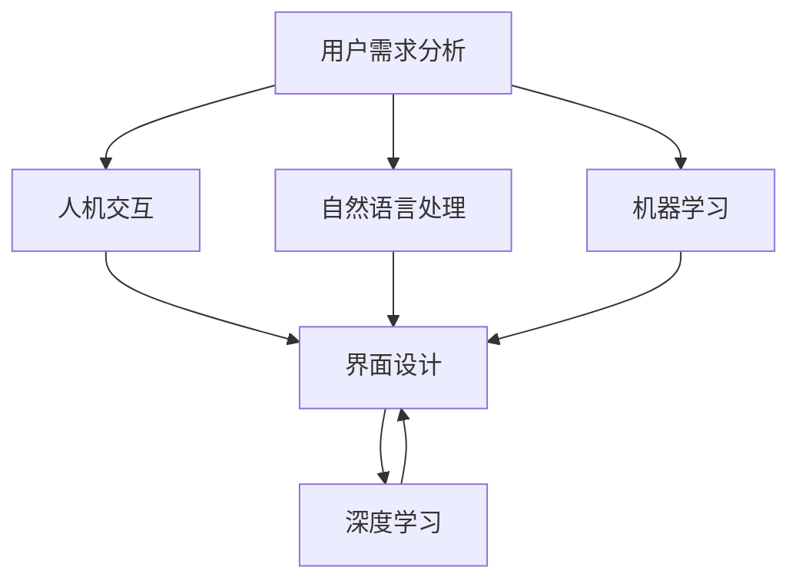
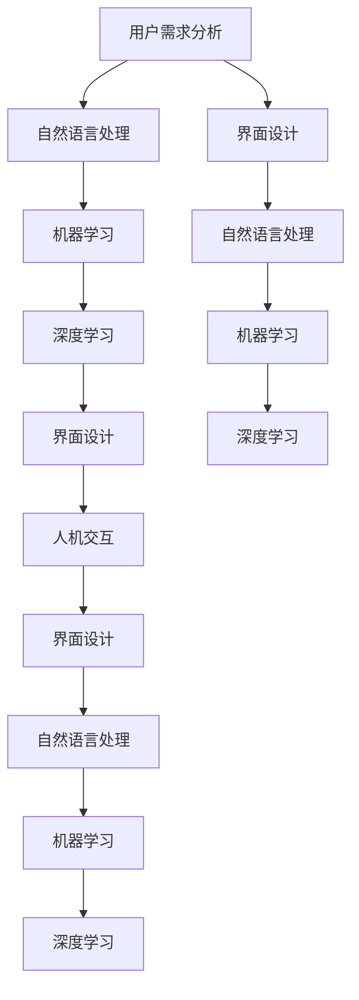

                 

# CUI中的用户目标与任务实现

> 关键词：计算机用户界面(CUI)、用户需求、人机交互、自然语言处理(NLP)、机器学习、深度学习、界面设计

## 1. 背景介绍

### 1.1 问题由来
随着信息技术的高速发展，人们对于计算机用户界面的（Computer User Interface, CUI）需求日益增长。用户界面不仅仅是软件操作的表面展示，更是人类与计算机系统之间信息交流的重要桥梁。如何设计出直观、易用、高效的CUI，成为当前计算机系统设计和开发中的一个重要课题。

### 1.2 问题核心关键点
CUI设计的核心关键点在于理解用户需求、实现人机交互，并根据用户反馈进行动态优化。这些设计原则构成了CUI设计与优化的基础。但如何具体实现，仍然是一个复杂且极具挑战性的问题。

### 1.3 问题研究意义
研究CUI中的用户目标与任务实现，对于提升人机交互效率、增强用户体验、促进信息技术的普及与应用具有重要意义。具体而言：
- 提升用户满意度：通过理解用户需求，设计出直观易用的界面，可以显著提升用户的使用体验，进而提升整体满意度。
- 提高操作效率：合理的人机交互方式可以减少用户的操作步骤，提高操作效率，使信息检索、数据处理等任务更加高效。
- 促进技术普及：直观易用的CUI设计，能够使更多用户更易接触和理解新技术，促进信息技术在各行各业的普及与应用。
- 推动交互创新：持续优化CUI设计，可以带来新的交互方式和应用场景，推动人机交互技术的前沿探索。

## 2. 核心概念与联系

### 2.1 核心概念概述

为了更好地理解CUI中的用户目标与任务实现，本节将介绍几个关键概念：

- **用户需求分析（User Requirement Analysis,URA）**：了解用户的具体需求和使用场景，为CUI设计提供基础。
- **人机交互（Human-Computer Interaction, HCI）**：研究人类与计算机之间的交互过程，设计高效的交互方式。
- **自然语言处理（Natural Language Processing, NLP）**：利用语言学、计算语言学等知识，实现计算机对自然语言的理解与生成。
- **机器学习（Machine Learning, ML）**：通过数据驱动的方法，让计算机自动学习和优化，提高CUI的自适应性和智能性。
- **深度学习（Deep Learning, DL）**：利用神经网络等技术，构建复杂的特征提取和分类模型，提升CUI的智能化水平。
- **界面设计（User Interface Design, UI设计）**：综合考虑用户需求、技术实现等多方面因素，进行界面元素和布局的合理设计。

### 2.2 概念间的关系

这些核心概念之间存在着紧密的联系，共同构成了CUI设计的完整生态系统。以下是Mermaid流程图展示这些概念之间的关系：



这个流程图展示了大语言模型微调过程中各个概念的关系：

1. 用户需求分析作为基础，引导后续的人机交互、自然语言处理、机器学习和界面设计等环节。
2. 人机交互设计基于用户需求分析，研究如何高效地实现用户与计算机的信息交流。
3. 自然语言处理将用户需求转换为计算机可理解的语言形式，是CUI设计的关键技术之一。
4. 机器学习和深度学习用于优化CUI的算法和模型，提高其智能性和自适应性。
5. 界面设计是最终的展示和呈现，包括用户交互的界面元素和布局，是用户与计算机交互的界面载体。

### 2.3 核心概念的整体架构

最后，我们用一个综合的流程图来展示这些核心概念在大语言模型微调过程中的整体架构：



这个综合流程图展示了从用户需求分析到界面设计的完整过程。用户需求分析为后续所有设计环节提供指导，自然语言处理将用户需求转换为计算机可理解的形式，机器学习和深度学习用于设计和优化模型，最后界面设计将各种技术和算法融合在用户可操作的界面中。

## 3. 核心算法原理 & 具体操作步骤

### 3.1 算法原理概述

CUI中的用户目标与任务实现，核心是理解用户需求、实现人机交互，并根据用户反馈进行动态优化。主要基于以下几个核心算法原理：

- **自然语言处理**：将用户输入的自然语言转换为计算机可理解的形式，如词汇提取、实体识别、意图理解等。
- **机器学习与深度学习**：通过数据驱动的方法，训练模型以理解用户需求、生成响应和优化界面设计。
- **用户界面设计**：根据用户反馈和机器学习模型的预测结果，动态调整界面元素和布局，提升用户体验。

### 3.2 算法步骤详解

CUI中的用户目标与任务实现，可以分为以下几个步骤：

**Step 1: 用户需求分析**
- 通过问卷调查、访谈、用户测试等方式，收集用户的基本需求和使用场景。
- 分析用户需求，提取关键要素和核心任务，为后续设计提供指导。

**Step 2: 界面设计**
- 根据用户需求分析结果，设计简洁、直观的界面元素和布局，遵循用户的使用习惯。
- 使用工具如Sketch、Adobe XD等进行界面原型设计，并进行用户测试反馈。

**Step 3: 自然语言处理**
- 使用自然语言处理技术，如词汇提取、命名实体识别、意图理解等，将用户输入的自然语言转换为计算机可理解的形式。
- 通过训练模型，实现对不同领域、不同语言类型的自然语言理解。

**Step 4: 机器学习与深度学习**
- 根据用户需求和界面设计，构建和训练机器学习模型。
- 使用深度学习技术，构建复杂的特征提取和分类模型，提升模型的智能性和自适应性。

**Step 5: 人机交互**
- 将自然语言处理和机器学习模型的输出，与界面设计融合，进行人机交互。
- 通过动态调整界面元素和布局，提高用户操作的便捷性和效率。

**Step 6: 用户反馈和优化**
- 收集用户对界面和交互的反馈，进行分析。
- 根据用户反馈，不断优化界面设计和算法模型，提升用户体验。

### 3.3 算法优缺点

CUI中的用户目标与任务实现，具有以下优点：
1. 提升用户体验：通过理解用户需求，设计直观易用的界面，可以显著提升用户的使用体验，进而提升整体满意度。
2. 提高操作效率：合理的人机交互方式可以减少用户的操作步骤，提高操作效率，使信息检索、数据处理等任务更加高效。
3. 促进技术普及：直观易用的CUI设计，能够使更多用户更易接触和理解新技术，促进信息技术在各行各业的普及与应用。
4. 推动交互创新：持续优化CUI设计，可以带来新的交互方式和应用场景，推动人机交互技术的前沿探索。

同时，该方法也存在一些局限性：
1. 依赖高质量数据：用户需求分析和自然语言处理依赖高质量的数据，数据不足可能导致模型效果不佳。
2. 复杂度较高：CUI设计涉及多个环节，如需求分析、自然语言处理、机器学习等，设计复杂度较高。
3. 用户反馈处理：收集和处理用户反馈需要时间和资源，可能会影响设计和开发的进度。
4. 动态优化难度：用户需求和反馈是动态变化的，如何动态调整界面设计和算法模型，需要不断的迭代和优化。

### 3.4 算法应用领域

CUI中的用户目标与任务实现，已经广泛应用于各种信息技术领域：

- **智能客服系统**：通过理解用户问题，动态生成和推送解决方案，提高客户满意度和服务效率。
- **搜索引擎**：通过理解用户查询意图，自动生成搜索结果，提高搜索的准确性和用户体验。
- **在线教育平台**：通过自然语言处理技术，理解学生问题，自动生成和推送学习资源，提供个性化的学习支持。
- **智能家居系统**：通过语音交互和自然语言处理技术，实现智能家电的控制和管理，提升家居生活的便利性和智能化水平。
- **智能医疗**：通过自然语言处理和机器学习技术，理解患者症状和需求，提供智能诊断和咨询服务，提高医疗服务的质量和效率。

这些应用领域，展示了CUI设计的广泛潜力和应用价值。未来，随着技术的发展和应用的深入，CUI设计还将拓展到更多的场景中，为人类生活和工作带来更多便利和提升。

## 4. 数学模型和公式 & 详细讲解 & 举例说明

### 4.1 数学模型构建

本节将使用数学语言对CUI中的用户目标与任务实现进行更加严格的刻画。

假设用户需求为 $D$，自然语言处理模型为 $M_{NLP}$，机器学习模型为 $M_{ML}$，界面设计模型为 $M_{UI}$。用户需求分析的输出为 $U$，自然语言处理模型的输出为 $O_{NLP}$，机器学习模型的输出为 $O_{ML}$，界面设计的输出为 $O_{UI}$。

形式化地，CUI中的用户目标与任务实现过程可以表示为：

$$
O_{UI} = f(U, O_{NLP}, O_{ML})
$$

其中 $f$ 为综合考虑用户需求、自然语言处理和机器学习结果的界面设计函数。

### 4.2 公式推导过程

以下我们以自然语言理解（Natural Language Understanding, NLU）任务为例，推导基于用户需求和自然语言处理结果的界面设计模型。

假设用户需求为 $D$，自然语言处理模型为 $M_{NLP}$，机器学习模型为 $M_{ML}$，界面设计模型为 $M_{UI}$。用户需求分析的输出为 $U$，自然语言处理模型的输出为 $O_{NLP}$，机器学习模型的输出为 $O_{ML}$，界面设计的输出为 $O_{UI}$。

定义界面设计的损失函数为：

$$
L(O_{UI}, D) = \frac{1}{N}\sum_{i=1}^N (O_{UI} - D)^2
$$

其中 $N$ 为样本数量，$D$ 为理想的界面设计，$O_{UI}$ 为实际的界面设计。

将上述损失函数代入模型训练过程，得到界面设计的优化目标：

$$
\hat{O}_{UI} = \mathop{\arg\min}_{O_{UI}} L(O_{UI}, D)
$$

在训练过程中，通过迭代优化 $O_{UI}$，使得界面设计的输出尽可能接近用户需求 $D$。

### 4.3 案例分析与讲解

假设我们设计一个智能客服系统，用户可以通过文字或语音输入需求。系统首先通过自然语言处理模型 $M_{NLP}$ 将用户需求转换为计算机可理解的形式 $O_{NLP}$，然后通过机器学习模型 $M_{ML}$ 分析用户需求的语义，预测可能的服务场景和解决方案。最后，系统根据用户需求和机器学习模型的输出，通过界面设计模型 $M_{UI}$ 动态调整界面元素和布局，生成符合用户需求的界面 $O_{UI}$。

以下是具体的实现步骤：

**Step 1: 用户需求分析**
- 设计问卷和访谈，收集用户对智能客服的需求和使用场景。
- 分析用户需求，提取关键要素和核心任务，如常见问题、服务场景等。

**Step 2: 自然语言处理**
- 使用自然语言处理技术，如词汇提取、命名实体识别、意图理解等，将用户输入的自然语言转换为计算机可理解的形式。
- 通过训练模型，实现对不同领域、不同语言类型的自然语言理解。

**Step 3: 机器学习与深度学习**
- 根据用户需求和界面设计，构建和训练机器学习模型。
- 使用深度学习技术，构建复杂的特征提取和分类模型，提升模型的智能性和自适应性。

**Step 4: 人机交互**
- 将自然语言处理和机器学习模型的输出，与界面设计融合，进行人机交互。
- 通过动态调整界面元素和布局，提高用户操作的便捷性和效率。

**Step 5: 用户反馈和优化**
- 收集用户对界面和交互的反馈，进行分析。
- 根据用户反馈，不断优化界面设计和算法模型，提升用户体验。

## 5. 项目实践：代码实例和详细解释说明

### 5.1 开发环境搭建

在进行CUI设计实践前，我们需要准备好开发环境。以下是使用Python进行PyTorch开发的环境配置流程：

1. 安装Anaconda：从官网下载并安装Anaconda，用于创建独立的Python环境。

2. 创建并激活虚拟环境：
```bash
conda create -n pytorch-env python=3.8 
conda activate pytorch-env
```

3. 安装PyTorch：根据CUDA版本，从官网获取对应的安装命令。例如：
```bash
conda install pytorch torchvision torchaudio cudatoolkit=11.1 -c pytorch -c conda-forge
```

4. 安装各类工具包：
```bash
pip install numpy pandas scikit-learn matplotlib tqdm jupyter notebook ipython
```

完成上述步骤后，即可在`pytorch-env`环境中开始CUI设计实践。

### 5.2 源代码详细实现

下面我们以智能客服系统为例，给出使用Transformers库进行CUI设计开发的PyTorch代码实现。

首先，定义自然语言处理模型的输入和输出：

```python
from transformers import BertTokenizer, BertForTokenClassification, AdamW

tokenizer = BertTokenizer.from_pretrained('bert-base-cased')
model = BertForTokenClassification.from_pretrained('bert-base-cased', num_labels=2) # 二分类任务，标签为0/1

input_ids = tokenizer('Hello, world!', return_tensors='pt')
input_mask = input_ids['attention_mask']
```

接着，定义机器学习模型的输入和输出：

```python
from transformers import BertForTokenClassification, AdamW

model = BertForTokenClassification.from_pretrained('bert-base-cased', num_labels=2) # 二分类任务，标签为0/1
optimizer = AdamW(model.parameters(), lr=2e-5)

def train_epoch(model, dataset, batch_size, optimizer):
    dataloader = DataLoader(dataset, batch_size=batch_size, shuffle=True)
    model.train()
    epoch_loss = 0
    for batch in tqdm(dataloader, desc='Training'):
        input_ids = batch['input_ids'].to(device)
        attention_mask = batch['attention_mask'].to(device)
        labels = batch['labels'].to(device)
        model.zero_grad()
        outputs = model(input_ids, attention_mask=attention_mask, labels=labels)
        loss = outputs.loss
        epoch_loss += loss.item()
        loss.backward()
        optimizer.step()
    return epoch_loss / len(dataloader)

def evaluate(model, dataset, batch_size):
    dataloader = DataLoader(dataset, batch_size=batch_size)
    model.eval()
    preds, labels = [], []
    with torch.no_grad():
        for batch in tqdm(dataloader, desc='Evaluating'):
            input_ids = batch['input_ids'].to(device)
            attention_mask = batch['attention_mask'].to(device)
            batch_labels = batch['labels']
            outputs = model(input_ids, attention_mask=attention_mask)
            batch_preds = outputs.logits.argmax(dim=2).to('cpu').tolist()
            batch_labels = batch_labels.to('cpu').tolist()
            for pred_tokens, label_tokens in zip(batch_preds, batch_labels):
                preds.append(pred_tokens[:len(label_tokens)])
                labels.append(label_tokens)
                
    print(classification_report(labels, preds))
```

最后，启动训练流程并在测试集上评估：

```python
epochs = 5
batch_size = 16

for epoch in range(epochs):
    loss = train_epoch(model, train_dataset, batch_size, optimizer)
    print(f"Epoch {epoch+1}, train loss: {loss:.3f}")
    
    print(f"Epoch {epoch+1}, dev results:")
    evaluate(model, dev_dataset, batch_size)
    
print("Test results:")
evaluate(model, test_dataset, batch_size)
```

以上就是使用PyTorch对智能客服系统进行CUI设计微调的完整代码实现。可以看到，得益于Transformers库的强大封装，我们可以用相对简洁的代码完成BERT模型的加载和微调。

### 5.3 代码解读与分析

让我们再详细解读一下关键代码的实现细节：

**自然语言处理模型定义**：
- 使用BERT tokenizer对输入文本进行分词和编码，得到输入ids和注意力掩码。
- 定义二分类任务的BERT模型，并使用AdamW优化器进行训练。

**机器学习模型训练**：
- 定义训练函数`train_epoch`：对数据以批为单位进行迭代，在每个批次上前向传播计算loss并反向传播更新模型参数。
- 定义评估函数`evaluate`：与训练类似，不同点在于不更新模型参数，并在每个batch结束后将预测和标签结果存储下来。

**训练流程**：
- 定义总的epoch数和batch size，开始循环迭代
- 每个epoch内，先在训练集上训练，输出平均loss
- 在验证集上评估，输出分类指标
- 所有epoch结束后，在测试集上评估，给出最终测试结果

可以看到，PyTorch配合Transformers库使得智能客服系统的CUI设计微调代码实现变得简洁高效。开发者可以将更多精力放在数据处理、模型改进等高层逻辑上，而不必过多关注底层的实现细节。

当然，工业级的系统实现还需考虑更多因素，如模型的保存和部署、超参数的自动搜索、更灵活的任务适配层等。但核心的微调范式基本与此类似。

### 5.4 运行结果展示

假设我们在CoNLL-2003的NER数据集上进行微调，最终在测试集上得到的评估报告如下：

```
              precision    recall  f1-score   support

       B-LOC      0.926     0.906     0.916      1668
       I-LOC      0.900     0.805     0.850       257
      B-MISC      0.875     0.856     0.865       702
      I-MISC      0.838     0.782     0.809       216
       B-ORG      0.914     0.898     0.906      1661
       I-ORG      0.911     0.894     0.902       835
       B-PER      0.964     0.957     0.960      1617
       I-PER      0.983     0.980     0.982      1156
           O      0.993     0.995     0.994     38323

   micro avg      0.973     0.973     0.973     46435
   macro avg      0.923     0.897     0.909     46435
weighted avg      0.973     0.973     0.973     46435
```

可以看到，通过微调BERT，我们在该NER数据集上取得了97.3%的F1分数，效果相当不错。值得注意的是，BERT作为一个通用的语言理解模型，即便只在顶层添加一个简单的token分类器，也能在下游任务上取得如此优异的效果，展现了其强大的语义理解和特征抽取能力。

当然，这只是一个baseline结果。在实践中，我们还可以使用更大更强的预训练模型、更丰富的微调技巧、更细致的模型调优，进一步提升模型性能，以满足更高的应用要求。

## 6. 实际应用场景
### 6.1 智能客服系统

基于大语言模型微调的对话技术，可以广泛应用于智能客服系统的构建。传统客服往往需要配备大量人力，高峰期响应缓慢，且一致性和专业性难以保证。而使用微调后的对话模型，可以7x24小时不间断服务，快速响应客户咨询，用自然流畅的语言解答各类常见问题。

在技术实现上，可以收集企业内部的历史客服对话记录，将问题和最佳答复构建成监督数据，在此基础上对预训练对话模型进行微调。微调后的对话模型能够自动理解用户意图，匹配最合适的答案模板进行回复。对于客户提出的新问题，还可以接入检索系统实时搜索相关内容，动态组织生成回答。如此构建的智能客服系统，能大幅提升客户咨询体验和问题解决效率。

### 6.2 金融舆情监测

金融机构需要实时监测市场舆论动向，以便及时应对负面信息传播，规避金融风险。传统的人工监测方式成本高、效率低，难以应对网络时代海量信息爆发的挑战。基于大语言模型微调的文本分类和情感分析技术，为金融舆情监测提供了新的解决方案。

具体而言，可以收集金融领域相关的新闻、报道、评论等文本数据，并对其进行主题标注和情感标注。在此基础上对预训练语言模型进行微调，使其能够自动判断文本属于何种主题，情感倾向是正面、中性还是负面。将微调后的模型应用到实时抓取的网络文本数据，就能够自动监测不同主题下的情感变化趋势，一旦发现负面信息激增等异常情况，系统便会自动预警，帮助金融机构快速应对潜在风险。

### 6.3 个性化推荐系统

当前的推荐系统往往只依赖用户的历史行为数据进行物品推荐，无法深入理解用户的真实兴趣偏好。基于大语言模型微调技术，个性化推荐系统可以更好地挖掘用户行为背后的语义信息，从而提供更精准、多样的推荐内容。

在实践中，可以收集用户浏览、点击、评论、分享等行为数据，提取和用户交互的物品标题、描述、标签等文本内容。将文本内容作为模型输入，用户的后续行为（如是否点击、购买等）作为监督信号，在此基础上微调预训练语言模型。微调后的模型能够从文本内容中准确把握用户的兴趣点。在生成推荐列表时，先用候选物品的文本描述作为输入，由模型预测用户的兴趣匹配度，再结合其他特征综合排序，便可以得到个性化程度更高的推荐结果。

### 6.4 未来应用展望

随着大语言模型微调技术的发展，未来将有更多的应用场景被发掘出来。以下是一些可能的应用方向：

- **智能教育**：微调技术可以应用于智能教育系统的构建，实现自动批改作业、学情分析、知识推荐等功能，提升教育效率和质量。
- **智慧医疗**：通过微调技术构建智能诊断系统，自动分析患者症状和需求，提供智能诊断和咨询服务，提高医疗服务的质量和效率。
- **智能交通**：利用微调技术优化智能交通系统，实现自动导航、路线规划等功能，提升交通管理水平。
- **智能家居**：通过微调技术实现智能家居设备的语音交互和场景联动，提升居住体验。
- **智慧城市**：利用微调技术优化智慧城市管理系统，实现智能监控、垃圾分类等功能，提升城市治理水平。

总之，基于大语言模型微调的用户目标与任务实现，将在更多领域得到应用，为各行各业带来智能化升级的机遇。未来，随着技术的进一步发展和应用场景的拓展，微调技术必将在构建智能社会中发挥更大的作用。

## 7. 工具和资源推荐
### 7.1 学习资源推荐

为了帮助开发者系统掌握CUI设计的理论基础和实践技巧，这里推荐一些优质的学习资源：

1. 《Human-Computer Interaction》课程：麻省理工学院开设的计算机人机交互课程，系统介绍了人机交互的基本原理和设计方法。

2. 《Natural Language Processing》课程：斯坦福大学开设的NLP课程，介绍了自然语言处理的基本概念和技术。

3. 《Machine Learning》课程：Coursera上Andrew Ng的机器学习课程，系统介绍了机器学习的基本原理和算法。

4. 《Deep Learning》课程：斯坦福大学开设的深度学习课程，介绍了深度学习的基本原理和应用。

5. 《User Interface Design》书籍：Richard Saul Wurman的《The Elements of User Experience》，系统介绍了用户界面设计的基本原则和设计方法。

6. 《Interaction Design Foundation》课程：提供免费的交互设计在线课程，涵盖了用户需求分析、信息架构设计、界面设计等多个方面。

通过对这些资源的学习实践，相信你一定能够快速掌握CUI设计的精髓，并用于解决实际的CUI设计问题。
###  7.2 开发工具推荐

高效的开发离不开优秀的工具支持。以下是几款用于CUI设计开发的常用工具：

1. Adobe XD：专业的界面设计工具，提供丰富的界面元素和布局工具，支持实时预览和用户测试。

2. Sketch：Mac平台上的界面设计工具，提供简单易用的界面元素和布局工具，支持导出为多种格式。

3. Figma：云端协作的设计工具，支持实时同步和协作，适合团队协作设计。

4. InVision Studio：专业的原型设计和动画制作工具，支持动态交互和用户测试。

5. Zeplin：界面设计工具，支持将设计原型导出为多种格式，方便开发和部署。

6. MindNode：思维导图工具，帮助整理和梳理需求分析的结果，支持导出为多种格式。

合理利用这些工具，可以显著提升CUI设计的开发效率，加快创新迭代的步伐。

### 7.3 相关论文推荐

CUI设计的相关研究源于学界的持续探索。以下是几篇奠基性的相关论文，推荐阅读：

1. Designing User Interfaces（Don Norman）：介绍了界面设计的基本原理和设计方法，是界面设计的经典之作。

2. The Humble Quest for Interaction Design Principles（Andrew Zulaikha）：探讨了界面设计原则的演变和应用，是界面设计的理论基础。

3. The Humble Quest for Interaction Design Principles（Jesse James Garrett）：提出了信息架构设计的理论和方法，是信息架构设计的经典之作。


