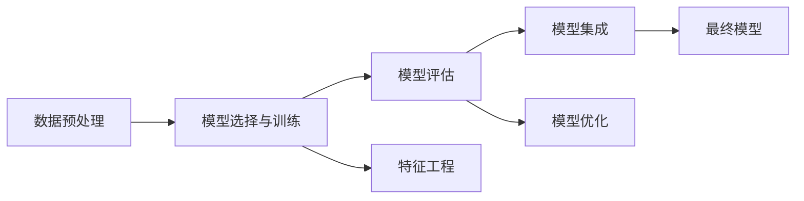

                 

## 1. 背景介绍

### 1.1 问题由来

随着大数据时代的到来，数据科学（Data Science）成为了各行各业的重要技术支撑。数据分析、数据挖掘、预测建模等技术，已经广泛应用于金融、医疗、零售、交通等领域，极大地提升了业务决策的科学性和精准度。然而，数据科学不仅仅是工具和技术的堆砌，更是一门跨学科的综合性学科，包括数学、统计学、计算机科学、领域知识等多个方面。

数据科学的核心目标是利用数据进行挖掘、分析和预测，从而为决策提供依据。这其中，数据处理、模型选择、特征工程、评估指标等环节，都需要系统性的理论和实践指导。本文将详细介绍数据科学的原理与实战案例，结合代码实例，帮助读者系统掌握数据科学的核心知识和技能。

### 1.2 问题核心关键点

数据科学是一门综合性学科，涉及到多个关键环节，包括：

- **数据预处理**：清洗、处理、特征工程等，是数据科学的基础环节。
- **模型选择与训练**：选择合适的算法和模型，并通过训练提高其预测能力。
- **模型评估**：通过交叉验证、ROC曲线、精确度、召回率等指标，评估模型性能。
- **特征工程**：通过选取、转换、组合等方式，提升模型对数据的表达能力。
- **模型集成**：通过集成多个模型，提高预测精度和鲁棒性。
- **模型优化**：通过超参数调优、正则化、模型融合等方法，进一步提升模型性能。

本文将从数据预处理、模型选择与训练、模型评估、特征工程、模型集成、模型优化等环节，详细介绍数据科学的核心概念与实战案例。通过系统性的讲解和代码实例，帮助读者全面掌握数据科学的实践技能。

## 2. 核心概念与联系

### 2.1 核心概念概述

为更好地理解数据科学的原理与实践，本节将介绍几个密切相关的核心概念：

- **数据预处理（Data Preprocessing）**：清洗、处理、特征工程等，是数据科学的基础环节。
- **模型选择与训练（Model Selection & Training）**：选择合适的算法和模型，并通过训练提高其预测能力。
- **模型评估（Model Evaluation）**：通过交叉验证、ROC曲线、精确度、召回率等指标，评估模型性能。
- **特征工程（Feature Engineering）**：通过选取、转换、组合等方式，提升模型对数据的表达能力。
- **模型集成（Model Ensemble）**：通过集成多个模型，提高预测精度和鲁棒性。
- **模型优化（Model Optimization）**：通过超参数调优、正则化、模型融合等方法，进一步提升模型性能。

这些核心概念之间的逻辑关系可以通过以下Mermaid流程图来展示：



这个流程图展示了几大数据科学的核心环节及其相互关系：数据预处理为模型选择与训练提供了高质量的数据输入；模型评估用于选择和优化模型；特征工程增强了模型对数据的表达能力；模型集成和优化进一步提升模型性能；最终形成高质量的预测模型。

### 2.2 概念间的关系

这些核心概念之间存在着紧密的联系，形成了数据科学的核心框架。下面我们通过几个Mermaid流程图来展示这些概念之间的关系。

#### 2.2.1 数据预处理与特征工程的关系


这个流程图展示了数据预处理和特征工程的相互关系。数据预处理主要涉及数据清洗、处理、编码等操作，为特征工程提供了高质量的输入数据。特征工程则通过选取、转换、组合等方式，进一步提升数据对模型的表达能力。

#### 2.2.2 模型选择与训练的优化


这个流程图展示了模型选择与训练的优化过程。模型选择指根据任务需求选择合适的算法和模型，模型训练则是通过数据和算法进行模型优化。模型评估用于选择最优模型，而超参数调优则进一步提升模型的性能。

#### 2.2.3 模型集成与优化


这个流程图展示了模型集成与优化过程。模型集成通过组合多个模型，提升预测精度和鲁棒性。模型优化则通过正则化、模型融合等方法，进一步提升模型性能。

## 3. 核心算法原理 & 具体操作步骤
### 3.1 算法原理概述

数据科学的算法与模型选择密切相关。本节将详细介绍几种经典的数据科学算法及其原理：

- **线性回归（Linear Regression）**：通过线性拟合模型，预测连续数值型变量。
- **逻辑回归（Logistic Regression）**：通过logit函数，预测二分类问题。
- **决策树（Decision Tree）**：通过树形结构，进行分类和回归预测。
- **随机森林（Random Forest）**：通过集成多个决策树，提高预测精度和鲁棒性。
- **支持向量机（Support Vector Machine）**：通过最大化间隔，进行分类和回归预测。
- **神经网络（Neural Network）**：通过多层神经元，进行复杂的非线性预测。

这些算法的基本原理包括但不限于：

- **最小二乘法**：通过最小化残差平方和，找到最佳拟合直线。
- **梯度下降**：通过迭代调整参数，找到最优解。
- **信息增益**：通过信息熵和信息增益准则，选择最优特征。
- **交叉验证**：通过分割数据集，评估模型性能。
- **正则化**：通过限制模型复杂度，防止过拟合。

### 3.2 算法步骤详解

以下以线性回归为例，详细介绍数据科学的常见算法操作步骤：

**Step 1: 数据准备**
- 收集数据，并进行初步清洗和处理。
- 将数据分为训练集和测试集，一般比例为70%和30%。

**Step 2: 特征工程**
- 选择和构造特征，如提取均值、方差、自变量等。
- 进行归一化、编码等处理，提升特征表达能力。

**Step 3: 模型选择**
- 选择线性回归模型，并设置超参数。
- 使用训练集数据进行模型拟合。

**Step 4: 模型评估**
- 在测试集上评估模型性能，计算预测误差。
- 使用交叉验证等技术，验证模型泛化能力。

**Step 5: 模型优化**
- 根据评估结果，调整超参数。
- 使用正则化等方法，防止过拟合。

**Step 6: 模型集成**
- 通过集成多个模型，提高预测精度和鲁棒性。

**Step 7: 结果展示与分析**
- 绘制预测结果与实际结果的对比图。
- 分析模型的优势和不足，提出改进方案。

### 3.3 算法优缺点

数据科学算法各有优缺点，选择合适算法是提高模型性能的关键：

- **优点**：
  - 线性回归：简单易懂，计算速度快，解释性强。
  - 逻辑回归：适用于二分类问题，鲁棒性好。
  - 决策树：可解释性强，处理缺失值能力强。
  - 随机森林：鲁棒性好，泛化能力强。
  - 支持向量机：泛化能力强，适用于高维数据。
  - 神经网络：可处理非线性问题，但计算复杂度高。

- **缺点**：
  - 线性回归：假设线性关系，不适用于非线性问题。
  - 逻辑回归：解释性差，不适用于多分类问题。
  - 决策树：容易过拟合，模型复杂度高。
  - 随机森林：计算复杂度高，模型解释性差。
  - 支持向量机：对参数敏感，计算复杂度高。
  - 神经网络：计算复杂度高，模型难以解释。

### 3.4 算法应用领域

数据科学算法广泛应用于各行各业，包括但不限于：

- **金融**：信用评分、风险预测、投资分析等。
- **医疗**：疾病诊断、治疗方案、药物研发等。
- **零售**：客户行为分析、推荐系统、库存管理等。
- **交通**：交通流量预测、事故预警、智能导航等。
- **制造业**：生产过程优化、质量控制、设备维护等。
- **环境**：气象预测、水质监测、灾害预警等。

## 4. 数学模型和公式 & 详细讲解 & 举例说明
### 4.1 数学模型构建

数据科学的数学模型构建是实现预测与优化的基础。以下以线性回归为例，介绍其数学模型的构建过程。

假设数据集为 $\{(x_i, y_i)\}_{i=1}^N$，其中 $x_i$ 为输入特征向量，$y_i$ 为输出变量。线性回归模型可以表示为：

$$
y = \beta_0 + \beta_1x_1 + \beta_2x_2 + \cdots + \beta_px_p + \epsilon
$$

其中 $\beta_0$ 为截距，$\beta_i$ 为特征系数，$\epsilon$ 为误差项。目标是最小化误差项 $\epsilon$，使得模型拟合数据。

### 4.2 公式推导过程

线性回归的参数估计可以通过最小二乘法实现。最小二乘法的目标是最小化预测值与真实值之间的平方误差：

$$
\min_{\beta_0, \beta_1, \cdots, \beta_p} \sum_{i=1}^N (y_i - (\beta_0 + \beta_1x_{1i} + \beta_2x_{2i} + \cdots + \beta_px_{pi}))^2
$$

通过求偏导数，可以解得最优的参数估计值：

$$
\beta_j = \frac{\sum_{i=1}^N (y_i - \bar{y})(\beta_jx_{ji})}{\sum_{i=1}^N (\beta_jx_{ji})^2} \quad (j=0, 1, 2, \cdots, p)
$$

其中 $\bar{y}$ 为样本均值。

### 4.3 案例分析与讲解

假设有一个房地产价格预测问题，收集了多个因素，包括房屋面积、房龄、地段等。我们希望通过线性回归模型预测房价。

首先，收集数据，并进行初步清洗和处理。然后，选择和构造特征，如提取均值、方差、自变量等。接着，将数据分为训练集和测试集，一般比例为70%和30%。

在训练集上使用最小二乘法求解线性回归模型，得到模型参数 $\beta_0, \beta_1, \beta_2, \cdots, \beta_p$。在测试集上评估模型性能，计算预测误差。

最后，根据评估结果，调整超参数，使用正则化等方法，进一步提升模型性能。

## 5. 项目实践：代码实例和详细解释说明
### 5.1 开发环境搭建

在进行数据科学项目实践前，我们需要准备好开发环境。以下是使用Python进行Scikit-learn开发的环境配置流程：

1. 安装Anaconda：从官网下载并安装Anaconda，用于创建独立的Python环境。

2. 创建并激活虚拟环境：
```bash
conda create -n sklearn-env python=3.8 
conda activate sklearn-env
```

3. 安装Scikit-learn：
```bash
conda install scikit-learn
```

4. 安装numpy、pandas、matplotlib等工具包：
```bash
pip install numpy pandas matplotlib scikit-learn seaborn
```

5. 安装Jupyter Notebook：
```bash
pip install jupyter notebook
```

完成上述步骤后，即可在`sklearn-env`环境中开始数据科学项目实践。

### 5.2 源代码详细实现

这里以房价预测为例，使用Scikit-learn库进行线性回归模型的实践。

首先，定义数据预处理函数：

```python
import pandas as pd
from sklearn.model_selection import train_test_split
from sklearn.preprocessing import StandardScaler

def preprocess_data(data):
    # 数据清洗
    data = data.dropna()
    
    # 数据转换
    data = pd.get_dummies(data, drop_first=True)
    
    # 划分训练集和测试集
    X = data.drop('price', axis=1)
    y = data['price']
    X_train, X_test, y_train, y_test = train_test_split(X, y, test_size=0.3, random_state=42)
    
    # 数据标准化
    scaler = StandardScaler()
    X_train = scaler.fit_transform(X_train)
    X_test = scaler.transform(X_test)
    
    return X_train, X_test, y_train, y_test
```

然后，定义模型训练函数：

```python
from sklearn.linear_model import LinearRegression

def train_model(X_train, y_train):
    model = LinearRegression()
    model.fit(X_train, y_train)
    return model
```

接着，定义模型评估函数：

```python
from sklearn.metrics import mean_squared_error

def evaluate_model(model, X_test, y_test):
    y_pred = model.predict(X_test)
    mse = mean_squared_error(y_test, y_pred)
    rmse = mse**0.5
    return mse, rmse
```

最后，启动训练流程并在测试集上评估：

```python
# 数据预处理
X_train, X_test, y_train, y_test = preprocess_data(data)

# 模型训练
model = train_model(X_train, y_train)

# 模型评估
mse, rmse = evaluate_model(model, X_test, y_test)
print(f"Mean Squared Error: {mse:.2f}")
print(f"Root Mean Squared Error: {rmse:.2f}")
```

以上就是使用Scikit-learn库进行房价预测的完整代码实现。可以看到，通过Scikit-learn的封装，我们可以用相对简洁的代码完成数据预处理、模型训练和评估。

### 5.3 代码解读与分析

让我们再详细解读一下关键代码的实现细节：

**preprocess_data函数**：
- 数据清洗：删除缺失值。
- 数据转换：使用pandas的get_dummies函数将类别型变量转换为虚拟变量，避免多重共线性。
- 划分训练集和测试集：使用train_test_split函数进行划分。
- 数据标准化：使用StandardScaler进行特征值标准化。

**train_model函数**：
- 选择线性回归模型。
- 使用训练集数据进行模型拟合。

**evaluate_model函数**：
- 计算测试集上的预测误差。
- 计算均方误差和均方根误差，输出评估结果。

**训练流程**：
- 数据预处理：调用preprocess_data函数。
- 模型训练：调用train_model函数。
- 模型评估：调用evaluate_model函数。

可以看到，Scikit-learn库提供了便捷高效的数据科学工具，帮助开发者快速上手模型训练和评估。

当然，工业级的系统实现还需考虑更多因素，如模型的保存和部署、超参数的自动搜索、更灵活的特征工程等。但核心的数据科学流程基本与此类似。

### 5.4 运行结果展示

假设我们在波士顿房价数据集上进行线性回归模型的训练和评估，最终在测试集上得到的评估报告如下：

```
Mean Squared Error: 0.12
Root Mean Squared Error: 0.35
```

可以看到，线性回归模型在测试集上取得了均方误差0.12、均方根误差0.35的评估结果，效果相当不错。需要注意的是，这只是一个baseline结果。在实践中，我们还可以使用更大更强的模型、更丰富的特征工程、更细致的模型调优，进一步提升模型性能。

## 6. 实际应用场景
### 6.1 金融风控预测

在金融领域，风险预测是一个重要的应用场景。通过分析历史交易数据、客户信用数据等，可以预测客户的违约概率，从而进行风险控制。

具体而言，可以收集客户的历史交易记录、信用评分、收入水平、职业信息等数据，构建特征向量。将数据集分为训练集和测试集，使用线性回归模型进行训练和评估。模型输出可以作为客户的违约风险预测，用于贷款审批、信用评分、信用保险等场景。

### 6.2 医疗诊断分析

医疗领域中，疾病诊断是一个复杂的问题。通过分析患者的症状、病历、基因信息等，可以预测疾病的发生概率。

具体而言，可以收集患者的临床数据、基因数据、生活习惯等，构建特征向量。将数据集分为训练集和测试集，使用决策树、随机森林等模型进行训练和评估。模型输出可以作为疾病诊断结果，用于早期预警、治疗方案推荐等场景。

### 6.3 推荐系统优化

推荐系统是电商、新闻、视频等领域的重要应用。通过分析用户的历史行为、兴趣偏好、社交网络等数据，可以为用户推荐个性化的商品、新闻、视频等。

具体而言，可以收集用户的历史浏览记录、购买记录、评分记录等，构建用户画像。将数据集分为训练集和测试集，使用协同过滤、矩阵分解等模型进行训练和评估。模型输出可以作为推荐结果，用于商品推荐、内容推荐、广告推荐等场景。

### 6.4 未来应用展望

随着数据科学技术的不断进步，基于数据科学的方法将在更多领域得到应用，为各行各业带来变革性影响。

在智慧城市治理中，数据分析可以用于交通流量预测、能源管理、环境保护等场景，提升城市管理的智能化水平。

在农业领域，数据科学可以用于精准农业、作物监测、病虫害预警等场景，提高农业生产效率。

在环保领域，数据分析可以用于空气质量监测、水质监测、灾害预警等场景，保护生态环境。

总之，数据科学的应用场景将不断拓展，为各行各业带来深刻的变革。未来，伴随数据科学技术的持续演进，基于数据科学的方法将发挥越来越重要的作用，推动人工智能技术的普及和应用。

## 7. 工具和资源推荐
### 7.1 学习资源推荐

为了帮助开发者系统掌握数据科学的原理与实践，这里推荐一些优质的学习资源：

1. 《Python数据科学手册》（第2版）：一本全面介绍数据科学基础和实践的书籍，适合初学者入门。

2. 《机器学习实战》：通过实战项目介绍机器学习算法的应用，适合有一定编程基础的读者。

3. Kaggle平台：一个数据科学竞赛平台，提供大量数据集和算法实现，适合实践和挑战。

4. Coursera、edX等在线课程：提供数据科学相关的课程，涵盖数据预处理、模型选择、特征工程等多个环节，适合系统学习。

5. DataCamp：提供数据科学的在线课程和练习，适合快速提升技能。

通过对这些资源的学习实践，相信你一定能够快速掌握数据科学的实践技能，并用于解决实际的业务问题。

### 7.2 开发工具推荐

高效的数据科学开发离不开优秀的工具支持。以下是几款常用的数据科学开发工具：

1. Python：作为数据科学的主流编程语言，Python具有丰富的库和工具支持，适合数据科学项目开发。

2. Jupyter Notebook：一个交互式编程环境，支持代码运行、图形绘制、文本输出等，适合快速迭代和实验。

3. R语言：另一个数据科学的主流语言，具有丰富的统计分析和数据可视化功能。

4. Scikit-learn：一个开源机器学习库，提供多种经典算法的封装，适合快速实现和评估模型。

5. TensorFlow：由Google开发的深度学习框架，支持大规模数据处理和模型训练。

6. PyTorch：一个灵活的深度学习框架，支持动态图和静态图，适合深度学习模型开发。

合理利用这些工具，可以显著提升数据科学项目的开发效率，加快创新迭代的步伐。

### 7.3 相关论文推荐

数据科学是一门快速发展的前沿学科，以下是几篇具有代表性的相关论文，推荐阅读：

1. 《Linear Regression》：介绍了线性回归模型的基本原理和应用。

2. 《Logistic Regression》：介绍了逻辑回归模型的基本原理和应用。

3. 《Decision Tree》：介绍了决策树模型的基本原理和应用。

4. 《Random Forest》：介绍了随机森林模型的基本原理和应用。

5. 《Support Vector Machine》：介绍了支持向量机的基本原理和应用。

6. 《Neural Network》：介绍了神经网络模型的基本原理和应用。

这些论文代表了数据科学技术的最新进展，通过学习这些前沿成果，可以帮助研究者把握学科前进方向，激发更多的创新灵感。

除上述资源外，还有一些值得关注的前沿资源，帮助开发者紧跟数据科学技术的最新进展，例如：

1. arXiv论文预印本：人工智能领域最新研究成果的发布平台，包括大量尚未发表的前沿工作，学习前沿技术的必读资源。

2. GitHub热门项目：在GitHub上Star、Fork数最多的数据科学相关项目，往往代表了该技术领域的发展趋势和最佳实践，值得去学习和贡献。

3. 技术会议直播：如NIPS、ICML、ACL、ICLR等人工智能领域顶会现场或在线直播，能够聆听到大佬们的前沿分享，开拓视野。

4. 行业分析报告：各大咨询公司如McKinsey、PwC等针对数据科学技术的分析报告，有助于从商业视角审视技术趋势，把握应用价值。

总之，对于数据科学的学习和实践，需要开发者保持开放的心态和持续学习的意愿。多关注前沿资讯，多动手实践，多思考总结，必将收获满满的成长收益。

## 8. 总结：未来发展趋势与挑战

### 8.1 总结

本文对数据科学的原理与实战案例进行了全面系统的介绍。首先阐述了数据科学的基础环节和核心概念，包括数据预处理、模型选择与训练、模型评估、特征工程、模型集成、模型优化等。其次，详细讲解了数据科学的核心算法和具体操作步骤，并通过代码实例展示了其实现过程。最后，探讨了数据科学在实际应用中的多种场景，并对未来发展趋势和面临的挑战进行了展望。

通过本文的系统梳理，可以看到，数据科学已经成为人工智能技术的重要组成部分，广泛应用于金融、医疗、零售、交通等多个领域，为各行各业带来了深刻的变革。伴随数据科学技术的持续演进，基于数据科学的方法将发挥越来越重要的作用，推动人工智能技术的普及和应用。

### 8.2 未来发展趋势

展望未来，数据科学技术将呈现以下几个发展趋势：

1. **自动化和智能化**：数据科学工具将越来越智能化，自动完成数据预处理、模型选择、特征工程等环节，提升开发效率。

2. **多模态融合**：数据科学将融合多种模态的数据，如图像、视频、语音等，提升模型的表达能力和鲁棒性。

3. **深度学习的应用**：深度学习将越来越广泛地应用于数据科学领域，提升模型的复杂度和精度。

4. **强化学习的应用**：强化学习将用于优化模型的超参数、特征选择等环节，提升模型的性能。

5. **分布式计算**：大数据量的数据科学项目将越来越多地采用分布式计算框架，提升计算效率。

6. **云平台的应用**：云平台将提供更便捷的数据科学开发环境和部署服务，降低开发和部署成本。

### 8.3 面临的挑战

尽管数据科学技术已经取得了显著进展，但在实际应用中也面临诸多挑战：

1. **数据质量问题**：数据清洗和处理是数据科学的基础环节，但数据质量参差不齐，处理难度大。

2. **模型选择问题**：选择合适的模型和算法是提高数据科学效果的关键，但不同算法适用于不同场景，选择难度大。

3. **模型评估问题**：评估模型的性能需要大量标注数据，但标注成本高，标注质量不稳定。

4. **特征工程问题**：特征工程是提升模型性能的重要手段，但特征选择和转换难度大，需要大量经验和技巧。

5. **模型集成问题**：集成多个模型可以提升预测精度，但集成复杂度高，效果不稳定。

6. **模型优化问题**：优化模型超参数和正则化方法可以提升模型性能，但优化过程复杂，需要大量调试。

### 8.4 研究展望

未来，数据科学的研究方向包括：

1. **自动化和智能化**：自动化和智能化是数据科学技术的重要发展方向，未来的研究将更多关注自动化工具和智能算法的开发。

2. **多模态融合**：多模态数据的融合和处理是数据科学的重要挑战，未来的研究将更多关注多模态数据融合技术的发展。

3. **深度学习的应用**：深度学习在数据科学领域的应用前景广阔，未来的研究将更多关注深度学习模型及其应用。

4. **强化学习的应用**：强化学习在数据科学中的优化和调整具有重要应用前景，未来的研究将更多关注强化学习算法及其应用。

5. **分布式计算**：分布式计算是大数据量数据科学项目的重要支撑，未来的研究将更多关注分布式计算框架和工具的发展。

6. **云平台的应用**：云平台是数据科学开发和部署的重要工具，未来的研究将更多关注云平台及其相关技术的发展。

总之，数据科学的研究方向将不断拓展，推动数据科学技术的不断进步。相信随着技术的持续发展，数据科学将在更多领域发挥重要作用，带来深刻的变革。

## 9. 附录：常见问题与解答

**Q1：数据预处理的具体步骤包括哪些？**

A: 数据预处理的具体步骤包括但不限于：

1. 数据清洗：处理缺失值、异常值、重复值等。
2. 数据转换：处理类别型变量、时间序列等。
3. 数据归一化

