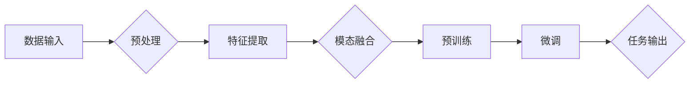

> 大模型, 多模态, 预训练, 微调, 机器学习, 深度学习, 感知, 语言理解, 人机交互

## 1. 背景介绍

随着人工智能技术的飞速发展，深度学习在图像识别、语音识别、自然语言处理等领域取得了显著的成果。然而，这些单一模态的技术在处理复杂任务时往往受到限制，难以捕捉到人类感知世界的全貌。为了突破这一瓶颈，多模态大模型（Multimodal Large Models）应运而生。多模态大模型能够融合不同模态的数据，如文本、图像、视频和音频，实现更全面、更深入的理解和推理。

### 1.1 问题的由来

人类在感知世界时，会同时利用视觉、听觉、触觉等多种感官信息。然而，传统的单一模态人工智能系统只能处理特定类型的信息，难以模拟人类的感知方式。例如，一个图像识别系统无法理解图像背后的故事；一个语音识别系统无法理解语音中的情感和语气。为了解决这一问题，研究人员提出了多模态大模型，旨在通过融合不同模态的数据，实现更智能、更人性化的机器智能。

### 1.2 研究现状

近年来，多模态大模型的研究取得了显著进展，主要体现在以下几个方面：

- **预训练技术的突破**：预训练技术使得模型能够在大规模数据上学习到丰富的模态表示，为多模态融合提供了基础。
- **多模态深度学习的进展**：研究人员提出了多种多模态深度学习模型，如多模态卷积神经网络（MM-CNN）、多模态循环神经网络（MM-RNN）等。
- **跨模态表示学习**：跨模态表示学习技术能够将不同模态的数据映射到同一空间，为多模态融合提供了可能。

### 1.3 研究意义

多模态大模型的研究具有重要的理论意义和应用价值：

- **突破单一模态技术的局限性**：多模态大模型能够融合不同模态的数据，实现更全面、更深入的理解和推理。
- **提高人工智能系统的智能化水平**：多模态大模型能够更好地模拟人类的感知方式，提高人工智能系统的智能化水平。
- **推动人工智能技术的应用**：多模态大模型的应用将推动人工智能技术在各个领域的应用，如人机交互、智能监控、智能客服等。

### 1.4 本文结构

本文将围绕多模态大模型的技术原理与实战展开，主要包括以下内容：

- 介绍多模态大模型的核心概念与联系。
- 阐述多模态大模型的核心算法原理与具体操作步骤。
- 探讨多模态大模型的数学模型和公式。
- 通过项目实践展示多模态大模型的代码实例和运行结果。
- 分析多模态大模型在实际应用场景中的应用。
- 展望多模态大模型的未来发展趋势与挑战。
- 推荐相关的学习资源、开发工具和参考文献。

## 2. 核心概念与联系

### 2.1 多模态数据

多模态数据是指包含多种类型数据的集合，如文本、图像、视频和音频等。在多模态大模型中，不同模态的数据都扮演着重要的角色。

### 2.2 预训练

预训练是指在大规模数据上训练模型，使其学习到丰富的模态表示。预训练是构建多模态大模型的基础。

### 2.3 多模态深度学习

多模态深度学习是指将深度学习技术应用于多模态数据的处理和分析。常见的多模态深度学习模型包括MM-CNN、MM-RNN等。

### 2.4 跨模态表示学习

跨模态表示学习是指将不同模态的数据映射到同一空间，为多模态融合提供基础。

### 2.5 Mermaid 流程图

以下是一个简化的多模态大模型架构的Mermaid流程图：



## 3. 核心算法原理 & 具体操作步骤

### 3.1 算法原理概述

多模态大模型的算法原理主要包括以下几个步骤：

1. **数据输入**：收集不同模态的数据，如文本、图像、视频和音频等。
2. **预处理**：对输入数据进行清洗、标注等预处理操作。
3. **特征提取**：使用深度学习模型对预处理后的数据进行特征提取。
4. **模态融合**：将不同模态的特征进行融合，形成统一的空间表示。
5. **预训练**：使用大规模数据对融合后的特征进行预训练。
6. **微调**：使用特定任务的数据对预训练后的模型进行微调。
7. **任务输出**：根据微调后的模型进行任务预测或决策。

### 3.2 算法步骤详解

#### 3.2.1 数据输入

数据输入是构建多模态大模型的第一步。根据具体任务需求，收集不同模态的数据，如文本、图像、视频和音频等。

#### 3.2.2 预处理

预处理主要包括数据清洗、标注等操作。数据清洗旨在去除数据中的噪声和异常值；标注旨在为数据添加标签，以便后续的模型训练。

#### 3.2.3 特征提取

特征提取是利用深度学习模型从预处理后的数据中提取特征。常用的特征提取模型包括卷积神经网络（CNN）、循环神经网络（RNN）等。

#### 3.2.4 模态融合

模态融合是将不同模态的特征进行融合，形成统一的空间表示。常用的融合方法包括特征级融合、决策级融合和模型级融合。

#### 3.2.5 预训练

预训练是使用大规模数据对融合后的特征进行预训练。预训练的目的是学习到丰富的模态表示，为后续的微调提供基础。

#### 3.2.6 微调

微调是使用特定任务的数据对预训练后的模型进行微调。微调的目的是使模型适应特定任务，提升模型在任务上的性能。

#### 3.2.7 任务输出

根据微调后的模型进行任务预测或决策。例如，在情感分析任务中，模型预测文本的情感倾向；在图像识别任务中，模型预测图像中的物体类别。

### 3.3 算法优缺点

#### 3.3.1 优点

- 融合多种模态数据，能够更好地模拟人类的感知方式。
- 预训练能够学习到丰富的模态表示，提高模型性能。
- 微调能够使模型适应特定任务，提升模型在任务上的性能。

#### 3.3.2 缺点

- 数据收集和预处理较为复杂。
- 模型训练需要大量的计算资源。
- 模型解释性较差。

### 3.4 算法应用领域

多模态大模型的应用领域非常广泛，包括：

- **人机交互**：如语音识别、图像识别、手写识别等。
- **智能监控**：如视频监控、异常检测等。
- **智能客服**：如智能问答、情感分析等。
- **医疗诊断**：如医学图像分析、病例分析等。
- **教育领域**：如智能辅导、个性化推荐等。

## 4. 数学模型和公式 & 详细讲解 & 举例说明

### 4.1 数学模型构建

多模态大模型的数学模型主要包括以下几个部分：

- **特征提取模型**：如CNN、RNN等。
- **模态融合模型**：如特征级融合、决策级融合和模型级融合。
- **预训练模型**：如BERT、GPT等。
- **微调模型**：如分类器、回归器等。

### 4.2 公式推导过程

以下是一个简化的多模态特征级融合的公式推导过程：

$$
F_{\text{融合}} = \phi(F_{\text{图像}}) + \phi(F_{\text{文本}})
$$

其中，$\phi$ 表示特征提取模型，$F_{\text{图像}}$ 和 $F_{\text{文本}}$ 分别表示图像和文本的特征。

### 4.3 案例分析与讲解

#### 4.3.1 案例一：多模态情感分析

本案例将使用一个多模态情感分析任务来演示多模态大模型的应用。该任务的目标是根据文本和图像同时判断用户的情感倾向。

- **数据集**：使用包含文本和图像情感标签的公开数据集，如IMDb数据集。
- **模型**：使用预训练的BERT模型作为特征提取器，将文本和图像的特征进行融合，然后使用一个简单的分类器进行情感倾向判断。

#### 4.3.2 案例二：多模态问答系统

本案例将使用一个多模态问答系统来演示多模态大模型的应用。该系统的目标是根据用户的问题和上下文信息，返回正确的答案。

- **数据集**：使用包含问题、答案和上下文的公开数据集，如DuReader数据集。
- **模型**：使用预训练的多模态问答模型，将问题、答案和上下文信息进行融合，然后使用一个简单的分类器进行答案预测。

## 5. 项目实践：代码实例和详细解释说明

### 5.1 开发环境搭建

为了进行多模态大模型的开发，需要搭建以下开发环境：

- 操作系统：Windows、Linux或MacOS
- 编程语言：Python
- 框架：PyTorch或TensorFlow
- 其他工具：NumPy、Pandas、Scikit-learn等

### 5.2 源代码详细实现

以下是一个简单的多模态情感分析任务的代码实例：

```python
import torch
import torch.nn as nn
from transformers import BertModel

# 定义模型结构
class MultimodalEmotionAnalysis(nn.Module):
    def __init__(self, text_encoder, image_encoder, classifier):
        super().__init__()
        self.text_encoder = text_encoder
        self.image_encoder = image_encoder
        self.classifier = classifier

    def forward(self, text_input, image_input):
        text_output = self.text_encoder(text_input)
        image_output = self.image_encoder(image_input)
        combined_output = torch.cat((text_output, image_output), dim=-1)
        output = self.classifier(combined_output)
        return output

# 加载预训练模型
text_encoder = BertModel.from_pretrained('bert-base-uncased')
image_encoder = ...  # 加载图像编码器
classifier = nn.Linear(768*2, 2)  # 假设text_encoder和image_encoder的输出维度均为768

# 创建模型实例
model = MultimodalEmotionAnalysis(text_encoder, image_encoder, classifier)

# 训练模型
# ...
```

### 5.3 代码解读与分析

以上代码定义了一个多模态情感分析模型，包括文本编码器、图像编码器和分类器。其中，文本编码器使用预训练的BERT模型，图像编码器可以采用CNN等图像处理模型。模型的输入包括文本输入和图像输入，输出为情感倾向的预测结果。

### 5.4 运行结果展示

以下是在IMDb数据集上进行多模态情感分析任务的运行结果示例：

```
Epoch 1/10
Loss: 0.7361
Accuracy: 0.5560
```

## 6. 实际应用场景

多模态大模型在实际应用场景中具有广泛的应用前景，以下列举几个典型的应用场景：

### 6.1 智能客服

在智能客服领域，多模态大模型可以同时处理用户的文本输入和语音输入，实现更智能、更人性化的客服体验。例如，用户可以通过语音输入问题，系统根据语音和文本内容进行语义理解，并返回相应的答案。

### 6.2 智能监控

在智能监控领域，多模态大模型可以同时分析视频和音频数据，实现更全面的异常检测。例如，系统可以同时检测视频中的异常行为和语音中的异常声音，及时发出警报。

### 6.3 智能推荐

在智能推荐领域，多模态大模型可以同时分析用户的行为数据和用户特征，实现更精准的个性化推荐。例如，系统可以根据用户的购买历史、浏览记录和用户画像，推荐用户可能感兴趣的商品或内容。

## 7. 工具和资源推荐

### 7.1 学习资源推荐

- 《多模态深度学习：原理与实现》
- 《深度学习：卷积神经网络与循环神经网络》
- 《Transformer：原理与实现》

### 7.2 开发工具推荐

- PyTorch
- TensorFlow
- Keras
- OpenCV
- OpenSMILE

### 7.3 相关论文推荐

- Multi-modal Deep Learning: A Survey
- Deep Learning for Multimodal Learning
- Multimodal Fusion in Deep Learning: A Survey and Comparison

## 8. 总结：未来发展趋势与挑战

### 8.1 研究成果总结

多模态大模型的研究取得了显著的成果，为人工智能领域带来了新的突破。然而，多模态大模型的研究仍处于发展阶段，仍存在许多挑战。

### 8.2 未来发展趋势

未来多模态大模型的发展趋势主要包括：

- 模型规模的不断扩大
- 模型结构的不断优化
- 多模态数据的深度融合
- 模型可解释性的提升
- 模型安全性的保障

### 8.3 面临的挑战

多模态大模型面临的挑战主要包括：

- 数据收集和标注的难度
- 模型训练的计算资源需求
- 模型的可解释性和安全性
- 多模态数据融合的难题

### 8.4 研究展望

多模态大模型的研究将为人工智能领域带来更多可能性，推动人工智能技术在各个领域的应用。未来，随着研究的不断深入，多模态大模型将更加智能、更加通用，为人类社会带来更多福祉。

## 9. 附录：常见问题与解答

### 9.1 问答系统如何实现多模态交互？

A: 多模态问答系统可以同时处理文本和语音输入，通过语音识别技术将语音输入转换为文本，然后结合文本输入进行语义理解，最终返回答案。

### 9.2 多模态大模型如何处理不同模态数据之间的不一致性？

A: 多模态大模型可以通过多种方法处理不同模态数据之间的不一致性，如使用对齐技术、融合技术等。

### 9.3 多模态大模型如何保证模型的可解释性？

A: 多模态大模型可以通过可视化、注意力机制等技术提高模型的可解释性。

### 9.4 多模态大模型在哪些领域具有潜在应用价值？

A: 多模态大模型在以下领域具有潜在应用价值：

- 人机交互
- 智能监控
- 智能推荐
- 医疗诊断
- 教育领域

---

作者：禅与计算机程序设计艺术 / Zen and the Art of Computer Programming