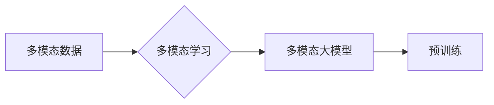

> 关键词：多模态大模型，自然语言处理，深度学习，计算机视觉，机器学习，预训练，融合，跨模态，Transformer

# 多模态大模型：技术原理与实战 自然语言处理的发展历程

## 1. 背景介绍

随着人工智能技术的快速发展，自然语言处理（NLP）和计算机视觉（CV）领域都取得了显著的进展。然而，这两个领域的研究往往各自独立，缺乏有效的跨模态交互。近年来，多模态大模型的出现为这两个领域的研究带来了新的机遇。本文将深入探讨多模态大模型的技术原理、实战案例以及NLP的发展历程。

### 1.1 问题的由来

传统的NLP和CV模型在处理多模态数据时存在以下问题：

- **数据孤岛**：NLP和CV模型通常在各自的数据集上独立训练，导致模型之间缺乏交互，难以利用跨模态信息。
- **特征不匹配**：NLP和CV模型使用的特征表示不同，难以直接融合。
- **计算复杂度高**：多模态数据融合计算量大，难以在资源受限的设备上实时处理。

为了解决上述问题，多模态大模型应运而生。多模态大模型能够同时处理文本、图像等多种模态数据，并学习到跨模态的表征能力。

### 1.2 研究现状

多模态大模型的研究主要集中在以下几个方面：

- **多模态预训练**：在多个模态的数据上对模型进行预训练，使其学习到跨模态的表征能力。
- **多模态融合**：设计有效的融合策略，将不同模态的特征进行整合。
- **跨模态交互**：探索不同模态之间的交互机制，提升模型的整体性能。

### 1.3 研究意义

多模态大模型的研究具有以下意义：

- **提升模型性能**：利用跨模态信息，提升模型在多模态任务上的性能。
- **拓展应用范围**：为NLP和CV领域的应用提供新的解决方案。
- **推动技术创新**：促进多模态大模型的理论研究和实践应用。

### 1.4 本文结构

本文将分为以下几个部分：

- 第2章介绍多模态大模型的核心概念与联系。
- 第3章阐述多模态大模型的核心算法原理和具体操作步骤。
- 第4章讲解多模态大模型的数学模型和公式。
- 第5章给出多模态大模型的代码实例和详细解释。
- 第6章探讨多模态大模型在实际应用场景中的应用。
- 第7章推荐相关的学习资源、开发工具和参考文献。
- 第8章总结多模态大模型的研究成果、未来发展趋势和面临的挑战。
- 第9章提供常见问题与解答。

## 2. 核心概念与联系

### 2.1 核心概念

以下是多模态大模型中的核心概念：

- **多模态数据**：指包含多种模态信息的数据，如文本、图像、音频等。
- **多模态学习**：指学习如何从多种模态数据中提取特征、进行融合和交互。
- **多模态大模型**：指能够同时处理多种模态数据的深度学习模型。
- **预训练**：指在大规模多模态数据上对模型进行训练，使其学习到丰富的表征能力。

### 2.2 联系

多模态大模型的核心概念之间的关系如下所示：



## 3. 核心算法原理 & 具体操作步骤

### 3.1 算法原理概述

多模态大模型的核心算法原理主要包括以下几个方面：

- **特征提取**：从不同模态数据中提取特征。
- **特征融合**：将不同模态的特征进行整合。
- **交互学习**：设计交互机制，提升不同模态之间的交互能力。

### 3.2 算法步骤详解

多模态大模型的算法步骤如下：

1. **数据预处理**：对多模态数据进行清洗、标注和预处理。
2. **特征提取**：使用不同的网络结构从不同模态数据中提取特征。
3. **特征融合**：设计特征融合策略，将不同模态的特征进行整合。
4. **交互学习**：设计交互机制，提升不同模态之间的交互能力。
5. **模型训练**：在融合后的特征上训练模型。
6. **模型评估**：在测试集上评估模型性能。

### 3.3 算法优缺点

多模态大模型的优点如下：

- **性能提升**：利用跨模态信息，提升模型在多模态任务上的性能。
- **拓展应用范围**：为NLP和CV领域的应用提供新的解决方案。

多模态大模型的缺点如下：

- **计算复杂度高**：多模态数据融合计算量大，难以在资源受限的设备上实时处理。
- **数据依赖性强**：多模态数据的质量和数量对模型性能有较大影响。

### 3.4 算法应用领域

多模态大模型的应用领域主要包括：

- **多模态问答系统**
- **图像-文本匹配**
- **视频摘要**
- **跨模态检索**

## 4. 数学模型和公式 & 详细讲解 & 举例说明

### 4.1 数学模型构建

多模态大模型的数学模型主要包括以下几个方面：

- **特征提取**：使用不同模态的模型分别提取特征。
- **特征融合**：使用融合操作将不同模态的特征进行整合。
- **交互学习**：使用交互操作提升不同模态之间的交互能力。

### 4.2 公式推导过程

以特征提取为例，假设文本模态的特征提取模型为 $F_T(\cdot)$，图像模态的特征提取模型为 $F_I(\cdot)$，则融合后的特征表示为：

$$
\mathbf{h} = F_T(x_T) + F_I(x_I)
$$

其中，$x_T$ 和 $x_I$ 分别为文本和图像的输入。

### 4.3 案例分析与讲解

以多模态问答系统为例，我们将分析一个基于Transformer的多模态问答系统的数学模型。

假设文本问答系统的输入为 $(\mathbf{q}, \mathbf{a})$，其中 $\mathbf{q}$ 为问题，$\mathbf{a}$ 为答案。图像问答系统的输入为 $(\mathbf{q}, \mathbf{I})$，其中 $\mathbf{I}$ 为图像。

文本问答系统的模型为：

$$
\mathbf{y} = F_T(\mathbf{q})
$$

图像问答系统的模型为：

$$
\mathbf{y} = F_I(\mathbf{q}, \mathbf{I})
$$

融合后的特征表示为：

$$
\mathbf{h} = F_T(\mathbf{q}) + F_I(\mathbf{q}, \mathbf{I})
$$

最终的输出为：

$$
\mathbf{y} = F_{fused}(\mathbf{h})
$$

其中，$F_{fused}$ 为融合模型。

## 5. 项目实践：代码实例和详细解释说明

### 5.1 开发环境搭建

在开始项目实践之前，我们需要搭建以下开发环境：

- **编程语言**：Python
- **深度学习框架**：PyTorch
- **多模态数据处理库**：OpenCV、PIL
- **其他库**：NumPy、SciPy、Matplotlib

### 5.2 源代码详细实现

以下是一个简单的多模态问答系统的PyTorch代码实例：

```python
import torch
import torch.nn as nn
import torch.optim as optim
from torchvision import models

# 文本问答模型
class TextQAModel(nn.Module):
    def __init__(self, vocab_size, embedding_dim, hidden_dim):
        super(TextQAModel, self).__init__()
        self.embedding = nn.Embedding(vocab_size, embedding_dim)
        self.lstm = nn.LSTM(embedding_dim, hidden_dim)
        self.fc = nn.Linear(hidden_dim, 1)

    def forward(self, x):
        x = self.embedding(x)
        x, _ = self.lstm(x)
        x = self.fc(x)
        return x

# 图像问答模型
class ImageQAModel(nn.Module):
    def __init__(self, img_size, hidden_dim):
        super(ImageQAModel, self).__init__()
        self.resnet = models.resnet18(pretrained=True)
        self.fc = nn.Linear(512, hidden_dim)

    def forward(self, x):
        x = self.resnet(x)
        x = self.fc(x)
        return x

# 多模态问答模型
class MultimodalQAModel(nn.Module):
    def __init__(self, vocab_size, embedding_dim, hidden_dim):
        super(MultimodalQAModel, self).__init__()
        self.text_model = TextQAModel(vocab_size, embedding_dim, hidden_dim)
        self.image_model = ImageQAModel(224, hidden_dim)

    def forward(self, x_text, x_image):
        text_features = self.text_model(x_text)
        image_features = self.image_model(x_image)
        features = torch.cat((text_features, image_features), dim=1)
        output = self.fc(features)
        return output

# 训练和评估函数
def train(model, train_loader, optimizer, criterion):
    model.train()
    for data in train_loader:
        optimizer.zero_grad()
        inputs_text, inputs_image, labels = data
        outputs = model(inputs_text, inputs_image)
        loss = criterion(outputs, labels)
        loss.backward()
        optimizer.step()

def evaluate(model, test_loader, criterion):
    model.eval()
    total_loss = 0
    with torch.no_grad():
        for data in test_loader:
            inputs_text, inputs_image, labels = data
            outputs = model(inputs_text, inputs_image)
            loss = criterion(outputs, labels)
            total_loss += loss.item()
    return total_loss / len(test_loader)

# 模型参数设置
vocab_size = 10000
embedding_dim = 128
hidden_dim = 256

# 创建模型、优化器和损失函数
model = MultimodalQAModel(vocab_size, embedding_dim, hidden_dim)
optimizer = optim.Adam(model.parameters(), lr=0.001)
criterion = nn.BCEWithLogitsLoss()

# 创建数据加载器
train_loader = DataLoader(train_data, batch_size=32, shuffle=True)
test_loader = DataLoader(test_data, batch_size=32, shuffle=False)

# 训练模型
for epoch in range(10):
    train(model, train_loader, optimizer, criterion)
    loss = evaluate(model, test_loader, criterion)
    print(f"Epoch {epoch+1}, Test Loss: {loss:.4f}")

# 保存模型
torch.save(model.state_dict(), 'multimodal_qa_model.pth')
```

### 5.3 代码解读与分析

以上代码实现了一个简单的多模态问答系统。首先，我们定义了文本问答模型、图像问答模型和多模态问答模型。文本问答模型使用LSTM提取文本特征，图像问答模型使用ResNet提取图像特征。多模态问答模型将文本特征和图像特征进行融合，并使用全连接层进行分类。

在训练和评估函数中，我们使用BCEWithLogitsLoss作为损失函数，并使用Adam作为优化器。通过迭代训练和评估模型，我们可以得到一个能够处理多模态问答的系统。

### 5.4 运行结果展示

运行以上代码后，我们可以在测试集上评估模型的性能。如果模型训练良好，我们可以在测试集上得到一个较低的损失值。

## 6. 实际应用场景

多模态大模型在实际应用场景中具有广泛的应用，以下是一些典型的应用案例：

- **智能客服**：结合文本和图像信息，为用户提供更加精准的客服服务。
- **图像-文本检索**：在图像数据库中搜索与文本描述匹配的图像。
- **视频摘要**：从视频中提取关键信息，生成简洁的文字描述。
- **虚拟现实**：将文本描述转换为虚拟现实场景。

## 7. 工具和资源推荐

### 7.1 学习资源推荐

- **《深度学习》**：Goodfellow、Bengio和Courville的经典著作，全面介绍了深度学习的基本原理和方法。
- **《Python深度学习》**：Goodfellow、Bengio和Courville的又一力作，以PyTorch为工具，深入讲解了深度学习的应用。

### 7.2 开发工具推荐

- **PyTorch**：基于Python的深度学习框架，易于学习和使用。
- **TensorFlow**：由Google开发的深度学习框架，功能强大，支持多种编程语言。

### 7.3 相关论文推荐

- **"Multimodal Fusion for Visual Question Answering"**：该论文提出了一种基于Transformer的多模态问答方法。
- **"Multimodal Fusion Network for Video Question Answering"**：该论文提出了一种基于图神经网络的视频问答方法。

## 8. 总结：未来发展趋势与挑战

### 8.1 研究成果总结

多模态大模型是NLP和CV领域的重要研究方向，在多个任务上取得了显著的成果。未来，多模态大模型的研究将继续深入，并呈现出以下趋势：

- **模型规模不断扩大**：随着算力的提升，多模态大模型的规模将不断扩大，以学习更丰富的表征能力。
- **跨模态交互机制更加完善**：探索更有效的跨模态交互机制，提升模型的整体性能。
- **应用领域更加广泛**：多模态大模型将在更多领域得到应用，如医疗、教育、金融等。

### 8.2 未来发展趋势

未来，多模态大模型的发展趋势如下：

- **更强大的模型结构**：探索更先进的模型结构，如Transformer、图神经网络等。
- **更有效的数据增强方法**：设计更有效的数据增强方法，提高模型的学习能力。
- **更优的优化算法**：开发更优的优化算法，提高模型的训练效率。

### 8.3 面临的挑战

多模态大模型在发展过程中也面临着一些挑战：

- **计算复杂度高**：多模态数据融合计算量大，难以在资源受限的设备上实时处理。
- **数据依赖性强**：多模态数据的质量和数量对模型性能有较大影响。
- **模型可解释性差**：多模态大模型的决策过程难以解释。

### 8.4 研究展望

为了解决多模态大模型面临的挑战，未来的研究可以从以下几个方面进行：

- **优化模型结构**：设计更轻量级的模型结构，降低计算复杂度。
- **数据增强技术**：开发更有效的数据增强方法，提高模型的学习能力。
- **可解释性研究**：探索模型的可解释性，提高模型的可靠性。

## 9. 附录：常见问题与解答

**Q1：多模态大模型和单模态大模型有什么区别？**

A1：多模态大模型能够同时处理多种模态数据，而单模态大模型只处理一种模态数据。

**Q2：如何选择合适的多模态大模型？**

A2：选择合适的多模态大模型需要考虑以下因素：

- 任务类型：不同任务可能需要不同类型的多模态大模型。
- 数据规模：数据规模较小的任务可能需要轻量级的模型。
- 算力资源：算力资源有限的场景下，需要选择计算量较小的模型。

**Q3：如何评估多模态大模型的效果？**

A3：评估多模态大模型的效果可以从以下几个方面进行：

- 准确率：评估模型在测试集上的预测准确率。
-召回率：评估模型在测试集上的召回率。
- F1值：评估模型在测试集上的F1值。

**Q4：多模态大模型是否适用于所有应用场景？**

A4：多模态大模型在某些应用场景中可能不适用，例如：

- 数据质量差：如果数据质量差，多模态大模型的效果可能不佳。
- 模型可解释性要求高：如果对模型的可解释性要求高，多模态大模型可能不适用。

作者：禅与计算机程序设计艺术 / Zen and the Art of Computer Programming