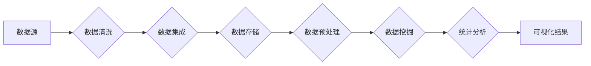

> 大数据分析，数据挖掘，机器学习，Hadoop，Spark，Python，数据可视化，统计建模

# 大数据分析 原理与代码实例讲解

## 1. 背景介绍

在大数据时代，数据的规模和复杂性呈指数级增长，传统的数据处理和分析方法已经无法满足需求。大数据分析作为一种新兴的技术，旨在从海量数据中提取有价值的信息，为决策提供支持。本文将深入探讨大数据分析的基本原理、核心算法、项目实践和实际应用场景。

## 2. 核心概念与联系

### 2.1 大数据分析的核心概念

- **数据挖掘**：从大量数据中提取有用信息和知识的过程。
- **机器学习**：使计算机系统能够从数据中学习并做出决策或预测的技术。
- **Hadoop**：一个开源框架，用于分布式存储和处理大规模数据。
- **Spark**：一个快速、通用的大数据处理框架，能够运行在Hadoop之上。
- **数据可视化**：将数据以图形或图像的形式展示，以帮助人们理解数据。
- **统计建模**：使用统计方法来分析数据，建立模型并预测结果。

### 2.2 核心概念原理和架构的 Mermaid 流程图



## 3. 核心算法原理 & 具体操作步骤

### 3.1 算法原理概述

大数据分析的核心算法包括数据挖掘算法和机器学习算法。数据挖掘算法用于发现数据中的模式和关系，而机器学习算法则用于构建预测模型。

### 3.2 算法步骤详解

1. **数据采集**：从各种数据源（如数据库、日志文件、传感器等）收集数据。
2. **数据清洗**：处理缺失值、异常值和不一致的数据，以提高数据质量。
3. **数据集成**：将来自不同数据源的数据整合在一起，形成统一的数据集。
4. **数据存储**：将数据存储在分布式文件系统或数据库中，如Hadoop的HDFS或Spark的RDD。
5. **数据预处理**：对数据进行转换、归一化等操作，以便进行后续分析。
6. **数据挖掘**：使用聚类、分类、关联规则挖掘等方法发现数据中的模式。
7. **统计分析**：使用统计方法分析数据，建立模型并预测结果。
8. **可视化**：将分析结果以图形或图像的形式展示，帮助理解数据。

### 3.3 算法优缺点

- **数据挖掘**：优点是能够发现数据中的未知模式，但缺点是需要复杂的算法和大量计算资源。
- **机器学习**：优点是能够自动从数据中学习，但缺点是需要大量标注数据。

### 3.4 算法应用领域

- **金融**：信用评分、风险管理、股票市场预测。
- **医疗**：疾病预测、患者诊断、药物研发。
- **零售**：客户行为分析、库存管理、定价策略。
- **社交网络**：用户行为分析、推荐系统、社交网络分析。

## 4. 数学模型和公式 & 详细讲解 & 举例说明

### 4.1 数学模型构建

在大数据分析中，常用的数学模型包括线性回归、逻辑回归、决策树、支持向量机等。

### 4.2 公式推导过程

以线性回归为例，假设我们有一个输入向量 $x$ 和一个输出向量 $y$，我们希望找到一个线性模型 $y = wx + b$ 来预测 $y$。

### 4.3 案例分析与讲解

假设我们有一个简单的线性回归模型，用于预测房价。我们有以下数据集：

| 房屋面积 | 房价 |
|----------|------|
| 1000     | 200  |
| 1500     | 300  |
| 2000     | 400  |

我们可以使用线性回归算法来训练模型，并预测新的房价。假设我们得到的最优参数为 $w = 0.2$ 和 $b = 10$，那么预测房价的公式为 $y = 0.2x + 10$。

## 5. 项目实践：代码实例和详细解释说明

### 5.1 开发环境搭建

首先，我们需要安装Python和必要的库，如NumPy、Pandas、Matplotlib等。

### 5.2 源代码详细实现

以下是一个简单的线性回归模型的Python代码实现：

```python
import numpy as np
import matplotlib.pyplot as plt

# 生成数据
X = np.array([[1000], [1500], [2000]])
y = np.array([200, 300, 400])

# 计算参数
w = np.linalg.inv(X.T @ X) @ X.T @ y
b = y - w @ X

# 预测
def predict(x):
    return w @ x + b

# 绘制数据点和预测线
plt.scatter(X, y)
plt.plot([min(X), max(X)], [predict(min(X)), predict(max(X))], color='red')
plt.show()
```

### 5.3 代码解读与分析

这段代码首先导入了必要的库，然后生成了测试数据。接下来，使用线性代数计算了最优参数 $w$ 和 $b$。最后，定义了一个预测函数 `predict` 来预测新的房价，并使用Matplotlib库绘制了数据点和预测线。

### 5.4 运行结果展示

运行上述代码将生成一个散点图，其中红色线表示线性回归模型的预测结果。

## 6. 实际应用场景

大数据分析在各个领域都有广泛的应用，以下是一些常见的应用场景：

- **金融**：通过分析交易数据，预测市场趋势和风险管理。
- **医疗**：通过分析医疗数据，预测疾病风险和制定个性化治疗方案。
- **零售**：通过分析消费者行为数据，优化库存管理和营销策略。
- **社交网络**：通过分析社交网络数据，识别社交关系和推荐新朋友。

## 6.4 未来应用展望

随着技术的不断发展，大数据分析将在以下方面得到进一步的应用：

- **物联网**：通过分析物联网设备的数据，实现智能化的城市管理和智能家居。
- **自动驾驶**：通过分析传感器数据，实现自动驾驶汽车的安全和高效行驶。
- **生物信息学**：通过分析生物数据，加速药物研发和新疗法发现。

## 7. 工具和资源推荐

### 7.1 学习资源推荐

- 《大数据时代》
- 《数据科学入门》
- 《Python数据科学手册》

### 7.2 开发工具推荐

- Hadoop
- Spark
- Python (NumPy, Pandas, Matplotlib)

### 7.3 相关论文推荐

- 《大数据时代》
- 《数据科学入门》
- 《Python数据科学手册》

## 8. 总结：未来发展趋势与挑战

### 8.1 研究成果总结

大数据分析已经取得了显著的成果，并在各个领域得到了广泛的应用。随着技术的不断发展，大数据分析将在未来发挥更大的作用。

### 8.2 未来发展趋势

- **数据隐私保护**：随着数据隐私保护意识的提高，如何保护用户数据隐私将成为一大挑战。
- **算法透明度**：提高算法的透明度和可解释性，以增强用户对算法的信任。
- **跨领域融合**：大数据分析与其他领域的融合，如人工智能、物联网等，将产生新的应用场景。

### 8.3 面临的挑战

- **数据质量**：确保数据质量，包括数据的完整性、准确性和一致性。
- **计算资源**：随着数据规模的增加，对计算资源的需求也在增加。
- **算法选择**：选择合适的算法来处理不同类型的数据和问题。

### 8.4 研究展望

大数据分析技术将继续发展，以应对未来更加复杂的挑战。通过技术创新和应用探索，大数据分析将为人类社会带来更多的价值。

## 9. 附录：常见问题与解答

**Q1：大数据分析的主要挑战是什么？**

A1：大数据分析的主要挑战包括数据质量、计算资源和算法选择。

**Q2：如何提高数据质量？**

A2：提高数据质量可以通过数据清洗、数据集成和数据预处理等步骤来实现。

**Q3：大数据分析在哪些领域有应用？**

A3：大数据分析在金融、医疗、零售、社交网络等各个领域都有应用。

**Q4：如何选择合适的算法？**

A4：选择合适的算法需要根据具体的问题和数据特点来确定。

作者：禅与计算机程序设计艺术 / Zen and the Art of Computer Programming