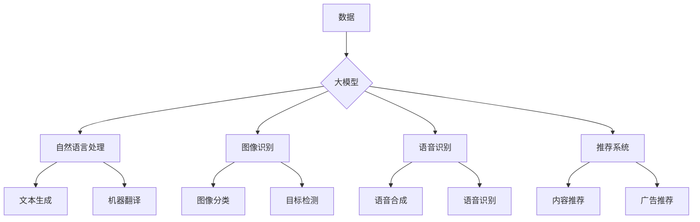

# 大模型推动的智能化才是数字化的顶峰

> 关键词：大模型，智能化，数字化，AI，机器学习，深度学习，Transformer，自然语言处理，工业4.0

## 1. 背景介绍

随着信息技术的飞速发展，数字化已经成为现代社会的重要特征。从电子商务到社交媒体，从智能城市到自动驾驶，数字化技术正在深刻改变着我们的生活方式和工作方式。然而，数字化的顶峰并非仅仅在于数据和网络的普及，而在于大模型推动的智能化。

### 1.1 数字化与智能化的区别

数字化是指将物理世界的信息转化为数字信号的过程，它依赖于硬件、软件和通信技术。而智能化则是指通过算法和机器学习技术，使计算机系统具备自主学习和决策能力。数字化是智能化的基础，智能化是数字化的升华。

### 1.2 大模型在智能化中的作用

大模型，特别是基于深度学习的语言模型，如BERT、GPT-3等，已经成为推动智能化发展的重要工具。这些模型通过学习海量数据，能够理解复杂的语言模式，进行自然语言处理、图像识别、语音识别等多种任务，极大地提升了智能系统的性能和效率。

## 2. 核心概念与联系

### 2.1 核心概念原理和架构的 Mermaid 流程图



### 2.2 核心概念解释

- **数据**：智能化系统的基石，包括文本、图像、语音等多种形式。
- **大模型**：基于深度学习的复杂模型，能够处理大规模数据并提取特征。
- **自然语言处理**：利用大模型进行文本的生成、理解、翻译等任务。
- **图像识别**：利用大模型进行图像的分类、目标检测等任务。
- **语音识别**：利用大模型进行语音的识别和合成。
- **推荐系统**：利用大模型进行内容或广告的推荐。
- **文本生成**：利用大模型生成新的文本内容。
- **机器翻译**：利用大模型将一种语言翻译成另一种语言。
- **图像分类**：利用大模型对图像进行分类。
- **目标检测**：利用大模型检测图像中的目标对象。
- **语音合成**：利用大模型生成语音。
- **内容推荐**：利用大模型推荐用户可能感兴趣的内容。
- **广告推荐**：利用大模型推荐用户可能感兴趣的广告。

## 3. 核心算法原理 & 具体操作步骤

### 3.1 算法原理概述

大模型通常基于深度学习技术，特别是卷积神经网络（CNN）和循环神经网络（RNN）的变体，如Transformer。这些模型能够通过多层神经网络学习数据的特征，从而实现复杂的任务。

### 3.2 算法步骤详解

1. **数据收集**：收集大量的相关数据，用于训练和测试模型。
2. **数据预处理**：对数据进行清洗、转换和标准化，以便模型训练。
3. **模型选择**：选择合适的模型架构，如CNN、RNN或Transformer。
4. **模型训练**：使用标注数据进行模型训练，不断调整模型参数以优化性能。
5. **模型评估**：使用测试数据评估模型性能，调整模型参数以进一步提升性能。
6. **模型部署**：将训练好的模型部署到实际应用中。

### 3.3 算法优缺点

**优点**：

- **高性能**：大模型能够处理复杂的数据和任务，提供高性能的解决方案。
- **通用性**：大模型可以应用于多种不同的任务，具有很高的通用性。
- **自适应性**：大模型能够通过学习不断改进性能，具有很强的自适应性。

**缺点**：

- **计算成本高**：大模型的训练和推理需要大量的计算资源。
- **数据依赖性强**：大模型的效果高度依赖于训练数据的质量和数量。
- **可解释性差**：大模型的决策过程通常难以解释。

### 3.4 算法应用领域

大模型在以下领域有着广泛的应用：

- **自然语言处理**：文本分类、机器翻译、文本摘要、对话系统等。
- **图像识别**：图像分类、目标检测、人脸识别等。
- **语音识别**：语音识别、语音合成、语音翻译等。
- **推荐系统**：内容推荐、广告推荐等。

## 4. 数学模型和公式 & 详细讲解 & 举例说明

### 4.1 数学模型构建

大模型通常基于深度学习的数学模型，以下是一个简单的卷积神经网络（CNN）模型的结构：

$$
\begin{align*}
h_{l} &= \sigma(W_{l} \circ h_{l-1} + b_{l}) \\
h_{0} &= x \\
\end{align*}
$$

其中，$h_{l}$ 表示第 $l$ 层的输出，$W_{l}$ 表示第 $l$ 层的权重，$b_{l}$ 表示第 $l$ 层的偏置，$\sigma$ 表示激活函数，$\circ$ 表示卷积操作。

### 4.2 公式推导过程

这里以卷积神经网络（CNN）为例，介绍其公式推导过程。

1. **卷积操作**：

$$
h_{l} = \sum_{k=1}^{K} w_{k} * x_{k} + b
$$

其中，$w_{k}$ 表示卷积核，$x_{k}$ 表示输入数据，$*$ 表示卷积操作，$b$ 表示偏置。

2. **激活函数**：

$$
h_{l} = \sigma(h_{l})
$$

其中，$\sigma$ 表示激活函数，如ReLU、Sigmoid等。

3. **偏置**：

$$
h_{l} = h_{l} + b_{l}
$$

其中，$b_{l}$ 表示第 $l$ 层的偏置。

### 4.3 案例分析与讲解

以下是一个使用PyTorch实现CNN的简单示例：

```python
import torch
import torch.nn as nn

class CNN(nn.Module):
    def __init__(self):
        super(CNN, self).__init__()
        self.conv1 = nn.Conv2d(1, 16, 3, 1)
        self.relu = nn.ReLU()
        self.pool = nn.MaxPool2d(2, 2)
        self.fc1 = nn.Linear(16 * 7 * 7, 10)

    def forward(self, x):
        x = self.pool(self.relu(self.conv1(x)))
        x = x.view(-1, 16 * 7 * 7)
        x = self.fc1(x)
        return x
```

在这个例子中，我们定义了一个简单的CNN模型，包含一个卷积层、一个ReLU激活函数、一个最大池化层和一个全连接层。

## 5. 项目实践：代码实例和详细解释说明

### 5.1 开发环境搭建

为了进行大模型的项目实践，你需要安装以下软件：

- Python 3.x
- PyTorch
- NumPy
- Matplotlib

### 5.2 源代码详细实现

以下是一个使用PyTorch实现图像分类的简单示例：

```python
import torch
import torch.nn as nn
import torch.optim as optim
from torchvision import datasets, transforms
from torch.utils.data import DataLoader

# 定义网络结构
class Net(nn.Module):
    def __init__(self):
        super(Net, self).__init__()
        self.conv1 = nn.Conv2d(1, 16, 3, 1)
        self.relu = nn.ReLU()
        self.pool = nn.MaxPool2d(2, 2)
        self.fc1 = nn.Linear(16 * 7 * 7, 10)

    def forward(self, x):
        x = self.pool(self.relu(self.conv1(x)))
        x = x.view(-1, 16 * 7 * 7)
        x = self.fc1(x)
        return x

# 加载数据
transform = transforms.Compose([transforms.ToTensor()])
train_dataset = datasets.MNIST(root='./data', train=True, download=True, transform=transform)
train_loader = DataLoader(train_dataset, batch_size=64, shuffle=True)

# 实例化网络
net = Net()

# 定义损失函数和优化器
criterion = nn.CrossEntropyLoss()
optimizer = optim.SGD(net.parameters(), lr=0.01, momentum=0.9)

# 训练网络
for epoch in range(2):  # 训练2个epoch
    for i, data in enumerate(train_loader, 0):
        inputs, labels = data
        optimizer.zero_grad()
        outputs = net(inputs)
        loss = criterion(outputs, labels)
        loss.backward()
        optimizer.step()

print('Finished Training')
```

### 5.3 代码解读与分析

在这个示例中，我们定义了一个简单的CNN模型，用于识别MNIST手写数字数据集。我们使用PyTorch框架进行数据加载、模型定义、损失函数定义、优化器定义和模型训练。

### 5.4 运行结果展示

在完成模型训练后，我们可以使用测试数据集评估模型的性能。以下是一个简单的评估示例：

```python
# 测试网络
correct = 0
total = 0
with torch.no_grad():
    for data in test_loader:
        images, labels = data
        outputs = net(images)
        _, predicted = torch.max(outputs.data, 1)
        total += labels.size(0)
        correct += (predicted == labels).sum().item()

print('Accuracy of the network on the 10000 test images: %d %%' % (100 * correct / total))
```

这个示例展示了如何使用测试数据集评估模型的性能。

## 6. 实际应用场景

### 6.1 图像识别

大模型在图像识别领域有着广泛的应用，如人脸识别、物体识别、医学图像分析等。

### 6.2 自然语言处理

大模型在自然语言处理领域有着巨大的潜力，如机器翻译、文本摘要、情感分析、对话系统等。

### 6.3 语音识别

大模型在语音识别领域也有着重要的应用，如语音合成、语音翻译、语音助手等。

### 6.4 推荐系统

大模型在推荐系统领域也有着广泛的应用，如内容推荐、广告推荐、电商推荐等。

## 7. 工具和资源推荐

### 7.1 学习资源推荐

- 《深度学习》 - Goodfellow, Ian; Bengio, Yoshua; Courville, Aaron
- 《Python深度学习》 - François Chollet
- 《动手学深度学习》 - 阮一峰

### 7.2 开发工具推荐

- PyTorch
- TensorFlow
- Keras
- Scikit-learn

### 7.3 相关论文推荐

- "ImageNet Classification with Deep Convolutional Neural Networks" - Krizhevsky et al.
- "Sequence to Sequence Learning with Neural Networks" - Sutskever et al.
- "Attention is All You Need" - Vaswani et al.

## 8. 总结：未来发展趋势与挑战

### 8.1 研究成果总结

大模型推动的智能化是数字化的顶峰，它使得计算机系统能够理解和处理复杂的数据，实现更智能的决策和行动。大模型在自然语言处理、图像识别、语音识别、推荐系统等领域都有着广泛的应用，并取得了显著的成果。

### 8.2 未来发展趋势

- **模型规模将进一步扩大**：随着计算能力的提升，模型规模将进一步扩大，能够处理更复杂的任务。
- **模型效率将进一步提升**：通过模型压缩、量化等技术，模型的效率将进一步提升，使其能够在资源受限的设备上运行。
- **模型可解释性将得到改善**：通过可解释AI技术，模型的决策过程将更加透明，提高模型的可信度。
- **模型安全性将得到加强**：通过对抗训练、数据净化等技术，模型的鲁棒性将得到加强，减少恶意攻击的风险。

### 8.3 面临的挑战

- **数据隐私**：大模型需要大量数据训练，如何保护用户隐私是一个重要挑战。
- **模型偏见**：大模型可能会学习到数据中的偏见，如何消除模型偏见是一个重要挑战。
- **模型可解释性**：大模型的决策过程通常难以解释，如何提高模型的可解释性是一个重要挑战。
- **模型安全**：如何防止恶意攻击，确保模型安全是一个重要挑战。

### 8.4 研究展望

未来，大模型推动的智能化将在以下方面得到进一步发展：

- **跨模态学习**：将文本、图像、语音等多种模态的数据进行融合，实现更全面的智能化。
- **知识增强**：将知识库与模型结合，提高模型的理解能力和决策能力。
- **强化学习**：结合强化学习技术，使模型能够在复杂环境中进行自主学习和决策。

大模型推动的智能化是数字化的顶峰，它将为我们带来更加智能化的生活和工作方式。面对挑战，我们需要不断创新，推动大模型技术不断进步，为人类创造更加美好的未来。

## 9. 附录：常见问题与解答

**Q1：什么是大模型？**

A：大模型是指基于深度学习的复杂模型，能够处理大规模数据并提取特征。大模型通常具有以下特点：

- **规模巨大**：拥有数十亿甚至数千亿个参数。
- **数据驱动**：通过学习海量数据来提取特征和知识。
- **泛化能力强**：能够在不同的任务和数据集上取得良好的性能。

**Q2：大模型有哪些应用？**

A：大模型在以下领域有着广泛的应用：

- 自然语言处理
- 图像识别
- 语音识别
- 推荐系统
- 机器翻译
- 医学图像分析
- 金融分析
- 电商推荐

**Q3：大模型有哪些挑战？**

A：大模型面临以下挑战：

- 计算成本高
- 数据依赖性强
- 可解释性差
- 模型偏见
- 模型安全

**Q4：如何解决大模型的挑战？**

A：解决大模型的挑战需要从多个方面入手：

- **算法优化**：通过算法优化降低计算成本和模型复杂度。
- **数据隐私保护**：采用联邦学习、差分隐私等技术保护用户隐私。
- **知识增强**：将知识库与模型结合，提高模型的可解释性和鲁棒性。
- **安全防护**：采用对抗训练、数据净化等技术提高模型安全性。

**Q5：大模型的未来发展趋势是什么？**

A：大模型的未来发展趋势包括：

- **模型规模将进一步扩大**
- **模型效率将进一步提升**
- **模型可解释性将得到改善**
- **模型安全性将得到加强**
- **跨模态学习**
- **知识增强**
- **强化学习**

作者：禅与计算机程序设计艺术 / Zen and the Art of Computer Programming