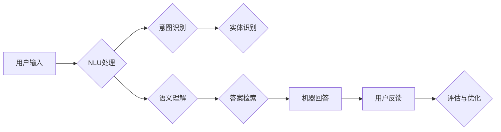

# 大模型问答机器人的文本处理

> 关键词：大模型，问答机器人，文本处理，自然语言理解，自然语言生成，预训练，微调，BERT，GPT

## 1. 背景介绍

随着人工智能技术的飞速发展，问答系统作为自然语言处理（NLP）领域的一个重要分支，已经广泛应用于客服、教育、医疗、金融等多个领域。传统的问答系统大多基于关键词匹配或模式匹配的方式进行回答，但这种方法在处理复杂、模糊或开放性问题时效果不佳。近年来，基于大模型的问答机器人凭借其强大的自然语言理解和生成能力，在处理复杂问答任务方面取得了显著的进步。

本文将探讨大模型问答机器人的文本处理技术，包括自然语言理解（NLU）、自然语言生成（NLG）以及大模型的预训练和微调方法。

## 2. 核心概念与联系

### 2.1 核心概念

**自然语言理解（NLU）**：NLU是指让机器理解和分析自然语言输入的过程。它包括词性标注、命名实体识别、句法分析、语义分析等任务。

**自然语言生成（NLG）**：NLG是指让机器根据输入信息生成自然语言输出的过程。它通常包括模板生成和文本生成两种方式。

**预训练**：预训练是指在大规模无标注数据集上进行训练，使模型学习到丰富的语言知识和常识。

**微调**：微调是指在预训练模型的基础上，使用下游任务的少量标注数据进一步训练模型，以适应特定任务。

### 2.2 架构流程图



## 3. 核心算法原理 & 具体操作步骤

### 3.1 算法原理概述

大模型问答机器人的核心算法主要包括以下几个方面：

- NLU：通过词性标注、命名实体识别、句法分析等任务，将用户输入转换为机器可理解的内部表示。
- 意图识别：根据NLU的结果，确定用户的意图。
- 实体识别：从NLU的结果中提取出用户提到的实体。
- 语义理解：理解用户意图和实体之间的关系。
- 答案检索：根据用户意图和实体，从知识库中检索出合适的答案。
- NLG：将检索到的答案转换为自然语言输出。

### 3.2 算法步骤详解

1. **NLU处理**：对用户输入进行分词、词性标注、命名实体识别等操作，将文本转换为机器可理解的内部表示。
2. **意图识别**：根据NLU的结果，使用分类算法（如朴素贝叶斯、支持向量机、深度神经网络等）识别用户的意图。
3. **实体识别**：从NLU的结果中提取出用户提到的实体，如人名、地名、组织机构等。
4. **语义理解**：理解用户意图和实体之间的关系，使用关系抽取算法（如依存句法分析、实体关系抽取等）。
5. **答案检索**：根据用户意图和实体，从知识库中检索出合适的答案。
6. **NLG**：将检索到的答案转换为自然语言输出。

### 3.3 算法优缺点

**优点**：

- **强大的语言理解能力**：大模型问答机器人能够理解复杂、模糊或开放性问题，提供更加准确的答案。
- **知识丰富**：预训练大模型在大量无标注数据上进行预训练，学习到丰富的语言知识和常识，使得问答机器人在处理开放性问题时更加得心应手。
- **泛化能力强**：通过微调，问答机器人能够适应特定领域的知识，提高准确率和召回率。

**缺点**：

- **计算量大**：大模型的训练和推理需要大量的计算资源。
- **依赖标注数据**：微调需要大量的标注数据，获取标注数据的成本较高。
- **可解释性差**：大模型的决策过程缺乏可解释性，难以分析其推理逻辑。

### 3.4 算法应用领域

大模型问答机器人可以应用于以下领域：

- **客服系统**：自动回答用户常见问题，提高客服效率。
- **教育系统**：为学生提供个性化的学习辅导。
- **医疗系统**：辅助医生进行诊断和治疗方案推荐。
- **金融系统**：提供财务咨询和投资建议。

## 4. 数学模型和公式 & 详细讲解 & 举例说明

### 4.1 数学模型构建

大模型问答机器人的数学模型主要包括以下几个方面：

- **NLU**：使用深度神经网络（DNN）进行词性标注、命名实体识别等任务。
- **意图识别**：使用分类算法（如softmax）进行意图识别。
- **实体识别**：使用条件随机场（CRF）进行实体识别。
- **语义理解**：使用注意力机制（如BERT）进行语义理解。
- **NLG**：使用生成对抗网络（GAN）或序列到序列（seq2seq）模型进行答案生成。

### 4.2 公式推导过程

以下以意图识别为例，介绍公式的推导过程：

设输入句子为 $x$，意图标签为 $y$，则意图识别的损失函数为：

$$
L(\theta) = -\sum_{i=1}^N [y_i \log p(y_i|x,\theta) + (1-y_i)\log p(\hat{y}_i|x,\theta)]
$$

其中，$p(y_i|x,\theta)$ 为模型预测标签 $y_i$ 的概率，$p(\hat{y}_i|x,\theta)$ 为模型预测标签 $\hat{y}_i$ 的概率。

### 4.3 案例分析与讲解

以下以BERT模型为例，介绍其应用于意图识别的案例。

首先，使用BERT模型对用户输入进行编码，得到编码后的序列 $x$。

然后，将编码后的序列 $x$ 输入到分类器中，得到意图标签的概率分布。

最后，根据概率分布，选择概率最大的标签作为最终预测结果。

## 5. 项目实践：代码实例和详细解释说明

### 5.1 开发环境搭建

1. 安装PyTorch和Transformers库：
```bash
pip install torch transformers
```

2. 下载预训练的BERT模型和分词器：
```bash
python -m transformers-cli models download bert-base-uncased
```

### 5.2 源代码详细实现

```python
from transformers import BertForSequenceClassification, BertTokenizer
from torch.utils.data import DataLoader, TensorDataset

# 加载预训练的BERT模型和分词器
model = BertForSequenceClassification.from_pretrained('bert-base-uncased')
tokenizer = BertTokenizer.from_pretrained('bert-base-uncased')

# 加载数据
def load_data(filepath):
    sentences = []
    labels = []
    with open(filepath, 'r', encoding='utf-8') as f:
        for line in f:
            sentence, label = line.strip().split('\t')
            sentences.append(sentence)
            labels.append(int(label))
    return sentences, labels

train_sentences, train_labels = load_data('train.txt')
test_sentences, test_labels = load_data('test.txt')

# 编码数据
train_encodings = tokenizer(train_sentences, truncation=True, padding=True, max_length=512)
test_encodings = tokenizer(test_sentences, truncation=True, padding=True, max_length=512)

# 创建数据集
train_dataset = TensorDataset(train_encodings['input_ids'], train_encodings['attention_mask'], torch.tensor(train_labels))
test_dataset = TensorDataset(test_encodings['input_ids'], test_encodings['attention_mask'], torch.tensor(test_labels))

# 定义模型和优化器
device = torch.device('cuda' if torch.cuda.is_available() else 'cpu')
model.to(device)

optimizer = torch.optim.AdamW(model.parameters(), lr=2e-5)

# 训练模型
def train(model, dataset, batch_size, epochs):
    model.train()
    dataloader = DataLoader(dataset, batch_size=batch_size)
    for epoch in range(epochs):
        for batch in dataloader:
            input_ids, attention_mask, labels = [t.to(device) for t in batch]
            optimizer.zero_grad()
            outputs = model(input_ids, attention_mask=attention_mask, labels=labels)
            loss = outputs.loss
            loss.backward()
            optimizer.step()
    return model

model = train(model, train_dataset, batch_size=16, epochs=3)

# 评估模型
def evaluate(model, dataset, batch_size):
    model.eval()
    dataloader = DataLoader(dataset, batch_size=batch_size)
    total_correct = 0
    total_samples = 0
    for batch in dataloader:
        input_ids, attention_mask, labels = [t.to(device) for t in batch]
        with torch.no_grad():
            outputs = model(input_ids, attention_mask=attention_mask)
            predictions = torch.argmax(outputs.logits, dim=1)
            total_correct += torch.sum(predictions == labels).item()
            total_samples += labels.size(0)
    return total_correct / total_samples

print("Test accuracy:", evaluate(model, test_dataset, batch_size=16))
```

### 5.3 代码解读与分析

以上代码展示了如何使用PyTorch和Transformers库，在BERT模型上实现意图识别任务。

1. 加载预训练的BERT模型和分词器。
2. 加载数据集，并进行编码。
3. 创建数据集，并划分为训练集和测试集。
4. 定义模型和优化器。
5. 训练模型，并保存最佳模型参数。
6. 评估模型在测试集上的准确率。

## 6. 实际应用场景

大模型问答机器人在以下场景中具有广泛的应用：

- **智能客服**：自动回答用户常见问题，提高客服效率。
- **虚拟助手**：为用户提供个性化的服务，如日程管理、购物推荐等。
- **教育系统**：为学生提供个性化的学习辅导。
- **医疗系统**：辅助医生进行诊断和治疗方案推荐。
- **金融系统**：提供财务咨询和投资建议。

## 7. 工具和资源推荐

### 7.1 学习资源推荐

- **书籍**：
  - 《深度学习自然语言处理》
  - 《自然语言处理：原理与汉语应用》
  - 《自然语言处理实践》
- **在线课程**：
  - Coursera上的《自然语言处理与深度学习》课程
  - fast.ai的《深度学习与NLP》课程
- **技术博客**：
  - Hugging Face的Transformers库官方文档
  - TensorFlow的NLP教程

### 7.2 开发工具推荐

- **PyTorch**
- **TensorFlow**
- **Hugging Face的Transformers库**
- **NLTK**
- **spaCy**

### 7.3 相关论文推荐

- **BERT: Pre-training of Deep Bidirectional Transformers for Language Understanding**
- **Transformers: State-of-the-Art Natural Language Processing**
- **BERT for Sentence Similarity**
- **Language Models are Few-Shot Learners**

## 8. 总结：未来发展趋势与挑战

### 8.1 研究成果总结

大模型问答机器人在文本处理方面取得了显著的成果，能够处理复杂、模糊或开放性问题，提供更加准确的答案。未来，大模型问答机器人将朝着以下方向发展：

- **模型更小、更快**：通过模型压缩、量化等技术，降低模型尺寸，提高推理速度。
- **知识更丰富**：结合知识图谱等技术，使问答机器人具备更强的知识储备。
- **交互更自然**：引入多模态信息，如语音、图像等，实现更加自然的人机交互。

### 8.2 未来发展趋势

1. **多模态问答**：结合文本、语音、图像等多模态信息，实现更加丰富的问答体验。
2. **个性化问答**：根据用户的历史交互记录，为用户提供个性化的问答服务。
3. **可解释性问答**：提高问答机器人的可解释性，使其推理过程更加透明。
4. **跨领域问答**：使问答机器人能够跨越不同领域，解决更广泛的问题。

### 8.3 面临的挑战

1. **数据标注成本**：高质量的标注数据难以获取，数据标注成本高昂。
2. **模型可解释性**：大模型的决策过程缺乏可解释性，难以分析其推理逻辑。
3. **知识图谱构建**：构建高质量的知识图谱需要大量时间和人力投入。
4. **跨领域知识融合**：将不同领域的知识进行有效融合，是一个具有挑战性的问题。

### 8.4 研究展望

随着人工智能技术的不断发展，大模型问答机器人在文本处理方面的应用前景将更加广阔。未来，研究人员需要克服数据标注、模型可解释性、知识图谱构建等挑战，推动大模型问答机器人技术迈向更高的水平。

## 9. 附录：常见问题与解答

**Q1：大模型问答机器人的优点是什么？**

A：大模型问答机器人具有强大的语言理解能力、丰富的知识储备和良好的跨领域知识融合能力。

**Q2：大模型问答机器人的缺点是什么？**

A：大模型问答机器人的主要缺点是数据标注成本高、模型可解释性差、知识图谱构建困难。

**Q3：如何提高大模型问答机器人的可解释性？**

A：可以通过可视化方法、解释性模型等方法提高大模型问答机器人的可解释性。

**Q4：如何构建高质量的知识图谱？**

A：可以通过人工构建、半自动构建、自动构建等方法构建高质量的知识图谱。

**Q5：大模型问答机器人在哪些场景中具有应用价值？**

A：大模型问答机器人在客服、教育、医疗、金融等多个场景中具有广泛的应用价值。