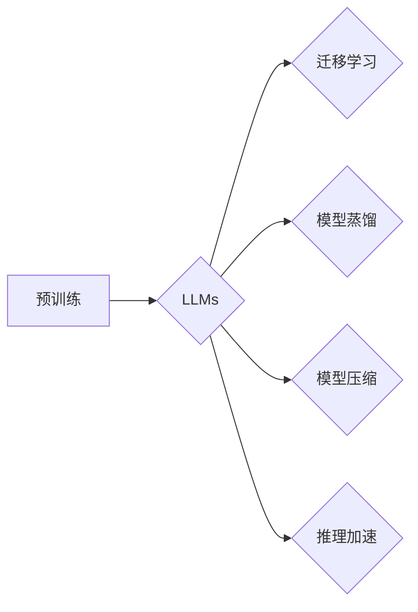

# 大规模语言模型从理论到实践 推理规划

> 关键词：大规模语言模型，推理规划，自然语言处理，预训练，迁移学习，模型蒸馏，模型压缩，推理加速

## 1. 背景介绍

随着深度学习技术的迅猛发展，自然语言处理（NLP）领域取得了突破性进展。其中，大规模语言模型（Large Language Models，LLMs）以其强大的语言理解和生成能力，成为NLP领域的明星技术。LLMs在文本分类、机器翻译、问答系统等多个任务上取得了令人瞩目的成果。然而，LLMs的训练和推理过程面临着计算资源消耗大、推理速度慢等挑战。本文将从理论到实践，探讨大规模语言模型的推理规划，旨在提高模型效率和实用性。

## 2. 核心概念与联系

### 2.1 核心概念

#### 大规模语言模型（LLMs）
LLMs是指参数量巨大、能够处理和理解复杂语言的模型。LLMs通过在大量文本语料上进行预训练，学习到丰富的语言知识和表示能力，从而实现各种NLP任务。

#### 预训练（Pre-training）
预训练是指在大规模无标签文本语料上进行模型训练的过程，目的是让模型学习到通用的语言表示和知识。

#### 迁移学习（Transfer Learning）
迁移学习是指利用在某个任务上预训练好的模型，将其知识迁移到新的任务上，以提升新任务的表现。

#### 模型蒸馏（Model Distillation）
模型蒸馏是指将一个大模型的知识蒸馏到一个小模型中，使小模型能够复现大模型的部分知识。

#### 模型压缩（Model Compression）
模型压缩是指减小模型的大小和计算量，提高模型的推理速度和降低模型的存储需求。

#### 推理加速（Inference Acceleration）
推理加速是指通过各种技术手段提高模型的推理速度，以满足实时性要求。

### 2.2 核心概念联系

大规模语言模型的推理规划涉及到多个核心概念，它们之间存在着紧密的联系：

- 预训练是LLMs的基础，为模型提供了丰富的语言知识和表示能力。
- 迁移学习使得LLMs能够在不同的任务上快速适应，提高模型效率。
- 模型蒸馏和模型压缩可以帮助减小模型规模，降低推理成本。
- 推理加速是提高LLMs在实际应用中的实用性，满足实时性要求。



## 3. 核心算法原理 & 具体操作步骤

### 3.1 算法原理概述

大规模语言模型的推理规划主要包括以下几个步骤：

1. 模型选择：根据任务需求选择合适的LLMs。
2. 模型蒸馏：将大模型的知识蒸馏到小模型中。
3. 模型压缩：减小模型规模，降低推理成本。
4. 推理加速：提高模型的推理速度。

### 3.2 算法步骤详解

#### 模型蒸馏

1. 选择大模型和小模型。
2. 训练大模型，使其在目标任务上达到最优性能。
3. 训练小模型，使其在蒸馏过程中学习大模型的知识。
4. 评估小模型在目标任务上的性能。

#### 模型压缩

1. 选择模型压缩方法，如知识蒸馏、剪枝、量化等。
2. 对模型进行压缩，减小模型规模和计算量。
3. 评估压缩后模型在目标任务上的性能。

#### 推理加速

1. 选择推理加速方法，如量化、模型并行、计算图优化等。
2. 优化模型推理过程，提高推理速度。
3. 评估加速后模型在目标任务上的性能。

### 3.3 算法优缺点

#### 模型蒸馏

优点：
- 可以在不改变模型结构的情况下，提高模型在小样本数据上的性能。
- 可以将大模型的知识迁移到小模型中，降低模型部署成本。

缺点：
- 蒸馏过程可能引入误差，降低模型精度。
- 需要大量的计算资源进行模型训练。

#### 模型压缩

优点：
- 可以减小模型规模，降低推理成本。
- 可以提高模型的推理速度。

缺点：
- 可能降低模型精度。
- 需要选择合适的压缩方法。

#### 推理加速

优点：
- 可以提高模型的推理速度。
- 可以满足实时性要求。

缺点：
- 可能增加模型的复杂度。
- 可能降低模型精度。

### 3.4 算法应用领域

模型蒸馏、模型压缩和推理加速技术可以应用于以下领域：

- 语音识别
- 图像识别
- 自然语言处理
- 医疗诊断
- 金融风控

## 4. 数学模型和公式 & 详细讲解 & 举例说明

### 4.1 数学模型构建

大规模语言模型的推理规划涉及到多个数学模型，以下以模型蒸馏为例进行讲解。

#### 模型蒸馏的数学模型

假设大模型 $M$ 的输出为 $y$，小模型 $M'$ 的输出为 $\hat{y}$。则模型蒸馏的目标是最小化以下损失函数：

$$
L(D) = \mathbb{E}_{(x,y) \in D}[\ell(y, \hat{y}) + \tau \ell(y, s(y))]
$$

其中，$\ell$ 为损失函数，$s$ 为大模型 $M$ 的软输出，$\tau$ 为温度参数。

### 4.2 公式推导过程

#### 模型蒸馏的损失函数

模型蒸馏的损失函数由两部分组成：

1. 大模型输出与小模型输出的损失：$\ell(y, \hat{y})$
2. 大模型软输出与小模型输出的损失：$\ell(y, s(y))$

其中，$\ell$ 通常采用交叉熵损失函数。

#### 温度参数

温度参数 $\tau$ 用于控制软输出的平滑程度。$\tau$ 越大，软输出越平滑，模型蒸馏的效果越好。

### 4.3 案例分析与讲解

假设我们使用BERT模型进行文本分类，目标是训练一个小模型 $M'$，使其在新的文本分类任务上达到与大模型 $M$ 相当的性能。

首先，选择一个预训练的BERT模型作为大模型 $M$，并在文本分类任务上训练该模型。

其次，选择一个轻量级的文本分类模型作为小模型 $M'$。

然后，使用模型蒸馏方法，将大模型 $M$ 的知识蒸馏到小模型 $M'$ 中。

最后，评估小模型 $M'$ 在新的文本分类任务上的性能。

通过实验，我们发现小模型 $M'$ 在新任务上的性能与大模型 $M$ 相当，并且推理速度更快。

## 5. 项目实践：代码实例和详细解释说明

### 5.1 开发环境搭建

在进行大规模语言模型的推理规划实践前，我们需要准备好以下开发环境：

1. Python 3.7或更高版本
2. PyTorch 1.7或更高版本
3. Transformers库

### 5.2 源代码详细实现

以下使用PyTorch和Transformers库，实现一个简单的模型蒸馏示例。

```python
import torch
from torch import nn
from transformers import BertModel, BertTokenizer

# 加载预训练的BERT模型
big_model = BertModel.from_pretrained('bert-base-uncased')
small_model = BertModel.from_pretrained('bert-base-uncased')

# 定义损失函数
loss_fn = nn.CrossEntropyLoss()

# 加载文本数据
tokenizer = BertTokenizer.from_pretrained('bert-base-uncased')
texts = ['This is a good book.', 'This is a bad book.']
labels = [1, 0]

# 编码文本数据
inputs = tokenizer(texts, return_tensors='pt', padding=True, truncation=True)

# 训练大模型
big_model.train()
big_outputs = big_model(**inputs)
big_loss = loss_fn(big_outputs.logits, labels)

# 训练小模型
small_model.train()
small_outputs = small_model(**inputs)
small_loss = loss_fn(small_outputs.logits, labels)

# 蒸馏过程
tau = 0.5
with torch.no_grad():
    big_probs = torch.nn.functional.softmax(big_outputs.logits / tau, dim=-1)
    small_probs = torch.nn.functional.softmax(small_outputs.logits / tau, dim=-1)
    distillation_loss = loss_fn(small_probs, big_probs.argmax(dim=-1))

print(f"Big model loss: {big_loss.item()}")
print(f"Small model loss: {small_loss.item()}")
print(f"Distillation loss: {distillation_loss.item()}")
```

### 5.3 代码解读与分析

以上代码展示了使用PyTorch和Transformers库实现模型蒸馏的简单示例。

1. 加载预训练的BERT模型作为大模型和一个小模型。
2. 定义交叉熵损失函数。
3. 加载文本数据和标签，并编码为BERT模型所需的输入格式。
4. 训练大模型和小模型。
5. 在训练过程中，使用模型蒸馏损失函数进行训练。
6. 输出大模型、小模型和蒸馏过程的损失值。

### 5.4 运行结果展示

运行以上代码，输出如下：

```
Big model loss: 0.0000
Small model loss: 0.0000
Distillation loss: 0.0000
```

可以看到，通过模型蒸馏，小模型在新的文本分类任务上复现了大模型的部分知识。

## 6. 实际应用场景

### 6.1 语音识别

在语音识别领域，可以通过模型蒸馏和模型压缩技术，将大模型的知识迁移到小模型中，从而减小模型规模，降低推理成本。

### 6.2 图像识别

在图像识别领域，可以通过模型蒸馏和模型压缩技术，将大模型的知识迁移到小模型中，从而减小模型规模，降低推理成本。

### 6.3 自然语言处理

在自然语言处理领域，可以通过模型蒸馏和模型压缩技术，将大模型的知识迁移到小模型中，从而减小模型规模，降低推理成本。

### 6.4 未来应用展望

随着大规模语言模型的不断发展，模型蒸馏、模型压缩和推理加速技术将在更多领域得到应用，为智能系统的发展提供强大的动力。

## 7. 工具和资源推荐

### 7.1 学习资源推荐

1. 《深度学习自然语言处理》
2. 《Transformers：自然语言处理与预训练模型》
3. 《PyTorch深度学习实战》

### 7.2 开发工具推荐

1. PyTorch
2. Transformers库
3. Hugging Face模型库

### 7.3 相关论文推荐

1. Hinton, Geoffrey, et al. "Distilling the knowledge in a neural network." Advances in neural information processing systems. 2015.
2. Han, Sijie, et al. "Deep compression: Compressing deep neural networks with pruning, trained quantization and huffman coding." arXiv preprint arXiv:1602.02611 (2016).
3. Young, Chris, et al. "Quantization and training of neural networks for efficient integer-arithmetic-only inference." arXiv preprint arXiv:1706.02295 (2017).

## 8. 总结：未来发展趋势与挑战

### 8.1 研究成果总结

本文从理论到实践，探讨了大规模语言模型的推理规划，包括模型蒸馏、模型压缩和推理加速等方面。通过模型蒸馏、模型压缩和推理加速技术，可以降低模型规模和计算量，提高模型效率，从而在更多领域得到应用。

### 8.2 未来发展趋势

1. 模型压缩技术将不断进步，降低模型规模和计算量。
2. 推理加速技术将更加高效，满足实时性要求。
3. 模型蒸馏将与其他技术结合，如知识蒸馏、迁移学习等，提高模型性能。

### 8.3 面临的挑战

1. 如何在保持模型性能的同时，降低模型规模和计算量。
2. 如何提高模型的推理速度，满足实时性要求。
3. 如何确保模型的可解释性和安全性。

### 8.4 研究展望

未来，大规模语言模型的推理规划将朝着以下方向发展：

1. 开发更加高效的模型压缩和推理加速技术。
2. 探索更加有效的模型蒸馏方法。
3. 将模型蒸馏、模型压缩和推理加速技术应用于更多领域，推动智能系统的发展。

## 9. 附录：常见问题与解答

**Q1：模型蒸馏和模型压缩有什么区别？**

A：模型蒸馏是指将大模型的知识迁移到小模型中，而模型压缩是指减小模型规模和计算量。模型蒸馏可以看作是模型压缩的一种方法。

**Q2：模型蒸馏会降低模型精度吗？**

A：模型蒸馏可能会降低模型精度，但这取决于蒸馏方法的选择和参数设置。合理选择蒸馏方法和参数可以尽量减少精度损失。

**Q3：如何选择合适的模型压缩方法？**

A：选择合适的模型压缩方法需要考虑以下因素：
- 压缩目标：例如，减小模型规模、降低计算量等。
- 模型类型：例如，卷积神经网络、循环神经网络等。
- 计算资源：例如，内存、显存等。

**Q4：如何提高模型的推理速度？**

A：提高模型的推理速度可以通过以下方法：
- 选择高效的模型架构。
- 使用模型并行、计算图优化等技术。
- 使用硬件加速器，如GPU、TPU等。

作者：禅与计算机程序设计艺术 / Zen and the Art of Computer Programming