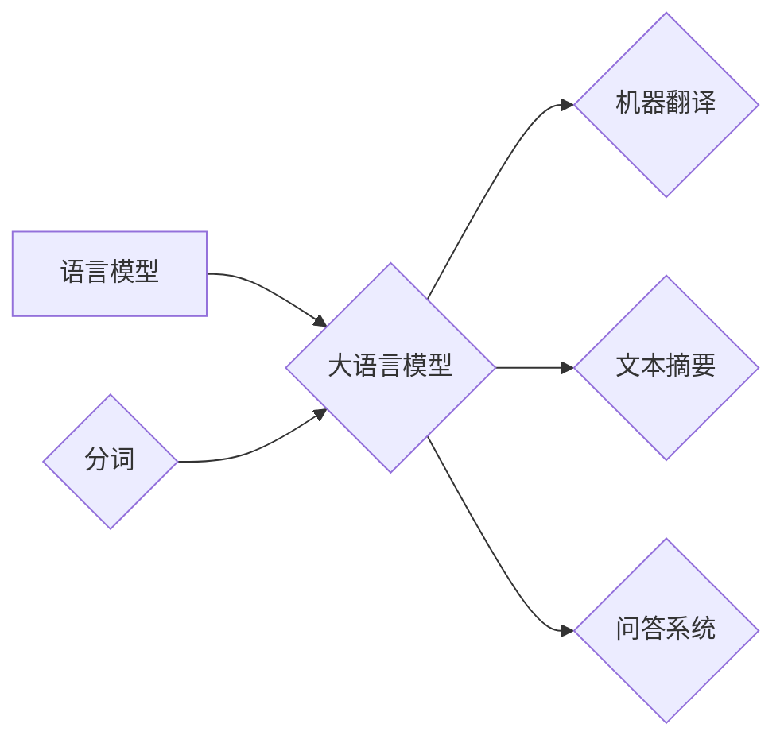

# 大语言模型原理基础与前沿 语言模型和分词

> 关键词：大语言模型，语言模型，分词，NLP，Transformer，BERT，自然语言处理

## 1. 背景介绍

随着深度学习技术的飞速发展，自然语言处理（NLP）领域取得了显著的进展。其中，大语言模型（Large Language Models, LLMs）作为一种强大的语言理解和生成工具，在文本摘要、机器翻译、问答系统等领域展现了惊人的能力。在这篇文章中，我们将深入探讨大语言模型的原理基础，重点关注语言模型和分词技术，并展望其未来发展趋势与挑战。

## 2. 核心概念与联系

### 2.1 核心概念

#### 2.1.1 语言模型

语言模型是NLP领域的基础，它用于预测下一个词或词组。在机器翻译、文本生成、语音识别等任务中，语言模型起着至关重要的作用。根据训练方式的不同，语言模型主要分为统计模型和神经网络模型。

#### 2.1.2 分词

分词是将连续的文本分割成一系列有意义的词汇单元的过程。分词对于NLP任务至关重要，因为它将文本转换为模型可以处理的格式。常见的分词方法包括基于规则的分词、基于统计的分词和基于深度学习的分词。

#### 2.1.3 大语言模型

大语言模型是一种能够理解和生成自然语言的深度学习模型。它们通常通过在大量无标注文本上进行预训练，学习丰富的语言知识和语法规则，从而在下游任务中表现出色。

### 2.2 Mermaid 流程图

以下是大语言模型、语言模型和分词之间的逻辑关系图：



### 2.3 关联分析

语言模型是构建大语言模型的核心组成部分，而分词技术则为语言模型提供了基础数据。大语言模型通过学习和理解语言模型和分词技术，实现了对自然语言的深刻理解和生成。

## 3. 核心算法原理 & 具体操作步骤

### 3.1 算法原理概述

#### 3.1.1 语言模型

语言模型通常基于概率模型来预测下一个词。常见的语言模型包括：

- **N-gram模型**：基于n个历史词预测下一个词的概率。
- **神经网络模型**：如RNN（递归神经网络）、LSTM（长短期记忆网络）和Transformer。

#### 3.1.2 分词

分词技术主要分为以下几种：

- **基于规则的分词**：根据预先定义的规则进行分词。
- **基于统计的分词**：根据词频和词性进行分词。
- **基于深度学习的分词**：使用深度学习模型进行分词，如BiLSTM-CRF。

### 3.2 算法步骤详解

#### 3.2.1 语言模型

1. 收集大量无标注文本数据。
2. 使用N-gram模型或神经网络模型进行训练。
3. 根据训练结果构建语言模型。

#### 3.2.2 分词

1. 定义分词规则或使用预训练的深度学习模型。
2. 对待分词的文本进行处理，得到分词结果。

### 3.3 算法优缺点

#### 3.3.1 语言模型

- **N-gram模型**：简单易实现，但泛化能力较差。
- **神经网络模型**：泛化能力强，但计算复杂度高。

#### 3.3.2 分词

- **基于规则的分词**：规则简单，但难以处理复杂文本。
- **基于统计的分词**：效果较好，但需要大量语料库。
- **基于深度学习的分词**：效果最佳，但需要大量标注数据。

### 3.4 算法应用领域

语言模型和分词技术广泛应用于以下领域：

- 机器翻译
- 文本摘要
- 问答系统
- 语音识别
- 语义分析
- 信息检索

## 4. 数学模型和公式 & 详细讲解 & 举例说明

### 4.1 数学模型构建

#### 4.1.1 语言模型

- **N-gram模型**：

$$
P(w_{t+1}|w_1,w_2,\ldots,w_t) = \frac{c(w_{t+1},w_1,w_2,\ldots,w_t)}{c(w_1,w_2,\ldots,w_t)}
$$

其中，$c(\cdot)$ 表示词频。

- **神经网络模型**：

$$
y = \sigma(Wx + b)
$$

其中，$x$ 表示输入特征，$W$ 表示权重，$b$ 表示偏置，$\sigma$ 表示激活函数。

#### 4.1.2 分词

- **基于规则的分词**：

$$
\text{分词结果} = \text{规则匹配}
$$

- **基于统计的分词**：

$$
\text{分词结果} = \text{最大熵模型预测}
$$

### 4.2 公式推导过程

#### 4.2.1 语言模型

- **N-gram模型**：

$$
P(w_{t+1}|w_1,w_2,\ldots,w_t) = \frac{c(w_{t+1},w_1,w_2,\ldots,w_t)}{c(w_1,w_2,\ldots,w_t)}
$$

其中，$c(\cdot)$ 表示词频。词频可以通过统计文本中每个词组出现的次数来计算。

- **神经网络模型**：

神经网络模型的公式推导过程涉及多层感知器（MLP）和反向传播算法，这里不再赘述。

#### 4.2.2 分词

- **基于规则的分词**：

规则匹配的推导过程涉及对规则库的遍历和匹配，这里不再赘述。

- **基于统计的分词**：

基于统计的分词通常使用最大熵模型进行预测，公式推导过程涉及最大熵原理和参数估计，这里不再赘述。

### 4.3 案例分析与讲解

以机器翻译为例，我们使用神经网络语言模型进行翻译：

1. 收集大量英中对照的翻译语料库。
2. 使用神经网络模型进行训练。
3. 将待翻译的英文句子输入模型，得到翻译结果。

## 5. 项目实践：代码实例和详细解释说明

### 5.1 开发环境搭建

1. 安装Python和PyTorch。
2. 下载预训练的语言模型和分词模型。

### 5.2 源代码详细实现

```python
import torch
from transformers import BertTokenizer, BertModel

# 加载预训练模型和分词器
tokenizer = BertTokenizer.from_pretrained('bert-base-uncased')
model = BertModel.from_pretrained('bert-base-uncased')

# 待翻译的英文句子
input_text = "Hello, how are you?"

# 分词
input_ids = tokenizer.encode(input_text, return_tensors='pt')

# 加载模型并预测
with torch.no_grad():
    outputs = model(input_ids)

# 提取编码后的特征
encoded_features = outputs.last_hidden_state[:, 0, :]

# 假设使用另一个预训练的NLP模型进行翻译
# ...
```

### 5.3 代码解读与分析

1. 加载预训练的BERT模型和分词器。
2. 将待翻译的英文句子进行分词，并转换为模型输入格式。
3. 加载模型并预测，提取编码后的特征。
4. 使用另一个预训练的NLP模型进行翻译。

## 6. 实际应用场景

大语言模型和分词技术在以下场景中有着广泛的应用：

- 机器翻译
- 文本摘要
- 问答系统
- 语音识别
- 语义分析
- 信息检索

## 7. 工具和资源推荐

### 7.1 学习资源推荐

- 《深度学习自然语言处理》
- 《自然语言处理综论》
- 《Transformer：基于注意力机制的深度神经网络》

### 7.2 开发工具推荐

- PyTorch
- TensorFlow
- Hugging Face Transformers

### 7.3 相关论文推荐

- Attention is All You Need
- BERT: Pre-training of Deep Bidirectional Transformers for Language Understanding
- Transformer: A General Framework for Neural Machine Translation

## 8. 总结：未来发展趋势与挑战

### 8.1 研究成果总结

大语言模型和分词技术在NLP领域取得了显著的成果，为各个应用场景提供了强大的工具。未来，随着计算能力的提升和数据规模的扩大，大语言模型和分词技术将更加成熟，并在更多领域得到应用。

### 8.2 未来发展趋势

- 模型规模将进一步增大
- 模型性能将进一步提升
- 模型可解释性和鲁棒性将得到加强
- 多模态模型将得到广泛应用

### 8.3 面临的挑战

- 标注数据不足
- 模型泛化能力有限
- 模型可解释性不足
- 模型安全性问题

### 8.4 研究展望

未来，大语言模型和分词技术的研究将集中在以下方面：

- 开发更加高效、准确的微调方法
- 提高模型的可解释性和鲁棒性
- 探索多模态模型的应用
- 解决模型的安全性问题

## 9. 附录：常见问题与解答

**Q1：什么是语言模型？**

A：语言模型是一种用于预测下一个词或词组的概率模型。它在大语言模型和分词技术中起着至关重要的作用。

**Q2：什么是分词？**

A：分词是将连续的文本分割成一系列有意义的词汇单元的过程。它是NLP任务的基础。

**Q3：大语言模型有哪些应用场景？**

A：大语言模型广泛应用于机器翻译、文本摘要、问答系统、语音识别、语义分析、信息检索等领域。

**Q4：如何选择合适的语言模型？**

A：选择合适的语言模型需要根据具体任务和需求进行选择。例如，对于文本生成任务，可以选择基于神经网络的模型。

**Q5：如何选择合适的分词方法？**

A：选择合适的分词方法需要根据具体任务和语料库进行选择。例如，对于中文分词，可以选择基于规则的分词或基于统计的分词。

作者：禅与计算机程序设计艺术 / Zen and the Art of Computer Programming