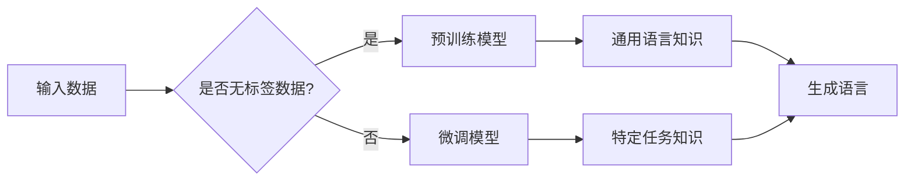

> 大语言模型，局限性，预训练，微调，泛化，可解释性，伦理，应用挑战

# 大语言模型应用指南：大语言模型的局限性

大语言模型（Large Language Models, LLMs）的兴起，无疑是自然语言处理（NLP）领域的一次重大突破。这些模型能够理解和生成自然语言，并在各种NLP任务中取得优异的性能。然而，尽管大语言模型在技术层面取得了显著的进展，它们的应用仍然面临着诸多局限性。本文将深入探讨大语言模型的局限性，并分析其背后的原因和潜在解决方案。

## 1. 背景介绍

### 1.1 大语言模型的兴起

近年来，随着计算能力的提升和大数据的积累，大语言模型得到了快速发展。这些模型通常基于深度学习技术，通过在大量文本数据上进行预训练，学习到丰富的语言知识和模式。BERT、GPT-3、LaMDA等模型都是大语言模型领域的代表。

### 1.2 大语言模型的应用

大语言模型在NLP领域的应用广泛，包括文本分类、机器翻译、问答系统、情感分析等。它们在处理自然语言任务方面展现出惊人的能力，为许多应用场景提供了强大的技术支持。

## 2. 核心概念与联系

### 2.1 大语言模型的概念

大语言模型是一种基于深度学习的模型，它通过在大量文本数据上进行预训练，学习到丰富的语言知识和模式，从而能够理解和生成自然语言。

### 2.2 预训练与微调

预训练是指在大规模无标签文本数据上训练模型，使其学习到通用的语言知识。微调是指在预训练的基础上，使用少量标注数据进一步训练模型，使其适应特定任务。

### 2.3 Mermaid 流程图



## 3. 核心算法原理 & 具体操作步骤

### 3.1 算法原理概述

大语言模型的原理主要基于深度学习技术，特别是Transformer模型。Transformer模型通过自注意力机制和位置编码，能够有效地捕捉文本中的长距离依赖关系。

### 3.2 算法步骤详解

1. 数据预处理：对文本数据进行清洗、分词等操作。
2. 预训练：在大量无标签文本数据上训练模型，学习通用语言知识。
3. 微调：在少量标注数据上微调模型，使其适应特定任务。
4. 模型评估：在测试集上评估模型性能。

### 3.3 算法优缺点

**优点**：

* 强大的语言理解和生成能力
* 能够处理复杂的语言任务
* 预训练模型可以复用于多个任务

**缺点**：

* 预训练数据可能包含偏见和误导性信息
* 模型可解释性差
* 计算资源消耗大

### 3.4 算法应用领域

* 文本分类
* 机器翻译
* 问答系统
* 情感分析
* 自动摘要
* 生成文本

## 4. 数学模型和公式 & 详细讲解 & 举例说明

### 4.1 数学模型构建

大语言模型的数学模型主要基于神经网络，包括输入层、隐藏层和输出层。输入层将文本数据转换为向量表示，隐藏层通过神经网络进行特征提取，输出层根据输入特征生成输出。

### 4.2 公式推导过程

$$
h = \sigma(W \cdot [h_{t-1}, x_t] + b)
$$

其中 $h$ 为隐藏层状态，$W$ 为权重矩阵，$x_t$ 为输入特征，$b$ 为偏置项，$\sigma$ 为非线性激活函数。

### 4.3 案例分析与讲解

以BERT模型为例，其预训练任务包括掩码语言模型和下一句预测。掩码语言模型对输入文本进行随机掩码，预测被掩码的单词。下一句预测则是预测输入文本的下一句。

## 5. 项目实践：代码实例和详细解释说明

### 5.1 开发环境搭建

1. 安装Python和pip
2. 安装PyTorch和Transformers库
3. 安装其他必要的库，如NumPy、Matplotlib等

### 5.2 源代码详细实现

```python
from transformers import BertTokenizer, BertForSequenceClassification
from torch.utils.data import DataLoader

# 加载预训练模型和分词器
tokenizer = BertTokenizer.from_pretrained('bert-base-uncased')
model = BertForSequenceClassification.from_pretrained('bert-base-uncased')

# 数据预处理
def preprocess(texts):
    encodings = tokenizer(texts, truncation=True, padding=True)
    return encodings['input_ids'], encodings['attention_mask']

# 训练数据
train_texts = ['This is a sample text.', 'Another sample text.']
train_labels = [0, 1]

# 转换为PyTorch DataLoader
train_dataset = DataLoader(train_texts, train_labels, batch_size=2)

# 训练模型
model.train()
for batch in train_dataset:
    input_ids, attention_mask = batch
    outputs = model(input_ids, attention_mask=attention_mask)
    loss = outputs.loss
    loss.backward()
    outputs.logits.grad.zero_()

# 保存模型
model.save_pretrained('my_model')
```

### 5.3 代码解读与分析

以上代码展示了如何使用Transformers库加载预训练模型、进行数据预处理、训练模型以及保存模型。

### 5.4 运行结果展示

运行代码后，模型会在训练集上进行训练，并在训练集和测试集上评估性能。

## 6. 实际应用场景

### 6.1 文本分类

大语言模型可以用于文本分类任务，如情感分析、主题分类等。通过微调预训练模型，可以使其适应特定领域的文本分类任务。

### 6.2 机器翻译

大语言模型可以用于机器翻译任务，如将一种语言翻译成另一种语言。通过微调预训练模型，可以使其适应特定语言对的翻译任务。

### 6.3 问答系统

大语言模型可以用于问答系统，如基于知识图谱的问答系统。通过微调预训练模型，可以使其适应特定领域的问题和答案。

## 7. 工具和资源推荐

### 7.1 学习资源推荐

* 《深度学习自然语言处理》
* 《自然语言处理入门：基于深度学习的NLP》
* Transformers库官方文档

### 7.2 开发工具推荐

* PyTorch
* TensorFlow
* Transformers库

### 7.3 相关论文推荐

* Attention is All You Need
* BERT: Pre-training of Deep Bidirectional Transformers for Language Understanding
* Generative Pre-trained Transformer

## 8. 总结：未来发展趋势与挑战

### 8.1 研究成果总结

大语言模型在NLP领域取得了显著的进展，为各种NLP任务提供了强大的技术支持。

### 8.2 未来发展趋势

* 模型规模将进一步扩大
* 微调方法将更加高效
* 模型将更加可解释和可靠
* 模型将应用于更多领域

### 8.3 面临的挑战

* 预训练数据的偏差
* 模型的可解释性
* 模型的伦理问题
* 模型的计算资源消耗

### 8.4 研究展望

未来，大语言模型将面临更多的挑战和机遇。通过不断的研究和探索，我们有理由相信，大语言模型将会在NLP领域发挥更大的作用，为人类社会带来更多的价值。

## 9. 附录：常见问题与解答

**Q1：大语言模型是否完全取代传统NLP技术？**

A：大语言模型并不是完全取代传统NLP技术，而是作为一种补充和增强工具，与传统的NLP技术共同推动NLP领域的进步。

**Q2：大语言模型是否能够理解自然语言？**

A：大语言模型能够理解自然语言到一定程度，但仍然存在局限性。例如，它们可能无法理解复杂的语义和隐含意义。

**Q3：大语言模型的训练需要多少数据？**

A：大语言模型的训练需要大量数据，通常需要数百万甚至数十亿个文本样本。

**Q4：大语言模型的计算资源消耗有多大？**

A：大语言模型的计算资源消耗很大，通常需要高性能的GPU或TPU进行训练。

**Q5：大语言模型的应用前景如何？**

A：大语言模型的应用前景非常广阔，将在各种NLP任务中发挥重要作用。

---

作者：禅与计算机程序设计艺术 / Zen and the Art of Computer Programming