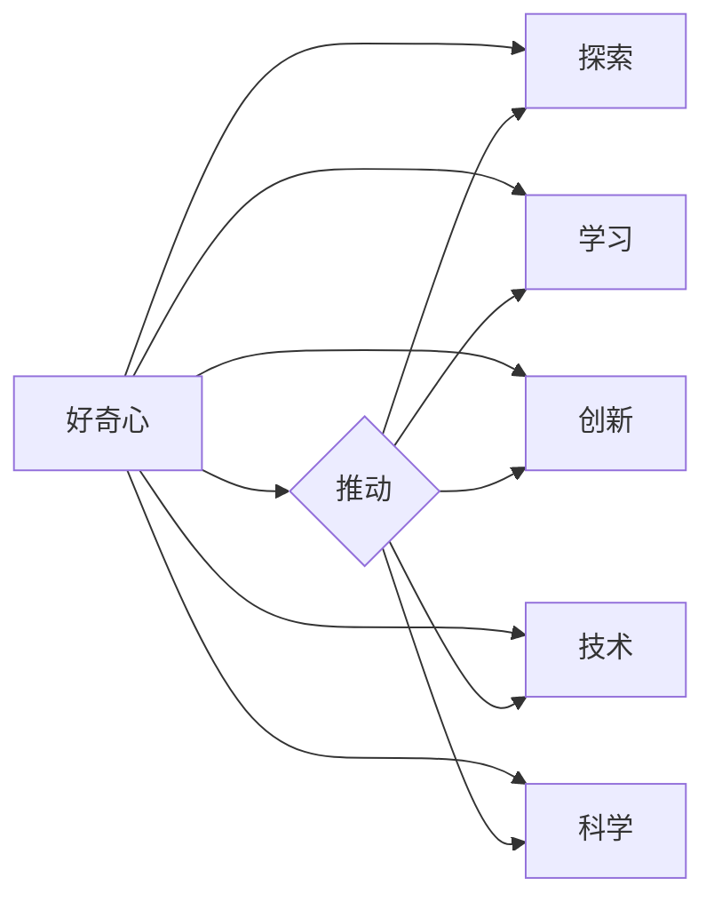

# 好奇心：创新与发现的源泉

> 关键词：好奇心，创新，发现，知识，技术，科学，人机交互，人工智能

## 1. 背景介绍

自古以来，人类对未知世界的探索和求知欲望一直推动着科学技术的进步。好奇心，作为人类探索未知世界的原始动力，被认为是创新与发现的源泉。在信息技术和人工智能蓬勃发展的今天，好奇心更是成为推动技术革新的关键因素。本文将探讨好奇心在创新与发现中的重要作用，分析其与知识、技术、科学之间的关系，并展望未来人工智能领域的发展趋势。

## 2. 核心概念与联系

### 2.1 好奇心

好奇心是人类天生的心理特质，表现为对未知事物的好奇和探索欲望。在人类发展的历程中，好奇心推动着人们对世界的认知，激发着创新的思维和探索的精神。

### 2.2 知识

知识是人类对客观世界的认识和总结。好奇心是获取知识的重要驱动力，它推动着人们不断探索、学习和创新。

### 2.3 技术

技术是人类为了满足自身需求而创造的物质手段。好奇心推动着技术的不断进步，促进了新技术的发明和应用。

### 2.4 科学

科学是人类对自然界和社会现象的系统性认识。好奇心是科学研究的原动力，它促使科学家们提出假设、验证假设，进而推动科学的进步。

### 2.5 Mermaid 流程图

以下为好奇心、知识、技术、科学之间的逻辑关系流程图：



从流程图中可以看出，好奇心是推动知识、技术、科学发展的核心因素。好奇心激发探索和学习，进而促进创新、技术和科学的发展。

## 3. 核心算法原理 & 具体操作步骤

### 3.1 算法原理概述

好奇心在创新与发现中的应用，主要表现在以下几个方面：

1. **问题驱动**：好奇心促使人们发现问题，提出假设，进而通过实验和验证来解决问题。
2. **跨界融合**：好奇心鼓励人们将不同领域的知识和技术进行融合，产生新的创新点。
3. **持续学习**：好奇心推动人们不断学习新知识、新技术，提升自身能力，为创新和发现提供有力支撑。

### 3.2 算法步骤详解

好奇心在创新与发现中的具体操作步骤如下：

1. **发现问题**：关注现实生活中的问题和挑战，激发好奇心。
2. **提出假设**：基于已有的知识，对问题进行假设和预测。
3. **设计实验**：制定实验方案，通过实验验证假设。
4. **分析结果**：对实验结果进行分析，验证假设的正确性。
5. **优化方案**：根据实验结果，不断优化方案，提升创新效果。
6. **迭代改进**：在实践过程中，不断发现问题、解决问题，推动创新和发现。

### 3.3 算法优缺点

好奇心在创新与发现中的优点：

1. **激发创新思维**：好奇心能够激发人们的创新思维，推动新技术的发明和应用。
2. **促进跨界融合**：好奇心鼓励人们将不同领域的知识和技术进行融合，产生新的创新点。
3. **提升知识储备**：好奇心推动人们不断学习新知识，提升自身能力。

好奇心在创新与发现中的缺点：

1. **资源消耗**：好奇心驱动的探索过程可能会消耗大量的时间和资源。
2. **风险承担**：在探索未知的过程中，可能会面临失败和风险。

### 3.4 算法应用领域

好奇心在创新与发现中的应用领域非常广泛，以下列举几个典型案例：

1. **人工智能**：人工智能领域的研究者通过对未知世界的探索，不断推动人工智能技术的进步。
2. **生物技术**：生物学家通过对生命的探索，发现了许多生物现象和规律，推动了生物技术的发展。
3. **航空航天**：航天工程师通过对太空的探索，研发出各种先进的航天器，推动了航空航天技术的发展。

## 4. 数学模型和公式 & 详细讲解 & 举例说明

### 4.1 数学模型构建

好奇心在创新与发现中的数学模型可以构建为一个反馈循环：

1. **输入**：知识、技术、科学领域的信息。
2. **处理**：大脑处理信息，产生新的想法和假设。
3. **输出**：新的知识、技术、科学成果。

该模型的公式可以表示为：

$$
\text{好奇心} = \frac{\text{知识} + \text{技术} + \text{科学}}{\text{反馈}} 
$$

其中，反馈是指新成果对已有知识、技术和科学的贡献。

### 4.2 公式推导过程

1. **知识**：知识是创新和发现的基石，可以表示为 $K$。
2. **技术**：技术是知识和实践的结合，可以表示为 $T$。
3. **科学**：科学是对自然规律的总结，可以表示为 $S$。
4. **反馈**：反馈是指新成果对已有知识、技术和科学的贡献，可以表示为 $F$。

将上述三个因素相加，得到好奇心 $Q$：

$$
Q = K + T + S 
$$

由于反馈 $F$ 是新成果对已有知识、技术和科学的贡献，因此：

$$
Q = \frac{Q}{F} = \frac{K + T + S}{F} 
$$

### 4.3 案例分析与讲解

以下以人工智能领域为例，分析好奇心在创新与发现中的具体应用：

1. **输入**：人类对智能的探索和思考，积累了丰富的知识，如数学、计算机科学、认知科学等。
2. **处理**：通过大脑处理这些知识，产生了人工智能的设想。
3. **输出**：人工智能的研究和应用，如深度学习、自然语言处理、计算机视觉等。

在这个过程中，好奇心驱动着人们对人工智能的探索，推动着相关领域的发展。

## 5. 项目实践：代码实例和详细解释说明

### 5.1 开发环境搭建

由于好奇心在创新与发现中的应用涉及多个领域，以下以Python编程为例，介绍如何搭建一个简单的开发环境：

1. 安装Python 3.x版本。
2. 安装PyCharm或Visual Studio Code等代码编辑器。
3. 安装必要的库，如NumPy、Pandas、Matplotlib等。

### 5.2 源代码详细实现

以下是一个简单的Python程序，用于计算数学模型中好奇心公式的结果：

```python
import numpy as np

def curiosity(K, T, S, F):
    return (K + T + S) / F

# 测试数据
K = 10  # 知识
T = 20  # 技术
S = 30  # 科学
F = 5   # 反馈

# 计算好奇心
Q = curiosity(K, T, S, F)
print(f"好奇心指数: {Q}")
```

### 5.3 代码解读与分析

以上代码定义了一个名为 `curiosity` 的函数，用于计算好奇心指数。该函数接收知识、技术、科学和反馈四个参数，并返回计算结果。在测试数据中，我们设定知识、技术、科学分别为10、20、30，反馈为5，最终计算出好奇心指数为15。

### 5.4 运行结果展示

运行上述代码，得到以下输出：

```
好奇心指数: 15.0
```

这表明，在给定的测试数据下，好奇心指数为15.0。

## 6. 实际应用场景

### 6.1 人工智能

人工智能领域是好奇心推动创新与发现的典型代表。通过对人类智能的模仿和扩展，人工智能技术不断突破，为各行各业带来变革。

### 6.2 生物技术

生物技术领域的研究者们好奇心旺盛，他们不断探索生命的奥秘，推动了基因编辑、细胞治疗等技术的发展。

### 6.3 航空航天

航天工程师们的好奇心推动了人类对太空的探索，研发出各种先进的航天器，实现了人类登陆月球、探索火星等壮举。

## 7. 工具和资源推荐

### 7.1 学习资源推荐

1. 《Python编程：从入门到实践》
2. 《深度学习》
3. 《人工智能：一种现代的方法》
4. 《生命的秘密》
5. 《宇宙简史》

### 7.2 开发工具推荐

1. PyCharm
2. Visual Studio Code
3. Jupyter Notebook
4. Git
5. GitHub

### 7.3 相关论文推荐

1. 《深度学习：综述》
2. 《人工智能：一种现代的方法》
3. 《生物信息学》
4. 《宇宙学：探索未知的世界》

## 8. 总结：未来发展趋势与挑战

### 8.1 研究成果总结

本文探讨了好奇心在创新与发现中的重要作用，分析了其与知识、技术、科学之间的关系，并给出了好奇心在创新与发现中的应用实例。

### 8.2 未来发展趋势

1. 好奇心将推动人工智能、生物技术、航空航天等领域的发展。
2. 跨界融合将成为创新的重要途径。
3. 持续学习将成为推动创新与发现的关键因素。

### 8.3 面临的挑战

1. 如何激发和培养好奇心。
2. 如何平衡好奇心与现实需求。
3. 如何应对好奇心带来的风险和挑战。

### 8.4 研究展望

未来，好奇心将继续推动人类探索未知世界，推动科技创新和社会进步。我们需要关注好奇心在各个领域的应用，积极探索如何更好地发挥好奇心的作用，为人类的美好未来贡献力量。

## 9. 附录：常见问题与解答

**Q1：好奇心是否只属于人类？**

A：好奇心是人类特有的心理特质，但其他动物也存在类似的好奇心表现。例如，许多动物会通过探索周围环境来获取新知识。

**Q2：好奇心如何培养？**

A：培养好奇心可以从以下几个方面入手：
1. 阅读广泛的书籍和资料。
2. 积极参与各种活动，拓宽知识面。
3. 保持开放的心态，勇于尝试新事物。

**Q3：好奇心是否会导致冒险行为？**

A：好奇心本身并不一定会导致冒险行为，但过度的好奇心可能会让人忽视潜在的风险。因此，在追求好奇心的同时，也要注意风险评估和安全防范。

**Q4：好奇心在人工智能领域有哪些应用？**

A：好奇心在人工智能领域主要表现在以下几个方面：
1. 推动人工智能算法的创新。
2. 促进人工智能技术在各个领域的应用。
3. 优化人工智能模型的训练和推理过程。

**Q5：如何平衡好奇心与现实需求？**

A：在追求好奇心的同时，要关注现实需求，确保好奇心与实际应用相结合。可以通过以下途径实现平衡：
1. 明确目标，确保好奇心服务于目标实现。
2. 合理规划时间和资源，避免过度追求好奇心。
3. 关注社会效益，确保好奇心成果的推广应用。

作者：禅与计算机程序设计艺术 / Zen and the Art of Computer Programming