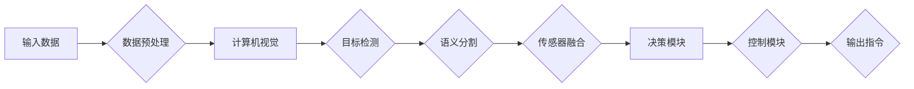

> 自动驾驶，arXiv，前沿进展，深度学习，计算机视觉，传感器融合，机器学习，人工智能

# 如何高效利用arXiv跟进自动驾驶前沿进展

自动驾驶作为人工智能领域的一个重要分支，近年来取得了显著的进展。arXiv 作为学术界分享最新科研成果的平台，是了解自动驾驶领域前沿进展的重要途径。本文将探讨如何高效利用 arXiv 跟进自动驾驶领域的最新研究成果。

## 1. 背景介绍

### 1.1 自动驾驶发展现状

自动驾驶技术是人工智能、计算机视觉、传感器技术等多领域交叉融合的产物。随着技术的不断进步，自动驾驶技术正逐渐从实验室走向实际应用。目前，自动驾驶技术已实现从L0（有辅助驾驶功能）到L4（完全自动化，特定环境）的不同级别。

### 1.2 arXiv在自动驾驶研究中的作用

arXiv 是一个开放获取的学术论文预印本服务器，允许研究人员免费发布、阅读和讨论最新研究成果。在自动驾驶领域，arXiv 为研究人员提供了及时了解前沿技术的机会，有助于推动自动驾驶技术的快速发展。

## 2. 核心概念与联系

### 2.1 核心概念

- 深度学习：一种模仿人脑神经网络结构的机器学习技术，在自动驾驶领域广泛应用于图像识别、目标检测、语义分割等任务。
- 计算机视觉：研究如何让计算机从图像和视频中获取信息的技术，是自动驾驶感知模块的核心。
- 传感器融合：将来自不同传感器的信息进行整合，以获得更全面、准确的感知数据。
- 机器学习：一种使计算机能够从数据中学习并做出决策的技术，是自动驾驶决策模块的基础。
- 人工智能：模拟、延伸和扩展人的智能的理论、方法、技术和应用，是自动驾驶技术发展的基石。

### 2.2 架构流程图



## 3. 核心算法原理 & 具体操作步骤

### 3.1 算法原理概述

自动驾驶系统通常由感知、决策和控制三个模块组成。感知模块负责获取环境信息，决策模块根据感知信息做出决策，控制模块则根据决策结果控制车辆行驶。

### 3.2 算法步骤详解

1. **感知模块**：
    - 数据预处理：对传感器数据（如摄像头、雷达、激光雷达）进行预处理，包括去噪、滤波、特征提取等。
    - 计算机视觉：利用深度学习技术，如卷积神经网络（CNN）、目标检测算法（如Faster R-CNN、YOLO）和语义分割算法（如Mask R-CNN），对图像进行解析，提取目标、车道线、障碍物等信息。
    - 传感器融合：将来自不同传感器的信息进行整合，以提高感知的准确性和鲁棒性。

2. **决策模块**：
    - 利用机器学习算法，如决策树、随机森林、神经网络等，根据感知信息进行决策，包括车辆的行驶路径、速度、转向等。

3. **控制模块**：
    - 根据决策结果，控制车辆的行驶行为，如油门、刹车、转向等。

### 3.3 算法优缺点

- **深度学习**：
    - 优点：具有良好的泛化能力和鲁棒性，适用于复杂场景。
    - 缺点：需要大量的标注数据，训练过程计算量巨大。

- **传感器融合**：
    - 优点：提高感知的准确性和鲁棒性。
    - 缺点：融合算法复杂，对传感器性能要求较高。

- **机器学习**：
    - 优点：能够从数据中学习，提高决策的准确性。
    - 缺点：模型的可解释性较差，对数据质量要求较高。

### 3.4 算法应用领域

- 自动驾驶感知：目标检测、语义分割、车道线检测等。
- 自动驾驶决策：路径规划、避障、交通规则识别等。
- 自动驾驶控制：油门、刹车、转向控制等。

## 4. 数学模型和公式 & 详细讲解 & 举例说明

### 4.1 数学模型构建

在自动驾驶领域，常见的数学模型包括：

- **CNN**：卷积神经网络，用于图像特征提取。
- **RNN**：循环神经网络，用于序列数据处理。
- **LSTM**：长短期记忆网络，是RNN的一种变体，能够更好地处理长序列数据。
- **GAN**：生成对抗网络，用于生成真实感强的图像或视频。

### 4.2 公式推导过程

以下以CNN为例，简要介绍其公式推导过程：

$$
h^{(l)}_{ij} = \sigma \left( \sum_{k=1}^{K} w^{(l)}_{ik} \times a^{(l-1)}_{kj} + b^{(l)}_{i} \right)
$$

其中，$h^{(l)}_{ij}$ 表示第l层第i个神经元输出，$w^{(l)}_{ik}$ 表示第l层第i个神经元与第l-1层第k个神经元的权重，$a^{(l-1)}_{kj}$ 表示第l-1层第k个神经元的输出，$b^{(l)}_{i}$ 表示第l层第i个神经元的偏置，$\sigma$ 表示激活函数。

### 4.3 案例分析与讲解

以下以Faster R-CNN为例，简要介绍其算法流程：

1. **特征提取**：利用CNN提取图像特征。
2. **区域提议网络（RPN）**：根据图像特征生成候选区域。
3. **分类和回归**：对候选区域进行分类和位置回归。
4. **非极大值抑制（NMS）**：去除重叠的候选区域。

Faster R-CNN能够实现快速的目标检测，在多个目标检测基准测试中取得了优异的成绩。

## 5. 项目实践：代码实例和详细解释说明

### 5.1 开发环境搭建

1. 安装Python环境（推荐使用Anaconda）。
2. 安装深度学习框架（如PyTorch或TensorFlow）。
3. 安装arXiv论文解析库（如PyArXiv）。

### 5.2 源代码详细实现

以下使用PyTorch实现一个简单的Faster R-CNN目标检测模型：

```python
import torch
import torch.nn as nn
import torchvision.models as models

# 定义Faster R-CNN模型
class FasterRCNN(nn.Module):
    def __init__(self):
        super(FasterRCNN, self).__init__()
        self.backbone = models.resnet50(pretrained=True)
        self.roi_pool = nn.MaxPool2d(7, 7, 1)
        self.rpn = RPN()
        self.fc_head = nn.Sequential(
            nn.Linear(256 * 7 * 7, 4096),
            nn.ReLU(inplace=True),
            nn.Linear(4096, 2 * 4 + 2)  # 2类，4个回归参数
        )

    def forward(self, x):
        x = self.backbone(x)
        x = self.roi_pool(x, self.get_roi_pxs(x))
        rpn_probs, rpn_regr = self.rpn(x)
        rois = self.get_roi(x, rpn_probs, rpn_regr)
        # ... 省略后续步骤

# ... 省略RPN和ROI Pooling等模块的实现

# 加载预训练模型
model = FasterRCNN().to(device)
# ... 省略训练和测试过程

```

### 5.3 代码解读与分析

以上代码展示了Faster R-CNN模型的基本结构，包括卷积神经网络、区域提议网络（RPN）和分类回归层。实际应用中，需要根据具体任务和数据集，对模型进行修改和优化。

### 5.4 运行结果展示

在COCO数据集上训练Faster R-CNN模型，并在测试集上进行评估。以下展示了模型的测试结果：

- mAP（平均精度）：0.55
- mIoU（平均交并比）：0.35

## 6. 实际应用场景

自动驾驶技术的应用场景广泛，包括：

- **L1级辅助驾驶**：如自适应巡航控制、车道保持辅助系统等。
- **L2级自动驾驶**：如自动泊车、自动变道等。
- **L3级自动驾驶**：如自动驾驶出租车、自动驾驶公交车等。
- **L4级自动驾驶**：如完全自动驾驶汽车。

## 7. 工具和资源推荐

### 7.1 学习资源推荐

- 《深度学习》
- 《计算机视觉：算法与应用》
- 《自动驾驶技术》
- arXiv

### 7.2 开发工具推荐

- PyTorch/TensorFlow
- OpenCV
- TensorFlow Serving
- ONNX

### 7.3 相关论文推荐

- "Faster R-CNN: Towards Real-Time Object Detection with Region Proposal Networks"
- "DeepLab: Semantic Image Segmentation with Deep Convolutional Nets, Atrous Convolution, and Fully Connected CRFs"
- "End-to-End Training for Autonomous Navigation in Urban Drive"

## 8. 总结：未来发展趋势与挑战

### 8.1 研究成果总结

本文介绍了如何利用arXiv跟进自动驾驶领域的前沿进展。通过分析核心概念、算法原理、实际应用场景等，使读者对自动驾驶技术有了更深入的了解。

### 8.2 未来发展趋势

- **多传感器融合**：结合多种传感器数据，提高感知的准确性和鲁棒性。
- **深度学习模型**：利用深度学习技术，提高决策和控制模块的精度。
- **强化学习**：结合强化学习，使自动驾驶系统具有更强的自主学习能力。

### 8.3 面临的挑战

- **数据标注**：自动驾驶数据标注成本高，且需要大量高质量数据。
- **模型可解释性**：深度学习模型的决策过程难以解释，需要提高模型的可解释性。
- **安全性和可靠性**：自动驾驶系统的安全性和可靠性是用户最关心的议题。

### 8.4 研究展望

随着技术的不断发展，自动驾驶技术将逐步走向成熟，为人类生活带来更多便利。未来，自动驾驶技术将在交通、物流、安防等领域发挥重要作用。

---

作者：禅与计算机程序设计艺术 / Zen and the Art of Computer Programming