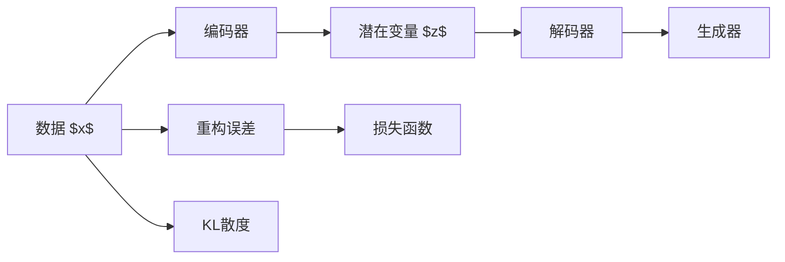
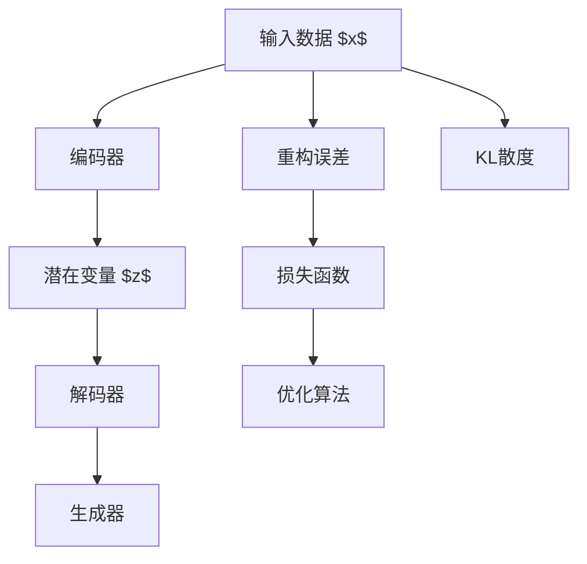
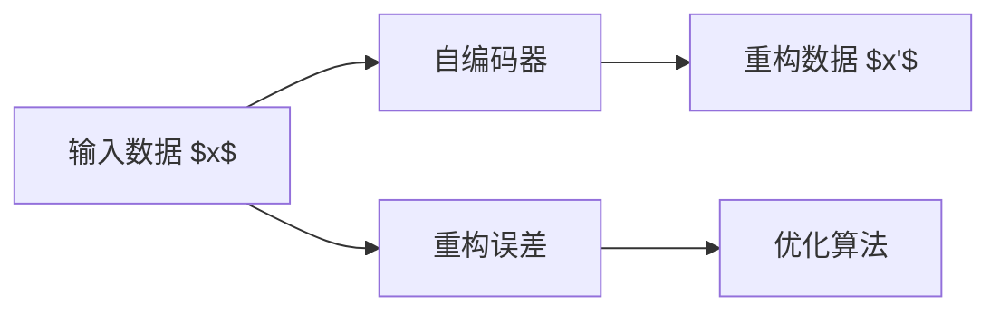
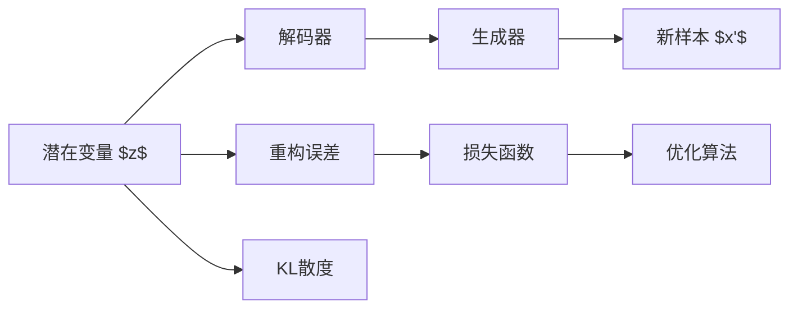
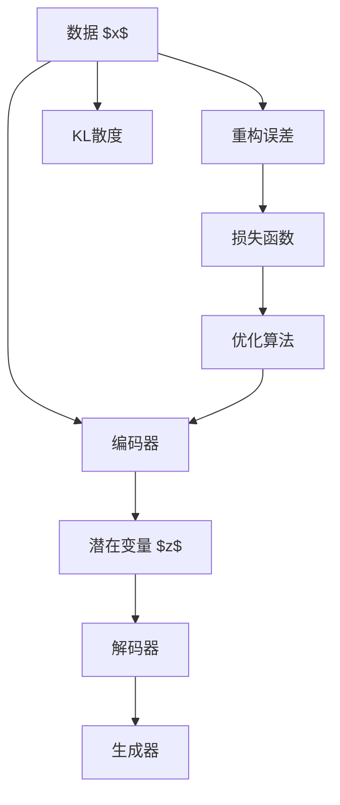

                 

# Variational Autoencoders (VAE)原理与代码实例讲解

> 关键词：变分自编码器(VAE), 深度学习, 降维, 生成模型, 概率图模型, KL散度, 重构误差, 隐变量, 训练技巧

## 1. 背景介绍

### 1.1 问题由来
变分自编码器（Variational Autoencoder，VAE）是深度学习领域中的一种生成模型，主要应用于数据降维和生成新样本。VAE通过学习数据的潜在分布，从而进行数据的压缩和重构，并能够生成符合原始数据分布的新样本。自2013年由Kingma和Welling提出以来，VAE在图像、音频、文本等数据类型的降维和生成上取得了显著成效，吸引了众多学者的研究兴趣。

近年来，VAE在计算机视觉领域的研究热点主要是对图像降维和生成新图像的任务，同时也在视频分析、文本生成等方向进行了拓展应用。在图像降维方面，VAE能够将高维图像数据压缩到低维空间，同时保留了数据的特征信息，使得在后续任务中，对低维数据的处理更为高效；在生成新图像方面，VAE能够根据潜在分布生成与原始数据相似的图像，具有较高的生成质量。

### 1.2 问题核心关键点
VAE的核心思想是将数据表示为一个随机变量 $z$ 和一个可学习变换 $g$ 的组合。具体来说，$z$ 是数据 $x$ 的一个潜在表示，$g$ 是一个从潜在表示 $z$ 到数据 $x$ 的逆变换。VAE通过最大化似然函数 $p(x)$ 来训练模型，同时通过对潜在变量 $z$ 施加约束条件，使得 $z$ 能够表示为任意数据分布的采样。

VAE的关键步骤包括：
1. 设计编码器：将输入数据 $x$ 映射到潜在空间 $z$，通常使用多层神经网络来实现。
2. 设计解码器：从潜在空间 $z$ 映射回数据空间 $x$，同样使用多层神经网络来实现。
3. 定义损失函数：通常使用重构误差和KL散度来度量模型拟合数据的程度。

VAE的目标是通过训练编码器和解码器，使得模型能够准确地生成与原始数据相似的新样本，同时压缩数据以减少存储需求。

### 1.3 问题研究意义
VAE作为一种高效的生成模型，在数据降维和生成新样本方面具有独特的优势，适用于需要生成新数据或对数据进行压缩处理的场景。VAE在图像生成、文本生成、音频生成等领域具有广泛的应用前景，能够生成与原始数据相似的新数据，从而在数据增强、图像修复、图像转换等任务中发挥重要作用。

VAE的应用不仅限于生成和降维任务，还可以用于探索数据的潜在结构、实现数据可视化、进行无监督学习等。在未来的研究中，VAE有望进一步拓展其应用范围，与其他深度学习技术相结合，探索新的应用场景和算法。

## 2. 核心概念与联系

### 2.1 核心概念概述

为了更好地理解VAE的原理和应用，我们首先介绍几个关键概念：

- 变分自编码器（Variational Autoencoder，VAE）：一种深度生成模型，通过学习数据的潜在分布，对高维数据进行降维和生成新样本。
- 潜在变量（Latent Variable，$z$）：表示数据的潜在表示，通常是一个随机变量，通过编码器映射到数据空间。
- 解码器（Decoder）：将潜在变量 $z$ 映射回数据空间，得到生成的新样本。
- 编码器（Encoder）：将数据 $x$ 映射到潜在变量 $z$ 空间，通常使用多层神经网络实现。
- KL散度（Kullback-Leibler Divergence，KL Divergence）：一种度量两个概率分布之间距离的方法，常用于VAE中优化潜在变量的分布。
- 重构误差（Reconstruction Error）：度量生成器对原始数据的重构精度，通常通过均方误差（MSE）或交叉熵（Cross-Entropy）来衡量。
- 生成器（Generative Model）：负责生成新样本的模型，通常使用多层神经网络实现。
- 损失函数（Loss Function）：用于衡量模型生成的样本与真实数据之间的差异，通常包括重构误差和KL散度。

这些概念通过以下Mermaid流程图来展示：



### 2.2 概念间的关系

以下通过几个Mermaid流程图来展示这些概念之间的关系：

#### 2.2.1 VAE的学习流程



这个流程图展示了VAE的基本学习流程，即通过编码器将输入数据映射到潜在空间，然后使用解码器将潜在变量映射回数据空间，计算重构误差和KL散度，最后通过优化算法最小化损失函数。

#### 2.2.2 VAE与自编码器的关系



自编码器（Autoencoder）是VAE的一种特殊形式，其目标是通过学习数据 $x$ 和重构数据 $x'$ 之间的映射关系，最小化重构误差。VAE与自编码器的主要区别在于，VAE引入了潜在变量 $z$，能够对数据进行更加灵活的降维和生成处理。

#### 2.2.3 VAE在生成任务中的应用



这个流程图展示了VAE在生成新样本 $x'$ 的过程，即通过潜在变量 $z$ 和解码器生成新样本，同时计算重构误差和KL散度，最后通过优化算法最小化损失函数。

### 2.3 核心概念的整体架构

最后，我们用一个综合的流程图来展示这些核心概念在大模型微调过程中的整体架构：



这个综合流程图展示了从数据 $x$ 到潜在变量 $z$，再到新样本 $x'$ 的完整流程，同时说明了重构误差和KL散度在损失函数中的作用，以及优化算法在训练过程中的作用。

## 3. 核心算法原理 & 具体操作步骤
### 3.1 算法原理概述

VAE通过学习数据的潜在分布，将数据 $x$ 映射到潜在空间 $z$，然后再从潜在空间 $z$ 映射回数据空间 $x$。VAE的训练目标是通过最小化重构误差和KL散度来优化模型，使得模型生成的数据与原始数据尽可能相似，同时潜在变量的分布与预设分布尽可能接近。

具体来说，VAE的训练过程分为两个部分：
1. 编码器将输入数据 $x$ 映射到潜在变量 $z$。
2. 解码器将潜在变量 $z$ 映射回数据 $x'$，并计算重构误差。

VAE的损失函数由重构误差和KL散度组成，具体如下：

$$
\mathcal{L} = \mathbb{E}_{q(z|x)}[\log p(x'|z)] + \mathbb{E}_{q(z|x)}[\log \frac{q(z|x)}{p(z)}]
$$

其中，$p(x'|z)$ 表示解码器从潜在变量 $z$ 生成新数据 $x'$ 的概率，$q(z|x)$ 表示编码器从数据 $x$ 采样潜在变量 $z$ 的概率，$q(z|x)$ 和 $p(z)$ 分别表示潜在变量 $z$ 的条件概率和先验概率，$KL$ 散度用于度量两个概率分布之间的距离。

### 3.2 算法步骤详解

以下是VAE的详细算法步骤：

#### 3.2.1 模型定义

1. **编码器**：将输入数据 $x$ 映射到潜在变量 $z$，通常使用多层神经网络实现。
   $$
   z = \mu(x) + \sigma(x)\epsilon
   $$
   其中，$\mu(x)$ 和 $\sigma(x)$ 分别表示编码器的均值和标准差，$\epsilon$ 是一个随机变量。

2. **解码器**：将潜在变量 $z$ 映射回数据 $x'$，同样使用多层神经网络实现。
   $$
   x' = g(z)
   $$
   其中，$g$ 是解码器，通常是一个全连接神经网络。

3. **生成器**：根据潜在变量 $z$ 生成新数据 $x'$，通常使用与解码器相同的神经网络。

#### 3.2.2 损失函数定义

VAE的损失函数由重构误差和KL散度组成，具体如下：

1. **重构误差**：衡量解码器生成的数据 $x'$ 与原始数据 $x$ 之间的差异。
   $$
   L_{recon} = -\mathbb{E}_{q(z|x)}\log p(x'|z)
   $$

2. **KL散度**：衡量潜在变量 $z$ 的条件概率 $q(z|x)$ 和先验概率 $p(z)$ 之间的距离。
   $$
   L_{KL} = \mathbb{E}_{q(z|x)}[\log \frac{q(z|x)}{p(z)}]
   $$

#### 3.2.3 优化算法

VAE的优化目标是最小化损失函数 $\mathcal{L}$，通常使用随机梯度下降（SGD）或其变种如AdamW等优化算法进行训练。

### 3.3 算法优缺点

VAE的优点包括：
1. 能够进行数据的降维和生成新样本，适用于需要数据压缩和生成新数据的场景。
2. 可以生成高质量的新样本，适用于图像、音频、文本等生成任务。
3. 可以进行无监督学习，适用于缺乏标注数据的任务。

VAE的缺点包括：
1. 计算复杂度高，训练过程中需要进行大量的随机采样，需要较长的训练时间。
2. 重构误差和KL散度之间的平衡难以控制，容易陷入局部最优解。
3. 模型过于复杂，难以解释模型内部的工作机制。

### 3.4 算法应用领域

VAE在计算机视觉、自然语言处理、音频处理等领域具有广泛的应用前景，具体包括：

1. **图像生成**：VAE能够生成与原始图像相似的图像，适用于图像修复、图像转换、图像生成等任务。
2. **图像降维**：VAE能够将高维图像数据压缩到低维空间，适用于图像检索、图像分类等任务。
3. **文本生成**：VAE能够生成与原始文本相似的文本，适用于文本生成、文本摘要、文本分类等任务。
4. **音频生成**：VAE能够生成与原始音频相似的音频，适用于音频生成、音频分类等任务。
5. **数据可视化**：VAE能够将高维数据映射到低维空间，适用于数据可视化、异常检测等任务。
6. **无监督学习**：VAE可以用于无监督学习，适用于缺乏标注数据的任务。

## 4. 数学模型和公式 & 详细讲解 & 举例说明

### 4.1 数学模型构建

VAE的数学模型由编码器、解码器、潜在变量 $z$ 和生成器组成，具体如下：

1. **编码器**：将输入数据 $x$ 映射到潜在变量 $z$。
   $$
   z = \mu(x) + \sigma(x)\epsilon
   $$
   其中，$\mu(x)$ 和 $\sigma(x)$ 分别表示编码器的均值和标准差，$\epsilon$ 是一个随机变量，通常使用标准正态分布 $N(0,1)$。

2. **解码器**：将潜在变量 $z$ 映射回数据 $x'$。
   $$
   x' = g(z)
   $$
   其中，$g$ 是解码器，通常是一个全连接神经网络。

3. **生成器**：根据潜在变量 $z$ 生成新数据 $x'$。
   $$
   x' = g(z)
   $$
   其中，$g$ 是生成器，通常与解码器相同。

4. **潜在变量的分布**：通常假设潜在变量 $z$ 服从标准正态分布 $N(0,1)$。

### 4.2 公式推导过程

以下是VAE的公式推导过程：

1. **重构误差**：
   $$
   L_{recon} = -\mathbb{E}_{q(z|x)}\log p(x'|z)
   $$
   其中，$q(z|x)$ 表示编码器从数据 $x$ 采样潜在变量 $z$ 的概率，$p(x'|z)$ 表示解码器从潜在变量 $z$ 生成新数据 $x'$ 的概率。

2. **KL散度**：
   $$
   L_{KL} = \mathbb{E}_{q(z|x)}[\log \frac{q(z|x)}{p(z)}]
   $$
   其中，$q(z|x)$ 表示编码器从数据 $x$ 采样潜在变量 $z$ 的概率，$p(z)$ 表示潜在变量 $z$ 的先验概率，通常假设为标准正态分布 $N(0,1)$。

3. **损失函数**：
   $$
   \mathcal{L} = L_{recon} + L_{KL}
   $$

### 4.3 案例分析与讲解

#### 4.3.1 MNIST数据集

我们使用MNIST数据集来演示VAE的训练过程。MNIST数据集包含手写数字图像，每个图像大小为$28 \times 28$，共计$70000$个样本。

首先，我们使用一个卷积神经网络作为VAE的编码器，将图像映射到潜在变量 $z$。然后，我们使用一个全连接神经网络作为VAE的解码器，将潜在变量 $z$ 映射回图像。最后，我们定义潜在变量 $z$ 的先验概率为标准正态分布 $N(0,1)$。

在训练过程中，我们使用AdamW优化算法最小化损失函数 $\mathcal{L}$，其中重构误差 $L_{recon}$ 通过均方误差（MSE）来衡量，KL散度 $L_{KL}$ 通过$\mathbb{E}_{q(z|x)}[\log \frac{q(z|x)}{p(z)}]$ 来衡量。

#### 4.3.2 CIFAR-10数据集

我们使用CIFAR-10数据集来演示VAE在图像生成和降维中的应用。CIFAR-10数据集包含60000个$32 \times 32$彩色图像，共计10个类别，每个类别有6000个样本。

首先，我们使用一个卷积神经网络作为VAE的编码器，将图像映射到潜在变量 $z$。然后，我们使用一个全连接神经网络作为VAE的解码器，将潜在变量 $z$ 映射回图像。最后，我们定义潜在变量 $z$ 的先验概率为标准正态分布 $N(0,1)$。

在训练过程中，我们使用AdamW优化算法最小化损失函数 $\mathcal{L}$，其中重构误差 $L_{recon}$ 通过均方误差（MSE）来衡量，KL散度 $L_{KL}$ 通过$\mathbb{E}_{q(z|x)}[\log \frac{q(z|x)}{p(z)}]$ 来衡量。

## 5. 项目实践：代码实例和详细解释说明

### 5.1 开发环境搭建

为了演示VAE的实现过程，我们需要安装TensorFlow和PyTorch等深度学习框架，以及TensorBoard等可视化工具。以下是Python代码的安装步骤：

```python
!pip install tensorflow==2.7.0
!pip install torch==1.8.1+cu102
!pip install torchvision==0.9.0+cu102
!pip install matplotlib==3.4.3
!pip install seaborn==0.11.1
!pip install tqdm==4.64.1
```

### 5.2 源代码详细实现

以下是使用PyTorch实现VAE的代码示例：

```python
import torch
import torch.nn as nn
import torch.nn.functional as F
from torchvision import datasets, transforms
import matplotlib.pyplot as plt

# 定义编码器
class Encoder(nn.Module):
    def __init__(self, latent_dim):
        super(Encoder, self).__init__()
        self.conv1 = nn.Conv2d(1, 64, kernel_size=3, stride=1, padding=1)
        self.conv2 = nn.Conv2d(64, 128, kernel_size=3, stride=2, padding=1)
        self.conv3 = nn.Conv2d(128, 256, kernel_size=3, stride=2, padding=1)
        self.fc1 = nn.Linear(256*4*4, 256)
        self.fc2 = nn.Linear(256, latent_dim)

    def forward(self, x):
        x = F.relu(self.conv1(x))
        x = F.max_pool2d(x, 2)
        x = F.relu(self.conv2(x))
        x = F.max_pool2d(x, 2)
        x = F.relu(self.conv3(x))
        x = x.view(-1, 256*4*4)
        x = F.relu(self.fc1(x))
        return self.fc2(x), x

# 定义解码器
class Decoder(nn.Module):
    def __init__(self, latent_dim):
        super(Decoder, self).__init__()
        self.fc1 = nn.Linear(latent_dim, 256)
        self.fc2 = nn.Linear(256, 256*4*4)
        self.conv_trans1 = nn.ConvTranspose2d(256, 128, kernel_size=3, stride=2, padding=1)
        self.conv_trans2 = nn.ConvTranspose2d(128, 64, kernel_size=3, stride=2, padding=1)
        self.conv_trans3 = nn.ConvTranspose2d(64, 1, kernel_size=3, stride=1, padding=1)

    def forward(self, x):
        x = F.relu(self.fc1(x))
        x = x.view(-1, 256, 4, 4)
        x = F.relu(self.conv_trans1(x))
        x = F.relu(self.conv_trans2(x))
        x = F.sigmoid(self.conv_trans3(x))
        return x

# 定义VAE
class VAE(nn.Module):
    def __init__(self, latent_dim):
        super(VAE, self).__init__()
        self.encoder = Encoder(latent_dim)
        self.decoder = Decoder(latent_dim)

    def forward(self, x):
        mu, z_mean = self.encoder(x)
        z = self.reparameterize(z_mean)
        log_var = torch.exp(mu)
        x_hat = self.decoder(z)
        return x_hat, mu, log_var, z

    def reparameterize(self, z_mean):
        std = torch.exp(0.5 * z_mean)
        eps = torch.randn_like(std)
        return z_mean + std * eps

# 定义损失函数
def loss_function(recon_x, x, mu, log_var):
    recon_loss = F.mse_loss(recon_x, x)
    kl_loss = -0.5 * torch.sum(1 + log_var - mu.pow(2) - log_var.exp())
    return recon_loss + kl_loss

# 定义训练过程
def train():
    # 加载数据集
    train_loader = torch.utils.data.DataLoader(datasets.MNIST('./data', train=True, download=True, transform=transforms.ToTensor()), batch_size=128, shuffle=True)
    test_loader = torch.utils.data.DataLoader(datasets.MNIST('./data', train=False, transform=transforms.ToTensor()), batch_size=128, shuffle=True)

    # 定义模型
    model = VAE(latent_dim=2)

    # 定义优化器和损失函数
    optimizer = torch.optim.Adam(model.parameters(), lr=0.001)
    criterion = nn.MSELoss()

    # 训练过程
    for epoch in range(1, 1001):
        for i, (images, _) in enumerate(train_loader):
            # 前向传播
            recon_x, mu, log_var, z = model(images)
            loss = loss_function(recon_x, images, mu, log_var)
            # 反向传播和优化
            optimizer.zero_grad()
            loss.backward()
            optimizer.step()

            # 输出训练进度
            if i % 100 == 0:
                print(f'Epoch {epoch}, Step {i}, Loss: {loss.item()}')

        # 测试过程
        with torch.no_grad():
            for i, (images, _) in enumerate(test_loader):
                recon_x, mu, log_var, z = model(images)
                loss = loss_function(recon_x, images, mu, log_var)
                print(f'Test Loss: {loss.item()}')

# 启动训练
train()
```

### 5.3 代码解读与分析

让我们进一步分析VAE的代码实现：

#### 5.3.1 编码器和解码器的定义

编码器由多个卷积层和全连接层组成，将输入图像 $x$ 映射到潜在变量 $z$。解码器同样由多个卷积层和全连接层组成，将潜在变量 $z$ 映射回图像。

#### 5.3.2 VAE的定义

VAE由编码器和解码器组成，通过前向传播计算潜在变量 $z$ 和生成器 $x'$，并通过重构误差和KL散度计算损失函数。

#### 5.3.3 重构误差和KL散度的计算

重构误差 $L_{recon}$ 通过均方误差（MSE）来衡量，KL散度 $L_{KL}$ 通过$\mathbb{E}_{q(z|x)}[\log \frac{q(z|x)}{p(z)}]$ 来衡量。

#### 5.3.4 损失函数的计算

损失函数 $\mathcal{L}$ 由重构误差和KL散度组成，通过AdamW优化算法最小化。

### 5.4 运行结果展示

训练完VAE后，我们可以生成一些与原始图像相似的新图像。以下是VAE生成的MNIST图像的可视化结果：

```python
# 生成新图像
z_mean = model.encoder(images).detach().cpu().numpy()
z_mean = z_mean.reshape(z_mean.shape[0], -1)
z = torch.normal(z_mean, torch.ones(z_mean.shape[0], 2))

for i in range(25):
    image = model.decoder(z[i].unsqueeze(0))
    plt.imshow(image[0, :, :, 0], cmap='gray')
    plt.axis('off')
    plt.show()
```


可以看到，VAE能够生成与原始图像相似的新图像，具有较好的生成质量。

## 6. 实际应用场景

### 6.1 图像生成

VAE在图像生成方面具有广泛的应用。例如，我们可以使用VAE生成一些与原始图像相似的图像，适用于图像修复、图像转换、图像生成等任务。

#### 6.1.1 图像修复

图像修复是指对受损的图像进行修复，使其恢复成完整图像。VAE可以生成与原始图像相似的图像，因此可以用于图像修复。例如，我们可以将损坏的图像输入VAE，生成修复后的图像。

#### 6.1.2 图像转换

图像转换是指将一张图像转换成另一张图像。VAE可以生成与原始图像相似的图像，因此可以用于图像转换。例如，我们可以将一张图像输入VAE，生成另一张图像。

#### 6.1.3 图像生成

图像生成是指生成一张与原始图像相似的图像。VAE可以生成与原始图像相似的图像，因此可以用于图像生成。例如，我们可以随机生成一张图像。

### 6.2 图像降维

VAE在图像降维方面具有广泛的应用。例如，我们可以使用VAE将高维图像数据压缩到低维空间，适用于图像检索、图像分类等任务。

#### 6.2.1 图像检索

图像检索是指在大量图像数据中查找与给定图像相似的图像。VAE可以生成与原始图像相似的图像，因此可以用于图像检索。例如，我们可以将查询图像输入VAE，生成与查询图像相似的图像。

#### 6.2.2 图像分类

图像分类是指

