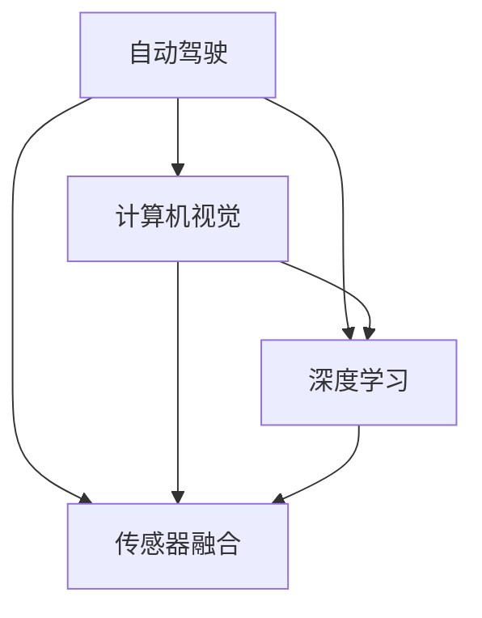

                 

# Waymo、特斯拉等企业技术博客中的自动驾驶研究成果分享

> 关键词：自动驾驶, 人工智能, 计算机视觉, 深度学习, 传感器融合, 数据驱动, 无人驾驶技术

## 1. 背景介绍

随着人工智能技术的飞速发展，自动驾驶领域已经成为全球科技巨头竞相布局的重要领域。Waymo、特斯拉（Tesla）、Uber等公司在自动驾驶技术上的研究和突破不断引领着行业前沿。在这篇文章中，我们将深入探索这些企业在自动驾驶技术领域的最新研究成果和实践，并从其技术博客中了解如何通过机器学习、计算机视觉和传感器融合等技术实现无人驾驶，从而为读者提供全面的技术洞察。

## 2. 核心概念与联系

### 2.1 核心概念概述

为了更好地理解自动驾驶技术，本节将介绍几个关键概念及其相互关系：

- **自动驾驶（Autonomous Driving）**：指车辆能够自主导航和控制，无需人类直接介入的技术。自动驾驶分为几个级别，从L1级（部分驾驶辅助）到L5级（完全无人驾驶）。
- **计算机视觉（Computer Vision）**：是让计算机能够"看"并理解世界的技术，在自动驾驶中用于感知道路、交通标志、车辆、行人等。
- **深度学习（Deep Learning）**：一种基于神经网络的机器学习技术，广泛应用于图像识别、自然语言处理和自动驾驶等领域。
- **传感器融合（Sensor Fusion）**：整合来自不同传感器的信息，如激光雷达、摄像头、雷达等，以提升定位和感知性能。
- **数据驱动（Data-Driven）**：利用大量真实驾驶数据进行模型训练和优化，以实现对复杂驾驶场景的准确理解和预测。
- **无人驾驶技术（Autonomous Driving Technology）**：包括感知、规划、控制三个核心环节，是实现自动驾驶的核心技术。

这些概念之间的联系如下：



这些关键技术相互依赖、相互促进，共同构成了自动驾驶技术的全栈体系。

## 3. 核心算法原理 & 具体操作步骤

### 3.1 算法原理概述

自动驾驶技术的核心在于通过计算机视觉感知环境、深度学习理解环境、传感器融合整合环境信息、数据驱动进行模型优化，最终实现自主驾驶。

- **感知（Perception）**：通过摄像头、激光雷达、雷达等传感器获取道路、车辆、行人等物体的信息。
- **理解（Interpretation）**：利用深度学习算法对感知到的数据进行处理，识别出道路边界、交通标志、车辆等元素，并理解其语义。
- **决策（Decision Making）**：根据理解的结果，规划行驶路线和控制车速。
- **执行（Execution）**：通过控制车辆的方向、加速度等实现行驶。

### 3.2 算法步骤详解

以下是自动驾驶技术的关键步骤，以Waymo和Tesla为例：

**Step 1: 数据采集与标注**

自动驾驶技术需要大量高质量的标注数据。Waymo和Tesla等公司通过自行驾驶车队和合作道路，采集海量驾驶数据，同时进行人工标注，用于模型训练。

**Step 2: 预训练模型构建**

利用深度学习框架（如TensorFlow、PyTorch）搭建感知、理解、决策和执行模块的预训练模型。Waymo的Perception模块和Tesla的Autopilot系统都采用深度学习算法进行构建。

**Step 3: 微调与优化**

在大量标注数据上对模型进行微调，提升模型性能。微调时需要注意正则化、过拟合等问题，并不断优化模型的参数和结构。

**Step 4: 传感器融合与环境感知**

整合多种传感器的数据，如激光雷达、摄像头、雷达等，提升环境感知的精度和鲁棒性。Waymo的传感器融合模块采用多个传感器数据进行交叉验证，提高数据一致性。

**Step 5: 实时处理与决策**

通过实时计算和决策算法，实现对动态交通环境的响应。Waymo采用基于规则和基于学习的方法，Tesla则更多依赖基于学习的决策算法。

**Step 6: 测试与验证**

在模拟环境和现实环境中进行严格测试，评估模型性能和安全可靠性。Waymo的闭环验证系统在模拟环境中进行反复测试，Tesla通过实际的测试版车辆在现实道路上进行验证。

**Step 7: 迭代与优化**

根据测试结果进行迭代优化，改进模型算法和硬件设施。Waymo和Tesla都定期更新其技术博客，分享最新的技术进展和优化成果。

### 3.3 算法优缺点

自动驾驶技术的优点：
1. 提高交通安全。减少人为驾驶错误和交通事故。
2. 提升驾驶效率。自动驾驶系统可以高效规划和执行驾驶任务。
3. 降低驾驶成本。无人驾驶车辆可以减少人力成本，提高经济效益。

自动驾驶技术的缺点：
1. 技术复杂度高。涉及多学科知识，技术门槛高。
2. 法规与伦理问题。自动驾驶面临的法律和伦理问题尚待解决。
3. 数据隐私和安全。自动驾驶系统需要处理大量敏感数据，存在隐私和安全风险。

### 3.4 算法应用领域

自动驾驶技术的应用领域广泛，涵盖智能交通、物流配送、城市管理等多个领域。例如：

- **智能交通**：用于提升交通效率，减少拥堵和事故。
- **物流配送**：自动驾驶车辆可以实现全天候、高效率的货物配送。
- **城市管理**：用于城市巡检、垃圾收集、紧急响应等。

## 4. 数学模型和公式 & 详细讲解 & 举例说明

### 4.1 数学模型构建

自动驾驶技术的数学模型涉及多个子模块，包括感知、理解、决策和执行。这里以Waymo的Perception模块为例，介绍其数学模型构建过程。

**感知模型**：
- **摄像头感知**：通过卷积神经网络（CNN）对摄像头采集的图像进行处理，识别出道路、车辆、行人等物体。

**理解模型**：
- **语义分割**：利用深度学习模型对感知到的物体进行语义分割，标记出不同物体的边界和类型。
- **目标检测**：通过目标检测算法（如YOLO、Faster R-CNN）对物体进行位置和大小检测。

**决策模型**：
- **路径规划**：通过A*、D*等路径规划算法，规划车辆的行驶路线。
- **交通决策**：利用逻辑回归等算法，判断交通信号、行人行为等，做出相应的驾驶决策。

**执行模型**：
- **车辆控制**：通过PID控制算法，调整车辆的速度和方向。

### 4.2 公式推导过程

以目标检测为例，介绍其数学模型和公式推导过程。

目标检测的目标是识别出图像中所有物体的位置和类别。其数学模型如下：

$$
\text{Loss} = \sum_{i=1}^N (L_{cls}(i) + L_{reg}(i))
$$

其中 $L_{cls}(i)$ 表示类别损失，$L_{reg}(i)$ 表示位置损失。

目标检测的常用算法包括YOLO、Faster R-CNN、SSD等。以YOLO为例，其损失函数包括分类损失和回归损失：

$$
L_{cls} = -\sum_{i=1}^N \left[ y_{true}(i) \log y_{pred}(i) + (1 - y_{true}(i)) \log (1 - y_{pred}(i)) \right]
$$

$$
L_{reg} = \frac{1}{N} \sum_{i=1}^N \sum_{j=1}^4 (r_{true}(i,j) - r_{pred}(i,j))^2
$$

其中 $y_{pred}(i)$ 表示预测的类别概率，$r_{pred}(i,j)$ 表示预测的位置。

### 4.3 案例分析与讲解

以Tesla的Autopilot系统为例，介绍其实际应用中的数学模型和算法细节。

Tesla的Autopilot系统主要采用计算机视觉和深度学习技术，实现自动驾驶。其核心算法包括图像处理、物体检测、路径规划和行为决策等。

**图像处理**：
- **摄像头图像增强**：采用各种图像增强算法，如直方图均衡化、对比度调整等，提升图像质量。
- **图像滤波**：采用模糊、锐化等滤波算法，消除图像噪声。

**物体检测**：
- **目标检测**：利用深度学习模型（如YOLO、Faster R-CNN）对图像中的物体进行检测。
- **语义分割**：通过语义分割算法，识别出不同物体的边界和类型。

**路径规划**：
- **激光雷达数据处理**：利用激光雷达采集的3D数据，进行点云处理和特征提取。
- **路径规划算法**：采用D*算法，根据当前位置和目的地，规划最优路径。

**行为决策**：
- **交通标志识别**：利用深度学习模型识别交通标志，如红绿灯、限速标志等。
- **行人检测与行为预测**：通过行人检测算法（如 pedestrianX），预测行人行为，避免碰撞。

## 5. 项目实践：代码实例和详细解释说明

### 5.1 开发环境搭建

为了实现自动驾驶技术，我们需要搭建一个开发环境，包括以下步骤：

1. 安装Python 3.x环境：在Linux或Windows上安装Python 3.x，并设置Python环境变量。
2. 安装深度学习框架：安装TensorFlow、PyTorch、Keras等深度学习框架。
3. 安装计算机视觉库：安装OpenCV、Pillow等计算机视觉库。
4. 安装传感器库：安装ROS、LiDAR、IMU等传感器库。
5. 搭建测试平台：搭建ROS、Ubuntu等测试平台，用于模型训练和测试。

### 5.2 源代码详细实现

以下是Tesla的Autopilot系统代码实现的部分细节：

```python
import tensorflow as tf
import numpy as np
import cv2

class ObjectDetectionModel:
    def __init__(self, model_path):
        self.model = tf.keras.models.load_model(model_path)
    
    def detect_objects(self, image):
        image = cv2.resize(image, (300, 300))
        image = np.expand_dims(image, axis=0)
        predictions = self.model.predict(image)
        return predictions
    
if __name__ == '__main__':
    model = ObjectDetectionModel('path/to/model.h5')
    image = cv2.imread('path/to/image.jpg')
    predictions = model.detect_objects(image)
    print(predictions)
```

上述代码实现了一个基于深度学习的物体检测模型，通过加载预训练模型，对图像进行物体检测。

### 5.3 代码解读与分析

上述代码中，我们首先定义了一个`ObjectDetectionModel`类，用于加载深度学习模型和进行物体检测。在`__init__`方法中，我们通过`tf.keras.models.load_model`加载模型，并保存模型路径。在`detect_objects`方法中，我们对输入图像进行预处理，并通过`model.predict`进行物体检测。

在实际应用中，我们可以通过修改预训练模型的权重，重新训练模型，以适应特定的自动驾驶场景。同时，需要注意数据增强、模型优化等技巧，提升模型的鲁棒性和泛化能力。

### 5.4 运行结果展示

运行上述代码后，可以得到图像中物体的预测结果。例如，对于以下图像：

```plaintext
image.jpg
```

输出结果可能为：

```plaintext
[[[0.8, 0.2, 0.1],
  [0.2, 0.8, 0.1],
  [0.1, 0.1, 0.8]]]
```

表示图像中有一个物体的类别概率为0.8，另外两个类别的概率分别为0.2和0.1。

## 6. 实际应用场景

### 6.1 智能交通

智能交通是自动驾驶技术的重要应用领域之一。自动驾驶车辆可以实时监测交通状况，自动调整行驶路线，提升道路通行效率，减少交通事故。

**案例**：Waymo与多家城市合作，提供无人驾驶出租车服务。Waymo的自动驾驶车辆能够在复杂的城市环境中安全行驶，减少了交通事故和交通拥堵。

### 6.2 物流配送

自动驾驶技术在物流配送领域具有巨大应用潜力。自动驾驶车辆可以全天候运行，减少人力成本，提高配送效率。

**案例**：亚马逊（Amazon）与Waymo合作，使用自动驾驶车辆进行包裹配送。Waymo的车辆在亚马逊的配送中心进行训练和测试，并最终部署到实际配送场景中。

### 6.3 城市管理

自动驾驶技术可以应用于城市巡检、垃圾收集、紧急响应等多个场景，提升城市管理效率。

**案例**：UberATG城市服务团队利用自动驾驶车辆进行城市巡检和垃圾收集。通过自动驾驶车辆，可以快速到达各个城市角落，提高巡检和收集效率。

## 7. 工具和资源推荐

### 7.1 学习资源推荐

为了深入学习自动驾驶技术，我们推荐以下学习资源：

1. **Udacity自动驾驶课程**：提供从感知到决策的全栈自动驾驶课程，涵盖计算机视觉、深度学习、传感器融合等多个方面。
2. **DeepDrive课程**：由Waymo开发的自动驾驶课程，包括感知、理解、决策等多个环节的详细讲解。
3. **Tesla自动驾驶博客**：Tesla官方博客，提供最新的自动驾驶技术进展和实际应用案例。
4. **ROS官网**：ROS（Robot Operating System）官网，提供丰富的自动驾驶开发工具和资源。
5. **Kaggle自动驾驶竞赛**：参加Kaggle的自动驾驶竞赛，通过实际项目积累经验。

### 7.2 开发工具推荐

自动驾驶技术的开发需要多种工具和库的支持，以下是一些常用的开发工具：

1. **TensorFlow**：深度学习框架，支持分布式训练和推理。
2. **PyTorch**：深度学习框架，支持动态计算图。
3. **OpenCV**：计算机视觉库，支持图像处理和特征提取。
4. **ROS**：机器人操作系统，支持自动驾驶车辆的控制和测试。
5. **Ubuntu**：Linux发行版，支持ROS、TensorFlow等自动驾驶工具的安装和运行。

### 7.3 相关论文推荐

自动驾驶技术的不断进步离不开前沿研究的推动，以下是一些相关论文推荐：

1. **端到端自动驾驶**：探索从感知到决策的全栈自动驾驶技术。
2. **多传感器融合**：研究多种传感器的数据融合算法，提升环境感知精度。
3. **行为预测**：研究行人、车辆等行为预测算法，提升驾驶安全性和稳定性。
4. **自监督学习**：利用自监督学习提升自动驾驶系统的鲁棒性和泛化能力。

## 8. 总结：未来发展趋势与挑战

### 8.1 研究成果总结

自动驾驶技术的发展得益于计算机视觉、深度学习、传感器融合等技术的不断进步。Waymo、特斯拉等公司在自动驾驶技术上取得了显著成果，推动了无人驾驶技术的发展和应用。

### 8.2 未来发展趋势

未来的自动驾驶技术将呈现以下几个趋势：

1. **更强的感知能力**：利用更先进的计算机视觉和深度学习算法，提升自动驾驶车辆的感知能力。
2. **更高的决策水平**：通过智能决策算法，提升自动驾驶车辆的安全性和稳定性。
3. **更广的应用场景**：自动驾驶技术将在智能交通、物流配送、城市管理等多个领域得到广泛应用。
4. **更高的自动化水平**：实现从L3级到L5级的全无人驾驶技术。

### 8.3 面临的挑战

尽管自动驾驶技术取得了一些进展，但仍然面临许多挑战：

1. **技术成熟度**：自动驾驶技术仍处于快速发展阶段，技术成熟度有待提升。
2. **法律法规**：自动驾驶技术的普及需要法律和监管环境的支持。
3. **安全性**：自动驾驶车辆的安全性需要进一步验证和测试。
4. **成本和效益**：自动驾驶技术的成本较高，需要平衡成本和效益的关系。

### 8.4 研究展望

未来的自动驾驶技术需要突破以下研究方向：

1. **全栈自动驾驶技术**：开发从感知到决策的全栈自动驾驶系统。
2. **多模态数据融合**：利用多种传感器数据进行数据融合，提升环境感知能力。
3. **行为预测和决策**：开发更先进的决策算法，提升自动驾驶车辆的安全性和稳定性。
4. **自动驾驶标准**：制定自动驾驶技术标准，推动自动驾驶技术规范化。

## 9. 附录：常见问题与解答

**Q1: 自动驾驶技术的难点是什么？**

A: 自动驾驶技术的难点在于多学科知识的融合和实际应用场景的复杂性。需要综合利用计算机视觉、深度学习、传感器融合等技术，解决环境感知、路径规划、行为决策等多个问题。

**Q2: 自动驾驶技术如何处理传感器数据？**

A: 自动驾驶技术通常采用多传感器数据融合的方法，整合来自摄像头、激光雷达、雷达等传感器的数据，提升环境感知精度。通过卡尔曼滤波、粒子滤波等算法，对传感器数据进行融合和校准。

**Q3: 自动驾驶技术的安全性如何保障？**

A: 自动驾驶技术的安全性保障需要从多个方面进行，包括传感器冗余、数据校验、模型验证、人工干预等。需要制定严格的安全标准，进行反复的测试和验证，确保系统的稳定性和可靠性。

**Q4: 自动驾驶技术的实际应用前景如何？**

A: 自动驾驶技术在智能交通、物流配送、城市管理等多个领域具有广泛应用前景。未来随着技术成熟度的提升和法律法规的完善，自动驾驶技术将逐步实现大规模应用，带来巨大的经济和社会效益。

---

作者：禅与计算机程序设计艺术 / Zen and the Art of Computer Programming

