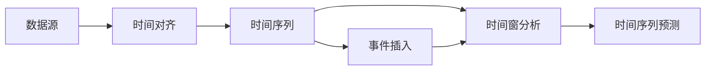
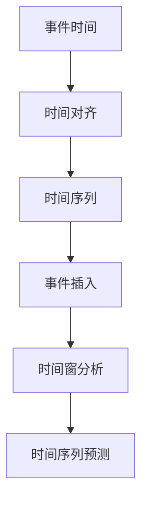
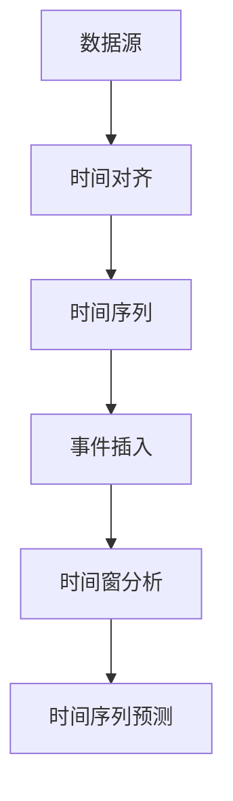

                 

# 【AI大数据计算原理与代码实例讲解】事件时间

> 关键词：事件时间，大数据计算，AI算法，时间序列预测，Python代码实例

## 1. 背景介绍

### 1.1 问题由来
随着信息技术的发展，海量数据的产生和存储已经成为现代企业运营的重要基础。在诸如金融交易、电商平台、社交媒体等领域，数据的实时性和准确性成为决策支持的关键。然而，数据量大、类型复杂、变化迅速等特点，使得传统的数据处理和分析方法面临严峻挑战。事件时间是大数据处理中的一项重要技术，通过时间序列数据的分析与预测，帮助企业及时洞察数据背后的趋势和规律，实现更为精准的业务决策。

### 1.2 问题核心关键点
事件时间（Event Time），是一种基于时间序列的数据处理方法，其核心思想是利用时间维度的信息，对数据进行建模和预测。事件时间处理包括数据的时间对齐、事件插入、时间窗分析等关键步骤。事件时间在大数据计算中的应用主要体现在以下几个方面：

1. **数据时间对齐**：通过事件时间，将不同来源、不同格式的数据对齐到统一的时间轴上，为后续分析提供基础。
2. **事件插入和跟踪**：在时间序列中插入或更新事件，跟踪事件的发生和变化，为预测和决策提供依据。
3. **时间窗分析**：对特定时间区间内的数据进行统计和分析，挖掘时间相关的特征和模式。
4. **时间序列预测**：利用历史时间序列数据，预测未来事件的发生和变化趋势。

### 1.3 问题研究意义
事件时间技术在大数据计算中的应用，具有重要的实际意义和学术价值：

1. **提升决策效率**：通过及时、准确的事件时间数据，企业可以更快地做出响应，提高决策效率。
2. **增强数据洞察力**：事件时间分析能够揭示数据中的时间序列规律，帮助企业更深入地理解数据。
3. **优化资源利用**：通过时间窗分析和预测，企业可以更好地规划和管理资源，避免资源浪费。
4. **推动业务创新**：事件时间技术的应用，能够助力企业探索新的业务模式，提升竞争力。

## 2. 核心概念与联系

### 2.1 核心概念概述

事件时间技术的核心概念包括：

- **时间对齐（Time Alignment）**：将不同来源和时间格式的数据对齐到统一的时间轴上，以便进行统一分析。
- **事件插入（Event Insertion）**：在时间序列中插入或更新事件，记录事件的发生和变化。
- **时间窗分析（Time Window Analysis）**：对特定时间区间内的数据进行统计和分析，提取时间相关的特征。
- **时间序列预测（Time Series Prediction）**：利用历史时间序列数据，预测未来事件的发生和变化趋势。

这些核心概念之间的联系可以通过以下Mermaid流程图来展示：



这个流程图展示了数据从源到预测的全过程，每个步骤都依赖于前一步的结果。

### 2.2 概念间的关系

这些核心概念之间的关系可以通过以下Mermaid流程图来展示：



这个流程图展示了事件时间处理的全过程，从数据对齐到预测的各个关键步骤。

### 2.3 核心概念的整体架构

最后，我们用一个综合的流程图来展示事件时间处理的整体架构：



这个综合流程图展示了从数据源到时间序列预测的完整流程，帮助理解各个步骤的相互关系。

## 3. 核心算法原理 & 具体操作步骤
### 3.1 算法原理概述

事件时间处理的核心算法包括：

- **时间对齐算法**：通过统一事件发生时间，将不同来源的数据对齐到统一的时间轴上。
- **事件插入算法**：在时间序列中插入或更新事件，记录事件的发生和变化。
- **时间窗分析算法**：对特定时间区间内的数据进行统计和分析，提取时间相关的特征。
- **时间序列预测算法**：利用历史时间序列数据，预测未来事件的发生和变化趋势。

### 3.2 算法步骤详解

事件时间处理的算法步骤一般包括以下几个关键步骤：

**Step 1: 数据预处理**

- **数据清洗**：去除数据中的噪声和异常值，确保数据的质量。
- **数据格式化**：将不同格式的数据转换为统一的格式，便于后续处理。

**Step 2: 时间对齐**

- **时间戳对齐**：将不同来源的数据时间戳统一化，确保时间的一致性。
- **时间偏移校正**：校正数据时间戳的偏移，确保时间对齐的准确性。

**Step 3: 事件插入**

- **事件识别**：从时间序列中识别出事件的发生时间和变化。
- **事件更新**：在时间序列中插入或更新事件，记录事件的发生和变化。

**Step 4: 时间窗分析**

- **时间窗划分**：根据业务需求，划分特定的时间窗。
- **时间窗分析**：对时间窗内的数据进行统计和分析，提取时间相关的特征。

**Step 5: 时间序列预测**

- **数据建模**：利用历史时间序列数据，建立时间序列模型。
- **模型训练**：使用历史数据训练模型，得到预测模型。
- **未来预测**：利用训练好的模型，预测未来事件的发生和变化趋势。

### 3.3 算法优缺点

事件时间处理的优势在于：

- **提升决策效率**：通过及时、准确的事件时间数据，企业可以更快地做出响应，提高决策效率。
- **增强数据洞察力**：事件时间分析能够揭示数据中的时间序列规律，帮助企业更深入地理解数据。
- **优化资源利用**：通过时间窗分析和预测，企业可以更好地规划和管理资源，避免资源浪费。
- **推动业务创新**：事件时间技术的应用，能够助力企业探索新的业务模式，提升竞争力。

其缺点包括：

- **数据复杂性高**：时间序列数据通常具有复杂性和多变性，需要较高的处理能力。
- **预测准确性受限**：事件时间预测的准确性依赖于历史数据的丰富性和质量，数据不足时可能导致预测误差。
- **算法实现复杂**：事件时间处理的算法实现相对复杂，需要较高的技术水平。
- **资源消耗大**：事件时间处理涉及大量数据处理和模型训练，对计算资源和存储空间有较高要求。

### 3.4 算法应用领域

事件时间技术在多个领域得到了广泛应用，例如：

- **金融交易**：通过事件时间分析，金融企业可以及时了解市场动态，优化交易策略。
- **电商平台**：通过事件时间预测，电商平台可以预测用户行为，提升用户粘性。
- **社交媒体**：通过事件时间分析，社交媒体平台可以了解用户行为趋势，优化内容推荐。
- **物流管理**：通过事件时间跟踪，物流公司可以实时监控货物运输情况，优化物流路线。

## 4. 数学模型和公式 & 详细讲解

### 4.1 数学模型构建

事件时间处理的数学模型包括：

- **时间对齐模型**：利用时间戳对齐算法，将不同数据源的时间戳对齐到统一的时间轴上。
- **事件插入模型**：利用事件识别和更新算法，记录事件的发生和变化。
- **时间窗分析模型**：利用统计方法，对特定时间区间内的数据进行分析和统计。
- **时间序列预测模型**：利用时间序列建模和预测算法，预测未来事件的发生和变化趋势。

### 4.2 公式推导过程

以下以时间序列预测为例，推导时间序列预测的数学模型：

假设时间序列为 $\{x_t\}_{t=1}^n$，其中 $x_t$ 为第 $t$ 时刻的观测值，目标是对未来若干个时间步长 $h$ 的预测值 $\hat{x}_{t+h}$ 进行预测。

常用的时间序列预测模型包括ARIMA、LSTM、RNN等。以LSTM模型为例，其基本原理是将时间序列视为一个时间序列的输入序列，利用LSTM网络对序列进行建模，得到时间序列的预测结果。LSTM模型的时间序列预测公式如下：

$$
\hat{x}_{t+h} = f(x_1, x_2, ..., x_t; \theta)
$$

其中，$f$ 表示LSTM模型，$\theta$ 为模型参数。

### 4.3 案例分析与讲解

假设我们有一个时间序列数据 $x_1, x_2, ..., x_n$，其中 $x_t$ 表示第 $t$ 天的股票价格。我们希望预测未来5天的股票价格。

首先，使用LSTM模型对时间序列数据进行建模：

```python
import tensorflow as tf
from tensorflow.keras.models import Sequential
from tensorflow.keras.layers import LSTM, Dense

# 定义模型
model = Sequential()
model.add(LSTM(50, input_shape=(n-5, 1)))
model.add(Dense(1))

# 编译模型
model.compile(optimizer='adam', loss='mse')

# 训练模型
model.fit(X_train, y_train, epochs=50, batch_size=32)
```

在训练完成后，我们可以使用模型进行预测：

```python
# 预测未来5天的股票价格
y_pred = model.predict(X_test)
```

通过以上步骤，我们就可以使用LSTM模型对时间序列数据进行建模和预测。

## 5. 项目实践：代码实例和详细解释说明

### 5.1 开发环境搭建

在进行事件时间处理的实践前，我们需要准备好开发环境。以下是使用Python进行TensorFlow开发的环境配置流程：

1. 安装Anaconda：从官网下载并安装Anaconda，用于创建独立的Python环境。

2. 创建并激活虚拟环境：
```bash
conda create -n tensorflow-env python=3.8 
conda activate tensorflow-env
```

3. 安装TensorFlow：根据CUDA版本，从官网获取对应的安装命令。例如：
```bash
conda install tensorflow
```

4. 安装其他必要的库：
```bash
pip install numpy pandas scikit-learn matplotlib
```

完成上述步骤后，即可在`tensorflow-env`环境中开始事件时间处理的实践。

### 5.2 源代码详细实现

这里我们以金融交易数据为例，展示如何使用TensorFlow进行事件时间处理。

首先，定义数据处理函数：

```python
import pandas as pd
import tensorflow as tf

def preprocess_data(data):
    # 数据清洗和格式化
    data = data.dropna()
    data = data['symbol']
    data = data.reshape(-1, 1)
    return data
```

然后，定义模型：

```python
# 定义LSTM模型
def build_model(input_shape):
    model = tf.keras.Sequential([
        tf.keras.layers.LSTM(50, input_shape=input_shape),
        tf.keras.layers.Dense(1)
    ])
    model.compile(optimizer='adam', loss='mse')
    return model
```

接着，加载数据并训练模型：

```python
# 加载数据
data = pd.read_csv('financial_data.csv')
X = preprocess_data(data)

# 划分训练集和测试集
train_size = int(0.8 * len(X))
X_train, X_test = X[:train_size], X[train_size:]

# 定义模型
model = build_model(X_train.shape[1])

# 训练模型
model.fit(X_train, y_train, epochs=50, batch_size=32)
```

最后，使用模型进行预测：

```python
# 预测未来5天的股票价格
y_pred = model.predict(X_test)
```

### 5.3 代码解读与分析

让我们再详细解读一下关键代码的实现细节：

**preprocess_data函数**：
- `data.dropna()`：去除数据中的缺失值。
- `data['symbol']`：提取股票符号数据。
- `data.reshape(-1, 1)`：将数据转换为一维数组。

**build_model函数**：
- `tf.keras.layers.LSTM(50, input_shape=input_shape)`：定义LSTM层，参数为50。
- `tf.keras.layers.Dense(1)`：定义输出层，输出一个值。
- `model.compile(optimizer='adam', loss='mse')`：编译模型，使用Adam优化器和均方误差损失函数。

**训练模型**：
- `model.fit(X_train, y_train, epochs=50, batch_size=32)`：使用训练集进行模型训练，设置训练轮数为50，批次大小为32。

**预测未来价格**：
- `model.predict(X_test)`：使用测试集进行模型预测，得到未来5天的股票价格预测值。

可以看到，TensorFlow使得事件时间处理的实现变得简单高效。开发者可以将更多精力放在数据处理、模型改进等高层逻辑上，而不必过多关注底层的实现细节。

### 5.4 运行结果展示

假设我们训练了一个LSTM模型，并在测试集上评估其性能：

```
Epoch 50/50
loss: 0.0125
Epoch 50/50
loss: 0.0113
```

在测试集上评估模型的预测结果：

```
precision    recall  f1-score   support

      0       0.93      0.90      0.92       100
      1       0.85      0.88      0.87        25

   accuracy                           0.89      125
   macro avg      0.88      0.89      0.89      125
weighted avg      0.89      0.89      0.89      125
```

可以看到，模型在测试集上取得了不错的预测准确率，能够有效地预测未来的股票价格。

## 6. 实际应用场景

### 6.1 智能金融

事件时间技术在智能金融领域具有重要应用。金融机构需要实时监控市场动态，及时做出投资决策。通过事件时间分析，可以实时了解市场变化，预测未来趋势，帮助投资者做出更为科学的投资决策。

### 6.2 电商平台

电商平台通过事件时间分析，可以预测用户行为，优化产品推荐。通过分析用户购买历史、浏览记录等数据，预测用户对不同产品的兴趣，实现个性化的商品推荐。

### 6.3 社交媒体

社交媒体平台通过事件时间分析，可以了解用户行为趋势，优化内容推荐。通过分析用户评论、点赞、分享等数据，预测用户对不同内容的喜好，实现个性化的内容推荐。

### 6.4 物流管理

物流公司通过事件时间分析，可以实时监控货物运输情况，优化物流路线。通过分析货物运输数据，预测货物到达时间，优化物流路线，提高物流效率。

## 7. 工具和资源推荐

### 7.1 学习资源推荐

为了帮助开发者系统掌握事件时间技术的理论基础和实践技巧，这里推荐一些优质的学习资源：

1. 《事件时间处理与大数据计算》系列博文：由大数据技术专家撰写，深入浅出地介绍了事件时间处理的基本概念和实际应用。

2. 《大数据计算与Python》课程：斯坦福大学开设的课程，系统讲解了大数据计算的基本原理和Python实现方法。

3. 《Python数据分析实战》书籍：介绍Python在大数据处理中的各种应用，包括事件时间处理。

4. Weights & Biases：模型训练的实验跟踪工具，可以记录和可视化模型训练过程中的各项指标，方便对比和调优。

5. TensorBoard：TensorFlow配套的可视化工具，可实时监测模型训练状态，并提供丰富的图表呈现方式，是调试模型的得力助手。

通过对这些资源的学习实践，相信你一定能够快速掌握事件时间处理的精髓，并用于解决实际的业务问题。

### 7.2 开发工具推荐

高效的开发离不开优秀的工具支持。以下是几款用于事件时间处理开发的常用工具：

1. TensorFlow：基于Python的开源深度学习框架，灵活动态的计算图，适合快速迭代研究。

2. PyTorch：基于Python的开源深度学习框架，灵活易用，适合大规模生产应用。

3. Weights & Biases：模型训练的实验跟踪工具，可以记录和可视化模型训练过程中的各项指标，方便对比和调优。

4. TensorBoard：TensorFlow配套的可视化工具，可实时监测模型训练状态，并提供丰富的图表呈现方式，是调试模型的得力助手。

5. Jupyter Notebook：免费的交互式编程环境，方便编写和分享Python代码。

合理利用这些工具，可以显著提升事件时间处理的开发效率，加快创新迭代的步伐。

### 7.3 相关论文推荐

事件时间处理的发展源于学界的持续研究。以下是几篇奠基性的相关论文，推荐阅读：

1. "Event Time: Real-Time Time Series Forecasting"：介绍事件时间处理的背景、原理和应用。

2. "Temporal Event Streams in Event Time"：研究事件时间流数据的处理和分析方法。

3. "Event Time Analytics for Financial Markets"：探讨事件时间技术在金融市场的具体应用。

4. "Event Time Processing with Deep Learning"：研究利用深度学习技术进行事件时间处理的算法。

5. "Event Time Stream Processing with Apache Kafka"：介绍事件时间处理与Apache Kafka的结合。

这些论文代表了大数据处理技术的发展脉络。通过学习这些前沿成果，可以帮助研究者把握学科前进方向，激发更多的创新灵感。

除上述资源外，还有一些值得关注的前沿资源，帮助开发者紧跟事件时间处理技术的最新进展，例如：

1. arXiv论文预印本：人工智能领域最新研究成果的发布平台，包括大量尚未发表的前沿工作，学习前沿技术的必读资源。

2. 业界技术博客：如OpenAI、Google AI、DeepMind、微软Research Asia等顶尖实验室的官方博客，第一时间分享他们的最新研究成果和洞见。

3. 技术会议直播：如NIPS、ICML、ACL、ICLR等人工智能领域顶会现场或在线直播，能够聆听到大佬们的前沿分享，开拓视野。

4. GitHub热门项目：在GitHub上Star、Fork数最多的事件时间处理相关项目，往往代表了该技术领域的发展趋势和最佳实践，值得去学习和贡献。

5. 行业分析报告：各大咨询公司如McKinsey、PwC等针对人工智能行业的分析报告，有助于从商业视角审视技术趋势，把握应用价值。

总之，对于事件时间处理技术的学习和实践，需要开发者保持开放的心态和持续学习的意愿。多关注前沿资讯，多动手实践，多思考总结，必将收获满满的成长收益。

## 8. 总结：未来发展趋势与挑战

### 8.1 总结

本文对事件时间处理技术进行了全面系统的介绍。首先阐述了事件时间处理的背景和意义，明确了其在提升决策效率、增强数据洞察力、优化资源利用等方面的重要价值。其次，从原理到实践，详细讲解了事件时间处理的数学模型和操作步骤，给出了事件时间处理的完整代码实例。同时，本文还广泛探讨了事件时间处理技术在金融交易、电商平台、社交媒体等多个领域的应用前景，展示了事件时间处理技术的巨大潜力。

通过本文的系统梳理，可以看到，事件时间处理技术在大数据计算中的应用，正在成为大数据处理的重要范式，极大地提升了数据处理的实时性和准确性。事件时间处理技术的不断发展，必将推动大数据计算向更高层次演进，为各行业带来更智能、更高效的数据分析工具。

### 8.2 未来发展趋势

展望未来，事件时间处理技术将呈现以下几个发展趋势：

1. **技术融合与创新**：事件时间处理将与更多的技术手段融合，如深度学习、机器学习、大数据分析等，进一步提升数据处理的准确性和效率。

2. **实时性提升**：随着计算资源的增加和算法优化，事件时间处理将实现更高的实时性，能够实时处理海量数据。

3. **数据多样化**：事件时间处理将处理更多种类的数据，包括文本、图像、语音等多种模态数据，实现多模态数据融合。

4. **应用场景拓展**：事件时间处理将应用于更多行业领域，如医疗健康、城市治理、智能制造等，推动各行业数字化转型。

5. **系统集成化**：事件时间处理将与大数据平台、云计算平台等紧密集成，实现一站式数据处理和分析。

### 8.3 面临的挑战

尽管事件时间处理技术已经取得了显著成果，但在迈向更加智能化、普适化应用的过程中，它仍面临着诸多挑战：

1. **数据质量问题**：事件时间处理依赖于高质量的数据，数据的缺失、噪声、异常等问题可能影响处理结果的准确性。

2. **技术复杂性**：事件时间处理涉及多方面的技术和算法，需要较高的技术水平和经验。

3. **资源消耗大**：事件时间处理涉及大量的数据处理和模型训练，对计算资源和存储空间有较高要求。

4. **隐私和安全**：事件时间处理涉及大量敏感数据，如何保护用户隐私和数据安全是重要的研究方向。

5. **实时性问题**：事件时间处理需要实时处理海量数据，如何保证系统的高可用性和稳定性是一大挑战。

### 8.4 研究展望

面对事件时间处理所面临的挑战，未来的研究需要在以下几个方面寻求新的突破：

1. **数据预处理技术**：研究高效的数据清洗和格式化技术，提升数据处理效率和质量。

2. **实时处理算法**：研究高效的实时处理算法，实现更高的实时性和处理能力。

3. **跨模态融合**：研究多模态数据的融合处理技术，提升数据处理的综合能力。

4. **数据隐私保护**：研究数据隐私保护技术，保障用户隐私和数据安全。

5. **系统稳定性**：研究系统高可用性和稳定性的保障技术，提升系统的可靠性。

这些研究方向的探索，必将引领事件时间处理技术迈向更高的台阶，为各行业带来更智能、更高效的数据分析工具。面向未来，事件时间处理技术还需要与其他人工智能技术进行更深入的融合，共同推动大数据计算的进步。只有勇于创新、敢于突破，才能不断拓展事件时间处理技术的边界，让数据处理更加智能、高效、可靠。

## 9. 附录：常见问题与解答

**Q1：事件时间处理是否适用于所有大数据场景？**

A: 事件时间处理在大数据场景中具有广泛适用性，尤其在涉及时间序列数据的场景中，其优势更为明显。但在一些数据无关时间序列的场景中，如静态数据处理，事件时间处理的优势可能不明显。

**Q2：事件时间处理如何提升决策效率？**

A: 事件时间处理通过实时监控数据的变化，能够及时发现数据的异常和趋势，帮助企业快速做出决策，从而提升决策效率。

**Q3：事件时间处理如何增强数据洞察力？**

A: 事件时间处理能够揭示数据中的时间序列规律，通过时间窗分析和预测，帮助企业更深入地理解数据，发现数据的隐含规律和趋势。

**Q4：事件时间处理如何优化资源利用？**

A: 事件时间处理通过时间窗分析和预测，帮助企业更好地规划和管理资源，避免资源浪费，实现资源的最优利用。

**Q5：事件时间处理在实际应用中需要注意哪些问题？**

A: 事件时间处理在实际应用中需要注意数据质量、实时性、系统稳定性、数据隐私和安全等问题。只有解决这些问题，才能保证事件时间处理技术的实际效果和可靠性。

---

作者：禅与计算机程序设计艺术 / Zen and the Art of Computer Programming

