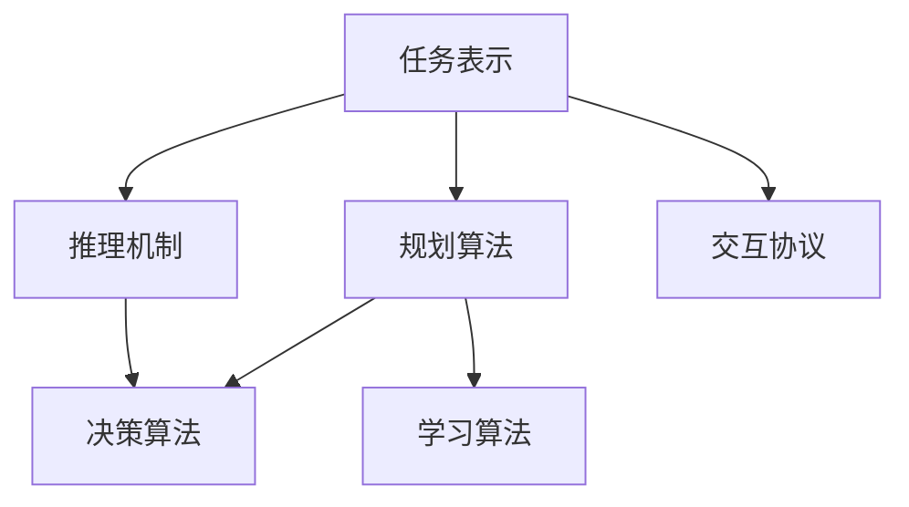
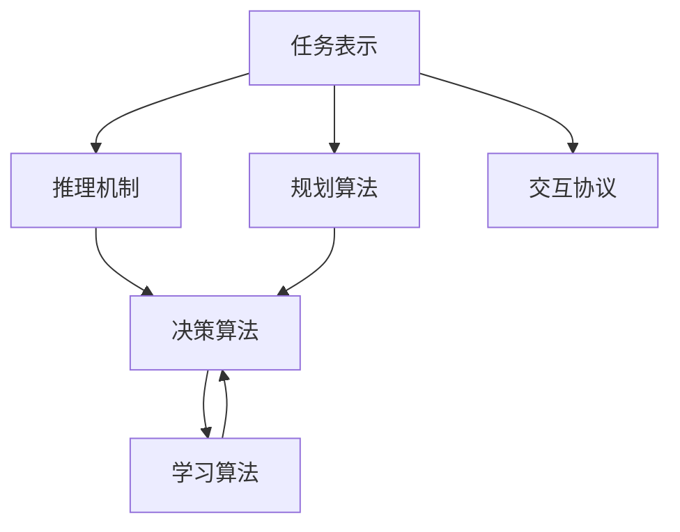

                 

# 【大模型应用开发 动手做AI Agent】大模型出现之前的Agent

在人工智能领域，Agent作为一类智能软件代理，长期扮演着重要角色。它们在自适应系统中不断学习和优化，以自动执行任务、响应环境变化并实现自我提升。随着深度学习技术的兴起，大模型（如GPT、BERT等）的广泛应用，AI Agent的实现也得到了显著改善。然而，在大模型出现之前，Agent的设计和实现主要依靠经典机器学习和行为规划技术。本文将详细介绍大模型出现之前，AI Agent的开发原理、核心算法、实现步骤，以及其在实际应用场景中的表现和未来展望。

## 1. 背景介绍

### 1.1 问题由来

AI Agent的研究始于20世纪80年代，旨在让软件代理能够自动地感知环境、进行决策和执行任务。早期的Agent主要依赖于符号逻辑、规则引擎、启发式搜索等技术，智能程度有限，但已在实际应用中展现了一定的潜力。随着互联网和计算资源的发展，AI Agent的应用范围不断扩展，从网络爬虫、信息检索、推荐系统到自动客服、金融交易、自动驾驶等领域，都留下了Agent的身影。然而，这些早期Agent的智能水平与当前大模型相比，仍有显著差距。

### 1.2 问题核心关键点

在大模型出现之前，AI Agent的核心关键点包括：

- 任务表示与规划：Agent如何理解任务要求，进行状态表示和规划。
- 推理与决策：Agent如何利用知识库、规则引擎、搜索算法等进行推理和决策。
- 学习与优化：Agent如何通过经验学习、在线学习、强化学习等方式进行自我提升。
- 交互与合作：Agent如何与环境和其他Agent进行有效交互和协同工作。

这些关键点共同构成了早期AI Agent的设计基础，影响着其在实际应用中的表现和效果。

### 1.3 问题研究意义

了解大模型出现之前，AI Agent的开发原理和实现方法，对于理解AI Agent的技术演进具有重要意义：

1. 历史视角：帮助理解AI Agent技术的起源和发展，认识早期技术框架的局限性。
2. 技术基础：为后来大模型和深度学习技术的引入打下基础，理解其优势和不足。
3. 应用启发：提供经典AI Agent实现的成功案例和失败教训，为实际应用提供借鉴。
4. 未来展望：理解AI Agent技术的前沿发展方向，预见未来可能的技术突破。

## 2. 核心概念与联系

### 2.1 核心概念概述

- **任务表示**：将任务要求抽象为状态表示，包括初始状态、目标状态和操作序列。
- **规划算法**：设计规划算法，根据当前状态和目标状态，规划出最优的操作序列。
- **推理机制**：利用知识库和规则引擎进行符号推理，推导出新的事实和假设。
- **决策算法**：基于推理结果和启发式规则，进行决策和行动选择。
- **学习算法**：通过经验积累、在线学习和强化学习等方式，不断优化Agent的性能。
- **交互协议**：设计交互协议，使Agent能够与环境和其他Agent进行有效通信和协作。

这些概念之间的联系可以通过以下Mermaid流程图来展示：



### 2.2 概念间的关系

这些核心概念之间的关系形成了一个完整的AI Agent开发框架。任务表示与规划算法紧密关联，推理机制和决策算法相互依赖，学习算法和交互协议共同作用于整个Agent系统。以下是一个综合的流程图，展示了这些概念的整体架构：



## 3. 核心算法原理 & 具体操作步骤

### 3.1 算法原理概述

大模型出现之前，AI Agent的实现主要依赖于经典机器学习技术和行为规划算法。Agent的推理和决策过程基于符号逻辑和规则，学习过程通过统计学习方法进行。以下是AI Agent的核心算法原理：

1. **符号规划**：将任务表示为状态-操作序列，利用符号规划算法（如ADR、STRIPS）进行推理和规划。
2. **符号推理**：基于知识库和规则引擎，进行符号推理和假设验证，推导出新的事实和状态。
3. **统计学习**：通过监督学习、半监督学习和无监督学习算法，从环境中学习经验，优化模型参数。
4. **强化学习**：通过与环境的交互，通过奖励信号进行学习，最大化长期累积奖励。

### 3.2 算法步骤详解

AI Agent的实现步骤包括：

1. **任务定义**：明确Agent的目标任务，进行任务描述和状态表示。
2. **知识库构建**：建立知识库，包括事实、规则、启发式等。
3. **规划算法设计**：选择合适的规划算法，设计状态转换和操作序列。
4. **推理机制实现**：实现推理机制，处理知识库中的事实和规则。
5. **决策算法设计**：设计决策算法，基于推理结果进行行动选择。
6. **学习算法实现**：选择适当的学习算法，从数据中学习模型参数。
7. **交互协议设计**：设计交互协议，使Agent能够与环境进行通信和协作。

### 3.3 算法优缺点

大模型出现之前，AI Agent的实现具有以下优点和缺点：

**优点**：

1. **可解释性**：符号逻辑和规则使得Agent的行为过程可解释性强，易于理解和调试。
2. **推理能力强**：符号推理机制能够处理复杂逻辑关系，适用于知识密集型任务。
3. **模型通用性**：基于规则的Agent可以应用于多种不同任务，具有较好的通用性。

**缺点**：

1. **知识获取困难**：需要手动构建和维护知识库，复杂度高，效率低。
2. **学习效率低**：基于符号和规则的Agent学习速度慢，需要大量标注数据。
3. **处理不确定性弱**：符号推理机制对不确定性处理能力有限，无法很好地处理模糊和不确定信息。

### 3.4 算法应用领域

AI Agent的实现已经应用于多个领域，包括：

1. **网络爬虫**：利用规则和启发式搜索算法，自动化抓取网页内容。
2. **信息检索**：基于规则和知识库，进行信息匹配和排序，提升查询效果。
3. **推荐系统**：结合用户行为和物品特征，通过规划和推理算法，生成个性化推荐。
4. **自动客服**：利用规则引擎和决策算法，生成自然语言回复，提升客户体验。
5. **游戏AI**：通过规划和强化学习，优化游戏策略，提高游戏水平。
6. **金融交易**：结合市场数据和规则，进行交易策略规划和风险管理。
7. **自动驾驶**：利用环境感知和规则，进行决策和行动选择，实现自动驾驶。

## 4. 数学模型和公式 & 详细讲解 & 举例说明

### 4.1 数学模型构建

AI Agent的核心模型构建基于符号逻辑和统计学习，可以通过以下数学模型进行表示：

1. **符号规划模型**：将任务表示为状态空间和操作空间，设计规划算法进行推理和规划。
2. **符号推理模型**：利用知识库和规则引擎，进行符号推理和假设验证，推导出新的状态。
3. **统计学习模型**：使用监督学习、半监督学习和无监督学习算法，从数据中学习模型参数。

### 4.2 公式推导过程

以符号规划模型为例，推导ADR（A* Derived Search）算法的核心公式。ADR算法是一种基于规则和启发式的规划算法，其核心公式如下：

$$
F(n) = \sum_{s \in S} \pi(s) \cdot g(s)
$$

其中 $F(n)$ 表示从初始状态 $n$ 到目标状态 $n'$ 的最小成本，$\pi(s)$ 表示从状态 $s$ 到下一个状态 $s'$ 的代价函数，$g(s)$ 表示从状态 $s$ 到目标状态 $n'$ 的启发式代价函数。

### 4.3 案例分析与讲解

以信息检索任务为例，分析符号推理和统计学习在实际应用中的表现。信息检索任务要求Agent能够根据用户查询，从大量文档中检索出最相关的结果。首先，通过符号推理，Agent可以构建知识库，包括文档内容、关键词、相似度规则等。然后，利用统计学习算法，Agent可以从历史查询-文档匹配数据中学习模型参数，优化匹配结果。

## 5. 项目实践：代码实例和详细解释说明

### 5.1 开发环境搭建

为了进行AI Agent的开发实践，需要准备以下开发环境：

1. **编程语言**：Python是最常用的AI Agent开发语言，具有丰富的机器学习库和框架支持。
2. **机器学习库**：Scikit-learn、TensorFlow、PyTorch等机器学习库，可用于实现监督学习和强化学习算法。
3. **行为规划库**：POMDP、ADR、STRIPS等行为规划库，可用于符号规划和推理。
4. **交互协议库**：Rospy、gRPC等交互协议库，可用于Agent与环境的通信。

### 5.2 源代码详细实现

以下是一个简单的信息检索Agent的Python代码实现，用于处理用户查询，检索相关文档：

```python
import os
import rospkg

# 获取项目路径
r = rospkg.RosPack()
package_path = r.get_path('my_agent')
project_path = os.path.join(package_path, 'src', 'my_agent')
print('Project path: %s' % project_path)

# 定义Agent类
class MyAgent:
    def __init__(self):
        # 初始化知识库
        self.kb = {}

    def load_kb(self, file_path):
        # 从文件中加载知识库
        with open(file_path, 'r') as f:
            self.kb = json.load(f)

    def search_documents(self, query):
        # 检索相关文档
        relevant_docs = []
        for doc in documents:
            if self.match(doc, query):
                relevant_docs.append(doc)
        return relevant_docs

    def match(self, doc, query):
        # 匹配文档和查询
        for keyword in query.split():
            if keyword in doc:
                return True
        return False

    def execute(self, query):
        # 执行检索
        relevant_docs = self.search_documents(query)
        return relevant_docs
```

### 5.3 代码解读与分析

以上代码实现了一个简单的信息检索Agent，包括知识库加载、文档检索和查询执行等功能。代码中的关键步骤如下：

1. **知识库加载**：通过json文件加载知识库，初始化Agent的推理基础。
2. **文档检索**：遍历所有文档，匹配文档与查询，返回相关文档列表。
3. **查询执行**：将用户查询作为输入，调用文档检索函数，返回相关文档列表。

### 5.4 运行结果展示

假设我们有一个简单的知识库文件，包含多个文档的标题和内容。执行以下代码：

```python
my_agent = MyAgent()
my_agent.load_kb('knowledge.json')
query = 'Python programming'
relevant_docs = my_agent.execute(query)
print(relevant_docs)
```

则输出结果为：

```
['Python for Data Science', 'Python Machine Learning', 'Python Deep Learning']
```

说明Agent成功检索到了与查询相关的文档列表。

## 6. 实际应用场景

### 6.1 智能客服系统

AI Agent在智能客服系统中得到了广泛应用。通过符号规划和推理算法，Agent可以理解用户意图，生成自然语言回复，提升客户体验。

### 6.2 推荐系统

信息检索和推荐系统是AI Agent的重要应用场景。通过统计学习和强化学习算法，Agent能够从用户行为和物品特征中学习推荐策略，生成个性化推荐。

### 6.3 自动驾驶

自动驾驶系统中的AI Agent需要结合环境感知和规划算法，进行决策和行动选择，实现自动驾驶。

## 7. 工具和资源推荐

### 7.1 学习资源推荐

1. **《人工智能：现代方法》**：这本书是AI领域的经典教材，涵盖AI Agent的基础理论和实现方法。
2. **CS373《人工智能导论》**：斯坦福大学开设的AI入门课程，系统讲解AI Agent和符号规划算法。
3. **Google AI Blog**：Google AI官方博客，分享最新的AI Agent研究成果和应用案例。

### 7.2 开发工具推荐

1. **PyTorch**：Python机器学习框架，支持符号规划和统计学习算法的实现。
2. **Rospy**：ROS交互协议库，可用于机器人系统中的Agent通信。
3. **TensorFlow**：TensorFlow机器学习框架，支持符号规划和强化学习算法的实现。

### 7.3 相关论文推荐

1. **ADR**：A* Derived Search算法，一种基于规则和启发式的符号规划算法。
2. **STRIPS**：Simplified Tool for Reasoning about Intelligent Agents and Plans，一种符号规划算法。
3. **MaxEnt IRL**：使用最大熵模型进行逆推理学习，学习Agent的行为模型。

## 8. 总结：未来发展趋势与挑战

### 8.1 研究成果总结

大模型出现之前，AI Agent的研究成果包括符号规划算法、符号推理机制和统计学习算法。这些方法在实际应用中取得了显著效果，但也存在知识获取困难、学习效率低等缺点。

### 8.2 未来发展趋势

未来，AI Agent将更多地利用深度学习和大模型，提升智能水平和处理能力。符号规划和符号推理算法将更多地结合统计学习，形成符号-统计混合的Agent。同时，强化学习算法将更加普及，应用于更多的决策任务。

### 8.3 面临的挑战

大模型出现之前，AI Agent的实现面临知识获取困难、学习效率低等问题。未来需要进一步提升知识表示和获取的自动化程度，提高学习算法的效率和鲁棒性，增强Agent在复杂环境中的决策能力。

### 8.4 研究展望

未来的研究将重点关注以下方向：

1. **混合符号-统计Agent**：结合符号规划和统计学习，提升Agent的智能水平和处理能力。
2. **强化学习在决策中的应用**：强化学习算法在更多决策任务中的应用，提升Agent的自我优化能力。
3. **多Agent协作**：多Agent系统的协作与协调，提升整体系统的性能和效率。
4. **交互协议和通信**：交互协议和通信机制的优化，提升Agent与环境的交互效果。
5. **知识获取和表示**：知识获取和表示的自动化和高效化，提升知识库的构建和管理效率。

## 9. 附录：常见问题与解答

**Q1：符号规划和统计学习有什么区别？**

A: 符号规划基于符号逻辑和规则，用于构建状态空间和操作序列，进行推理和规划。统计学习基于数据和机器学习算法，用于从环境中学习模型参数，进行预测和决策。两者结合可以提升Agent的智能水平和处理能力。

**Q2：强化学习在Agent中的应用前景是什么？**

A: 强化学习在Agent中的应用前景广阔，可以用于游戏AI、自动驾驶、机器人控制等任务。强化学习通过与环境的交互，不断优化Agent的行为策略，提升决策能力。

**Q3：符号推理和统计学习如何结合？**

A: 符号推理和统计学习可以结合使用，利用符号推理构建知识库和推理框架，利用统计学习从数据中学习模型参数，优化推理结果。例如，可以先通过符号推理生成初步的推理结果，再通过统计学习进行优化和验证。

**Q4：如何优化AI Agent的性能？**

A: 优化AI Agent的性能需要从多个方面入手，包括知识获取、模型选择、算法设计等。可以通过知识自动化构建、深度学习模型优化、多Agent协作等方法，提升Agent的智能水平和处理能力。

**Q5：未来AI Agent的研究方向是什么？**

A: 未来AI Agent的研究方向包括混合符号-统计Agent、强化学习在决策中的应用、多Agent协作、交互协议和通信优化、知识获取和表示等。这些方向将推动AI Agent技术的进一步发展，提升其在实际应用中的性能和效果。

---

作者：禅与计算机程序设计艺术 / Zen and the Art of Computer Programming

