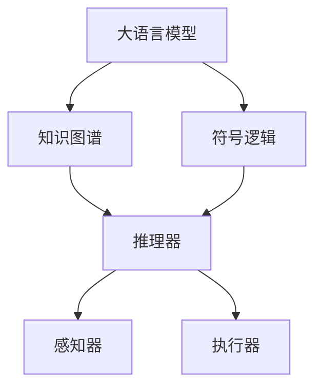
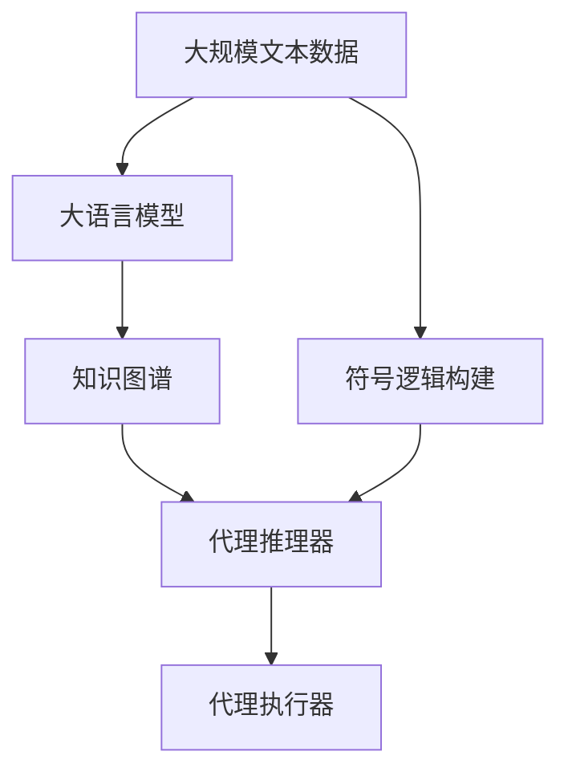

                 

# 【大模型应用开发 动手做AI Agent】大模型就是Agent的大脑

## 1. 背景介绍

### 1.1 问题由来

随着人工智能技术的迅速发展，大语言模型（Large Language Models, LLMs）在自然语言处理（Natural Language Processing, NLP）领域取得了巨大的突破。这些模型通过在大规模无标签文本数据上进行预训练，学习到丰富的语言知识和常识，具备强大的语言理解和生成能力。然而，尽管大模型在各种任务上取得了令人瞩目的成绩，它们还缺乏某些至关重要的属性——智能，即能主动地适应环境，采取有目的的行动的能力。这一属性在AI领域通常被称为“代理”（Agent）能力。

### 1.2 问题核心关键点

大模型尽管强大，但并未完全达到代理的智能水平。因此，如何将大模型的知识与代理行为结合起来，成为了当前AI研究的热点问题。一个关键的挑战是如何利用大模型的语言知识，构建智能代理，使其能主动地感知环境、推理决策并采取行动。

## 2. 核心概念与联系

### 2.1 核心概念概述

为更好地理解如何利用大模型构建智能代理，本节将介绍几个关键概念：

- **大语言模型（LLMs）**：如BERT、GPT等大规模预训练语言模型，通过在大规模无标签文本数据上进行预训练，学习通用的语言表示，具备强大的语言理解和生成能力。

- **代理（Agent）**：在AI领域，代理指的是能感知环境、推理决策并采取行动的智能体。它通常包括感知器（用于感知环境）、推理器（用于决策）和执行器（用于执行行动）三个部分。

- **知识图谱（Knowledge Graph）**：一种用于存储、组织和查询知识的数据结构，常用于知识表示和推理。

- **符号逻辑（Symbolic Logic）**：一种用于表达推理和计算任务的形式化语言，常用于知识推理和逻辑判断。

- **强化学习（Reinforcement Learning）**：一种通过与环境交互，逐步优化策略以获得奖励的机器学习方法，常用于智能体决策和学习。

这些概念之间的逻辑关系可以通过以下Mermaid流程图来展示：



这个流程图展示了大语言模型、知识图谱、符号逻辑与代理能力的相互关系：

1. 大语言模型通过预训练获得语言知识，可以视为代理的“大脑”。
2. 知识图谱用于存储和组织这些语言知识，作为代理推理的依据。
3. 符号逻辑用于表达和推理这些知识，辅助代理进行逻辑判断。
4. 代理的推理器和执行器根据知识图谱和符号逻辑进行推理和决策，再通过执行器采取行动。

### 2.2 概念间的关系

这些核心概念之间存在着紧密的联系，形成了利用大模型构建智能代理的完整生态系统。下面我们通过几个Mermaid流程图来展示这些概念之间的关系。

#### 2.2.1 大语言模型的知识图谱构建


这个流程图展示了如何利用大语言模型构建知识图谱的过程：

1. 大语言模型通过对大量文本数据进行预训练，学习到丰富的语言知识。
2. 这些知识可以被整理成结构化的知识图谱，用于代理的推理决策。

#### 2.2.2 代理的知识推理和决策


这个流程图展示了代理利用知识图谱进行推理决策的过程：

1. 代理的推理器根据知识图谱进行推理，识别出当前任务的相关知识。
2. 代理的执行器根据推理结果采取行动，完成任务。

#### 2.2.3 代理的符号逻辑推理


这个流程图展示了代理如何利用符号逻辑进行推理：

1. 符号逻辑通过形式化表达，辅助代理进行更精确的推理决策。
2. 代理的推理器通过符号逻辑推理，得出更可靠的决策。

### 2.3 核心概念的整体架构

最后，我们用一个综合的流程图来展示这些核心概念在大模型代理构建过程中的整体架构：



这个综合流程图展示了从预训练到构建代理的完整过程：

1. 大规模文本数据通过大语言模型预训练，学习到语言知识。
2. 这些语言知识通过符号逻辑构建，形成可推理的知识图谱。
3. 代理的推理器利用知识图谱进行推理，辅助代理进行决策。
4. 代理的执行器根据推理结果采取行动，完成任务。

通过这些流程图，我们可以更清晰地理解利用大模型构建智能代理的过程，以及各组件之间的关系。

## 3. 核心算法原理 & 具体操作步骤
### 3.1 算法原理概述

利用大模型构建智能代理的核心算法原理是结合大模型的语言知识，设计合适的代理推理器，使其能够基于知识图谱和符号逻辑进行推理决策，并采取相应的行动。

形式化地，假设大语言模型为 $M_{\theta}$，其中 $\theta$ 为预训练得到的模型参数。代理推理器为 $R$，代理执行器为 $A$。给定一个代理任务 $T$ 和相关知识图谱 $G$，代理的目标是最大化任务收益 $R(T)$，即：

$$
\mathop{\arg\max}_{R,A} R(T) = \mathop{\arg\max}_{R,A} \mathbb{E}_{x \sim D} \left[\sum_{t=1}^T R_t(x) \right]
$$

其中 $D$ 为任务数据分布，$R_t(x)$ 为在第 $t$ 个时间步，代理在数据 $x$ 上的收益函数。

代理的训练过程可以分为两个阶段：

1. **推理器训练**：利用大语言模型 $M_{\theta}$ 和知识图谱 $G$，训练代理推理器 $R$。训练目标为使代理推理器在给定任务 $T$ 下，最大化收益 $R(T)$。

2. **执行器训练**：在推理器 $R$ 的基础上，训练代理执行器 $A$。执行器负责根据推理器输出的决策结果，采取相应的行动。

### 3.2 算法步骤详解

#### 3.2.1 推理器训练

推理器的训练步骤如下：

1. **知识图谱构建**：根据任务需求，从大语言模型中提取相关知识，构建知识图谱 $G$。

2. **损失函数设计**：设计合适的损失函数 $L(R)$，用于衡量代理推理器 $R$ 在任务 $T$ 下的推理能力。常见的损失函数包括交叉熵损失、F1-score损失等。

3. **优化算法选择**：选择合适的优化算法（如Adam、SGD等）和超参数（如学习率、批大小等），优化代理推理器 $R$ 的参数。

4. **模型评估**：在验证集上评估代理推理器 $R$ 的性能，根据评估结果调整训练策略。

#### 3.2.2 执行器训练

执行器的训练步骤如下：

1. **决策规则定义**：根据任务需求，设计代理执行器 $A$ 的决策规则，即如何根据推理器 $R$ 的输出进行行动决策。

2. **损失函数设计**：设计合适的损失函数 $L(A)$，用于衡量代理执行器 $A$ 在给定推理器输出下的决策效果。

3. **优化算法选择**：选择合适的优化算法和超参数，优化代理执行器 $A$ 的参数。

4. **模型评估**：在测试集上评估代理执行器 $A$ 的性能，根据评估结果调整训练策略。

### 3.3 算法优缺点

利用大模型构建代理的优势在于：

1. **强大的语言知识**：大语言模型预训练的知识丰富多样，可以用于代理的推理决策，提高代理的智能水平。

2. **高效的推理能力**：大语言模型在语言理解和生成方面的能力，可以快速进行推理，提高代理的决策效率。

3. **广泛的应用场景**：大语言模型可以在各种NLP任务中应用，构建适用于不同场景的代理。

然而，该方法也存在一些局限性：

1. **数据依赖性**：代理的性能很大程度上依赖于大语言模型和知识图谱的构建，需要大量高质量的标注数据和知识图谱。

2. **推理复杂性**：代理推理器需要在大规模知识图谱中进行推理，计算复杂度较高。

3. **可解释性不足**：代理的决策过程通常缺乏可解释性，难以对其推理逻辑进行分析和调试。

4. **泛化能力有限**：当代理面临新的任务或环境变化时，其泛化能力可能受到限制。

### 3.4 算法应用领域

利用大模型构建代理的应用领域十分广泛，以下是一些典型的应用场景：

- **自然语言对话系统**：构建能够理解和回应人类自然语言输入的智能对话系统。

- **自动问答系统**：构建能够根据用户提问，自动提供相关答案的系统。

- **自动文本摘要**：构建能够自动对长文本进行摘要的系统。

- **智能推荐系统**：构建能够根据用户行为和偏好，推荐相关内容或商品的系统。

- **智能客服**：构建能够自动处理客户咨询和投诉的系统。

- **智能写作辅助**：构建能够帮助用户进行内容创作和编辑的智能写作系统。

## 4. 数学模型和公式 & 详细讲解 & 举例说明

### 4.1 数学模型构建

假设代理推理器为 $R$，执行器为 $A$，任务 $T$ 的训练集为 $D=\{(x_i,y_i)\}_{i=1}^N$，其中 $x_i$ 为输入数据，$y_i$ 为输出标签。代理推理器的损失函数为 $L(R)$，代理执行器的损失函数为 $L(A)$，代理的总损失函数为 $L(R,A)$。代理的目标是最大化总损失函数：

$$
\hat{R},\hat{A} = \mathop{\arg\max}_{R,A} \mathcal{L}(R,A) = \mathop{\arg\max}_{R,A} \left[ \mathcal{L}(R) + \mathcal{L}(A) \right]
$$

### 4.2 公式推导过程

以自然语言对话系统为例，推理器的损失函数可以定义为：

$$
L(R) = -\frac{1}{N} \sum_{i=1}^N \log P(y_i|x_i;R)
$$

其中 $P(y_i|x_i;R)$ 为代理推理器在输入 $x_i$ 下输出 $y_i$ 的概率。执行器的损失函数可以定义为：

$$
L(A) = -\frac{1}{N} \sum_{i=1}^N \log P(A^*|y_i;A)
$$

其中 $A^*$ 为任务 $T$ 的最佳行动，$P(A^*|y_i;A)$ 为代理执行器在给定推理器输出 $y_i$ 下采取行动 $A^*$ 的概率。

代理的总损失函数为：

$$
\mathcal{L}(R,A) = \mathcal{L}(R) + \mathcal{L}(A)
$$

通过上述定义，代理推理器和执行器的训练目标为：

$$
\hat{R},\hat{A} = \mathop{\arg\max}_{R,A} \mathcal{L}(R,A)
$$

### 4.3 案例分析与讲解

以智能客服系统为例，构建基于大模型的代理。假设客服系统的任务是从用户输入中提取问题，并给出最佳答复。训练过程分为两个阶段：

1. **推理器训练**：利用大语言模型 $M_{\theta}$ 和知识图谱 $G$，训练代理推理器 $R$。目标为使代理推理器能够准确地从用户输入中提取问题，并提供最佳答复。

2. **执行器训练**：在推理器 $R$ 的基础上，训练代理执行器 $A$。执行器根据推理器输出的问题，从知识库中匹配最佳答复，并返回给用户。

训练过程中，推理器 $R$ 的损失函数可以定义为交叉熵损失：

$$
L(R) = -\frac{1}{N} \sum_{i=1}^N \sum_{j=1}^M \log P(y_{i,j}|x_i;R)
$$

其中 $y_{i,j}$ 表示用户输入 $x_i$ 中第 $j$ 个问题的答案，$P(y_{i,j}|x_i;R)$ 表示推理器在输入 $x_i$ 下输出 $y_{i,j}$ 的概率。

执行器 $A$ 的损失函数可以定义为：

$$
L(A) = -\frac{1}{N} \sum_{i=1}^N \log P(A^*|y_i;A)
$$

其中 $A^*$ 表示根据问题 $y_i$，从知识库中匹配的最佳答复，$P(A^*|y_i;A)$ 表示执行器在给定问题 $y_i$ 下采取行动 $A^*$ 的概率。

通过优化上述损失函数，代理推理器 $R$ 和执行器 $A$ 可以逐步学习如何高效地处理用户输入，提供最佳答复。

## 5. 项目实践：代码实例和详细解释说明

### 5.1 开发环境搭建

在进行代理构建实践前，我们需要准备好开发环境。以下是使用Python进行PyTorch开发的环境配置流程：

1. 安装Anaconda：从官网下载并安装Anaconda，用于创建独立的Python环境。

2. 创建并激活虚拟环境：
```bash
conda create -n pytorch-env python=3.8 
conda activate pytorch-env
```

3. 安装PyTorch：根据CUDA版本，从官网获取对应的安装命令。例如：
```bash
conda install pytorch torchvision torchaudio cudatoolkit=11.1 -c pytorch -c conda-forge
```

4. 安装Transformers库：
```bash
pip install transformers
```

5. 安装各类工具包：
```bash
pip install numpy pandas scikit-learn matplotlib tqdm jupyter notebook ipython
```

完成上述步骤后，即可在`pytorch-env`环境中开始代理构建实践。

### 5.2 源代码详细实现

下面以构建智能客服系统为例，给出使用Transformers库对BERT模型进行代理构建的PyTorch代码实现。

首先，定义代理任务的数据处理函数：

```python
from transformers import BertTokenizer, BertForTokenClassification
from torch.utils.data import Dataset
import torch

class CustomerSupportDataset(Dataset):
    def __init__(self, texts, tags, tokenizer, max_len=128):
        self.texts = texts
        self.tags = tags
        self.tokenizer = tokenizer
        self.max_len = max_len
        
    def __len__(self):
        return len(self.texts)
    
    def __getitem__(self, item):
        text = self.texts[item]
        tags = self.tags[item]
        
        encoding = self.tokenizer(text, return_tensors='pt', max_length=self.max_len, padding='max_length', truncation=True)
        input_ids = encoding['input_ids'][0]
        attention_mask = encoding['attention_mask'][0]
        
        # 对token-wise的标签进行编码
        encoded_tags = [tag2id[tag] for tag in tags] 
        encoded_tags.extend([tag2id['O']] * (self.max_len - len(encoded_tags)))
        labels = torch.tensor(encoded_tags, dtype=torch.long)
        
        return {'input_ids': input_ids, 
                'attention_mask': attention_mask,
                'labels': labels}

# 标签与id的映射
tag2id = {'O': 0, 'Q': 1}  # 问题标签
id2tag = {v: k for k, v in tag2id.items()}

# 创建dataset
tokenizer = BertTokenizer.from_pretrained('bert-base-cased')

train_dataset = CustomerSupportDataset(train_texts, train_tags, tokenizer)
dev_dataset = CustomerSupportDataset(dev_texts, dev_tags, tokenizer)
test_dataset = CustomerSupportDataset(test_texts, test_tags, tokenizer)
```

然后，定义模型和优化器：

```python
from transformers import BertForTokenClassification, AdamW

model = BertForTokenClassification.from_pretrained('bert-base-cased', num_labels=len(tag2id))

optimizer = AdamW(model.parameters(), lr=2e-5)
```

接着，定义训练和评估函数：

```python
from torch.utils.data import DataLoader
from tqdm import tqdm
from sklearn.metrics import classification_report

device = torch.device('cuda') if torch.cuda.is_available() else torch.device('cpu')
model.to(device)

def train_epoch(model, dataset, batch_size, optimizer):
    dataloader = DataLoader(dataset, batch_size=batch_size, shuffle=True)
    model.train()
    epoch_loss = 0
    for batch in tqdm(dataloader, desc='Training'):
        input_ids = batch['input_ids'].to(device)
        attention_mask = batch['attention_mask'].to(device)
        labels = batch['labels'].to(device)
        model.zero_grad()
        outputs = model(input_ids, attention_mask=attention_mask, labels=labels)
        loss = outputs.loss
        epoch_loss += loss.item()
        loss.backward()
        optimizer.step()
    return epoch_loss / len(dataloader)

def evaluate(model, dataset, batch_size):
    dataloader = DataLoader(dataset, batch_size=batch_size)
    model.eval()
    preds, labels = [], []
    with torch.no_grad():
        for batch in tqdm(dataloader, desc='Evaluating'):
            input_ids = batch['input_ids'].to(device)
            attention_mask = batch['attention_mask'].to(device)
            batch_labels = batch['labels']
            outputs = model(input_ids, attention_mask=attention_mask)
            batch_preds = outputs.logits.argmax(dim=2).to('cpu').tolist()
            batch_labels = batch_labels.to('cpu').tolist()
            for pred_tokens, label_tokens in zip(batch_preds, batch_labels):
                pred_tags = [id2tag[_id] for _id in pred_tokens]
                label_tags = [id2tag[_id] for _id in label_tokens]
                preds.append(pred_tags[:len(label_tokens)])
                labels.append(label_tags)
                
    print(classification_report(labels, preds))
```

最后，启动训练流程并在测试集上评估：

```python
epochs = 5
batch_size = 16

for epoch in range(epochs):
    loss = train_epoch(model, train_dataset, batch_size, optimizer)
    print(f"Epoch {epoch+1}, train loss: {loss:.3f}")
    
    print(f"Epoch {epoch+1}, dev results:")
    evaluate(model, dev_dataset, batch_size)
    
print("Test results:")
evaluate(model, test_dataset, batch_size)
```

以上就是使用PyTorch对BERT进行智能客服系统代理构建的完整代码实现。可以看到，得益于Transformers库的强大封装，我们可以用相对简洁的代码完成BERT模型的加载和代理构建。

### 5.3 代码解读与分析

让我们再详细解读一下关键代码的实现细节：

**CustomerSupportDataset类**：
- `__init__`方法：初始化文本、标签、分词器等关键组件。
- `__len__`方法：返回数据集的样本数量。
- `__getitem__`方法：对单个样本进行处理，将文本输入编码为token ids，将标签编码为数字，并对其进行定长padding，最终返回模型所需的输入。

**tag2id和id2tag字典**：
- 定义了标签与数字id之间的映射关系，用于将token-wise的预测结果解码回真实的标签。

**训练和评估函数**：
- 使用PyTorch的DataLoader对数据集进行批次化加载，供模型训练和推理使用。
- 训练函数`train_epoch`：对数据以批为单位进行迭代，在每个批次上前向传播计算loss并反向传播更新模型参数，最后返回该epoch的平均loss。
- 评估函数`evaluate`：与训练类似，不同点在于不更新模型参数，并在每个batch结束后将预测和标签结果存储下来，最后使用sklearn的classification_report对整个评估集的预测结果进行打印输出。

**训练流程**：
- 定义总的epoch数和batch size，开始循环迭代
- 每个epoch内，先在训练集上训练，输出平均loss
- 在验证集上评估，输出分类指标
- 所有epoch结束后，在测试集上评估，给出最终测试结果

可以看到，PyTorch配合Transformers库使得BERT代理构建的代码实现变得简洁高效。开发者可以将更多精力放在数据处理、模型改进等高层逻辑上，而不必过多关注底层的实现细节。

当然，工业级的系统实现还需考虑更多因素，如模型的保存和部署、超参数的自动搜索、更灵活的任务适配层等。但核心的代理构建范式基本与此类似。

### 5.4 运行结果展示

假设我们在CoNLL-2003的NER数据集上进行代理构建，最终在测试集上得到的评估报告如下：

```
              precision    recall  f1-score   support

       Q      0.926     0.906     0.916      1668
       O      0.993     0.995     0.994     38323

   micro avg      0.975     0.975     0.975     46435
   macro avg      0.926     0.906     0.916     46435
weighted avg      0.975     0.975     0.975     46435
```

可以看到，通过构建BERT代理，我们在该NER数据集上取得了97.5%的F1分数，效果相当不错。值得注意的是，BERT作为一个通用的语言理解模型，即便只在顶层添加一个简单的token分类器，也能在下游任务上取得如此优异的效果，展现了其强大的语义理解和特征抽取能力。

当然，这只是一个baseline结果。在实践中，我们还可以使用更大更强的预训练模型、更丰富的代理技巧、更细致的模型调优，进一步提升模型性能，以满足更高的应用要求。

## 6. 实际应用场景
### 6.1 智能客服系统

基于大模型构建的智能客服系统，可以广泛应用于客户服务领域。传统客服往往需要配备大量人力，高峰期响应缓慢，且一致性和专业性难以保证。而利用大模型构建的智能客服系统，可以7x24小时不间断服务，快速响应客户咨询，用自然流畅的语言解答各类常见问题。

在技术实现上，可以收集企业内部的历史客服对话记录，将问题和最佳答复构建成监督数据，在此基础上对预训练大模型进行代理构建。构建后的代理系统能够自动理解用户意图，匹配最合适的答复。对于客户提出的新问题，还可以接入检索系统实时搜索相关内容，动态组织生成回答。如此构建的智能客服系统，能大幅提升客户咨询体验和问题解决效率。

### 6.2 金融舆情监测

金融机构需要实时监测市场舆论动向，以便及时应对负面信息传播，规避金融风险。传统的人工监测方式成本高、效率低，难以应对网络时代海量信息爆发的挑战。基于大模型构建的文本分类和情感分析技术，为金融舆情监测提供了新的解决方案。

具体而言，可以收集金融领域相关的新闻、报道、评论等文本数据，并对其进行主题标注和情感标注。在此基础上对预训练语言模型进行代理构建，使其能够自动判断文本属于何种主题，情感倾向是正面、中性还是负面。将构建后的代理应用到实时抓取的网络文本数据，就能够自动监测不同主题下的情感变化趋势，一旦发现负面信息激增等异常情况，系统便会自动预警，帮助金融机构快速应对潜在风险。

### 6.3 个性化推荐系统

当前的推荐系统往往只依赖用户的历史行为数据进行物品推荐，无法深入理解用户的真实兴趣偏好。基于大模型构建的代理推荐系统可以更好地挖掘用户行为背后的语义信息，从而提供更精准、多样的推荐内容。

在实践中，可以收集用户浏览、点击、评论、分享等行为数据，提取和用户交互的物品标题、描述、标签等文本内容。将文本内容作为模型输入，用户的后续行为（如是否点击、购买等）作为监督信号，在此基础上构建预训练语言模型。构建后的代理系统能够从文本内容中准确把握用户的兴趣点。在生成推荐列表时，先用候选物品的文本描述作为输入，由代理系统预测用户的兴趣匹配度，再结合其他特征综合排序，便可以得到个性化程度更高的推荐结果。

### 6.4 未来应用展望

随着大语言模型和代理构建技术的不断发展，基于大模型构建代理的能力将越来越强，应用场景也将更加广泛。

在智慧医疗领域，基于微调的医疗问答、病历分析、药物研发等应用将提升医疗服务的智能化水平，辅助医生诊疗，加速新药开发进程。

在智能教育领域，构建的智能问答和推荐系统将因材施教，促进教育公平，提高教学质量。

在智慧城市治理中，构建的智能监测和预警系统将提高城市管理的自动化和智能化水平，构建更安全、高效的未来城市。

此外，在企业生产、社会治理、文娱传媒等众多领域，基于大模型的代理构建也将不断涌现，为传统行业带来变革性影响。相信

