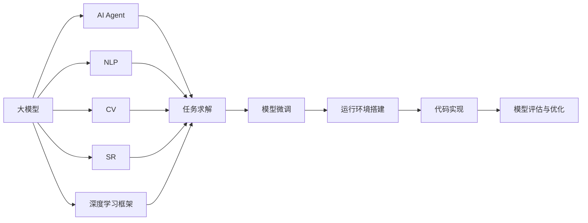
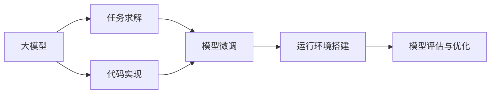
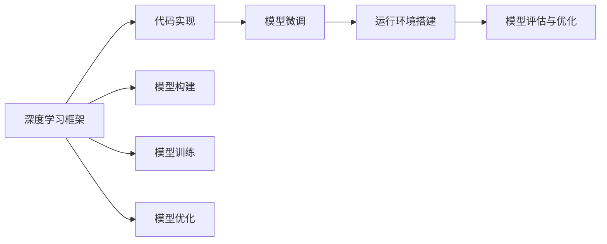
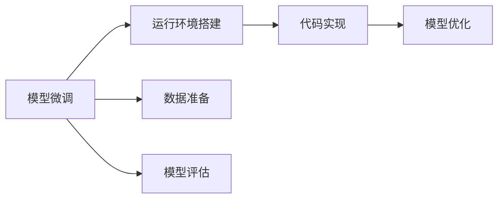
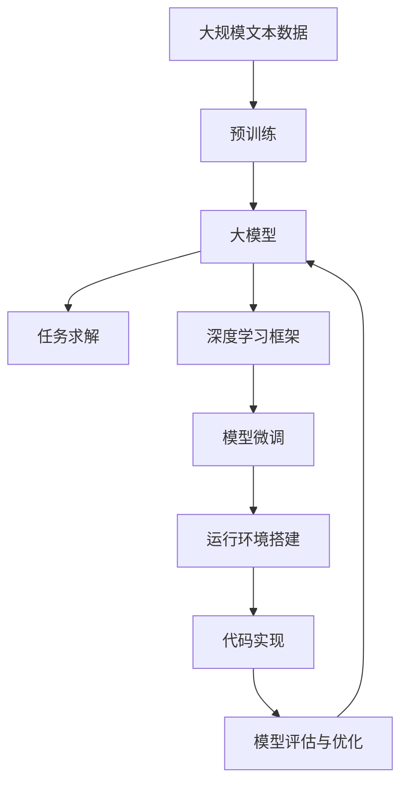

                 

# 【大模型应用开发 动手做AI Agent】运行助手

> 关键词：大模型应用, AI Agent, 自然语言处理(NLP), 人工智能(AI), 深度学习, 模型微调, 运行环境搭建, 代码实现, 模型评估与优化

## 1. 背景介绍

### 1.1 问题由来
近年来，深度学习技术在自然语言处理(NLP)、计算机视觉(CV)、语音识别(SR)等人工智能(AI)领域取得了显著进展，尤其是在大模型方面的突破性成就，让AI技术在各行各业得到了广泛应用。例如，基于语言模型的大模型在文本分类、情感分析、机器翻译等任务上表现优异，而在计算机视觉领域，大模型则广泛应用于图像识别、物体检测、人脸识别等任务。

然而，将大模型应用到实际场景中，需要考虑模型搭建、环境配置、模型评估、优化等一系列问题，对于初学者而言，这一过程存在一定难度。为了帮助读者深入理解大模型应用开发，本系列文章将从模型搭建、运行环境搭建、代码实现、模型评估与优化等方面进行详细阐述。

### 1.2 问题核心关键点
本系列文章的核心关键点包括：

- 大模型应用开发：如何使用大模型进行任务求解，包括模型的搭建、训练和微调。
- AI Agent 运行助手：如何搭建运行环境，使大模型能够在实际应用中高效运行。
- 自然语言处理(NLP)：大模型在文本处理任务中的应用，如文本分类、情感分析、问答系统等。
- 计算机视觉(CV)：大模型在图像处理任务中的应用，如图像识别、物体检测、人脸识别等。
- 语音识别(SR)：大模型在语音处理任务中的应用，如语音识别、情感分析、对话系统等。
- 深度学习框架：TensorFlow、PyTorch等深度学习框架的使用，以及模型训练的优化技巧。
- 模型微调：如何在预训练模型基础上进行微调，以适应特定任务。
- 运行环境搭建：包括硬件资源配置、软件环境搭建、数据集准备等。
- 代码实现：如何使用Python等编程语言实现大模型的应用。
- 模型评估与优化：如何对模型进行评估和优化，以提高其性能和泛化能力。

这些核心关键点将贯穿全文，帮助读者系统地掌握大模型应用开发的方法和技巧。

### 1.3 问题研究意义
深入理解大模型应用开发的方法和技巧，对于构建高效、可靠、智能的AI Agent至关重要。AI Agent在智能客服、智能推荐、智能调度、智能监控等多个领域都有着广泛应用，能够极大地提升工作效率，改善用户体验。

通过学习本系列文章，读者能够掌握从模型搭建到实际部署的完整流程，了解如何高效地使用大模型进行任务求解，如何搭建运行环境，以及如何进行模型评估与优化。这些技能不仅能够帮助初学者快速上手大模型应用开发，还能够为深度学习研究和工业应用提供参考，促进AI技术的进一步发展。

## 2. 核心概念与联系

### 2.1 核心概念概述

为更好地理解大模型应用开发的过程，本节将介绍几个密切相关的核心概念：

- 大模型(Large Model)：指基于深度学习算法训练得到的规模较大的神经网络模型，如BERT、GPT、ResNet等。这些模型通常具有较高的表达能力和泛化能力，能够处理复杂任务。
- AI Agent：基于大模型构建的智能代理，能够自动执行特定任务，如自然语言处理、计算机视觉、语音识别等。
- 自然语言处理(NLP)：涉及文本分析、文本生成、语音识别、语言翻译等任务的技术。
- 计算机视觉(CV)：涉及图像分类、物体检测、人脸识别、图像生成等任务的技术。
- 语音识别(SR)：涉及语音识别、语音情感分析、语音生成等任务的技术。
- 深度学习框架：TensorFlow、PyTorch等深度学习框架，提供模型的构建、训练和优化等功能。
- 模型微调(Fine-Tuning)：在大模型基础上，通过特定任务的数据进行微调，以适应新的任务需求。
- 运行环境搭建：包括硬件资源配置、软件环境搭建、数据集准备等，确保模型能够在实际应用中高效运行。
- 代码实现：使用Python等编程语言实现模型的搭建、训练和微调等操作。
- 模型评估与优化：通过评估模型的性能，进行模型参数调整和优化，提高模型的泛化能力。

这些核心概念之间的逻辑关系可以通过以下Mermaid流程图来展示：



这个流程图展示了从大模型到AI Agent，再到实际任务求解的完整过程：

1. 大模型在NLP、CV、SR等不同领域的应用，构建了多个AI Agent。
2. 这些AI Agent能够自动执行特定任务。
3. 深度学习框架提供了模型的构建、训练和优化功能。
4. 模型微调通过特定任务的数据进行微调，以适应新的任务需求。
5. 运行环境搭建确保模型能够在实际应用中高效运行。
6. 代码实现使用Python等编程语言实现模型的搭建、训练和微调等操作。
7. 模型评估与优化通过评估模型的性能，进行模型参数调整和优化，提高模型的泛化能力。

### 2.2 概念间的关系

这些核心概念之间存在着紧密的联系，形成了大模型应用开发的完整生态系统。下面我们通过几个Mermaid流程图来展示这些概念之间的关系。

#### 2.2.1 大模型与应用开发的关系



这个流程图展示了从大模型到任务求解的完整流程：

1. 大模型在NLP、CV、SR等不同领域的应用，构建了多个任务求解的AI Agent。
2. 代码实现使用Python等编程语言实现模型的搭建、训练和微调等操作。
3. 模型微调通过特定任务的数据进行微调，以适应新的任务需求。
4. 运行环境搭建确保模型能够在实际应用中高效运行。
5. 模型评估与优化通过评估模型的性能，进行模型参数调整和优化，提高模型的泛化能力。

#### 2.2.2 深度学习框架与代码实现的关系



这个流程图展示了深度学习框架与代码实现之间的关系：

1. 深度学习框架提供了模型的构建、训练和优化功能。
2. 代码实现使用Python等编程语言实现模型的搭建、训练和微调等操作。
3. 模型微调通过特定任务的数据进行微调，以适应新的任务需求。
4. 运行环境搭建确保模型能够在实际应用中高效运行。
5. 模型评估与优化通过评估模型的性能，进行模型参数调整和优化，提高模型的泛化能力。

#### 2.2.3 模型微调与运行环境搭建的关系



这个流程图展示了模型微调与运行环境搭建之间的关系：

1. 模型微调通过特定任务的数据进行微调，以适应新的任务需求。
2. 运行环境搭建确保模型能够在实际应用中高效运行。
3. 数据准备是模型微调的基础。
4. 模型评估通过评估模型的性能，进行模型参数调整和优化，提高模型的泛化能力。
5. 代码实现使用Python等编程语言实现模型的搭建、训练和微调等操作。

### 2.3 核心概念的整体架构

最后，我们用一个综合的流程图来展示这些核心概念在大模型应用开发过程中的整体架构：



这个综合流程图展示了从预训练到模型微调，再到实际应用部署的完整过程：

1. 大模型通过大规模无标签文本数据进行预训练。
2. 在深度学习框架中，使用Python等编程语言实现模型的搭建、训练和微调等操作。
3. 模型微调通过特定任务的数据进行微调，以适应新的任务需求。
4. 运行环境搭建确保模型能够在实际应用中高效运行。
5. 代码实现使用Python等编程语言实现模型的搭建、训练和微调等操作。
6. 模型评估与优化通过评估模型的性能，进行模型参数调整和优化，提高模型的泛化能力。

通过这些流程图，我们可以更清晰地理解大模型应用开发的各个环节，为后续深入讨论具体的开发方法提供基础。

## 3. 核心算法原理 & 具体操作步骤
### 3.1 算法原理概述

大模型应用开发的核心在于模型的构建、训练和微调。大模型通常具有较大的规模，能够处理复杂任务，但在特定任务上需要进行微调以适应新需求。本节将详细阐述模型微调的算法原理和具体操作步骤。

### 3.2 算法步骤详解

基于监督学习的大模型微调过程主要包括以下几个步骤：

**Step 1: 准备预训练模型和数据集**
- 选择合适的预训练模型 $M_{\theta}$ 作为初始化参数，如 BERT、GPT、ResNet等。
- 准备下游任务 $T$ 的标注数据集 $D=\{(x_i,y_i)\}_{i=1}^N$，其中 $x_i$ 为输入数据，$y_i$ 为标签。一般要求标注数据与预训练数据的分布不要差异过大。

**Step 2: 添加任务适配层**
- 根据任务类型，在预训练模型顶层设计合适的输出层和损失函数。
- 对于分类任务，通常在顶层添加线性分类器和交叉熵损失函数。
- 对于生成任务，通常使用语言模型的解码器输出概率分布，并以负对数似然为损失函数。

**Step 3: 设置微调超参数**
- 选择合适的优化算法及其参数，如 AdamW、SGD 等，设置学习率、批大小、迭代轮数等。
- 设置正则化技术及强度，包括权重衰减、Dropout、Early Stopping 等。
- 确定冻结预训练参数的策略，如仅微调顶层，或全部参数都参与微调。

**Step 4: 执行梯度训练**
- 将训练集数据分批次输入模型，前向传播计算损失函数。
- 反向传播计算参数梯度，根据设定的优化算法和学习率更新模型参数。
- 周期性在验证集上评估模型性能，根据性能指标决定是否触发 Early Stopping。
- 重复上述步骤直到满足预设的迭代轮数或 Early Stopping 条件。

**Step 5: 测试和部署**
- 在测试集上评估微调后模型 $M_{\hat{\theta}}$ 的性能，对比微调前后的精度提升。
- 使用微调后的模型对新样本进行推理预测，集成到实际的应用系统中。
- 持续收集新的数据，定期重新微调模型，以适应数据分布的变化。

以上是基于监督学习的大模型微调的一般流程。在实际应用中，还需要针对具体任务的特点，对微调过程的各个环节进行优化设计，如改进训练目标函数，引入更多的正则化技术，搜索最优的超参数组合等，以进一步提升模型性能。

### 3.3 算法优缺点

基于监督学习的大模型微调方法具有以下优点：

- 简单高效。只需准备少量标注数据，即可对预训练模型进行快速适配，获得较大的性能提升。
- 通用适用。适用于各种NLP下游任务，包括分类、匹配、生成等，设计简单的任务适配层即可实现微调。
- 参数高效。利用参数高效微调技术，在固定大部分预训练参数的情况下，仍可取得不错的提升。
- 效果显著。在学术界和工业界的诸多任务上，基于微调的方法已经刷新了最先进的性能指标。

同时，该方法也存在一定的局限性：

- 依赖标注数据。微调的效果很大程度上取决于标注数据的质量和数量，获取高质量标注数据的成本较高。
- 迁移能力有限。当目标任务与预训练数据的分布差异较大时，微调的性能提升有限。
- 负面效果传递。预训练模型的固有偏见、有害信息等，可能通过微调传递到下游任务，造成负面影响。
- 可解释性不足。微调模型的决策过程通常缺乏可解释性，难以对其推理逻辑进行分析和调试。

尽管存在这些局限性，但就目前而言，基于监督学习的微调方法仍是大模型应用的最主流范式。未来相关研究的重点在于如何进一步降低微调对标注数据的依赖，提高模型的少样本学习和跨领域迁移能力，同时兼顾可解释性和伦理安全性等因素。

### 3.4 算法应用领域

基于大模型微调的监督学习方法，在NLP领域已经得到了广泛的应用，覆盖了几乎所有常见任务，例如：

- 文本分类：如情感分析、主题分类、意图识别等。通过微调使模型学习文本-标签映射。
- 命名实体识别：识别文本中的人名、地名、机构名等特定实体。通过微调使模型掌握实体边界和类型。
- 关系抽取：从文本中抽取实体之间的语义关系。通过微调使模型学习实体-关系三元组。
- 问答系统：对自然语言问题给出答案。将问题-答案对作为微调数据，训练模型学习匹配答案。
- 机器翻译：将源语言文本翻译成目标语言。通过微调使模型学习语言-语言映射。
- 文本摘要：将长文本压缩成简短摘要。将文章-摘要对作为微调数据，使模型学习抓取要点。
- 对话系统：使机器能够与人自然对话。将多轮对话历史作为上下文，微调模型进行回复生成。

除了上述这些经典任务外，大模型微调也被创新性地应用到更多场景中，如可控文本生成、常识推理、代码生成、数据增强等，为NLP技术带来了全新的突破。随着预训练模型和微调方法的不断进步，相信NLP技术将在更广阔的应用领域大放异彩。

## 4. 数学模型和公式 & 详细讲解
### 4.1 数学模型构建

本节将使用数学语言对大模型微调的过程进行更加严格的刻画。

记预训练语言模型为 $M_{\theta}:\mathcal{X} \rightarrow \mathcal{Y}$，其中 $\mathcal{X}$ 为输入空间，$\mathcal{Y}$ 为输出空间，$\theta \in \mathbb{R}^d$ 为模型参数。假设微调任务的训练集为 $D=\{(x_i,y_i)\}_{i=1}^N$，其中 $x_i \in \mathcal{X}$ 为输入，$y_i \in \mathcal{Y}$ 为标签。

定义模型 $M_{\theta}$ 在数据样本 $(x,y)$ 上的损失函数为 $\ell(M_{\theta}(x),y)$，则在数据集 $D$ 上的经验风险为：

$$
\mathcal{L}(\theta) = \frac{1}{N} \sum_{i=1}^N \ell(M_{\theta}(x_i),y_i)
$$

微调的优化目标是最小化经验风险，即找到最优参数：

$$
\theta^* = \mathop{\arg\min}_{\theta} \mathcal{L}(\theta)
$$

在实践中，我们通常使用基于梯度的优化算法（如SGD、Adam等）来近似求解上述最优化问题。设 $\eta$ 为学习率，$\lambda$ 为正则化系数，则参数的更新公式为：

$$
\theta \leftarrow \theta - \eta \nabla_{\theta}\mathcal{L}(\theta) - \eta\lambda\theta
$$

其中 $\nabla_{\theta}\mathcal{L}(\theta)$ 为损失函数对参数 $\theta$ 的梯度，可通过反向传播算法高效计算。

### 4.2 公式推导过程

以下我们以二分类任务为例，推导交叉熵损失函数及其梯度的计算公式。

假设模型 $M_{\theta}$ 在输入 $x$ 上的输出为 $\hat{y}=M_{\theta}(x) \in [0,1]$，表示样本属于正类的概率。真实标签 $y \in \{0,1\}$。则二分类交叉熵损失函数定义为：

$$
\ell(M_{\theta}(x),y) = -[y\log \hat{y} + (1-y)\log (1-\hat{y})]
$$

将其代入经验风险公式，得：

$$
\mathcal{L}(\theta) = -\frac{1}{N}\sum_{i=1}^N [y_i\log M_{\theta}(x_i)+(1-y_i)\log(1-M_{\theta}(x_i))]
$$

根据链式法则，损失函数对参数 $\theta_k$ 的梯度为：

$$
\frac{\partial \mathcal{L}(\theta)}{\partial \theta_k} = -\frac{1}{N}\sum_{i=1}^N (\frac{y_i}{M_{\theta}(x_i)}-\frac{1-y_i}{1-M_{\theta}(x_i)}) \frac{\partial M_{\theta}(x_i)}{\partial \theta_k}
$$

其中 $\frac{\partial M_{\theta}(x_i)}{\partial \theta_k}$ 可进一步递归展开，利用自动微分技术完成计算。

在得到损失函数的梯度后，即可带入参数更新公式，完成模型的迭代优化。重复上述过程直至收敛，最终得到适应下游任务的最优模型参数 $\theta^*$。

## 5. 项目实践：代码实例和详细解释说明
### 5.1 开发环境搭建

在进行微调实践前，我们需要准备好开发环境。以下是使用Python进行PyTorch开发的环境配置流程：

1. 安装Anaconda：从官网下载并安装Anaconda，用于创建独立的Python环境。

2. 创建并激活虚拟环境：
```bash
conda create -n pytorch-env python=3.8 
conda activate pytorch-env
```

3. 安装PyTorch：根据CUDA版本，从官网获取对应的安装命令。例如：
```bash
conda install pytorch torchvision torchaudio cudatoolkit=11.1 -c pytorch -c conda-forge
```

4. 安装Transformers库：
```bash
pip install transformers
```

5. 安装各类工具包：
```bash
pip install numpy pandas scikit-learn matplotlib tqdm jupyter notebook ipython
```

完成上述步骤后，即可在`pytorch-env`环境中开始微调实践。

### 5.2 源代码详细实现

下面我们以命名实体识别(NER)任务为例，给出使用Transformers库对BERT模型进行微调的PyTorch代码实现。

首先，定义NER任务的数据处理函数：

```python
from transformers import BertTokenizer
from torch.utils.data import Dataset
import torch

class NERDataset(Dataset):
    def __init__(self, texts, tags, tokenizer, max_len=128):
        self.texts = texts
        self.tags = tags
        self.tokenizer = tokenizer
        self.max_len = max_len
        
    def __len__(self):
        return len(self.texts)
    
    def __getitem__(self, item):
        text = self.texts[item]
        tags = self.tags[item]
        
        encoding = self.tokenizer(text, return_tensors='pt', max_length=self.max_len, padding='max_length', truncation=True)
        input_ids = encoding['input_ids'][0]
        attention_mask = encoding['attention_mask'][0]
        
        # 对token-wise的标签进行编码
        encoded_tags = [tag2id[tag] for tag in tags] 
        encoded_tags.extend([tag2id['O']] * (self.max_len - len(encoded_tags)))
        labels = torch.tensor(encoded_tags, dtype=torch.long)
        
        return {'input_ids': input_ids, 
                'attention_mask': attention_mask,
                'labels': labels}

# 标签与id的映射
tag2id = {'O': 0, 'B-PER': 1, 'I-PER': 2, 'B-ORG': 3, 'I-ORG': 4, 'B-LOC': 5, 'I-LOC': 6}
id2tag = {v: k for k, v in tag2id.items()}

# 创建dataset
tokenizer = BertTokenizer.from_pretrained('bert-base-cased')

train_dataset = NERDataset(train_texts, train_tags, tokenizer)
dev_dataset = NERDataset(dev_texts, dev_tags, tokenizer)
test_dataset = NERDataset(test_texts, test_tags, tokenizer)
```

然后，定义模型和优化器：

```python
from transformers import BertForTokenClassification, AdamW

model = BertForTokenClassification.from_pretrained('bert-base-cased', num_labels=len(tag2id))

optimizer = AdamW(model.parameters(), lr=2e-5)
```

接着，定义训练和评估函数：

```python
from torch.utils.data import DataLoader
from tqdm import tqdm
from sklearn.metrics import classification_report

device = torch.device('cuda') if torch.cuda.is_available() else torch.device('cpu')
model.to(device)

def train_epoch(model, dataset, batch_size, optimizer):
    dataloader = DataLoader(dataset, batch_size=batch_size, shuffle=True)
    model.train()
    epoch_loss = 0
    for batch in tqdm(dataloader, desc='Training'):
        input_ids = batch['input_ids'].to(device)
        attention_mask = batch['attention_mask'].to(device)
        labels = batch['labels'].to(device)
        model.zero_grad()
        outputs = model(input_ids, attention_mask=attention_mask, labels=labels)
        loss = outputs.loss
        epoch_loss += loss.item()
        loss.backward()
        optimizer.step()
    return epoch_loss / len(dataloader)

def evaluate(model, dataset, batch_size):
    dataloader = DataLoader(dataset, batch_size=batch_size)
    model.eval()
    preds, labels = [], []
    with torch.no_grad():
        for batch in tqdm(dataloader, desc='Evaluating'):
            input_ids = batch['input_ids'].to(device)
            attention_mask = batch['attention_mask'].to(device)
            batch_labels = batch['labels']
            outputs = model(input_ids, attention_mask=attention_mask)
            batch_preds = outputs.logits.argmax(dim=2).to('cpu').tolist()
            batch_labels = batch_labels.to('cpu').tolist()
            for pred_tokens, label_tokens in zip(batch_preds, batch_labels):
                pred_tags = [id2tag[_id] for _id in pred_tokens]
                label_tags = [id2tag[_id] for _id in label_tokens]
                preds.append(pred_tags[:len(label_tokens)])
                labels.append(label_tags)
                
    print(classification_report(labels, preds))
```

最后，启动训练流程并在测试集上评估：

```python
epochs = 5
batch_size = 16

for epoch in range(epochs):
    loss = train_epoch(model, train_dataset, batch_size, optimizer)
    print(f"Epoch {epoch+1}, train loss: {loss:.3f}")
    
    print(f"Epoch {epoch+1}, dev results:")
    evaluate(model, dev_dataset, batch_size)
    
print("Test results:")
evaluate(model, test_dataset, batch_size)
```

以上就是使用PyTorch对BERT进行命名实体识别任务微调的完整代码实现。可以看到，得益于Transformers库的强大封装，我们可以用相对简洁的代码完成BERT模型的加载和微调。

### 5.3 代码解读与分析

让我们再详细解读一下关键代码的实现细节：

**NERDataset类**：
- `__init__`方法：初始化文本、标签、分词器等关键组件。
- `__len__`方法：返回数据集的样本数量。
- `__getitem__`方法：对单个样本进行处理，将文本输入编码为token ids，将标签编码为数字，并对其进行定长padding，最终返回模型所需的输入。

**tag2id和id2tag字典**：
- 定义了标签与数字id之间的映射关系，用于将token-wise的预测结果解码回真实的标签。

**训练和评估函数**：
- 使用PyTorch的DataLoader对数据集进行批次化加载，供模型训练和推理使用。
- 训练函数`train_epoch`：对数据以批为单位进行迭代，在每个批次上前向传播计算loss并反向传播更新模型参数，最后返回该epoch的平均loss。
- 评估函数`evaluate`：与训练类似，不同点在于不更新模型参数，并在每个batch结束后将预测和标签

