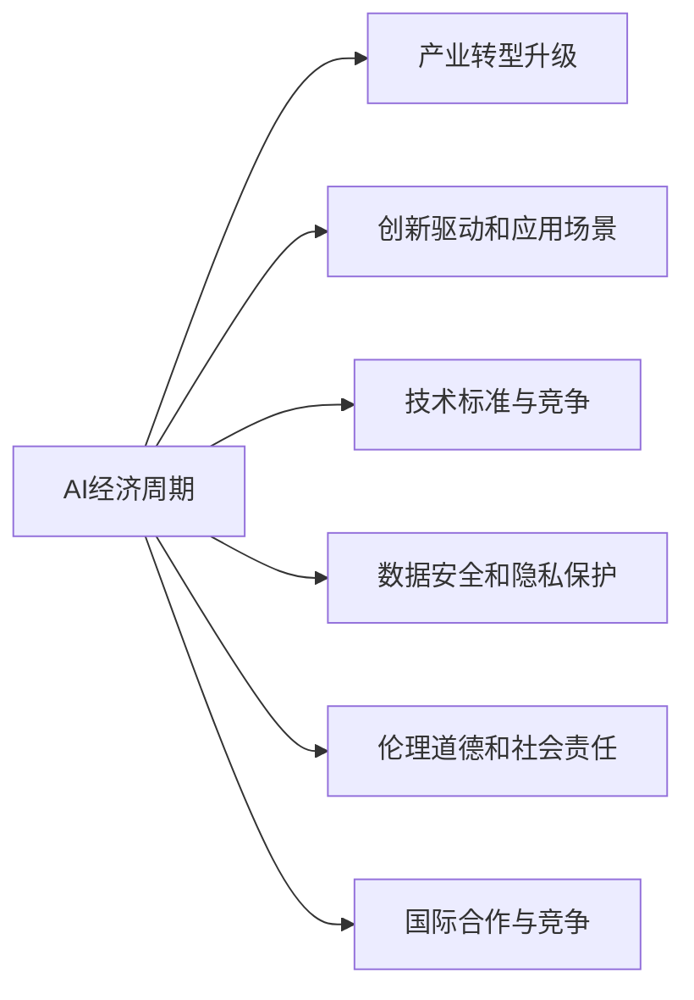
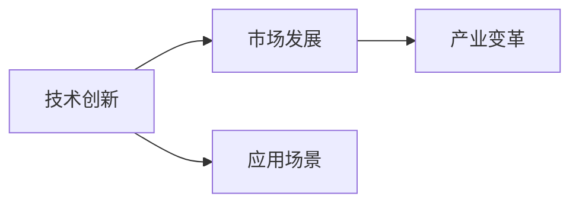
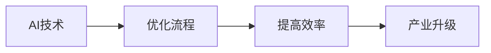
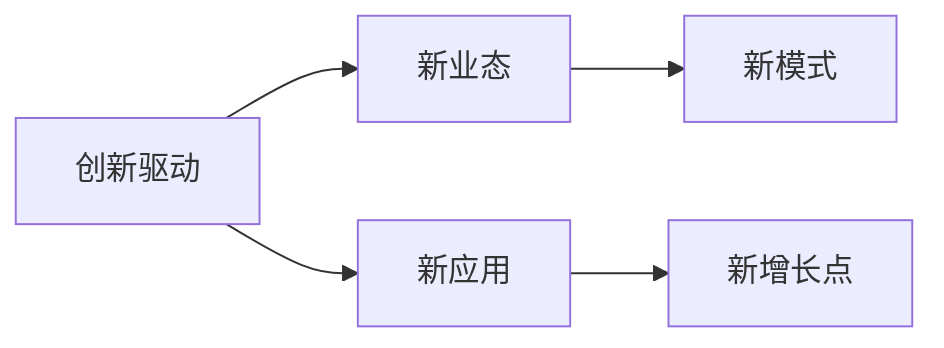
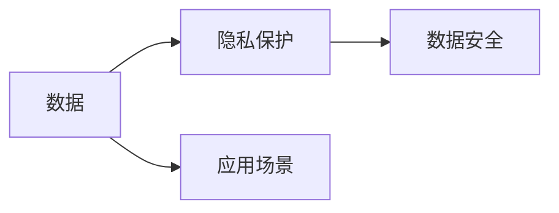

                 

# 中国进入AI经济周期的机遇与挑战

## 1. 背景介绍

### 1.1 问题由来

中国作为全球经济的重要引擎，近年来在AI领域取得了显著的进展，从人工智能芯片到深度学习算法，从自动驾驶到智慧医疗，都展现出了强大的创新能力和应用潜力。随着“十四五”规划的推进，AI技术的广泛应用已成为中国经济转型升级的关键路径。但与此同时，AI技术的发展也面临诸多挑战，如数据隐私、伦理道德、安全监管等，这些问题已成为制约AI技术在各行各业落地应用的重要因素。

### 1.2 问题核心关键点

当前，中国AI经济周期的机遇与挑战主要集中在以下几个方面：

1. **产业转型升级的驱动**：AI技术在各个传统行业的应用，如制造业、金融业、零售业等，能够大幅提高生产效率和运营水平，促进产业升级和经济增长。
2. **创新驱动和应用场景的繁荣**：深度学习、计算机视觉、自然语言处理等前沿技术的应用，带来了更多的创新机会和应用场景，推动AI技术的广泛应用。
3. **技术标准的制定与竞争**：AI技术的快速发展需要统一的技术标准，以保障数据安全和算法透明度。同时，国内企业在AI技术领域的激烈竞争，也对技术标准和知识产权保护提出了更高的要求。
4. **数据安全和隐私保护**：AI技术的应用离不开海量数据的支持，如何保护数据隐私、避免数据滥用，是AI发展面临的重要挑战。
5. **伦理道德和社会责任**：AI技术的广泛应用涉及伦理道德和社会责任问题，如算法偏见、技术误用等，需要建立健全的伦理监管机制。
6. **国际合作与竞争**：中国AI产业的快速发展需要与国际社会建立广泛的合作，同时也要防范国际竞争带来的挑战，确保技术自主可控。

## 2. 核心概念与联系

### 2.1 核心概念概述

为更好地理解中国进入AI经济周期的机遇与挑战，本节将介绍几个密切相关的核心概念：

- **AI经济周期**：指AI技术在某一阶段内，从研发、应用到产业化的发展过程，包括技术创新、市场发展、产业变革等各个方面。
- **产业转型升级**：通过引入AI技术，优化传统行业流程，提高效率，促进产业结构的优化和升级。
- **创新驱动和应用场景**：AI技术在各行业中的应用，推动新技术、新业态和新模式的不断涌现，形成新的经济增长点。
- **技术标准与竞争**：统一的技术标准和规范，保障数据安全和算法透明度，同时促进公平竞争。
- **数据安全和隐私保护**：保障个人和企业数据隐私，防止数据滥用，确保数据安全。
- **伦理道德和社会责任**：在AI技术应用中，确保公平、公正、透明，避免算法偏见、技术误用等伦理问题。
- **国际合作与竞争**：在全球范围内，加强合作与交流，同时防范技术封锁、市场垄断等竞争风险，确保技术自主可控。

这些核心概念之间的逻辑关系可以通过以下Mermaid流程图来展示：



这个流程图展示了中国AI经济周期的核心概念及其之间的关系：

1. AI经济周期是各核心概念综合作用的整体，包括技术创新、市场发展、产业变革等。
2. 产业转型升级是AI技术在特定行业中的应用，能够提高效率和竞争力。
3. 创新驱动和应用场景是AI技术的不断突破和应用，带来新的经济增长点。
4. 技术标准与竞争涉及AI技术的标准化和市场竞争问题，需要公平、透明的环境。
5. 数据安全和隐私保护是AI技术应用的基础，保障数据安全和隐私。
6. 伦理道德和社会责任涉及AI技术的伦理问题，确保公平、公正、透明。
7. 国际合作与竞争涉及AI技术的全球合作与市场竞争问题，确保技术自主可控。

### 2.2 概念间的关系

这些核心概念之间存在着紧密的联系，形成了中国AI经济周期的完整生态系统。下面我们通过几个Mermaid流程图来展示这些概念之间的关系。

#### 2.2.1 AI经济周期的组成



这个流程图展示了AI经济周期的主要组成，包括技术创新、市场发展、产业变革等各个方面。

#### 2.2.2 产业转型升级的驱动因素



这个流程图展示了AI技术在特定行业中的应用，如何通过优化流程、提高效率，推动产业升级。

#### 2.2.3 创新驱动和应用场景的相互关系



这个流程图展示了创新驱动如何带来新业态、新模式和新应用，进而形成新的经济增长点。

#### 2.2.4 数据安全和隐私保护的重要性



这个流程图展示了数据安全和隐私保护对AI技术应用的重要性，保障数据安全和隐私是AI技术发展的基石。

## 3. 核心算法原理 & 具体操作步骤
### 3.1 算法原理概述

中国进入AI经济周期，涉及到的核心算法原理主要包括：

1. **深度学习与神经网络**：通过多层神经网络的训练，AI技术能够学习和理解复杂模式，广泛应用于图像识别、自然语言处理、语音识别等领域。
2. **计算机视觉**：利用深度学习技术，AI能够对图像和视频数据进行自动化分析，广泛应用于智能监控、医疗影像分析等领域。
3. **自然语言处理**：通过语义分析和理解，AI技术能够处理和生成文本，广泛应用于智能客服、情感分析、机器翻译等领域。
4. **机器人技术**：利用计算机视觉和自然语言处理技术，AI能够开发出具备自主决策能力的机器人，广泛应用于制造业、物流、医疗等领域。
5. **自动驾驶**：通过计算机视觉和深度学习技术，AI能够实现自动驾驶，提高交通安全和效率，广泛应用于交通运输领域。

这些算法原理相互配合，推动了中国AI经济周期的发展，为各行业带来广泛的应用机会。

### 3.2 算法步骤详解

基于深度学习和计算机视觉等技术的AI算法开发，通常包含以下几个关键步骤：

1. **数据收集与预处理**：从不同渠道收集数据，并进行清洗、标注和转换等预处理，确保数据质量和一致性。
2. **模型选择与设计**：根据应用场景选择合适的深度学习模型，如卷积神经网络、循环神经网络等，并进行模型设计和参数设置。
3. **模型训练与调优**：利用训练数据对模型进行训练，并通过交叉验证、超参数调优等方法，优化模型性能。
4. **模型评估与部署**：在测试数据上对模型进行评估，确保模型性能符合预期，并部署到实际应用环境中。
5. **模型监控与迭代**：对模型进行实时监控，并根据反馈不断迭代优化，提高模型稳定性和性能。

### 3.3 算法优缺点

中国AI经济周期中的核心算法具有以下优点：

1. **高效处理复杂数据**：深度学习等算法能够高效处理海量数据，发现复杂模式，提高分析和决策能力。
2. **广泛应用领域**：计算机视觉、自然语言处理、机器人技术等技术具有广泛的行业应用，能够推动多个领域的产业升级。
3. **促进创新与创业**：AI技术的发展带来大量创新机会，推动创业生态系统的繁荣。

同时，这些算法也存在一些缺点：

1. **数据依赖性强**：深度学习等算法需要大量高质量数据支持，数据来源和质量问题可能影响模型性能。
2. **计算资源需求高**：大规模模型的训练和推理需要高性能计算资源，增加了应用成本。
3. **模型解释性差**：深度学习等算法通常是"黑盒"模型，难以解释其内部工作机制，缺乏透明度和可解释性。
4. **伦理和安全问题**：AI技术在应用中可能存在算法偏见、隐私泄露等问题，需要建立健全的伦理和安全监管机制。

### 3.4 算法应用领域

中国AI经济周期中的核心算法广泛应用于以下几个领域：

1. **智能制造**：利用机器人技术、计算机视觉等技术，优化生产流程，提高生产效率和质量，推动制造业转型升级。
2. **智能医疗**：通过自然语言处理、计算机视觉等技术，实现医疗影像分析、智能诊断等，提高医疗服务水平。
3. **智能交通**：利用自动驾驶、计算机视觉等技术，提升交通安全和交通管理水平，推动交通运输领域的发展。
4. **智慧城市**：利用AI技术，实现智能安防、智能交通、智慧能源等应用，提升城市管理水平和居民生活质量。
5. **金融科技**：通过自然语言处理、机器学习等技术，实现智能投顾、风险控制、欺诈检测等，提升金融服务水平。

## 4. 数学模型和公式 & 详细讲解 & 举例说明

### 4.1 数学模型构建

中国AI经济周期中的核心算法通常涉及以下数学模型：

1. **卷积神经网络(CNN)**：用于图像识别和处理，其基本模型为：
   $$
   f(x) = \sum_{i=1}^n w_i \sigma(b_i + \sum_{j=1}^m x_{i,j} W_{i,j})
   $$
   其中，$x$为输入图像，$w$为卷积核参数，$b$为偏置项，$\sigma$为激活函数。

2. **循环神经网络(RNN)**：用于序列数据的处理，其基本模型为：
   $$
   f(x) = \sum_{i=1}^n w_i \sigma(b_i + \sum_{j=1}^m x_{i,j} W_{i,j})
   $$
   其中，$x$为输入序列，$w$为循环核参数，$b$为偏置项，$\sigma$为激活函数。

3. **长短时记忆网络(LSTM)**：用于处理长序列数据，其基本模型为：
   $$
   f(x) = \sum_{i=1}^n w_i \sigma(b_i + \sum_{j=1}^m x_{i,j} W_{i,j})
   $$
   其中，$x$为输入序列，$w$为LSTM参数，$b$为偏置项，$\sigma$为激活函数。

### 4.2 公式推导过程

以卷积神经网络为例，其输入图像$x$经过卷积层和池化层后，输出特征图$y$的计算过程如下：

1. **卷积层**：
   $$
   y = \sum_{i=1}^n w_i \sigma(b_i + \sum_{j=1}^m x_{i,j} W_{i,j})
   $$
   其中，$x$为输入图像，$w$为卷积核参数，$b$为偏置项，$\sigma$为激活函数。

2. **池化层**：
   $$
   y' = \max_{i,j} y_{i,j}
   $$
   其中，$y$为卷积层的输出特征图，$y'$为池化层的输出特征图。

3. **全连接层**：
   $$
   z = \sum_{i=1}^n w_i \sigma(b_i + \sum_{j=1}^m y_j W_{j,i})
   $$
   其中，$y'$为池化层的输出特征图，$w$为全连接层参数，$b$为偏置项，$\sigma$为激活函数。

### 4.3 案例分析与讲解

以智能安防为例，利用计算机视觉技术，实现人脸识别、行为分析等功能。该场景下，卷积神经网络的应用过程如下：

1. **数据收集**：从摄像头采集视频数据，提取人脸图像和行为数据。
2. **数据预处理**：对视频数据进行帧提取、归一化等预处理，确保数据质量和一致性。
3. **模型选择**：选择合适的网络结构，如VGG、ResNet等，进行模型设计和参数设置。
4. **模型训练**：利用训练数据对模型进行训练，并通过交叉验证、超参数调优等方法，优化模型性能。
5. **模型评估**：在测试数据上对模型进行评估，确保模型性能符合预期。
6. **模型部署**：将模型部署到实际安防系统中，实现人脸识别、行为分析等功能。

## 5. 项目实践：代码实例和详细解释说明

### 5.1 开发环境搭建

在进行AI应用开发前，需要准备好开发环境。以下是使用Python进行TensorFlow开发的Python环境配置流程：

1. 安装Anaconda：从官网下载并安装Anaconda，用于创建独立的Python环境。

2. 创建并激活虚拟环境：
```bash
conda create -n tf-env python=3.8 
conda activate tf-env
```

3. 安装TensorFlow：根据CUDA版本，从官网获取对应的安装命令。例如：
```bash
conda install tensorflow==2.4
```

4. 安装各类工具包：
```bash
pip install numpy pandas scikit-learn matplotlib tqdm jupyter notebook ipython
```

完成上述步骤后，即可在`tf-env`环境中开始AI应用开发。

### 5.2 源代码详细实现

这里我们以智能安防系统为例，展示使用TensorFlow进行人脸识别任务的代码实现。

首先，定义数据处理函数：

```python
import cv2
import numpy as np

def preprocess_image(image):
    image = cv2.cvtColor(image, cv2.COLOR_BGR2RGB)
    image = cv2.resize(image, (224, 224))
    image = image / 255.0
    image = np.expand_dims(image, axis=0)
    return image

def preprocess_video(video_path):
    cap = cv2.VideoCapture(video_path)
    frames = []
    while True:
        ret, frame = cap.read()
        if not ret:
            break
        frame = preprocess_image(frame)
        frames.append(frame)
    cap.release()
    return frames

# 加载模型
model = tf.keras.models.load_model('face_recognition_model.h5')
```

然后，定义训练和评估函数：

```python
from sklearn.metrics import accuracy_score

def train_model(model, train_data, validation_data, batch_size=32, epochs=10):
    model.compile(optimizer='adam', loss='categorical_crossentropy', metrics=['accuracy'])
    model.fit(train_data, validation_data=validation_data, batch_size=batch_size, epochs=epochs, verbose=1)
    return model

def evaluate_model(model, test_data):
    predictions = model.predict(test_data)
    predictions = np.argmax(predictions, axis=1)
    labels = test_data['labels']
    accuracy = accuracy_score(labels, predictions)
    print(f'Accuracy: {accuracy:.2f}')
```

接着，启动训练流程并在测试集上评估：

```python
train_data = preprocess_video('train_video.mp4')
validation_data = preprocess_video('validation_video.mp4')
test_data = preprocess_video('test_video.mp4')

model = train_model(model, train_data, validation_data)
evaluate_model(model, test_data)
```

以上就是使用TensorFlow进行人脸识别任务的完整代码实现。可以看到，通过TensorFlow提供的Keras API，我们能够快速搭建和训练卷积神经网络模型，实现人脸识别功能。

### 5.3 代码解读与分析

让我们再详细解读一下关键代码的实现细节：

**preprocess_image和preprocess_video函数**：
- `preprocess_image`函数：将彩色图像转换为RGB格式，进行归一化和扩维处理，准备输入模型。
- `preprocess_video`函数：从视频文件逐帧读取图像，并进行预处理，返回处理后的图像序列。

**模型加载和训练**：
- 使用`tf.keras.models.load_model`函数加载预训练的卷积神经网络模型。
- 在训练函数中，使用`model.compile`方法定义模型结构、优化器和损失函数，并使用`model.fit`方法进行训练。

**模型评估**：
- 在评估函数中，使用`model.predict`方法对测试集进行预测，并计算准确率，使用`accuracy_score`函数评估模型性能。

**训练流程**：
- 定义训练数据集`train_data`、验证数据集`validation_data`和测试数据集`test_data`。
- 在训练函数中，设置批次大小和迭代轮数，进行模型训练。
- 在评估函数中，对测试集进行模型评估，输出准确率。

通过以上代码实现，我们展示了如何使用TensorFlow进行卷积神经网络的开发和训练，并在实际场景中应用。在实践中，还需要进一步优化模型结构、调整超参数、引入数据增强等技术，以提高模型性能和鲁棒性。

## 6. 实际应用场景

### 6.1 智能制造

中国制造业的智能化转型是AI经济周期中的重要应用场景。通过引入AI技术，实现智能生产、质量控制、供应链管理等功能，大幅提升制造业的效率和竞争力。

具体应用包括：

1. **智能检测**：利用计算机视觉技术，实现产品质量检测和缺陷识别，提升产品合格率。
2. **预测维护**：通过机器学习技术，预测设备故障和维护需求，提高生产效率和设备利用率。
3. **优化调度**：利用智能算法，优化生产流程和调度方案，提升生产效率和资源利用率。

### 6.2 智能医疗

中国医疗领域的AI应用也取得了显著进展，通过引入AI技术，实现智能诊断、辅助治疗、疾病预测等功能，提升医疗服务水平。

具体应用包括：

1. **智能诊断**：利用自然语言处理技术，实现病历分析和病理诊断，提高诊断准确率和效率。
2. **辅助治疗**：通过计算机视觉技术，实现医学影像分析和手术辅助，提升治疗效果和安全性。
3. **疾病预测**：利用机器学习技术，预测疾病发生和发展趋势，制定预防和治疗方案。

### 6.3 智能交通

中国交通领域也在积极引入AI技术，实现智能交通管理、自动驾驶、交通预测等功能，提升交通管理水平和安全性。

具体应用包括：

1. **智能交通管理**：利用计算机视觉技术，实现交通流量分析和优化，提升交通管理效率。
2. **自动驾驶**：通过机器学习技术，实现自动驾驶和智能导航，提升交通安全和效率。
3. **交通预测**：利用深度学习技术，预测交通流量和拥堵情况，制定交通规划和管理方案。

## 7. 工具和资源推荐

### 7.1 学习资源推荐

为了帮助开发者系统掌握AI经济周期的理论基础和实践技巧，这里推荐一些优质的学习资源：

1. 《深度学习》系列书籍：由多位专家合著，系统介绍了深度学习的基本概念和应用。
2. CS231n《卷积神经网络》课程：斯坦福大学开设的经典课程，详细讲解了卷积神经网络的结构和应用。
3. 《自然语言处理入门》书籍：介绍自然语言处理的基本原理和算法，适合初学者入门。
4. TensorFlow官方文档：TensorFlow的官方文档，提供了丰富的API文档和实例代码。
5. PyTorch官方文档：PyTorch的官方文档，提供了全面的API文档和实例代码。

通过这些资源的学习实践，相信你一定能够快速掌握AI经济周期的技术框架和实践技巧，并用于解决实际的AI应用问题。

### 7.2 开发工具推荐

高效的开发离不开优秀的工具支持。以下是几款用于AI应用开发的常用工具：

1. TensorFlow：由Google主导开发的深度学习框架，生产部署方便，适合大规模工程应用。
2. PyTorch：由Facebook开发的深度学习框架，灵活高效，适合快速迭代研究。
3. Keras：基于TensorFlow和Theano的高级API，易于上手，适合初学者和快速原型开发。
4. Jupyter Notebook：开源的交互式笔记本环境，支持Python和其他语言，方便代码调试和展示。
5. Anaconda：Python环境管理和数据科学工作流程的工具，提供了丰富的科学计算包和数据处理工具。

合理利用这些工具，可以显著提升AI应用的开发效率，加快创新迭代的步伐。

### 7.3 相关论文推荐

AI经济周期中的关键技术源于学界的持续研究。以下是几篇奠基性的相关论文，推荐阅读：

1. "ImageNet Classification with Deep Convolutional Neural Networks"：提出卷积神经网络，应用于图像分类任务。
2. "RNNs for Sequence Modeling"：提出循环神经网络，应用于序列数据处理。
3. "LSTM: A Search Space Odyssey Through Time"：提出长短时记忆网络，应用于长序列数据处理。
4. "FaceNet: A Unified Embedding for Face Recognition and Clustering"：提出人脸识别算法，应用于智能安防领域。
5. "Deep Q-Learning with Human-Level Performance"：提出深度强化学习算法，应用于智能制造领域。

这些论文代表了大规模AI应用的技术进展，通过学习这些前沿成果，可以帮助研究者把握学科前进方向，激发更多的创新灵感。

除上述资源外，还有一些值得关注的前沿资源，帮助开发者紧跟AI经济周期的最新进展，例如：

1. arXiv论文预印本：人工智能领域最新研究成果的发布平台，包括大量尚未发表的前沿工作，学习前沿技术的必读资源。
2. 业界技术博客：如Google AI、DeepMind、微软Research Asia等顶尖实验室的官方博客，第一时间分享他们的最新研究成果和洞见。
3. 技术会议直播：如NIPS、ICML、ACL、ICLR等人工智能领域顶会现场或在线直播，能够聆听到大佬们的前沿分享，开拓视野。
4. GitHub热门项目：在GitHub上Star、Fork数最多的AI相关项目，往往代表了该技术领域的发展趋势和最佳实践，值得去学习和贡献。
5. 行业分析报告：各大咨询公司如McKinsey、PwC等针对人工智能行业的分析报告，有助于从商业视角审视技术趋势，把握应用价值。

总之，对于AI经济周期的学习与实践，需要开发者保持开放的心态和持续学习的意愿。多关注前沿资讯，多动手实践，多思考总结，必将收获满满的成长收益。

## 8. 总结：未来发展趋势与挑战

### 8.1 总结

本文对中国进入AI经济周期的机遇与挑战进行了全面系统的介绍。首先阐述了AI技术在各行业的应用前景，明确了中国AI经济周期中产业转型升级、创新驱动和应用场景、技术标准与竞争、数据安全和隐私保护、伦理道德和社会责任、国际合作与竞争等关键问题。其次，从原理到实践，详细讲解了AI技术在各行业中的应用，包括深度学习、计算机视觉、自然语言处理、机器人技术、自动驾驶等核心算法。同时，本文还给出了AI应用的代码实例和详细解释说明，展示了AI技术的实践价值。

通过本文的系统梳理，可以看到，中国AI经济周期的发展面临着诸多机遇和挑战。AI技术在各行业的应用带来了广泛的经济和社会效益，但也需要在数据安全、伦理道德、技术标准等方面进行深入探讨和持续改进。只有积极应对挑战，充分发挥AI技术的潜力，才能真正实现中国AI经济周期的全面发展。

### 8.2 未来发展趋势

展望未来，中国AI经济周期的发展趋势将呈现以下几个方面：

1. **产业数字化转型**：AI技术在各个行业的应用将加速推动产业数字化转型，提升生产效率和竞争力。
2. **创新驱动和应用场景不断拓展**：AI技术的不断突破和应用，将带来更多的新业态和新模式，推动经济增长。
3. **技术标准和生态系统的完善**：统一的技术标准和生态系统的完善，将保障数据安全和算法透明度，促进公平竞争。
4. **数据安全和隐私保护加强**：随着AI应用的广泛普及，数据安全和隐私保护将成为重要的研究方向，保障个人和企业数据安全。
5. **伦理和社会责任的重视**：AI技术的应用需要考虑伦理和社会责任问题，确保公平、公正、透明，避免算法偏见和技术误用。
6. **国际合作与竞争的加强**：在全球范围内，加强AI技术的合作与交流，防范技术封锁和市场垄断，确保技术自主可控。

以上趋势展示了中国AI经济周期的广阔前景，AI技术将在更多领域发挥重要作用，推动经济和社会发展。

### 8.3 面临的挑战

尽管中国AI经济周期的发展前景广阔，但仍面临诸多挑战：

1. **数据来源和质量问题**：大规模AI应用需要大量高质量数据支持，数据来源和质量问题可能影响模型性能。
2. **计算资源需求高**：大规模模型的训练和推理需要高性能计算资源，增加了应用成本。
3. **模型解释性差**：深度学习等算法通常是"黑盒"模型，难以解释其内部工作机制，缺乏透明度和可解释性。
4. **伦理和安全问题**：AI技术在应用中可能存在算法偏见、隐私泄露等问题，需要建立健全的伦理和安全监管机制。
5. **技术封锁和市场垄断**：全球范围内的技术封锁和市场垄断问题，可能阻碍AI技术在全球范围内的普及和应用。
6. **跨领域融合的难度**：AI技术在不同领域的应用，需要跨学科的融合和协作，存在一定难度。

以上挑战需要相关方共同努力，积极应对，确保中国AI经济周期的健康发展。

### 8.4 研究展望

面对AI经济周期中的诸多挑战，未来的研究需要在以下几个方面寻求新的突破：

1. **数据采集和处理**：开发高效的数据采集和预处理技术，确保

