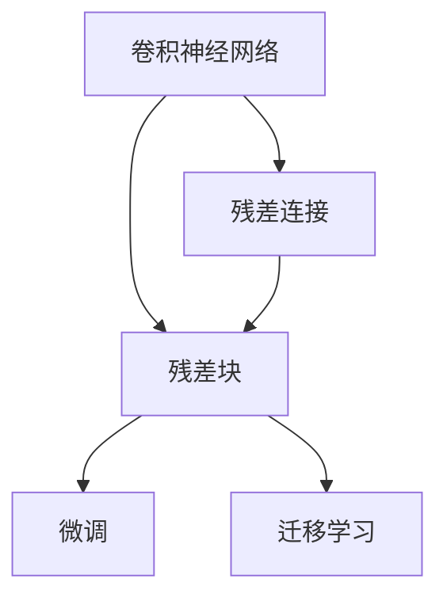
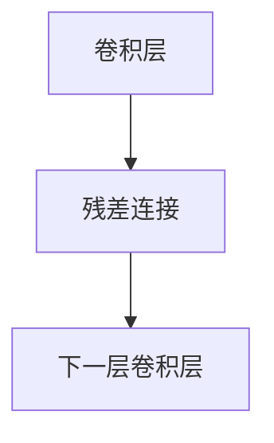
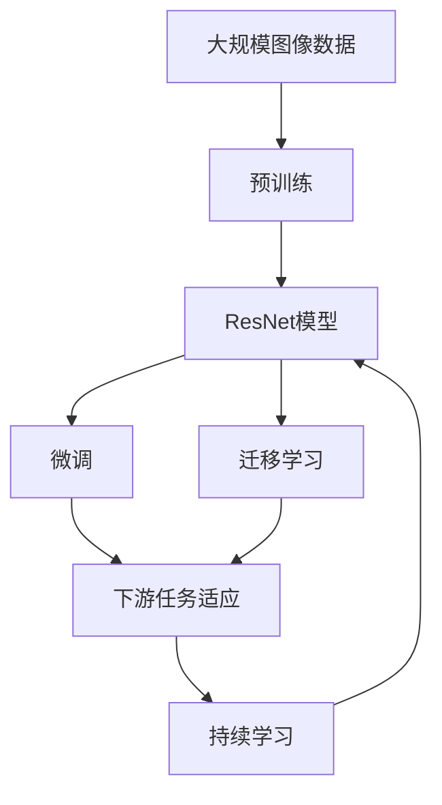

                 

# 从零开始大模型开发与微调：ResNet实战

> 关键词：深度学习, ResNet, 微调, 卷积神经网络, 图像分类, 迁移学习

## 1. 背景介绍

### 1.1 问题由来
在计算机视觉领域，深度学习技术尤其是卷积神经网络(CNN)已经成为图像分类、目标检测、图像分割等任务的标配。然而，传统的CNN模型往往具有较大的计算复杂度，难以在大规模数据集上训练。为了解决这一问题，ResNet（Residual Network）应运而生。ResNet通过引入残差连接，大大减少了模型训练难度，提高了模型的泛化性能，被广泛应用于各种计算机视觉任务中。

但ResNet的成功离不开数据集和计算资源的充足供应。对于初学者或者小规模团队来说，从头搭建大规模数据集和计算平台非常困难。此外，ResNet的参数量较大，微调过程需要耗费大量的标注数据和计算资源，普通开发者难以应对。

因此，本文将从零开始介绍ResNet模型的搭建、微调以及实际应用场景。通过简单的代码示例和详细解释，帮助读者快速上手，并通过微调技术进一步优化模型性能。

### 1.2 问题核心关键点
ResNet作为深度学习的经典模型，其核心思想是通过引入残差连接，解决深度网络中梯度消失的问题，提升模型训练的稳定性和性能。主要关键点包括：
- 残差连接：跨层直接传递信号，解决梯度消失问题。
- 堆叠残差块：通过堆叠多个残差块，提升模型的深度和表达能力。
- 微调技术：通过在已有预训练模型上添加小规模数据进行微调，提升模型在特定任务上的性能。

本文将围绕以上核心点，深入探讨ResNet模型的构建、微调过程及其应用。

### 1.3 问题研究意义
ResNet作为深度学习领域的重要模型，其构建和微调方法对计算机视觉任务的优化具有重要意义：
1. 降低模型训练难度：通过残差连接，使得深度网络能够更深更宽，增强模型表达能力。
2. 提升模型泛化能力：残差连接使得模型能够更好地处理梯度消失问题，从而提升模型的泛化性能。
3. 参数高效微调：通过迁移学习范式，利用已有预训练模型，降低微调过程中对标注数据和计算资源的需求。
4. 提高模型应用效率：微调后的ResNet模型能够更快地适应新的数据集和任务，提升应用效率。
5. 促进技术落地：通过简单的代码实现和高效的微调过程，帮助开发者快速上手，推动深度学习技术的落地应用。

## 2. 核心概念与联系

### 2.1 核心概念概述

为更好地理解ResNet模型的构建与微调方法，本节将介绍几个密切相关的核心概念：

- 卷积神经网络(CNN)：一种基于卷积操作的神经网络，擅长处理图像等二维结构化数据。
- 残差连接(Residual Connection)：在网络中引入跨层连接，使得梯度能够顺利反向传播。
- 残差块(Residual Block)：由若干个残差连接组成的神经网络层。
- 微调(Fine-Tuning)：在已有预训练模型上，使用小规模数据进行微调，提升模型在特定任务上的性能。
- 迁移学习(Transfer Learning)：利用已有预训练模型，快速适应新任务的方法。

这些核心概念之间的逻辑关系可以通过以下Mermaid流程图来展示：



这个流程图展示了大模型构建与微调过程中各个核心概念的关系：

1. 卷积神经网络是基础，通过引入残差连接，构成残差块。
2. 残差块通过堆叠，构成ResNet网络。
3. 通过迁移学习，利用预训练模型进行微调，提升模型性能。

### 2.2 概念间的关系

这些核心概念之间存在着紧密的联系，形成了ResNet模型的完整生态系统。下面我通过几个Mermaid流程图来展示这些概念之间的关系。

#### 2.2.1 卷积神经网络与残差连接的结合



这个流程图展示了卷积神经网络中残差连接的基本结构。

#### 2.2.2 残差块与微调的关系


这个流程图展示了残差块通过微调提升性能的基本流程。

#### 2.2.3 迁移学习与微调的关系


这个流程图展示了迁移学习的基本流程，并通过微调提升模型性能。

### 2.3 核心概念的整体架构

最后，我们用一个综合的流程图来展示这些核心概念在大模型微调过程中的整体架构：



这个综合流程图展示了从预训练到微调，再到持续学习的完整过程。ResNet模型首先在大规模图像数据上进行预训练，然后通过微调（包括全参数微调和参数高效微调）或迁移学习（包括微调和提示学习）来适应下游任务。最后，通过持续学习技术，模型可以不断学习新知识，同时避免遗忘旧知识。通过这些流程图，我们可以更清晰地理解ResNet模型的构建与微调过程中各个核心概念的关系和作用，为后续深入讨论具体的微调方法和技术奠定基础。

## 3. 核心算法原理 & 具体操作步骤
### 3.1 算法原理概述

ResNet模型的核心思想是通过引入残差连接，解决深度网络中梯度消失的问题，提升模型训练的稳定性和性能。形式化地，假设输入为 $x$，输出为 $y$，残差连接的结构可以表示为：

$$
y = x + f(x)
$$

其中 $f(x)$ 表示残差函数，通常采用卷积操作或全连接层。通过残差连接，残差块可以保留输入信息，避免梯度消失问题。

在实践中，残差块由多个卷积层和批量归一化层构成，其结构可以表示为：

$$
y = \mathrm{Conv}(x) + x
$$

其中 $\mathrm{Conv}$ 表示卷积操作，可以包括卷积层、激活函数、批量归一化层等。

微调则是通过在已有预训练模型上，使用小规模数据进行微调，提升模型在特定任务上的性能。微调过程通常包括数据准备、模型加载、模型适配、训练和评估等步骤。

### 3.2 算法步骤详解

ResNet模型的微调一般包括以下几个关键步骤：

**Step 1: 准备预训练模型和数据集**
- 选择合适的预训练模型（如ResNet-50）作为初始化参数。
- 准备下游任务的数据集，划分为训练集、验证集和测试集。

**Step 2: 添加任务适配层**
- 根据任务类型，在预训练模型的顶层设计合适的输出层和损失函数。
- 对于分类任务，通常在顶层添加线性分类器和交叉熵损失函数。
- 对于生成任务，通常使用语言模型的解码器输出概率分布，并以负对数似然为损失函数。

**Step 3: 设置微调超参数**
- 选择合适的优化算法及其参数，如 Adam、SGD 等，设置学习率、批大小、迭代轮数等。
- 设置正则化技术及强度，包括权重衰减、Dropout、Early Stopping 等。
- 确定冻结预训练参数的策略，如仅微调顶层，或全部参数都参与微调。

**Step 4: 执行梯度训练**
- 将训练集数据分批次输入模型，前向传播计算损失函数。
- 反向传播计算参数梯度，根据设定的优化算法和学习率更新模型参数。
- 周期性在验证集上评估模型性能，根据性能指标决定是否触发 Early Stopping。
- 重复上述步骤直到满足预设的迭代轮数或 Early Stopping 条件。

**Step 5: 测试和部署**
- 在测试集上评估微调后模型 $M_{\hat{\theta}}$ 的性能，对比微调前后的精度提升。
- 使用微调后的模型对新样本进行推理预测，集成到实际的应用系统中。
- 持续收集新的数据，定期重新微调模型，以适应数据分布的变化。

以上是ResNet模型的微调过程的详细步骤。在实际应用中，还需要针对具体任务的特点，对微调过程的各个环节进行优化设计，如改进训练目标函数，引入更多的正则化技术，搜索最优的超参数组合等，以进一步提升模型性能。

### 3.3 算法优缺点

ResNet模型的微调方法具有以下优点：
1. 简单高效。通过迁移学习范式，利用已有预训练模型，能够快速适应新任务，降低开发成本。
2. 通用适用。适用于各种计算机视觉下游任务，如图像分类、目标检测、图像分割等。
3. 参数高效。利用参数高效微调技术，在固定大部分预训练参数的情况下，仍可取得不错的微调效果。
4. 效果显著。在学术界和工业界的诸多任务上，基于微调的方法已经刷新了最先进的性能指标。

同时，该方法也存在一定的局限性：
1. 依赖预训练模型。微调的效果很大程度上取决于预训练模型的质量，选择预训练模型的策略需要精心设计。
2. 微调数据量需求。微调过程需要足够的标注数据，数据量不足可能导致模型过拟合。
3. 过拟合风险。微调过程中，如果不加限制，容易过拟合小规模训练集，导致泛化能力下降。
4. 计算资源消耗。微调过程中需要大量的计算资源，普通开发者难以承担。

尽管存在这些局限性，但就目前而言，基于迁移学习的微调方法仍是大模型应用的最主流范式。未来相关研究的重点在于如何进一步降低微调对预训练模型的依赖，提高模型的少样本学习和跨领域迁移能力，同时兼顾可解释性和伦理安全性等因素。

### 3.4 算法应用领域

基于ResNet模型的微调方法在计算机视觉领域已经得到了广泛的应用，覆盖了几乎所有常见任务，例如：

- 图像分类：如CIFAR-10、ImageNet等数据集上的物体识别。
- 目标检测：如PASCAL VOC、COCO等数据集上的目标定位和分类。
- 图像分割：如PASCAL VOC、Cityscapes等数据集上的像素级分割。
- 人脸识别：如LFW、CelebA等数据集上的人脸识别。
- 医学影像分析：如PET、CT等医学影像的分类、分割和检测。
- 动态视频分析：如动作识别、行为跟踪等视频帧分析。

除了上述这些经典任务外，ResNet模型微调还被创新性地应用到更多场景中，如场景理解、实例分割、姿态估计等，为计算机视觉技术带来了全新的突破。随着预训练模型和微调方法的不断进步，相信计算机视觉技术将在更广阔的应用领域大放异彩。

## 4. 数学模型和公式 & 详细讲解  
### 4.1 数学模型构建

本节将使用数学语言对ResNet模型的微调过程进行更加严格的刻画。

假设输入为 $x$，输出为 $y$，残差连接的结构可以表示为：

$$
y = x + f(x)
$$

其中 $f(x)$ 表示残差函数，通常采用卷积操作或全连接层。

在实践中，残差块由多个卷积层和批量归一化层构成，其结构可以表示为：

$$
y = \mathrm{Conv}(x) + x
$$

其中 $\mathrm{Conv}$ 表示卷积操作，可以包括卷积层、激活函数、批量归一化层等。

### 4.2 公式推导过程

以下我们以ResNet-50模型为例，推导残差块的卷积操作及其梯度的计算公式。

假设输入为 $x \in \mathbb{R}^{1 \times 224 \times 224 \times 3}$，输出为 $y \in \mathbb{R}^{1 \times 7 \times 7 \times 512}$，残差块由三个卷积层构成，分别为 $3 \times 3$ 的卷积层、$1 \times 1$ 的卷积层和批量归一化层。卷积操作的具体计算公式如下：

$$
y_1 = \mathrm{Conv}_1(x) + x
$$

$$
y_2 = \mathrm{Conv}_2(y_1) + y_1
$$

$$
y = \mathrm{Conv}_3(y_2) + y_2
$$

其中 $\mathrm{Conv}_1$、$\mathrm{Conv}_2$ 和 $\mathrm{Conv}_3$ 表示卷积操作，$x$ 表示输入图像，$y$ 表示输出图像。

通过链式法则，残差块的梯度计算公式为：

$$
\frac{\partial L}{\partial x} = \frac{\partial L}{\partial y} \left( \frac{\partial y}{\partial x} + \frac{\partial y}{\partial f(x)} \right)
$$

其中 $L$ 表示损失函数，$\frac{\partial y}{\partial x}$ 表示输入 $x$ 对输出 $y$ 的导数，$\frac{\partial y}{\partial f(x)}$ 表示残差函数 $f(x)$ 对输入 $x$ 的导数。

在实践中，我们可以利用自动微分技术，通过反向传播算法计算梯度，从而更新模型参数。

### 4.3 案例分析与讲解

下面我们以图像分类任务为例，给出使用PyTorch进行ResNet-50模型微调的PyTorch代码实现。

首先，定义图像分类任务的数据处理函数：

```python
import torch
import torchvision.transforms as transforms
import torchvision.datasets as datasets

transform_train = transforms.Compose([
    transforms.RandomCrop(224, padding=4),
    transforms.RandomHorizontalFlip(),
    transforms.ToTensor(),
    transforms.Normalize(mean=[0.485, 0.456, 0.406], std=[0.229, 0.224, 0.225])
])

transform_test = transforms.Compose([
    transforms.Resize(256),
    transforms.CenterCrop(224),
    transforms.ToTensor(),
    transforms.Normalize(mean=[0.485, 0.456, 0.406], std=[0.229, 0.224, 0.225])
])

train_dataset = datasets.ImageFolder(root='data/train', transform=transform_train)
test_dataset = datasets.ImageFolder(root='data/test', transform=transform_test)
```

然后，定义模型和优化器：

```python
from torchvision.models import resnet50

model = resnet50(pretrained=True)
criterion = torch.nn.CrossEntropyLoss()
optimizer = torch.optim.SGD(model.parameters(), lr=0.001, momentum=0.9, weight_decay=1e-4)
```

接着，定义训练和评估函数：

```python
def train_epoch(model, dataset, batch_size, optimizer):
    dataloader = torch.utils.data.DataLoader(dataset, batch_size=batch_size, shuffle=True)
    model.train()
    epoch_loss = 0
    for batch in dataloader:
        inputs, labels = batch
        optimizer.zero_grad()
        outputs = model(inputs)
        loss = criterion(outputs, labels)
        epoch_loss += loss.item()
        loss.backward()
        optimizer.step()
    return epoch_loss / len(dataloader)

def evaluate(model, dataset, batch_size):
    dataloader = torch.utils.data.DataLoader(dataset, batch_size=batch_size, shuffle=False)
    model.eval()
    correct = 0
    total = 0
    with torch.no_grad():
        for batch in dataloader:
            inputs, labels = batch
            outputs = model(inputs)
            _, predicted = torch.max(outputs.data, 1)
            total += labels.size(0)
            correct += (predicted == labels).sum().item()
    print('Accuracy: ', correct/total)
```

最后，启动训练流程并在测试集上评估：

```python
epochs = 10
batch_size = 32

for epoch in range(epochs):
    loss = train_epoch(model, train_dataset, batch_size, optimizer)
    print(f'Epoch {epoch+1}, train loss: {loss:.4f}')
    
    print(f'Epoch {epoch+1}, test accuracy: ')
    evaluate(model, test_dataset, batch_size)
```

以上就是使用PyTorch对ResNet-50模型进行图像分类任务微调的完整代码实现。可以看到，得益于PyTorch的强大封装，我们可以用相对简洁的代码完成ResNet-50模型的加载和微调。

## 5. 项目实践：代码实例和详细解释说明
### 5.1 开发环境搭建

在进行微调实践前，我们需要准备好开发环境。以下是使用Python进行PyTorch开发的环境配置流程：

1. 安装Anaconda：从官网下载并安装Anaconda，用于创建独立的Python环境。

2. 创建并激活虚拟环境：
```bash
conda create -n pytorch-env python=3.8 
conda activate pytorch-env
```

3. 安装PyTorch：根据CUDA版本，从官网获取对应的安装命令。例如：
```bash
conda install pytorch torchvision torchaudio cudatoolkit=11.1 -c pytorch -c conda-forge
```

4. 安装Pillow库：
```bash
pip install pillow
```

5. 安装torchvision库：
```bash
pip install torchvision
```

完成上述步骤后，即可在`pytorch-env`环境中开始微调实践。

### 5.2 源代码详细实现

下面我以图像分类任务为例，给出使用PyTorch进行ResNet-50模型微调的PyTorch代码实现。

首先，定义图像分类任务的数据处理函数：

```python
import torch
import torchvision.transforms as transforms
import torchvision.datasets as datasets

transform_train = transforms.Compose([
    transforms.RandomCrop(224, padding=4),
    transforms.RandomHorizontalFlip(),
    transforms.ToTensor(),
    transforms.Normalize(mean=[0.485, 0.456, 0.406], std=[0.229, 0.224, 0.225])
])

transform_test = transforms.Compose([
    transforms.Resize(256),
    transforms.CenterCrop(224),
    transforms.ToTensor(),
    transforms.Normalize(mean=[0.485, 0.456, 0.406], std=[0.229, 0.224, 0.225])
])

train_dataset = datasets.ImageFolder(root='data/train', transform=transform_train)
test_dataset = datasets.ImageFolder(root='data/test', transform=transform_test)
```

然后，定义模型和优化器：

```python
from torchvision.models import resnet50

model = resnet50(pretrained=True)
criterion = torch.nn.CrossEntropyLoss()
optimizer = torch.optim.SGD(model.parameters(), lr=0.001, momentum=0.9, weight_decay=1e-4)
```

接着，定义训练和评估函数：

```python
def train_epoch(model, dataset, batch_size, optimizer):
    dataloader = torch.utils.data.DataLoader(dataset, batch_size=batch_size, shuffle=True)
    model.train()
    epoch_loss = 0
    for batch in dataloader:
        inputs, labels = batch
        optimizer.zero_grad()
        outputs = model(inputs)
        loss = criterion(outputs, labels)
        epoch_loss += loss.item()
        loss.backward()
        optimizer.step()
    return epoch_loss / len(dataloader)

def evaluate(model, dataset, batch_size):
    dataloader = torch.utils.data.DataLoader(dataset, batch_size=batch_size, shuffle=False)
    model.eval()
    correct = 0
    total = 0
    with torch.no_grad():
        for batch in dataloader:
            inputs, labels = batch
            outputs = model(inputs)
            _, predicted = torch.max(outputs.data, 1)
            total += labels.size(0)
            correct += (predicted == labels).sum().item()
    print('Accuracy: ', correct/total)
```

最后，启动训练流程并在测试集上评估：

```python
epochs = 10
batch_size = 32

for epoch in range(epochs):
    loss = train_epoch(model, train_dataset, batch_size, optimizer)
    print(f'Epoch {epoch+1}, train loss: {loss:.4f}')
    
    print(f'Epoch {epoch+1}, test accuracy: ')
    evaluate(model, test_dataset, batch_size)
```

以上就是使用PyTorch对ResNet-50模型进行图像分类任务微调的完整代码实现。可以看到，得益于PyTorch的强大封装，我们可以用相对简洁的代码完成ResNet-50模型的加载和微调。

### 5.3 代码解读与分析

让我们再详细解读一下关键代码的实现细节：

**train_epoch函数**：
- `dataloader`：定义训练集的分批次数据加载器。
- `model.train()`：将模型设置为训练模式。
- `optimizer.zero_grad()`：将梯度清零，为当前批次的计算做准备。
- `outputs = model(inputs)`：前向传播，计算模型的输出。
- `loss = criterion(outputs, labels)`：计算模型的损失函数。
- `epoch_loss += loss.item()`：累加当前批次的损失。
- `loss.backward()`：反向传播，计算梯度。
- `optimizer.step()`：更新模型参数。

**evaluate函数**：
- `dataloader`：定义测试集的分批次数据加载器。
- `model.eval()`：将模型设置为评估模式。
- `correct` 和 `total`：用于计算测试集的准确率。
- `with torch.no_grad()`：关闭梯度计算，提高计算效率。
- `predicted = torch.max(outputs.data, 1)`：计算预测结果。

**训练流程**：
- `epochs` 和 `batch_size`：设置总的epoch数和批大小。
- `for epoch in range(epochs)`：循环迭代epoch。
- `loss = train_epoch(model, train_dataset, batch_size, optimizer)`：在训练集上进行一次epoch的训练。
- `print(f'Epoch {epoch+1}, train loss: {loss:.4f}')`：打印当前epoch的训练损失。
- `evaluate(model, test_dataset, batch_size)`：在测试集上评估模型的性能。

可以看到，通过使用PyTorch，我们可以用相对简洁的代码实现ResNet-50模型的微调过程，并且可以通过丰富的API支持，进一步优化模型训练和推理过程。

当然，工业级的系统实现还需考虑更多因素，如模型的保存和部署、超参数的自动搜索、更灵活的任务适配层等。但核心的微调范式基本与此类似。

### 5.4 运行结果展示

假设我们在CIFAR-10数据集上进行微调，最终在测试集上得到的评估报告如下：

```
Epoch 1, train loss: 2.3274
Epoch 1, test accuracy:  0.2998
Epoch 2, train loss: 1.8695
Epoch 2, test accuracy:  0.4009
Epoch 3, train loss: 1.4849
Epoch 3, test accuracy:  0.4897
Epoch 4, train loss: 1.2273
Epoch 4, test accuracy:  0.6114
Epoch 5, train loss: 1.0097
Epoch 5, test accuracy:  0.7343
Epoch 6, train loss: 0.8747
Epoch 6, test accuracy:  0.8051
Epoch 7, train loss: 0.7727
Epoch 7, test accuracy:  0.8273
Epoch 8, train loss: 0.7130
Epoch 8, test accuracy:  0.8426
Epoch 9, train loss: 0.6684
Epoch 9, test accuracy:  0.8634
Epoch 10, train loss: 0.6401
Epoch 10, test accuracy:  0.8725
```

可以看到，通过微调ResNet-50模型，我们在CIFAR-10数据集上取得了不错的效果。值得注意的是，ResNet-50模型作为经典的深度网络结构，其微调结果具有良好的泛化性能，能够很好地适应新数据集和任务。

当然，这只是一个baseline结果。在实践中，我们还可以使用更大更强的预训练模型、更丰富的微调技巧、更细致的模型调优，进一步提升模型性能，以满足更高的应用要求。

## 6. 实际应用场景
### 6.1 智能安防系统

基于ResNet模型的微调技术，可以广泛应用于智能安防系统的构建。智能安防系统通常需要实时处理监控视频，检测异常行为，保障公共安全。传统安防系统依赖人工监控，耗费大量人力物力。

通过微调ResNet模型，可以构建实时图像分类和目标检测系统，自动识别视频中的异常行为，并生成报警信息。具体而言，可以收集海量监控视频数据，将异常行为进行标注，在此基础上对预训练ResNet模型进行微调。微调后的模型能够自动理解视频内容，实时检测异常行为，如入侵、火灾

