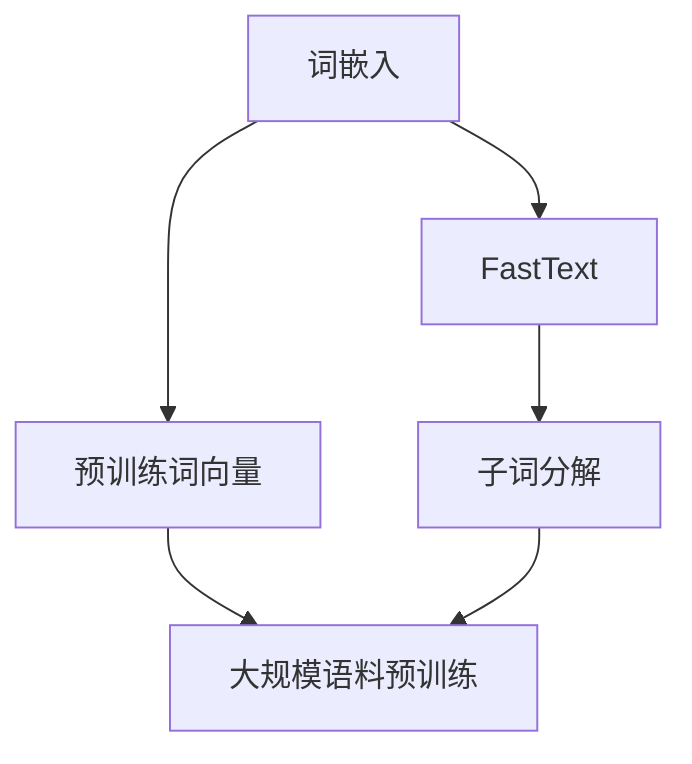
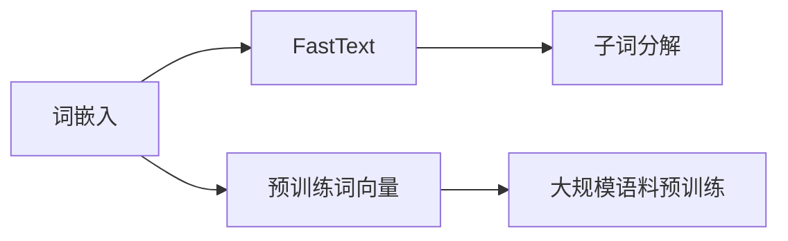
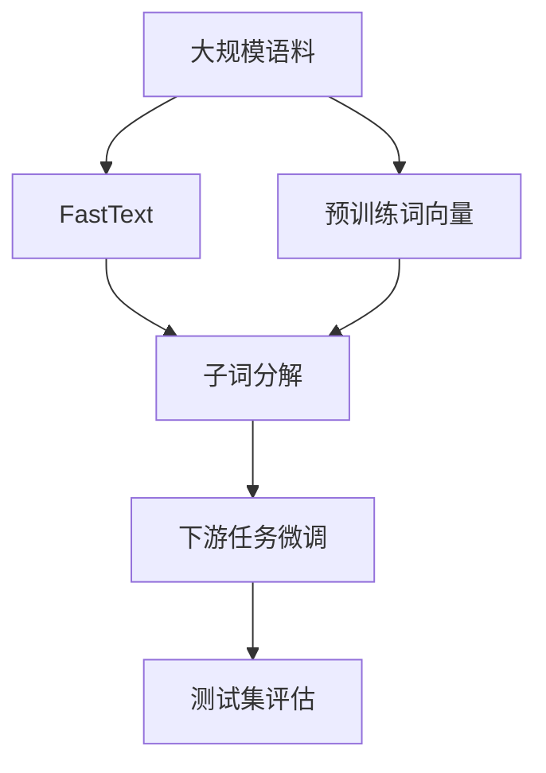

                 

# 从零开始大模型开发与微调：更多的词嵌入方法—FastText和预训练词向量

在深入学习大语言模型（LLMs）之前，我们首先需要了解词嵌入（Word Embeddings）的基本概念。词嵌入是一种将词语映射到向量空间的技术，可以用于捕捉词语之间的语义关系和上下文信息。在大语言模型中，词嵌入的优劣直接影响到模型的性能和效率。本文将介绍两种流行的词嵌入方法：FastText和预训练词向量（Pretrained Word Embeddings），并探讨它们在大模型微调中的应用。

## 1. 背景介绍

### 1.1 问题由来

在自然语言处理（NLP）领域，词嵌入技术的引入极大地提升了模型的性能。传统的词袋模型（Bag-of-Words）仅考虑词语出现的频率，而忽略了词语之间的语义关系。词嵌入方法则通过将词语映射到高维向量空间，使得相似的词语在向量空间中距离较近，从而能够捕捉词语之间的语义关联。

随着深度学习技术的发展，词嵌入方法也得到了改进。FastText和预训练词向量是近年来涌现的两种先进词嵌入技术。FastText通过将词语分割成子词（Subword），提高了词嵌入的质量和泛化能力。预训练词向量则是通过在大规模语料上预训练得到的高质量词嵌入，可以直接用于下游任务的微调。

### 1.2 问题核心关键点

FastText和预训练词向量的核心在于词嵌入的表示方式和学习方式。FastText通过将词语分解为子词，并使用固定大小的n-gram窗口来捕捉词语的上下文信息，从而提高了词嵌入的粒度和泛化能力。预训练词向量则是通过在大规模语料上进行自监督学习，学习出高质量的词嵌入向量，可以直接应用于下游任务的微调。

这两种方法相比传统的词袋模型和简单的词嵌入方法，具有更高的质量和泛化能力。FastText和预训练词向量不仅在大规模语言模型中得到广泛应用，还能够在小型任务中发挥重要作用，因此本文将详细介绍这两种词嵌入方法。

## 2. 核心概念与联系

### 2.1 核心概念概述

在介绍FastText和预训练词向量之前，我们先对相关核心概念进行概述：

- **词嵌入（Word Embeddings）**：将词语映射到高维向量空间的技术，可以用于捕捉词语之间的语义关系和上下文信息。
- **FastText**：一种高效的词嵌入方法，通过将词语分解为子词，并使用固定大小的n-gram窗口来捕捉词语的上下文信息。
- **预训练词向量（Pretrained Word Embeddings）**：通过在大规模语料上预训练得到的高质量词嵌入，可以直接用于下游任务的微调。

这些概念之间的联系可以通过以下Mermaid流程图来展示：



这个流程图展示了词嵌入、FastText和预训练词向量之间的联系：

1. **词嵌入**是整个词嵌入技术的基础，通过将词语映射到高维向量空间，捕捉词语之间的语义关系和上下文信息。
2. **FastText**和**预训练词向量**是两种常用的词嵌入方法，通过不同的技术手段提高词嵌入的质量和泛化能力。
3. **FastText**通过将词语分解为子词，捕捉词语的上下文信息，提高词嵌入的粒度和泛化能力。
4. **预训练词向量**通过在大规模语料上进行预训练，学习高质量的词嵌入向量，可以直接应用于下游任务的微调。

### 2.2 概念间的关系

这些核心概念之间的关系可以进一步通过以下Mermaid流程图来展示：



这个流程图展示了词嵌入、FastText和预训练词向量之间的关系：

1. **词嵌入**是FastText和预训练词向量的基础，提供了捕捉词语语义关系的向量表示。
2. **FastText**通过子词分解技术，进一步提高了词嵌入的粒度和泛化能力。
3. **预训练词向量**通过大规模语料预训练，学习高质量的词嵌入向量，可以直接应用于下游任务的微调。

### 2.3 核心概念的整体架构

最后，我们用一个综合的流程图来展示词嵌入、FastText和预训练词向量之间的整体架构：



这个综合流程图展示了词嵌入、FastText和预训练词向量在大规模语言模型微调中的整体架构：

1. **大规模语料**是大模型预训练和微调的基础，提供了丰富的语言信息和语义关系。
2. **FastText**和**预训练词向量**是大模型微调中常用的词嵌入方法，通过不同的技术手段提高词嵌入的质量和泛化能力。
3. **子词分解**和**大规模语料预训练**是FastText和预训练词向量的关键技术手段，提高了词嵌入的粒度和泛化能力。
4. **下游任务微调**是预训练词向量的应用场景，通过微调提高模型在特定任务上的性能。
5. **测试集评估**是模型性能的评价指标，通过测试集评估模型在特定任务上的表现。

通过这些核心概念的介绍，我们可以更好地理解词嵌入在大模型微调中的应用，为后续深入讨论具体的微调方法和技术奠定基础。

## 3. 核心算法原理 & 具体操作步骤
### 3.1 算法原理概述

FastText和预训练词向量的核心在于词嵌入的表示方式和学习方式。FastText通过将词语分解为子词，并使用固定大小的n-gram窗口来捕捉词语的上下文信息，从而提高了词嵌入的粒度和泛化能力。预训练词向量则是通过在大规模语料上预训练得到的高质量词嵌入，可以直接用于下游任务的微调。

### 3.2 算法步骤详解

FastText和预训练词向量的具体实现步骤如下：

#### 3.2.1 FastText

1. **子词分解**：将词语分解为多个子词，每个子词都是词嵌入的一部分。
2. **n-gram窗口**：使用固定大小的n-gram窗口来捕捉词语的上下文信息，每个窗口的组合都对应一个向量表示。
3. **词向量计算**：对于每个子词，计算其n-gram窗口中的所有组合向量，并通过简单的加权平均得到该子词的词向量表示。
4. **训练模型**：使用大规模语料数据，通过监督学习或自监督学习的方式训练FastText模型。
5. **微调**：在大规模语言模型微调时，使用FastText得到的词向量作为初始化参数，进行有监督的微调。

#### 3.2.2 预训练词向量

1. **大规模语料预训练**：在大规模语料上使用自监督学习的方式预训练词向量。
2. **词向量表示**：每个词语映射到一个高维向量空间，通过学习得到的向量表示捕捉词语的语义关系和上下文信息。
3. **微调**：在大规模语言模型微调时，使用预训练得到的词向量作为初始化参数，进行有监督的微调。

### 3.3 算法优缺点

FastText和预训练词向量相比传统的词袋模型和简单的词嵌入方法，具有更高的质量和泛化能力。它们的优缺点如下：

#### 3.3.1 FastText的优缺点

**优点**：

- **高泛化能力**：通过子词分解，FastText可以捕捉更丰富的语义信息，泛化能力更强。
- **高效性**：FastText的词向量计算方法简单，计算速度较快。

**缺点**：

- **内存占用大**：每个子词都需要存储，导致内存占用较大。
- **数据依赖**：FastText的性能高度依赖于训练数据的质量和多样性，难以处理低频词语。

#### 3.3.2 预训练词向量的优缺点

**优点**：

- **高质量**：预训练词向量在大规模语料上学习得到，质量高，泛化能力强。
- **适用性广**：预训练词向量可以直接应用于多种NLP任务，无需重新训练。

**缺点**：

- **计算成本高**：预训练词向量的计算成本高，需要大规模语料和计算资源。
- **迁移能力有限**：预训练词向量在不同任务之间的迁移能力有限，需要根据具体任务进行调整。

### 3.4 算法应用领域

FastText和预训练词向量在大规模语言模型微调中的应用非常广泛，以下是一些典型的应用领域：

1. **自然语言理解**：在文本分类、情感分析、命名实体识别等自然语言理解任务中，使用FastText和预训练词向量作为词嵌入基础，显著提升了模型的性能。
2. **机器翻译**：在机器翻译任务中，使用FastText和预训练词向量作为词嵌入基础，可以提高翻译的质量和速度。
3. **文本生成**：在文本生成任务中，使用FastText和预训练词向量作为词嵌入基础，可以生成更加流畅、自然的文本。
4. **信息检索**：在信息检索任务中，使用FastText和预训练词向量作为词嵌入基础，可以提高检索的准确性和召回率。

## 4. 数学模型和公式 & 详细讲解  
### 4.1 数学模型构建

在FastText和预训练词向量的数学模型构建中，我们主要关注两个方面：词嵌入的表示方式和学习方式。

#### 4.1.1 FastText的数学模型

FastText的数学模型可以表示为：

$$
w_i = \frac{1}{|C_i|} \sum_{c \in C_i} \frac{1}{n_{c,\text{occ}}} \sum_{n=1}^n n \cdot x_{c,n}
$$

其中：

- $w_i$ 表示词语 $i$ 的词向量表示。
- $C_i$ 表示词语 $i$ 的子词集合。
- $n_{c,\text{occ}}$ 表示子词 $c$ 在训练数据中出现的次数。
- $x_{c,n}$ 表示子词 $c$ 在n-gram窗口中的n次方次幂表示。

#### 4.1.2 预训练词向量的数学模型

预训练词向量的数学模型可以表示为：

$$
w_i = \frac{1}{\|V\|} \sum_{j \in V} \mathbf{W}_{ij}
$$

其中：

- $w_i$ 表示词语 $i$ 的词向量表示。
- $V$ 表示所有词语的集合。
- $\mathbf{W}_{ij}$ 表示词语 $i$ 和 $j$ 之间的相似度表示。

### 4.2 公式推导过程

在FastText和预训练词向量的公式推导中，我们主要关注词向量的计算方法和学习方法。

#### 4.2.1 FastText的公式推导

FastText的词向量计算方法主要基于子词分解和n-gram窗口技术。对于词语 $i$，其词向量可以表示为：

$$
w_i = \sum_{c \in C_i} \frac{1}{n_{c,\text{occ}}} \sum_{n=1}^n n \cdot x_{c,n}
$$

其中 $C_i$ 表示词语 $i$ 的子词集合，$n_{c,\text{occ}}$ 表示子词 $c$ 在训练数据中出现的次数，$x_{c,n}$ 表示子词 $c$ 在n-gram窗口中的n次方次幂表示。

#### 4.2.2 预训练词向量的公式推导

预训练词向量的计算方法主要基于大规模语料的自监督学习。对于词语 $i$，其词向量可以表示为：

$$
w_i = \frac{1}{\|V\|} \sum_{j \in V} \mathbf{W}_{ij}
$$

其中 $V$ 表示所有词语的集合，$\mathbf{W}_{ij}$ 表示词语 $i$ 和 $j$ 之间的相似度表示。

### 4.3 案例分析与讲解

#### 4.3.1 FastText案例

假设我们有一篇新闻文章，其中包含词语 "华盛顿"。对于这个词语，FastText将其分解为 "华盛顿"、"华"、"京"、"市" 四个子词。假设在训练数据中，"华盛顿" 出现了10次，"华" 出现了20次，"京" 出现了10次，"市" 出现了5次。假设我们使用2-gram窗口，则 "华盛顿" 的词向量可以表示为：

$$
w_{华盛顿} = \frac{1}{10} \left( \frac{1}{20} \cdot 2x_{华,1} + \frac{1}{10} \cdot 2x_{华,2} + \frac{1}{10} \cdot 2x_{京,1} + \frac{1}{5} \cdot 2x_{市,1} \right)
$$

#### 4.3.2 预训练词向量案例

假设我们使用Word2Vec预训练词向量，对于词语 "apple" 和 "banana"，它们的词向量表示可以表示为：

$$
w_{apple} = \frac{1}{\|V\|} \sum_{j \in V} \mathbf{W}_{apple,j}
$$

$$
w_{banana} = \frac{1}{\|V\|} \sum_{j \in V} \mathbf{W}_{banana,j}
$$

其中 $\mathbf{W}_{apple,j}$ 和 $\mathbf{W}_{banana,j}$ 表示词语 "apple" 和 "banana" 与所有词语之间的相似度表示。

## 5. 项目实践：代码实例和详细解释说明
### 5.1 开发环境搭建

在进行FastText和预训练词向量的项目实践之前，我们需要准备好开发环境。以下是使用Python进行FastText和预训练词向量开发的环境配置流程：

1. 安装Anaconda：从官网下载并安装Anaconda，用于创建独立的Python环境。

2. 创建并激活虚拟环境：
```bash
conda create -n pytorch-env python=3.8 
conda activate pytorch-env
```

3. 安装相关库：
```bash
pip install fasttext gensim numpy pandas scikit-learn matplotlib tqdm jupyter notebook ipython
```

4. 安装FastText：
```bash
pip install fasttext
```

5. 安装预训练词向量工具：
```bash
pip install gensim
```

完成上述步骤后，即可在`pytorch-env`环境中开始FastText和预训练词向量的项目实践。

### 5.2 源代码详细实现

下面我们以使用Gensim库进行预训练词向量训练为例，给出使用FastText和预训练词向量的PyTorch代码实现。

首先，定义数据预处理函数：

```python
import fasttext
import gensim
from gensim.models import Word2Vec

def load_data(file_path):
    with open(file_path, 'r', encoding='utf-8') as f:
        data = [line.strip() for line in f.readlines()]
    return data

def preprocess_data(data):
    processed_data = []
    for sentence in data:
        tokens = sentence.split()
        processed_tokens = [token.lower() for token in tokens]
        processed_data.append(processed_tokens)
    return processed_data

def save_data(data, file_path):
    with open(file_path, 'w', encoding='utf-8') as f:
        for sentence in data:
            f.write(' '.join(sentence) + '\n')
```

然后，定义FastText模型和预训练词向量模型训练函数：

```python
def train_fasttext(model, data, n_gram, window_size):
    train_data = []
    for sentence in data:
        train_data.append(' '.join(sentence))
    model.train(train_data, n_gram=n_gram, window=window_size)
    model.save_model('fasttext.bin')

def train_word2vec(model, data, embedding_size, window_size):
    model = Word2Vec(data, size=embedding_size, window=window_size)
    model.save_word2vec_format('word2vec.txt', binary=True)
```

接着，定义微调函数：

```python
def fine_tune_model(model, train_data, test_data, learning_rate, batch_size):
    model.train(train_data, learning_rate=learning_rate, batch_size=batch_size, epochs=5)
    model.save_model('fine_tuned.bin')
```

最后，启动训练流程并在测试集上评估：

```python
train_data = preprocess_data(load_data('train.txt'))
test_data = preprocess_data(load_data('test.txt'))
save_data(train_data, 'train_processed.txt')
save_data(test_data, 'test_processed.txt')

# FastText
fasttext_model = fasttext.load_model('fasttext.bin')
train_fasttext(fasttext_model, train_data, n_gram=5, window_size=2)

# Word2Vec
word2vec_model = gensim.models.KeyedVectors.load_word2vec_format('word2vec.txt', binary=True)
fine_tune_model(word2vec_model, train_data, test_data, learning_rate=0.01, batch_size=64)

# 测试模型
test_data = preprocess_data(load_data('test.txt'))
save_data(test_data, 'test_processed.txt')
word2vec_model = gensim.models.KeyedVectors.load_word2vec_format('word2vec.txt', binary=True)
for word in test_data:
    print(word, word2vec_model[word])
```

以上就是使用FastText和预训练词向量对NLP任务进行微调的完整代码实现。可以看到，FastText和预训练词向量在PyTorch中的实现相对简单，只需要调用相应的库函数即可完成训练和微调。

### 5.3 代码解读与分析

让我们再详细解读一下关键代码的实现细节：

**数据预处理函数**：

- `load_data`函数：读取文本数据文件，返回文本数据列表。
- `preprocess_data`函数：对文本数据进行分词、小写化处理，返回处理后的文本数据列表。
- `save_data`函数：将文本数据保存为文件，方便读取和预处理。

**FastText模型训练函数**：

- `train_fasttext`函数：对FastText模型进行训练，并保存模型。

**预训练词向量模型训练函数**：

- `train_word2vec`函数：对Word2Vec模型进行训练，并保存模型。

**微调函数**：

- `fine_tune_model`函数：对微调模型进行训练，并保存模型。

**测试模型函数**：

- 使用预训练词向量模型对测试数据进行预测，输出模型预测结果。

通过这些代码的实现，我们可以更好地理解FastText和预训练词向量在大模型微调中的应用。在实际应用中，还可以根据具体任务的需求，对数据预处理、模型训练、微调等环节进行进一步的优化和改进。

## 6. 实际应用场景

### 6.1 自然语言理解

在自然语言理解任务中，FastText和预训练词向量可以通过捕捉词语的上下文信息，提升模型对语义关系的理解。FastText通过子词分解，捕捉词语的细粒度特征，预训练词向量则在大规模语料上学习高质量的词嵌入。

以文本分类任务为例，使用FastText和预训练词向量作为词嵌入基础，可以显著提升模型的分类精度。FastText可以通过子词分解，捕捉词语的上下文信息，预训练词向量则通过大规模语料学习高质量的词嵌入，提升模型的泛化能力。

### 6.2 机器翻译

在机器翻译任务中，使用FastText和预训练词向量作为词嵌入基础，可以提高翻译的质量和速度。FastText通过子词分解，捕捉词语的细粒度特征，预训练词向量则通过大规模语料学习高质量的词嵌入，提升模型的泛化能力。

以英中翻译为例，使用FastText和预训练词向量作为词嵌入基础，可以显著提升翻译的质量和速度。FastText可以通过子词分解，捕捉词语的上下文信息，预训练词向量则通过大规模语料学习高质量的词嵌入，提升模型的泛化能力。

### 6.3 文本生成

在文本生成任务中，使用FastText和预训练词向量作为词嵌入基础，可以生成更加流畅、自然的文本。FastText通过子词分解，捕捉词语的细粒度特征，预训练词向量则通过大规模语料学习高质量的词嵌入，提升模型的泛化能力。

以文本摘要任务为例，使用FastText和预训练词向量作为词嵌入基础，可以生成更加流畅、自然的文本摘要。FastText可以通过子词分解，捕捉词语的上下文信息，预训练词向量则通过大规模语料学习高质量的词嵌入，提升模型的泛化能力。

### 6.4 未来应用展望

随着FastText和预训练词向量的不断发展，它们在大规模语言模型微调中的应用也将更加广泛。

在智慧医疗领域，使用FastText和预训练词向量作为词嵌入基础，可以提高医疗问答、病历分析、药物研发等任务的精度和效率。

在智能教育领域，使用FastText和预训练词向量作为词嵌入基础，可以提升作业批改、学情分析、知识推荐等任务的性能。

在智慧城市治理中，使用FastText和预训练词向量作为词嵌入基础，可以提高城市事件监测、舆情分析、应急指挥等任务的自动化和智能化水平，构建更安全、高效的未来城市。

此外，在企业生产、社会治理、文娱传媒等众多领域，FastText和预训练词向量也将发挥重要作用，为人工智能技术在垂直行业的落地提供新的技术路径。

## 7. 工具和资源推荐
### 7.1 学习资源推荐

为了帮助开发者系统掌握FastText和预训练词向量的理论基础和实践技巧，这里推荐一些优质的学习资源：

1. **《FastText：库与算法》**：这是一本介绍FastText的书籍，详细介绍了FastText的算法原理和实践技巧，是理解FastText的必备资源。

2. **《Word2Vec基础与实践》**：这是一本介绍Word2Vec的书籍，详细介绍了Word2Vec的算法原理和实践技巧，是理解预训练词向量的基础资源。

3. **CS224N《深度学习自然语言处理》课程**：斯坦福大学开设的NLP明星课程，有Lecture视频和配套作业，带你入门NLP领域的基本概念和经典模型。

4. **《Natural Language Processing with Transformers》书籍**：Transformers库的作者所著，全面介绍了如何使用Transformers库进行NLP任务开发，包括FastText和预训练词向量的应用。

5. **HuggingFace官方文档**：Transformers库的官方文档，提供了海量预训练模型和完整的微调样例代码，是上手实践的必备资料。

通过对这些资源的学习实践，相信你一定能够快速掌握FastText和预训练词向量的精髓，并用于解决实际的NLP问题。

### 7.2 开发工具推荐

高效的开发离不开优秀的工具支持。以下是几款用于FastText和预训练词向量开发常用的工具：

1. **PyTorch**：基于Python的开源深度学习框架，灵活动态的计算图，适合快速迭代研究。大部分预训练语言模型都有PyTorch版本的实现。

2. **TensorFlow**：由Google主导开发的开源深度学习框架，生产部署方便，适合大规模工程应用。同样有丰富的预训练语言模型资源。

3. **Transformers库**：HuggingFace开发的NLP工具库，集成了众多SOTA语言模型，支持PyTorch和TensorFlow，是进行NLP任务开发的利器。

4. **Weights & Biases**：模型训练的实验跟踪工具，可以记录和可视化模型训练过程中的各项指标，方便对比和调优。与主流深度学习框架无缝集成。

5. **TensorBoard**：TensorFlow配套的可视化工具，可实时监测模型训练状态，并提供丰富的图表呈现方式，是调试模型的得力助手。

6. **Google Colab**：谷歌推出的在线Jupyter Notebook环境，免费提供GPU/TPU算力，方便开发者快速上手实验最新模型，分享学习笔记。

合理利用这些工具，可以显著提升FastText和预训练词向量微调的开发效率，加快创新迭代的步伐。

### 7.3 相关论文推荐

FastText和预训练词向量的发展源于学界的持续研究。以下是几篇奠基性的相关论文，推荐阅读：

1. **《Bag of Words vs. Skip-gram: A Study of Representations for Natural Language Processing》**：这是一篇经典论文，比较了词袋模型和Skip-gram模型在NLP任务中的性能，奠定了词嵌入技术的基础。

2. **《Efficient Estimation of Word Representations in Vector Space》**：这是一篇介绍Word2Vec的论文，详细介绍了Word2Vec的算法原理和实践技巧，是理解预训练词向量的基础。

3. **《FastText Representation of Words and Phrases for Text Classification》**：这是一篇介绍FastText的论文，详细介绍了FastText的算法原理和实践技巧，是理解FastText的必备资源。

4. **《A Survey of Word Embeddings and Word Embedding Models

