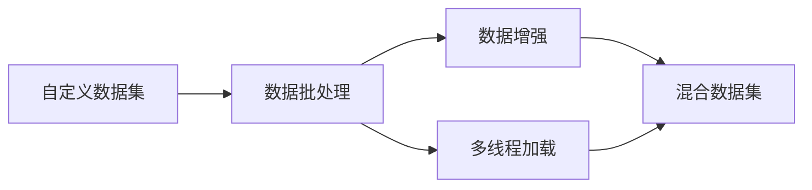

                 

# 从零开始大模型开发与微调：用于自定义数据集的torch.utils.data工具箱使用详解

## 1. 背景介绍

随着深度学习和大模型技术的迅猛发展，深度学习模型在图像、语音、自然语言处理（NLP）等领域取得了显著的成果。深度学习模型往往具有庞大的参数规模和复杂的计算图，因此在训练和推理过程中，对数据的高效处理和预处理显得尤为重要。PyTorch作为目前最流行的深度学习框架之一，提供了丰富的数据处理工具，其中`torch.utils.data`工具箱是进行数据加载和处理的强大工具，支持自定义数据集、数据增强、混合数据集、数据加载等常见需求。

### 1.1 大模型开发

在大模型的开发过程中，数据处理是一个重要的环节。使用`torch.utils.data`工具可以高效地加载、预处理、分批处理、多线程处理等，使得数据处理更加便捷。

### 1.2 微调需求

微调是指在大模型的基础上，使用更小的数据集（通常是已标注数据集）进行有监督学习，以适应特定的任务。微调在大模型领域的应用非常广泛，可以显著提高模型在特定任务上的性能。例如，对于NLP任务，可以使用预训练的BERT模型，针对特定的任务如问答、文本分类等进行微调。

## 2. 核心概念与联系

### 2.1 核心概念概述

为了更好地理解`torch.utils.data`工具，我们需要了解几个核心概念：

- **自定义数据集**：使用`torch.utils.data.Dataset`类定义一个自定义数据集，可以从内存、文件系统、数据库等源加载数据。
- **数据批处理**：将数据集划分为多个小批次，通过`torch.utils.data.DataLoader`实现。
- **数据增强**：对数据进行增强，提高模型的泛化能力，如随机裁剪、翻转、旋转等。
- **多线程加载**：通过多线程并行加载数据，加快数据加载速度。
- **混合数据集**：将多个数据集合并成一个，方便进行数据增强。

### 2.2 核心概念间的联系

这些概念之间的关系可以通过以下Mermaid流程图来展示：



这个流程图展示了自定义数据集通过数据批处理、数据增强、多线程加载，最后和混合数据集合并，形成一个完整的处理流程。

## 3. 核心算法原理 & 具体操作步骤

### 3.1 算法原理概述

使用`torch.utils.data`工具进行大模型开发和微调的核心原理是通过数据加载和批处理，将数据集分为多个小批次，并利用多线程进行并行加载。这样，可以显著提高数据处理的效率，同时也支持自定义的数据处理逻辑。

### 3.2 算法步骤详解

1. **定义自定义数据集**：通过继承`torch.utils.data.Dataset`类，自定义一个数据集，实现`__len__`和`__getitem__`方法。
2. **定义数据加载器**：通过`torch.utils.data.DataLoader`，设置批大小、采样方式、是否洗牌等参数，实现数据批处理和多线程加载。
3. **数据增强**：通过`torchvision.transforms`模块，定义数据增强的变换，如随机裁剪、翻转、旋转等。
4. **混合数据集**：通过`torch.utils.data.ConcatDataset`将多个数据集合并成一个。
5. **混合数据增强**：将多个数据集的数据增强合并成一个。

### 3.3 算法优缺点

#### 优点：
- **高效数据处理**：`torch.utils.data`工具支持自定义数据集，可以高效地处理各种类型的数据。
- **数据增强**：支持丰富的数据增强变换，提高模型的泛化能力。
- **多线程并行**：支持多线程并行加载数据，加快数据处理速度。

#### 缺点：
- **复杂性**：需要实现自定义数据集，需要熟悉Python和PyTorch。
- **数据限制**：对于一些特殊数据格式，可能需要自定义数据处理逻辑。

### 3.4 算法应用领域

`torch.utils.data`工具适用于各种深度学习任务，特别是在需要大规模数据处理的场景中表现出色。例如，图像分类、目标检测、NLP等任务。

## 4. 数学模型和公式 & 详细讲解 & 举例说明

### 4.1 数学模型构建

假设有一个自定义数据集`MyDataset`，其中包含输入数据`x`和标签`y`。

```python
class MyDataset(Dataset):
    def __init__(self, x, y):
        self.x = x
        self.y = y

    def __len__(self):
        return len(self.x)

    def __getitem__(self, idx):
        return self.x[idx], self.y[idx]
```

### 4.2 公式推导过程

假设训练集中有$N$个样本，每个样本有$m$个特征。使用数据加载器进行批量处理，将数据集分为$k$个批次，每个批次的样本数为$b$。数据加载器的批量大小为$b$。

数据加载器将数据集划分为多个小批次，每个小批次的计算公式如下：

$$
\text{Batch Size} = \frac{N}{k} \times b
$$

其中$k$为批次数，$b$为每个批次的样本数。

### 4.3 案例分析与讲解

假设有一个图像分类任务，需要将训练集中的图片进行随机裁剪、翻转等数据增强操作，然后加载到GPU上训练模型。

首先，定义一个自定义数据集`MyDataset`：

```python
from torchvision import datasets, transforms
import torch

class MyDataset(Dataset):
    def __init__(self, x, y):
        self.x = x
        self.y = y

    def __len__(self):
        return len(self.x)

    def __getitem__(self, idx):
        x = self.x[idx]
        y = self.y[idx]

        # 数据增强
        transform = transforms.Compose([
            transforms.RandomCrop(32, padding=4),
            transforms.RandomHorizontalFlip(),
            transforms.ToTensor(),
        ])
        x = transform(x)

        # 加载到GPU
        x = x.to(device)
        y = y.to(device)

        return x, y
```

然后，定义数据加载器`MyDataLoader`：

```python
class MyDataLoader(DataLoader):
    def __init__(self, dataset, batch_size, shuffle=True, drop_last=False):
        super(MyDataLoader, self).__init__(dataset, batch_size=batch_size, shuffle=shuffle, drop_last=drop_last)
```

最后，在训练过程中使用数据加载器进行批处理：

```python
# 加载数据集
train_dataset = MyDataset(train_x, train_y)

# 加载数据加载器
train_loader = MyDataLoader(train_dataset, batch_size=64, shuffle=True, drop_last=True)
```

## 5. 项目实践：代码实例和详细解释说明

### 5.1 开发环境搭建

要使用`torch.utils.data`工具，首先需要安装PyTorch和torchvision等依赖库。

```bash
pip install torch torchvision
```

### 5.2 源代码详细实现

以下是使用`torch.utils.data`工具进行自定义数据集加载和处理的完整代码实现。

```python
import torch
from torch.utils.data import Dataset, DataLoader
from torchvision import datasets, transforms

class MyDataset(Dataset):
    def __init__(self, x, y):
        self.x = x
        self.y = y

    def __len__(self):
        return len(self.x)

    def __getitem__(self, idx):
        x = self.x[idx]
        y = self.y[idx]

        # 数据增强
        transform = transforms.Compose([
            transforms.RandomCrop(32, padding=4),
            transforms.RandomHorizontalFlip(),
            transforms.ToTensor(),
        ])
        x = transform(x)

        # 加载到GPU
        x = x.to(device)
        y = y.to(device)

        return x, y

class MyDataLoader(DataLoader):
    def __init__(self, dataset, batch_size, shuffle=True, drop_last=False):
        super(MyDataLoader, self).__init__(dataset, batch_size=batch_size, shuffle=shuffle, drop_last=drop_last)

# 加载数据集
train_dataset = MyDataset(train_x, train_y)

# 加载数据加载器
train_loader = MyDataLoader(train_dataset, batch_size=64, shuffle=True, drop_last=True)
```

### 5.3 代码解读与分析

这里我们详细解读一下代码的关键部分：

**自定义数据集**：`MyDataset`类继承自`torch.utils.data.Dataset`，实现了`__len__`和`__getitem__`方法，用于加载和预处理数据。

**数据增强**：使用`torchvision.transforms`模块定义数据增强的变换，包括随机裁剪、翻转、旋转等。

**数据加载器**：`MyDataLoader`类继承自`torch.utils.data.DataLoader`，实现了`__init__`方法，用于设置批大小、采样方式等参数。

**数据加载**：使用`torch.utils.data.DataLoader`进行批量处理，将数据集分为多个小批次，并利用多线程进行并行加载。

**运行结果展示**

在训练过程中，可以使用数据加载器进行批处理：

```python
for batch_idx, (x, y) in enumerate(train_loader):
    # 训练模型
    optimizer.zero_grad()
    output = model(x)
    loss = loss_function(output, y)
    loss.backward()
    optimizer.step()

    # 输出日志
    print(f'Epoch: {epoch}, Batch: {batch_idx}')
```

## 6. 实际应用场景

### 6.1 图像分类

`torch.utils.data`工具广泛应用于图像分类任务。例如，可以使用`torchvision.datasets`模块加载图像数据集，然后使用自定义数据集和数据加载器进行处理。

### 6.2 目标检测

目标检测任务需要处理大规模图像数据集，使用`torch.utils.data`工具可以提高数据处理的效率。例如，可以使用`torchvision.datasets`模块加载图像数据集，然后使用自定义数据集和数据加载器进行处理。

### 6.3 NLP任务

在NLP任务中，可以使用`torch.utils.data`工具进行数据加载和预处理。例如，可以使用`torchtext.datasets`模块加载文本数据集，然后使用自定义数据集和数据加载器进行处理。

## 7. 工具和资源推荐

### 7.1 学习资源推荐

为了帮助开发者系统掌握`torch.utils.data`工具，这里推荐一些优质的学习资源：

1. PyTorch官方文档：PyTorch官方文档提供了详细的使用说明和示例代码，是学习`torch.utils.data`工具的必备资料。
2. Deep Learning Specialization：由Andrew Ng教授开设的深度学习课程，详细介绍了深度学习框架的使用方法，包括`torch.utils.data`工具的使用。
3. PyTorch中文社区：PyTorch中文社区提供了丰富的学习资源，包括博客、视频、代码等，是学习`torch.utils.data`工具的绝佳平台。

### 7.2 开发工具推荐

以下是几款用于深度学习任务开发的常用工具：

1. PyTorch：PyTorch是一个灵活的深度学习框架，提供了丰富的数据处理工具，包括`torch.utils.data`工具。
2. TensorFlow：TensorFlow是另一个流行的深度学习框架，提供了类似的数据处理工具，如`tf.data`工具。
3. Keras：Keras是一个高级深度学习框架，提供了简单易用的数据处理工具，如`keras.datasets`模块。

### 7.3 相关论文推荐

`torch.utils.data`工具的开发和应用涉及多个领域的研究。以下是几篇奠基性的相关论文，推荐阅读：

1. Data Loading in PyTorch：介绍`torch.utils.data`工具的使用方法和性能优化。
2. Automatic Mixed Precision Training with TorchDynamo：介绍混合精度训练技术，可以显著提高深度学习模型的训练速度。
3. Improving Data Loading Speeds in PyTorch with DataLoaders Parallelism：介绍并行数据加载技术，可以加速数据加载速度。

## 8. 总结：未来发展趋势与挑战

### 8.1 研究成果总结

`torch.utils.data`工具是深度学习开发和应用的重要组成部分，通过高效的数据处理和批处理，可以显著提高模型的训练和推理效率。

### 8.2 未来发展趋势

未来`torch.utils.data`工具的发展趋势主要体现在以下几个方面：

1. **分布式数据处理**：随着分布式深度学习框架的普及，`torch.utils.data`工具需要支持分布式数据处理，提高数据处理的效率和性能。
2. **数据增强**：数据增强是提高模型泛化能力的重要手段，未来`torch.utils.data`工具将提供更多的数据增强算法和工具。
3. **多模态数据处理**：多模态数据处理是未来深度学习的重要方向，`torch.utils.data`工具需要支持多模态数据加载和预处理。

### 8.3 面临的挑战

虽然`torch.utils.data`工具在深度学习任务中已经取得了很好的效果，但仍然面临一些挑战：

1. **复杂性**：`torch.utils.data`工具需要实现自定义数据集，需要熟悉Python和PyTorch。
2. **数据限制**：对于一些特殊数据格式，可能需要自定义数据处理逻辑。

### 8.4 研究展望

未来，`torch.utils.data`工具需要进一步简化使用，提高数据处理的效率，并支持更多的数据增强和数据加载方式。同时，需要与其他深度学习框架和工具进行更好的集成和互操作。

## 9. 附录：常见问题与解答

**Q1：如何加载大规模图像数据集？**

A: 可以使用`torchvision.datasets.ImageFolder`和`torch.utils.data.ConcatDataset`加载大规模图像数据集。例如：

```python
from torchvision.datasets import ImageFolder
from torch.utils.data import ConcatDataset

# 加载多个ImageFolder
dataset1 = ImageFolder('path1')
dataset2 = ImageFolder('path2')

# 合并多个数据集
dataset = ConcatDataset([dataset1, dataset2])
```

**Q2：如何实现多模态数据加载？**

A: 可以使用`torch.utils.data.ConcatDataset`将多个数据集合并成一个，每个数据集的数据类型可以不同。例如：

```python
from torch.utils.data import ConcatDataset
from torchvision import datasets

# 加载图像数据集
dataset1 = datasets.ImageFolder('path1')

# 加载文本数据集
dataset2 = MyTextDataset('path2')

# 合并多个数据集
dataset = ConcatDataset([dataset1, dataset2])
```

**Q3：如何进行数据增强？**

A: 可以使用`torchvision.transforms`模块定义数据增强的变换，例如：

```python
from torchvision import transforms

# 定义数据增强
transform = transforms.Compose([
    transforms.RandomCrop(32, padding=4),
    transforms.RandomHorizontalFlip(),
    transforms.ToTensor(),
])
```

**Q4：如何进行数据加载和批处理？**

A: 可以使用`torch.utils.data.DataLoader`进行数据加载和批处理，例如：

```python
from torch.utils.data import DataLoader

# 加载数据集
dataset = MyDataset(train_x, train_y)

# 加载数据加载器
loader = DataLoader(dataset, batch_size=64, shuffle=True, drop_last=True)
```

**Q5：如何进行混合精度训练？**

A: 可以使用`torch.cuda.amp`模块进行混合精度训练，例如：

```python
import torch

# 设置混合精度模式
device = torch.device('cuda')
model = MyModel().to(device)
optimizer = torch.optim.Adam(model.parameters(), lr=0.001)
scaler = torch.cuda.amp.GradScaler()

# 混合精度训练
for epoch in range(num_epochs):
    for batch in train_loader:
        x, y = batch
        x = x.to(device)
        y = y.to(device)

        # 混合精度前向传播
        with torch.cuda.amp.autocast():
            output = model(x)

        # 混合精度反向传播
        scaler.scale(optimizer.zero_grad(), p=torch.cuda.current_device())
        loss = loss_function(output, y)
        scaler.unscale_(optimizer)
        loss.backward()
        scaler.step(optimizer)
```

---

作者：禅与计算机程序设计艺术 / Zen and the Art of Computer Programming

