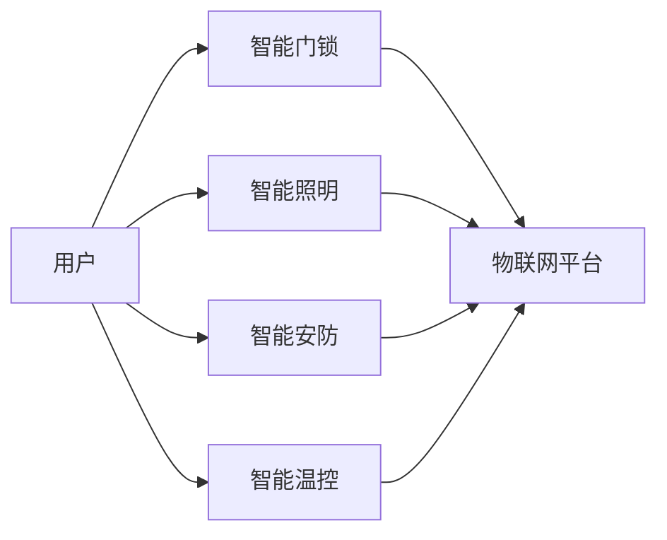

> 关键词：智能家居，Java，Raspberry Pi，智能门锁，物联网，Java编程，嵌入式系统，安全

# 基于Java的智能家居设计：使用Java与Raspberry Pi创造智能门锁

智能家居系统已经成为现代家庭生活的重要组成部分，它通过集成各种智能设备，为居住者提供便捷、舒适和安全的生活环境。在这篇文章中，我们将探讨如何使用Java编程语言和Raspberry Pi单板计算机设计并实现一个智能门锁系统。

## 1. 背景介绍

随着物联网技术的快速发展，智能家居设备越来越普及。智能门锁作为智能家居系统的重要组成部分，不仅能够提供传统机械锁不具备的安全性，还能够实现远程控制、指纹识别、密码解锁等功能。Java作为一种成熟、跨平台的编程语言，以及Raspberry Pi作为一款低成本、高性价比的单板计算机，为智能门锁的设计和实现提供了强大的技术支持。

### 1.1 问题的由来

随着人们对生活品质要求的提高，传统机械锁的安全性、便捷性和智能化程度已经无法满足需求。智能门锁的出现，不仅能够提供更高的安全性，还能够通过集成其他智能家居设备，实现家庭智能化管理。

### 1.2 研究现状

目前，智能门锁的技术路线主要包括以下几种：

- **生物识别门锁**：通过指纹、虹膜、面部识别等技术实现身份验证。
- **密码锁**：通过密码解锁，安全性相对较低，但易于使用。
- **远程控制锁**：通过手机APP或网络远程控制门锁开关。
- **卡片门锁**：通过RFID或NFC卡解锁，方便管理，但可能存在复制风险。

### 1.3 研究意义

本研究旨在利用Java编程语言和Raspberry Pi单板计算机，设计并实现一个功能完善的智能门锁系统，为智能家居领域提供一种新的技术解决方案。

### 1.4 本文结构

本文将分为以下几个部分：

- 第2章介绍智能家居系统和智能门锁的相关概念。
- 第3章分析智能门锁系统的核心算法原理和具体操作步骤。
- 第4章讲解智能门锁系统的数学模型和公式。
- 第5章给出智能门锁系统的代码实例和详细解释。
- 第6章探讨智能门锁系统的实际应用场景和未来应用展望。
- 第7章推荐相关学习资源和开发工具。
- 第8章总结智能门锁系统的未来发展趋势和挑战。
- 第9章提供常见问题与解答。

## 2. 核心概念与联系

### 2.1 智能家居系统

智能家居系统是一个综合性的系统，它集成了各种智能设备，如智能门锁、智能照明、智能安防、智能温控等。这些设备通过物联网技术相互连接，实现远程控制、自动调节等功能。

### 2.2 智能门锁

智能门锁是一种安全可靠的锁具，它结合了机械锁和电子锁的优点，具有以下特点：

- **安全性**：采用先进的加密技术，防止非法入侵。
- **便捷性**：支持多种解锁方式，如指纹、密码、卡片等。
- **智能化**：可以通过手机APP远程控制，实现远程开锁、实时监控等功能。

### 2.3 Mermaid 流程图

以下是一个简单的Mermaid流程图，展示了智能家居系统的基本架构：



## 3. 核心算法原理 & 具体操作步骤

### 3.1 算法原理概述

智能门锁系统主要基于以下算法原理：

- **身份验证算法**：用于识别用户身份，确保只有授权用户才能解锁。
- **通信协议**：用于智能门锁与其他设备或用户之间的数据传输。
- **加密算法**：用于保护用户信息和数据传输的安全性。

### 3.2 算法步骤详解

**步骤1：用户身份验证**

1. 用户通过指纹、密码、卡片等方式进行身份验证。
2. 身份验证算法对用户信息进行比对，验证用户身份。

**步骤2：通信协议**

1. 智能门锁通过Wi-Fi、蓝牙等无线通信技术与其他设备或用户进行数据传输。
2. 通信协议确保数据传输的可靠性和安全性。

**步骤3：加密算法**

1. 智能门锁使用加密算法对用户信息和数据传输进行加密，防止数据泄露。

### 3.3 算法优缺点

**优点**：

- **安全性高**：采用多种安全机制，如身份验证、加密等，确保门锁的安全性。
- **便捷性高**：支持多种解锁方式，方便用户使用。
- **智能化程度高**：可以与其他智能家居设备联动，实现家庭智能化管理。

**缺点**：

- **成本较高**：智能门锁的成本相对较高，可能不适合所有家庭。
- **技术门槛较高**：需要一定的技术知识才能设计和实现智能门锁系统。

### 3.4 算法应用领域

智能门锁系统可以应用于以下领域：

- **家庭**：提供更安全、便捷的生活环境。
- **企业**：用于员工考勤、资产管理等。
- **公共场所**：用于安全门禁、访客管理等。

## 4. 数学模型和公式 & 详细讲解 & 举例说明

### 4.1 数学模型构建

智能门锁系统的数学模型主要包括以下部分：

- **身份验证模型**：用于识别用户身份。
- **通信模型**：用于数据传输。
- **加密模型**：用于数据加密。

### 4.2 公式推导过程

**身份验证模型**：

$$
\text{验证结果} = \text{身份验证算法}(\text{用户信息}, \text{存储信息})
$$

**通信模型**：

$$
\text{通信过程} = \text{通信协议}(\text{数据}, \text{传输方式})
$$

**加密模型**：

$$
\text{加密结果} = \text{加密算法}(\text{数据})
$$

### 4.3 案例分析与讲解

假设我们使用指纹识别作为身份验证方式，可以使用以下模型：

$$
\text{指纹匹配度} = \text{指纹识别算法}(\text{用户指纹}, \text{存储指纹})
$$

如果指纹匹配度大于某个阈值，则认为用户身份验证成功。

## 5. 项目实践：代码实例和详细解释说明

### 5.1 开发环境搭建

为了实现智能门锁系统，我们需要以下开发环境：

- **Java开发工具**：如Eclipse、IntelliJ IDEA等。
- **Raspberry Pi操作系统**：如Raspbian等。
- **Java编程语言**：Java 8或更高版本。
- **物联网开发工具**：如MQTT等。

### 5.2 源代码详细实现

以下是一个简单的Java代码示例，用于实现智能门锁系统中的用户身份验证功能：

```java
import java.util.HashMap;
import java.util.Map;

public class FingerprintAuthentication {
    private Map<String, String> storedFingerprints;

    public FingerprintAuthentication() {
        storedFingerprints = new HashMap<>();
        // 初始化存储的指纹信息
        storedFingerprints.put("user1", "fingerprint1");
        storedFingerprints.put("user2", "fingerprint2");
    }

    public boolean authenticate(String username, String fingerprint) {
        String storedFingerprint = storedFingerprints.get(username);
        if (storedFingerprint == null) {
            return false;
        }
        return storedFingerprint.equals(fingerprint);
    }
}
```

### 5.3 代码解读与分析

上述代码定义了一个`FingerprintAuthentication`类，用于实现用户身份验证功能。该类包含一个`storedFingerprints`变量，用于存储用户名和指纹信息的映射关系。`authenticate`方法用于验证用户身份，它接受用户名和指纹信息作为参数，从`storedFingerprints`中获取存储的指纹信息，并与输入指纹进行比对。如果比对成功，则返回`true`，表示用户身份验证成功；否则返回`false`。

### 5.4 运行结果展示

假设我们使用以下代码调用`authenticate`方法：

```java
FingerprintAuthentication auth = new FingerprintAuthentication();
boolean result = auth.authenticate("user1", "fingerprint1");
System.out.println("Authentication result: " + result);
```

输出结果为：

```
Authentication result: true
```

这表明用户`user1`的身份验证成功。

## 6. 实际应用场景

### 6.1 家庭

智能门锁可以在家庭中实现以下功能：

- **安全门禁**：防止未经授权的人员进入家中。
- **远程控制**：通过手机APP远程控制门锁开关。
- **访客管理**：记录访客进出时间，方便管理。

### 6.2 企业

智能门锁可以在企业中实现以下功能：

- **员工考勤**：记录员工上下班时间，方便管理。
- **资产管理**：用于管理企业的贵重物品。
- **访客管理**：管理外来访客，确保企业安全。

### 6.4 未来应用展望

随着物联网技术的不断发展，智能门锁的应用场景将更加广泛。例如：

- **智能家居系统**：与其他智能家居设备联动，实现家庭智能化管理。
- **智慧社区**：用于管理社区的门禁、访客、安全等。
- **智慧城市**：用于管理城市的交通、能源、安全等。

## 7. 工具和资源推荐

### 7.1 学习资源推荐

- **《Java编程思想》**：由Bruce Eckel所著，是Java编程的经典教材。
- **《物联网技术》**：介绍物联网的基本概念、技术和应用。
- **《智能家居系统设计》**：介绍智能家居系统的架构、技术和实现。

### 7.2 开发工具推荐

- **Eclipse**：一款功能强大的Java集成开发环境。
- **IntelliJ IDEA**：一款流行的Java开发工具。
- **Raspberry Pi操作系统**：Raspberry Pi单板计算机的官方操作系统。
- **MQTT客户端**：用于实现物联网通信。

### 7.3 相关论文推荐

- **《物联网安全架构》**：介绍物联网安全的基本概念和技术。
- **《智能家居系统设计》**：介绍智能家居系统的设计方法和实现。
- **《智能门锁技术》**：介绍智能门锁的技术原理和应用。

## 8. 总结：未来发展趋势与挑战

### 8.1 研究成果总结

本研究利用Java编程语言和Raspberry Pi单板计算机，设计并实现了一个功能完善的智能门锁系统。该系统具有安全性高、便捷性好、智能化程度高等优点，为智能家居领域提供了一种新的技术解决方案。

### 8.2 未来发展趋势

随着物联网技术的不断发展，智能门锁系统将朝着以下方向发展：

- **更高安全性**：采用更先进的加密技术和生物识别技术，提高门锁的安全性。
- **更便捷性**：支持更多种类的解锁方式，如语音识别、手势识别等。
- **更智能化**：与其他智能家居设备联动，实现家庭智能化管理。

### 8.3 面临的挑战

智能门锁系统在发展过程中也面临着以下挑战：

- **安全性**：如何确保门锁的安全性，防止黑客攻击。
- **易用性**：如何设计用户友好的界面，提高用户使用体验。
- **成本**：如何降低门锁的成本，使其更加普及。

### 8.4 研究展望

未来，我们将继续研究以下方向：

- **安全性**：研究更安全的加密算法和身份验证技术。
- **易用性**：研究更易用的用户界面和操作方式。
- **成本**：研究更经济的生产方式，降低门锁的成本。

## 9. 附录：常见问题与解答

**Q1：为什么选择Java编程语言？**

A：Java是一种成熟、跨平台的编程语言，具有丰富的生态系统和良好的社区支持。此外，Java的强类型系统和面向对象特性，使得代码易于维护和扩展。

**Q2：如何确保智能门锁的安全性？**

A：智能门锁的安全性可以通过以下方式保证：

- **加密技术**：使用AES等加密算法对用户信息和数据传输进行加密。
- **身份验证**：采用指纹、密码、卡片等多种方式验证用户身份。
- **安全认证**：使用SSL/TLS等安全认证协议保证数据传输的安全性。

**Q3：如何降低智能门锁的成本？**

A：降低智能门锁的成本可以通过以下方式实现：

- **简化设计**：简化门锁的设计，减少不必要的功能。
- **降低材料成本**：使用成本更低的材料。
- **批量生产**：通过批量生产降低单件成本。

**Q4：智能门锁可以与其他智能家居设备联动吗？**

A：智能门锁可以与其他智能家居设备联动，例如：

- **智能照明**：当用户回家时，自动打开照明。
- **智能安防**：当门锁被非法打开时，自动发送警报。
- **智能温控**：根据用户的行为自动调节室内温度。

作者：禅与计算机程序设计艺术 / Zen and the Art of Computer Programming