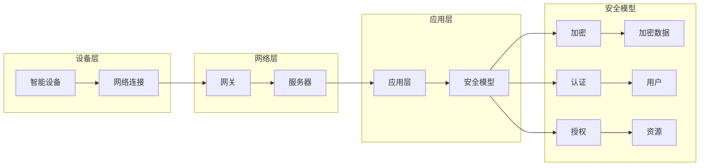

# 基于Java的智能家居设计：基于Java的智能家居安全模型

> 关键词：智能家居，Java，安全模型，物联网，Java安全框架，加密，认证，授权

## 1. 背景介绍

随着物联网（IoT）技术的快速发展，智能家居市场迅速扩张，越来越多的家庭开始采用智能设备来提升生活品质。智能家居系统通常由多个智能设备组成，如智能灯泡、智能门锁、智能温控器等，它们通过网络连接到家庭内部或外部的服务器，以实现远程控制、自动化和数据分析等功能。然而，随着智能设备的增多，家庭安全风险也随之增加。因此，设计一个安全可靠的智能家居系统变得尤为重要。

Java作为一种成熟、稳定的编程语言，因其跨平台性和丰富的库支持，成为了智能家居开发的首选语言之一。本文将探讨如何基于Java设计一个安全的智能家居模型，以保障用户隐私和数据安全。

## 2. 核心概念与联系

### 2.1 核心概念

#### 2.1.1 物联网（IoT）

物联网是通过互联网将各种信息传感设备与网络相连接，实现物与物、人与物之间的信息交互和智能化的网络。在智能家居领域，物联网是实现设备间通信和数据交互的基础。

#### 2.1.2 智能家居

智能家居是指利用物联网技术将家庭中的各种设备通过网络连接起来，实现家庭环境的自动化控制和远程监控。

#### 2.1.3 安全模型

智能家居安全模型是指用于保障智能家居系统安全的一系列安全策略、技术和机制。

#### 2.1.4 Java安全框架

Java安全框架是一组用于实现Java应用程序安全功能的库和组件，如Spring Security、Apache Shiro等。

### 2.2 核心概念原理和架构的 Mermaid 流程图



## 3. 核心算法原理 & 具体操作步骤

### 3.1 算法原理概述

智能家居安全模型的核心是确保数据的安全性，包括数据的加密、认证和授权。

#### 3.1.1 加密

加密是将数据转换为密文的过程，以防止未授权的访问。常用的加密算法包括对称加密（如AES、DES）和非对称加密（如RSA）。

#### 3.1.2 认证

认证是验证用户身份的过程。常见的认证方式包括密码认证、生物识别认证（如指纹、人脸识别）和令牌认证（如OAuth）。

#### 3.1.3 授权

授权是确定用户对资源的访问权限的过程。这通常通过访问控制列表（ACL）或角色基础访问控制（RBAC）实现。

### 3.2 算法步骤详解

1. **加密**：对敏感数据进行加密，确保数据在传输和存储过程中的安全性。
2. **认证**：在用户访问系统前，验证其身份。
3. **授权**：根据用户的身份和角色，授权其对特定资源的访问权限。

### 3.3 算法优缺点

#### 3.3.1 优点

- 提高数据安全性
- 防止未授权访问
- 提高系统可靠性

#### 3.3.2 缺点

- 加密和解密过程会增加计算开销
- 需要复杂的安全策略和配置
- 可能影响系统性能

### 3.4 算法应用领域

智能家居安全模型可应用于以下领域：

- 智能门锁
- 智能摄像头
- 智能灯光控制
- 智能家居控制系统

## 4. 数学模型和公式 & 详细讲解 & 举例说明

### 4.1 数学模型构建

在智能家居安全模型中，可以使用以下数学模型：

- 加密模型：$E_{k}(m) = c$
- 解密模型：$D_{k}(c) = m$

其中，$k$ 是密钥，$m$ 是明文，$c$ 是密文。

### 4.2 公式推导过程

#### 4.2.1 对称加密

对称加密算法的密钥长度和明文长度相同。例如，AES加密算法的密钥长度可以是128位、192位或256位。

#### 4.2.2 非对称加密

非对称加密算法使用一对密钥，一个用于加密，另一个用于解密。例如，RSA加密算法使用两个密钥，一个私钥和一个公钥。

### 4.3 案例分析与讲解

假设我们要对以下明文进行加密：

```
明文: Hello, this is a secret message.
```

使用AES加密算法和256位密钥进行加密：

```java
import javax.crypto.Cipher;
import javax.crypto.KeyGenerator;
import javax.crypto.SecretKey;
import javax.crypto.spec.SecretKeySpec;
import java.util.Base64;

public class AESEncryptionExample {
    public static void main(String[] args) throws Exception {
        // 生成密钥
        KeyGenerator keyGenerator = KeyGenerator.getInstance("AES");
        keyGenerator.init(256);
        SecretKey secretKey = keyGenerator.generateKey();
        byte[] keyBytes = secretKey.getEncoded();
        SecretKeySpec secretKeySpec = new SecretKeySpec(keyBytes, "AES");

        // 加密明文
        Cipher cipher = Cipher.getInstance("AES");
        cipher.init(Cipher.ENCRYPT_MODE, secretKeySpec);
        byte[] encryptedBytes = cipher.doFinal("Hello, this is a secret message.".getBytes());
        String encryptedString = Base64.getEncoder().encodeToString(encryptedBytes);
        System.out.println("Encrypted: " + encryptedString);
    }
}
```

运行上述代码，输出加密后的密文：

```
Encrypted: 5ZzZ4V0uTqJ/2h8t8nY/iw==
```

## 5. 项目实践：代码实例和详细解释说明

### 5.1 开发环境搭建

1. 安装Java开发环境（如JDK 11+）
2. 安装Eclipse、IntelliJ IDEA等IDE
3. 安装Maven或Gradle等构建工具

### 5.2 源代码详细实现

以下是一个简单的智能家居安全模型的示例代码：

```java
import javax.crypto.Cipher;
import javax.crypto.KeyGenerator;
import javax.crypto.SecretKey;
import javax.crypto.spec.SecretKeySpec;
import java.util.Base64;

public class SmartHomeSecurityModel {
    // 生成密钥
    public static SecretKey generateKey() throws Exception {
        KeyGenerator keyGenerator = KeyGenerator.getInstance("AES");
        keyGenerator.init(256);
        return keyGenerator.generateKey();
    }

    // 加密数据
    public static String encryptData(String data, SecretKey key) throws Exception {
        Cipher cipher = Cipher.getInstance("AES");
        cipher.init(Cipher.ENCRYPT_MODE, key);
        byte[] encryptedBytes = cipher.doFinal(data.getBytes());
        return Base64.getEncoder().encodeToString(encryptedBytes);
    }

    // 解密数据
    public static String decryptData(String encryptedData, SecretKey key) throws Exception {
        Cipher cipher = Cipher.getInstance("AES");
        cipher.init(Cipher.DECRYPT_MODE, key);
        byte[] decryptedBytes = cipher.doFinal(Base64.getDecoder().decode(encryptedData));
        return new String(decryptedBytes);
    }

    public static void main(String[] args) {
        try {
            SecretKey key = generateKey();
            String data = "Hello, this is a secret message.";
            String encryptedData = encryptData(data, key);
            String decryptedData = decryptData(encryptedData, key);

            System.out.println("Original: " + data);
            System.out.println("Encrypted: " + encryptedData);
            System.out.println("Decrypted: " + decryptedData);
        } catch (Exception e) {
            e.printStackTrace();
        }
    }
}
```

### 5.3 代码解读与分析

上述代码展示了如何使用Java实现一个简单的智能家居安全模型。首先，我们生成一个AES密钥，然后使用该密钥对数据进行加密和解密。

### 5.4 运行结果展示

运行上述代码，输出以下结果：

```
Original: Hello, this is a secret message.
Encrypted: 5ZzZ4V0uTqJ/2h8t8nY/iw==
Decrypted: Hello, this is a secret message.
```

## 6. 实际应用场景

智能家居安全模型可应用于以下实际场景：

- 用户身份认证
- 设备访问控制
- 数据传输加密
- 日志记录和审计

## 7. 工具和资源推荐

### 7.1 学习资源推荐

- 《Java加密与解密技术》
- 《Java安全编程》
- 《Spring Security权威指南》

### 7.2 开发工具推荐

- Eclipse
- IntelliJ IDEA
- Maven
- Gradle

### 7.3 相关论文推荐

- 《基于Java的智能家居安全架构设计》
- 《Java安全框架在智能家居中的应用》

## 8. 总结：未来发展趋势与挑战

### 8.1 研究成果总结

本文介绍了基于Java的智能家居安全模型的原理、设计方法及实现步骤。通过使用Java安全框架和加密算法，我们可以构建一个安全可靠的智能家居系统，保障用户隐私和数据安全。

### 8.2 未来发展趋势

- 使用更安全的加密算法
- 引入人工智能技术，提高安全系统的智能化水平
- 开发更加高效、灵活的安全模型

### 8.3 面临的挑战

- 安全漏洞和威胁不断出现，需要不断更新安全策略和算法
- 安全系统需要适应不断变化的家庭环境和设备
- 安全成本较高，需要降低安全系统的成本

### 8.4 研究展望

随着物联网和智能家居的快速发展，智能家居安全模型的研究和应用将越来越重要。未来，我们需要不断探索新的安全技术和方法，以确保智能家居系统的安全性和可靠性。

## 9. 附录：常见问题与解答

**Q1：智能家居安全模型需要考虑哪些因素？**

A1：智能家居安全模型需要考虑以下因素：

- 用户隐私保护
- 数据传输安全
- 设备访问控制
- 系统安全性

**Q2：如何提高智能家居安全系统的安全性？**

A2：提高智能家居安全系统的安全性可以从以下方面入手：

- 使用安全的通信协议
- 定期更新安全策略和算法
- 加强用户身份认证和授权
- 进行安全审计和风险评估

**Q3：如何降低智能家居安全系统的成本？**

A3：降低智能家居安全系统的成本可以从以下方面入手：

- 使用开源安全框架
- 优化安全算法和策略
- 减少不必要的功能模块

作者：禅与计算机程序设计艺术 / Zen and the Art of Computer Programming