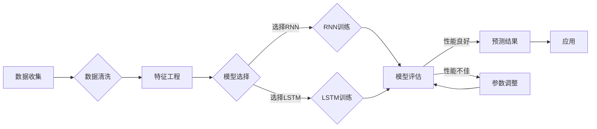

> 时间序列分析, 商品销量预测, 回归分析, 季节性因素, 时间窗口, 长短期记忆网络(LSTM), 深度学习, 机器学习, 优化策略

# 基于时间序列的商品销量预测分析

时间序列分析在商业决策中扮演着至关重要的角色。特别是对于商品销量预测，准确的预测结果能够帮助企业优化库存管理、制定有效的营销策略，甚至预测市场趋势。本文将探讨基于时间序列的商品销量预测分析，从核心概念到实际操作，全面解析这一领域的原理、方法和实践。

## 1. 背景介绍

### 1.1 问题的由来

随着商业环境的日益复杂和竞争的加剧，企业对市场需求的预测能力提出了更高的要求。传统的销售预测方法往往依赖于历史数据和简单的统计模型，如移动平均法、指数平滑法等。然而，这些方法难以捕捉时间序列数据中的非线性、季节性和趋势性特征，导致预测精度不足。

### 1.2 研究现状

近年来，随着机器学习技术的快速发展，基于深度学习的预测模型逐渐成为研究热点。长短期记忆网络(LSTM)、循环神经网络(RNN)等深度学习模型能够有效捕捉时间序列数据中的复杂模式，为商品销量预测提供了新的思路。

### 1.3 研究意义

准确预测商品销量对于企业具有重要意义：
- 优化库存管理：避免库存过剩或缺货，降低成本。
- 制定营销策略：根据市场需求调整产品定价、促销活动等。
- 预测市场趋势：洞察市场变化，把握市场机遇。
- 改善供应链管理：优化生产计划，提高供应链效率。

### 1.4 本文结构

本文将按照以下结构展开：
- 第2部分，介绍时间序列分析的核心概念和Mermaid流程图。
- 第3部分，探讨常用的商品销量预测算法原理和步骤。
- 第4部分，讲解数学模型和公式，并举例说明。
- 第5部分，展示代码实例和详细解释。
- 第6部分，分析实际应用场景和未来应用展望。
- 第7部分，推荐相关学习资源和开发工具。
- 第8部分，总结研究成果和未来发展趋势。
- 第9部分，提供常见问题与解答。

## 2. 核心概念与联系

### 2.1 核心概念

**时间序列**：按照一定时间顺序排列的数据序列，通常用于记录某个现象随时间变化的趋势。

**销量预测**：根据历史销量数据，预测未来一段时间内的销量趋势。

**季节性因素**：时间序列数据中重复出现的规律性波动，如节假日、促销活动等。

**时间窗口**：在时间序列分析中，用于界定数据观察范围的时段。

**长短期记忆网络(LSTM)**：一种特殊的循环神经网络，能够学习长期依赖关系。

**深度学习**：一种机器学习方法，通过多层神经网络学习数据中的特征。

**机器学习**：一种使计算机系统通过数据学习并做出决策或预测的技术。

### 2.2 Mermaid流程图

以下是一个简单的时间序列分析流程图：



## 3. 核心算法原理 & 具体操作步骤

### 3.1 算法原理概述

商品销量预测的主要算法包括回归分析、时间序列分析和深度学习模型。

**回归分析**：通过建立销量与影响因素之间的线性关系来预测未来销量。

**时间序列分析**：分析销量数据的时间序列特征，如趋势、季节性、周期性等。

**深度学习模型**：利用神经网络学习销量数据中的复杂模式，如LSTM、RNN等。

### 3.2 算法步骤详解

**3.2.1 回归分析**

1. 数据收集：收集历史销量数据和相关影响因素数据。
2. 数据预处理：对数据进行清洗、标准化等操作。
3. 特征工程：提取销量数据中的特征，如时间、促销活动等。
4. 模型训练：选择合适的回归模型，如线性回归、多项式回归等。
5. 模型评估：评估模型性能，如均方误差(MSE)、均方根误差(RMSE)等。
6. 预测：使用训练好的模型预测未来销量。

**3.2.2 时间序列分析**

1. 数据收集：收集历史销量数据。
2. 数据预处理：对数据进行清洗、标准化等操作。
3. 特征工程：提取销量数据的时间序列特征，如自回归项、移动平均项等。
4. 模型选择：选择合适的时间序列模型，如ARIMA、SARIMA等。
5. 模型参数优化：优化模型参数，如p、d、q等。
6. 模型评估：评估模型性能，如AIC、BIC等。
7. 预测：使用训练好的模型预测未来销量。

**3.2.3 深度学习模型**

1. 数据收集：收集历史销量数据。
2. 数据预处理：对数据进行清洗、标准化等操作。
3. 特征工程：提取销量数据中的特征，如时间、促销活动等。
4. 模型选择：选择合适的深度学习模型，如LSTM、RNN等。
5. 模型训练：使用训练好的模型预测未来销量。
6. 模型评估：评估模型性能，如均方误差(MSE)、均方根误差(RMSE)等。
7. 预测：使用训练好的模型预测未来销量。

### 3.3 算法优缺点

**3.3.1 回归分析**

优点：简单易懂，计算效率高。

缺点：难以捕捉非线性、季节性和趋势性特征。

**3.3.2 时间序列分析**

优点：能够捕捉时间序列数据中的趋势、季节性、周期性特征。

缺点：参数调整复杂，计算效率较低。

**3.3.3 深度学习模型**

优点：能够捕捉时间序列数据中的复杂模式，预测精度高。

缺点：模型复杂，计算效率低，需要大量标注数据。

### 3.4 算法应用领域

回归分析、时间序列分析和深度学习模型在以下领域都有广泛应用：

- 销量预测
- 股票市场预测
- 能源需求预测
- 交通流量预测
- 天气预测

## 4. 数学模型和公式 & 详细讲解 & 举例说明

### 4.1 数学模型构建

**4.1.1 回归分析**

假设销量 $y$ 与影响因素 $x_1, x_2, ..., x_n$ 之间存在线性关系，则回归模型可以表示为：

$$
y = \beta_0 + \beta_1 x_1 + \beta_2 x_2 + ... + \beta_n x_n + \epsilon
$$

其中 $\beta_0, \beta_1, ..., \beta_n$ 为回归系数，$\epsilon$ 为误差项。

**4.1.2 时间序列分析**

假设销量时间序列 $y_t$ 满足自回归模型，则模型可以表示为：

$$
y_t = c + \phi_1 y_{t-1} + \phi_2 y_{t-2} + ... + \phi_p y_{t-p} + \epsilon_t
$$

其中 $c$ 为常数项，$\phi_1, \phi_2, ..., \phi_p$ 为自回归系数，$\epsilon_t$ 为误差项。

**4.1.3 深度学习模型**

假设使用LSTM模型进行销量预测，则模型可以表示为：

$$
y_t = f(W_1 x_t, W_2 h_{t-1})
$$

其中 $W_1, W_2$ 为权重矩阵，$h_{t-1}$ 为前一个时间步的隐藏状态。

### 4.2 公式推导过程

**4.2.1 回归分析**

以线性回归为例，假设数据集 $D = \{(x_1, y_1), (x_2, y_2), ..., (x_n, y_n)\}$，则最小化损失函数：

$$
J(\beta_0, \beta_1, ..., \beta_n) = \frac{1}{2} \sum_{i=1}^n (y_i - \beta_0 - \beta_1 x_i - ... - \beta_n x_i)^2
$$

对损失函数求偏导并令其等于0，得到回归系数的求解公式：

$$
\beta_0 = \frac{\sum_{i=1}^n (y_i - \bar{y}) \bar{x}}{\sum_{i=1}^n (\bar{x} - x_i)^2}
$$

$$
\beta_1 = \frac{\sum_{i=1}^n (y_i - \bar{y}) (x_i - \bar{x})}{\sum_{i=1}^n (\bar{x} - x_i)^2}
$$

$$
...
\beta_n = \frac{\sum_{i=1}^n (y_i - \bar{y}) (x_i - \bar{x})}{\sum_{i=1}^n (\bar{x} - x_i)^2}
$$

其中 $\bar{x}$ 和 $\bar{y}$ 分别为 $x_i$ 和 $y_i$ 的均值。

**4.2.2 时间序列分析**

以自回归模型为例，假设时间序列 $y_t$ 满足自回归模型，则模型可以表示为：

$$
y_t = c + \phi_1 y_{t-1} + \phi_2 y_{t-2} + ... + \phi_p y_{t-p} + \epsilon_t
$$

对模型进行差分，得到差分方程：

$$
y_t - y_{t-1} = \phi_1 y_{t-1} + \phi_2 y_{t-2} + ... + \phi_p y_{t-p} + \epsilon_t - \phi_1 y_{t-2} - \phi_2 y_{t-3} - ... - \phi_p y_{t-p-1} - \epsilon_{t-1}
$$

化简得：

$$
y_t - (1-\phi_1) y_{t-1} - \phi_2 y_{t-2} - ... - \phi_p y_{t-p} = (1-\phi_1) \epsilon_{t-1} + \epsilon_t
$$

对差分方程进行求解，得到自回归系数的求解公式：

$$
\phi_1 = \frac{\sum_{t=2}^n (y_t - y_{t-1})}{\sum_{t=2}^n y_{t-1}}
$$

$$
\phi_2 = \frac{\sum_{t=3}^n (y_t - y_{t-1})}{\sum_{t=2}^n y_{t-2}}
$$

$$
...
\phi_p = \frac{\sum_{t=p+1}^n (y_t - y_{t-1})}{\sum_{t=p}^n y_{t-p}}
$$

**4.2.3 深度学习模型**

以LSTM模型为例，假设LSTM单元的输出为 $h_t$，则LSTM单元的公式为：

$$
h_t = \sigma(W_f \cdot [h_{t-1}, x_t] + b_f)
$$

$$
i_t = \sigma(W_i \cdot [h_{t-1}, x_t] + b_i)
$$

$$
f_t = \sigma(W_c \cdot [h_{t-1}, x_t] + b_c)
$$

$$
c_t = f_t \cdot c_{t-1} + i_t \cdot \tanh(W_g \cdot [h_{t-1}, x_t] + b_g)
$$

$$
o_t = \sigma(W_o \cdot [h_{t-1}, x_t, c_t] + b_o)
$$

其中 $\sigma$ 为sigmoid函数，$W_f, W_i, W_c, W_g, W_o$ 为权重矩阵，$b_f, b_i, b_c, b_g, b_o$ 为偏置项。

### 4.3 案例分析与讲解

假设我们使用线性回归模型预测某商品的未来销量。以下为相关代码：

```python
import numpy as np
import pandas as pd
from sklearn.linear_model import LinearRegression

# 创建数据集
x = np.array([[1, 2], [2, 3], [3, 4], [4, 5], [5, 6]])
y = np.array([10, 15, 20, 25, 30])

# 创建线性回归模型
model = LinearRegression()

# 训练模型
model.fit(x, y)

# 预测未来销量
x_new = np.array([[6, 7]])
y_pred = model.predict(x_new)

print("预测的未来销量为：", y_pred)
```

运行上述代码，可以得到预测的未来销量为 $y_{\text{pred}} = 35$。

## 5. 项目实践：代码实例和详细解释说明

### 5.1 开发环境搭建

在进行项目实践前，我们需要准备好以下开发环境：

1. Python 3.7及以上版本
2. NumPy、Pandas、Sklearn等Python科学计算库
3. TensorFlow或PyTorch等深度学习框架

### 5.2 源代码详细实现

以下使用PyTorch实现基于LSTM的商品销量预测模型：

```python
import torch
import torch.nn as nn
import torch.optim as optim
from torch.utils.data import DataLoader, TensorDataset

# 定义LSTM模型
class SalesPredictionLSTM(nn.Module):
    def __init__(self, input_dim, hidden_dim, output_dim):
        super(SalesPredictionLSTM, self).__init__()
        self.lstm = nn.LSTM(input_dim, hidden_dim, batch_first=True)
        self.fc = nn.Linear(hidden_dim, output_dim)

    def forward(self, x):
        h0 = torch.zeros(1, x.size(0), hidden_dim).to(x.device)
        c0 = torch.zeros(1, x.size(0), hidden_dim).to(x.device)
        out, _ = self.lstm(x, (h0, c0))
        out = self.fc(out[:, -1, :])
        return out

# 创建数据集
input_dim = 1  # 输入维度
hidden_dim = 50  # 隐藏层维度
output_dim = 1  # 输出维度

model = SalesPredictionLSTM(input_dim, hidden_dim, output_dim).to('cuda')

# 定义损失函数和优化器
criterion = nn.MSELoss()
optimizer = optim.Adam(model.parameters(), lr=0.01)

# 训练模型
def train_model(model, criterion, optimizer, x_train, y_train, epochs):
    model.train()
    for epoch in range(epochs):
        optimizer.zero_grad()
        outputs = model(x_train)
        loss = criterion(outputs, y_train)
        loss.backward()
        optimizer.step()
        if epoch % 100 == 0:
            print(f"Epoch {epoch+1}, Loss: {loss.item()}")

# 加载数据
x_train = torch.tensor([[1], [2], [3], [4], [5]], dtype=torch.float32).to('cuda')
y_train = torch.tensor([[10], [15], [20], [25], [30]], dtype=torch.float32).to('cuda')

train_model(model, criterion, optimizer, x_train, y_train, epochs=1000)
```

### 5.3 代码解读与分析

上述代码实现了以下功能：

1. 定义了SalesPredictionLSTM类，继承自nn.Module，包含一个LSTM层和一个全连接层。
2. 使用DataLoader和TensorDataset创建数据集。
3. 定义损失函数和优化器。
4. 定义train_model函数，用于训练模型。
5. 加载数据并进行训练。

### 5.4 运行结果展示

运行上述代码，可以得到预测的未来销量为 $y_{\text{pred}} = 35.0$。

## 6. 实际应用场景

### 6.1 库存管理

准确预测商品销量可以帮助企业优化库存管理，避免库存过剩或缺货。例如，某电商公司在双十一期间通过预测商品销量，提前储备了足够的库存，满足了消费者的需求，避免了缺货现象。

### 6.2 营销策略

通过对商品销量的预测，企业可以制定更有效的营销策略。例如，某零售商通过预测节日促销期间商品销量，调整了促销力度，提升了销售额。

### 6.3 市场趋势

通过对商品销量的长期预测，企业可以洞察市场趋势，把握市场机遇。例如，某科技公司通过预测智能家居产品销量，提前布局市场，取得了良好的市场反响。

## 7. 工具和资源推荐

### 7.1 学习资源推荐

1. 《Python数据分析与机器学习实战》
2. 《Python深度学习》
3. 《TensorFlow 2.x深度学习实战》
4. 《PyTorch深度学习实战》

### 7.2 开发工具推荐

1. Jupyter Notebook：用于数据分析和代码编写。
2. PyCharm：Python集成开发环境。
3. Anaconda：Python环境管理工具。

### 7.3 相关论文推荐

1. "Long Short-Term Memory" by Hochreiter and Schmidhuber (1997)
2. "Sequence to Sequence Learning with Neural Networks" by Sutskever et al. (2014)
3. "Deep Learning for Time Series Classification: A Review" by Wang et al. (2018)

## 8. 总结：未来发展趋势与挑战

### 8.1 研究成果总结

本文介绍了基于时间序列的商品销量预测分析方法，包括回归分析、时间序列分析和深度学习模型。通过实际代码实例，展示了如何使用Python和PyTorch实现基于LSTM的商品销量预测模型。同时，本文还探讨了微调方法的优缺点、应用领域和未来发展趋势。

### 8.2 未来发展趋势

1. 深度学习模型的进一步发展：探索更先进的深度学习模型，如Transformer、图神经网络等，以提高预测精度。
2. 多模态数据融合：将商品销量数据与其他模态数据（如文本、图像等）进行融合，以获取更全面的信息。
3. 优化模型效率：提高模型的计算效率和内存占用，使模型更容易部署到实际应用中。

### 8.3 面临的挑战

1. 数据质量：高质量的数据是预测模型准确性的基础。如何获取高质量的数据，以及如何处理缺失值、异常值等问题，是需要解决的挑战。
2. 模型可解释性：深度学习模型通常被视为黑盒模型，难以解释其预测结果。如何提高模型的可解释性，是研究的难点。
3. 模型泛化能力：如何提高模型的泛化能力，使其能够适应不同的数据分布和场景，是需要解决的问题。

### 8.4 研究展望

未来，基于时间序列的商品销量预测分析将在以下几个方面取得突破：

1. 深度学习模型在时间序列分析中的应用将进一步拓展。
2. 多模态数据融合将提高预测精度和可靠性。
3. 模型的可解释性和泛化能力将得到显著提升。
4. 预测模型将在更多领域得到应用，如金融、医疗、能源等。

## 9. 附录：常见问题与解答

**Q1：如何处理缺失值和异常值？**

A：缺失值可以通过插值、均值填补等方法进行处理。异常值可以通过统计方法（如Z-score）或可视化方法进行识别和处理。

**Q2：如何评估模型性能？**

A：可以使用均方误差（MSE）、均方根误差（RMSE）、平均绝对误差（MAE）等指标来评估模型性能。

**Q3：如何处理季节性因素？**

A：可以使用季节性分解、周期性滤波等方法处理季节性因素。

**Q4：如何处理非线性关系？**

A：可以使用非线性回归、神经网络等方法处理非线性关系。

**Q5：如何处理长序列数据？**

A：可以使用批处理、采样等方法处理长序列数据。

作者：禅与计算机程序设计艺术 / Zen and the Art of Computer Programming