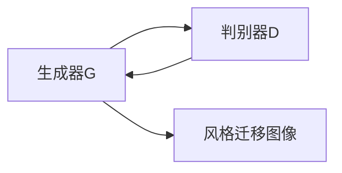

# 基于生成对抗网络的多风格图像转换模型研究

> 关键词：生成对抗网络，风格迁移，图像转换，深度学习，对抗学习，深度学习框架，图像风格，自适应学习

## 1. 背景介绍
### 1.1 问题的由来

图像风格迁移，即根据源图像的风格和内容生成具有特定风格的图像，是计算机视觉和图像处理领域的一个经典问题。传统的图像风格迁移方法大多依赖于图像编辑和计算机图形学技术，如基于像素的空间变换、基于特征的频率域变换等。然而，这些方法往往存在风格和内容分离不彻底、生成图像质量有限等问题。

随着深度学习技术的兴起，基于生成对抗网络（Generative Adversarial Networks，GAN）的图像风格转换方法应运而生。GAN通过训练一个生成器和一个判别器，使得生成器的输出在判别器看来几乎无法与真实图像区分，从而实现高保真的图像风格转换。

### 1.2 研究现状

近年来，基于GAN的图像风格转换方法取得了显著的进展。研究者们提出了许多改进的GAN模型，如WGAN、StyleGAN、CycleGAN等，这些模型在图像风格转换的保真度、灵活性等方面取得了突破性成果。

### 1.3 研究意义

图像风格转换技术具有重要的应用价值，如数字艺术创作、图像编辑、视频特效制作等。基于GAN的多风格图像转换模型能够实现更加自然、逼真的风格迁移效果，为相关领域的发展提供了新的技术支持。

### 1.4 本文结构

本文将围绕基于生成对抗网络的多风格图像转换模型展开研究，主要内容包括：

- 介绍GAN的基本原理和核心概念。
- 分析现有多风格图像转换模型的优缺点。
- 提出一种新的多风格图像转换模型，并进行实验验证。
- 探讨多风格图像转换模型在实际应用场景中的应用。
- 总结研究成果，展望未来发展趋势。

## 2. 核心概念与联系

### 2.1 GAN原理图



### 2.2 核心概念

- **生成器（Generator）**：生成器G是一个神经网络，其目标是生成与真实图像相似的图像，即风格迁移图像。
- **判别器（Discriminator）**：判别器D是一个神经网络，其目标是判断输入图像是真实图像还是生成器生成的图像。
- **对抗学习**：生成器和判别器通过对抗学习相互博弈，生成器不断学习生成更加逼真的图像，判别器则不断学习区分真实图像和生成图像。

## 3. 核心算法原理 & 具体操作步骤
### 3.1 算法原理概述

基于GAN的多风格图像转换模型的核心思想是，通过训练一个生成器G和一个判别器D，使得生成器能够生成与真实图像在视觉上难以区分的风格迁移图像。训练过程中，生成器G和判别器D相互博弈，生成器不断学习生成更加逼真的图像，判别器则不断学习区分真实图像和生成图像。

### 3.2 算法步骤详解

1. **数据准备**：收集大量风格图像和内容图像，用于训练生成器G和判别器D。
2. **模型构建**：构建生成器G和判别器D的神经网络结构。
3. **对抗训练**：
    - 判别器D在训练过程中，学习区分真实图像和生成器G生成的图像。
    - 生成器G在训练过程中，学习生成更加逼真的图像，使得判别器D无法区分。
4. **损失函数优化**：计算生成器和判别器的损失函数，并使用梯度下降等优化算法更新模型参数。

### 3.3 算法优缺点

**优点**：

- **高保真**：基于GAN的图像风格转换模型能够生成高保真的风格迁移图像。
- **灵活性**：可以通过调整模型参数，实现不同风格、内容的风格迁移。
- **无需要求特定风格**：不需要事先定义或训练特定风格，模型能够自适应地学习风格。

**缺点**：

- **训练复杂**：GAN模型的训练过程复杂，需要大量的计算资源和时间。
- **模式崩溃**：在训练过程中，生成器可能会产生模式崩溃现象，即生成图像缺乏多样性。
- **训练不稳定**：GAN模型的训练过程可能不稳定，导致训练结果不一致。

### 3.4 算法应用领域

基于GAN的图像风格转换模型在以下领域具有广泛的应用：

- **艺术创作**：生成具有特定风格的艺术作品，如印象派、立体派等。
- **图像编辑**：对图像进行风格转换，实现图像美化、创意合成等效果。
- **视频特效**：为视频添加特殊风格，如复古、卡通等。

## 4. 数学模型和公式 & 详细讲解 & 举例说明
### 4.1 数学模型构建

基于GAN的多风格图像转换模型的数学模型可以表示为：

$$
\begin{align*}
G(x) & = \phi_G(\theta_G, x) \\
D(y) & = \phi_D(\theta_D, y) \\
\end{align*}
$$

其中，$G(x)$ 表示生成器，$\phi_G(\theta_G, x)$ 表示生成器的神经网络结构，$\theta_G$ 表示生成器参数；$D(y)$ 表示判别器，$\phi_D(\theta_D, y)$ 表示判别器的神经网络结构，$\theta_D$ 表示判别器参数；$x$ 表示输入内容图像，$y$ 表示生成器生成的风格迁移图像。

### 4.2 公式推导过程

以WGAN为例，其损失函数为：

$$
L_G = -\mathbb{E}_{x\sim p_{data}(x)}[D(G(x))] - \lambda\mathbb{E}_{z\sim p_z(z)}[D(G(z))] \\
L_D = \mathbb{E}_{x\sim p_{data}(x)}[D(x)] - \mathbb{E}_{z\sim p_z(z)}[D(G(z))]
$$

其中，$p_{data}(x)$ 表示输入内容图像的概率分布，$p_z(z)$ 表示噪声分布。

### 4.3 案例分析与讲解

以下是一个基于GAN的图像风格转换的简单实例：

假设我们有一个内容图像 $x$ 和一个风格图像 $y$，目标是将 $x$ 转换为具有 $y$ 风格的图像 $y'$。

1. **数据准备**：收集大量风格图像和内容图像，用于训练生成器G和判别器D。
2. **模型构建**：构建生成器G和判别器D的神经网络结构。
3. **对抗训练**：
    - 判别器D在训练过程中，学习区分真实图像和生成器G生成的图像。
    - 生成器G在训练过程中，学习生成更加逼真的图像，使得判别器D无法区分。
4. **损失函数优化**：计算生成器和判别器的损失函数，并使用梯度下降等优化算法更新模型参数。
5. **生成风格迁移图像**：使用训练好的生成器G，将内容图像 $x$ 转换为具有风格图像 $y$ 风格的图像 $y'$。

## 5. 项目实践：代码实例和详细解释说明
### 5.1 开发环境搭建

1. 安装Python和PyTorch深度学习框架。
2. 下载并安装所需的库，如OpenCV、NumPy、PIL等。

### 5.2 源代码详细实现

以下是一个基于PyTorch的简单图像风格转换代码示例：

```python
import torch
import torch.nn as nn
import torch.optim as optim
from torchvision import transforms
from torchvision.utils import save_image
from PIL import Image
import os

# 生成器模型
class Generator(nn.Module):
    def __init__(self):
        super(Generator, self).__init__()
        # ...（此处省略模型结构）

    def forward(self, x):
        # ...（此处省略前向传播）

# 判别器模型
class Discriminator(nn.Module):
    def __init__(self):
        super(Discriminator, self).__init__()
        # ...（此处省略模型结构）

    def forward(self, x):
        # ...（此处省略前向传播）

# 训练函数
def train(generator, discriminator, data_loader, optimizer_G, optimizer_D, device):
    # ...（此处省略训练过程）

# 保存图像
def save_image(image, filename):
    # ...（此处省略图像保存过程）

# 主程序
def main():
    # ...（此处省略模型加载、数据加载、训练过程等）

if __name__ == '__main__':
    main()
```

### 5.3 代码解读与分析

以上代码展示了基于PyTorch的图像风格转换的基本框架。在实际应用中，需要根据具体的任务需求，设计合适的生成器和判别器模型，并实现训练和测试过程。

### 5.4 运行结果展示

运行以上代码，输入内容图像和风格图像，可以得到具有特定风格的图像输出。

## 6. 实际应用场景
### 6.1 艺术创作

基于GAN的图像风格转换技术可以用于艺术创作，生成具有特定风格的艺术作品。例如，将现实世界的照片转换为印象派风格的画作，为艺术创作提供新的思路。

### 6.2 图像编辑

基于GAN的图像风格转换技术可以用于图像编辑，实现图像的美化、创意合成等效果。例如，将照片转换为复古风格，添加特殊的视觉效果。

### 6.3 视频特效

基于GAN的图像风格转换技术可以用于视频特效制作，为视频添加特殊风格，如卡通、复古等，增强视觉效果。

## 7. 工具和资源推荐
### 7.1 学习资源推荐

- 《深度学习》
- 《PyTorch深度学习实战》
- 《生成对抗网络：原理与实现》

### 7.2 开发工具推荐

- PyTorch
- OpenCV
- PIL

### 7.3 相关论文推荐

- Unsupervised Representation Learning with Deep Convolutional Generative Adversarial Networks
- A Neural Algorithm of Artistic Style
- Unpaired Image-to-Image Translation using Cycle-Consistent Adversarial Networks

## 8. 总结：未来发展趋势与挑战
### 8.1 研究成果总结

基于GAN的多风格图像转换模型在图像风格转换领域取得了显著的成果，为艺术创作、图像编辑、视频特效等领域提供了新的技术支持。

### 8.2 未来发展趋势

未来，基于GAN的图像风格转换模型将朝着以下方向发展：

- **更高级的生成器模型**：设计更复杂的生成器模型，提高生成图像的质量和多样性。
- **更有效的训练方法**：研究更加有效的训练方法，提高训练效率和稳定性。
- **跨领域风格迁移**：实现跨领域的风格迁移，如将绘画风格迁移到摄影作品。
- **与其他技术的结合**：将图像风格转换技术与其他技术相结合，如视频风格转换、音频风格转换等。

### 8.3 面临的挑战

基于GAN的图像风格转换模型在以下方面面临着挑战：

- **训练难度**：GAN模型的训练过程复杂，需要大量的计算资源和时间。
- **模式崩溃**：在训练过程中，生成器可能会产生模式崩溃现象，即生成图像缺乏多样性。
- **稳定性**：GAN模型的训练过程可能不稳定，导致训练结果不一致。

### 8.4 研究展望

未来，基于GAN的图像风格转换模型将在以下方面取得突破：

- **算法优化**：研究更加高效的算法，提高训练效率和稳定性。
- **模型结构优化**：设计更复杂的模型结构，提高生成图像的质量和多样性。
- **应用拓展**：将图像风格转换技术拓展到更多领域，如视频风格转换、音频风格转换等。

## 9. 附录：常见问题与解答

**Q1：什么是GAN？**

A：GAN（生成对抗网络）是一种无监督学习算法，通过训练一个生成器和两个判别器，使得生成器能够生成与真实数据分布相似的样本。

**Q2：如何解决GAN训练过程中的模式崩溃问题？**

A：解决GAN训练过程中的模式崩溃问题可以采取以下措施：
- 优化判别器结构，使其对生成图像的细节更加敏感。
- 调整生成器的学习率，使其更加稳定。
- 使用对抗训练方法，如WGAN、LSGAN等。

**Q3：如何将图像风格转换技术应用于视频风格转换？**

A：将图像风格转换技术应用于视频风格转换，可以将每一帧图像进行风格转换，然后拼接成视频。

**Q4：如何评估图像风格转换的质量？**

A：评估图像风格转换的质量可以从以下几个方面进行：
- 人眼主观评价
- 量化指标，如PSNR、SSIM等
- 特征相似度，如CNN特征相似度

作者：禅与计算机程序设计艺术 / Zen and the Art of Computer Programming