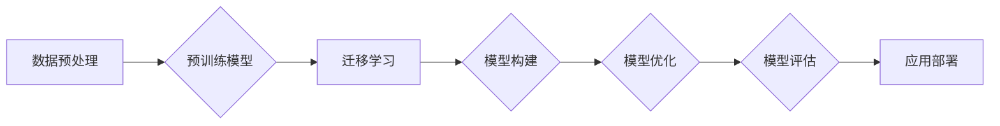

# 基础模型的技术生态系统

> 关键词：基础模型，技术生态系统，预训练模型，深度学习，迁移学习，模型构建，模型优化，模型评估

## 1. 背景介绍

随着深度学习技术的飞速发展，基础模型（Foundation Model）逐渐成为人工智能领域的热点。基础模型是在大规模数据集上通过预训练获得的知识和能力，可以应用于各种下游任务，如自然语言处理、计算机视觉、语音识别等。基础模型的出现，不仅推动了人工智能技术的进步，也构建了一个复杂的技术生态系统。

### 1.1 问题的由来

在早期的人工智能研究中，每个任务都需要从头开始构建模型，这导致了大量的重复工作和高昂的成本。随着深度学习技术的成熟，人们开始意识到，通过在共享的、大规模数据集上预训练一个通用模型，可以显著降低每个特定任务的开发成本，并提高模型的性能。

### 1.2 研究现状

目前，基础模型的研究主要集中在以下几个方面：

- **预训练方法**：如何在大规模数据集上高效地预训练模型，以获得更好的泛化能力。
- **模型结构**：如何设计更有效的模型结构，以适应不同的任务和需求。
- **模型优化**：如何优化模型参数，以提升模型的性能和效率。
- **模型评估**：如何评估模型在不同任务上的表现，以及如何提高评估的准确性。

### 1.3 研究意义

基础模型的研究对于人工智能领域具有重要的意义：

- **降低开发成本**：通过共享预训练模型，可以减少每个特定任务的开发时间和成本。
- **提高模型性能**：预训练模型可以获得更好的泛化能力，从而提高模型在不同任务上的性能。
- **加速技术创新**：基础模型的研究推动了人工智能技术的快速发展，促进了新的应用场景的探索。

### 1.4 本文结构

本文将围绕基础模型的技术生态系统展开，具体内容包括：

- 核心概念与联系
- 核心算法原理与具体操作步骤
- 数学模型和公式
- 项目实践
- 实际应用场景
- 工具和资源推荐
- 总结：未来发展趋势与挑战

## 2. 核心概念与联系

### 2.1 核心概念原理

在基础模型的技术生态系统中，以下几个核心概念至关重要：

- **预训练模型**：在大规模无标签数据集上训练得到的模型，可以用于各种下游任务。
- **迁移学习**：将预训练模型的知识迁移到新的任务中，以减少对标注数据的依赖。
- **模型构建**：设计新的模型结构，以提高模型在不同任务上的性能。
- **模型优化**：通过调整模型参数，以提升模型的性能和效率。
- **模型评估**：评估模型在不同任务上的表现，以及如何提高评估的准确性。

### 2.2 架构流程图

以下是一个简化的基础模型技术生态系统的Mermaid流程图：



在这个流程图中，数据预处理是整个生态系统的起点，预训练模型是核心，迁移学习、模型构建、模型优化和模型评估构成了对预训练模型的迭代和改进过程，最终实现应用部署。

## 3. 核心算法原理 & 具体操作步骤

### 3.1 算法原理概述

基础模型的技术生态系统涉及多种算法，以下是一些核心算法的原理概述：

- **预训练算法**：如BERT、GPT、ViT等，通过在大量无标签数据上训练，获得通用语言模型、文本生成模型和图像模型。
- **迁移学习算法**：如MAML、few-shot learning等，通过微调预训练模型，将知识迁移到新的任务中。
- **模型构建算法**：如模型融合、注意力机制、Transformer等，用于设计更有效的模型结构。
- **模型优化算法**：如Adam、SGD等，用于优化模型参数，以提升模型性能。
- **模型评估算法**：如交叉熵损失、均方误差、准确率等，用于评估模型在不同任务上的表现。

### 3.2 算法步骤详解

以下是一个基于预训练模型的迁移学习流程的详细步骤：

1. **数据预处理**：对无标签数据进行清洗、去噪、转换等操作，以适应预训练模型的需求。
2. **预训练模型训练**：在预处理后的数据上训练预训练模型，以获得通用知识。
3. **迁移学习**：将预训练模型应用于新的任务，并使用少量标注数据进行微调。
4. **模型构建**：根据新的任务需求，设计新的模型结构，如增加或删除层、调整参数等。
5. **模型优化**：通过调整模型参数，以提升模型在不同任务上的性能。
6. **模型评估**：在测试集上评估模型的性能，以确定模型是否满足要求。
7. **应用部署**：将模型部署到实际应用场景中，如问答系统、推荐系统等。

### 3.3 算法优缺点

- **预训练算法**：优点是能够获得通用知识，缺点是需要大量的计算资源和数据。
- **迁移学习算法**：优点是能够减少对标注数据的依赖，缺点是可能无法完全迁移预训练模型的知识。
- **模型构建算法**：优点是能够设计更有效的模型结构，缺点是可能需要大量的计算资源和调优时间。
- **模型优化算法**：优点是能够提升模型性能，缺点是可能需要大量的调优时间。
- **模型评估算法**：优点是能够评估模型性能，缺点是可能受到评估指标选择的影响。

### 3.4 算法应用领域

基础模型的技术生态系统在以下领域得到了广泛应用：

- **自然语言处理**：如文本分类、机器翻译、问答系统等。
- **计算机视觉**：如图像分类、目标检测、图像分割等。
- **语音识别**：如语音转文本、语音合成等。

## 4. 数学模型和公式 & 详细讲解 & 举例说明

### 4.1 数学模型构建

以下是一个简单的预训练语言模型的数学模型：

$$
M(\theta, x) = f(W_L \cdot f(W_{L-1} \cdot f(\ldots f(W_1 \cdot x) \ldots ))
$$

其中，$M$ 是预训练语言模型，$\theta$ 是模型参数，$x$ 是输入文本，$W_1, W_2, \ldots, W_L$ 是模型权重，$f$ 是激活函数。

### 4.2 公式推导过程

以下是一个简单的神经网络前向传播的公式推导过程：

$$
z^{[l]} = W^{[l]} \cdot a^{[l-1]} + b^{[l]}
$$

$$
a^{[l]} = \sigma(z^{[l]})
$$

其中，$z^{[l]}$ 是第 $l$ 层的输入，$a^{[l]}$ 是第 $l$ 层的输出，$W^{[l]}$ 是第 $l$ 层的权重，$b^{[l]}$ 是第 $l$ 层的偏置，$\sigma$ 是激活函数。

### 4.3 案例分析与讲解

以下是一个基于BERT模型的文本分类任务的案例分析：

1. **数据预处理**：对文本数据进行清洗、分词、去停用词等操作。
2. **模型构建**：使用BERT模型，并在顶层添加一个分类器。
3. **模型训练**：在标注数据上训练模型。
4. **模型评估**：在测试集上评估模型性能。

通过这个案例，我们可以看到，基于BERT的文本分类任务只需要对预训练模型进行简单的修改和训练，就可以应用于不同的任务。

## 5. 项目实践：代码实例和详细解释说明

### 5.1 开发环境搭建

以下是一个基于TensorFlow的BERT文本分类任务的代码实例：

```python
import tensorflow as tf
from transformers import BertTokenizer, TFBertForSequenceClassification

# 加载预训练模型
tokenizer = BertTokenizer.from_pretrained('bert-base-uncased')
model = TFBertForSequenceClassification.from_pretrained('bert-base-uncased', num_labels=2)

# 加载数据
train_data = ...
test_data = ...

# 数据预处理
train_encodings = tokenizer(train_data['text'], truncation=True, padding=True)
test_encodings = tokenizer(test_data['text'], truncation=True, padding=True)

# 模型训练
model.compile(optimizer='adam', loss='sparse_categorical_crossentropy', metrics=['accuracy'])
model.fit(train_encodings['input_ids'], train_encodings['labels'], validation_data=(test_encodings['input_ids'], test_encodings['labels']), epochs=3)

# 模型评估
test_loss, test_accuracy = model.evaluate(test_encodings['input_ids'], test_encodings['labels'])
print(f'Test Loss: {test_loss}, Test Accuracy: {test_accuracy}')
```

### 5.2 源代码详细实现

上述代码展示了如何使用TensorFlow和Transformers库加载预训练模型，进行数据预处理，训练模型，并评估模型性能。

### 5.3 代码解读与分析

- `BertTokenizer` 用于对文本数据进行预处理，包括分词、添加特殊标记等。
- `TFBertForSequenceClassification` 是一个基于BERT的序列分类器，包含预训练的BERT模型和顶层的分类器。
- `model.compile` 用于编译模型，包括选择优化器、损失函数和评价指标。
- `model.fit` 用于训练模型，包括输入数据和验证数据。
- `model.evaluate` 用于评估模型性能。

### 5.4 运行结果展示

通过运行上述代码，我们可以得到模型在测试集上的损失和准确率。

## 6. 实际应用场景

基础模型的技术生态系统在以下场景得到了广泛应用：

- **智能客服**：通过预训练模型和迁移学习，构建能够理解和回答用户问题的智能客服系统。
- **推荐系统**：通过预训练模型和迁移学习，构建能够推荐个性化内容的推荐系统。
- **图像识别**：通过预训练模型和迁移学习，构建能够识别图像内容的图像识别系统。

## 7. 工具和资源推荐

### 7.1 学习资源推荐

- 《深度学习》
- 《Python机器学习》
- 《深度学习自然语言处理》
- 《TensorFlow 2.0深度学习实战》

### 7.2 开发工具推荐

- TensorFlow
- PyTorch
- Transformers库
- Jupyter Notebook

### 7.3 相关论文推荐

- BERT: Pre-training of Deep Bidirectional Transformers for Language Understanding
- Generative Pre-trained Transformers
- Vision Transformer
- MAML: Model-Agnostic Meta-Learning for Fast Adaptation of Deep Networks

## 8. 总结：未来发展趋势与挑战

### 8.1 研究成果总结

基础模型的技术生态系统在近年来取得了显著的成果，为人工智能领域的发展做出了重要贡献。

### 8.2 未来发展趋势

未来，基础模型的技术生态系统将朝着以下方向发展：

- **模型规模将进一步扩大**：随着计算能力的提升，模型规模将不断扩大，以获得更丰富的知识。
- **模型结构将更加多样化**：将探索更多高效的模型结构，以适应不同的任务和需求。
- **模型优化将更加高效**：将研究更有效的模型优化方法，以提升模型性能和效率。
- **模型评估将更加全面**：将建立更全面的模型评估体系，以更准确地评估模型性能。

### 8.3 面临的挑战

基础模型的技术生态系统也面临着以下挑战：

- **数据隐私和安全**：如何保护用户数据隐私和安全，是一个重要挑战。
- **模型可解释性**：如何提高模型的可解释性，是一个重要挑战。
- **计算资源消耗**：如何降低模型计算资源消耗，是一个重要挑战。

### 8.4 研究展望

未来，基础模型的技术生态系统将不断发展和完善，为人工智能领域的发展做出更大的贡献。

## 9. 附录：常见问题与解答

### 9.1 常见问题

**Q1：什么是基础模型？**

A1：基础模型是在大规模数据集上通过预训练获得的知识和能力，可以应用于各种下游任务。

**Q2：基础模型的优势是什么？**

A2：基础模型的优势包括降低开发成本、提高模型性能、加速技术创新等。

**Q3：如何选择合适的预训练模型？**

A3：选择预训练模型时，需要考虑任务类型、数据规模、模型规模等因素。

**Q4：如何进行模型迁移学习？**

A4：模型迁移学习通常包括预训练模型选择、数据预处理、模型微调等步骤。

**Q5：如何评估模型性能？**

A5：模型评估通常包括交叉熵损失、均方误差、准确率等指标。

### 9.2 解答

**A1**：基础模型是通过在大量无标签数据上预训练得到的模型，可以应用于各种下游任务。

**A2**：基础模型的优势包括降低开发成本、提高模型性能、加速技术创新等。

**A3**：选择预训练模型时，需要考虑任务类型、数据规模、模型规模等因素。例如，对于文本分类任务，可以使用BERT、RoBERTa等预训练模型。

**A4**：模型迁移学习通常包括预训练模型选择、数据预处理、模型微调等步骤。具体步骤如下：

1. 选择合适的预训练模型。
2. 对数据进行预处理，包括清洗、分词、去停用词等。
3. 在新的任务上对预训练模型进行微调。
4. 在测试集上评估模型性能。

**A5**：模型评估通常包括交叉熵损失、均方误差、准确率等指标。这些指标可以反映模型在不同任务上的性能。

作者：禅与计算机程序设计艺术 / Zen and the Art of Computer Programming