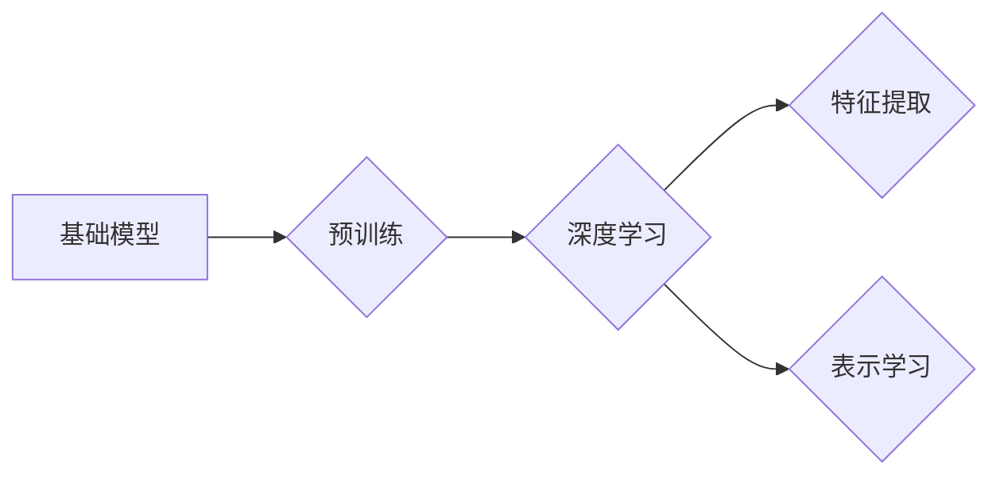

# 基础模型的未来机遇与风险

> 关键词：基础模型，预训练，人工智能，深度学习，风险，机遇，伦理，未来

## 1. 背景介绍

随着深度学习技术的飞速发展，基础模型（Foundation Models）作为一种全新的AI范式，正逐渐改变着人工智能领域的格局。基础模型通过在大规模无标签数据上预训练，学习到丰富的知识，为下游任务提供了强大的特征提取和表示能力。这种模型在自然语言处理、计算机视觉、语音识别等领域取得了显著成果，被誉为人工智能领域的下一个革命。

然而，基础模型的发展也伴随着诸多机遇与风险。本文将深入探讨基础模型的原理、应用、机遇与风险，以及未来发展趋势。

## 2. 核心概念与联系

### 2.1 核心概念

**基础模型**：一种在大规模无标签数据上预训练，学习到通用特征表示的深度学习模型。

**预训练**：在无标签数据上进行的训练过程，旨在学习数据的通用特征和表示。

**深度学习**：一种通过模拟人脑神经网络结构进行学习和推理的计算模型。

**特征提取**：从原始数据中提取具有区分性的特征，以便于后续的模型学习。

**表示学习**：学习数据的低维表示，以便于下游任务的处理。

### 2.2 核心概念联系

以下为 Mermaid 流程图，展示了基础模型、预训练、深度学习、特征提取和表示学习之间的联系：



## 3. 核心算法原理 & 具体操作步骤

### 3.1 算法原理概述

基础模型的算法原理主要包括以下两个方面：

1. 预训练：基础模型通过在大规模无标签数据上预训练，学习到丰富的语言、视觉、音频等领域的知识。
2. 微调：在预训练的基础上，使用少量标注数据对基础模型进行微调，使其能够适应特定的下游任务。

### 3.2 算法步骤详解

1. **数据收集**：收集大规模无标签数据，如互联网上的文本、图像、音频等。
2. **模型选择**：选择合适的预训练模型，如BERT、GPT、ViT等。
3. **预训练**：在无标签数据上进行预训练，学习通用特征表示。
4. **数据预处理**：对下游任务的标注数据进行预处理，如分词、标注等。
5. **微调**：使用标注数据对预训练模型进行微调，优化模型参数。
6. **评估**：在测试集上评估模型性能，进行调优和优化。

### 3.3 算法优缺点

**优点**：

1. 通用性强：基础模型能够学习到丰富的通用知识，适应多种下游任务。
2. 高效性：预训练过程只需在大规模无标签数据上训练一次，即可用于多种下游任务。
3. 精度提升：微调后的模型在特定任务上往往能够取得更高的精度。

**缺点**：

1. 计算资源消耗大：预训练过程需要大量的计算资源，如GPU、TPU等。
2. 数据依赖性强：预训练效果与无标签数据的质量有很大关系。
3. 模型可解释性差：基础模型通常被视为“黑盒”，难以解释其内部工作机制。

### 3.4 算法应用领域

基础模型在多个领域都取得了显著的成果，以下是一些主要的应用领域：

1. 自然语言处理：文本分类、情感分析、机器翻译、问答系统等。
2. 计算机视觉：图像分类、目标检测、图像生成等。
3. 语音识别：语音转文本、语音合成等。
4. 其他领域：推荐系统、金融风控、医疗诊断等。

## 4. 数学模型和公式 & 详细讲解 & 举例说明

### 4.1 数学模型构建

基础模型通常采用深度神经网络作为其核心架构，以下是一个简单的神经网络模型：

$$
f(x) = \sigma(W_1 \cdot \phi(W_0 \cdot x) + b_1)
$$

其中，$x$ 为输入数据，$\phi$ 为激活函数，$W_0$ 和 $W_1$ 为权重矩阵，$b_1$ 为偏置项。

### 4.2 公式推导过程

以BERT模型为例，其核心架构为Transformer，其公式推导过程如下：

1. **自注意力机制（Self-Attention）**：

$$
Q = W_Q \cdot X \quad K = W_K \cdot X \quad V = W_V \cdot X
$$

$$
\text{Attention}(Q, K, V) = \text{softmax}(\frac{QK^T}{\sqrt{d_k}}) \cdot V
$$

其中，$X$ 为输入序列，$Q$、$K$、$V$ 分别为查询、键、值矩阵，$d_k$ 为键的维度，$\text{softmax}$ 为softmax函数。

2. **前馈神经网络（Feed-Forward Neural Network）**：

$$
\text{FFN}(X) = \text{ReLU}(W_1 \cdot \text{ReLU}(W_0 \cdot X + b_0))
$$

其中，$X$ 为输入序列，$W_0$ 和 $W_1$ 为权重矩阵，$b_0$ 为偏置项，$\text{ReLU}$ 为ReLU激活函数。

### 4.3 案例分析与讲解

以BERT模型为例，其在大规模无标签数据上进行预训练，学习到丰富的语言知识，包括词嵌入、句嵌入等。在预训练过程中，BERT模型通过 masked language model 和 next sentence prediction 等任务学习到语言的通用特征表示。在下游任务中，通过微调优化模型参数，使其能够适应特定任务。

## 5. 项目实践：代码实例和详细解释说明

### 5.1 开发环境搭建

1. 安装Python环境。
2. 安装PyTorch框架。
3. 安装HuggingFace Transformers库。

### 5.2 源代码详细实现

以下为使用PyTorch和Transformers库实现BERT模型微调的简单示例：

```python
from transformers import BertForSequenceClassification, BertTokenizer, Trainer, TrainingArguments

def train_model():
    # 加载预训练模型和分词器
    model = BertForSequenceClassification.from_pretrained('bert-base-uncased')
    tokenizer = BertTokenizer.from_pretrained('bert-base-uncased')

    # 定义训练参数
    training_args = TrainingArguments(
        output_dir='./results',
        num_train_epochs=3,
        per_device_train_batch_size=16,
        warmup_steps=500,
        weight_decay=0.01,
        logging_dir='./logs',
        logging_steps=10,
    )

    # 加载训练数据
    train_dataset = MyDataset(train_texts, train_labels, tokenizer)

    # 训练模型
    trainer = Trainer(
        model=model,
        args=training_args,
        train_dataset=train_dataset,
    )
    trainer.train()

# 运行训练脚本
train_model()
```

### 5.3 代码解读与分析

上述代码使用PyTorch和Transformers库实现了BERT模型在序列分类任务上的微调。首先加载预训练的BERT模型和分词器，然后定义训练参数和训练数据集，最后使用Trainer类进行模型训练。

### 5.4 运行结果展示

在训练完成后，可以在 `results` 目录下找到训练日志和模型权重文件。通过查看训练日志，可以了解模型在训练过程中的表现，如loss、accuracy等指标。

## 6. 实际应用场景

### 6.1 文本分类

基础模型在文本分类任务上取得了显著成果，如情感分析、主题分类、新闻分类等。以下为使用BERT模型进行情感分析的一个实例：

```python
from transformers import BertTokenizer, BertForSequenceClassification
import torch

# 加载预训练模型和分词器
tokenizer = BertTokenizer.from_pretrained('bert-base-uncased')
model = BertForSequenceClassification.from_pretrained('bert-base-uncased')

# 加载测试数据
test_texts = ["这是一篇很棒的文章！", "这是一篇糟糕的文章！"]
test_labels = [1, 0]

# 分词和编码
inputs = tokenizer(test_texts, padding=True, truncation=True, return_tensors="pt")

# 预测
with torch.no_grad():
    logits = model(**inputs).logits

# 解码标签
predictions = torch.argmax(logits, dim=-1).tolist()

# 输出结果
for text, label, pred in zip(test_texts, test_labels, predictions):
    print(f"Text: {text}, Label: {label}, Prediction: {pred}")
```

### 6.2 机器翻译

基础模型在机器翻译任务上取得了显著的成果，如谷歌翻译、DeepL等。以下为使用Transformer模型进行机器翻译的一个实例：

```python
from transformers import TransformerForSeq2SeqLM, Seq2SeqTrainer, Seq2SeqTrainingArguments
import torch

# 加载预训练模型和分词器
model = TransformerForSeq2SeqLM.from_pretrained('t5-small')
tokenizer = model.tokenizer

# 加载测试数据
test_source = ["How are you?"]
test_target = ["你好吗？"]

# 编码
source_inputs = tokenizer(test_source, return_tensors="pt", padding=True)
target_inputs = tokenizer(test_target, return_tensors="pt", padding=True)

# 预测
with torch.no_grad():
    output_ids = model.generate(**source_inputs)

# 解码
predicted_target = tokenizer.decode(output_ids[0], skip_special_tokens=True)

# 输出结果
print(f"Source: {test_source[0]}, Target: {predicted_target}")
```

## 7. 工具和资源推荐

### 7.1 学习资源推荐

1. 《深度学习》（Ian Goodfellow、Yoshua Bengio、Aaron Courville著）
2. 《自然语言处理入门》（张奇峰、唐杰著）
3. 《计算机视觉：算法与应用》（李航著）

### 7.2 开发工具推荐

1. PyTorch
2. TensorFlow
3. HuggingFace Transformers

### 7.3 相关论文推荐

1. "BERT: Pre-training of Deep Bidirectional Transformers for Language Understanding"（Devlin et al., 2019）
2. "Generative Adversarial Nets"（Goodfellow et al., 2014）
3. "Attention Is All You Need"（Vaswani et al., 2017）

## 8. 总结：未来发展趋势与挑战

### 8.1 研究成果总结

基础模型作为一种全新的AI范式，在多个领域取得了显著成果，为人工智能技术的发展带来了新的机遇。

### 8.2 未来发展趋势

1. 模型规模将进一步扩大，参数量将达数百亿甚至数千亿级别。
2. 模型结构将更加复杂，如图神经网络、强化学习等将被整合到基础模型中。
3. 模型训练和推理效率将得到提升，降低计算资源消耗。
4. 模型可解释性和鲁棒性将得到加强，提高模型的安全性和可靠性。

### 8.3 面临的挑战

1. 数据隐私和安全问题：基础模型需要大量数据，如何保护用户隐私和数据安全成为一大挑战。
2. 模型可解释性问题：如何解释模型的决策过程，提高模型的可信度和可靠性。
3. 模型偏见和歧视问题：如何减少模型偏见，避免歧视现象的发生。
4. 模型资源消耗问题：如何降低模型训练和推理的资源消耗，提高模型的应用范围。

### 8.4 研究展望

1. 探索更加高效、安全的预训练方法，降低数据隐私风险。
2. 研究可解释性强的模型结构，提高模型的可信度和可靠性。
3. 开发更加鲁棒的模型，降低模型偏见和歧视现象。
4. 推动基础模型在更多领域的应用，为人工智能技术的发展做出贡献。

## 9. 附录：常见问题与解答

**Q1：基础模型与传统的机器学习模型有什么区别？**

A：基础模型与传统的机器学习模型相比，具有以下区别：

1. 数据量：基础模型需要大量无标签数据进行预训练，而传统的机器学习模型通常需要大量标注数据进行训练。
2. 特征表示：基础模型通过预训练学习到丰富的特征表示，而传统的机器学习模型需要人工设计特征。
3. 通用性：基础模型具有较强的通用性，可以适应多种下游任务，而传统的机器学习模型需要针对特定任务进行设计。

**Q2：基础模型如何解决数据不平衡问题？**

A：基础模型可以通过以下方法解决数据不平衡问题：

1. 数据重采样：对不平衡数据集进行重采样，使得训练数据更加均衡。
2. 权重调整：根据数据分布调整模型权重，降低模型对少数类的误判率。
3. 混合学习：结合有监督学习和无监督学习，学习到更加全面的特征表示。

**Q3：如何评估基础模型在下游任务上的性能？**

A：评估基础模型在下游任务上的性能可以通过以下方法：

1. 准确率：衡量模型预测正确样本的比例。
2. 召回率：衡量模型预测正确样本占所有正确样本的比例。
3. F1分数：综合考虑准确率和召回率，是更全面的评价指标。
4. AUC：衡量模型预测结果与真实标签的一致性。

**Q4：基础模型如何防止过拟合？**

A：基础模型可以通过以下方法防止过拟合：

1. 数据增强：通过对训练数据进行变换，增加数据多样性。
2. 正则化：在模型中引入正则化项，如L1正则化、L2正则化等。
3. Dropout：在训练过程中随机丢弃部分神经元，降低模型复杂度。
4. 早停法：当验证集性能不再提升时，停止训练过程。

**Q5：基础模型的未来发展方向是什么？**

A：基础模型的未来发展方向主要包括以下几个方面：

1. 模型规模和复杂度进一步提高。
2. 模型结构和算法创新。
3. 模型可解释性和鲁棒性提升。
4. 模型在更多领域的应用。
5. 模型安全性和可靠性保障。

作者：禅与计算机程序设计艺术 / Zen and the Art of Computer Programming