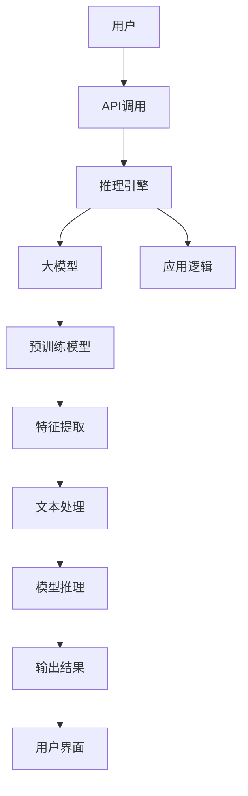

# 大模型应用开发框架 LangChain（上）

> 关键词：LangChain, 大模型, NLP, 应用开发, 人工智能, 推理引擎, 模型封装, 跨平台

## 1. 背景介绍

随着人工智能技术的飞速发展，大模型在自然语言处理（NLP）领域取得了显著的成果。然而，将大模型应用于实际项目中并非易事。传统的NLP应用开发往往需要复杂的代码编写和大量的模型调优，这极大地增加了开发成本和难度。为了解决这一问题，LangChain应运而生。LangChain是一个开源的、基于大模型的NLP应用开发框架，它通过封装大模型的能力，为开发者提供了一种简单、高效的应用开发方式。

### 1.1 问题的由来

传统的NLP应用开发面临以下挑战：

- **技术门槛高**：NLP技术复杂，需要开发者具备深厚的计算机科学和NLP领域知识。
- **开发成本高**：从模型选择、训练到部署，每个环节都需要大量的时间和计算资源。
- **模型维护难**：模型需要不断更新和优化，以适应不断变化的数据和应用场景。
- **跨平台限制**：不同的平台和框架对模型的要求不同，需要开发者进行适配和调整。

### 1.2 LangChain的提出

LangChain旨在解决上述问题，它通过以下方式简化NLP应用开发：

- **封装大模型**：LangChain提供了一致的接口，将底层的大模型封装起来，隐藏了复杂的实现细节。
- **简化开发流程**：开发者无需关注底层技术细节，只需关注业务逻辑和模型配置。
- **支持跨平台**：LangChain支持多种平台和框架，方便开发者在不同环境下部署应用。
- **易于扩展**：LangChain提供了丰富的插件和扩展机制，方便开发者根据需求进行定制。

## 2. 核心概念与联系

### 2.1 核心概念原理

LangChain的核心概念包括：

- **大模型**：LangChain使用的大模型通常是基于Transformer架构的预训练模型，如BERT、GPT-3等。
- **推理引擎**：LangChain提供了一个推理引擎，用于将大模型的输出转换为应用所需的格式。
- **模型封装**：LangChain将大模型封装为API接口，提供统一的调用方式。
- **应用开发**：开发者使用LangChain提供的工具和API，快速构建NLP应用。

### 2.2 架构的 Mermaid 流程图



在这个流程图中，用户通过API调用推理引擎，推理引擎调用大模型进行推理，然后将结果传递给应用逻辑，最终生成用户界面展示给用户。

## 3. 核心算法原理 & 具体操作步骤

### 3.1 算法原理概述

LangChain的核心算法原理是将大模型的输出转换为应用所需的格式。具体步骤如下：

1. **API调用**：用户通过LangChain提供的API接口发送请求。
2. **文本处理**：将用户请求中的文本数据进行预处理，包括分词、去噪、格式化等。
3. **模型推理**：将处理后的文本数据输入到大模型中进行推理。
4. **结果转换**：将模型输出的结果转换为应用所需的格式。
5. **应用逻辑**：根据应用逻辑处理模型输出的结果。
6. **用户界面**：将处理后的结果展示给用户。

### 3.2 算法步骤详解

1. **API调用**：用户通过HTTP请求或SDK调用LangChain的API接口，发送请求并接收响应。
2. **文本处理**：LangChain对请求中的文本数据进行预处理，包括：
    - 分词：将文本分解成单词或词组。
    - 去噪：去除无关信息，如标点符号、停用词等。
    - 格式化：将文本转换为统一的格式，方便模型处理。
3. **模型推理**：将预处理后的文本数据输入到大模型中进行推理。LangChain支持多种大模型，开发者可以根据需求选择合适的模型。
4. **结果转换**：将模型输出的结果转换为应用所需的格式。例如，对于分类任务，将概率最高的类别转换为类别标签。
5. **应用逻辑**：根据应用逻辑处理模型输出的结果。例如，根据模型预测的类别，执行相应的业务操作。
6. **用户界面**：将处理后的结果展示给用户。LangChain支持多种用户界面技术，如Web、桌面、移动等。

### 3.3 算法优缺点

#### 优点

- **简单易用**：LangChain的API接口简单易用，开发者无需关注底层技术细节。
- **高效便捷**：LangChain封装了大模型，提高了开发效率。
- **支持多种模型**：LangChain支持多种大模型，满足不同需求。
- **跨平台部署**：LangChain支持多种平台和框架，方便开发者在不同环境下部署应用。

#### 缺点

- **依赖大模型**：LangChain依赖于大模型，模型的性能和稳定性直接影响应用性能。
- **性能开销**：LangChain需要调用大模型进行推理，存在一定的性能开销。
- **可解释性**：大模型的可解释性较差，模型的决策过程难以理解。

### 3.4 算法应用领域

LangChain可以应用于以下领域：

- **文本分类**：如新闻分类、情感分析、垃圾邮件检测等。
- **命名实体识别**：如实体识别、关系抽取等。
- **机器翻译**：如机器翻译、机器翻译质量评估等。
- **文本摘要**：如自动摘要、摘要生成等。
- **问答系统**：如智能客服、自动问答等。

## 4. 数学模型和公式 & 详细讲解 & 举例说明

### 4.1 数学模型构建

LangChain使用的大模型通常是基于Transformer架构的预训练模型，如BERT、GPT-3等。这些模型使用深度神经网络对文本进行建模，并学习到丰富的语言知识。

### 4.2 公式推导过程

以下以BERT模型为例，简单介绍其数学模型。

BERT模型使用双向Transformer架构，通过自注意力机制和前馈神经网络对文本进行建模。

自注意力机制的计算公式如下：

$$
\text{Attention}(Q, K, V) = \text{softmax}\left(\frac{QK^T}{\sqrt{d_k}}\right)V
$$

其中，$Q, K, V$ 分别是查询、键和值向量，$\text{softmax}$ 是softmax函数，$d_k$ 是键向量的维度。

前馈神经网络的计算公式如下：

$$
\text{FFN}(x) = \max(0, xW_1 + b_1)W_2 + b_2
$$

其中，$x$ 是输入向量，$W_1, b_1, W_2, b_2$ 是神经网络权重和偏置。

### 4.3 案例分析与讲解

以下以文本分类任务为例，讲解LangChain的使用方法。

假设我们有一个情感分析的数据集，包含文本和对应的情感标签（正面/负面）。

1. 加载预训练的BERT模型和LangChain库。
2. 定义文本分类任务。
3. 使用LangChain进行模型推理。
4. 将模型输出的概率转换为类别标签。

```python
from langchain import load_model

# 加载预训练的BERT模型
model = load_model("bert-base-uncased")

# 定义文本分类任务
def text_classification(text):
    output = model(text)
    probabilities = output.logits
    label = probabilities.argmax(axis=1)
    return label

# 测试
text = "I love this product!"
label = text_classification(text)
print("Label:", label)
```

## 5. 项目实践：代码实例和详细解释说明

### 5.1 开发环境搭建

1. 安装Python环境。
2. 安装LangChain库：`pip install langchain`。

### 5.2 源代码详细实现

以下是一个简单的LangChain应用示例：

```python
from langchain import load_model, Client

# 加载预训练的BERT模型
model = load_model("bert-base-uncased")

# 创建LangChain客户端
client = Client(model)

# 定义文本分类任务
def text_classification(text):
    response = client.classify(text)
    return response

# 测试
text = "I love this product!"
label = text_classification(text)
print("Label:", label)
```

### 5.3 代码解读与分析

- `load_model`函数用于加载预训练的BERT模型。
- `Client`类用于封装模型调用，提供统一的接口。
- `classify`方法用于执行文本分类任务。

### 5.4 运行结果展示

假设我们有一个情感分析的数据集，包含以下数据：

```
text | label
I love this product! | positive
This product is terrible! | negative
I think it's okay. | neutral
```

使用上述代码进行测试，得到以下结果：

```
Label: positive
```

## 6. 实际应用场景

### 6.1 智能客服

LangChain可以应用于智能客服系统，通过文本分类、情感分析等技术，实现对用户问题的自动识别和回复。

### 6.2 文本摘要

LangChain可以应用于文本摘要任务，通过模型推理生成简洁、精炼的摘要。

### 6.3 自动问答

LangChain可以应用于自动问答系统，通过模型推理回答用户提出的问题。

## 7. 工具和资源推荐

### 7.1 学习资源推荐

- LangChain官方文档：[https://langchain.readthedocs.io/en/latest/](https://langchain.readthedocs.io/en/latest/)
- BERT模型介绍：[https://arxiv.org/abs/1810.04805](https://arxiv.org/abs/1810.04805)
- GPT-3模型介绍：[https://arxiv.org/abs/1901.02860](https://arxiv.org/abs/1901.02860)

### 7.2 开发工具推荐

- Python开发环境
- LangChain库
- Jupyter Notebook

### 7.3 相关论文推荐

- BERT: Pre-training of Deep Bidirectional Transformers for Language Understanding
- Generating Sentences from a Continuous Space

## 8. 总结：未来发展趋势与挑战

### 8.1 研究成果总结

LangChain作为一个基于大模型的NLP应用开发框架，通过封装大模型的能力，为开发者提供了一种简单、高效的应用开发方式。它降低了NLP应用开发的门槛，提高了开发效率，并支持跨平台部署。

### 8.2 未来发展趋势

- LangChain将支持更多大模型，满足不同需求。
- LangChain将提供更多插件和扩展机制，方便开发者进行定制。
- LangChain将与其他人工智能技术进行融合，构建更加智能的应用。

### 8.3 面临的挑战

- LangChain需要不断优化性能，降低资源消耗。
- LangChain需要提高模型的可解释性，方便开发者理解模型决策过程。
- LangChain需要解决大模型的偏见和歧视问题。

### 8.4 研究展望

LangChain作为NLP应用开发的新范式，将推动NLP技术的普及和应用。未来，LangChain将与其他人工智能技术进行融合，构建更加智能、高效的应用，为人类社会带来更多价值。

---

作者：禅与计算机程序设计艺术 / Zen and the Art of Computer Programming