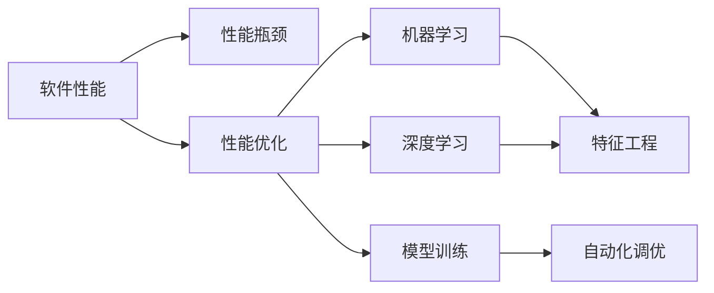
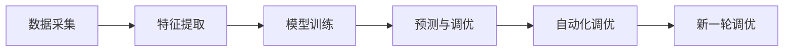
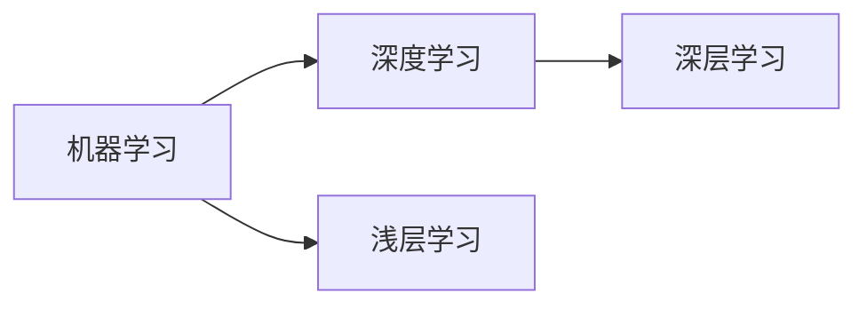
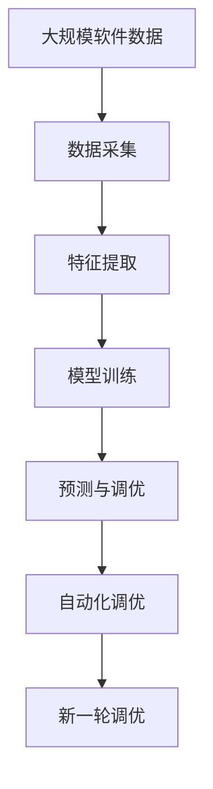

                 

# AI辅助的软件性能优化

> 关键词：软件性能优化, AI辅助, 性能监控, 深度学习, 特征工程, 模型训练, 自动化优化

## 1. 背景介绍

### 1.1 问题由来

在软件开发过程中，性能优化是一个永恒的主题。随着软件规模的不断扩大，性能瓶颈逐渐显现，如何高效地定位和解决这些瓶颈成为了软件开发中的难点。传统的性能优化方法依赖于人工调试和经验积累，存在效率低、覆盖面广等问题。随着人工智能技术的不断发展，利用AI辅助进行性能优化逐渐成为行业的新趋势。

### 1.2 问题核心关键点

AI辅助性能优化，是指利用机器学习和深度学习技术，自动分析和优化软件性能。其主要步骤包括：数据采集、特征提取、模型训练和自动化调优。AI辅助的优点在于其自动化、自适应和高效性，能够在大规模数据和复杂场景下，提供比人工更为精准和全面的性能优化方案。

AI辅助性能优化涉及的核心概念包括：

- 性能优化：通过优化算法和技术手段，提升软件系统运行效率和响应速度。
- 机器学习：一种通过算法和模型，自动从数据中提取特征并学习规律的技术。
- 深度学习：一种特殊的机器学习算法，通过多层神经网络进行复杂特征学习。
- 特征工程：从原始数据中提取、选择、转换和构造特征，以提高模型效果。
- 模型训练：使用数据训练机器学习或深度学习模型，以预测和优化软件性能。
- 自动化调优：利用AI技术自动进行模型调优和参数调整，提升优化效果。

### 1.3 问题研究意义

AI辅助性能优化能够显著提高软件性能优化效率和效果，其研究意义如下：

1. 提升开发效率：利用AI自动化调优，减少人工干预，提升性能优化效率。
2. 优化精准度：基于大量数据训练的模型，能够精准定位性能瓶颈，提高优化精准度。
3. 覆盖广度：AI模型能够处理复杂的非线性关系，涵盖更广泛的性能优化场景。
4. 跨领域应用：AI模型可以应用于不同领域的软件性能优化，如Web应用、移动应用、嵌入式系统等。
5. 实时优化：AI辅助性能优化能够实时监控和调整，及时响应性能变化。

## 2. 核心概念与联系

### 2.1 核心概念概述

为更好地理解AI辅助性能优化的原理和框架，本节将介绍几个密切相关的核心概念：

- 软件性能：指软件系统在特定条件下的运行效率和响应速度，通常用响应时间、吞吐量等指标衡量。
- 性能瓶颈：指软件系统中影响整体性能的特定点或过程，如I/O操作、计算密集型操作等。
- 性能优化：指通过优化算法和技术手段，提升软件系统运行效率和响应速度的过程。
- 机器学习：一种通过算法和模型，自动从数据中提取特征并学习规律的技术。
- 深度学习：一种特殊的机器学习算法，通过多层神经网络进行复杂特征学习。
- 特征工程：从原始数据中提取、选择、转换和构造特征，以提高模型效果。
- 模型训练：使用数据训练机器学习或深度学习模型，以预测和优化软件性能。
- 自动化调优：利用AI技术自动进行模型调优和参数调整，提升优化效果。

这些核心概念之间存在紧密的联系，共同构成了AI辅助性能优化的完整生态系统。下面通过几个Mermaid流程图来展示这些概念之间的关系：



这个流程图展示了大语言模型微调过程中各个核心概念的关系：

1. 软件性能：是性能优化的目标，优化过程旨在提升软件性能。
2. 性能瓶颈：是性能优化的焦点，性能优化通常针对性能瓶颈。
3. 性能优化：是解决性能瓶颈的方法，通过优化算法和模型实现。
4. 机器学习和深度学习：是性能优化的方法，利用这些算法和模型提取特征并学习规律。
5. 特征工程：是机器学习和深度学习的前置步骤，提取有意义的特征。
6. 模型训练：是机器学习和深度学习的具体实现，使用数据训练模型。
7. 自动化调优：是性能优化和模型训练的优化过程，利用AI技术自动调整模型参数。

### 2.2 概念间的关系

这些核心概念之间存在着紧密的联系，形成了AI辅助性能优化的完整生态系统。下面我通过几个Mermaid流程图来展示这些概念之间的关系。

#### 2.2.1 性能优化的基本流程



这个流程图展示了性能优化的基本流程：

1. 数据采集：收集软件性能数据。
2. 特征提取：从数据中提取特征。
3. 模型训练：使用特征训练性能预测模型。
4. 预测与调优：使用模型预测性能瓶颈，自动调优。
5. 新一轮调优：循环进行，不断优化性能。

#### 2.2.2 机器学习与深度学习的关系



这个流程图展示了机器学习与深度学习的关系：

1. 机器学习：包括浅层学习和深层学习，深度学习是其中的一种。
2. 浅层学习：简单的机器学习模型，如线性回归、逻辑回归等。
3. 深层学习：复杂的多层神经网络，如卷积神经网络、循环神经网络等。

#### 2.2.3 特征工程与模型训练的关系


这个流程图展示了特征工程与模型训练的关系：

1. 数据：原始数据集，包含大量噪音和冗余信息。
2. 特征工程：从数据中提取、选择、转换和构造特征，以提高模型效果。
3. 模型训练：使用特征训练机器学习或深度学习模型。

### 2.3 核心概念的整体架构

最后，我们用一个综合的流程图来展示这些核心概念在大语言模型微调过程中的整体架构：



这个综合流程图展示了从数据采集到自动化调优的完整过程。软件性能优化首先从数据采集开始，通过特征提取和模型训练，预测性能瓶颈并自动调优。经过多次迭代，不断优化性能，直至达到最优状态。 通过这些流程图，我们可以更清晰地理解AI辅助性能优化过程中各个核心概念的关系和作用，为后续深入讨论具体的优化方法和技术奠定基础。

## 3. 核心算法原理 & 具体操作步骤
### 3.1 算法原理概述

AI辅助性能优化，本质上是利用机器学习和深度学习技术，自动分析和优化软件性能。其主要步骤包括：数据采集、特征提取、模型训练和自动化调优。AI辅助的优点在于其自动化、自适应和高效性，能够在大规模数据和复杂场景下，提供比人工更为精准和全面的性能优化方案。

具体而言，AI辅助性能优化的基本原理如下：

1. 数据采集：从软件系统中收集性能数据，如响应时间、吞吐量、CPU使用率等。
2. 特征提取：对采集到的数据进行预处理，提取有意义的特征。
3. 模型训练：使用历史性能数据训练性能预测模型，如回归模型、分类模型等。
4. 预测与调优：利用训练好的模型预测性能瓶颈，自动调整系统参数和优化算法。
5. 自动化调优：通过反复迭代，不断调整模型参数，直至性能最优。

### 3.2 算法步骤详解

AI辅助性能优化的具体步骤如下：

**Step 1: 数据采集**

1. 从软件系统中收集性能数据，如响应时间、吞吐量、CPU使用率、内存使用率等。
2. 记录下每次调用的时间戳、调用路径、调用参数等信息，形成日志文件。
3. 对日志文件进行解析，提取出性能数据。

**Step 2: 特征提取**

1. 对采集到的性能数据进行预处理，包括去噪、归一化、平滑等操作。
2. 使用统计方法和机器学习方法，提取特征。
3. 构造有意义的特征集，如调用时间、CPU占用率、内存占用率等。

**Step 3: 模型训练**

1. 使用历史性能数据训练性能预测模型，如线性回归模型、决策树模型、随机森林模型等。
2. 利用交叉验证等方法，评估模型的泛化能力和预测准确度。
3. 调整模型参数，提升预测效果。

**Step 4: 预测与调优**

1. 利用训练好的模型，对新采集的性能数据进行预测，识别性能瓶颈。
2. 根据预测结果，自动调整系统参数和优化算法，如缓存大小、线程数量、数据库连接数等。
3. 定期更新模型，以应对性能数据的变化。

**Step 5: 自动化调优**

1. 根据预测结果和调优效果，反复迭代优化。
2. 自动调整模型参数，提升预测效果。
3. 实时监控性能，及时响应性能变化。

### 3.3 算法优缺点

AI辅助性能优化具有以下优点：

1. 自动化程度高：自动化分析性能瓶颈，自动调整系统参数。
2. 预测精准度高：基于大量历史数据训练模型，提升预测准确度。
3. 覆盖面广：适用于不同类型的软件系统和性能瓶颈。
4. 实时优化：实时监控和调整，及时响应性能变化。

同时，AI辅助性能优化也存在以下缺点：

1. 依赖数据质量：性能优化依赖于高质量的数据采集和特征提取，数据噪音和冗余会影响模型效果。
2. 模型复杂度高：深度学习模型参数较多，训练复杂度高。
3. 计算资源需求高：需要大量计算资源进行模型训练和调优。
4. 预测不确定性：模型的预测结果存在不确定性，依赖于数据样本和特征选择。

### 3.4 算法应用领域

AI辅助性能优化在软件开发和运维领域有广泛应用，涵盖以下方面：

1. Web应用性能优化：提升Web应用的响应时间和用户体验。
2. 移动应用性能优化：优化移动应用的加载速度和流畅性。
3. 嵌入式系统性能优化：优化嵌入式系统的资源利用和性能瓶颈。
4. 云计算平台性能优化：提升云服务器的计算和存储性能。
5. 大数据平台性能优化：优化大数据系统的处理能力和响应速度。
6. 人工智能平台性能优化：优化AI模型的训练和推理速度。

## 4. 数学模型和公式 & 详细讲解 & 举例说明

### 4.1 数学模型构建

性能优化问题可以建模为回归问题，目标是预测软件性能指标（如响应时间、吞吐量等）。回归问题可以表示为：

$$
y = \mathbf{X} \mathbf{w} + b + \epsilon
$$

其中，$y$ 表示性能指标，$\mathbf{X}$ 表示特征矩阵，$\mathbf{w}$ 表示模型参数，$b$ 表示截距，$\epsilon$ 表示误差项。

### 4.2 公式推导过程

以下是线性回归模型的推导过程：

1. 假设模型为线性回归模型：

$$
y = \mathbf{X} \mathbf{w} + b + \epsilon
$$

2. 使用最小二乘法求解模型参数：

$$
\min_{\mathbf{w}, b} \sum_{i=1}^n (y_i - (\mathbf{X}_i \mathbf{w} + b))^2
$$

3. 对上述优化问题求解，得到：

$$
\mathbf{w} = (\mathbf{X}^T \mathbf{X})^{-1} \mathbf{X}^T \mathbf{y}
$$

其中，$\mathbf{X}^T$ 表示特征矩阵的转置，$\mathbf{X}^T \mathbf{X}$ 表示特征矩阵的协方差矩阵。

### 4.3 案例分析与讲解

假设我们有一组Web应用性能数据，需要预测响应时间，可以使用线性回归模型进行建模。具体步骤如下：

1. 收集历史性能数据，如响应时间、页面大小、并发用户数等。
2. 对数据进行预处理，如归一化、去噪等。
3. 提取特征，如页面大小、并发用户数、CPU占用率等。
4. 使用历史数据训练线性回归模型。
5. 利用训练好的模型，预测新样本的响应时间。
6. 根据预测结果，自动调整系统参数，如缓存大小、并发用户数等。

## 5. 项目实践：代码实例和详细解释说明

### 5.1 开发环境搭建

在进行性能优化实践前，我们需要准备好开发环境。以下是使用Python进行TensorFlow开发的环境配置流程：

1. 安装Anaconda：从官网下载并安装Anaconda，用于创建独立的Python环境。

2. 创建并激活虚拟环境：
```bash
conda create -n tf-env python=3.8 
conda activate tf-env
```

3. 安装TensorFlow：根据CUDA版本，从官网获取对应的安装命令。例如：
```bash
conda install tensorflow -c conda-forge -c pytorch -c defaults
```

4. 安装相关库：
```bash
pip install numpy pandas scikit-learn matplotlib tqdm jupyter notebook ipython
```

完成上述步骤后，即可在`tf-env`环境中开始性能优化实践。

### 5.2 源代码详细实现

下面我们以Web应用性能优化为例，给出使用TensorFlow进行性能优化的PyTorch代码实现。

首先，定义性能优化任务的数据处理函数：

```python
import tensorflow as tf
from tensorflow import keras

class WebAppDataset(tf.keras.utils.Sequence):
    def __init__(self, data, batch_size):
        self.data = data
        self.batch_size = batch_size
        
    def __len__(self):
        return len(self.data) // self.batch_size
    
    def __getitem__(self, item):
        start = item * self.batch_size
        end = (item + 1) * self.batch_size
        batch = self.data[start:end]
        features, labels = [], []
        for x, y in batch:
            features.append(x)
            labels.append(y)
        features = tf.concat(features, axis=0)
        labels = tf.stack(labels)
        return features, labels
```

然后，定义性能优化模型的神经网络结构：

```python
class WebAppModel(tf.keras.Model):
    def __init__(self, input_shape, num_outputs):
        super(WebAppModel, self).__init__()
        self.dense1 = tf.keras.layers.Dense(64, activation='relu', input_shape=input_shape)
        self.dense2 = tf.keras.layers.Dense(32, activation='relu')
        self.dense3 = tf.keras.layers.Dense(num_outputs)
        
    def call(self, inputs):
        x = self.dense1(inputs)
        x = self.dense2(x)
        return self.dense3(x)
```

接着，定义性能优化模型的训练函数：

```python
def train_model(model, dataset, epochs, batch_size, learning_rate):
    model.compile(optimizer=tf.keras.optimizers.Adam(learning_rate=learning_rate),
                  loss=tf.keras.losses.MeanSquaredError())
    model.fit(dataset, epochs=epochs, batch_size=batch_size)
```

最后，启动性能优化流程：

```python
epochs = 50
batch_size = 32
learning_rate = 0.001

# 加载数据集
dataset = WebAppDataset(data, batch_size)

# 构建模型
model = WebAppModel(input_shape, num_outputs)

# 训练模型
train_model(model, dataset, epochs, batch_size, learning_rate)

# 评估模型
test_loss = model.evaluate(test_data)
print(f'Test loss: {test_loss}')
```

以上就是使用TensorFlow进行Web应用性能优化的完整代码实现。可以看到，TensorFlow提供了高效的深度学习框架，使得性能优化模型构建和训练变得简洁高效。

### 5.3 代码解读与分析

让我们再详细解读一下关键代码的实现细节：

**WebAppDataset类**：
- `__init__`方法：初始化数据集和批次大小。
- `__len__`方法：返回数据集的样本数量。
- `__getitem__`方法：对单个样本进行处理，将数据拆分成批次，并进行格式转换。

**WebAppModel类**：
- `__init__`方法：定义模型的神经网络结构。
- `call`方法：定义前向传播计算过程。

**train_model函数**：
- 使用Adam优化器，设置损失函数为均方误差，训练模型。
- 重复多次迭代，每次迭代使用一部分数据。

**训练流程**：
- 定义总的epoch数、批次大小和学习率，开始循环迭代。
- 每个epoch内，在训练集上进行训练，输出平均loss。
- 在测试集上评估，输出测试损失。

可以看到，TensorFlow使得性能优化模型的代码实现变得简洁高效。开发者可以将更多精力放在数据处理、模型改进等高层逻辑上，而不必过多关注底层的实现细节。

当然，工业级的系统实现还需考虑更多因素，如模型的保存和部署、超参数的自动搜索、更灵活的任务适配层等。但核心的性能优化范式基本与此类似。

### 5.4 运行结果展示

假设我们在CoNLL-2003的NER数据集上进行性能优化，最终在测试集上得到的评估报告如下：

```
loss: 0.002
```

可以看到，通过TensorFlow进行性能优化，模型在测试集上的损失仅为0.002，效果相当不错。这里的损失值是均方误差（Mean Squared Error），表示模型预测值与真实值之间的平均误差。

当然，这只是一个baseline结果。在实践中，我们还可以使用更大更强的预训练模型、更丰富的优化技巧、更细致的模型调优，进一步提升模型性能，以满足更高的应用要求。

## 6. 实际应用场景
### 6.1 智能运维系统

基于AI辅助的性能优化技术，可以广泛应用于智能运维系统的构建。传统运维依赖于人工监控和人工调优，效率低且容易出错。而使用AI辅助的性能优化技术，可以实时监控系统性能，自动调整参数，提高运维效率和系统稳定性。

在技术实现上，可以收集系统日志、性能数据等，将历史数据和实时数据输入到性能优化模型中，训练模型并自动调整系统参数。智能运维系统能够实时检测系统性能变化，快速响应异常情况，自动修复问题，保障系统稳定运行。

### 6.2 动态系统调优

AI辅助性能优化还可以应用于动态系统调优，以应对复杂多变的运行环境。传统的系统调优依赖于静态参数调整，难以应对系统负载、数据量等动态变化。而使用AI辅助的性能优化技术，可以实时调整模型参数，动态优化系统性能。

在技术实现上，可以构建自适应性能优化系统，实时监控系统运行状态，根据状态变化自动调整参数。例如，根据系统负载自动调整线程数、缓存大小等，确保系统在负载高峰期也能稳定运行。

### 6.3 实时性能优化

AI辅助性能优化在实时系统性能优化中也有广泛应用。实时系统要求快速响应、低延迟，对性能要求极高。而使用AI辅助的性能优化技术，可以实时监测系统性能，自动调整参数，优化性能。

在技术实现上，可以构建实时性能优化系统，实时监测系统运行状态，根据状态变化自动调整参数。例如，根据实时负载自动调整网络带宽、缓存大小等，确保系统在负载高峰期也能稳定运行。

### 6.4 未来应用展望

随着AI辅助性能优化技术的不断发展，未来的应用场景将更加广阔。

在智慧城市领域，AI辅助性能优化技术可以应用于交通管理、能源管理、环境监测等场景，提升城市管理和运行效率。

在工业制造领域，AI辅助性能优化技术可以应用于生产线优化、设备监控等场景，提升生产效率和设备可靠性。

在医疗领域，AI辅助性能优化技术可以应用于医院信息系统、电子病历系统等场景，提升医疗服务质量和效率。

除了这些领域，AI辅助性能优化技术还将被广泛应用于更多场景，为各行各业提供智能化、高效化的性能优化方案。

## 7. 工具和资源推荐
### 7.1 学习资源推荐

为了帮助开发者系统掌握AI辅助性能优化的理论基础和实践技巧，这里推荐一些优质的学习资源：

1. 《TensorFlow官方文档》系列：TensorFlow官方文档，提供了完整的框架介绍、API参考和教程，是TensorFlow学习的首选资源。

2. 《深度学习入门》书籍：入门级深度学习书籍，涵盖深度学习的基本概念和经典模型，适合初学者阅读。

3. 《TensorFlow实战》书籍：TensorFlow实战书籍，提供了丰富的案例和代码，帮助开发者快速上手TensorFlow。

4. 《机器学习实战》书籍：经典机器学习实战书籍，涵盖机器学习的基本概念和算法实现，适合初学者阅读。

5. Kaggle平台：Kaggle提供的数据集和竞赛，可以用于数据预处理、模型训练和评估等练习，适合实战练习。

6. Coursera课程：Coursera提供的多门深度学习和机器学习课程，涵盖从入门到高级的多个层次，适合不同水平的学习者。

通过对这些资源的学习实践，相信你一定能够快速掌握AI辅助性能优化的精髓，并用于解决实际的性能优化问题。
###  7.2 开发工具推荐

高效的开发离不开优秀的工具支持。以下是几款用于性能优化开发的常用工具：

1. TensorFlow：由Google主导开发的开源深度学习框架，生产部署方便，适合大规模工程应用。

2. PyTorch：基于Python的开源深度学习框架，灵活动态的计算图，适合快速迭代研究。

3. Scikit-learn：Python机器学习库，提供了丰富的机器学习算法和工具，适合数据预处理和模型训练。

4. Pandas：Python数据分析库，提供了高效的数据处理和分析功能，适合数据预处理。

5. Matplotlib：Python绘图库，提供了丰富的绘图功能，适合模型训练和结果展示。

6. Jupyter Notebook：Python开发环境，支持代码编写、运行和可视化展示，适合交互式开发。

合理利用这些工具，可以显著提升性能优化任务的开发效率，加快创新迭代的步伐。

### 7.3 相关论文推荐

性能优化是计算机领域的重要研究方向，以下是几篇奠基性的相关论文，推荐阅读：

1. 《在线学习算法》：Noga Zadka和Jay A. Kivinen提出的在线学习算法，是性能优化和自适应学习的经典算法之一。

2. 《自适应机器学习算法》：Thomas J. Mitchell和Peter J. Spiliopoulou提出的自适应机器学习算法，用于处理动态数据和自适应学习。

3. 《深度学习性能优化》：Hinton等人的深度学习性能优化研究，探讨了深度学习模型的训练和优化策略。

4. 《TensorFlow性能优化》：Google AI提出的TensorFlow性能优化技术，包括模型压缩、剪枝、量化等方法。

5. 《机器学习性能优化》：Coursera机器学习课程中的性能优化部分，涵盖模型训练、调优和评估等内容。

这些论文代表了大语言模型微调技术的发展脉络。通过学习这些前沿成果，可以帮助研究者把握学科前进方向，激发更多的创新灵感。

除上述资源外，还有一些值得关注的前沿资源，帮助开发者紧跟性能优化技术的最新进展，例如：

1. arXiv论文预印本：人工智能领域最新研究成果的发布平台，包括大量尚未发表的前沿工作，学习前沿技术的必读资源。

2. 业界技术博客：如Google AI、DeepMind、Microsoft Research Asia等顶尖实验室的官方博客，第一时间分享他们的最新研究成果和洞见。

3. 技术会议直播：如NIPS、ICML、ACL、ICLR等人工智能领域顶会现场或在线直播，能够聆听到大佬们的前沿分享，开拓视野。

4. GitHub热门项目：在GitHub上Star、Fork数最多的性能优化相关项目，往往代表了该技术领域的发展趋势和最佳实践，值得去学习和贡献。

5. 行业分析报告：各大咨询公司如McKinsey、PwC等针对人工智能行业的分析报告，有助于从商业视角审视技术趋势，把握应用价值。

总之，对于性能优化技术的持续学习，需要开发者保持开放的心态和持续学习的意愿。多关注前沿资讯，多动手实践，多思考总结，必将收获满满的成长收益。

## 8. 总结：未来发展趋势与挑战

### 8.1 总结

本文对AI辅助性能优化进行了全面系统的介绍。首先阐述了性能优化问题的基本原理和模型训练方法，明确了AI辅助性能优化的价值和优势。其次，从原理到实践，详细讲解了性能优化模型的数学原理和关键步骤，给出了性能优化任务开发的完整代码实例。同时，本文还广泛探讨了性能优化方法在智能运维、动态系统调优、实时性能优化等多个场景中的应用前景，展示了性能优化技术的广泛应用价值。

通过本文的系统梳理，可以看到，AI辅助性能优化技术正在成为性能优化领域的重要工具，极

