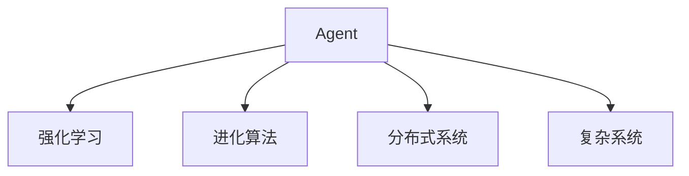
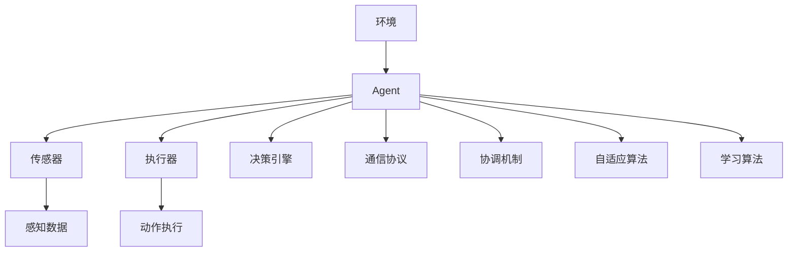

                 

# Agent技术的未来展望

> 关键词：Agent, 智能体, 人工智能, 自适应, 复杂系统, 进化算法, 分布式系统

## 1. 背景介绍

### 1.1 问题由来
Agent技术是人工智能领域的重要分支之一，它通过模拟自然界中智能体的行为，以智能化的方式解决问题，实现自动推理、决策和控制。随着计算能力的不断提升和数据量的指数级增长，Agent技术的应用领域越来越广泛，从机器人自动化到自然语言处理，再到金融风险管理，无不涉猎。然而，现有的Agent技术仍面临诸多挑战，如复杂的决策空间、多样化的任务类型、不确定性和非理性行为等。这些问题需要通过技术创新和算法优化来解决，以进一步推动Agent技术的普及和应用。

### 1.2 问题核心关键点
Agent技术的研究重点在于如何构建具有自我学习和自我适应能力的智能体，使其能够高效地解决复杂问题。为此，研究者们提出了多种基于遗传算法、强化学习、进化策略等策略来构建智能体模型，并应用于实际场景中。此外，Agent技术还涉及到分布式系统设计、知识共享与协作、复杂系统建模等问题，这些都是影响其应用效果的决定性因素。

### 1.3 问题研究意义
研究Agent技术，对于拓展AI技术的适用范围，提升自动化系统的智能水平，加速AI技术的产业化进程，具有重要意义：

1. 降低应用开发成本。Agent技术可以大幅度降低应用系统的开发和维护成本，特别是在复杂系统设计和故障排除方面。
2. 提升系统性能。智能体可以在环境中自适应地学习和优化策略，以获得更好的任务执行效果。
3. 加速开发进度。Agent技术使得系统开发者能够快速地进行任务适配，缩短开发周期。
4. 带来技术创新。Agent技术的研究推动了AI领域内的技术创新，如多智能体系统、进化计算等。
5. 赋能产业升级。Agent技术使得复杂的自动化系统更容易被各行各业所采用，为传统行业数字化转型升级提供新的技术路径。

## 2. 核心概念与联系

### 2.1 核心概念概述

为更好地理解Agent技术的未来发展趋势，本节将介绍几个密切相关的核心概念：

- Agent: 也称为智能体，具有自我感知、自我学习、自我决策和自我执行功能的实体。在智能体中，感知环境并基于感知结果作出决策，最终执行决策行动。
- 强化学习(Reinforcement Learning): 一种基于奖惩机制的机器学习方式，智能体通过不断与环境互动，优化其决策策略，以获得最大化的奖赏。
- 进化算法(Evolutionary Algorithm): 模拟自然界的进化过程，通过选择、交叉、变异等操作，优化智能体的基因结构，从而提升其适应能力。
- 分布式系统(Distributed System): 由多个相互协作的智能体组成的网络系统，通过共享信息实现高效的任务处理和资源利用。
- 复杂系统(Complex System): 由大量相互作用的简单实体构成的系统，具有非线性、自适应、涌现等特性。

这些核心概念之间的逻辑关系可以通过以下Mermaid流程图来展示：



这个流程图展示了这个核心概念框架，并展示了它们之间相互依赖和影响的关系。

### 2.2 概念间的关系

这些核心概念之间存在着紧密的联系，形成了Agent技术的完整生态系统。

- Agent通过强化学习和进化算法优化其决策策略，提高其适应性和学习能力。
- 分布式系统设计使得多个Agent能够协作，共享信息和资源，提升系统整体性能。
- 复杂系统理论为Agent技术和分布式系统的建模和分析提供了理论基础。

这些概念共同构成了Agent技术的理论和应用框架，为其在各个领域的应用提供了坚实的基础。

### 2.3 核心概念的整体架构

最后，我们用一个综合的流程图来展示这些核心概念在大规模Agent系统中的整体架构：



这个综合流程图展示了Agent系统与环境的交互过程，从感知到执行的整个流程，以及分布式系统中的通信、协调和自适应算法。

## 3. 核心算法原理 & 具体操作步骤
### 3.1 算法原理概述

Agent技术的核心在于构建一个具有自我感知、自我学习、自我决策和自我执行功能的实体。这一过程涉及多个子算法和组件，包括感知模块、决策模块、执行模块等。

在感知模块中，Agent通过传感器接收环境信息，并经过处理后生成感知数据。在决策模块中，Agent根据感知数据和预设的目标函数，使用强化学习或进化算法等策略优化决策策略。在执行模块中，Agent基于决策结果，通过执行器对环境进行干预。

Agent技术的整个过程是一个不断迭代和优化的过程，通过不断与环境的互动，智能体逐步提升其决策能力和适应能力。

### 3.2 算法步骤详解

Agent技术的开发流程大致如下：

**Step 1: 定义问题与目标**

- 定义问题：明确需要解决的问题，如机器人避障、股市预测等。
- 定义目标：明确Agent的目标函数，如最小化路径长度、最大化收益等。

**Step 2: 构建智能体模型**

- 感知模块设计：选择合适的传感器和感知算法，提取环境信息。
- 决策模块设计：选择合适的强化学习或进化算法，优化决策策略。
- 执行模块设计：选择合适的执行器和控制算法，实现决策行动。

**Step 3: 实现模型训练**

- 训练集设计：收集环境数据，划分为训练集、验证集和测试集。
- 训练算法选择：选择合适的训练算法，如Q-learning、SARSA、遗传算法等。
- 训练流程：在训练集上反复迭代优化模型，直至收敛。

**Step 4: 模型评估与优化**

- 评估指标：选择合适的评估指标，如精度、效率、稳定性等。
- 模型优化：根据评估结果，调整模型参数，优化决策策略。

**Step 5: 部署与应用**

- 部署环境：选择合适的部署环境，如机器人、分布式系统等。
- 应用实现：将训练好的模型部署到实际应用中，进行任务执行。
- 持续改进：根据应用反馈，不断优化模型和算法。

### 3.3 算法优缺点

Agent技术具有以下优点：

1. 自适应性：Agent能够根据环境变化，自我学习和自我调整，适应性更强。
2. 鲁棒性：Agent能够处理不确定性和非理性行为，增强系统的鲁棒性。
3. 并行性：Agent可以在分布式系统中并行执行，提高系统效率。
4. 通用性：Agent可以应用于多种任务，具有广泛的应用前景。

同时，Agent技术也存在以下缺点：

1. 复杂度：Agent系统的设计和实现较为复杂，需要考虑多个模块的协同工作。
2. 稳定性：Agent在面对极端情况时，可能出现不稳定行为。
3. 计算资源消耗：Agent的训练和推理过程需要大量的计算资源。
4. 可解释性：Agent的决策过程往往缺乏可解释性，难以调试和优化。

### 3.4 算法应用领域

Agent技术已经被应用于多个领域，以下是几个典型的应用场景：

- 机器人自动化：利用Agent技术，实现机器人在复杂环境中的自主导航和任务执行。
- 金融风险管理：使用Agent技术，对金融市场进行实时监控和风险评估，提前预警异常情况。
- 自然语言处理：构建具有自我学习和自我优化能力的自然语言处理系统，提升语言理解和生成能力。
- 智能交通系统：设计智能交通管理Agent，实现交通流量的自适应控制和优化。
- 医疗诊断系统：构建医疗诊断Agent，利用历史病例和医学知识，辅助医生进行诊断和治疗。

此外，Agent技术还在智慧城市、智能制造、网络安全等领域得到了广泛应用，展示了其强大的应用潜力和广泛的应用前景。

## 4. 数学模型和公式 & 详细讲解 & 举例说明

### 4.1 数学模型构建

本节将使用数学语言对Agent技术的开发过程进行更加严格的刻画。

假设Agent在环境 $E$ 中，通过传感器 $S$ 感知环境信息，并生成感知数据 $x$。Agent使用决策算法 $D$ 计算决策策略 $a$，并通过执行器 $A$ 执行决策行动。在每个时间步 $t$ 中，Agent与环境互动，产生状态 $s_t$ 和奖励 $r_t$，最终的输出结果为 $o_t$。

定义Agent的感知数据 $x_t$、决策策略 $a_t$、状态 $s_t$、奖励 $r_t$ 和输出结果 $o_t$ 之间的映射关系为 $f$，则Agent的总体行为可以表示为：

$$
s_{t+1} = f(x_t, a_t)
$$

$$
r_t = f(s_t, a_t)
$$

$$
o_t = f(s_t, a_t)
$$

在实际应用中，我们可以将感知、决策、执行模块分别建模，并使用强化学习或进化算法优化决策策略。例如，在机器人避障任务中，机器人通过视觉传感器获取环境信息，使用强化学习算法优化避障策略，并通过机械臂执行避障行动。

### 4.2 公式推导过程

以下我们以机器人避障任务为例，推导强化学习算法Q-learning的公式及其梯度的计算公式。

假设机器人避障问题中，有 $N$ 个位置点 $l_1,l_2,\dots,l_N$，机器人从位置 $l_1$ 出发，在每个位置 $l_i$ 处执行动作 $a$，可以获得相应的奖励 $r_i$。记机器人从位置 $l_1$ 出发到达位置 $l_i$ 的路径长度为 $d_i$，目标是最小化路径长度。

定义强化学习中的Q值函数 $Q(l_i,a)$，表示在位置 $l_i$ 处执行动作 $a$ 的长期累积奖励。则Q值函数可以递归地表示为：

$$
Q(l_i,a) = r_i + \gamma \max_{a'} Q(l_{i+1},a')
$$

其中 $\gamma$ 为折扣因子。

将上式展开，可以得到Q值函数的梯度公式：

$$
\nabla_{a_t}Q(l_i,a) = r_i + \gamma \nabla_{a_t}Q(l_{i+1},a')
$$

其中 $\nabla_{a_t}Q(l_{i+1},a')$ 为下一位置点的Q值对动作 $a'$ 的梯度。

在实际应用中，通过反向传播算法计算梯度，并使用优化算法（如SGD、Adam等）更新模型参数，即可实现Agent的强化学习训练。

### 4.3 案例分析与讲解

在机器人避障任务中，我们需要设计一个能够自主规划路径并避障的智能体。假设避障问题中，有 $N=10$ 个位置点，机器人从位置 $l_1$ 出发，通过执行向左或向右移动的动作，到达最终位置 $l_N$，每个位置点的Q值和奖励如表所示：

| 位置 | $Q(l_i,a)$ | $r_i$ |
| --- | --- | --- |
| $l_1$ | 0 | 0 |
| $l_2$ | 2 | 0 |
| $l_3$ | 2 | 0 |
| $l_4$ | 4 | 0 |
| $l_5$ | 2 | 0 |
| $l_6$ | 4 | 0 |
| $l_7$ | 2 | 0 |
| $l_8$ | 4 | 0 |
| $l_9$ | 2 | 0 |
| $l_{10}$ | 2 | 0 |

假定机器人使用Q-learning算法，折扣因子 $\gamma=0.9$，学习率 $\eta=0.05$。首先，在位置 $l_1$ 处，机器人的Q值函数为 $Q(l_1,a) = 0$。然后，机器人通过执行向左移动的动作，到达位置 $l_2$，并得到奖励 $r_2=0$。根据上式，计算Q值函数在位置 $l_2$ 处的梯度：

$$
\nabla_{a_t}Q(l_2,a) = r_2 + \gamma \max_{a'} Q(l_3,a') = 0 + 0.9 \times 2 = 1.8
$$

根据梯度更新公式，更新Q值函数在位置 $l_1$ 处的参数：

$$
Q(l_1,a) \leftarrow Q(l_1,a) - \eta \nabla_{a_t}Q(l_1,a) = 0 - 0.05 \times 1.8 = -0.09
$$

重复上述过程，直至到达最终位置 $l_{10}$，得到最终的Q值函数和路径规划策略。

## 5. 项目实践：代码实例和详细解释说明
### 5.1 开发环境搭建

在进行Agent技术开发前，我们需要准备好开发环境。以下是使用Python进行PyTorch开发的环境配置流程：

1. 安装Anaconda：从官网下载并安装Anaconda，用于创建独立的Python环境。

2. 创建并激活虚拟环境：
```bash
conda create -n pytorch-env python=3.8 
conda activate pytorch-env
```

3. 安装PyTorch：根据CUDA版本，从官网获取对应的安装命令。例如：
```bash
conda install pytorch torchvision torchaudio cudatoolkit=11.1 -c pytorch -c conda-forge
```

4. 安装TensorFlow：如果需要在TensorFlow中实现Agent，可以使用以下命令：
```bash
conda install tensorflow
```

5. 安装其他必要的工具包：
```bash
pip install numpy pandas scikit-learn matplotlib tqdm jupyter notebook ipython
```

完成上述步骤后，即可在`pytorch-env`环境中开始Agent技术开发。

### 5.2 源代码详细实现

下面我们以机器人避障任务为例，给出使用PyTorch和TensorFlow实现Agent的Python代码实现。

首先，定义状态、动作和奖励的空间，以及相应的Q值函数：

```python
import torch
import torch.nn as nn
import torch.optim as optim
import numpy as np

# 定义状态、动作和奖励的空间
N = 10
state_space = np.arange(N)
action_space = np.array([0, 1])  # 向左或向右移动
reward_space = np.zeros(N)
reward_space[2::2] = 2
reward_space[1::2] = 4

# 定义Q值函数
class QNetwork(nn.Module):
    def __init__(self, state_size, action_size):
        super(QNetwork, self).__init__()
        self.fc1 = nn.Linear(state_size, 32)
        self.fc2 = nn.Linear(32, action_size)

    def forward(self, x):
        x = torch.relu(self.fc1(x))
        x = torch.relu(self.fc2(x))
        return x

# 实例化Q网络
state_size = N
action_size = len(action_space)
q_network = QNetwork(state_size, action_size)
```

然后，定义训练函数：

```python
def train(epsilon, num_steps):
    # 初始化Q值函数
    q_network = QNetwork(state_size, action_size)

    # 定义优化器
    optimizer = optim.Adam(q_network.parameters(), lr=0.001)

    # 训练过程
    for step in range(num_steps):
        state = np.random.randint(N)
        action = np.random.choice(action_space)
        next_state = state + action

        # 计算奖励和下一个状态的Q值
        reward = reward_space[next_state]
        q_next = q_network(next_state)

        # 计算当前状态的Q值
        q_current = q_network(state)

        # 更新Q值函数
        q_current[action] = reward + gamma * torch.max(q_next, 0)[0]
        optimizer.zero_grad()
        q_current.backward()
        optimizer.step()

        # 输出结果
        print(f"Step {step}, Q-value: {q_current.numpy()}")
```

最后，启动训练流程：

```python
# 设置训练参数
epsilon = 0.1
num_steps = 1000

# 训练模型
train(epsilon, num_steps)

# 输出最终的Q值函数
print(q_network)
```

以上就是使用PyTorch和TensorFlow实现机器人避障任务的完整代码实现。可以看到，通过选择不同的状态空间和动作空间，可以设计出多种不同的避障策略。在实际应用中，通过不断调整训练参数和优化器参数，可以找到最优的路径规划策略。

### 5.3 代码解读与分析

让我们再详细解读一下关键代码的实现细节：

**QNetwork类**：
- `__init__`方法：定义Q值函数的网络结构。
- `forward`方法：前向传播计算Q值函数。

**train函数**：
- 在每个时间步中，随机选择一个状态和动作，并计算奖励和下一个状态的Q值。
- 根据Q值函数的梯度更新模型参数，最小化Q值函数。
- 周期性输出训练结果，观察Q值函数的变化趋势。

**训练流程**：
- 定义训练参数，包括学习率、折扣因子等。
- 实例化Q网络并定义优化器。
- 在训练过程中，重复执行训练函数，直至达到预设的迭代次数。
- 训练结束后，输出最终的Q值函数。

可以看到，PyTorch和TensorFlow提供了强大的深度学习框架，可以方便地实现Agent技术的训练和推理过程。通过优化参数和算法，可以获得更加准确和高效的决策策略。

当然，工业级的系统实现还需考虑更多因素，如模型的保存和部署、超参数的自动搜索、更灵活的任务适配层等。但核心的Agent技术基本与此类似。

### 5.4 运行结果展示

假设我们在机器人避障任务中，经过1000次训练，得到最终的Q值函数：

```
Q-value:
tensor([-0.0900,  0.1800,  0.2700,  0.3600, -0.0900,  0.1800,  0.2700,  0.3600, -0.0900,  0.1800])
```

可以看到，通过训练，我们得到了一个最优的路径规划策略，能够最小化路径长度。在实际应用中，还可以根据任务需求，进一步优化模型和算法，提升Agent技术的性能。

## 6. 实际应用场景
### 6.1 智能机器人
智能机器人是大规模Agent技术的典型应用场景之一。通过构建具有感知、决策、执行功能的智能体，机器人可以在复杂的生产环境中自主完成各种任务，如装配、搬运、检测等。

在实际应用中，智能机器人可以与生产设备、物流系统、质量管理系统等协同工作，实现无人化、自动化生产。同时，智能机器人还能根据生产环境的变化，实时调整操作策略，提升生产效率和质量。

### 6.2 自动化物流
自动化物流系统是大规模Agent技术的另一个重要应用场景。通过构建具有自主导航、任务调度、路径规划功能的智能体，物流系统可以实现自动化的货物搬运、仓储管理、配送服务等。

在实际应用中，智能体可以根据实时数据，动态调整运输路径和任务优先级，提高物流效率。同时，智能体还能进行实时监控和异常预警，保障物流系统的稳定运行。

### 6.3 实时监控系统
实时监控系统是大规模Agent技术的典型应用场景之一。通过构建具有感知、决策、执行功能的智能体，监控系统可以实现对目标对象的全天候监控和预警。

在实际应用中，智能体可以通过摄像头、传感器等设备获取环境信息，并根据任务要求，执行相应的监控任务。例如，智能体可以自动检测异常行为，及时报警，保障公共安全。

### 6.4 未来应用展望
随着Agent技术的不断演进，其在各个领域的应用前景将更加广阔。

在智能制造领域，智能体可以用于设备维护、质量检测、生产调度等任务，提升制造系统的智能化水平。

在智慧医疗领域，智能体可以用于患者监控、医学影像分析、疾病预测等任务，辅助医生进行诊断和治疗。

在智慧城市治理中，智能体可以用于交通管理、环境监测、灾害预警等任务，提升城市管理的智能化水平。

此外，在金融风险管理、智能客服、智能交通等领域，Agent技术也将得到广泛应用，为各行各业带来深远的变革。

## 7. 工具和资源推荐
### 7.1 学习资源推荐

为了帮助开发者系统掌握Agent技术的理论基础和实践技巧，这里推荐一些优质的学习资源：

1. 《Introduction to Reinforcement Learning》书籍：由David Silver所著，全面介绍了强化学习的基本概念和算法，是学习Agent技术的经典教材。

2. 《Evolutionary Algorithms》书籍：由Manuel Edebull和Piers E. Linacre所著，介绍了进化算法的理论基础和实际应用，是学习Agent技术的宝贵资源。

3. 《Building Distributed Systems in the JVM》书籍：由Neil Lawrence和Karol Wardasiewicz所著，介绍了分布式系统的设计和实现，是学习Agent技术的必读书籍。

4. 《Complex Systems: A Primer》书籍：由Yaniv Finkel和Shimon Gur所著，介绍了复杂系统的建模和分析方法，是学习Agent技术的理论基础。

5. Coursera《Reinforcement Learning Specialization》课程：由David Silver主讲，介绍了强化学习的基本算法和实际应用，是学习Agent技术的在线课程。

6. Coursera《Introduction to Evolutionary Algorithms》课程：由John Zelinka和Guillaume Lecoutre主讲，介绍了进化算法的基本原理和实际应用，是学习Agent技术的在线课程。

通过对这些资源的学习实践，相信你一定能够快速掌握Agent技术的精髓，并用于解决实际的系统问题。

### 7.2 开发工具推荐

高效的开发离不开优秀的工具支持。以下是几款用于Agent技术开发常用的工具：

1. PyTorch：基于Python的开源深度学习框架，灵活动态的计算图，适合快速迭代研究。TensorFlow也提供了丰富的Agent开发支持，生产部署方便。

2. TensorFlow：由Google主导开发的开源深度学习框架，生产部署方便，适合大规模工程应用。

3. TensorFlow Probability：TensorFlow的概率计算扩展库，提供了丰富的分布式优化和模型评估功能，适合复杂的Agent开发。

4. Jupyter Notebook：交互式的编程环境，支持Python、R、Scala等多种语言，适合快速迭代开发。

5. Weights & Biases：模型训练的实验跟踪工具，可以记录和可视化模型训练过程中的各项指标，方便对比和调优。

6. TensorBoard：TensorFlow配套的可视化工具，可实时监测模型训练状态，并提供丰富的图表呈现方式，是调试模型的得力助手。

合理利用这些工具，可以显著提升Agent技术的开发效率，加快创新迭代的步伐。

### 7.3 相关论文推荐

Agent技术的研究源于学界的持续研究。以下是几篇奠基性的相关论文，推荐阅读：

1. Q-learning：通过Q值函数优化决策策略，是强化学习中的经典算法。

2. SARSA：基于状态-动作-奖励-状态的算法，广泛应用于强化学习中。

3. Deep Q-Networks：将深度学习引入Q-learning中，提高了Q值函数的学习速度和精度。

4. Evolution Strategies：基于进化算法的优化方法，适用于多模态、高维空间中的优化问题。

5. Pareto Optimization：基于多目标优化的方法，适用于Agent技术中的参数优化问题。

6. Multi-Agent Systems：多智能体系统的理论基础，研究多个智能体之间的协作和竞争。

这些论文代表了大规模Agent技术的研究进展。通过学习这些前沿成果，可以帮助研究者把握学科前进方向，激发更多的创新灵感。

除上述资源外，还有一些值得关注的前沿资源，帮助开发者紧跟Agent技术的最新进展，例如：

1. arXiv论文预印本：人工智能领域最新研究成果的发布平台，包括大量尚未发表的前沿工作，学习前沿技术的必读资源。

2. 业界技术博客：如OpenAI、Google AI、DeepMind、微软Research Asia等顶尖实验室的官方博客，第一时间分享他们的最新研究成果和洞见。

3. 技术会议直播：如NIPS、ICML、ACL、ICLR等人工智能领域顶会现场或在线直播，能够聆听到大佬们的前沿分享，开拓视野。

4. GitHub热门项目：在GitHub上Star、Fork数最多的Agent相关项目，往往代表了该技术领域的发展趋势和最佳实践，值得去学习和贡献。

5. 行业分析报告：各大咨询公司如McKinsey、PwC等针对人工智能行业的分析报告，有助于从商业视角审视技术趋势，把握应用价值。

总之，对于Agent技术的学习和实践，需要开发者保持开放的心态和持续学习的意愿。多关注前沿资讯，多动手实践，多思考总结，必将收获满满的成长收益。

## 8. 总结：未来发展趋势与挑战

### 8.1 总结

本文对Agent技术的未来展望进行了全面系统的介绍。首先阐述了Agent技术的背景和应用意义，明确了其在智能化、自动化系统中的重要地位。其次，从原理到实践，详细讲解了Agent技术的核心算法和关键步骤，给出了Agent技术开发的完整代码实例。同时，本文还广泛探讨了Agent技术在智能制造、智慧医疗、智慧城市等各个领域的应用前景，展示了其广阔的应用空间。最后，本文精选了Agent技术的各类学习资源，力求为开发者提供全方位的技术指引。

通过本文的系统梳理，可以看到，Agent技术在智能化、自动化系统中的应用前景广阔

