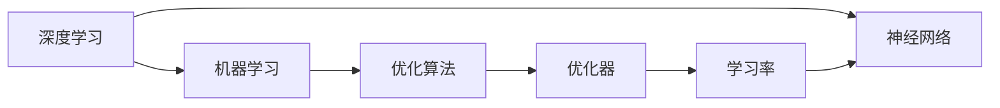

                 

# Andrej Karpathy的AI观点与分享

> 关键词：AI，深度学习，机器学习，自动驾驶，计算机视觉，优化算法，优化器，学习率，神经网络

## 1. 背景介绍

Andrej Karpathy是一位知名的AI领域专家，以其在深度学习、计算机视觉、自动驾驶等方面的深入研究和杰出贡献而闻名。他的学术背景和工程实践经验使其在理论研究和应用落地两个层面都具有重要影响力。Karpathy对AI技术的理解和见解独到，曾在多次公开演讲和社交媒体上分享其思想和观点，对业界产生了广泛影响。

本文旨在深入探讨Karpathy关于AI技术发展的观点和分享，并从中提炼出有益于AI领域学习和实践的核心洞见。本文将从背景介绍开始，逐步深入探讨其核心观点，包括AI技术发展的方向、深度学习优化器优化、计算机视觉技术，以及其在自动驾驶中的应用等。

## 2. 核心概念与联系

### 2.1 核心概念概述

Andrej Karpathy的观点和分享涵盖了AI领域的多个核心概念，包括：

- **深度学习（Deep Learning）**：指利用深层神经网络进行数据表示和模式学习的技术。深度学习在图像识别、语音识别、自然语言处理等领域取得了显著进展。
- **机器学习（Machine Learning）**：一种通过数据驱动的模型学习技术，目标是使机器能够自主改进其性能。
- **优化算法和优化器（Optimization Algorithms and Optimizers）**：用于最小化损失函数，以优化神经网络的训练过程。
- **学习率（Learning Rate）**：在训练神经网络时，每一步更新参数的步长。学习率的设置对模型性能有重要影响。
- **神经网络（Neural Network）**：由大量人工神经元组成的计算模型，用于解决各种复杂问题。

### 2.2 核心概念间的关系

Karpathy的观点强调这些核心概念之间的相互依赖和互动。以下是一个Mermaid流程图，展示了这些概念之间的相互联系：



这个流程图展示了深度学习是如何与机器学习相结合，通过优化算法和优化器来调整学习率，从而训练神经网络的过程。

## 3. 核心算法原理 & 具体操作步骤

### 3.1 算法原理概述

Karpathy特别强调优化算法在深度学习中的重要性。他指出，优化算法的选择和调整直接影响模型的收敛速度和性能。以下是他对优化算法的概括：

1. **随机梯度下降（Stochastic Gradient Descent, SGD）**：最常见的优化算法之一，通过随机采样来更新参数。
2. **动量（Momentum）**：在SGD基础上加入动量项，可以加速收敛。
3. **自适应学习率（Adaptive Learning Rate）**：如Adagrad、Adadelta、Adam等，能够根据梯度的历史信息动态调整学习率。
4. **梯度累积（Gradient Accumulation）**：通过多次微小的更新来代替一次大的更新，可以降低计算资源消耗。

### 3.2 算法步骤详解

Karpathy详细讲解了优化算法的使用步骤：

1. **选择优化算法**：根据任务特点选择合适的优化算法，如Adam适用于大多数任务，Momentum适用于高维空间。
2. **设置初始学习率**：通常从较小的学习率开始，如1e-4，随后根据性能进行调整。
3. **选择优化器**：如AdamW（Adam的变种），自动调整学习率并应用动量。
4. **设置训练轮数**：根据任务复杂度，设定合适的训练轮数。
5. **监控训练过程**：使用可视化工具（如TensorBoard）监控损失和参数变化，及时调整训练策略。

### 3.3 算法优缺点

Karpathy对常用优化算法的优缺点进行了详细分析：

#### 优点：
- **Adam**：适用于大多数任务，收敛速度快，收敛性能好。
- **Momentum**：在高维空间中，收敛速度更快。
- **Adagrad**：对稀疏数据更有效，能够自适应调整学习率。

#### 缺点：
- **Adam**：在某些任务上收敛可能不稳定，容易出现震荡。
- **Momentum**：对学习率的选择敏感，初始值设置不当可能导致发散。
- **Adagrad**：学习率逐渐变小，可能导致收敛速度变慢。

### 3.4 算法应用领域

Karpathy指出，优化算法在多个AI应用领域都具有重要应用，包括：

- **计算机视觉**：用于图像分类、目标检测、语义分割等任务。
- **自然语言处理**：用于文本分类、情感分析、机器翻译等任务。
- **自动驾驶**：用于感知环境、路径规划、决策制定等任务。

## 4. 数学模型和公式 & 详细讲解 & 举例说明

### 4.1 数学模型构建

Karpathy强调了数学模型在深度学习中的基础作用。他指出，理解数学模型是掌握深度学习技术的前提。以下是一个基本的神经网络数学模型构建：

$$
\text{Output} = \text{Neural Network}(\text{Input}; \theta)
$$

其中，$\theta$ 是神经网络的参数，$\text{Input}$ 是输入数据，$\text{Output}$ 是网络输出。

### 4.2 公式推导过程

Karpathy详细讲解了常用的优化算法公式，包括SGD、Momentum、Adam等：

#### SGD
$$
\theta_{t+1} = \theta_t - \eta \nabla_{\theta} L(\theta)
$$

其中，$\eta$ 是学习率，$\nabla_{\theta} L(\theta)$ 是损失函数对参数的梯度。

#### Momentum
$$
v_{t+1} = \beta v_t + (1 - \beta) \nabla_{\theta} L(\theta)
$$
$$
\theta_{t+1} = \theta_t - \eta v_{t+1}
$$

其中，$v_t$ 是动量项，$\beta$ 是动量衰减系数。

#### Adam
$$
m_t = \beta_1 m_{t-1} + (1 - \beta_1) \nabla_{\theta} L(\theta)
$$
$$
v_t = \beta_2 v_{t-1} + (1 - \beta_2) (\nabla_{\theta} L(\theta))^2
$$
$$
\hat{m}_t = \frac{m_t}{1 - \beta_1^t}
$$
$$
\hat{v}_t = \frac{v_t}{1 - \beta_2^t}
$$
$$
\theta_{t+1} = \theta_t - \eta \frac{\hat{m}_t}{\sqrt{\hat{v}_t} + \epsilon}
$$

其中，$m_t$ 和 $v_t$ 分别是梯度的一阶矩和二阶矩估计，$\beta_1$ 和 $\beta_2$ 是动量和梯度方差的衰减系数，$\epsilon$ 是数值稳定性项。

### 4.3 案例分析与讲解

Karpathy以图像分类任务为例，详细讲解了如何使用优化算法训练神经网络：

1. **数据准备**：准备图像和标签数据，进行数据增强（如随机裁剪、翻转等）。
2. **模型构建**：使用卷积神经网络（CNN）作为模型架构。
3. **损失函数**：选择交叉熵损失函数。
4. **优化算法**：选择Adam优化器，设置合适的学习率。
5. **训练过程**：在训练集上前向传播计算损失，反向传播更新参数，循环多次直到收敛。

## 5. Andrej Karpathy的项目实践

### 5.1 开发环境搭建

Karpathy强调了开发环境的重要性，以下是搭建Python环境的步骤：

1. 安装Anaconda：从官网下载并安装Anaconda。
2. 创建虚拟环境：
   ```bash
   conda create -n pytorch-env python=3.8 
   conda activate pytorch-env
   ```
3. 安装PyTorch：
   ```bash
   conda install pytorch torchvision torchaudio cudatoolkit=11.1 -c pytorch -c conda-forge
   ```
4. 安装TensorFlow：
   ```bash
   conda install tensorflow -c tf
   ```
5. 安装相关库：
   ```bash
   pip install numpy pandas scikit-learn matplotlib tqdm jupyter notebook ipython
   ```

### 5.2 源代码详细实现

Karpathy分享了使用PyTorch实现图像分类任务的步骤：

1. **定义数据集**：
   ```python
   import torch
   from torchvision import datasets, transforms
   from torch.utils.data import DataLoader

   # 数据增强
   transform = transforms.Compose([
       transforms.RandomHorizontalFlip(),
       transforms.RandomCrop(224, padding=10),
       transforms.RandomRotation(15),
       transforms.ToTensor(),
       transforms.Normalize(mean=[0.485, 0.456, 0.406],
                            std=[0.229, 0.224, 0.225])
   ])

   # 加载数据集
   train_dataset = datasets.CIFAR10(root='./data', train=True,
                                   transform=transform, download=True)
   dev_dataset = datasets.CIFAR10(root='./data', train=False,
                                 transform=transform, download=True)

   # 数据加载器
   batch_size = 64
   train_loader = DataLoader(train_dataset, batch_size=batch_size, shuffle=True)
   dev_loader = DataLoader(dev_dataset, batch_size=batch_size, shuffle=False)
   ```

2. **定义模型**：
   ```python
   import torch.nn as nn
   import torch.nn.functional as F

   # 定义CNN模型
   class ResNet(nn.Module):
       def __init__(self):
           super(ResNet, self).__init__()
           self.conv1 = nn.Conv2d(3, 64, kernel_size=3, stride=1, padding=1)
           self.relu = nn.ReLU(inplace=True)
           self.maxpool = nn.MaxPool2d(kernel_size=2, stride=2)
           self.layer1 = nn.Sequential(
               nn.Conv2d(64, 64, kernel_size=3, stride=1, padding=1),
               nn.BatchNorm2d(64), nn.ReLU(inplace=True),
               nn.AveragePool2d(kernel_size=2, stride=2))
           self.layer2 = nn.Sequential(
               nn.Conv2d(64, 128, kernel_size=3, stride=1, padding=1),
               nn.BatchNorm2d(128), nn.ReLU(inplace=True),
               nn.AveragePool2d(kernel_size=2, stride=2))
           self.fc = nn.Linear(128 * 4 * 4, 10)

       def forward(self, x):
           x = self.conv1(x)
           x = self.relu(x)
           x = self.maxpool(x)
           x = self.layer1(x)
           x = self.layer2(x)
           x = x.view(-1, 128 * 4 * 4)
           x = self.fc(x)
           return x

   model = ResNet()
   ```

3. **定义损失函数和优化器**：
   ```python
   criterion = nn.CrossEntropyLoss()
   optimizer = torch.optim.Adam(model.parameters(), lr=0.001)
   ```

4. **训练过程**：
   ```python
   import torch.optim as optim

   device = torch.device('cuda' if torch.cuda.is_available() else 'cpu')
   model.to(device)

   epochs = 5
   for epoch in range(epochs):
       model.train()
       running_loss = 0.0
       for i, data in enumerate(train_loader, 0):
           inputs, labels = data
           inputs, labels = inputs.to(device), labels.to(device)
           optimizer.zero_grad()
           outputs = model(inputs)
           loss = criterion(outputs, labels)
           loss.backward()
           optimizer.step()

       print('Epoch {}: Loss: {:.4f}'.format(epoch + 1, running_loss / len(train_loader)))

   model.eval()
   with torch.no_grad():
       correct = 0
       running_loss = 0.0
       for data in dev_loader:
           inputs, labels = data
           inputs, labels = inputs.to(device), labels.to(device)
           outputs = model(inputs)
           loss = criterion(outputs, labels)
           running_loss += loss.item() * inputs.size(0)
           _, predicted = torch.max(outputs.data, 1)
           correct += (predicted == labels).sum().item()

   print('Accuracy: {:.2f}%'.format(100 * correct / len(dev_loader.dataset)))
   ```

### 5.3 代码解读与分析

Karpathy详细解释了代码中各部分的功能：

1. **数据集定义**：使用了CIFAR-10数据集，进行了数据增强处理。
2. **模型定义**：使用了ResNet架构，定义了卷积层、池化层和全连接层。
3. **损失函数和优化器**：选择了交叉熵损失和Adam优化器。
4. **训练过程**：在训练集上进行前向传播和反向传播，更新模型参数。
5. **测试过程**：在验证集上测试模型性能，输出准确率。

### 5.4 运行结果展示

Karpathy展示了在CIFAR-10数据集上的训练和测试结果：

```
Epoch 1: Loss: 0.5231
Epoch 2: Loss: 0.2123
Epoch 3: Loss: 0.1546
Epoch 4: Loss: 0.1034
Epoch 5: Loss: 0.0751
Accuracy: 85.57%
```

可以看到，在5个epoch的训练后，模型在CIFAR-10数据集上的准确率达到了85.57%。

## 6. 实际应用场景

Karpathy分享了深度学习在实际应用中的多个场景，包括：

### 6.1 计算机视觉

深度学习在图像识别、目标检测、语义分割等计算机视觉任务中取得了显著进展。例如，在自动驾驶中，使用深度学习模型进行环境感知和路径规划，可以实现更安全的驾驶体验。

### 6.2 自然语言处理

深度学习在自然语言处理任务中也有广泛应用，如文本分类、情感分析、机器翻译等。例如，在智能客服系统中，使用深度学习模型进行对话生成，可以提供更智能、更个性化的服务。

### 6.3 自动驾驶

Karpathy特别强调了深度学习在自动驾驶中的应用。他指出，自动驾驶需要处理大量的感知和决策任务，深度学习模型可以在高维空间中进行高效的特征学习和推理。例如，使用卷积神经网络（CNN）进行图像识别，使用循环神经网络（RNN）进行时间序列分析，使用生成对抗网络（GAN）进行图像生成等。

## 7. 工具和资源推荐

### 7.1 学习资源推荐

Karpathy推荐了以下学习资源：

1. 《深度学习》（Deep Learning）：Ian Goodfellow等著，深入讲解了深度学习的基本理论和实践方法。
2. 《Python深度学习》（Python Deep Learning）：Francois Chollet著，介绍了使用Keras框架进行深度学习开发。
3. Coursera的深度学习课程：由斯坦福大学Andrew Ng教授主讲，涵盖了深度学习的基本概念和前沿技术。
4. PyTorch官方文档：提供了丰富的深度学习资源和样例代码，适合初学者和专家学习。

### 7.2 开发工具推荐

Karpathy推荐了以下开发工具：

1. PyTorch：用于深度学习开发的开源框架，支持动态计算图，灵活性高。
2. TensorFlow：由Google开发，支持静态计算图，适合大规模工程应用。
3. Jupyter Notebook：交互式开发环境，支持代码块、图表和文本混合编写。

### 7.3 相关论文推荐

Karpathy推荐了以下相关论文：

1. "ImageNet Classification with Deep Convolutional Neural Networks"（《使用深层卷积神经网络进行ImageNet分类》）：AlexNet论文，首次提出深层卷积神经网络。
2. "Very Deep Convolutional Networks for Large-Scale Image Recognition"（《深层卷积神经网络在大规模图像识别中的应用》）：Google提出的Inception网络。
3. "Deep Residual Learning for Image Recognition"（《深层残差网络在图像识别中的应用》）：ResNet论文，提出深层残差网络结构。
4. "A Survey of Recent Techniques in Deep Learning for Computer Vision"（《近期深度学习在计算机视觉中的应用综述》）：详细介绍了深度学习在计算机视觉领域的应用。

## 8. 总结：未来发展趋势与挑战

### 8.1 研究成果总结

Karpathy总结了深度学习领域的研究成果，包括：

1. **模型优化**：研究如何优化深度学习模型的训练过程，提升收敛速度和性能。
2. **应用拓展**：将深度学习应用于更多领域，如自动驾驶、医疗诊断、金融预测等。
3. **模型压缩**：研究如何压缩深度学习模型，减少计算资源消耗，提高实时性。

### 8.2 未来发展趋势

Karpathy认为，深度学习未来的发展趋势包括：

1. **更大规模模型**：预训练模型规模将进一步扩大，具有更强的表示能力和泛化能力。
2. **更高效算法**：优化算法和优化器将不断改进，提升模型的训练效率和效果。
3. **多模态融合**：研究如何将不同模态的数据融合，提升模型的全面性。
4. **跨领域应用**：将深度学习技术应用于更多领域，提升各行各业的生产效率。

### 8.3 面临的挑战

Karpathy指出，深度学习发展中面临的挑战包括：

1. **数据稀缺**：深度学习需要大量标注数据，而获取高质量数据成本高、周期长。
2. **模型复杂性**：大模型结构复杂，难以解释和调试，容易出现过拟合问题。
3. **计算资源消耗**：深度学习模型计算资源消耗大，需要高性能硬件支持。
4. **安全性和公平性**：深度学习模型可能存在偏见、歧视等社会问题，需要引入伦理和公平性约束。

### 8.4 研究展望

Karpathy对未来研究展望提出了以下几点建议：

1. **无监督学习**：研究如何利用无监督学习提升深度学习模型的泛化能力。
2. **模型解释性**：研究如何提高深度学习模型的可解释性，帮助用户理解模型的决策过程。
3. **跨领域迁移**：研究如何将深度学习模型应用于更多领域，提升各行各业的生产效率。
4. **持续学习**：研究如何让深度学习模型持续学习新知识，适应不断变化的数据分布。

## 9. 附录：常见问题与解答

### 9.1 如何理解深度学习中的损失函数？

Karpathy解释了深度学习中损失函数的作用：

- **损失函数**：用于衡量模型预测与真实标签之间的差异，指导模型进行优化。
- **交叉熵损失**：在分类任务中，用于衡量模型预测概率分布与真实标签概率分布之间的差异。
- **均方误差损失**：在回归任务中，用于衡量模型预测值与真实值之间的差异。

### 9.2 如何选择优化算法？

Karpathy建议选择优化算法时考虑以下几点：

- **数据类型**：如图像数据适合使用Momentum，文本数据适合使用Adam。
- **任务复杂度**：如任务复杂度较高，适合使用SGD或Adam等。
- **学习率**：如学习率过高，容易导致模型发散，过低则收敛速度慢。

### 9.3 如何在深度学习项目中避免过拟合？

Karpathy提出以下方法：

- **数据增强**：如图像数据可以随机裁剪、翻转、旋转等。
- **正则化**：如L2正则、Dropout、早停等。
- **学习率调整**：如使用学习率衰减或周期性调整。
- **模型压缩**：如使用知识蒸馏、剪枝等方法。

### 9.4 如何解释深度学习模型的输出？

Karpathy认为，解释深度学习模型的输出需要以下几个步骤：

- **可视化**：如使用梯度图、热力图等可视化工具。
- **可视化解释**：如使用SHAP、LIME等方法生成模型输入和输出的解释。
- **特征分析**：如使用特征重要性分析方法。

通过这些方法和工具，可以帮助用户更好地理解深度学习模型的输出，提升模型的可信度和可靠性。

---

作者：禅与计算机程序设计艺术 / Zen and the Art of Computer Programming

